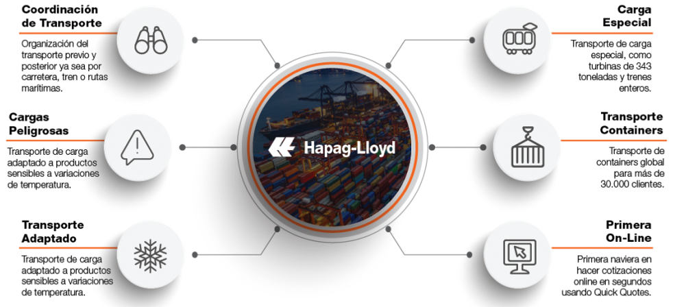
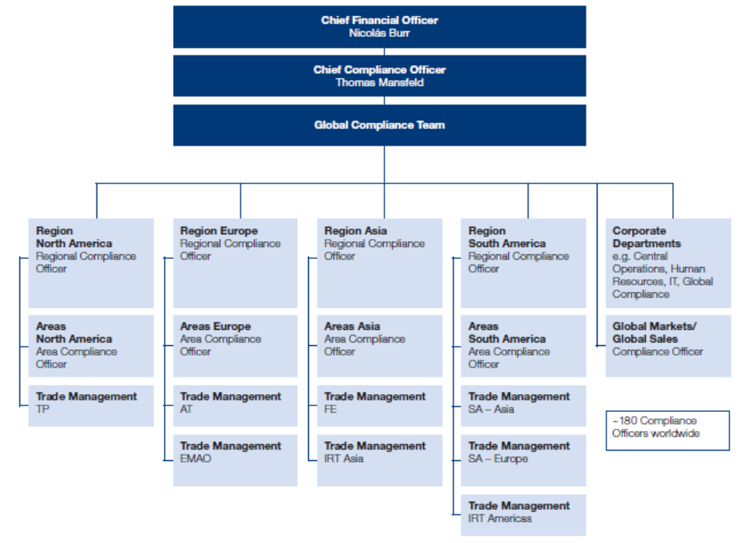

> [1. Descripción de la Empresa Elegida](../1.md) › [1.1. Datos de la Empresa](1.1.md)

# 1.1. Datos de la Empresa

## Descripción de la empresa
Hapag-Lloyd es una línea naviera alemana líder en transporte marítimo de contenedores, con sede en Alemania y más de 175 años de historia. Posee una de las flotas más grandes del mundo, con presencia en más de 130 países. Ofrece soluciones logísticas que abarcan transporte marítimo, servicios de terminal e infraestructura, así como transporte terrestre complementario. Su enfoque está en la calidad, la sostenibilidad y la innovación digital para facilitar el comercio global de manera eficiente y confiable.

  

## Datos Generales
 - Nombre Completo: Hapag-Lloyd
 - RUC: 20492185087
 - Dirección: Calle Dean Valdivia 148, Torre A, Piso 03, San Isidro, Lima, Perú
 - Teléfono: +51-1-700-7990 / +51-1-421-7533
 - Sector de actividad: Transporte internacional marítimo de contenedores.
 - Tamaño de la empresa: aproximadamente 16,900 empleados a nivel global, sede principal en Hamburgo, Alemania.

## Descripción de productos o servicios
 - Transporte marítimo de carga en contenedores (dry cargo, reefer, carga especializada, mercancías peligrosas).
 - Servicios de terminal portuaria e infraestructura.
 - Transporte interior (inland transport) por carretera y ferrocarril para contenedores.

## Misión
Como una compañía naviera líder, es compromiso actual y futuro de Hapag-Lloyd, proteger el medio ambiente, proveer la más alta calidad de servicio y cuidar de la salud y seguridad de nuestros empleados.

## Visión
Ser el número uno indiscutible en calidad dentro de la industria naviera, destacando por eficiencia operativa, servicio al cliente y compromiso con la sostenibilidad.

## Valores principales
En Hapag-Lloyd, "We care. We move. We deliver." . Estos son nuestros valores corporativos y están en el corazón de todo lo que hacemos.

## Principales Procesos de Negocio

  

## Organigrama

  

----

[🏠 Home](../../README.md) | [Siguiente ➡️](../1.2/1.2.md)