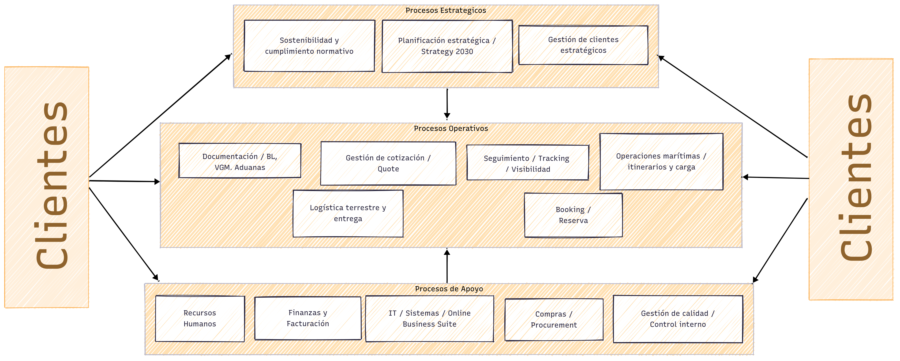
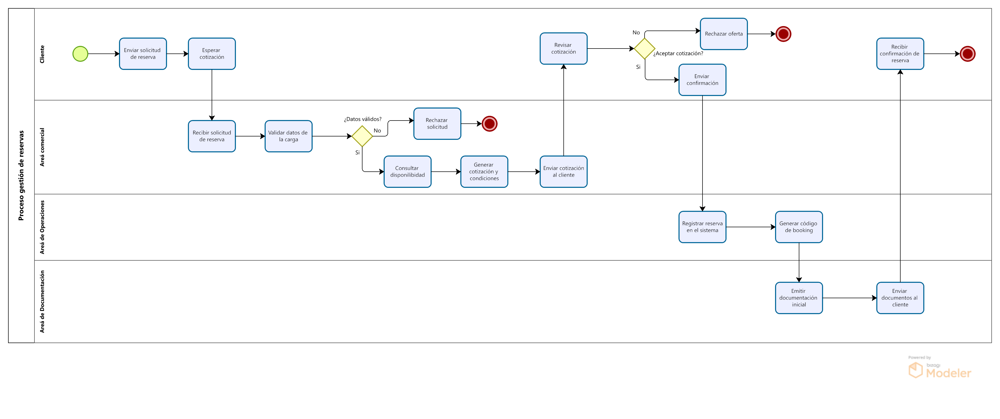
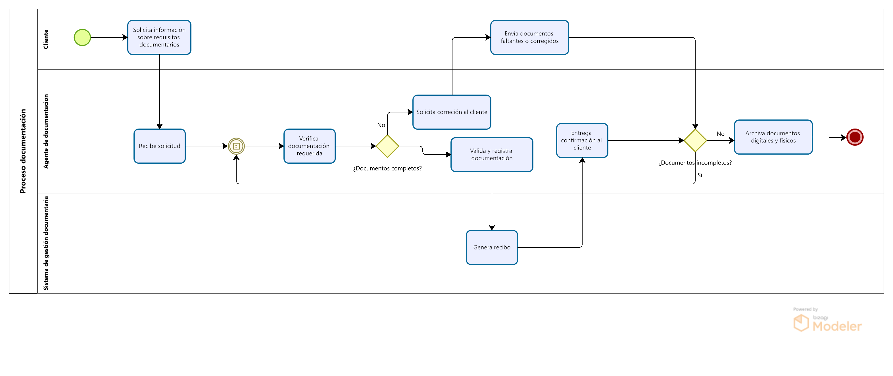
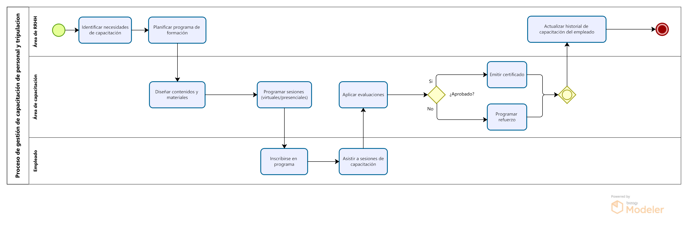
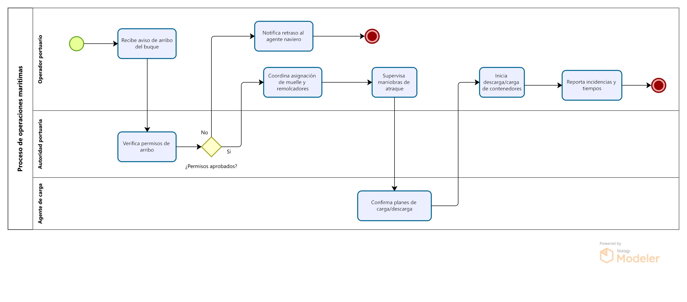
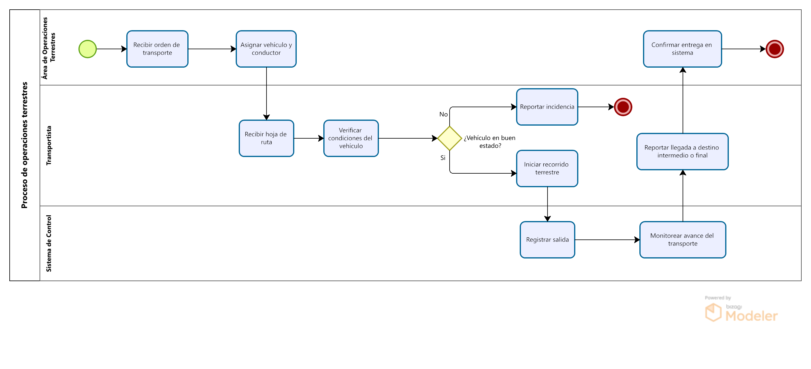
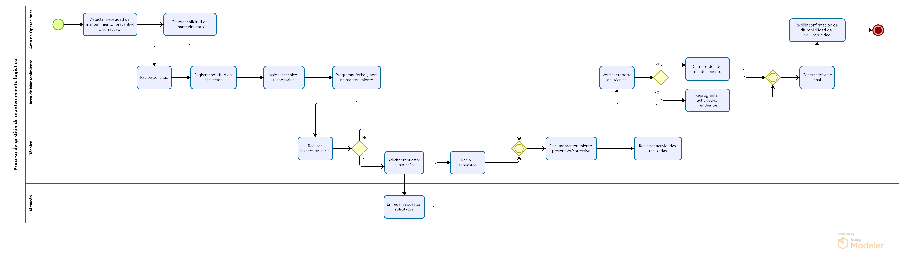
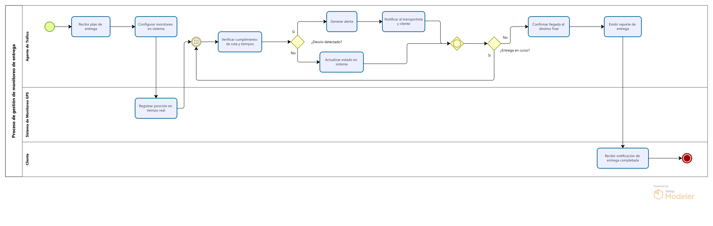

> [1. Descripción de la Empresa Elegida](../1.md) › [1.3. Procesos de Negocio identificados](1.3.md)

# 1.3. Procesos de Negocio identificados

## Mapa de procesos

## Focos seleccionados

#### **Gestión de Reservas**

- **Nombre:** Gestión de reservas.
- **Propósito:** Registrar y confirmar solicitudes de transporte de contenedores, verificando disponibilidad de espacio y equipo.
- **Límites:** Inicia con la solicitud del cliente y termina con la confirmación de booking en el sistema.
- **Entradas y salidas:**
  - **Entrada:** Solicitud del cliente, cotización aprobada, datos de carga.
  - **Salida:** Número de booking confirmado, notificación al cliente.
- **Actores o areas involucradas:** Cliente, atención al cliente, sistema de reservas.
- **Reglas de negocio clave:**
  - Validar disponibilidad de espacio y contenedores antes de confirmar.
  - Asignar número único de booking.
- **Indicadores o KPIs:** Tiempo promedio de confirmación, porcentaje de errores en reservas.
- **Problemas actuales:** Demoras en confirmaciones, errores de sobreventa de espacio, baja integración con sistemas de logística.

#### **Gestión de Documentación**

- **Nombre:** Gestión de documentación.
- **Propósito:** Generar, validar y enviar documentos legales y regulatorios.
- **Límites:** Desde la confirmación de booking hasta la aprobación de documentos para embarque.
- **Entradas y salidas:**
  - **Entrada:** Datos de reserva, datos de carga, requisitos regulatorios.
  - **Salida:** BL emitido, VGM validado, documentos aduaneros enviados.
- **Actores o areas involucradas:** Cliente, área documental, terminal portuaria, aduanas.
- **Reglas de negocio clave:**
  - Validar exactitud de datos (peso, dimensiones, contenido).
  - Cumplir con regulaciones locales e internacionales.
- **Indicadores o KPIs:** Porcentaje de documentos rechazados, tiempos de aprobación.
- **Problemas actuales:** Duplicidad de información, errores manuales, multas por incumplimiento.

#### **Gestión del Personal y la Tripulación**

- **Nombre:** Gestión de capacitación de personal.
- **Propósito:** Clasificar a la triuplacion, planificar y ejecutar programas de formación en normativa, seguridad y procesos logísticos.
- **Límites:** Desde la identificación del personal, necesidades de capacitación hasta la certificación del personal.
- **Entradas y salidas:**
  - **Entrada:** Requisitos regulatorios, plan de formación, perfiles de personal.
  - **Salida:** Personal capacitado y certificado, registros de capacitación.
- **Actores o areas involucradas:** Recursos Humanos, área de operaciones, instructores externos.
- **Reglas de negocio clave:**
  - Todo personal debe estar certificado en normativa vigente.
  - Las capacitaciones deben actualizarse periódicamente.
  - Tener contabilizado el Crew y el personal.
- **Indicadores o KPIs:** Porcentaje de personal capacitado, número de no conformidades por falta de formación.
- **Problemas actuales:** Capacitaciones desactualizadas, falta de trazabilidad de certificaciones, dependencia de proveedores externos.

#### **Gestion de Operaciones Maritimas**

- **Nombre:** Operaciones marítimas.
- **Propósito:** Coordinar la estiba, carga y despacho de buques garantizando seguridad y eficiencia.
- **Límites:** Desde la recepción del contenedor en puerto hasta el inicio del tránsito marítimo.
- **Entradas y salidas:**
  - **Entrada:** Reserva confirmada, contenedor recibido, documentación validada.
  - **Salida:** Contenedor cargado en buque, despacho confirmado.
- **Actores o areas involucradas:** Terminal portuaria, operaciones marítimas, tripulación del buque, agente de carga.
- **Reglas de negocio clave:**
  - Cumplir plan de estiba.
  - Respetar ventanas de tiempo asignadas en puerto.
- **Indicadores o KPIs:** Puntualidad en salidas, índice de utilización de capacidad, incidentes de carga.
- **Problemas actuales:** Congestión en puertos, retrasos en itinerarios, cambios climáticos que afectan planificación.

#### **Gestión de Operaciones Terrestres**

- **Nombre:** Gestión de operaciones terrestres.
- **Propósito:** Planificar y coordinar el transporte terrestre de contenedores desde/hacia los puertos.
- **Límites:** Desde la asignación de transporte en puerto hasta la llegada a destino intermedio o final.
- **Entradas y salidas:**
  - **Entrada:** Contenedor liberado en puerto, orden de transporte, documentos aduaneros.
  - **Salida:** Contenedor trasladado al punto de entrega o almacenaje.
- **Actores o areas involucradas:** Transportistas, logística terrestre, aduanas, cliente final.
- **Reglas de negocio clave:**
  - Asignar unidades de transporte disponibles y en condiciones óptimas.
  - Cumplir normativas de tránsito y seguridad vial.
- **Indicadores o KPIs:** Tiempo promedio de entrega terrestre, porcentaje de entregas puntuales, incidentes en ruta.
- **Problemas actuales:** Retrasos por congestión vial, disponibilidad limitada de transporte, costos elevados de combustible.

#### **Gestión de Mantenimiento Logístico**

- **Nombre:** Gestión de mantenimiento logístico.
- **Propósito:** Asegurar la disponibilidad, seguridad y eficiencia de los activos logísticos (buques, contenedores y flota terrestre) mediante actividades preventivas y correctivas.
- **Límites:** Desde la planificación de mantenimientos hasta la reincorporación del activo al servicio.
- **Entradas y salidas:**
  - **Entrada:** Planes de operación, reportes de fallas, registros de uso, inspecciones.
  - **Salida:** Activos en condiciones óptimas de operación, reportes técnicos, historial de mantenimiento actualizado.
- **Actores o áreas involucradas:** Área de mantenimiento, operaciones terrestres, operaciones marítimas, proveedores externos, talleres especializados.
- **Reglas de negocio clave:**
  - No se permite operar activos sin inspecciones aprobadas.
  - El mantenimiento preventivo es obligatorio según calendario establecido.
  - Todo mantenimiento debe registrarse en el sistema para trazabilidad.
- **Indicadores o KPIs:** Porcentaje de cumplimiento del plan preventivo, tasa de fallas por activo, tiempo promedio de inactividad por mantenimiento.
- **Problemas actuales:** Falta de integración entre sistemas de mantenimiento y operaciones, retrasos por disponibilidad de repuestos, costos elevados por mantenimientos correctivos en lugar de preventivos.

#### **Gestión de Monitoreo de Entrega**

- **Nombre:** Gestión de monitoreo de entrega.
- **Propósito:** Garantizar el seguimiento oportuno y confiable de las entregas de contenedores, desde el inicio del tránsito hasta la confirmación de entrega final al cliente o importador.
- **Límites:** Abarca desde el registro de salida del transporte (buque o terrestre), el seguimiento en tiempo real del trayecto, la liberación documental en destino y la confirmación de la entrega al importador, hasta el cierre de la operación.
- **Entradas y salidas:**
  - **Entrada:** Datos de tránsito (marítimo/terrestre), documentación validada, estado del transporte.
  - **Salida:** Reportes de seguimiento, confirmación de entrega, cierre de operación.
- **Actores o areas involucradas:** Importador/cliente final, área de operaciones terrestres, área de operaciones marítimas, agentes de aduanas, área de atención al cliente.
- **Reglas de negocio clave:**
  - Todo movimiento debe quedar registrado en el sistema de tracking.
  - Ninguna entrega puede cerrarse sin la conformidad digital del importador y evidencia documental.
- **Indicadores o KPIs:** Precisión del tracking, puntualidad de entregas, satisfacción del cliente.
- **Problemas actuales:** Actualizaciones tardías en sistemas, retrasos por trámites aduaneros, reclamos por entregas incompletas.

## Especificaciones de focos

### Gestión de Reservas

| **Nombre de la Actividad** | **Descripción** | **Responsable** | **Entradas** | **Salidas** | **Reglas de Negocio** | **Sistemas Implicados** |
| -- | -- | -- | -- | -- | -- | -- |
| **Recepción de solicitud** | Se recibe la solicitud de reserva del cliente por correo, web o teléfono. | Área Comercial / Ventas | Solicitud de cliente, datos de carga | Registro preliminar de reserva | Solo se atienden solicitudes con datos completos. | CRM / Portal de reservas |
| **Validación de datos** | Se revisa que la información (peso, volumen, origen, destino) sea correcta. | Área Comercial | Datos de carga | Solicitud validada o rechazada | No se acepta información incompleta o ilegible. | CRM |
| **Verificación de disponibilidad** | Se consulta espacio en buques y fechas disponibles. | Área de Operaciones | Solicitud validada, itinerarios | Confirmación preliminar de disponibilidad | La reserva depende de espacio y condiciones del contrato. | Sistema de gestión de flota |
| **Cotización y confirmación** | Se genera una propuesta de precio y se envía al cliente. | Área Comercial | Confirmación de espacio, tarifas | Cotización enviada al cliente | Tarifas deben alinearse a la política comercial vigente. | ERP / Sistema de tarifas |
| **Confirmación del cliente** | El cliente acepta o rechaza la cotización. | Cliente | Cotización | Aceptación o rechazo | No se asigna espacio sin confirmación escrita del cliente. | Correo / Portal de clientes |
| **Registro definitivo de reserva** | Se formaliza la reserva en el sistema con todos los detalles. | Área de Operaciones | Aceptación del cliente, datos carga | Reserva confirmada | Cada reserva debe tener un código único. | Sistema central de reservas / ERP |
| **Emisión de documentos iniciales** | Se generan documentos de reserva y se envían al cliente. | Área de Documentación | Reserva confirmada | Confirmación formal, documentos iniciales | Documentos deben cumplir normativa marítima y aduanera. | Sistema documental / ERP |

### Gestión de Documentación

| **Nombre de la Actividad** | **Descripción** | **Responsable** | **Entradas** | **Salidas** | **Reglas de Negocio** | **Sistemas Implicados** |
| -- | -- | -- | -- | -- | -- | -- |
| **Recepción de datos de reserva** | Se reciben los detalles confirmados de la reserva y carga. | Área de Documentación | Reserva confirmada, datos de carga | Registro inicial documental | No se procesa documentación sin reserva confirmada. | Sistema central de reservas |
| **Generación de borradores** | Se elaboran borradores de documentos como B/L, VGM y manifiestos. | Área de Documentación | Datos de carga, normativa vigente | Borradores documentales | Los borradores deben alinearse a regulaciones marítimas y aduaneras. | Sistema documental |
| **Validación de documentos** | Se revisa que la información en los documentos sea correcta y cumpla normas. | Área de Documentación | Borradores, normativa | Documentos validados o corregidos | Toda documentación debe pasar revisión de control interno. | ERP / Sistema de calidad |
| **Emisión de documentos oficiales** | Se generan documentos oficiales (B/L, VGM, certificados). | Área de Documentación | Documentos validados | Documentos oficiales emitidos | Solo personal autorizado puede emitir documentos oficiales. | Sistema documental / ERP |
| **Entrega al cliente** | Se envían al cliente los documentos oficiales (digitales o físicos). | Área de Documentación / Atención al Cliente | Documentos oficiales | Confirmación de recepción | Los documentos deben entregarse antes de la salida del buque. | Correo / Portal de clientes |
| **Custodia y archivo** | Se archivan copias digitales y físicas para auditoría y control. | Área de Documentación | Documentos oficiales | Registro archivado | Debe cumplirse el tiempo de conservación legal. | Sistema de gestión documental |

### Gestión de Capacitación de Personal y Tripulación

| **Nombre de la Actividad** | **Descripción** | **Responsable** | **Entradas** | **Salidas** | **Reglas de Negocio** | **Sistemas Implicados** |
| -- | -- | -- | -- | -- | -- | -- |
| **Detección de necesidades** | Se evalúan brechas de conocimiento y competencias del personal. | RR.HH. / Supervisores | Evaluaciones, reportes | Plan de necesidades | La evaluación debe realizarse semestralmente. | Sistema RR.HH. |
| **Diseño del plan de capacitación** | Se planifican cursos y entrenamientos internos/externos. | Coordinador de Capacitación | Plan de necesidades | Calendario de capacitación | Debe alinearse a normativas de aduanas y seguridad. | LMS / RR.HH. |
| **Ejecución de capacitaciones** | Se dictan cursos y talleres de formación. | Instructores / Proveedores externos | Calendario, materiales | Personal capacitado | Registro de asistencia obligatorio. | LMS / Aula virtual |
| **Evaluación y certificación** | Se aplican exámenes y se certifican competencias. | Coordinador / RR.HH. | Exámenes, registros | Certificados emitidos | Certificación requerida para roles críticos (aduanas, seguridad). | LMS |
| **Archivo de historial formativo**  | Se registra historial de capacitación de cada trabajador. | RR.HH. | Certificados, asistencia | Expediente de capacitación | Información debe guardarse mínimo 5 años. | Sistema RR.HH. / ERP |

### Operaciones Marítimas

| **Nombre de la Actividad** | **Descripción** | **Responsable** | **Entradas** | **Salidas** | **Reglas de Negocio** | **Sistemas Implicados** |
| -- | -- | -- | -- | -- | -- | -- |
| **Planificación de embarque** | Se asignan buques y se definen itinerarios según reservas confirmadas. | Área de Operaciones | Reservas confirmadas, itinerarios previos | Plan de embarque | Los buques deben cumplir con la capacidad y rutas aprobadas. | Sistema de gestión de flota |
| **Coordinación con agentes portuarios** | Se comunican fechas y condiciones a agentes en puerto de origen y destino. | Área de Operaciones | Plan de embarque | Confirmación de disponibilidad portuaria | Toda operación debe coordinarse con 72h de anticipación. | Sistema de comunicación / ERP |
| **Asignación de carga en buque** | Se define ubicación de la carga en el buque considerando peso y balance. | Jefe de Operaciones | Plan de embarque, especificaciones de carga | Plan de estiba | La carga peligrosa requiere tratamiento y certificación especial. | Sistema de estiba / ERP |
| **Supervisión de embarque** | Se supervisa físicamente el proceso de carga en puerto. | Supervisor de Puerto | Carga, plan de estiba | Acta de carga realizada | Toda carga debe coincidir con documentos de reserva. | Sistema de control portuario |
| **Emisión de documentos de embarque** | Se generan conocimientos de embarque (B/L) y manifiestos. | Área de Documentación | Acta de carga realizada | Bill of Lading (B/L), manifiestos | Documentos deben cumplir normativa marítima internacional. | Sistema documental / ERP |

### Operaciones Terrestres

| **Nombre de la Actividad** | **Descripción** | **Responsable** | **Entradas** | **Salidas** | **Reglas de Negocio** | **Sistemas Implicados** |
| -- | -- | -- | -- | -- | -- | -- |
| **Planificación de rutas** | Se definen rutas óptimas para el transporte terrestre considerando tiempos y costos. | Área de Logística Terrestre | Órdenes de transporte, reservas | Plan de rutas | Las rutas deben cumplir con regulaciones de tránsito y seguridad. | TMS / ERP |
| **Asignación de transporte** | Se designan vehículos y conductores según disponibilidad. | Supervisor de Transporte | Plan de rutas, flota disponible | Orden de despacho | Solo se asignan unidades con mantenimiento vigente. | TMS / ERP |
| **Despacho de unidades** | Se autoriza salida de vehículos con carga asignada. | Supervisor de Transporte | Orden de despacho | Vehículo en tránsito | Requiere checklist de seguridad antes de salida. | TMS / GPS |
| **Traslado al punto de entrega** | Se ejecuta el transporte de carga hacia el destino. | Transportista | Vehículo en tránsito | Carga en ruta | El transportista debe registrar ubicación y estado. | GPS / TMS |
| **Recepción en destino intermedio** | La carga llega a almacenes o puertos para embarque. | Área de Operaciones / Cliente | Carga en ruta | Carga recibida | Se requiere conformidad de recepción. | ERP / CRM |

### Gestión de Mantenimiento Logístico

| **Nombre de la Actividad** | **Descripción** | **Responsable** | **Entradas** | **Salidas** | **Reglas de Negocio** | **Sistemas Implicados** |
| -- | -- | -- | -- | -- | -- | -- |
| **Planificación de mantenimiento preventivo** | Se elabora un plan anual/mensual de revisiones según tipo de activo. | Jefe de Mantenimiento | Calendario operativo, historial de uso | Plan de mantenimiento preventivo | Todo activo debe tener un plan definido. | Sistema de gestión de mantenimiento (CMMS) |
| **Inspección de activos** | Se realizan revisiones físicas y técnicas a contenedores, buques y vehículos. | Técnicos de Mantenimiento | Activos en operación, checklist de inspección | Reporte de inspección | Activos con fallas no pueden seguir en servicio. | Sistema de inspección / ERP |
| **Ejecución de mantenimiento correctivo** | Se atienden reparaciones por fallas detectadas. | Equipo de Mantenimiento | Reporte de falla, repuestos | Activo reparado | Toda reparación debe quedar registrada con fecha y responsable. | CMMS / Taller especializado |
| **Gestión de repuestos y materiales** | Control de inventario de piezas necesarias para mantenimientos. | Área de Logística de Mantenimiento | Inventario de repuestos, órdenes de compra | Disponibilidad de materiales | No se inicia mantenimiento sin disponibilidad de repuestos. | Sistema de inventario / ERP |
| **Certificación y liberación de activo** | Se certifica que el activo está apto para operar nuevamente. | Supervisor de Mantenimiento | Reporte de mantenimiento | Activo disponible para operaciones | Activos deben cumplir estándares de seguridad antes de reincorporarse. | CMMS / ERP |

### Gestión de Monitoreo de Entrega

| **Nombre de la Actividad** | **Descripción** | **Responsable** | **Entradas** | **Salidas** | **Reglas de Negocio** | **Sistemas Implicados** |
| -- | -- | -- | -- | -- | -- | -- |
| **Registro de salida de carga** | Se valida y registra la salida de buque o vehículo con carga. | Área de Control / Operaciones | Documentos de embarque, orden de transporte | Registro de inicio de tránsito | No inicia seguimiento sin registro de salida. | ERP / TMS |
| **Monitoreo en tiempo real** | Seguimiento de la ubicación del transporte (marítimo o terrestre). | Área de Control | GPS, itinerarios | Reportes de posición | Actualización obligatoria según SLA (ej. cada 6h marítimo, cada 30min terrestre). | Sistema de rastreo satelital / GPS |
| **Gestión de incidencias** | Identificación y atención de desvíos, retrasos o emergencias. | Área de Control | Alertas, reportes de transporte | Registro de incidente y acciones correctivas | Toda incidencia debe registrarse y notificarse al cliente en <24h. | Sistema de incidencias / CRM |
| **Comunicación con cliente** | Se informa estado y novedades de la carga. | Área Comercial / Atención al Cliente | Reportes de monitoreo, incidencias | Notificación al cliente | La comunicación debe quedar trazada en sistema. | Portal de clientes / CRM |
| **Entrega de documentos en destino** | Validación final de documentos aduaneros y de entrega. | Área de Documentación / Aduanas | Documentos de embarque | Autorización de retiro | Ninguna carga se entrega sin documentación completa. | Sistema aduanero / ERP |
| **Entrega al importador** | Se realiza la entrega al importador y se obtiene su conformidad. | Transportista / Importador | Carga en tránsito, autorización de retiro | Acta de entrega firmada | La firma del importador es requisito obligatorio. | Portal de clientes / ERP |
| **Cierre de operación** | Se registra el cierre formal de la entrega al importador en el sistema. | Área de Operaciones | Acta de entrega, evidencia digital | Operación cerrada | No se cierra operación sin conformidad del importador y evidencia digital. | ERP central |

## Glosario

- **Booking:** Número único que identifica una reserva confirmada de espacio en buque para transporte de contenedor.
- **Bill of Lading (B/L):** Documento legal emitido por la naviera que prueba la recepción de la carga y constituye el contrato de transporte marítimo.
- **VGM (Verified Gross Mass):** Peso bruto verificado del contenedor, obligatorio según normativa internacional SOLAS para garantizar seguridad en la estiba.
- **Sistema AIS (Automatic Identification System):** Tecnología satelital que permite rastrear en tiempo real la ubicación y estado de un buque en navegación.
- **CRM (Customer Relationship Management):**	Sistema de gestión de relaciones con clientes, usado para comunicación, notificaciones y registro de interacciones.
- **ERP (Enterprise Resource Planning):**	Sistema de planificación empresarial que integra reservas, documentación, operaciones y logística en una sola plataforma.
- **KPI (Key Performance Indicator):**	Indicador clave de desempeño que mide la eficiencia o calidad de un proceso (ej. puntualidad, tasa de errores, tiempo de confirmación).

----

[⬅️ Anterior](../1.2/1.2.md) | [🏠 Home](../../README.md) | [Siguiente ➡️](../1.4/1.4.md)