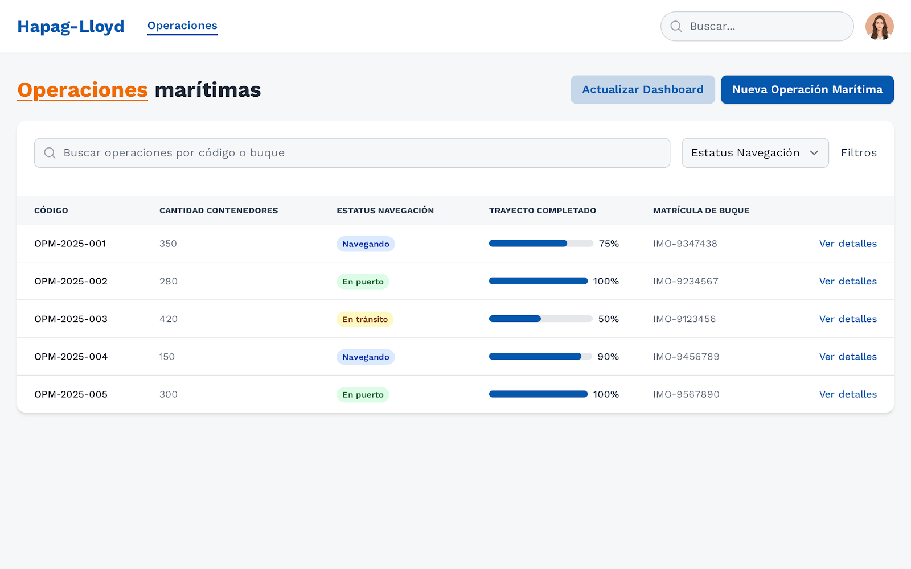

> [11. Diseño de Procesos Batch](../../11.md) › [11.2. Especificación de Procesos Batch](../11.2.md) › [11.2.3. Módulo 3 / Integrante 3](11.2.3.md)

# 11.2.3. Módulo 3 / Integrante 3

# Módulo de Gestión de Operaciones Marítimas

> Proceso Batch `PB_GMAR_CONCILIACION_NOCTURNA_OPERACIONES`

## 1. Objetivo del proceso

El proceso batch `PB_GMAR_CONCILIACION_NOCTURNA_OPERACIONES` tiene como objetivo **conciliar y corregir automáticamente** las operaciones marítimas y portuarias del sistema, detectando inconsistencias, actualizando estados obsoletos y generando datos **pre-calculados** en un esquema de auditoría analítico.

A partir de las tablas operacionales del esquema gestion_maritima, el proceso identifica operaciones con estados desactualizados, fechas inconsistentes, porcentajes incorrectos y otras anomalías. Aplica reglas de negocio para corregir automáticamente lo posible y registra tanto las correcciones como las inconsistencias que requieren intervención manual en tablas de hechos en el schema gestion_maritima_audit. Este esquema es utilizado para auditoría, análisis de calidad de datos y reportes gerenciales, siguiendo el patrón de esquema estrella.

## 2. Esquemas y tablas involucradas

### 2.1. Esquemas origen

- **`gestion_maritima`**
  - `gestion_maritima.Operacion`: operaciones base del sistema.
  - `gestion_maritima.OperacionMaritima`: especialización marítima (buque, porcentaje de trayecto, estatus de navegación).
  - `gestion_maritima.OperacionPortuaria`: especialización portuaria (puerto, muelle, tipo de operación).
  - `gestion_maritima.EstadoOperacion`: catálogo de estados de operación.
  - `gestion_maritima.EstatusNavegacion`: catálogo de estatus de navegación.
  - `gestion_maritima.Buque`: embarcaciones del sistema.
  - `gestion_maritima.Incidencia`: incidencias asociadas a operaciones.

### 2.2. Esquema destino (analítico)

- `CREATE SCHEMA gestion_maritima_audit;`

Dentro de este esquema se modela un **esquema estrella simplificado**:

- **Tablas de hechos:**

  - `gestion_maritima_audit.FactConciliacionOperacion`  
    Contiene una fila por operación corregida en la fecha de corte.

    Campos sugeridos:
    - `id_fact_conciliacion` (PK, UUID)
    - `id_operacion` (UUID de operación específica)
    - `id_fecha_corte` (FK a `DimFecha`)
    - `id_estado_operacion_anterior` (FK a `DimEstadoOperacion`)
    - `id_estado_operacion_nuevo` (FK a `DimEstadoOperacion`)
    - `id_buque` (FK a `DimBuque`)
    - `id_tipo_operacion` (FK a `DimTipoOperacion`)
    - `id_tipo_correccion` (FK a `DimTipoCorreccion`)
    - `porcentaje_trayecto_anterior`, `porcentaje_trayecto_nuevo`
    - `fecha_inicio_operacion`, `fecha_fin_original`, `fecha_fin_corregida`
    - `duracion_real_horas`
    - `incidencias_asociadas`, `incidencias_alta_severidad`
    - `inconsistencias_detectadas`
    - `requiere_intervencion_manual`
    - `correccion_aplicada`
    - `descripcion_correccion`
    - `fecha_registro_batch`

  - `gestion_maritima_audit.FactInconsistenciaOperacion`  
    Contiene una fila por inconsistencia detectada.

    Campos sugeridos:
    - `id_fact_inconsistencia` (PK, UUID)
    - `id_operacion` (UUID)
    - `id_fecha_corte` (FK a `DimFecha`)
    - `fecha_deteccion` 
    - `fecha_resolucion` 
    - `id_inconsistencia` (FK a `DimInconsistencia`)
    - `id_tipo_correccion` (FK a `DimTipoCorreccion`)
    - `resuelta`
    - `usuario_resolucion`
    - `observaciones`

- **Tablas de dimensiones (ejemplo):**

  - `gestion_maritima_audit.DimFecha`
    - `id_fecha` (PK, SERIAL), `fecha`, `anio`, `mes`, `dia`, `nombre_mes`, `nombre_dia`

  - `gestion_maritima_audit.DimEstadoOperacion`
    - `id_estado_operacion` (PK, UUID), `nombre`

  - `gestion_maritima_audit.DimBuque`
    - `id_buque` (PK, UUID), `matricula`, `nombre`, `capacidad`, `peso`

  - `gestion_maritima_audit.DimTipoOperacion`
    - `id_tipo_operacion` (PK, UUID), `nombre`, `descripcion`

  - `gestion_maritima_audit.DimTipoCorreccion`
    - `id_tipo_correccion` (PK, UUID), `nombre`, `descripcion`

  - `gestion_maritima_audit.DimInconsistencia`
    - `id_inconsistencia` (PK, UUID), `tipo_inconsistencia`, `nivel_severidad`, `descripcion`

## 3. Datos de entrada y salida

### 3.1. Entradas

- **Parámetro de entrada del proceso:**
  - `p_fecha_corte DATE`: fecha de corte del cierre nocturno.

- **Datos leídos desde tablas operacionales:**
  - Operaciones activas o finalizadas con posibles inconsistencias.
  - Estados y porcentajes de trayecto de operaciones marítimas.
  - Incidencias asociadas a operaciones.

### 3.2. Salidas

- **Tabla de hechos:**  
  Inserción de registros en `FactConciliacionOperacion` y `FactInconsistenciaOperacion`, con métricas pre-calculadas.

- **Tablas de dimensiones:**
  Inserción/actualización en `DimFecha`, `DimBuque`, `DimEstadoOperacion`, `DimTipoOperacion`, `DimTipoCorreccion`, `DimInconsistencia`.

## 4. Descripción del algoritmo del proceso

1. **Determinación del conjunto de operaciones a procesar**
   - Se seleccionan desde `gestion_maritima.Operacion` operaciones que cumplan:
     - `fecha_fin IS NULL` y han pasado más de 48 horas desde `fecha_inicio`.
     - `DATE(fecha_fin) = p_fecha_corte`.

2. **Recorrido secuencial con cursor**
   - Se define un **cursor** sobre el conjunto resultante.
   - Se recorre cada operación en un bucle `LOOP ... FETCH ...` en PL/pgSQL.

3. **Cálculo de métricas por operación**
   Para cada operación:

   - **Duración en horas:**
     - `duracion_real_horas = EXTRACT(EPOCH FROM (fecha_fin - fecha_inicio)) / 3600`.

   - **Determinación del tipo de operación:**
     - Si existe en `OperacionMaritima`: tipo = "MARITIMA", obtener `id_buque`, `porcentaje_trayecto`.
     - Si existe en `OperacionPortuaria`: tipo = "PORTUARIA".

   - **Aplicación de reglas de negocio:**
     - **Cierre automático**: Si `fecha_fin IS NULL` y > 48h → establecer `fecha_fin`, cambiar estado a "FINALIZADA_AUTO".
     - **Sincronización**: Si `porcentaje_trayecto >= 100` → cambiar estado a "FINALIZADA".
     - **Corrección de porcentajes**: Si porcentaje > 100 o < 0 → corregir a rango válido.

   - **Detección de inconsistencias:**
     - Operación marítima sin buque → registrar en `FactInconsistenciaOperacion`.
     - Fechas inválidas (`fecha_fin < fecha_inicio`) → registrar inconsistencia.
     - Operación marítima sin ruta → registrar inconsistencia.

   - **Cálculo de incidencias:**
     - Conteo total de incidencias: `SELECT COUNT(*) FROM Incidencia WHERE id_operacion = ?`.
     - Conteo de incidencias de alta severidad: `grado_severidad >= 4`.

4. **Inserción de datos en tablas de hechos**
   - Si se aplicó corrección: insertar en `FactConciliacionOperacion`.
   - Si se detectó inconsistencia: insertar en `FactInconsistenciaOperacion`.

5. **Prevención de duplicados**
   - Verificar que no exista registro para `id_operacion` + `id_fecha_corte` antes de insertar.

6. **Finalización**
   - Cerrar cursor.

## 5. Implementación en PL/pgSQL

```sql
CREATE OR REPLACE FUNCTION gestion_maritima_audit.f_conciliacion_nocturna_operaciones(p_fecha_corte DATE)
RETURNS void AS
$$
DECLARE
    cur_op CURSOR FOR
        SELECT o.id_operacion,
               o.codigo,
               o.fecha_inicio,
               o.fecha_fin,
               o.id_estado_operacion
        FROM gestion_maritima.Operacion o
        WHERE (o.fecha_fin IS NULL AND (NOW() - o.fecha_inicio) > INTERVAL '48 hours')
           OR DATE(o.fecha_fin) = p_fecha_corte;

    v_op RECORD;
    v_id_fecha INT;
    v_id_tipo_operacion UUID;
    v_id_buque UUID;
    v_porcentaje_anterior DECIMAL(5,2);
    v_porcentaje_nuevo DECIMAL(5,2);
    v_id_estado_anterior UUID;
    v_id_estado_nuevo UUID;
    v_fecha_fin_corregida TIMESTAMP;
    v_duracion_horas DECIMAL(10,2);
    v_incidencias_total INT;
    v_incidencias_alta INT;
    v_correccion_aplicada BOOLEAN;
    v_descripcion_correccion TEXT;
    v_id_tipo_correccion UUID;
BEGIN
    -- Asegurar registro en DimFecha
    SELECT id_fecha INTO v_id_fecha
    FROM gestion_maritima_audit.DimFecha
    WHERE fecha = p_fecha_corte;

    IF NOT FOUND THEN
        INSERT INTO gestion_maritima_audit.DimFecha(fecha, anio, mes, dia, nombre_mes, nombre_dia)
        VALUES (
            p_fecha_corte,
            EXTRACT(YEAR FROM p_fecha_corte),
            EXTRACT(MONTH FROM p_fecha_corte),
            EXTRACT(DAY FROM p_fecha_corte),
            TO_CHAR(p_fecha_corte, 'TMMonth'),
            TO_CHAR(p_fecha_corte, 'TMDay')
        )
        RETURNING id_fecha INTO v_id_fecha;
    END IF;

    -- Poblar dimensiones desde tablas operacionales
    INSERT INTO gestion_maritima_audit.DimEstadoOperacion (id_estado_operacion, nombre)
    SELECT eo.id_estado_operacion, eo.nombre
    FROM gestion_maritima.EstadoOperacion eo
    ON CONFLICT (id_estado_operacion) DO NOTHING;

    INSERT INTO gestion_maritima_audit.DimBuque (id_buque, matricula, nombre, capacidad, peso)
    SELECT b.id_buque, b.matricula, b.nombre, b.capacidad, b.peso
    FROM gestion_maritima.Buque b
    ON CONFLICT (id_buque) DO NOTHING;

    OPEN cur_op;

    LOOP
        FETCH cur_op INTO v_op;
        EXIT WHEN NOT FOUND;

        -- Inicializar variables
        v_id_buque := NULL;
        v_porcentaje_anterior := NULL;
        v_id_estado_anterior := v_op.id_estado_operacion;
        v_id_estado_nuevo := v_op.id_estado_operacion;
        v_fecha_fin_corregida := v_op.fecha_fin;
        v_correccion_aplicada := FALSE;
        v_descripcion_correccion := '';

        -- Determinar tipo y datos específicos
        SELECT om.id_buque, om.porcentaje_trayecto
        INTO v_id_buque, v_porcentaje_anterior
        FROM gestion_maritima.OperacionMaritima om
        WHERE om.id_operacion = v_op.id_operacion;

        IF FOUND THEN
            -- Reglas para operaciones marítimas
            IF v_porcentaje_anterior >= 100 THEN
                SELECT id_estado_operacion INTO v_id_estado_nuevo
                FROM gestion_maritima.EstadoOperacion
                WHERE nombre = 'FINALIZADA';
                
                v_correccion_aplicada := TRUE;
                v_descripcion_correccion := 'Sincronización por trayecto completado';
            END IF;
        END IF;

        -- Regla de cierre automático
        IF v_op.fecha_fin IS NULL AND (NOW() - v_op.fecha_inicio) > INTERVAL '48 hours' THEN
            v_fecha_fin_corregida := v_op.fecha_inicio + INTERVAL '72 hours';
            
            SELECT id_estado_operacion INTO v_id_estado_nuevo
            FROM gestion_maritima.EstadoOperacion
            WHERE nombre = 'FINALIZADA_AUTO';
            
            UPDATE gestion_maritima.Operacion
            SET fecha_fin = v_fecha_fin_corregida,
                id_estado_operacion = v_id_estado_nuevo
            WHERE id_operacion = v_op.id_operacion;
            
            v_correccion_aplicada := TRUE;
            v_descripcion_correccion := 'Cierre automático por vencimiento';
        END IF;

        -- Calcular métricas
        IF v_op.fecha_inicio IS NOT NULL AND v_fecha_fin_corregida IS NOT NULL THEN
            v_duracion_horas := EXTRACT(EPOCH FROM (v_fecha_fin_corregida - v_op.fecha_inicio)) / 3600;
        END IF;

        SELECT COUNT(*) INTO v_incidencias_total
        FROM gestion_maritima.Incidencia
        WHERE id_operacion = v_op.id_operacion;

        SELECT COUNT(*) INTO v_incidencias_alta
        FROM gestion_maritima.Incidencia
        WHERE id_operacion = v_op.id_operacion AND grado_severidad >= 4;

        -- Insertar en tabla de hechos si hubo corrección
        IF v_correccion_aplicada THEN
            INSERT INTO gestion_maritima_audit.FactConciliacionOperacion (
                id_operacion, id_fecha_corte,
                id_estado_operacion_anterior, id_estado_operacion_nuevo,
                id_buque, duracion_real_horas,
                incidencias_asociadas, incidencias_alta_severidad,
                correccion_aplicada, descripcion_correccion,
                fecha_registro_batch
            ) VALUES (
                v_op.id_operacion, v_id_fecha,
                v_id_estado_anterior, v_id_estado_nuevo,
                v_id_buque, v_duracion_horas,
                v_incidencias_total, v_incidencias_alta,
                v_correccion_aplicada, v_descripcion_correccion,
                NOW()
            );
        END IF;

    END LOOP;

    CLOSE cur_op;
END;
$$ LANGUAGE plpgsql;
```

## 6. Integración con la aplicación

El proceso batch se integra con el módulo de operaciones marítimas (backend NestJS y frontend Next.js):

- **Endpoint para ejecutar el batch**
  - Método: `POST`
  - Ruta: `/operaciones-maritimas/conciliacion-nocturna`
  - Cuerpo JSON: `{ "fecha_corte": "YYYY-MM-DD" }` (opcional; si no se envía, se usa la fecha actual).
  - Implementación: el servicio `OperacionesMaritimasService` invoca la función PL/pgSQL mediante:
    - `SELECT gestion_maritima_audit.f_conciliacion_nocturna_operaciones($1)`
  - Este endpoint puede exponerse para ejecución manual por administradores.

- **Endpoint para consultar correcciones aplicadas**
  - Método: `GET`
  - Ruta: `/operaciones-maritimas/correcciones`
  - Query params: `fecha_desde`, `fecha_hasta`
  - Datos que retorna (a partir de `FactConciliacionOperacion`):
    - Total de correcciones aplicadas
    - Correcciones por tipo
    - Lista de operaciones corregidas con detalles

- **Pantalla de analítica en el frontend**

  - En la pantalla de **Operaciones marítimas** (ruta: `/operaciones`):
  - Ruta: `/operaciones-maritimas/dashboard`.
  - Consumidor del endpoint `GET/operaciones-maritimas/correcciones`.
  - El botón **"Actualizar Dashboard"** puede invocar internamente el proceso de conciliación antes de refrescar los datos.
  - Las operaciones que aparecen en la tabla incluiran un indicador visual si fueron corregidas automáticamente por el batch.

### 6.1. Orquestación del proceso batch

El proceso se ejecuta **automáticamente** cada noche. Puede automatizarse con:

- **Opción A: Job en PostgreSQL (pg_cron)**
  - `SELECT cron.schedule('conciliacion-nocturna', '0 2 * * *', $$SELECT gestion_maritima_audit.f_conciliacion_nocturna_operaciones(CURRENT_DATE - 1)$$);`

- **Opción B: Scheduler en NestJS**
  - Utilizar `@nestjs/schedule` con `@Cron('0 2 * * *')`.

- **Opción C: GitHub Actions**
  - Workflow con `schedule: cron: '0 6 * * *'` que llama al endpoint POST.

---

[⬅️ Anterior](../11.2.2/11.2.2.md) | [🏠 Home](../../../README.md) | [Siguiente ➡️](../11.2.4/11.2.4.md)