> [12. Desarrollo de Aplicación](../../12.md) › [12.3. Flujo de Pantallas](../12.3.md) › [12.3.3. Módulo 3 / Integrante 3](12.3.3.md)

# 12.3.3. Módulo 3 / Integrante 3

# Módulo de Gestión de Operaciones Marítimas

### Dashboard del apartado de Operaciones Marítimas

**Objetivo:**

- Permitir que el operador visualice las funciones que tiene disponible en el apartado de Operaciones Marítimas.

**Elementos principales:**

- Botones con nombres, pequeñas descripciones e iconos referentes a las pantallas a las cuales redirigen al darles click. 

**Relación con el flujo funcional:**

- Para dar inicio al flujo funcional se debe hacer click en "Nueva Operación Marítima", donde el usuario debe de completar los formularios respectivos para dar inicio a una nueva operación marítima.

**Captura de pantalla:**

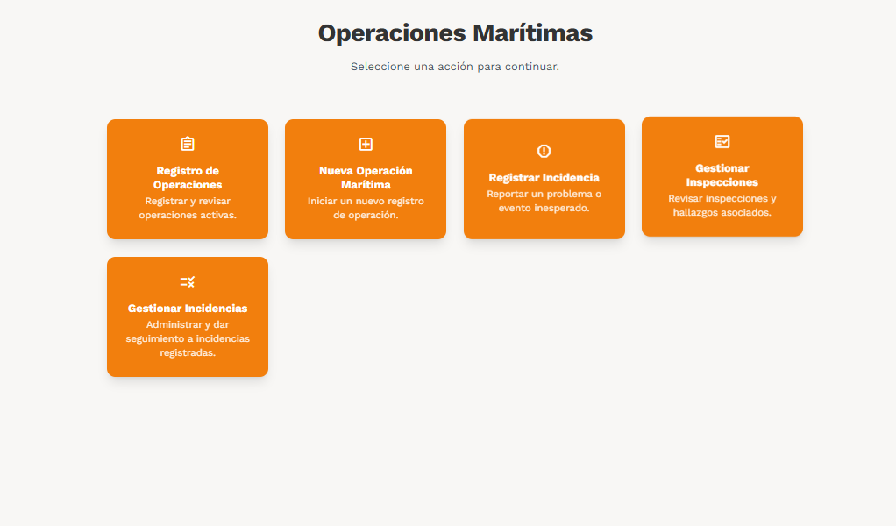

### Registro de todas las operaciones marítimas

**Objetivo:**

- Permitir que el operador visualice todas las operaciones marítimas que se encuentran activas.

**Elementos principales:**

- Botones para paginación, actualización y creación de una nueva operación marítima
- Paneles para datos estadisticos simples.
- Filtros por palabra, periodo, tipo de corrección, estatus.
 
**Relación con el flujo funcional:**

- Al finalizar con el flujo funcional, mediante esta pantalla se brindara el seguimiento respectivo a cualquier operación marítima que se requiera.

**Captura de pantalla:**

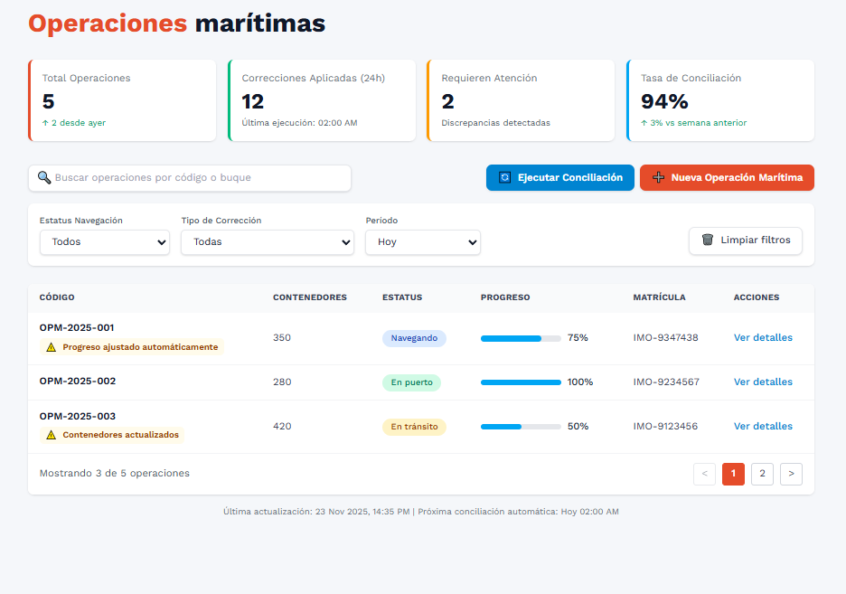

### Registrar una nueva operación marítima

**Objetivo:**

- Permitir que el operador pueda registrar una nueva operación marítima brindando la información necesaria.

**Elementos principales:**

- Formularios de despliegue
- Botones y filtros respectivos para los formularios
- Mapas interactivos, que permiten vizualizar rutas
 
**Relación con el flujo funcional:**

- Esta colección de pantallas son las que reflejan el flujo funcional implementado en la aplicación.

**Captura de pantalla:**

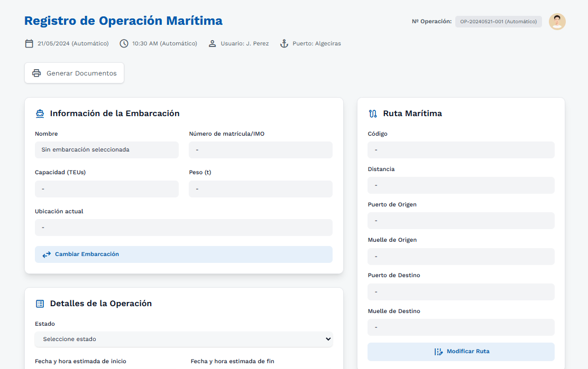

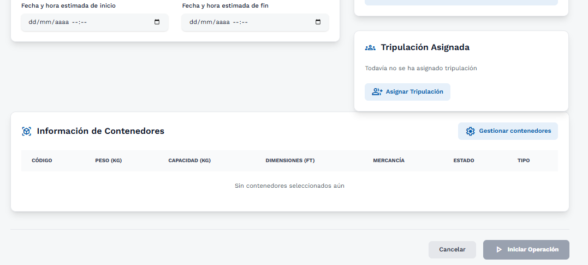

Boton Cambiar Embarcación

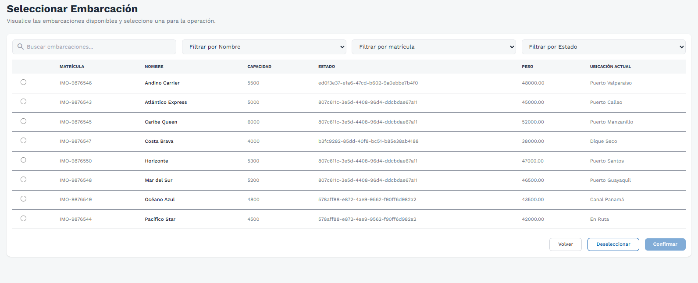

Boton Modificar Ruta

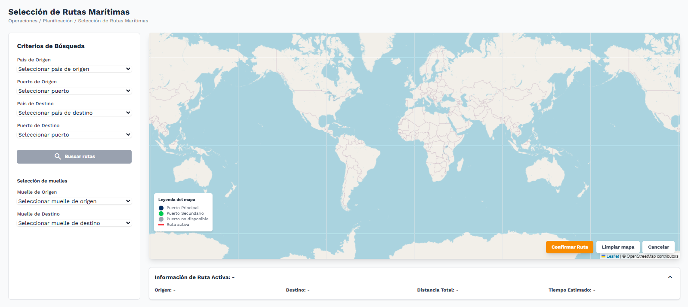

Boton Buscar Rutas

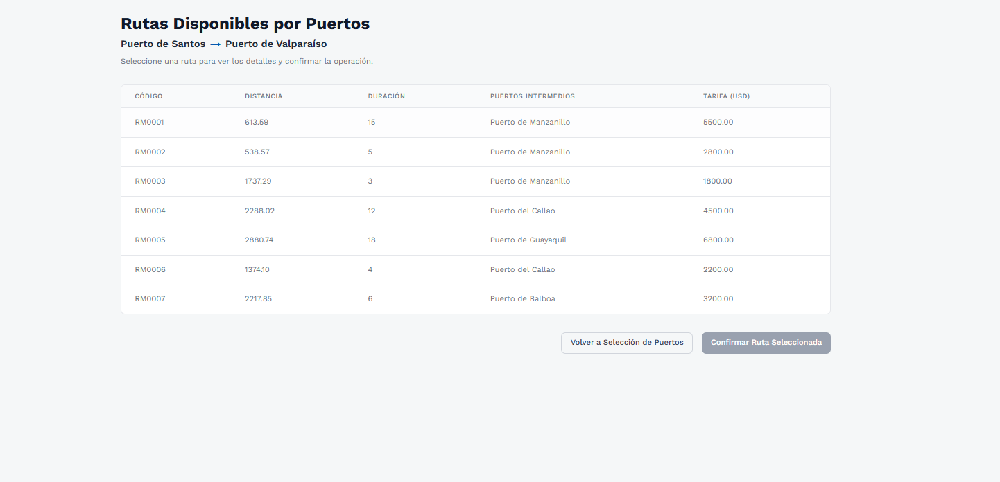

Boton Asignar Tripulacion

(Comunicación con el Módulo de Gestión del Personal y Tripulacion)

Boton Gestionar Contenedores

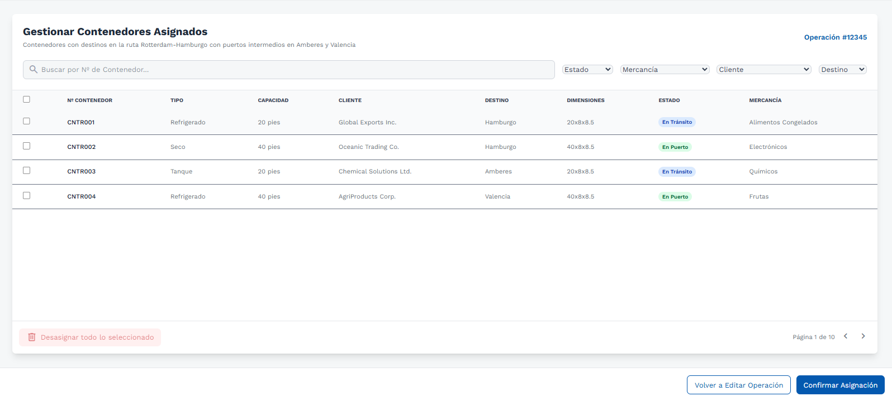

Nota: Se deben completar todas las secciones anteriores para poder hacer click en el boton "Iniciar Operación".

### Registrar una nueva incidencia

**Objetivo:**

- Permitir que el operador pueda registrar a una operación marítima una determinada incidencia.

**Elementos principales:**

- Formularios de despliegue
- Tabla con la información de todas las operaciones.
- Botones para paginación y para seleccionar una determinada operación.
 
**Relación con el flujo funcional:**

- Al finalizar con el flujo funcional, mediante estas pantallas se podran registrar incidencias a operaciones marítimas que lo requieran y así llevar un mejor control de auditoría.

**Captura de pantalla:**

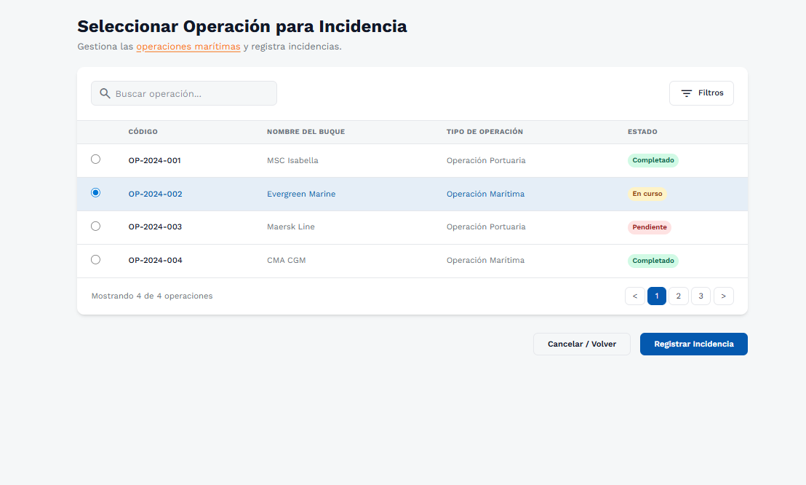

Boton registrar incidencia

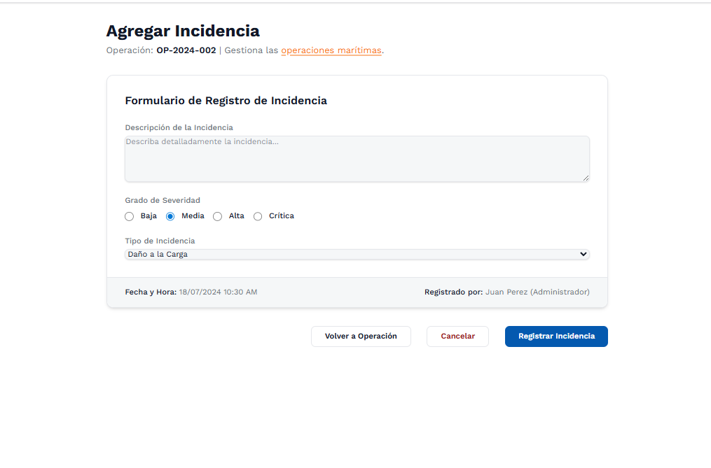

### Gestionar inspecciones

**Objetivo:**

- Permitir que el operador pueda visualizar todas las operaciones marítimas que se encuentran sujetas a una inspeccion y registrar hallazgos.

**Elementos principales:**

- Formularios de despliegue.
- Tabla con el listado de todas las operaciones maritimas sujetas a una inspección.
- Filtros para buscar una operación por palabra.
 
**Relación con el flujo funcional:**

-  Al finalizar con el flujo funcional, mediante estas pantallas se podran visualizar las inspecciones activas y registrar hallazgos a ellas de ser necesario.

**Captura de pantalla:**

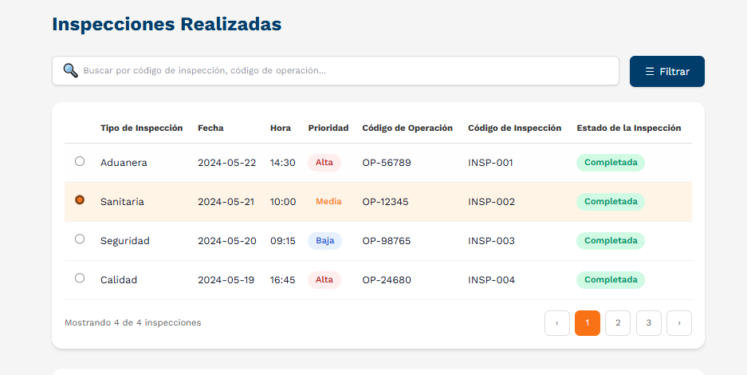

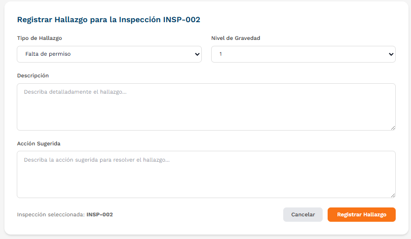

### Gestionar incidencias

**Objetivo:**

- Permitir que el operador pueda visualizar todas las operaciones marítimas que se vieron afectadas por una determinada incidencia y asignarles una inspección determinada.

**Elementos principales:**

- Formulario para asignar una inspección.
- Tabla con el listado de todas las operaciones maritimas sujetas a una incidencia.
- Filtros para buscar una operación marítima por palabra.
 
**Relación con el flujo funcional:**

- Al finalizar con el flujo funcional, mediante esta pantalla se podran resolver ciertas incidencias que sucedan durante el viaje y asignarles una inspección.

**Captura de pantalla:**

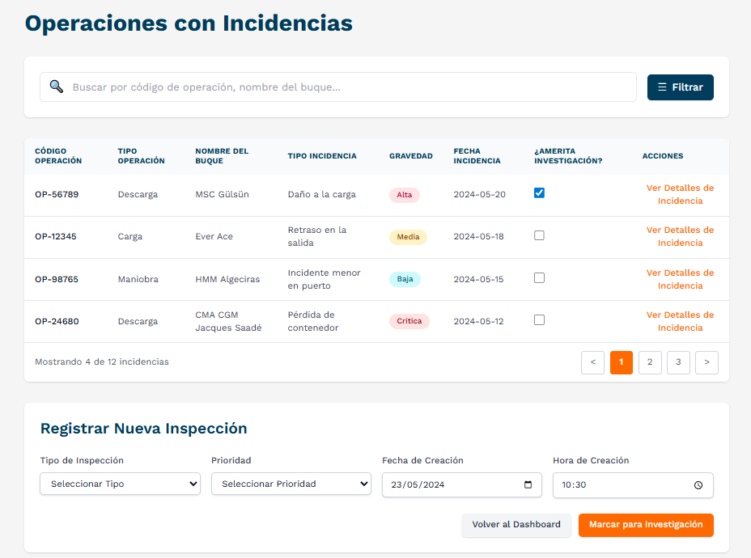

### Dashboard del apartado de Operaciones Portuarias

**Objetivo:**

- Permitir que el operador visualice las funciones que tiene disponible en el apartado de Operaciones Portuarias.

**Elementos principales:**

- Botones con nombres, pequeñas descripciones e iconos referentes a las pantallas a las cuales redirigen al darles click. 
 
**Relación con el flujo funcional:**

- Al finalizar con el flujo funcional, mediante estas pantallas se podran asociar y trabajar en conjunto operaciones marítimas con operaciones portuarias.

**Captura de pantalla:**

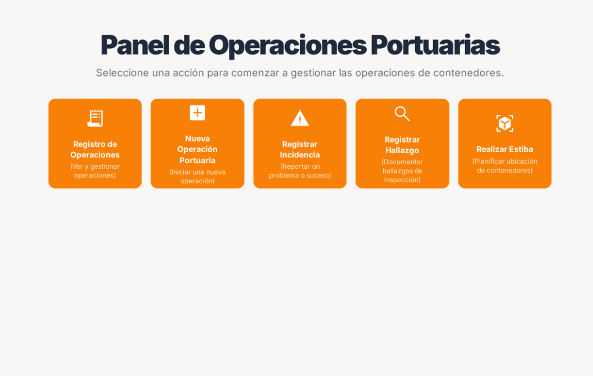

### Registro de todas las Operaciones Portuarias

**Objetivo:**

- Permitir que el operador visualice todas las operaciones portuarias que se encuentran activas.

**Elementos principales:**

- Botones para paginación y creación de una nueva operación portuaria.
- Paneles para datos estadisticos simples.
- Filtros por palabra y tipo de operación.
 
**Relación con el flujo funcional:**

- Al finalizar con el flujo funcional, mediante esta pantalla se podran listar todas las operaciones portuarias que trabajan en conjunto con una operación marítima.

**Captura de pantalla:**

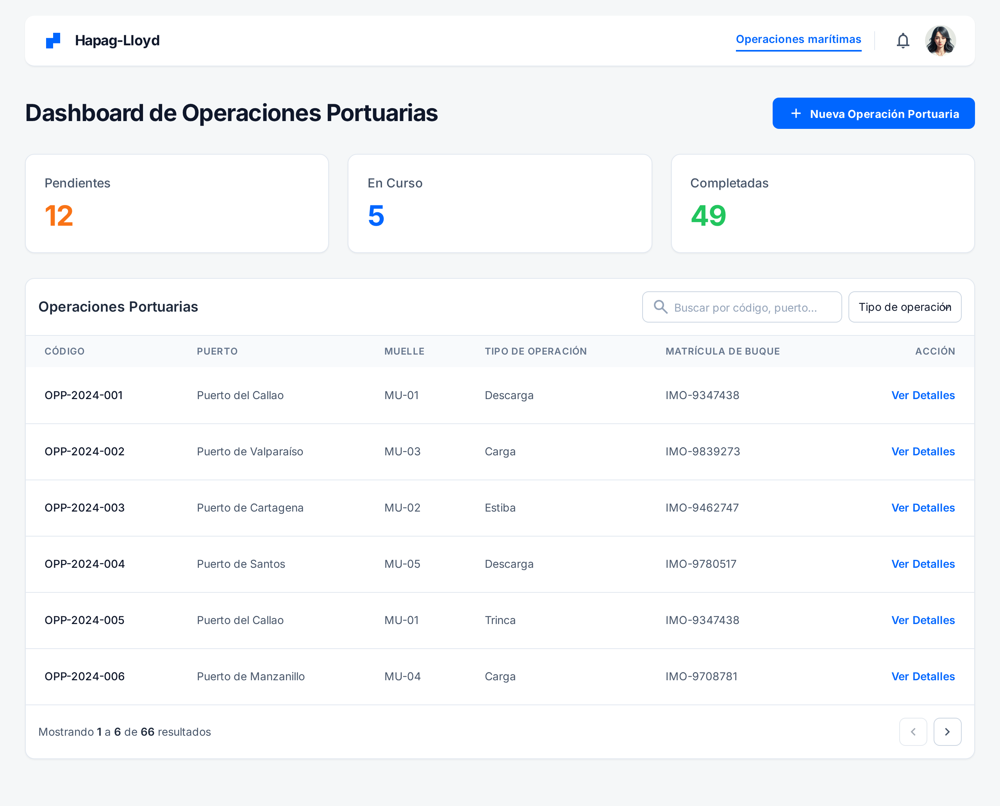

### Registrar Nueva Operacion Portuaria

**Objetivo:**

- Permitir que el operador pueda registrar una nueva operación portuaria brindando la información necesaria.

**Elementos principales:**

- Formularios de despliegue
- Botones y filtros respectivos para los formularios
 
**Relación con el flujo funcional:**

- Esta colección de pantallas son las que reflejan el flujo necesario para la creación de una nueva operación portuaria que se vera asociada a una operación marítima tras el fin del flujo funcional principal.

**Captura de pantalla:**

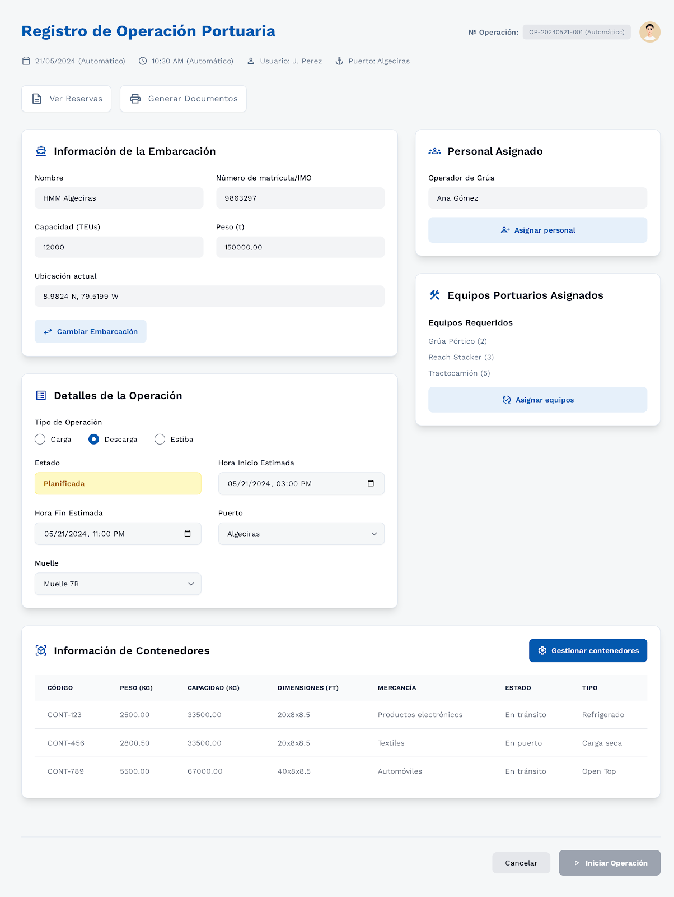

Boton Cambiar Embarcación

Boton Asignar Personal

(Comunicación con el Módulo de Gestión del Personal y Tripulacion)

Boton Cambiar Asignar Equipos

Boton Gestionar Contenedores

### Registrar una nueva incidencia

**Objetivo:**

- Permitir que el operador pueda registrar a una operación portuaria una determinada incidencia.

**Elementos principales:**

- Formularios de despliegue
- Tabla con la información de todas las operaciones.
- Botones para paginación y para seleccionar una determinada operación.
 
**Relación con el flujo funcional:**

- Al finalizar con el flujo funcional, mediante estas pantallas se podran registrar incidencias a operaciones portuarias que lo requieran y así llevar un mejor control de auditoría con la operación marítima asociada.

**Captura de pantalla:**

Boton registrar incidencia

### Gestionar inspecciones

**Objetivo:**

- Permitir que el operador pueda visualizar todas las operaciones portuarias que se encuentran sujetas a una inspeccion y registrar hallazgos.

**Elementos principales:**

- Formularios de despliegue.
- Tabla con el listado de todas las operaciones maritimas sujetas a una inspección.
- Filtros para buscar una operación por palabra.
 
**Relación con el flujo funcional:**

-  Al finalizar con el flujo funcional, mediante estas pantallas se podran visualizar las inspecciones activas y registrar hallazgos a ellas de ser necesario.

**Captura de pantalla:**

### Gestionar incidencias

**Objetivo:**

- Permitir que el operador pueda visualizar todas las operaciones portuarias que se vieron afectadas por una determinada incidencia y asignarles una inspección determinada.

**Elementos principales:**

- Formulario para asignar una inspección.
- Tabla con el listado de todas las operaciones portuarias sujetas a una incidencia.
- Filtros para buscar una operación marítima por palabra.
 
**Relación con el flujo funcional:**

- Al finalizar con el flujo funcional, mediante esta pantalla se podran resolver ciertas incidencias que sucedan durante el desarrollo de una operación portuaria y asignarles una inspección.

**Captura de pantalla:**

### Realizar Estiba

**Objetivo:**

- Permitir que el operador pueda visualizar todas las operaciones portuarias que se vieron afectadas por una determinada incidencia y asignarles una inspección determinada.

**Elementos principales:**

- Formulario para asignar una inspección.
- Tabla con el listado de todas las operaciones maritimas sujetas a una incidencia.
- Filtros para buscar una operación marítima por palabra.
 
**Relación con el flujo funcional:**

- Al finalizar con el flujo funcional, mediante estas pantallas se podran resolver ciertas incidencias que sucedan durante el viaje y asignarles una inspección.

**Captura de pantalla:**

---

[⬅️ Anterior](../12.3.2/12.3.2.md) | [🏠 Home](../../../README.md) | [Siguiente ➡️](../12.3.4/12.3.4.md)