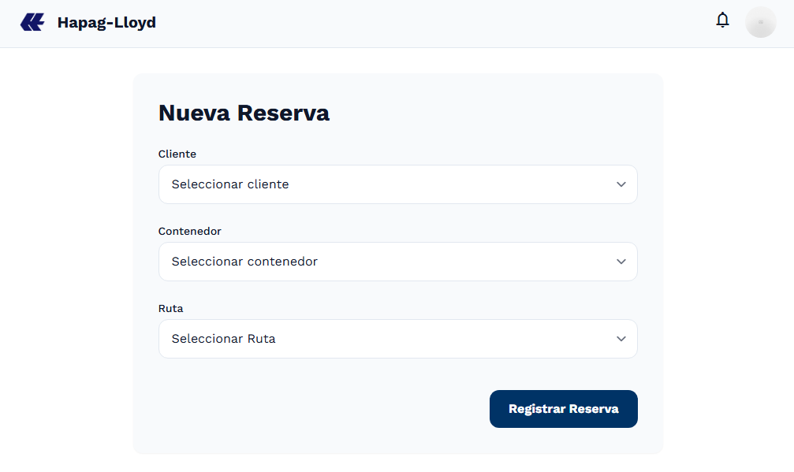
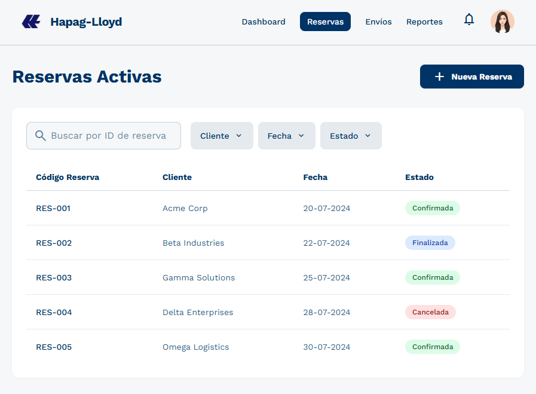
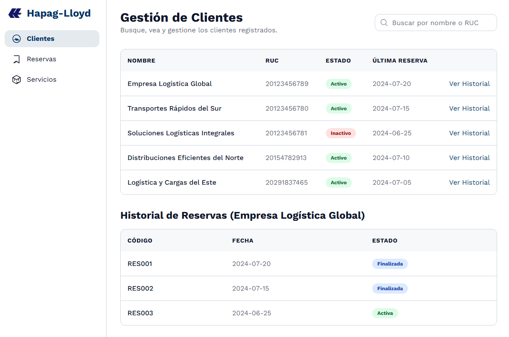
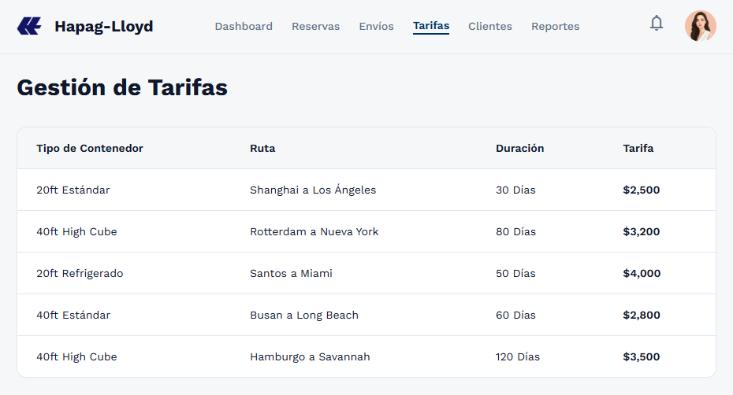
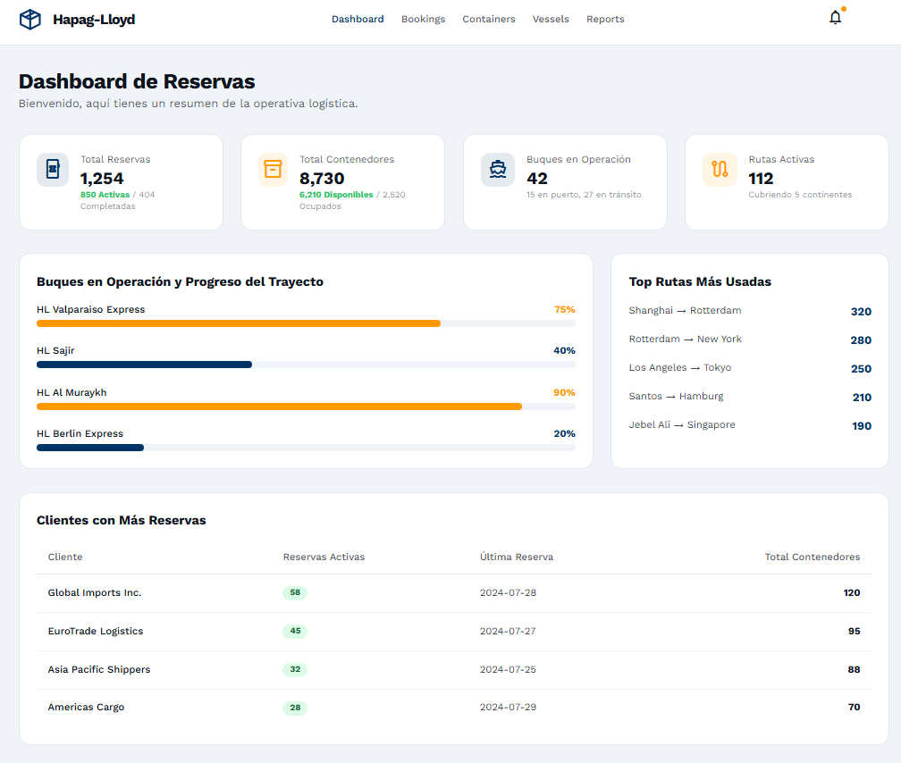

> [3. Especificación de Requisitos y Prototipo](../3.md) › [3.1. Módulo 1](3.1.md)

# 3.1. Módulo de Gestión de Reservas

## Requerimientos funcionales

| **Código** | **Requerimiento Funcional** | **Caso de Uso** |
| -- | -- | -- |
| RF01 | El sistema debe permitir registrar nuevas reservas de contenedores y espacios en buques. | CU01 |
| RF02 | El sistema debe permitir verificar reservas existentes (ID de Reserva, fechas). | CU02 |
| RF03 | El sistema debe gestionar y mantener actualizada la información de clientes e historial de servicios. | CU03 |
| RF04 | El sistema debe administrar las tarifas. | CU04 |
| RF05 | El sistema muestra un dashboard con datos actuales. | CU05 |
| RF06 | El sistema debe compartir información con otros módulos relacionados (Operaciones Marítimas, Operaciones Terrestres, Documentación, Monitoreo de Entrega, Mantenimiento, Capacitación). | CU06 |

## Diagramas de casos de uso

### CU01: Registrar reserva

- **Actores involucrados**
    - Cliente
    - Agente Comercial
    - Sistema ERP/TMS

- **Objetivo**
    - Registrar nuevas reservas de contenedores y espacios en buques, validando disponibilidad.

- **Precondiciones**
    - Cliente debe estar registrado en el CRM.
    - Disponibilidad actualizada en TMS.

- **Disparador o evento inicial**
    - Solicitud de transporte marítimo.

- **Flujo principal de eventos**
    1. Usuario accede al módulo de reservas.
    2. Ingresa datos de cliente, carga y fechas.
    3. El sistema consulta disponibilidad en TMS.
    4. El sistema valida tarifas desde ERP.
    5. El sistema confirma y genera código de reserva.

- **Flujos alternativos**
    - Si no hay disponibilidad → el sistema sugiere alternativas de buque o fecha.
    - Si el cliente no está registrado → se redirige a CRM para alta.

- **Postcondiciones**
    - Reserva registrada y notificación enviada al cliente.

- **Excepciones**
    - Error de conexión con el sistema ERP/TMS
    - Fallo en base de datos.

- **Pantalla(s) asociada(s):** P01

### CU02: Actualizar Reserva

- **Actores involucrados**
    - Cliente
    - Ejecutivo de cuenta
    - Sistema ERP/TMS

- **Objetivo**
    - Mantener actualizada la información de clientes e historial de servicios.

- **Precondiciones**
    - Cliente debe estar registrado en el CRM.
    - Debe existir una reserva activa en el sistema.

- **Disparador o evento inicial**
    - Solicitud de verificación de una reserva por parte del cliente o ejecutivo.

- **Flujo principal de eventos**
    1. El usuario busca la reserva existente.
    2. El sistema recupera información desde ERP/TMS.
    3. El usuario verifica datos (contacto, historial, preferencias).

- **Flujos alternativos**
    - Si no hay disponibilidad → el sistema propone alternativas desde el TMS.

- **Postcondiciones**
    - La reserva actualizada se refleja en todos los módulos.

- **Excepciones**
    - Error de sincronización.
    - Intento de modificar reservas no autorizadas.

- **Pantalla(s) asociada(s):** P02

### CU03: Gestionar y mantener información de clientes e historial de servicios

- **Actores involucrados**
    - Ejecutivo de cuenta
    - Sistema CRM/ERP

- **Objetivo**
    - Mantener datos de clientes e historial de servicios asociados a reservas.

- **Precondiciones**
    - Cliente registrado en el sistema.
    - Integración activa con CRM y ERP.

- **Disparador o evento inicial**
    - Alta, actualización o consulta de datos de cliente.

- **Flujo principal de eventos**
    1. El ejecutivo accede al perfil de cliente.
    2. El sistema consulta información en CRM.
    3. El sistema sincroniza datos relevantes con ERP.
    4. Se actualiza historial de servicios vinculados a reservas.

- **Flujos alternativos**
    - CRM inaccesible → se guarda en modo offline y se sincroniza después.
    - Conflicto de datos entre ERP y CRM → se requiere validación manual.
    - Solicitud de eliminación → se inicia proceso conforme a normativas legales.

- **Postcondiciones**
    - Información de clientes y reservas queda actualizada y consistente.

- **Excepciones**
    - Error de formato de datos.

- **Pantalla(s) asociada(s):** P03

### CU04: Administrar tarifas, cotizaciones y condiciones contractuales

- **Actores involucrados**
    - Área Comercial
    - Cliente
    - Sistema CRM/ERP

- **Objetivo**
    - Gestionar cotizaciones y aplicar tarifas.

- **Precondiciones**
    - Tarifas registradas en ERP.
    - Cliente activo en CRM.

- **Disparador o evento inicial**
    - Solicitud de cotización o actualización de tarifas.

- **Flujo principal de eventos**
    1. El usuario solicita una cotización.
    2. El sistema consulta tarifas en ERP.
    3. Se genera cotización dependiendo las condiciones.
    4. El sistema envía la cotización al cliente vía CRM.

- **Flujos alternativos**
    - Tarifa no disponible en ERP → se solicita autorización para tarifa manual.
    - Descuento fuera de política → requiere aprobación superior.
    - Cliente rechaza cotización → se generan propuestas alternativas.

- **Postcondiciones**
    - Cotización quedan registradas en ERP/CRM.

- **Excepciones**
    - Error en cálculo de impuestos o moneda.
    - Fallo en integración con CRM.

- **Pantalla(s) asociada(s):** P04

### CU05: Generar reportes de ocupación, disponibilidad y programación

- **Actores involucrados**
    - Planificador logístico
    - Sistema TMS/ERP

- **Objetivo**
    - Emitir reportes de ocupación y disponibilidad de recursos.

- **Precondiciones**
    - Reservas registradas y actualizadas.
    - Acceso a datos del ERP y TMS.

- **Disparador o evento inicial**
    - Solicitud de reporte por parte del planificador.

- **Flujo principal de eventos**
    1. El usuario selecciona parámetros del reporte.
    2. El sistema extrae información de ERP y TMS.
    3. Se consolidan los datos en un formato estándar.
    4. El sistema genera y presenta el reporte.

- **Flujos alternativos**
    - Datos incompletos → se genera con advertencia.
    - Consulta muy grande → se divide en lotes.
    - TMS no disponible → se usa réplica sincronizada.

- **Postcondiciones**
    - Reporte generado y disponible para exportación.

- **Excepciones**
    - Error en formato de exportación.
    - Acceso no autorizado.

- **Pantalla(s) asociada(s):** P05

### CU06: Compartir información con otros módulos relacionados

- **Actores involucrados**
    - Sistema ERP/TMS/CRM
    - Módulo de Gestión de Documentación
    - Módulo de Monitoreo de Entrega
    - Módulo de Mantenimiento
    - Módulo de Capacitación

- **Objetivo**
    - Compartir información de reservas confirmadas con otros módulos dependientes.

- **Precondiciones**
    - Integración activa entre módulos.
    - Reservas confirmadas en el sistema.

- **Disparador o evento inicial**
    - Confirmación de una reserva.

- **Flujo principal de eventos**
    1. El sistema identifica reserva confirmada.
    2. El sistema actualiza disponibilidad en TMS.
    3. El sistema notifica al Módulo de Documentación para emisión de contratos.
    4. El sistema envía datos a Monitoreo de Entrega para seguimiento.
    5. El sistema alerta a Mantenimiento y Capacitación sobre recursos requeridos.

- **Flujos alternativos**
    - Módulo receptor no disponible → se encola mensaje y se reintenta.
    - Formato incompatible → se transforma mediante middleware.
    - Sincronización parcial → se envían deltas pendientes.

- **Postcondiciones**
    - La información queda sincronizada en todos los módulos relacionados.

- **Excepciones**
    - Fallo en comunicación entre módulos.
    - Mensaje duplicado detectado.
    - Falta de autorización en módulo receptor.

## Requisitos de atributos de calidad

#### Rendimiento

- La actualización o modificación de reservas debe reflejarse en tiempo real (< 5 segundos).
- La generación de reportes de ocupación y disponibilidad no debe superar los 15 segundos para un período de 30 días.

#### Disponibilidad

- El módulo debe estar disponible al menos el 99.8% del tiempo, dado que los clientes realizan reservas 24/7.
- La disponibilidad crítica aplica especialmente durante periodos de cierre de buques y coordinación con operaciones marítimas y terrestres.

#### Escalabilidad

- El sistema debe soportar hasta 500 reservas concurrentes en horas pico.
- Debe manejar hasta 200 clientes accediendo simultáneamente.
- Soporte para el crecimiento anual del 15% en volumen de reservas y clientes.

#### Seguridad

- Autenticación multifactor para clientes corporativos y usuarios internos.
- Cifrado de extremo a extremo en transmisión de datos de reservas, tarifas y contratos.
- Registro en log de auditoría con marca de tiempo para todas las modificaciones de reservas y condiciones contractuales.

#### Usabilidad

- Interfaces accesibles desde web y dispositivos móviles para clientes y ejecutivos de cuenta.
- El registro de una nueva reserva no debe requerir más de 5 pasos.
- Cotizaciones deben mostrarse en un formato claro y fácil de comparar.

## Restricciones

#### Tecnologías requeridas
- Integración obligatoria con ERP y TMS corporativos.
- Conexión con el CRM para gestión de clientes e historial.
- Integración con los módulos de Gestión de Operaciones Marítimas, Gestión de Operaciones Terrestres, Gestión de Documentación, Gestión de Monitoreo de Entrega, Gestión de Mantenimiento y Gestión de Capacitación.

#### Integraciones necesarias
- Plataformas de pago y facturación electrónica.
- Sistemas externos de tarifas y cotizaciones internacionales.
- Servicios de notificación (correo electrónico, SMS, aplicaciones móviles).

#### Límites de almacenamiento y licencias
- Historial de reservas y clientes debe mantenerse por mínimo 10 años.
- Reportes y cotizaciones se deben almacenar por un período no menor a 5 años para fines legales y de auditoría.

#### Normas y estándares regulatorios aplicables
- Cumplimiento de normativas de comercio internacional (INCOTERMS).
- Adherencia a regulaciones de protección de datos (GDPR y normativas locales).
- Conformidad con normativas de facturación electrónica del país de operación.

## Prototipos

### Caso de Uso CU01

#### Prototipo P01

Registro de reservas.

### Caso de Uso CU02

#### Prototipo P02

Listado de Reservas.

### Caso de Uso CU03

#### Prototipo P03

Gestión de clientes e historial

### Caso de Uso CU04

#### Prototipo P04

Administración de tarifas

### Caso de Uso CU05

#### Prototipo P05

Dashboard de Reservas

---

[🏠 Home](../../README.md) | [Siguiente ➡️](../3.2/3.2.md)