> [3. Especificación de Requisitos y Prototipo](../3.md) › [3.3. Módulo 3](3.3.md)

# 3.3. Módulo de Gestión de Operaciones Marítimas

## REQUERIMIENTOS FUNCIONALES

| Código | Requerimiento Funcional | Caso de Uso |
|--------|------------------------|-------------|
| RF01 | El sistema debe permitir registrar y visualizar operaciones portuarias con sus estados (pendientes, en curso, completadas), incluyendo información de puerto, muelle, tipo de operación y matrícula de buque asignado. | CU01 |
| RF02 | El sistema debe permitir registrar operaciones portuarias con información de embarcación, puerto, muelle, trabajadores portuarios y equipo portuario asociado. | CU02 |
| RF03 | El sistema debe permitir gestionar la información de embarcaciones disponibles, mostrando su nombre, matrícula/IMO, capacidad, peso, ubicación actual y estado operativo. | CU03 |
| RF04 | El sistema debe permitir gestionar y asignar equipos portuarios a operaciones, mostrando código, tipo, estado, ubicación y capacidad de cada equipo. | CU04 |
| RF05 | El sistema debe permitir visualizar y gestionar operaciones marítimas en curso, mostrando cantidad de contenedores, estado de navegación, trayecto completado y matrícula del buque. | CU05 |
| RF06 | El sistema debe permitir registrar operaciones marítimas con información de embarcación, ruta marítima (código, distancia, puertos de origen/destino), tripulación asignada y contenedores asociados. | CU06 |
| RF07 | El sistema debe permitir seleccionar rutas marítimas mediante mapa interactivo con filtros por puerto de origen, destino y rango de fechas, mostrando rutas disponibles con distancia, duración, puertos intermedios y tarifa. | CU07 |
| RF08 | El sistema debe permitir visualizar y gestionar la información de contenedores asociados a operaciones, incluyendo código, peso, capacidad, dimensiones, mercancía, estado y tipo. Tambien debe permitir asignarlos a una determinada operación | CU08 |
| RF09 | El sistema debe permitir gestionar la estiba de contenedores en ubicaciones específicas del buque mediante representación visual, seleccionando contenedor y asignando ubicación y zona. | CU09 |
| RF10 | El sistema debe permitir asignar certificaciones aduaneras a operaciones marítimas, mostrando código, nombre, descripción, país de aplicación, estado y fecha de aprobación de cada certificación. | CU10 |
| RF11 | El sistema debe permitir seleccionar operaciones para registrar incidencias, mostrando código, nombre del buque, tipo de operación y estado. | CU11 |
| RF12 | El sistema debe permitir registrar incidencias en operaciones con descripción detallada, grado de severidad (baja, media, alta, crítica) y tipo de incidencia, con captura de fecha, hora y usuario. | CU12 |
| RF13 | El sistema debe permitir solicitar inspecciones de seguridad y aduanas, registrando tipo de inspección, prioridad y fecha de creación. | CU13 |
| RF14 | El sistema debe permitir visualizar inspecciones realizadas con información de tipo, fecha, hora, prioridad, código de operación y estado, con opción de registrar hallazgos para inspecciones seleccionadas. | CU14 |
| RF15 | El sistema debe permitir registrar hallazgos de inspecciones, especificando tipo de hallazgo, nivel de gravedad, descripción y acción sugerida. | CU15 |
| RF16 | El sistema debe mostrar un listado de operaciones con incidencias registradas, incluyendo código, tipo de operación, nombre del buque, tipo de incidencia, gravedad, fecha y estado de investigación, con opción de ver detalles. | CU16 |

---

## CASOS DE USO

### CU01: Visualizar dashboard de operaciones portuarias

**Actores involucrados:**
- Coordinador Portuario
- Supervisor de Operaciones Portuarias

**Objetivo:**
Visualizar el estado general de las operaciones portuarias mediante un dashboard que muestre operaciones pendientes, en curso y completadas.

**Precondiciones:**
- El usuario debe estar autenticado con permisos de operaciones portuarias
- Debe haber operaciones portuarias registradas en el sistema

**Disparador o evento inicial:**
Usuario accede al módulo de operaciones marítimas en la sección de operaciones portuarias.

**Flujo principal de eventos:**
1. El coordinador accede al dashboard de operaciones portuarias 
2. El sistema muestra tres tarjetas de resumen con contadores: Pendientes (15), En Curso (3) y Completadas (48)
3. El sistema presenta una tabla con las operaciones registradas mostrando: código, puerto, muelle, tipo de operación portuaria y matrícula de buque asignado
4. El usuario puede utilizar la barra de búsqueda para filtrar por código o puerto
5. El usuario puede aplicar filtros por tipo de operación mediante el menú desplegable
6. El usuario puede seleccionar "Ver Detalles" para cualquier operación listada
7. El usuario puede crear una nueva operación mediante el botón "Nueva Operación Portuaria"

**Flujos alternativos:**
- Si no hay operaciones registradas → el sistema muestra mensaje indicando ausencia de datos
- Si se aplica un filtro sin resultados → el sistema informa que no hay coincidencias

**Postcondiciones:**
- El usuario obtiene una visión general del estado de todas las operaciones portuarias
- El usuario puede navegar a detalles específicos o crear nuevas operaciones

**Excepciones:**
- Error de conexión con la base de datos
- Timeout en la carga de datos

**Pantalla(s) asociada(s):** P01

---

# CU02: Registrar operación portuaria

**Actores involucrados:**
- Coordinador Portuario
- Supervisor de Operaciones Portuarias

**Objetivo:**
Registrar una nueva operación portuaria en el sistema, incluyendo la asignación de embarcación, ubicación (puerto y muelle), trabajadores portuarios y equipo portuario necesario para la operación.

**Precondiciones:**
- El usuario debe estar autenticado con permisos de operaciones portuarias
- Debe haber embarcaciones registradas y disponibles en el sistema
- Deben existir puertos y muelles configurados
- Debe haber trabajadores portuarios y equipos portuarios disponibles para asignar

**Disparador o evento inicial:**
El usuario selecciona el botón "Nueva Operación Portuaria" desde el dashboard de operaciones portuarias (P01).

**Flujo principal de eventos:**
1. El usuario accede al formulario de registro de operación portuaria
2. El sistema presenta un formulario con los siguientes campos:
   - Selección de embarcación (mostrando nombre, matrícula/IMO,etc)
   - Selección de puerto
   - Selección de muelle
   - Tipo de operación portuaria (carga, descarga, estiba)
   - Fecha y hora programada
3. El usuario selecciona la embarcación de una lista desplegable o mediante búsqueda
4. El usuario selecciona el puerto y muelle donde se realizará la operación
5. El usuario especifica el tipo de operación portuaria
6. El sistema habilita la sección de asignación de trabajadores portuarios
7. El usuario asigna trabajadores portuarios (operadores de grúa, supervisores) necesarios para la operación
8. El sistema habilita la sección de asignación de equipos portuarios
9. El usuario asigna los equipos portuarios requeridos (grúas, montacargas, etc.)
10. El usuario confirma el registro mediante el botón "Registrar Operación"
11. El sistema valida la información ingresada
12. El sistema registra la operación portuaria con estado "Pendiente"
13. El sistema muestra mensaje de confirmación y redirige al dashboard actualizado

**Flujos alternativos:**
- Si el usuario cancela el registro → el sistema descarta los datos y regresa al dashboard sin guardar cambios
- Si no hay embarcaciones disponibles → el sistema muestra mensaje indicando que no hay embarcaciones para asignar
- Si no hay trabajadores o equipos disponibles para las fechas seleccionadas → el sistema advierte al usuario sobre la falta de recursos
- Si el usuario intenta asignar recursos ya comprometidos en otra operación → el sistema muestra advertencia de conflicto de disponibilidad

**Postcondiciones:**
- La operación portuaria queda registrada en el sistema con estado "Pendiente"
- La embarcación, trabajadores y equipos quedan asignados a la operación
- La operación aparece en el dashboard de operaciones portuarias
- Se actualiza la disponibilidad de los recursos asignados

**Excepciones:**
- Error de validación → el sistema resalta los campos con errores y solicita corrección
- Error al guardar en base de datos → el sistema muestra mensaje de error y permite reintentar
- Timeout en la operación → el sistema notifica y sugiere verificar la conexión

**Pantalla(s) asociada(s):** P02

---

### CU03: Seleccionar embarcación para operación

**Actores involucrados:**
- Coordinador Portuario
- Personal de Logística Marítima

**Objetivo:**
Seleccionar una embarcación disponible para asignar a una operación portuaria o marítima.

**Precondiciones:**
- Debe existir una operación en proceso de registro
- Las embarcaciones deben estar registradas en el sistema con sus especificaciones

**Disparador o evento inicial:**
Usuario requiere seleccionar embarcación durante el registro de una operación.

**Flujo principal de eventos:**
1. El usuario accede al módulo de selección de embarcación 
2. El sistema muestra la lista de embarcaciones disponibles en formato tabla
3. La tabla presenta: matrícula, nombre, capacidad (TEUs), estado, peso y ubicación actual
4. El usuario puede utilizar la barra de búsqueda para filtrar embarcaciones
5. El usuario puede aplicar filtros por nombre, matrícula y estado mediante menús desplegables
6. El usuario selecciona una embarcación mediante el checkbox correspondiente
7. El usuario confirma la selección mediante el botón "Confirmar"
8. El sistema valida disponibilidad de la embarcación seleccionada
9. El sistema asigna la embarcación a la operación

**Flujos alternativos:**
- Si no hay embarcaciones disponibles → el sistema alerta y sugiere esperar o cambiar criterios
- Si la embarcación seleccionada está en mantenimiento → el sistema bloquea la selección
- Si el usuario selecciona "Deseleccionar" → el sistema limpia la selección actual

**Postcondiciones:**
- La embarcación queda asignada a la operación específica
- El estado de disponibilidad de la embarcación se actualiza

**Excepciones:**
- Cambio de estado de embarcación durante la selección
- Error en validación de disponibilidad

**Pantalla(s) asociada(s):** P03

---

### CU04: Gestionar equipos portuarios asignados

**Actores involucrados:**
- Coordinador Portuario
- Supervisor de Operaciones Portuarias

**Objetivo:**
Asignar y gestionar equipos portuarios necesarios para una operación específica.

**Precondiciones:**
- Debe existir una operación registrada que requiera equipos
- Los equipos deben estar registrados en el sistema

**Disparador o evento inicial:**
Usuario necesita asignar equipos a una operación portuaria.

**Flujo principal de eventos:**
1. El usuario accede al módulo de gestión de equipos asignados 
2. El sistema muestra el contexto de la operación en la cabecera
3. El sistema presenta tabla de equipos disponibles con: código, tipo, estado, ubicación y capacidad
4. El usuario puede buscar equipos por código, tipo o ubicación
5. El usuario aplica filtro por estado
6. El usuario selecciona equipos mediante checkboxes
7. El usuario confirma mediante "Confirmar Asignación"
8. El sistema valida disponibilidad de los equipos
9. El sistema registra las asignaciones

**Flujos alternativos:**
- Si no hay equipos disponibles → el sistema sugiere alternativas
- Si el usuario selecciona "Desasignar" → el sistema remueve equipos seleccionados

**Postcondiciones:**
- Los equipos quedan asignados a la operación
- El estado de los equipos se actualiza a "En Uso"

**Excepciones:**
- Conflicto de asignación simultánea
- Equipos en mantenimiento no detectados

**Pantalla(s) asociada(s):** P04

---

### CU05: Visualizar operaciones marítimas en curso

**Actores involucrados:**
- Coordinador de Flota
- Jefe de Operaciones Marítimas

**Objetivo:**
Monitorear el estado actual de las operaciones marítimas activas.

**Precondiciones:**
- El usuario debe estar autenticado con permisos de operaciones marítimas
- Debe haber operaciones marítimas en curso

**Disparador o evento inicial:**
Usuario accede al dashboard de operaciones marítimas.

**Flujo principal de eventos:**
1. El usuario accede al módulo de operaciones marítimas 
2. El sistema muestra tabla con operaciones en curso
3. La tabla presenta: código, cantidad de contenedores, estatus navegación, trayecto completado (%) y matrícula de buque
4. El usuario puede buscar por código o buque
5. El usuario puede aplicar filtros por estatus de navegación
6. El usuario puede seleccionar "Ver detalles" para cualquier operación
7. El usuario puede actualizar el dashboard
8. El usuario puede crear nueva operación marítima

**Flujos alternativos:**
- Si no hay operaciones en curso → el sistema muestra mensaje informativo

**Postcondiciones:**
- El usuario obtiene visión actualizada de operaciones marítimas

**Excepciones:**
- Error al actualizar datos en tiempo real
- Pérdida de conexión con sistema de tracking

**Pantalla(s) asociada(s):** P05

---

### CU06: Registrar operación marítima

**Actores involucrados:**
- Coordinador de Flota
- Jefe de Operaciones Marítimas

**Objetivo:**
Crear y configurar una nueva operación marítima con toda la información necesaria.

**Precondiciones:**
- El usuario debe tener permisos para crear operaciones
- Deben existir embarcaciones, rutas y personal disponibles

**Disparador o evento inicial:**
Usuario selecciona crear nueva operación marítima.

**Flujo principal de eventos:**
1. El usuario accede al formulario de registro de operación marítima 
2. El sistema genera automáticamente número de operación, fecha, hora y usuario
3. El usuario selecciona o confirma información de embarcación 
4. El usuario visualiza o modifica ruta marítima asignada
5. El usuario visualiza detalles de la operación (estado, horas estimadas, muelles)
6. El usuario visualiza tripulación asignada (o accede a asignación)
7. El sistema muestra tabla de contenedores asociados
8. El usuario puede gestionar contenedores
9. El usuario puede ver reservas asociadas
10. El usuario puede generar documentos
11. El usuario confirma e inicia la operación o cancela

**Flujos alternativos:**
- Si falta información obligatoria → el sistema impide iniciar la operación

**Postcondiciones:**
- La operación marítima queda registrada en el sistema
- Se notifica a la tripulación asignada

**Excepciones:**
- Fallo en asignación de recursos
- Conflicto con operaciones existentes

**Pantalla(s) asociada(s):** P06

---

### CU07: Seleccionar ruta marítima

**Actores involucrados:**
- Coordinador de Flota
- Personal de Logística Marítima

**Objetivo:**
Seleccionar una ruta marítima óptima mediante mapa interactivo.

**Precondiciones:**
- Deben existir rutas marítimas registradas en el sistema
- El usuario debe estar en proceso de planificación de operación

**Disparador o evento inicial:**
Usuario necesita seleccionar ruta para una operación marítima.

**Flujo principal de eventos:**
1. El usuario accede al módulo de selección de rutas 
2. El sistema muestra mapa interactivo con leyenda
3. El usuario selecciona puerto de origen en filtros
4. El usuario selecciona puerto de destino
5. El usuario opcionalmente selecciona rango de fechas
6. El usuario presiona "Buscar rutas"
7. El sistema muestra rutas disponibles en el mapa
8. El sistema muestra información detallada de ruta activa
9. El usuario puede navegar, hacer zoom en el mapa
10. El usuario revisa listado de rutas disponibles 
11. El usuario selecciona una ruta
12. El usuario confirma la selección o limpia el mapa o cancela

**Flujos alternativos:**
- Si no hay rutas disponibles → el sistema informa y sugiere alternativas

**Postcondiciones:**
- La ruta queda asignada a la operación

**Excepciones:**
- Error al cargar datos cartográficos
- Rutas no disponibles por condiciones climáticas

**Pantalla(s) asociada(s):** P07, P08

---

### CU08: Gestionar contenedores para una operación 

**Actores involucrados:**
- Coordinador de Logística
- Personal de Operaciones Marítimas

**Objetivo:**
Visualizar y gestionar información de contenedores asociados a operaciones, permitiendo asignarlos o desasignarlos.

**Precondiciones:**
- Debe existir una operación con contenedores asociados

**Disparador o evento inicial:**
Usuario accede a sección de contenedores desde operación.

**Flujo principal de eventos:**
1. El usuario visualiza tabla de "Información de Contenedores" 
2. La tabla muestra: código, peso, capacidad, dimensiones, mercancía, estado y tipo
3. El usuario puede acceder a "Gestionar contenedores" para más detalles
4. El sistema permite visualizar información detallada de cada contenedor
5. El sistema permite asignar o desasignar un determinador contenedor(se pueden asignar más de un contenedor a una operación marítima)

**Flujos alternativos:**
- Si no hay contenedores → el sistema muestra mensaje informativo

**Postcondiciones:**
- El usuario obtiene información completa de contenedores

**Excepciones:**
- Datos de contenedor inconsistentes

**Pantalla(s) asociada(s):** P09

---

### CU09: Gestionar estiba de contenedores

**Actores involucrados:**
- Supervisor de Carga
- Coordinador de Logística

**Objetivo:**
Planificar la ubicación de contenedores en el buque mediante representación visual.

**Precondiciones:**
- Debe existir operación marítima con contenedores asignados
- Debe estar definido el plano del buque

**Disparador o evento inicial:**
Usuario accede a módulo de estiba desde operación.

**Flujo principal de eventos:**
1. El usuario accede al módulo de estiba (P11)
2. El sistema muestra representación visual del buque
3. El sistema muestra panel principal con selector de contenedor
4. El usuario selecciona contenedor desde dropdown
5. El sistema muestra información: peso, tipo de carga y dimensiones
6. El usuario visualiza panel de información de ubicación
7. El usuario asigna ubicación (ejemplo: B-05-02)
8. El usuario asigna zona del buque (ejemplo: Proa/Cubierta)
9. El usuario confirma estiba
10. El sistema actualiza representación visual

**Flujos alternativos:**
- Si ubicación está ocupada → el sistema alerta y sugiere alternativas
- Si el usuario selecciona "Deshacer Estiba" → el sistema limpia asignación

**Postcondiciones:**
- Los contenedores quedan ubicados en el plan de estiba
- Se genera documentación de estiba

**Excepciones:**
- Exceso de peso en zona del buque
- Conflicto con regulaciones de carga peligrosa

**Pantalla(s) asociada(s):** P10

---

### CU10: Asignar certificaciones aduaneras

**Actores involucrados:**
- Personal de Aduanas
- Coordinador de Operaciones Marítimas

**Objetivo:**
Gestionar y asignar certificaciones aduaneras a operaciones marítimas.

**Precondiciones:**
- Deben existir certificaciones aduaneras registradas
- Debe existir operación marítima que requiera certificaciones

**Disparador o evento inicial:**
Usuario necesita asignar certificaciones a operación.

**Flujo principal de eventos:**
1. El usuario accede al módulo de gestión de certificaciones 
2. El sistema muestra información de la operación en la cabecera
3. El sistema presenta tabla de certificaciones disponibles con: código, nombre, descripción, país de aplicación, estado y fecha de aprobación
4. El usuario puede buscar certificaciones
5. El usuario aplica filtros por país y estado
6. El usuario puede crear nueva certificación
7. El usuario puede editar/ver certificaciones existentes
8. El usuario visualiza certificaciones asignadas a la operación
9. El usuario selecciona certificaciones a asignar
10. El usuario confirma mediante "Asignar Certificación"
11. El sistema valida requisitos
12. El usuario puede desasignar si es necesario

**Flujos alternativos:**
- Si certificación está rechazada → el sistema bloquea asignación

**Postcondiciones:**
- Las certificaciones quedan asignadas a la operación
- Se genera documentación aduanera

**Excepciones:**
- Certificación vencida o inválida
- Conflicto con regulaciones del país destino

**Pantalla(s) asociada(s):** P11

---

### CU11: Seleccionar operación para registrar incidencia

**Actores involucrados:**
- Supervisor de Operaciones
- Personal de Seguridad

**Objetivo:**
Seleccionar operación específica para registrar una incidencia.

**Precondiciones:**
- Deben existir operaciones activas o recientes

**Disparador o evento inicial:**
Usuario necesita reportar incidencia en operación.

**Flujo principal de eventos:**
1. El usuario accede al módulo de selección de operación 
2. El sistema muestra tabla de operaciones con: código, nombre del buque, tipo de operación y estado
3. El usuario puede buscar operación
4. El usuario puede aplicar filtros
5. El usuario selecciona operación mediante radio button
6. El sistema muestra información de operación seleccionada
7. El usuario procede a registrar incidencia
8. El usuario puede cancelar/volver

**Flujos alternativos:**
- Si no encuentra operación → puede buscar con diferentes criterios

**Postcondiciones:**
- Operación queda seleccionada para registro de incidencia

**Excepciones:**
- Operación ya cerrada no permite nuevas incidencias

**Pantalla(s) asociada(s):** P12

---

### CU12: Registrar incidencia en operación

**Actores involucrados:**
- Supervisor de Operaciones
- Personal de Seguridad
- Jefe de Operaciones

**Objetivo:**
Registrar incidencia con descripción, severidad y tipo.

**Precondiciones:**
- Debe estar seleccionada una operación 

**Disparador o evento inicial:**
Usuario procede a registrar incidencia después de seleccionar operación.

**Flujo principal de eventos:**
1. El usuario accede al formulario de registro 
2. El sistema muestra información de la operación en cabecera
3. El usuario ingresa descripción detallada de la incidencia
4. El usuario selecciona grado de severidad (Baja, Media, Alta, Crítica)
5. El usuario selecciona tipo de incidencia desde dropdown
6. El sistema captura automáticamente fecha y hora actual
7. El sistema registra usuario que reporta
8. El usuario confirma registro
9. El sistema puede volver a operación o cancelar

**Flujos alternativos:**
- Si falta información obligatoria → el sistema impide registro

**Postcondiciones:**
- La incidencia queda registrada en el sistema
- Se notifica a supervisores y personal relevante
- Se actualiza estado de operación si es necesario

**Excepciones:**
- Error al guardar información
- Duplicación de reporte de incidencia

**Pantalla(s) asociada(s):** P13

---

### CU13: Solicitar inspección

**Actores involucrados:**
- Personal de Seguridad
- Personal de Aduanas
- Supervisor de Operaciones

**Objetivo:**
Registrar solicitud de inspección de seguridad o aduanas.

**Precondiciones:**
- Debe existir operación que requiera inspección

**Disparador o evento inicial:**
Usuario necesita solicitar inspección para operación.

**Flujo principal de eventos:**
1. El usuario accede al formulario de nueva inspección (P16 - sección inferior)
2. El usuario selecciona tipo de inspección (Aduanera, Sanitaria, Seguridad, Calidad)
3. El usuario selecciona prioridad (Baja, Media, Alta)
4. El sistema registra fecha y hora de creación automáticamente
5. El usuario puede marcar para investigación
6. El usuario confirma registro
7. El sistema puede volver al dashboard

**Flujos alternativos:**
- Si hay inspecciones recientes similares → el sistema alerta

**Postcondiciones:**
- La solicitud de inspección queda registrada
- Se notifica al personal de inspección

**Excepciones:**
- Operación no apta para inspección solicitada

**Pantalla(s) asociada(s):** P14 (sección "Registrar Nueva Inspección")

---

### CU14: Visualizar inspecciones realizadas

**Actores involucrados:**
- Personal de Seguridad
- Personal de Aduanas
- Jefe de Operaciones

**Objetivo:**
Consultar inspecciones realizadas y registrar hallazgos.

**Precondiciones:**
- Deben existir inspecciones registradas

**Disparador o evento inicial:**
Usuario accede a módulo de inspecciones.

**Flujo principal de eventos:**
1. El usuario accede al listado de inspecciones 
2. El sistema muestra tabla con: tipo de inspección, fecha, hora, prioridad, código de operación y estado
3. El usuario puede buscar por código de inspección o código de operación
4. El usuario puede aplicar filtro
5. El usuario selecciona inspección mediante radio button
6. El usuario puede registrar hallazgo para inspección seleccionada
7. El sistema muestra paginación de resultados

**Flujos alternativos:**
- Si no hay inspecciones registradas → el sistema muestra mensaje informativo

**Postcondiciones:**
- El usuario obtiene listado de inspecciones realizadas
- El usuario puede proceder a registrar hallazgos

**Excepciones:**
- Error al cargar datos de inspecciones
- Conflicto con operaciones eliminadas

**Pantalla(s) asociada(s):** P14, P15

---

### CU15: Registrar hallazgos de inspección

**Actores involucrados:**
- Personal de Seguridad
- Personal de Aduanas
- Inspector de Calidad

**Objetivo:**
Registrar hallazgos detectados durante una inspección con tipo, gravedad, descripción y acción sugerida.

**Precondiciones:**
- Debe existir una inspección seleccionada 
- El usuario debe tener permisos para registrar hallazgos

**Disparador o evento inicial:**
Usuario selecciona "Registrar Hallazgo" para una inspección específica.

**Flujo principal de eventos:**
1. El usuario accede al formulario de registro de hallazgos (P17 - sección inferior)
2. El sistema muestra información de la inspección seleccionada
3. El usuario selecciona tipo de hallazgo desde dropdown
4. El usuario selecciona nivel de gravedad (1-5 o clasificación similar)
5. El usuario ingresa descripción detallada del hallazgo
6. El usuario ingresa acción sugerida para resolver el hallazgo
7. El sistema valida la información ingresada
8. El usuario confirma el registro mediante botón "Registrar Hallazgo"
9. El sistema guarda el hallazgo asociado a la inspección
10. El sistema puede volver al listado o cancelar

**Flujos alternativos:**
- Si falta información obligatoria → el sistema impide el registro y solicita completar campos
- Si el usuario cancela → el sistema descarta los datos sin guardar

**Postcondiciones:**
- El hallazgo queda registrado y asociado a la inspección
- Se notifica al responsable de la operación si la gravedad es alta
- El estado de la inspección puede actualizarse según criticidad del hallazgo

**Excepciones:**
- Error al guardar hallazgo
- Inspección ya cerrada no permite nuevos hallazgos

**Pantalla(s) asociada(s):** P15

---

### CU16: Consultar operaciones con incidencias

**Actores involucrados:**
- Jefe de Operaciones
- Supervisor de Operaciones
- Personal de Seguridad

**Objetivo:**
Visualizar un listado consolidado de operaciones que tienen incidencias registradas para seguimiento y gestión.

**Precondiciones:**
- Deben existir operaciones con incidencias registradas
- El usuario debe tener permisos de consulta de incidencias

**Disparador o evento inicial:**
Usuario accede al módulo de operaciones con incidencias.

**Flujo principal de eventos:**
1. El usuario accede al dashboard de operaciones con incidencias (P16 - sección superior "Operaciones con Incidencias")
2. El sistema muestra tabla con: código de operación, tipo de operación, nombre del buque, tipo de incidencia, gravedad, fecha de incidencia y estado de investigación
3. El usuario puede buscar por código de operación o nombre de buque
4. El usuario puede aplicar filtros por gravedad, tipo de incidencia o estado
5. El sistema muestra checkbox "¿Amerita Investigación?" para cada operación
6. El usuario puede ordenar por diferentes columnas
7. El usuario selecciona "Ver Detalles de Incidencia" para cualquier operación
8. El sistema muestra información completa de la incidencia seleccionada
9. El usuario puede actualizar estado de investigación si corresponde

**Flujos alternativos:**
- Si no hay operaciones con incidencias → el sistema muestra mensaje informativo
- Si se aplica filtro sin resultados → el sistema informa que no hay coincidencias

**Postcondiciones:**
- El usuario obtiene visión completa de operaciones con incidencias
- El usuario puede priorizar investigaciones según gravedad

**Excepciones:**
- Error al cargar datos de incidencias
- Inconsistencias entre incidencias y operaciones

**Pantalla(s) asociada(s):** P16

---

## Requisitos de atributos de calidad

#### Rendimiento

- El sistema debe procesar el registro de operaciones portuarias en menos de 2 segundos.
- La carga del dashboard de operaciones debe completarse en menos de 3 segundos.
- Las consultas de embarcaciones y personal disponible deben responder en menos de 1 segundo.
- La asignación de tripulación con verificación de certificaciones debe completarse en menos de 5 segundos.

#### Disponibilidad

- El módulo debe estar disponible al menos el 99.7% del tiempo durante horarios operativos (24/7).
- Los sistemas críticos de registro de incidencias y seguimiento de operaciones en curso deben tener disponibilidad del 99.9%.

#### Escalabilidad

- El sistema debe soportar al menos 200 operaciones portuarias simultáneas.
- Debe manejar hasta 100 operaciones marítimas activas concurrentemente.
- Debe permitir la gestión de al menos 500 embarcaciones y 1000 miembros de tripulación/personal.

#### Seguridad

- Implementar control de acceso basado en roles para todos los actores del sistema.
- Todas las operaciones de registro y modificación deben quedar en log de auditoría con marca de tiempo y usuario.
- La información de certificaciones y hallazgos de inspección debe estar protegida con cifrado.
- Autenticación multifactor para personal de seguridad y supervisores de operaciones.

#### Usabilidad

- Las interfaces deben ser responsivas y accesibles desde dispositivos móviles y tabletas.
- El registro de operaciones portuarias debe completarse en máximo 5 pasos.
- El registro de incidencias debe completarse en máximo 3 pasos.
- Las alertas críticas de seguridad deben ser claramente visibles con códigos de color.
- Los mapas de rutas deben ser interactivos y permitir zoom, navegación y selección intuitiva.

## Restricciones

#### Tecnologías requeridas
- Integración obligatoria con Módulo de Gestión del Personal y Tripulación para verificación de certificaciones.
- Integración obligatoria con Módulo de Gestión de Reservas para consulta de reservas programadas.
- Conexión con Módulo de Gestión de Monitoreo de Entrega para sincronización de estado de cargas.
- Sistema de mapas interactivos para visualización y selección de rutas marítimas.

#### Integraciones necesarias
- Sistema de tracking GPS para seguimiento de operaciones marítimas en tiempo real.
- Base de datos de certificaciones marítimas (STCW, GMDSS, HAZMAT).
- Sistema aduanero para gestión de certificaciones aduaneras.
- Servicios de información meteorológica para planificación de rutas.

#### Límites de almacenamiento y licencias
- Retención de registros operativos por mínimo 7 años para auditorías.
- Almacenamiento de incidencias y hallazgos de inspección por 10 años.
- Historial de asignaciones de tripulación y personal por 5 años.

#### Normas y estándares regulatorios aplicables
- Cumplimiento del Código ISPS (International Ship and Port Facility Security).
- Adherencia a regulaciones de la Organización Marítima Internacional (IMO).
- Cumplimiento de normativas de certificación marítima internacional.
- Conformidad con regulaciones aduaneras nacionales e internacionales.

## Prototipos

### CU01: Visualizar dashboard de operaciones portuarias

#### Prototipo P01

Dashboard principal mostrando resumen de operaciones portuarias (pendientes, en curso, completadas).

---

### CU02: Registrar operación portuaria

#### Prototipo P02

Formulario completo de registro de operación portuaria con secciones de embarcación, ubicación, trabajadores y equipos.

---

### CU03: Seleccionar embarcación para operación

#### Prototipo P03
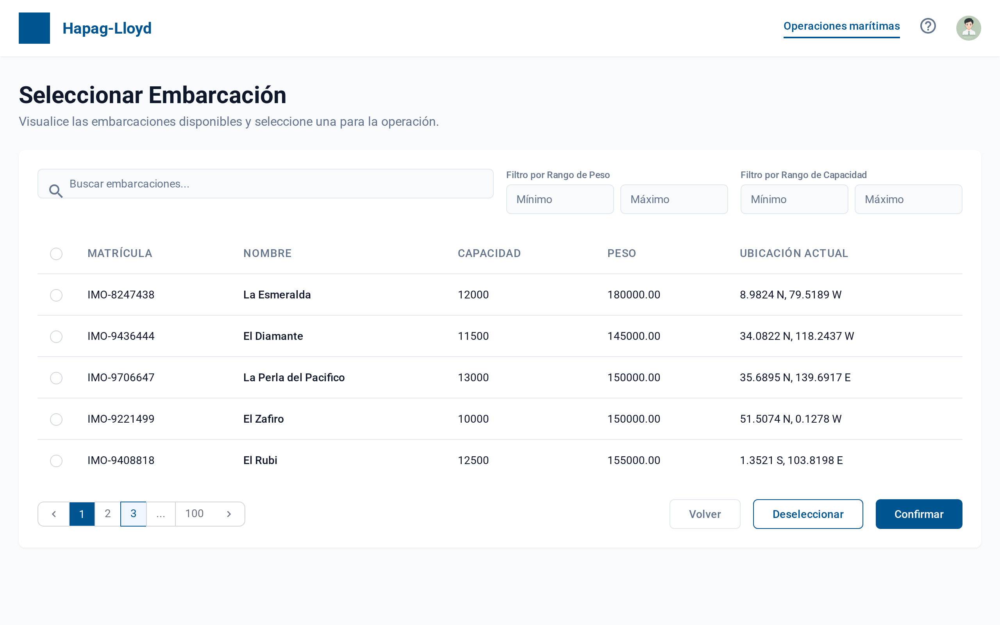

Listado de embarcaciones disponibles con filtros y búsqueda.

---

### CU04: Gestionar equipos portuarios asignados

#### Prototipo P04
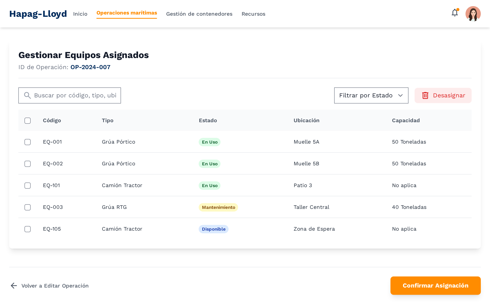

Gestión de equipos portuarios disponibles para asignación.

---

### CU05: Visualizar operaciones marítimas en curso

#### Prototipo P05

Dashboard de operaciones marítimas activas con información de progreso.

---

### CU06: Registrar operación marítima

#### Prototipo P06
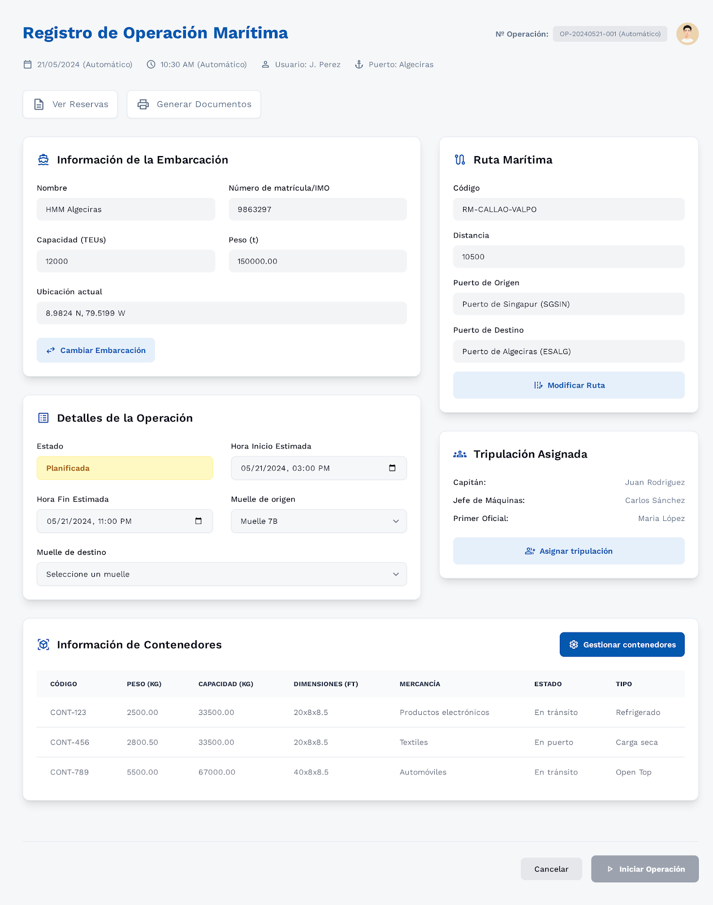

Menú de registro de operación marítima con embarcación, ruta, tripulación y contenedores.

---

### CU07: Seleccionar ruta marítima

#### Prototipo P07
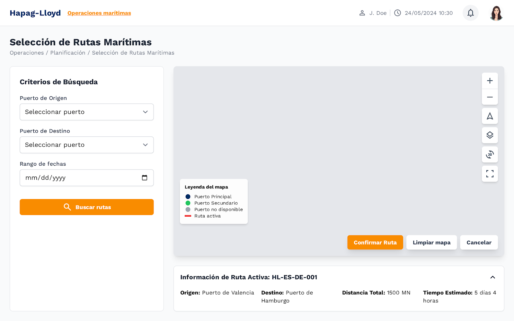

Mapa interactivo para selección de rutas marítimas con filtros.

#### Prototipo P08
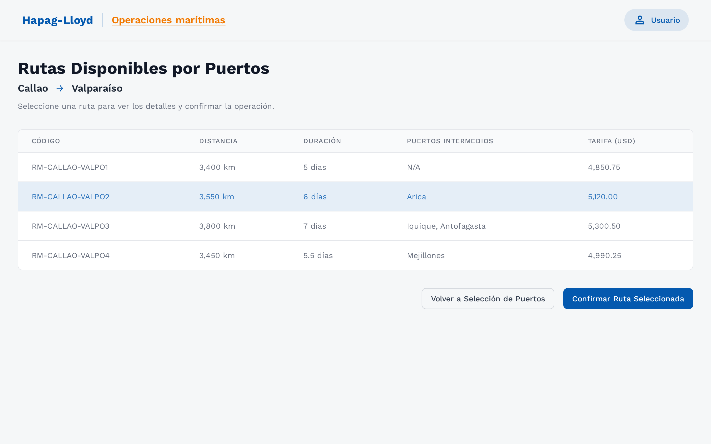

Listado de rutas disponibles según criterios de búsqueda.

---

### CU08: Gestionar contenedores para una operación 

#### Prototipo P09
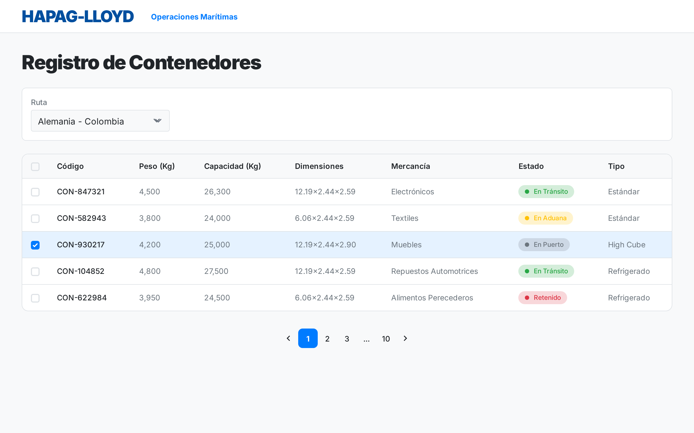

Listado de contenedores reservados pendientes para una ruta marítima dada.

---

### CU09: Gestionar estiba de contenedores

#### Prototipo P10
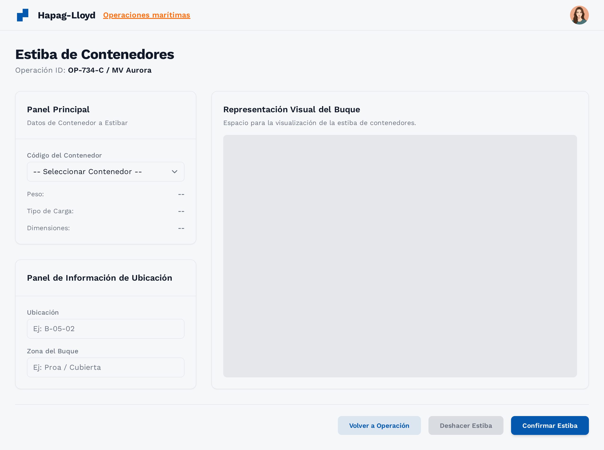

Representación visual del buque para planificación de estiba de contenedores.

---

### CU11: Asignar certificaciones aduaneras

#### Prototipo P12
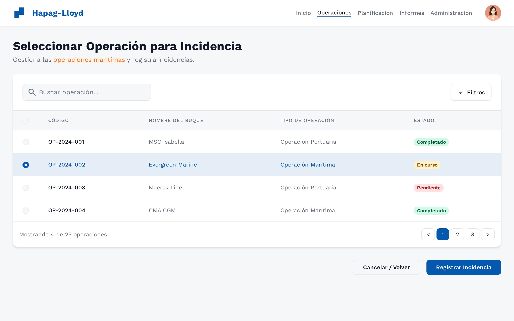

Gestión de certificaciones aduaneras disponibles y asignadas.

---

### CU12: Seleccionar operación para registrar incidencia

#### Prototipo P13
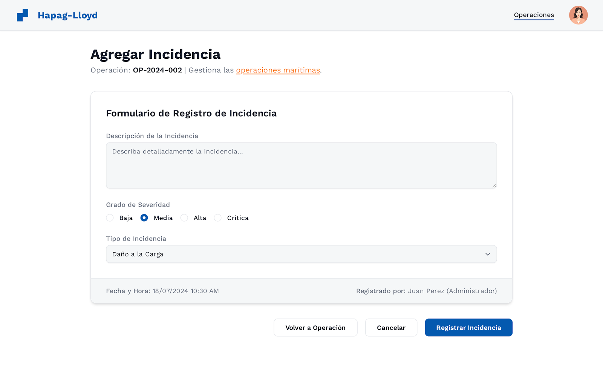

Listado de operaciones para selección y registro de incidencias.

---

### CU13, CU14, CU16: Registrar inspeccion en operación

#### Prototipo P14
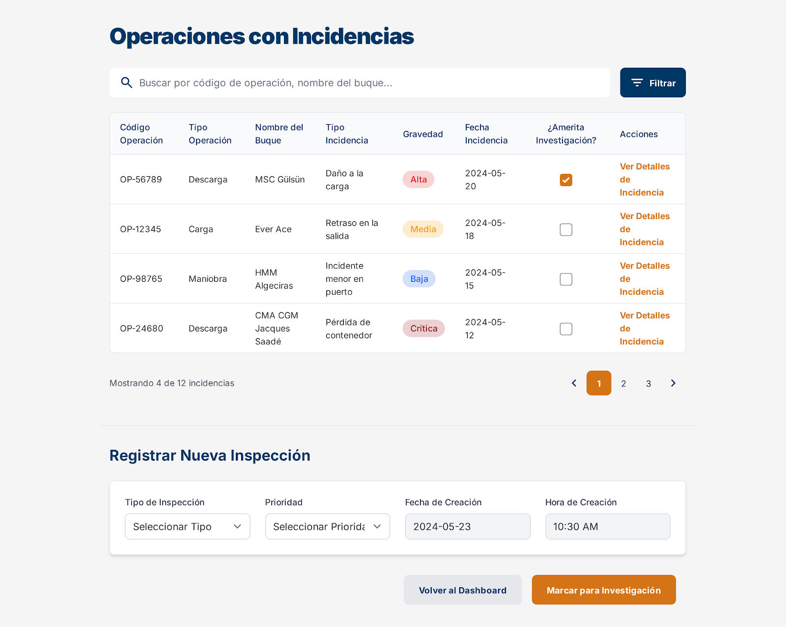

Formulario de registro de incidencia con severidad y tipo.

---

### CU14, CU15: Gestión de inspecciones y registrar hallazgos

#### Prototipo P15
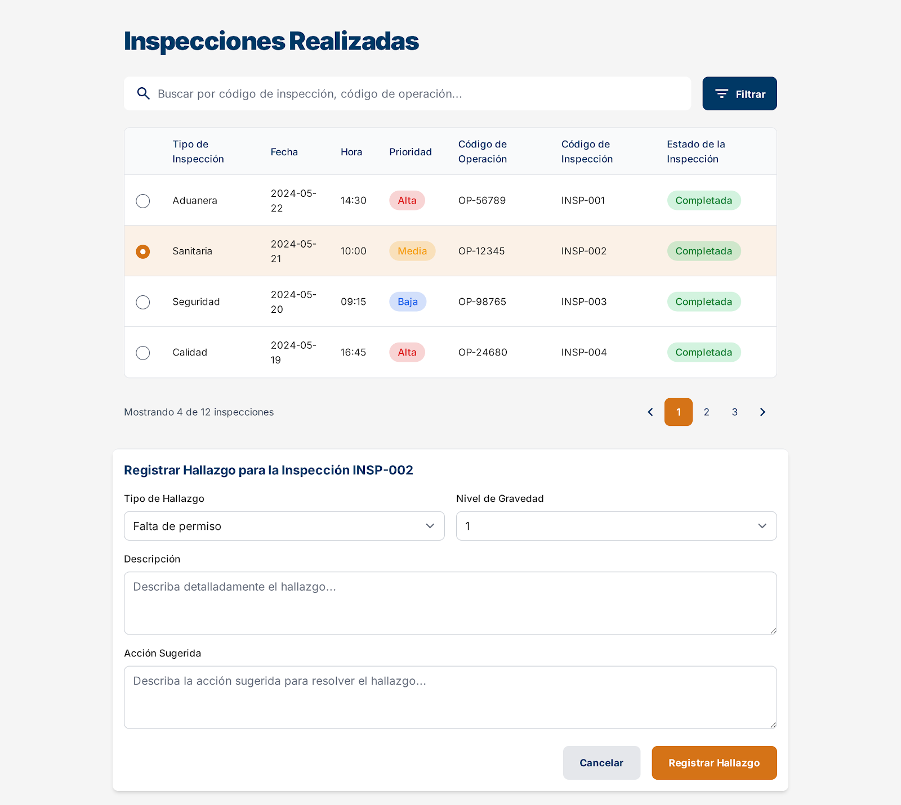

Vista consolidada de operaciones con incidencias y formulario de un nuevo hallazgo.

---

[⬅️ Anterior](../3.2/3.2.md) | [🏠 Home](../../README.md) | [Siguiente ➡️](../3.4/3.4.md)
