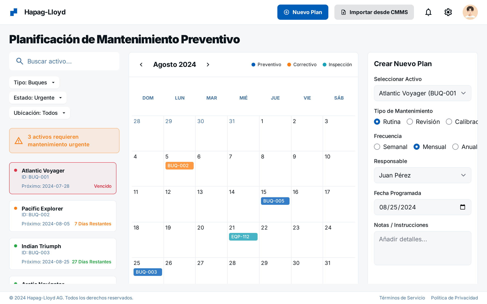
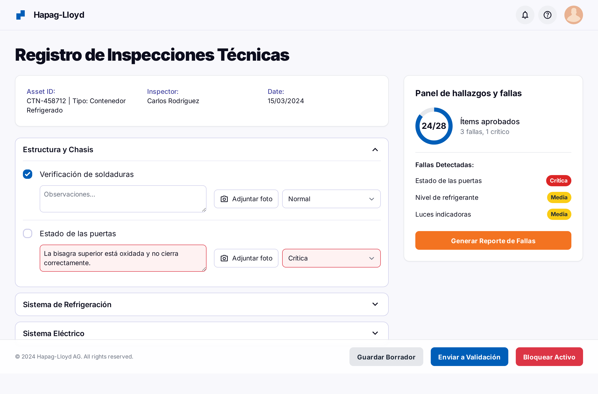
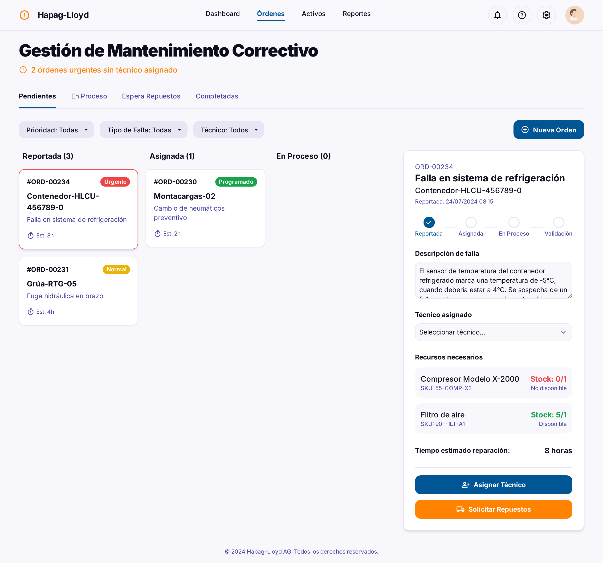
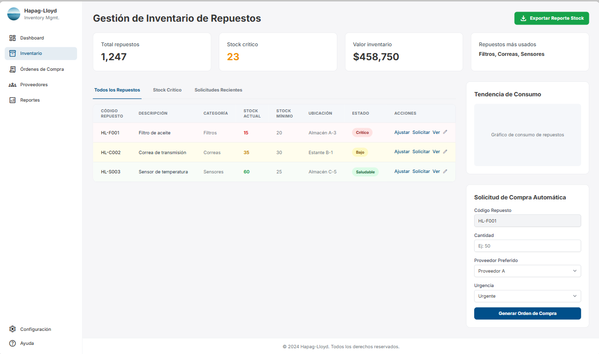
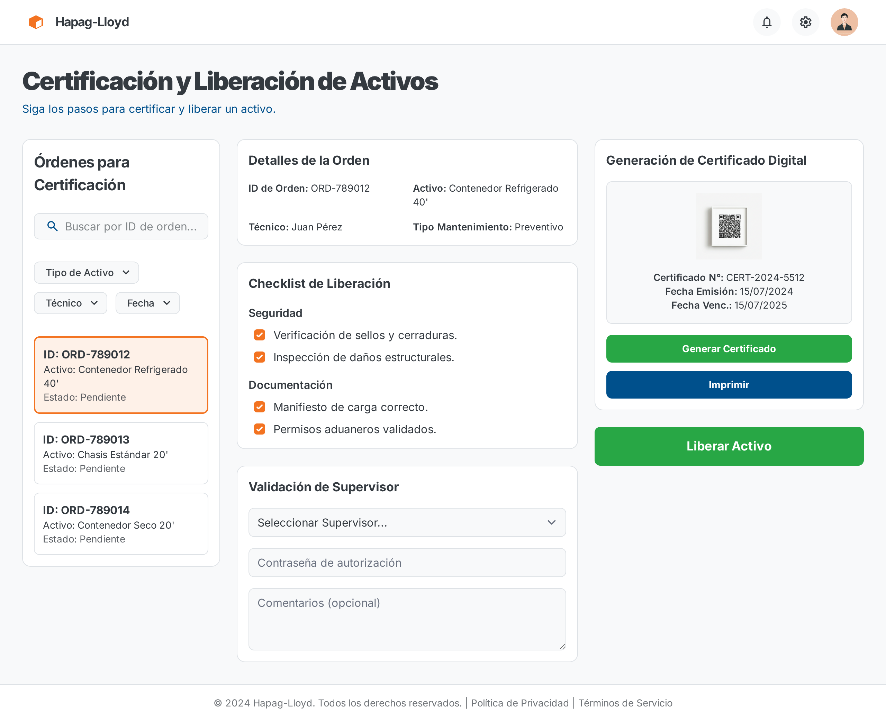
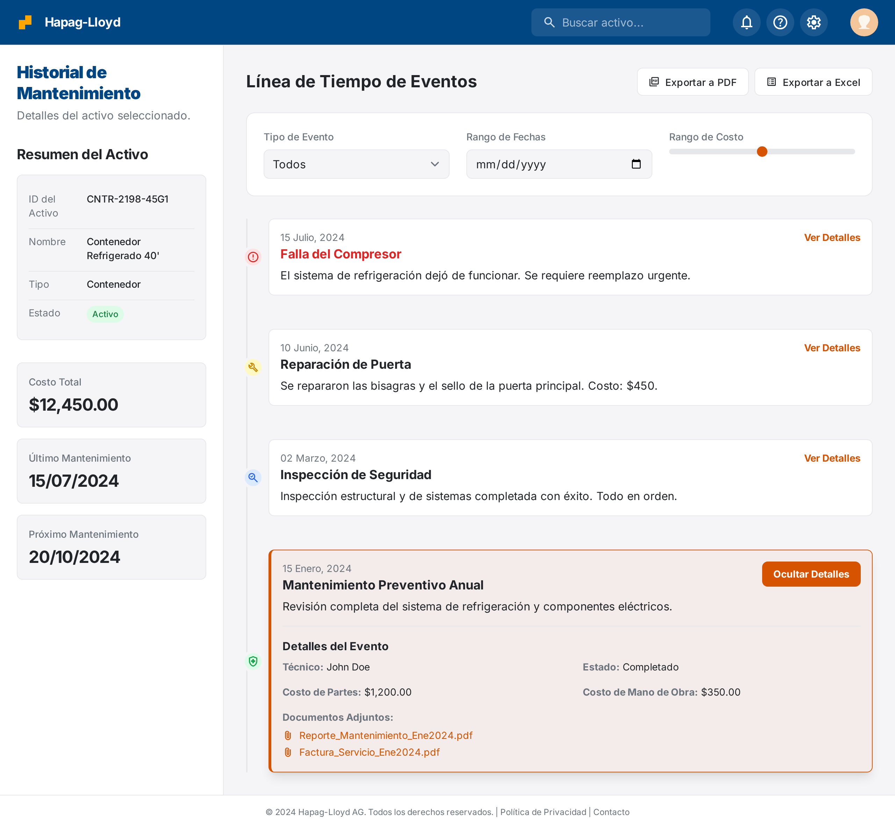
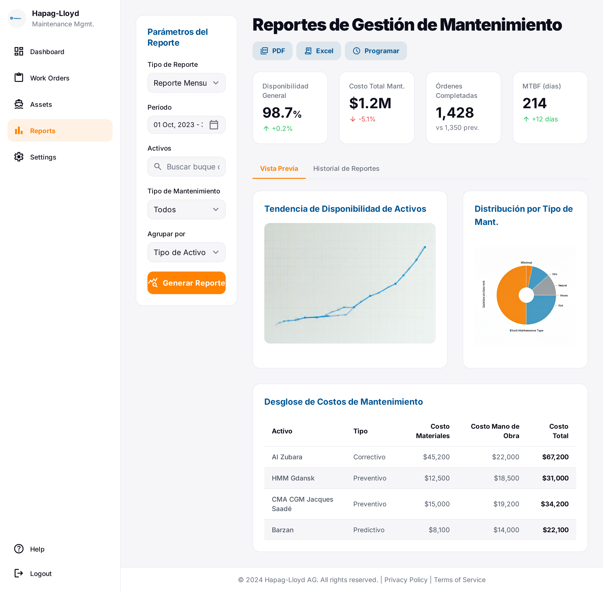
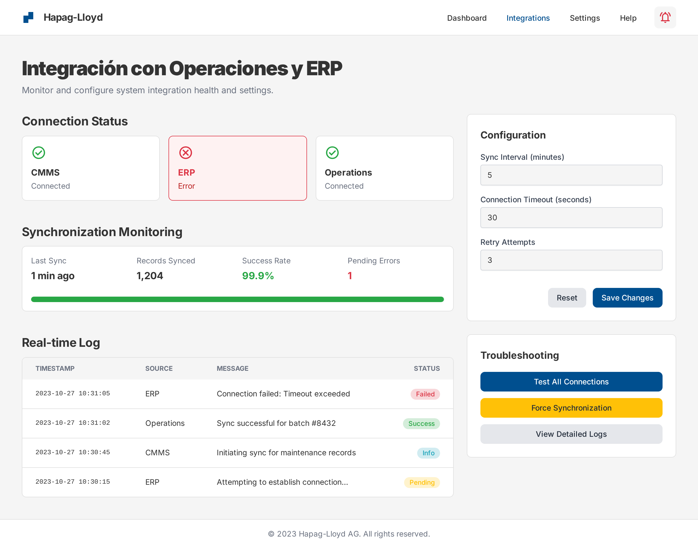

> [3. Especificación de Requisitos y Prototipo](../../3.md) › [3.4.1 Módulo 4.1](3.4.1.md)

# 3.4.1 Módulo de Gestión de Mantenimiento Logístico

## Requerimientos funcionales

| **Código** | **Requerimiento Funcional** | **Caso de Uso** |
|--|--|--|
| RF01 | El sistema debe permitir la planificación y programación de mantenimientos preventivos para activos logísticos, considerando frecuencia, responsables y disponibilidad operativa. | CU01 |
| RF02 | El sistema debe registrar inspecciones técnicas realizadas a los activos, incluyendo hallazgos, fallas detectadas y validación por parte del supervisor. | CU02 |
| RF03 | El sistema debe gestionar mantenimientos correctivos, asignando técnicos, recursos y actualizando el estado del activo tras la reparación. | CU03 |
| RF04 | El sistema debe administrar el inventario de repuestos, controlando niveles mínimos, movimientos y solicitudes automáticas de reposición. | CU04 |
| RF05 | El sistema debe certificar y liberar activos tras mantenimiento, validando condiciones de seguridad y generando certificados digitales. | CU05 |
| RF06 | El sistema debe mantener un historial completo de mantenimientos por activo, incluyendo intervenciones preventivas, correctivas e inspecciones. | CU06 |
| RF07 | El sistema debe generar reportes de mantenimiento que incluyan disponibilidad de activos, cumplimiento de planes y costos asociados. | CU07 |
| RF08 | El sistema debe integrarse con los módulos de operaciones y ERP para sincronizar el estado de activos y coordinar requerimientos de servicio. | CU08 |

## Diagramas de casos de uso

### CU01: Planificar y programar mantenimiento preventivo

- **Actores involucrados**
  - Jefe de mantenimiento
  - Sistema CMMS (Computerized Maintenance Management System)

- **Objetivo**
  - Definir y calendarizar actividades de mantenimiento preventivo para los activos logísticos.

- **Precondiciones**
  - Activos registrados en el sistema.
  - Calendario operativo disponible.

- **Disparador o evento inicial**
  - Revisión periódica de planes de mantenimiento.

- **Flujo principal de eventos**
  1. El jefe de mantenimiento accede al módulo.
  2. El sistema muestra los activos con mantenimientos próximos.
  3. El jefe define fechas y asigna responsables.
  4. El sistema registra el plan de mantenimiento preventivo.
  5. El sistema notifica a técnicos asignados.

- **Flujos alternativos**
  - Si el activo no tiene historial → el sistema solicita datos mínimos para programar.
  - Si no hay recursos disponibles → el sistema sugiere reprogramación.

- **Postcondiciones**
  - Plan de mantenimiento registrado en el sistema.

- **Excepciones**
  - Error de sincronización con calendario operativo.
  - Fallo en notificación a responsables.

- **Pantalla(s) asociada(s):** P01

### CU02: Registrar inspecciones técnicas y fallas

- **Actores involucrados**
  - Técnico de mantenimiento
  - Supervisor de mantenimiento

- **Objetivo**
  - Registrar inspecciones y reportes de fallas detectadas en activos.

- **Precondiciones**
  - Activo disponible para inspección.
  - Checklist definido en el sistema.

- **Disparador o evento inicial**
  - Ejecución de inspección o detección de falla.

- **Flujo principal de eventos**
  1. El técnico selecciona el activo en el sistema.
  2. El sistema muestra checklist de inspección.
  3. El técnico registra hallazgos (aprobado/falla).
  4. El sistema guarda reporte con fecha y hora.
  5. El supervisor valida el registro.

- **Flujos alternativos**
  - Si se detecta falla crítica → el sistema bloquea activo automáticamente.
  - Si la inspección es incompleta → el sistema solicita validación del supervisor.

- **Postcondiciones**
  - Inspección registrada y vinculada al activo.

- **Excepciones**
  - Error en carga de checklist.
  - Fallo en guardar registros.

- **Pantalla(s) asociada(s):** P02

### CU03: Gestionar mantenimiento correctivo

- **Actores involucrados**
  - Técnico de mantenimiento
  - Jefe de mantenimiento
  - Proveedor externo (opcional)

- **Objetivo**
  - Atender reparaciones y mantenimientos correctivos generados por fallas detectadas.

- **Precondiciones**
  - Reporte de falla registrado en el sistema.
  - Activo en estado "no operativo".

- **Disparador o evento inicial**
  - Registro de una falla o solicitud de reparación.

- **Flujo principal de eventos**
  1. El jefe genera orden de trabajo correctiva.
  2. El sistema asigna técnicos y recursos disponibles.
  3. El técnico ejecuta mantenimiento y registra actividades.
  4. El sistema actualiza estado del activo.
  5. El supervisor valida cierre de orden.

- **Flujos alternativos**
  - Si no hay repuestos → el sistema genera solicitud automática al inventario.
  - Si se requiere proveedor externo → el sistema crea orden de servicio.

- **Postcondiciones**
  - Activo reparado y estado actualizado en el sistema.

- **Excepciones**
  - Error en disponibilidad de técnicos.
  - Fallo en integración con inventario.

- **Pantalla(s) asociada(s):** P03

### CU04: Administrar inventario de repuestos

- **Actores involucrados**
  - Área de logística de mantenimiento
  - Sistema ERP

- **Objetivo**
  - Gestionar repuestos y materiales necesarios para mantenimiento.

- **Precondiciones**
  - Inventario inicial cargado en el sistema.
  - Integración activa con ERP.

- **Disparador o evento inicial**
  - Solicitud de repuesto por orden de trabajo.

- **Flujo principal de eventos**
  1. El sistema descuenta repuesto del inventario al asignar orden.
  2. El sistema valida niveles mínimos.
  3. Si el stock es crítico, el sistema genera alerta.
  4. El área logística aprueba orden de compra.
  5. El ERP registra movimiento de inventario.

- **Flujos alternativos**
  - Si no hay stock → el sistema bloquea inicio de orden hasta reposición.
  - Si existe stock en otro almacén → el sistema sugiere traslado interno.

- **Postcondiciones**
  - Inventario actualizado con movimientos registrados.

- **Excepciones**
  - Error en integración con ERP.
  - Datos inconsistentes en stock.

- **Pantalla(s) asociada(s):** P04

### CU05: Certificar y liberar activos

- **Actores involucrados**
  - Supervisor de mantenimiento
  - Técnico de mantenimiento
  - Sistema CMMS

- **Objetivo**
  - Validar condiciones de seguridad y liberar activos tras mantenimiento.

- **Precondiciones**
  - Orden de mantenimiento finalizada.
  - Reportes técnicos disponibles.

- **Disparador o evento inicial**
  - Cierre de una orden de trabajo.

- **Flujo principal de eventos**
  1. El supervisor accede al módulo de certificación.
  2. El sistema muestra checklist de liberación.
  3. El supervisor valida resultados de mantenimiento.
  4. El sistema cambia estado del activo a "operativo".
  5. El sistema genera certificado digital con marca de tiempo.

- **Flujos alternativos**
  - Si la inspección final no es conforme → el sistema mantiene activo bloqueado.
  - Si faltan documentos → el sistema alerta al supervisor.

- **Postcondiciones**
  - Activo liberado para operaciones seguras.

- **Excepciones**
  - Error en carga de reportes técnicos.
  - Fallo en generación de certificado.

- **Pantalla(s) asociada(s):** P05

### CU06: Mantener historial de mantenimiento

- **Actores involucrados**
  - Jefe de mantenimiento
  - Auditor interno
  - Sistema ERP/CMMS

- **Objetivo**
  - Registrar y consultar el historial completo de mantenimientos por activo.

- **Precondiciones**
  - Activos registrados en el sistema.
  - Integración con CMMS activa.

- **Disparador o evento inicial**
  - Solicitud de consulta de historial.

- **Flujo principal de eventos**
  1. El usuario selecciona activo.
  2. El sistema recupera registros históricos de mantenimientos.
  3. El sistema presenta información consolidada (preventivo, correctivo, inspecciones).
  4. El usuario exporta reporte si es necesario.

- **Flujos alternativos**
  - Si faltan datos → el sistema indica registros incompletos.
  - Si se requiere auditoría → el sistema muestra log detallado.

- **Postcondiciones**
  - Historial actualizado y disponible para consulta.

- **Excepciones**
  - Error de integración con CMMS.
  - Datos corruptos en registros.

- **Pantalla(s) asociada(s):** P06

### CU07: Generar reportes de mantenimiento

- **Actores involucrados**
  - Jefe de mantenimiento
  - Gerencia
  - Sistema ERP/CMMS

- **Objetivo**
  - Emitir reportes de disponibilidad, costos y cumplimiento del plan preventivo.

- **Precondiciones**
  - Mantenimientos registrados en el sistema.
  - Acceso a datos financieros en ERP.

- **Disparador o evento inicial**
  - Solicitud de reporte de gestión.

- **Flujo principal de eventos**
  1. El usuario define parámetros (activo, fechas, tipo).
  2. El sistema consulta datos en ERP/CMMS.
  3. El sistema consolida información.
  4. El sistema genera reporte en formato estándar.
  5. El sistema presenta reporte exportable.

- **Flujos alternativos**
  - Si la consulta es muy grande → el sistema segmenta resultados.
  - Si faltan datos → el sistema genera reporte parcial con advertencia.

- **Postcondiciones**
  - Reporte generado y disponible en el sistema.

- **Excepciones**
  - Error en integración ERP/CMMS.
  - Fallo en exportación.

- **Pantalla(s) asociada(s):** P07

### CU08: Integración con operaciones y ERP

- **Actores involucrados**
  - Sistema CMMS
  - Módulo de Operaciones Marítimas
  - Módulo de Operaciones Terrestres
  - Sistema ERP

- **Objetivo**
  - Compartir estado de activos y requerimientos de mantenimiento con otros módulos.

- **Precondiciones**
  - Integración activa entre sistemas.
  - Activos registrados en todos los módulos.

- **Disparador o evento inicial**
  - Cambio de estado de un activo o generación de una orden de mantenimiento.

- **Flujo principal de eventos**
  1. El sistema identifica actualización en el estado de un activo.
  2. El sistema genera mensaje con información relevante.
  3. El mensaje se envía a los módulos correspondientes.
  4. Los módulos actualizan disponibilidad de activos.
  5. El ERP refleja costos y consumos.

- **Flujos alternativos**
  - Si falla el envío → el sistema reintenta automáticamente.
  - Si un módulo no está disponible → el sistema encola mensajes.

- **Postcondiciones**
  - Información sincronizada en todos los módulos.

- **Excepciones**
  - Error de comunicación entre módulos.
  - Datos inconsistentes enviados.

- **Pantalla(s) asociada(s):** P08

## Requisitos de atributos de calidad

#### Rendimiento
- El registro de una inspección técnica no debe superar los 2 minutos por activo.
- La generación de planes preventivos debe completarse en menos de 5 segundos por consulta.
- Los reportes de disponibilidad y costos de mantenimiento deben generarse en menos de 10 segundos para períodos de hasta 12 meses.
- Las actualizaciones en inventario de repuestos deben reflejarse en tiempo real (< 2 segundos).

#### Disponibilidad
- El módulo debe estar disponible al menos el 99.7% del tiempo, considerando que mantenimientos pueden programarse fuera de horarios laborales.
- La disponibilidad crítica aplica en periodos de operaciones intensivas (embarque/desembarque, inspecciones portuarias).

#### Escalabilidad
- El sistema debe soportar hasta 10,000 activos registrados (buques, contenedores y vehículos).
- Debe permitir gestionar al menos 1,000 órdenes de mantenimiento activas en simultáneo.
- Soporte para crecimiento anual del 15% en registros históricos de inspecciones y mantenimientos.

#### Seguridad
- Autenticación multifactor para jefes y supervisores de mantenimiento.
- Cifrado en transmisión de datos técnicos, diagnósticos y certificados digitales.
- Registro obligatorio en log de auditoría con marca de tiempo para todas las inspecciones y liberaciones.
- Control de permisos diferenciados según rol (técnico, supervisor, jefe, auditor).

#### Usabilidad
- Interfaces móviles para técnicos en campo y en puertos.
- El registro de fallas debe realizarse en menos de 5 pasos.
- Los reportes deben estar disponibles en formato gráfico (panel visual) y descargable (PDF, Excel).
- Notificaciones automáticas de mantenimientos vencidos, repuestos críticos y certificaciones próximas a expirar.

## Restricciones

#### Tecnologías requeridas
- Integración obligatoria con ERP corporativo para sincronizar órdenes de trabajo y costos asociados.
- Conexión con el sistema CMMS (Computerized Maintenance Management System) para la gestión de mantenimientos preventivos y correctivos.
- Integración con los módulos de Gestión de Operaciones Marítimas y Terrestres para recibir reportes de fallas e indisponibilidad de activos.
- Integración con el Módulo de Documentación para registrar certificados de inspección y liberación.

#### Integraciones necesarias
- Proveedores externos de repuestos y talleres especializados para órdenes de servicio tercerizadas.
- Plataformas de certificación marítima y de transporte para validación de normativas internacionales.
- Sistemas de monitoreo IoT o telemetría para registrar condiciones en tiempo real de activos críticos.

#### Límites de almacenamiento y licencias
- El historial de mantenimiento de cada activo debe conservarse al menos 10 años.
- Evidencias digitales (fotografías, reportes técnicos, certificados) deben almacenarse un mínimo de 7 años.
- Uso de licencias corporativas para CMMS y ERP, con capacidad de ampliación anual.

#### Normas y estándares regulatorios aplicables
- Cumplimiento con normativas internacionales de seguridad marítima (IMO, ISM Code).
- Cumplimiento de normativas de transporte terrestre y de carga (ADR, normativas locales).
- Conformidad con estándares de gestión de activos ISO 55000.
- Cumplimiento de regulaciones de protección de datos (GDPR y normativas locales).

## Prototipos

### Caso de Uso CU01

#### Prototipo P01

 
Planificación y Programación de Mantenimientos

### Caso de Uso CU02

#### Prototipo P02

 
Registro de Inspecciones Técnicas y Fallas

### Caso de Uso CU03

#### Prototipo P03

 
Gestión de Mantenimientos Correctivos

### Caso de Uso CU04

#### Prototipo P04

 
Administración de Inventario de Repuestos

### Caso de Uso CU05

#### Prototipo P05

 
Certificación y Liberación de Activos

### Caso de Uso CU06

#### Prototipo P06

 
Historial de Mantenimientos

### Caso de Uso CU07

#### Prototipo P07

   
Reportes Técnicos de Mantenimiento

### Caso de Uso CU08

#### Prototipo P08

  
Integración con Operaciones y ERP

[⬅️ Anterior](../../3.4/3.4.md) | [🏠 Home](../../../README.md) | [Siguiente ➡️](../../3.5/3.5.md)