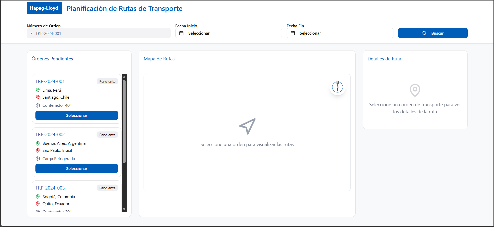
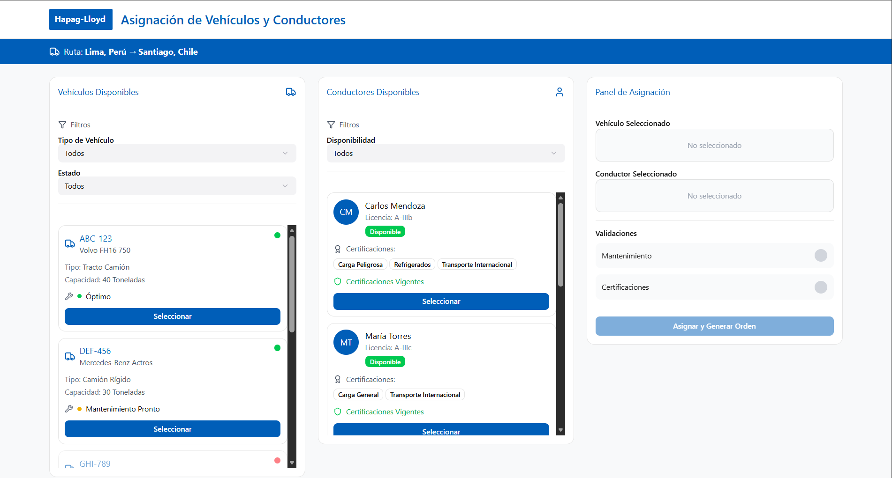
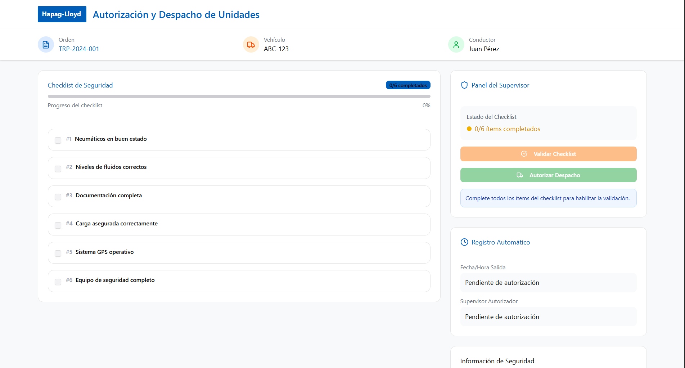
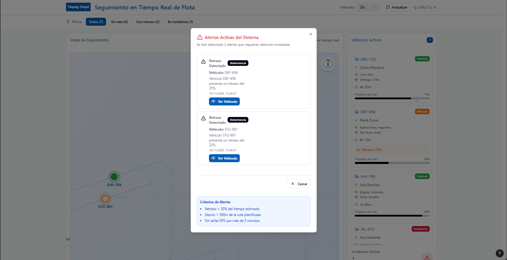
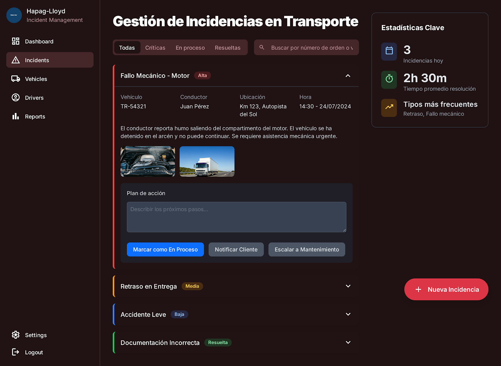
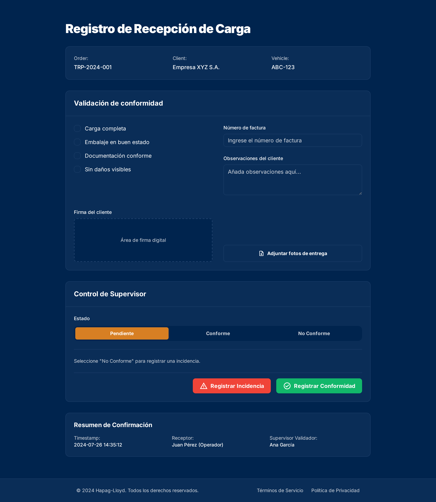
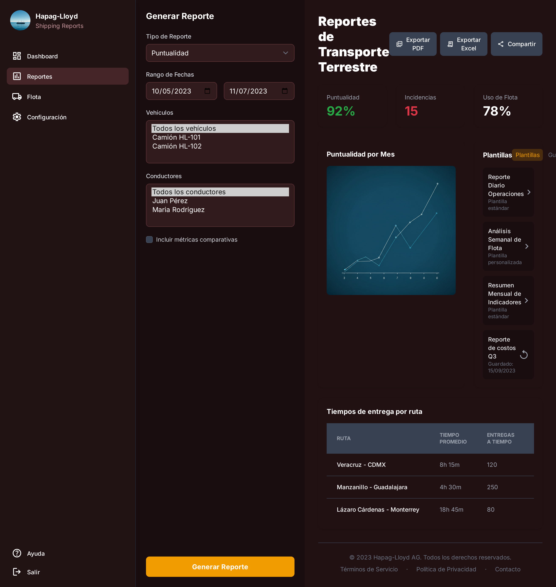
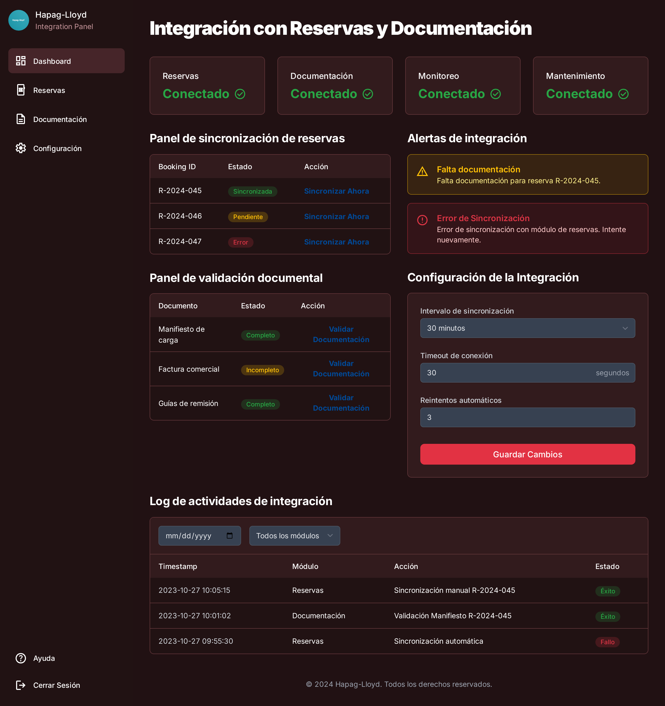
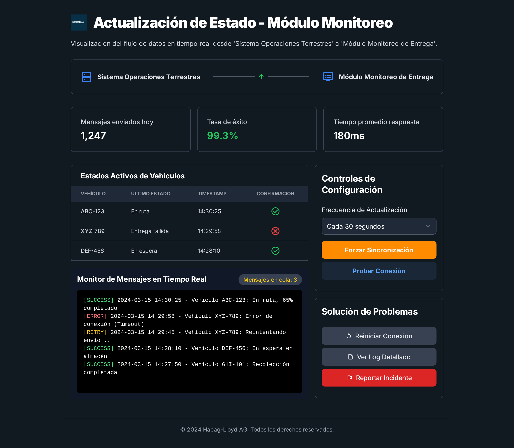
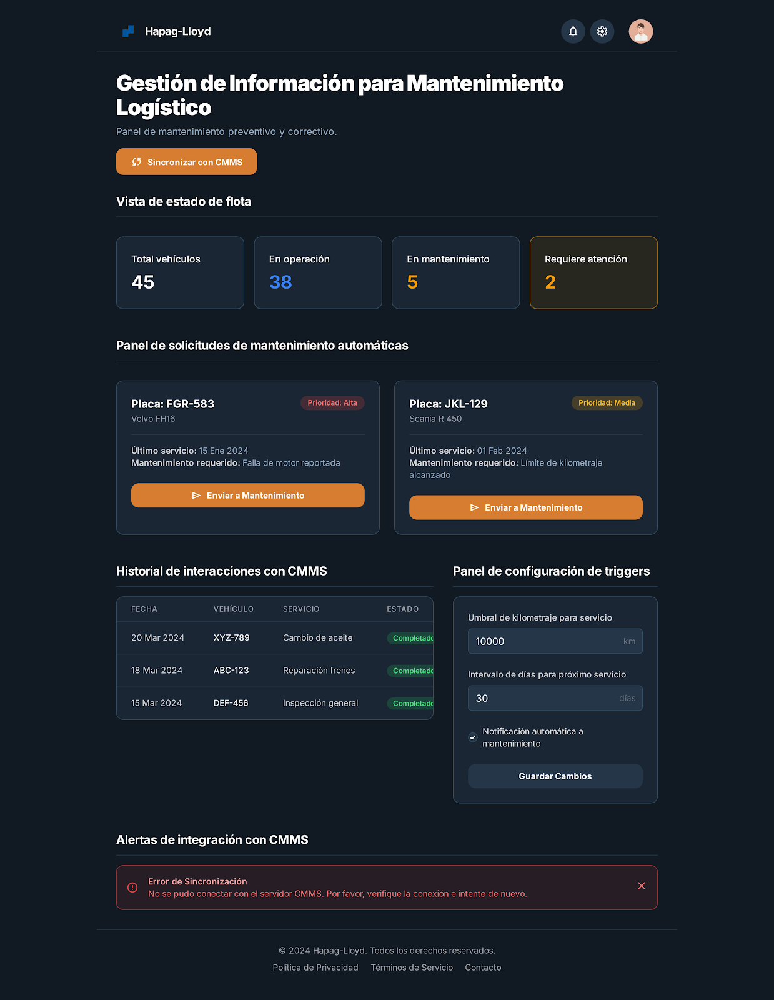

> [3. Especificación de Requisitos y Prototipo](../3.md) › [3.4. Módulo 4](3.4.md)

# 3.4. Módulo de Gestión de Operaciones Terrestres

## Requerimientos funcionales

| **Código** | **Requerimiento Funcional** | **Caso de Uso** |
|--|--|--|
| RF01 | El sistema debe permitir planificar rutas de transporte terrestre considerando tiempos, costos y restricciones legales. | CU01 |
| RF02 | El sistema debe asignar vehículos y conductores disponibles, validando estado técnico y certificaciones vigentes. | CU02 |
| RF03 | El sistema debe autorizar y registrar el despacho de unidades, asegurando cumplimiento del checklist de seguridad. | CU03 |
| RF04 | El sistema debe realizar seguimiento en tiempo real de vehículos mediante GPS, detectando desvíos y retrasos. | CU04 |
| RF05 | El sistema debe gestionar incidencias ocurridas durante el transporte terrestre, notificando a las áreas correspondientes. | CU05 |
| RF06 | El sistema debe registrar la recepción de carga en destino, validando conformidad y cierre de operación. | CU06 |
| RF07 | El sistema debe generar reportes de transporte sobre puntualidad, tiempos de entrega, incidencias y uso de flota. | CU07 |
| RF08 | El sistema debe integrarse con los módulos de reservas y documentación para coordinar entregas y validar documentos. | CU08 |
| RF09 | El sistema debe enviar actualizaciones de estado al módulo de monitoreo de entrega para trazabilidad en tiempo real. | CU09 |
| RF10 | El sistema debe compartir información sobre estado de vehículos y requerimientos de servicio con el módulo de mantenimiento logístico. | CU10 |

## Diagramas de casos de uso

### CU01: Planificar rutas de transporte terrestre

- **Actores involucrados**
  - Planificador logístico
  - Sistema TMS (Transportation Management System)
  - Área de logística terrestre

- **Objetivo**
  - Definir rutas óptimas para el transporte terrestre considerando tiempos, costos y regulaciones de tránsito.

- **Precondiciones**
  - Debe existir una orden de transporte activa.
  - Información de reservas confirmadas en el sistema.
  - Flota disponible registrada en el sistema.

- **Disparador o evento inicial**
  - Necesidad de trasladar un contenedor desde/hacia el puerto o cliente final.

- **Flujo principal de eventos**
  1. El planificador accede al módulo de operaciones terrestres.
  2. El sistema consulta órdenes de transporte pendientes.
  3. El planificador selecciona una orden de transporte.
  4. El sistema presenta alternativas de rutas disponibles con tiempos y costos estimados.
  5. El planificador evalúa y selecciona la ruta más adecuada.
  6. El sistema registra la ruta seleccionada y la vincula con la orden de transporte.
  7. El sistema notifica la planificación a los módulos de documentación y monitoreo de entrega.

- **Flujos alternativos**
  - Si no existen rutas disponibles → el sistema sugiere rutas alternativas basadas en historial.
  - Si la ruta seleccionada presenta restricciones legales → el sistema alerta al planificador y solicita otra selección.

- **Postcondiciones**
  - Ruta terrestre registrada y asociada a la orden de transporte.
  - Información disponible para asignación de transporte.

- **Excepciones**
  - Error en la integración con sistemas de tránsito.
  - Información incompleta de la orden de transporte.

- **Pantalla(s) asociada(s):** P01

### CU02: Asignar vehículos y conductores

- **Actores involucrados**
  - Supervisor de transporte
  - Conductores
  - Sistema de gestión de flota (FMS)

- **Objetivo**
  - Asignar unidades de transporte y conductores disponibles para la ejecución de la ruta planificada.

- **Precondiciones**
  - Debe existir una ruta planificada en el sistema.
  - Vehículos registrados con estado operativo validado.
  - Conductores registrados con licencias y certificaciones vigentes.

- **Disparador o evento inicial**
  - Confirmación de la ruta de transporte terrestre.

- **Flujo principal de eventos**
  1. El supervisor accede al módulo de asignación de transporte.
  2. El sistema muestra la lista de vehículos disponibles y en condiciones operativas.
  3. El supervisor selecciona un vehículo y un conductor.
  4. El sistema valida el mantenimiento vigente y certificaciones del conductor.
  5. El supervisor confirma la asignación.
  6. El sistema genera la orden de despacho vinculada al vehículo y conductor asignados.

- **Flujos alternativos**
  - Si el vehículo no cuenta con mantenimiento vigente → el sistema bloquea su asignación.
  - Si el conductor no tiene certificaciones válidas → el sistema sugiere personal alternativo.

- **Postcondiciones**
  - Orden de despacho generada con vehículo y conductor asignados.

- **Excepciones**
  - Error de comunicación con el sistema de gestión de flota.
  - Falta de disponibilidad de unidades.

- **Pantalla(s) asociada(s):** P02

### CU03: Autorizar y registrar despacho de unidades

- **Actores involucrados**
  - Supervisor de transporte
  - Conductor
  - Sistema de seguridad vehicular

- **Objetivo**
  - Autorizar la salida de unidades de transporte asegurando condiciones de seguridad.

- **Precondiciones**
  - Vehículo y conductor asignados.
  - Checklist de seguridad disponible en el sistema.

- **Disparador o evento inicial**
  - Inicio del traslado de carga programado.

- **Flujo principal de eventos**
  1. El supervisor accede a la opción de despacho.
  2. El conductor realiza el checklist de seguridad en la aplicación.
  3. El sistema valida que todos los puntos del checklist estén cumplidos.
  4. El supervisor autoriza el despacho.
  5. El sistema registra fecha y hora de salida del vehículo.
  6. El sistema envía la información al módulo de monitoreo de entrega.

- **Flujos alternativos**
  - Si un punto del checklist no está conforme → el sistema bloquea el despacho.
  - Si no se recibe confirmación del conductor → el sistema alerta al supervisor.

- **Postcondiciones**
  - Vehículo en tránsito registrado en el sistema.

- **Excepciones**
  - Error en el registro de GPS.
  - Fallo en la aplicación del checklist.

- **Pantalla(s) asociada(s):** P03

### CU04: Seguimiento en tiempo real de vehículos

- **Actores involucrados**
  - Supervisor de transporte
  - Área de monitoreo de entrega
  - Sistema GPS

- **Objetivo**
  - Monitorear la ubicación y estado de los vehículos durante el transporte terrestre.

- **Precondiciones**
  - Vehículo despachado con GPS operativo.
  - Integración activa con sistema de monitoreo.

- **Disparador o evento inicial**
  - Salida del vehículo del punto de origen.

- **Flujo principal de eventos**
  1. El sistema inicia el rastreo del vehículo en tránsito.
  2. El sistema actualiza la ubicación en intervalos definidos.
  3. El supervisor visualiza el recorrido en el panel de monitoreo.
  4. El sistema detecta desvíos o retrasos e informa al supervisor.
  5. El sistema envía actualizaciones al módulo de monitoreo de entrega.

- **Flujos alternativos**
  - Si el GPS pierde señal → el sistema muestra última posición registrada.
  - Si hay retrasos mayores al 20% del tiempo estimado → el sistema genera alerta.

- **Postcondiciones**
  - Ruta y estado del vehículo actualizados en tiempo real.

- **Excepciones**
  - Fallo de comunicación con el GPS.
  - Caída del sistema de monitoreo.

- **Pantalla(s) asociada(s):** P04

### CU05: Gestionar incidencias durante transporte

- **Actores involucrados**
  - Conductor
  - Supervisor de transporte
  - Cliente

- **Objetivo**
  - Registrar y atender incidencias ocurridas durante el transporte terrestre.

- **Precondiciones**
  - Vehículo en tránsito registrado.
  - Canal de comunicación activo con el sistema.

- **Disparador o evento inicial**
  - Ocurrencia de una incidencia (retraso, accidente, emergencia).

- **Flujo principal de eventos**
  1. El conductor reporta la incidencia desde la aplicación.
  2. El sistema registra la incidencia con ubicación y hora.
  3. El supervisor evalúa la gravedad del incidente.
  4. El sistema notifica a las áreas correspondientes (monitoreo, cliente, mantenimiento).
  5. El sistema genera plan de acción según el tipo de incidencia.

- **Flujos alternativos**
  - Si la incidencia es menor → el sistema permite continuar viaje con observación.
  - Si la incidencia es crítica → el sistema bloquea el despacho hasta resolución.

- **Postcondiciones**
  - Incidencia registrada y tratada en el sistema.
  - Cliente notificado del estado del transporte.

- **Excepciones**
  - Fallo en comunicación con el conductor.
  - Error en notificación al cliente.

- **Pantalla(s) asociada(s):** P05

### CU06: Registrar recepción de carga

- **Actores involucrados**
  - Cliente
  - Supervisor de operaciones terrestres
  - Conductor

- **Objetivo**
  - Confirmar la llegada de la carga a destino intermedio o final.

- **Precondiciones**
  - Vehículo en tránsito registrado.
  - Documentación validada en el sistema.

- **Disparador o evento inicial**
  - Arribo de la carga a destino.

- **Flujo principal de eventos**
  1. El conductor informa llegada al destino.
  2. El cliente o receptor valida la conformidad de la carga.
  3. El sistema registra firma digital o confirmación física.
  4. El supervisor valida el cierre de transporte terrestre.
  5. El sistema notifica la entrega al módulo de monitoreo de entrega.

- **Flujos alternativos**
  - Si el cliente detecta daños en la carga → el sistema registra incidencia.
  - Si no se recibe conformidad → el sistema mantiene estado "pendiente".

- **Postcondiciones**
  - Transporte terrestre cerrado en el sistema.
  - Carga registrada como entregada.

- **Excepciones**
  - Fallo en validación documental.
  - Error en firma digital.

- **Pantalla(s) asociada(s):** P06

### CU07: Generar reportes de transporte

- **Actores involucrados**
  - Supervisor de transporte
  - Planificador logístico
  - Sistema ERP/TMS

- **Objetivo**
  - Emitir reportes de puntualidad, tiempos de entrega, incidencias y utilización de flota.

- **Precondiciones**
  - Transporte finalizado en el sistema.
  - Información consolidada de vehículos y entregas.

- **Disparador o evento inicial**
  - Solicitud de reporte por parte de supervisor o planificador.

- **Flujo principal de eventos**
  1. El usuario selecciona parámetros del reporte.
  2. El sistema consulta datos en ERP/TMS.
  3. El sistema consolida la información.
  4. El sistema genera el reporte en formato estándar.
  5. El sistema presenta reporte descargable o exportable.

- **Flujos alternativos**
  - Si hay datos incompletos → el sistema genera reporte parcial con advertencia.
  - Si la consulta es muy grande → el sistema divide resultados en lotes.

- **Postcondiciones**
  - Reporte generado y almacenado en el sistema.

- **Excepciones**
  - Error en integración con ERP/TMS.
  - Fallo en exportación de reporte.

- **Pantalla(s) asociada(s):** P07

### CU08: Integración con módulos de reservas y documentación

- **Actores involucrados**
  - Módulo de Gestión de Reservas
  - Módulo de Gestión de Documentación
  - Supervisor de transporte

- **Objetivo**
  - Coordinar entregas terrestres en base a reservas confirmadas y validar documentación asociada.

- **Precondiciones**
  - Reservas confirmadas en el sistema.
  - Documentos de transporte generados.

- **Disparador o evento inicial**
  - Confirmación de transporte terrestre asociado a una reserva.

- **Flujo principal de eventos**
  1. El sistema consulta datos de reservas confirmadas.
  2. El sistema valida documentación de transporte vinculada.
  3. El supervisor confirma coordinación de entrega terrestre.
  4. El sistema sincroniza la información con otros módulos.

- **Flujos alternativos**
  - Si falta documentación → el sistema alerta y bloquea despacho.
  - Si los datos no coinciden → el sistema solicita corrección manual.

- **Postcondiciones**
  - Transporte terrestre coordinado con reservas y documentación válida.

- **Excepciones**
  - Error de integración entre módulos.
  - Formato de datos incompatible.

- **Pantalla(s) asociada(s):** P08

### CU09: Actualizar estado al módulo de monitoreo de entrega

- **Actores involucrados**
  - Sistema de gestión de operaciones terrestres
  - Módulo de Monitoreo de Entrega
  - Supervisor de transporte

- **Objetivo**
  - Enviar actualizaciones de estado del transporte al módulo de monitoreo para trazabilidad en tiempo real.

- **Precondiciones**
  - Vehículo en tránsito con GPS activo.
  - Integración activa entre módulos.

- **Disparador o evento inicial**
  - Cambio de estado en el transporte terrestre.

- **Flujo principal de eventos**
  1. El sistema detecta un cambio de estado en el transporte.
  2. El sistema genera mensaje con datos de la operación.
  3. El sistema envía mensaje al módulo de monitoreo de entrega.
  4. El módulo de monitoreo confirma recepción.
  5. El sistema registra actualización en trazabilidad.

- **Flujos alternativos**
  - Si falla el envío → el sistema reintenta automáticamente.
  - Si el módulo receptor no está disponible → el sistema almacena la información en cola.

- **Postcondiciones**
  - Estado del transporte actualizado en monitoreo de entrega.

- **Excepciones**
  - Error de comunicación entre módulos.
  - Datos inconsistentes en el mensaje.

- **Pantalla(s) asociada(s):** P09

### CU10: Compartir información con mantenimiento logístico

- **Actores involucrados**
  - Supervisor de transporte
  - Área de mantenimiento
  - Sistema CMMS (Computerized Maintenance Management System)

- **Objetivo**
  - Proporcionar información del estado de vehículos y requerimientos de servicio al módulo de mantenimiento logístico.

- **Precondiciones**
  - Vehículos registrados en el sistema de operaciones terrestres.
  - Historial de mantenimiento disponible en CMMS.

- **Disparador o evento inicial**
  - Finalización de transporte o detección de incidencia en vehículo.

- **Flujo principal de eventos**
  1. El sistema detecta necesidad de mantenimiento (por kilometraje, fallas o incidencias).
  2. El sistema genera solicitud de mantenimiento.
  3. El sistema envía información al módulo de mantenimiento logístico.
  4. El área de mantenimiento recibe y programa la actividad correspondiente.

- **Flujos alternativos**
  - Si el sistema no logra enviar información → almacena la solicitud y reintenta.
  - Si el vehículo ya está en mantenimiento → se actualiza estado sin generar duplicado.

- **Postcondiciones**
  - Solicitud de mantenimiento registrada y enviada al área correspondiente.

- **Excepciones**
  - Error en integración con CMMS.
  - Datos incompletos de la unidad.

- **Pantalla(s) asociada(s):** P10

## Requisitos de atributos de calidad

#### Rendimiento
- El sistema debe permitir la planificación de rutas en menos de 5 segundos por orden de transporte.
- La asignación de vehículos y conductores debe completarse en menos de 3 segundos por consulta.
- Las actualizaciones de ubicación vía GPS deben recibirse en intervalos de máximo 30 segundos.
- Los reportes de transporte (puntualidad, incidencias, utilización de flota) deben generarse en menos de 10 segundos para períodos de hasta 30 días.

#### Disponibilidad
- El módulo debe estar disponible al menos el 99.8% del tiempo, dado que las operaciones terrestres pueden ejecutarse de manera continua.
- La disponibilidad crítica aplica especialmente en horas pico de despacho y llegada a puertos.

#### Escalabilidad
- El sistema debe soportar hasta 1,000 transportes terrestres activos en simultáneo.
- Debe manejar hasta 500 actualizaciones de estado concurrentes por minuto desde dispositivos GPS.
- Soporte para crecimiento anual del 20% en volumen de operaciones terrestres.

#### Seguridad
- Autenticación multifactor para supervisores y planificadores logísticos.
- Cifrado de extremo a extremo en la transmisión de datos de GPS y estados de transporte.
- Registro en log de auditoría con marca de tiempo para todos los eventos críticos (salidas, incidencias, entregas).
- Validación de permisos diferenciados para conductores, supervisores y clientes.

#### Usabilidad
- Interfaces accesibles desde dispositivos móviles para conductores y supervisores.
- El registro de incidencias debe realizarse en menos de 3 pasos desde la aplicación móvil.
- Los reportes deben mostrarse en un formato claro, descargable y fácil de compartir.
- El seguimiento de rutas debe visualizarse en un mapa interactivo.

## Restricciones

#### Tecnologías requeridas
- Integración obligatoria con ERP y TMS corporativos.
- Conexión con sistemas GPS para monitoreo en tiempo real.
- Integración con los módulos de Gestión de Reservas, Gestión de Documentación, Gestión de Monitoreo de Entrega y Gestión de Mantenimiento Logístico.

#### Integraciones necesarias
- Sistemas de tránsito y seguridad vial nacionales para validación de rutas.
- Plataformas externas de geolocalización y tráfico en tiempo real.
- Sistemas de gestión de incidencias para comunicación con clientes.

#### Límites de almacenamiento y licencias
- Historial de viajes y entregas debe mantenerse por un período mínimo de 7 años.
- Los registros de incidencias y reportes técnicos deben almacenarse al menos por 5 años para fines legales y de auditoría.

#### Normas y estándares regulatorios aplicables
- Cumplimiento de normativas de tránsito y seguridad vial nacionales.
- Cumplimiento de normativas internacionales de transporte terrestre de mercancías peligrosas (ADR).
- Conformidad con regulaciones de protección de datos (GDPR y normativas locales).
- Estándares de trazabilidad en cadena de suministro (ISO 28000).

## Prototipos

### Caso de Uso CU01

#### Prototipo P01

Planificación de Rutas

### Caso de Uso CU02

#### Prototipo P02

Asignación de Vehículos y Conductores

### Caso de Uso CU03

#### Prototipo P03

Despacho de Unidades

### Caso de Uso CU04

#### Prototipo P04

Seguimiento en Tiempo Real

### Caso de Uso CU05

#### Prototipo P05

Gestión de incidencias

### Caso de Uso CU06

#### Prototipo P06

Recepción de Carga

### Caso de Uso CU07

#### Prototipo P07

Reportes de Transporte

### Caso de Uso CU08

#### Prototipo P08

Validación Documental Integrada

### Caso de Uso CU09

#### Prototipo P09

Actualización a Monitoreo

### Caso de Uso CU10

#### Prototipo P10

---

[⬅️ Anterior](../3.3/3.3.md) | [🏠 Home](../../README.md) | [Siguiente ➡️](../3.4/3.4.1/3.4.1.md)