> [3. Especificación de Requisitos y Prototipo](../3.md) › [3.5. Módulo 5](3.5.md)

# 3.5. Módulo de Monitoreo de Entrega

## Requerimientos funcionales

| **Código** | **Requerimiento Funcional** | **Caso de Uso** |
| -- | -- | -- |
| RF01 | El sistema debe registrar y gestionar operaciones de monitoreo, asociando contenedores, vehículos o buques con operadores responsables. | CU01 |
| RF02 | El sistema debe recopilar y almacenar automáticamente las posiciones GPS de contenedores, vehículos y buques en intervalos configurables. | CU02 |
| RF03 | El sistema debe monitorear en tiempo real los datos de sensores IoT instalados en contenedores (temperatura, humedad, vibración, apertura). | CU03 |
| RF04 | El sistema debe generar notificaciones automáticas cuando los valores de los sensores excedan umbrales configurados. | CU04 |
| RF05 | El sistema debe permitir registrar incidencias vinculadas a operaciones de monitoreo, clasificadas por tipo y severidad. | CU05 |
| RF06 | El sistema debe generar reportes consolidados de monitoreo que incluyan notificaciones e incidencias registradas durante una operación. | CU06 |
| RF07 | El sistema debe visualizar en tiempo real la ubicación de contenedores, vehículos y buques en un mapa interactivo. | CU07 |
| RF08 | El sistema debe registrar la entrega final del contenedor al importador, validando documentación y capturando evidencia digital. | CU08 |

## Diagramas de casos de uso

### CU01: Registrar operación de monitoreo

- **Actores involucrados**
    - Operador
    - Sistema de Monitoreo

- **Objetivo**
    - Crear una nueva operación de monitoreo asociando contenedores, medios de transporte y operadores responsables.

- **Precondiciones**
    - El operador debe estar autenticado en el sistema.
    - Los contenedores deben estar registrados y disponibles.
    - Los vehículos o buques deben estar registrados en el sistema.

- **Disparador o evento inicial**
    - El operador selecciona la opción "Nueva operación de monitoreo" desde el módulo de operaciones.

- **Flujo principal de eventos**
    1. El operador accede al módulo de operaciones de monitoreo.
    2. El sistema solicita: código de operación, fecha de inicio, contenedores a monitorear, medio de transporte (vehículo o buque).
    3. El operador ingresa la información requerida.
    4. El sistema valida que los contenedores estén disponibles y el transporte esté operativo.
    5. El sistema asigna automáticamente el operador responsable.
    6. El sistema genera el registro de operación de monitoreo con estado "En curso".
    7. El sistema activa el monitoreo automático de posiciones GPS y sensores.
    8. El sistema confirma la creación de la operación al operador.

- **Flujos alternativos**
    - Si algún contenedor no está disponible → el sistema alerta al operador y no permite continuar.
    - Si el vehículo/buque está en mantenimiento → el sistema rechaza la asignación.
    - Si falta información obligatoria → el sistema solicita completar los datos.

- **Postcondiciones**
    - La operación de monitoreo queda registrada y activa.
    - Se inicia la recopilación automática de datos GPS y sensores.
    - Los operadores pueden visualizar la operación en el dashboard.

- **Excepciones**
    - Fallo en la conexión con la base de datos.
    - Error en la integración con dispositivos GPS/IoT.

- **Pantalla(s) asociada(s):** P01, P02

---

### CU02: Monitoreo automático de posiciones GPS

- **Actores involucrados**
    - Sistema de rastreo GPS/satelital
    - Sistema de Monitoreo

- **Objetivo**
    - Recopilar y almacenar automáticamente las coordenadas GPS de contenedores, vehículos y buques durante operaciones activas.

- **Precondiciones**
    - Debe existir una operación de monitoreo activa (CU01 completado).
    - Los dispositivos GPS deben estar operativos y transmitiendo señal.
    - La frecuencia de actualización debe estar configurada en el sistema.

- **Disparador o evento inicial**
    - El dispositivo GPS transmite automáticamente la posición según la frecuencia configurada (ej. cada 30 min para terrestre, cada 6 horas para marítimo).

- **Flujo principal de eventos**
    1. El dispositivo GPS del contenedor/vehículo/buque transmite coordenadas (latitud, longitud).
    2. El sistema recibe la señal GPS con timestamp.
    3. El sistema identifica a qué contenedor/vehículo/buque pertenece la señal.
    4. El sistema valida que la posición esté dentro de rangos geográficos esperados.
    5. El sistema almacena la posición en la tabla correspondiente (PosicionContenedor, PosicionVehiculo o PosicionBuque).
    6. El sistema actualiza el mapa de monitoreo en tiempo real.
    7. El sistema registra la última actualización en el dashboard.

- **Flujos alternativos**
    - Si no se recibe señal GPS en el tiempo esperado → el sistema genera alerta de "Sin señal" al operador.
    - Si las coordenadas están fuera del rango esperado → el sistema genera alerta de "Desvío de ruta".
    - Si hay error en la transmisión → el sistema mantiene la última posición válida y registra el error.

- **Postcondiciones**
    - El historial de posiciones queda actualizado.
    - El mapa muestra la ubicación actual del activo.
    - Se mantiene trazabilidad completa del recorrido.

- **Excepciones**
    - Pérdida de señal satelital prolongada.
    - Dispositivo GPS desconectado o sin batería.
    - Error en la base de datos que impida almacenar posiciones.

- **Pantalla(s) asociada(s):** P03, P04

---

### CU03: Monitoreo de sensores IoT

- **Actores involucrados**
    - Sensores IoT (temperatura, humedad, vibración, apertura)
    - Sistema de Monitoreo
    - Operador

- **Objetivo**
    - Recopilar y visualizar en tiempo real los datos de sensores instalados en contenedores para detectar condiciones anormales.

- **Precondiciones**
    - Los sensores deben estar instalados y operativos en el contenedor.
    - El contenedor debe estar asociado a una operación de monitoreo activa.
    - Los umbrales de alerta deben estar configurados para cada tipo de sensor.

- **Disparador o evento inicial**
    - Los sensores transmiten datos automáticamente según frecuencia configurada.
    - El operador consulta el estado de los sensores desde el panel de monitoreo.

- **Flujo principal de eventos**
    1. El sensor captura la medición (temperatura, humedad, vibración u otro).
    2. El sensor transmite el valor al sistema con timestamp.
    3. El sistema identifica el contenedor y tipo de sensor.
    4. El sistema almacena el valor en la tabla correspondiente.
    5. El sistema compara el valor contra los umbrales configurados.
    6. Si el valor está dentro del rango normal → actualiza el dashboard sin generar alerta.
    7. El operador visualiza los valores actuales en el panel de sensores.
    8. El sistema genera gráficos históricos de las mediciones.

- **Flujos alternativos**
    - Si el valor excede umbrales → el sistema ejecuta CU04 (generación de notificación automática).
    - Si el sensor no transmite datos → el sistema alerta "Sensor sin comunicación".
    - Si hay inconsistencia en datos → el sistema solicita validación manual.

- **Postcondiciones**
    - Los datos de sensores quedan almacenados con trazabilidad completa.
    - Los gráficos históricos están actualizados.
    - El estado del contenedor refleja las condiciones actuales.

- **Excepciones**
    - Fallo en la comunicación con sensores IoT.
    - Sensor descalibrado o defectuoso.
    - Batería agotada en sensor inalámbrico.

- **Pantalla(s) asociada(s):** P05, P06

---

### CU04: Generación automática de notificaciones

- **Actores involucrados**
    - Sistema de Monitoreo
    - Sensores IoT
    - Operador

- **Objetivo**
    - Generar alertas automáticas cuando los sensores detecten valores fuera de los umbrales configurados, notificando al operador para acción inmediata.

- **Precondiciones**
    - Debe existir monitoreo activo de sensores (CU03 en ejecución).
    - Los umbrales de alerta deben estar configurados para cada tipo de sensor.
    - Los operadores deben tener configurados canales de notificación.

- **Disparador o evento inicial**
    - Un sensor reporta un valor que excede el umbral configurado (ej. temperatura > 25°C, humedad > 80%).

- **Flujo principal de eventos**
    1. El sistema detecta que un valor de sensor excede el umbral.
    2. El sistema identifica el tipo de notificación según el sensor y umbral.
    3. El sistema genera automáticamente una notificación con:
        - Código único de notificación
        - Tipo (Alerta, Advertencia, Crítica)
        - Sensor generador
        - Valor medido
        - Timestamp
    4. El sistema almacena la notificación en la base de datos.
    5. El sistema envía alerta visual en el dashboard del operador.
    6. El sistema registra la notificación en el reporte asociado a la operación.
    7. El operador visualiza la alerta y puede tomar acciones correctivas.

- **Flujos alternativos**
    - Si el valor regresa a niveles normales → el sistema genera notificación de "Condición normalizada".
    - Si hay múltiples umbrales excedidos → el sistema prioriza por severidad (Crítica > Alerta > Advertencia).
    - Si el operador no responde en tiempo configurado → el sistema escala la alerta a supervisor.

- **Postcondiciones**
    - La notificación queda registrada con trazabilidad completa.
    - El operador está informado de la condición anormal.
    - Se mantiene historial de todas las alertas generadas.

- **Excepciones**
    - Fallo en el sistema de notificaciones.
    - Error al almacenar la alerta en base de datos.
    - Configuración de umbrales incorrecta o faltante.

- **Pantalla(s) asociada(s):** P05, P07

---

### CU05: Registro de incidencias

- **Actores involucrados**
    - Operador
    - Usuario del sistema
    - Sistema de Monitoreo

- **Objetivo**
    - Registrar eventos negativos o problemas detectados durante operaciones de monitoreo, clasificándolos por tipo y severidad para seguimiento y análisis.

- **Precondiciones**
    - Debe existir una operación de monitoreo activa.
    - El usuario debe tener permisos para registrar incidencias.
    - El usuario debe estar autenticado en el sistema.

- **Disparador o evento inicial**
    - El operador detecta una incidencia (manual).
    - El sistema genera una alerta que requiere escalamiento a incidencia.
    - Un sensor reporta una condición crítica que amerita registro formal.

- **Flujo principal de eventos**
    1. El usuario accede al módulo de gestión de incidencias.
    2. El usuario selecciona "Registrar nueva incidencia".
    3. El sistema solicita:
        - Tipo de incidencia (Seguridad, Operacional, Ambiental, Administrativa)
        - Descripción detallada
        - Grado de severidad (1-5)
        - Operación afectada
    4. El usuario completa la información requerida.
    5. El sistema valida la completitud de los datos.
    6. El sistema genera automáticamente código único de incidencia.
    7. El sistema asigna estado inicial "Reportada".
    8. El sistema registra el usuario que reporta y timestamp.
    9. El sistema almacena la incidencia en la base de datos.
    10. El sistema notifica al área responsable según tipo y severidad.

- **Flujos alternativos**
    - Si faltan datos obligatorios → el sistema solicita completar información.
    - Si la incidencia es de severidad 4-5 → el sistema genera alerta inmediata a supervisores.
    - Si existe incidencia similar reciente → el sistema sugiere vincularlas.

- **Postcondiciones**
    - La incidencia queda registrada con trazabilidad completa.
    - El área responsable recibe notificación.
    - La incidencia está disponible para seguimiento y análisis.

- **Excepciones**
    - Fallo en la base de datos al guardar incidencia.
    - Error en sistema de notificaciones.
    - Usuario sin permisos suficientes.

- **Pantalla(s) asociada(s):** P08

---

### CU06: Generación de reportes de monitoreo

- **Actores involucrados**
    - Operador
    - Sistema de Monitoreo

- **Objetivo**
    - Consolidar información de notificaciones e incidencias de una operación de monitoreo en un reporte estructurado para análisis y auditoría.

- **Precondiciones**
    - Debe existir al menos una operación de monitoreo completada o en curso.
    - Debe haber notificaciones y/o incidencias registradas.
    - El operador debe tener permisos para generar reportes.

- **Disparador o evento inicial**
    - El operador solicita generar un reporte desde el módulo de reportes.
    - El sistema genera automáticamente reporte al finalizar una operación.

- **Flujo principal de eventos**
    1. El operador accede al módulo de reportes y auditoría.
    2. El sistema muestra opciones de generación de reporte.
    3. El operador selecciona:
        - Rango de fechas
        - Operaciones a incluir
        - Tipos de notificaciones/incidencias
    4. El sistema consulta todas las notificaciones del período seleccionado.
    5. El sistema consulta todas las incidencias asociadas a las operaciones.
    6. El sistema genera el reporte consolidado con:
        - Código único de reporte
        - Fecha de generación
        - Resumen ejecutivo
        - Lista de notificaciones (tipo, fecha, valor, sensor)
        - Lista de incidencias (código, tipo, severidad, estado)
        - Estadísticas y gráficos
    7. El sistema almacena el reporte en la base de datos.
    8. El sistema presenta preview del reporte al operador.
    9. El operador puede descargar el reporte en PDF.

- **Flujos alternativos**
    - Si no hay datos en el rango seleccionado → el sistema informa "Sin información para generar reporte".
    - Si el reporte es muy extenso → el sistema genera por secciones o sugiere reducir alcance.
    - Si hay incidencias sin resolver → el sistema las destaca en el reporte.

- **Postcondiciones**
    - El reporte queda almacenado en el sistema.
    - El reporte está disponible para descarga y consulta futura.
    - Se mantiene historial de reportes generados.

- **Excepciones**
    - Error al generar PDF.
    - Fallo en consultas a base de datos.
    - Datos inconsistentes que impiden consolidación.

- **Pantalla(s) asociada(s):** P09

---

### CU07: Visualización en mapa interactivo

- **Actores involucrados**
    - Operador
    - Sistema de Monitoreo
    - Sistema de Mapas (Google Maps / OpenStreetMap)

- **Objetivo**
    - Visualizar en tiempo real la ubicación geográfica de todos los contenedores, vehículos y buques en operaciones activas mediante un mapa interactivo.

- **Precondiciones**
    - Debe haber operaciones de monitoreo activas.
    - Los dispositivos GPS deben estar transmitiendo posiciones.
    - El operador debe estar autenticado en el sistema.

- **Disparador o evento inicial**
    - El operador accede al módulo de mapa de tracking.
    - El sistema actualiza automáticamente el mapa cada vez que recibe nueva posición GPS.

- **Flujo principal de eventos**
    1. El operador accede al mapa interactivo desde el dashboard.
    2. El sistema consulta las últimas posiciones de todos los activos en monitoreo.
    3. El sistema renderiza el mapa con marcadores para:
        - Contenedores (icono distintivo con código)
        - Vehículos (icono con placa)
        - Buques (icono con matrícula)
    4. El sistema diferencia visualmente por estado (normal/alerta/crítico).
    5. El operador puede aplicar filtros (tipo de transporte, estado, operación).
    6. El operador hace clic en un marcador.
    7. El sistema muestra información detallada:
        - Código/identificación
        - Última actualización (timestamp)
        - Estado actual
        - Alertas activas (si existen)
    8. El operador puede ver timeline de posiciones históricas.
    9. El sistema actualiza automáticamente cuando llegan nuevas posiciones GPS.

- **Flujos alternativos**
    - Si un activo no reporta posición reciente → el marcador se muestra en gris con indicador "Sin señal".
    - Si hay muchos marcadores en área pequeña → el sistema agrupa en clusters.
    - Si el operador selecciona ruta histórica → el sistema dibuja la trayectoria completa en el mapa.

- **Postcondiciones**
    - El operador tiene visibilidad completa de ubicaciones en tiempo real.
    - El mapa está actualizado con la información más reciente.

- **Excepciones**
    - Fallo en la API de mapas.
    - Error al consultar posiciones en base de datos.
    - Conexión de red inestable que impide actualización.

- **Pantalla(s) asociada(s):** P03, P04

---

### CU08: Registro de entrega a importador

- **Actores involucrados**
    - Operador
    - Importador (cliente receptor)
    - Sistema de Monitoreo

- **Objetivo**
    - Formalizar la entrega del contenedor al importador, cerrando el ciclo de monitoreo y generando evidencia digital de la recepción.

- **Precondiciones**
    - El contenedor debe haber llegado al destino final.
    - La operación de monitoreo debe estar activa.
    - El importador debe estar registrado en el sistema.
    - Debe existir documentación del contenedor validada.

- **Disparador o evento inicial**
    - El operador selecciona "Registrar entrega a importador" desde el módulo de entregas.

- **Flujo principal de eventos**
    1. El operador accede al módulo de entregas.
    2. El sistema muestra la lista de contenedores pendientes de entrega.
    3. El operador selecciona el contenedor a entregar.
    4. El sistema valida que el contenedor esté en ubicación de destino.
    5. El sistema solicita:
        - Importador receptor
        - Fecha de entrega
        - Lugar de entrega
        - Evidencia digital (firma digital, foto, documento escaneado)
    6. El operador completa la información y adjunta evidencia.
    7. El sistema valida la documentación del contenedor.
    8. El operador confirma la entrega.
    9. El sistema genera código único de entrega.
    10. El sistema actualiza estado del contenedor a "Entregado".
    11. El sistema actualiza estado de la operación de monitoreo a "Completada".
    12. El sistema almacena la evidencia digital.
    13. El sistema genera acta digital de entrega.
    14. El sistema notifica al importador sobre la entrega registrada.

- **Flujos alternativos**
    - Si el contenedor no está en ubicación esperada → el sistema bloquea la entrega y alerta al operador.
    - Si falta documentación → el sistema no permite completar entrega.
    - Si el importador rechaza la carga → el sistema registra incidencia y mantiene estado "En trámite".
    - Si falta evidencia digital → el sistema solicita adjuntar antes de confirmar.

- **Postcondiciones**
    - La entrega queda registrada formalmente en el sistema.
    - El contenedor cambia a estado "Entregado" y queda disponible para nueva operación.
    - La evidencia digital queda archivada para auditoría.
    - La operación de monitoreo se cierra exitosamente.

- **Excepciones**
    - Fallo al guardar evidencia digital.
    - Error en actualización de estado del contenedor.
    - Interrupción en notificación al importador.

- **Pantalla(s) asociada(s):** P10

---

## Requisitos de atributos de calidad

#### Rendimiento

- El sistema debe actualizar posiciones GPS en tiempo real con latencia máxima de 5 segundos desde la recepción de la señal.
- El dashboard debe cargar información de operaciones activas en menos de 2 segundos.
- La generación de reportes debe completarse en menos de 10 segundos para rangos de hasta 30 días.
- El mapa interactivo debe renderizar hasta 500 marcadores simultáneamente sin degradación de rendimiento.

#### Disponibilidad

- El módulo debe estar disponible 24/7 con disponibilidad mínima del 99.5%.
- Los sistemas de recopilación de datos GPS y sensores deben tener redundancia para evitar pérdida de información.

#### Escalabilidad

- El sistema debe soportar el monitoreo simultáneo de al menos 1,000 contenedores activos.
- Debe procesar al menos 10,000 lecturas de sensores por hora sin degradación.
- Debe almacenar historial de posiciones de al menos 2 años sin impacto en rendimiento.

#### Seguridad

- Todas las comunicaciones con dispositivos GPS/IoT deben usar protocolos cifrados.
- Los datos de sensores y posiciones deben almacenarse con cifrado en base de datos.
- El acceso al módulo requiere autenticación de dos factores para operadores.
- Todas las acciones críticas (registro de incidencias, entregas) deben quedar en log de auditoría.

#### Usabilidad

- El dashboard debe proporcionar visualización clara del estado de todas las operaciones en una sola pantalla.
- Las alertas críticas deben ser visualmente distinguibles con códigos de color (verde/amarillo/rojo).
- El registro de incidencias debe completarse en máximo 3 pasos.
- El mapa debe ser intuitivo y permitir navegación sin capacitación previa.

#### Confiabilidad

- El sistema debe recuperarse automáticamente de pérdidas temporales de señal GPS.
- Las lecturas de sensores deben validarse antes de generar alertas para evitar falsos positivos.
- El sistema debe mantener caché local de últimas posiciones en caso de fallo de base de datos.

---

## Restricciones

#### Tecnologías requeridas
- Integración con dispositivos GPS comerciales estándar (NMEA 0183 o superior).
- Compatibilidad con protocolos IoT estándar (MQTT, CoAP) para sensores.
- Uso de APIs de mapas (Google Maps API o OpenStreetMap).
- Base de datos con capacidad de almacenamiento geoespacial (PostGIS, MongoDB con índices geoespaciales).

#### Integraciones necesarias
- Sistema de rastreo satelital/GPS para vehículos y buques.
- Red de sensores IoT en contenedores.
- Sistema de notificaciones (correo electrónico, SMS, push notifications).
- Sistema ERP corporativo para sincronización de contenedores y operaciones.

#### Límites de almacenamiento y licencias
- Almacenamiento en nube con retención mínima de 2 años para datos históricos de posiciones.
- Retención de 5 años para reportes, incidencias y evidencias digitales.
- Licencias de API de mapas con cuota suficiente para operaciones 24/7.

#### Normas y estándares regulatorios aplicables
- Cumplimiento de normativas de protección de datos (GDPR, LGPD).
- Estándares ISO 9001 para trazabilidad de operaciones logísticas.
- Normas de seguridad para transporte de mercancías peligrosas (si aplica).

---

## Prototipos

### Caso de Uso CU01

#### Prototipo P01

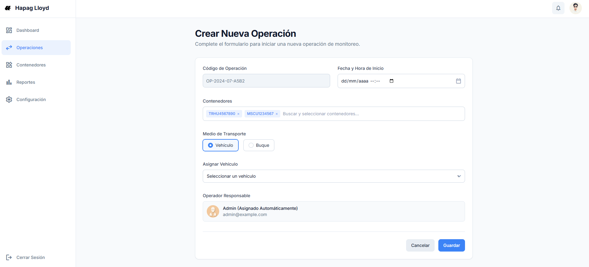
Registro de nueva operación de monitoreo.

### Prototipo P02

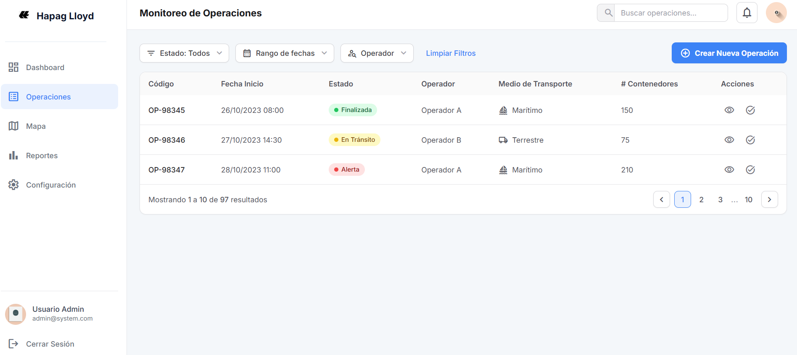
Panel de monitoreo de operaciones

---

### Caso de Uso CU02 y CU07

#### Prototipo P03

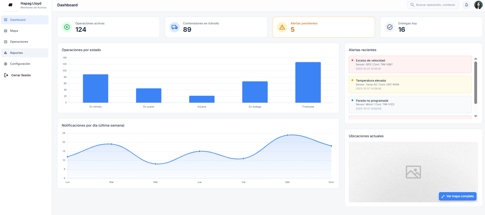
Dashboard principal de monitoreo con KPIs y mapa en tiempo real.

#### Prototipo P04

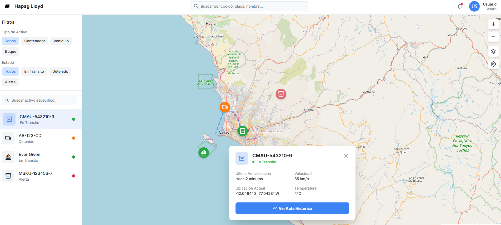
Mapa interactivo de tracking en tiempo real con historial de posiciones.

---

### Caso de Uso CU03

#### Prototipo P05

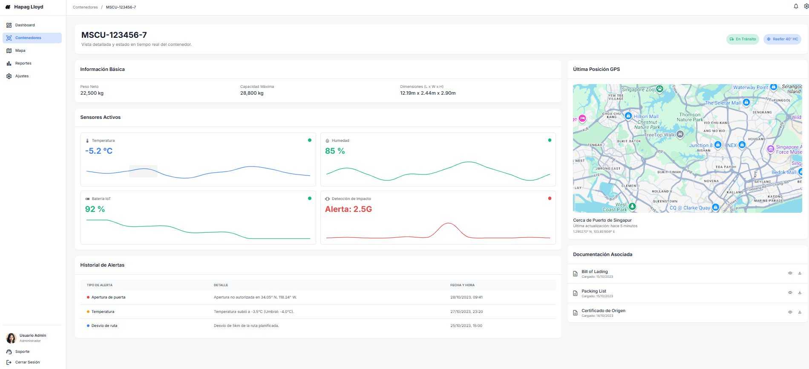
Vista detallada de contenedor con información de sensores y posiciones.

#### Prototipo P06

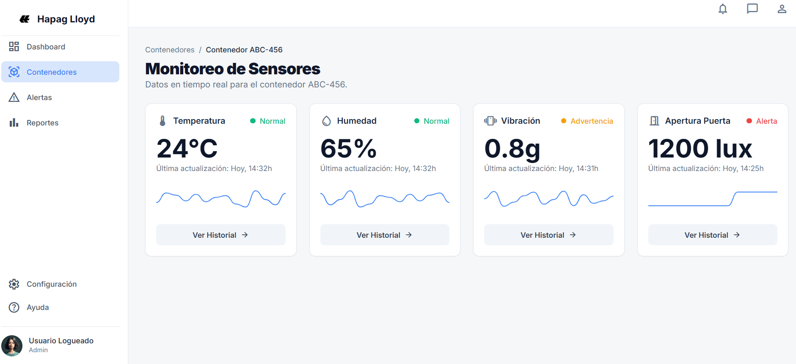
Panel de sensores activos por contenedor (temperatura, humedad, vibración).

---

### Caso de Uso CU04

#### Prototipo P07

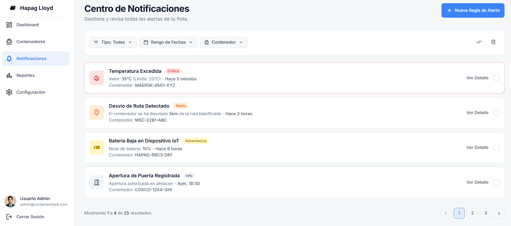
Panel de notificaciones automáticas generadas por sensores.

---

### Caso de Uso CU05

#### Prototipo P08

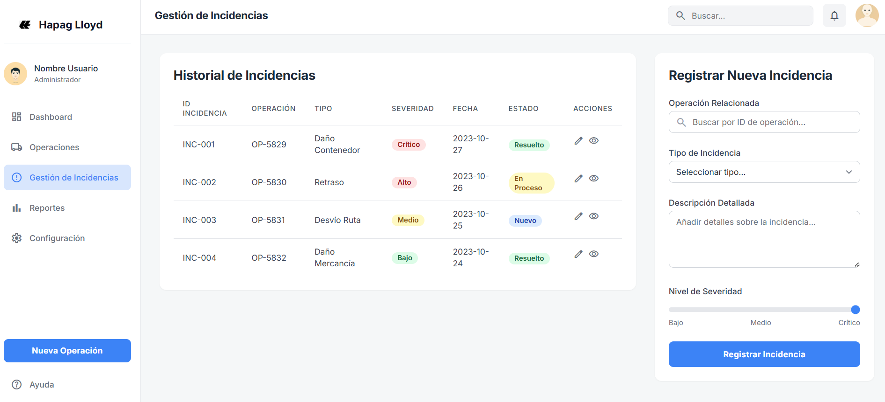
Gestión y registro de incidencias.

---

### Caso de Uso CU06

#### Prototipo P09

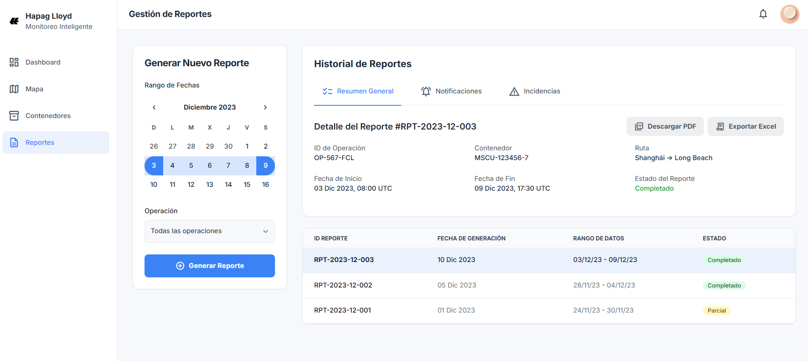
Generación de reportes y auditoría de operaciones de monitoreo.

---

### Caso de Uso CU08

#### Prototipo P10

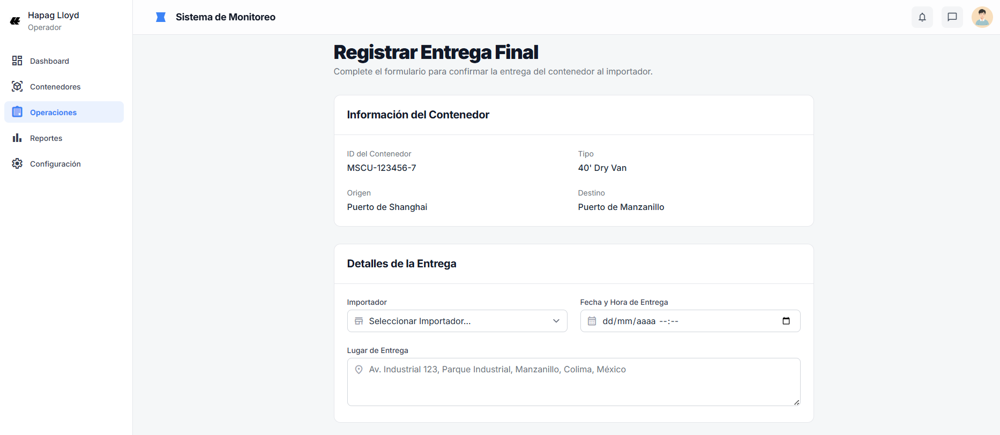
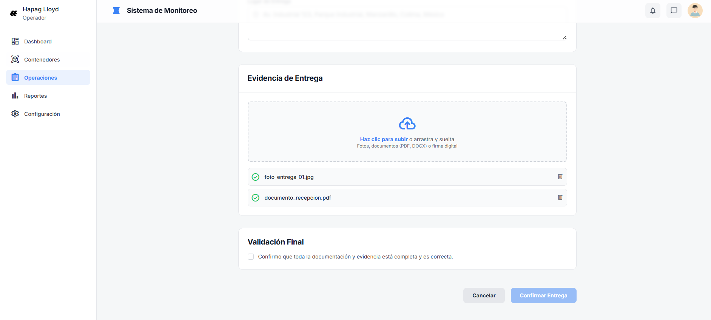
Registro de entrega final a importador con evidencia digital.

---

[⬅️ Anterior](../3.4/3.4.1/3.4.1.md) | [🏠 Home](../../README.md)