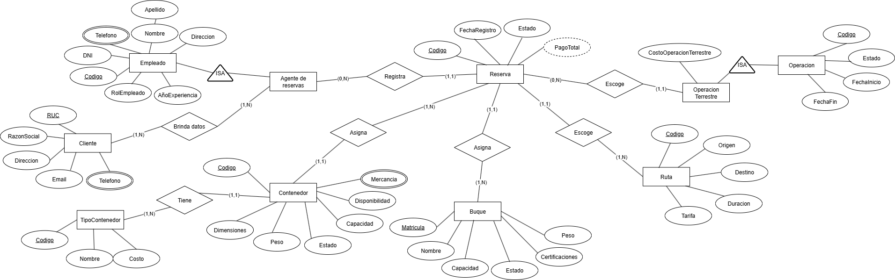

> [4. Diseño Conceptual](../4.md) › [4.1. Módulo 1](4.1.md)

# 4.1. Módulo de Gestión de Reservas

### Diagrama Conceptual

### Diccionario de Datos

#### Tipo de Entidad

**1. Reserva**  
- **Descripción:** Registro de la solicitud de servicio logístico marítimo.  
- **Propósito:** Administrar las reservas de transporte realizadas por clientes.  
- **Reglas de negocio:**  
  - Debe estar asociada a un cliente.
  - Puede asignarse a buques, contenedores y rutas.

| **Atributo**    | **Descripción**               | **Propósito**   | **Dominio** | **Obligatorio** | **Único** | **Multivaluado** | **Ejemplo**       |
|-----------------|-------------------------------|-----------------|-------------|-----------------|-----------|------------------|-------------------|
| Codigo          | Identificador único           | Identificación  | Texto       | Sí              | Sí        | No               | RES-001           |
| FechaRegistro   | Fecha de registro             | Control temporal| Fecha       | Sí              | No        | No               | 2024-09-20        |
| Estado          | Estado de la reserva          | Seguimiento     | Enumeración | Sí              | No        | No               | Confirmada        |
| PagoTotal       | Monto total del servicio      | Financiero      | Decimal     | No              | No        | No               | 5000.00           |

**2. Cliente**  
- **Descripción:** Persona jurídica que solicita servicios logísticos.  
- **Propósito:** Registrar los datos de las empresas que contratan servicios.  
- **Reglas de negocio:**  
  - El RUC debe ser único.
  - Un cliente puede realizar múltiples reservas.

| **Atributo** | **Descripción**             | **Propósito**    | **Dominio** | **Obligatorio** | **Único** | **Multivaluado** | **Ejemplo**        |
|--------------|-----------------------------|--------------------|-------------|-----------------|-----------|------------------|--------------------|
| RUC          | Registro único de contribuyente| Identificación fiscal | Texto(11) | Sí            | Sí        | No               | 20481234567        |
| RazonSocial  | Nombre legal de la empresa  | Identificación     | Texto       | Sí              | No        | No               | Exportadora SAC    |
| Direccion    | Domicilio fiscal            | Ubicación          | Texto       | Sí              | No        | No               | Av. Colonial 456   |
| Telefono     | Número de contacto          | Comunicación       | Texto       | No              | No        | Sí               | 987654321          |
| Email        | Correo electrónico          | Comunicación       | Texto       | No              | No        | No               | info@empresa.com   |

**3. Buque**  
- **Descripción:** Embarcación de transporte marítimo que transporta contenedores y tripulación.  
- **Propósito:** Registrar la información de las embarcaciones utilizadas en operaciones marítimas.  
- **Reglas de negocio:**  
  - La matrícula debe ser única.
  - Un buque puede ser utilizado en múltiples operaciones.
  - Debe controlarse su capacidad y estado.

| **Atributo**      | **Descripción**         | **Propósito**    | **Dominio** | **Obligatorio** | **Único** | **Multivaluado** | **Ejemplo**        |
|-------------------|-------------------------|------------------|-------------|-----------------|-----------|------------------|--------------------|
| Matricula         | Identificador oficial del buque | Identificación | Texto     | Sí              | Sí        | No               | IMO-9347438        |
| Nombre            | Nombre de la embarcación| Identificación   | Texto       | Sí              | No        | No               | Hapag Spirit       |
| Capacidad         | Capacidad de carga en TEU | Control        | Número      | Sí              | No        | No               | 12000              |
| Estado            | Estado operativo actual | Seguimiento      | Enumeración | Sí              | No        | No               | Disponible         |
| Certificaciones   | Certificaciones vigentes| Cumplimiento legal | Texto    | No              | No        | Sí               | ISO 9001, SOLAS    |
| Peso              | Peso máximo soportado en toneladas | Especificación técnica | Número | Sí  | No        | No               | 150000             |
| UbicacionActual   | Posición geográfica en tiempo real | Seguimiento | Coordenadas | No     | No        | No               | 8.9824 N, 79.5199 W|

**4. Contenedor**  
- **Descripción:** Unidad estandarizada de transporte de mercancías.  
- **Propósito:** Gestionar los contenedores disponibles y su estado.  
- **Reglas de negocio:**  
  - Cada contenedor debe tener un código único.
  - Un contenedor puede ser asignado a múltiples operaciones a lo largo del tiempo.
  - Debe tener un tipo de contenedor asociado.

| **Atributo**  | **Descripción**            | **Propósito**   | **Dominio** | **Obligatorio** | **Único** | **Multivaluado** | **Ejemplo**     |
|---------------|----------------------------|-----------------|-------------|-----------------|-----------|------------------|-----------------|
| Codigo        | Identificador único        | Identificación  | Texto       | Sí              | Sí        | No               | CONT-123        |
| Peso          | Peso del contenedor con mercancía | Control técnico | Número | Sí           | No        | No               | 2500            |
| Capacidad     | Capacidad máxima de carga  | Control técnico | Número      | Sí              | No        | No               | 33500           |
| Dimensiones   | Dimensiones físicas        | Especificación  | Texto       | Sí              | No        | No               | 20x8x8.5        |
| Estado        | Estado del contenedor      | Seguimiento     | Enumeración | Sí              | No        | No               | Disponible      |
| Disponibilidad| Disponibilidad para asignar| Control         | Enumeración | Sí              | No        | No               | Sí              |
| Mercancia     | Tipo de mercancía contenida| Clasificación   | Texto       | No              | No        | Sí               | Electrónicos    |

**5. Empleado**
- **Descripción:** Persona que trabaja en la empresa de logística.
- **Propósito:** Gestionar el personal y sus roles en las operaciones del sistema.
- **Reglas de negocio:**
  - Cada empleado debe tener un código único.
  - El DNI debe ser único en el sistema.
  - Se especializa en: Agente de Reservas, Tripulante, Trabajador Portuario, Conductor, Técnico, Responsable Solicitud y Operador.
  
| **Atributo** | **Descripción** | **Propósito** | **Dominio** | **Obligatorio** | **Único** | **Multivaluado** | **Ejemplo** |
|--------------|-----------------|---------------|-------------|-----------------|-----------|------------------|-------------|
| Codigo | Identificador único | Identificación | Texto | Sí | Sí | No | EMP-001 |
| DNI | Documento nacional de identidad | Identificación legal | Texto(8) | Sí | Sí | No | 87654321 |
| Nombre | Nombre del empleado | Identificación | Texto | Sí | No | No | Juan |
| Apellido | Apellido del empleado | Identificación | Texto | Sí | No | No | Pérez |
| Telefono | Número de contacto | Comunicación | Texto | No | No | Sí | 987654321 |
| Direccion | Dirección de residencia | Ubicación | Texto | No | No | No | Av. Marina 123 |
| Especialidad | Especilidad en la empresa | Clasificación | Texto | Sí | No | No | Ingeniero |
| AñosExperiencia | Años de experiencia laboral | Evaluación | Número | No | No | No | 5 |

**6. Agente_Reservas**  
- **Descripción:** Empleado especializado en atención a clientes y gestión de reservas.  
- **Propósito:** Gestionar las reservas de transporte con clientes.  
- **Reglas de negocio:**  
  - Hereda todos los atributos de Empleado.
  - Registra reservas con clientes.

*No posee atributos adicionales propios.*

**7. Tipo_Contenedor**  
- **Descripción:** Clasificación de los contenedores según sus características físicas y uso.  
- **Propósito:** Definir los distintos tipos de contenedores y su costo asociado.  
- **Reglas de negocio:**  
  - Cada tipo debe tener un código único.
  - Un tipo puede estar asociado a múltiples contenedores.

| **Atributo** | **Descripción**              | **Propósito**   | **Dominio** | **Obligatorio** | **Único** | **Multivaluado** | **Ejemplo**      |
|--------------|------------------------------|-----------------|-------------|-----------------|-----------|------------------|------------------|
| Codigo       | Identificador único          | Identificación  | Texto       | Sí              | Sí        | No               | T-001            |
| Nombre       | Nombre del tipo              | Clasificación   | Texto       | Sí              | No        | No               | Refrigerado      |
| Costo        | Costo asociado al uso        | Financiero      | Decimal     | Sí              | No        | No               | 3500.50          |

**8. Ruta**  
- **Descripción:** Trayecto predefinido entre un punto de origen y un punto de destino.  
- **Propósito:** Planificar y dar seguimiento a los viajes y traslados.  
- **Reglas de negocio:**  
  - Cada ruta debe tener un código único.
  - Se especializa en: Ruta Marítima y Ruta Terrestre.

| **Atributo** | **Descripción**              | **Propósito**   | **Dominio** | **Obligatorio** | **Único** | **Multivaluado** | **Ejemplo**      |
|--------------|------------------------------|-----------------|-------------|-----------------|-----------|------------------|------------------|
| Codigo       | Identificador único          | Identificación  | Texto       | Sí              | Sí        | No               | RUT-001          |
| Origen       | Lugar de origen              | Logística       | Texto       | Sí              | No        | No               | Callao           |
| Destino      | Lugar de destino             | Logística       | Texto       | Sí              | No        | No               | Hamburgo         |
| Duracion     | Duración estimada en días    | Planificación   | Número      | Sí              | No        | No               | 25               |
| Tarifa       | Tarifa base de la ruta       | Financiero      | Decimal     | Sí              | No        | No               | 5000.00          |

**9. Operacion**  
- **Descripción:** Registro general de cualquier actividad logística realizada en el sistema.  
- **Propósito:** Servir como entidad base para todas las operaciones especializadas del sistema.  
- **Reglas de negocio:**  
  - Cada operación debe tener un código único.
  - Toda operación debe tener una fecha de inicio y un estado.
  - Se especializa en: Operación Terrestre, Operación Marítima, Operación Portuaria, Operación Mantenimiento, Operación Monitoreo y Operación Embarque.

| **Atributo** | **Descripción**              | **Propósito**   | **Dominio** | **Obligatorio** | **Único** | **Multivaluado** | **Ejemplo**      |
|--------------|------------------------------|-----------------|-------------|-----------------|-----------|------------------|------------------|
| Codigo       | Identificador único          | Identificación  | Texto       | Sí              | Sí        | No               | OP-2025-001      |
| FechaInicio  | Fecha de inicio de la operación | Control temporal | Fecha    | Sí              | No        | No               | 2025-09-27       |
| FechaFin     | Fecha de finalización        | Control temporal| Fecha       | No              | No        | No               | 2025-09-30       |
| Estado       | Estado actual de la operación| Seguimiento     | Enumeración | Sí              | No        | No               | En curso         |

**10. Operacion_Terrestre**  
- **Descripción:** Operación logística especializada en transporte terrestre.  
- **Propósito:** Gestionar operaciones de transporte por carretera.  
- **Reglas de negocio:**  
  - Hereda todos los atributos de Operación.
  - Requiere vehículo, ruta terrestre y conductor asignados.

| **Atributo**          | **Descripción**                | **Propósito**   | **Dominio** | **Obligatorio** | **Único** | **Multivaluado** | **Ejemplo**      |
|-----------------------|--------------------------------|-----------------|-------------|-----------------|-----------|------------------|------------------|
| CostoOperacionTerrestre| Costo del transporte terrestre | Financiero      | Decimal     | Sí              | No        | No               | 1200.50          |

---

#### Tipos de Relación

**1. Relación: Cliente realiza Reserva**  
- **Entidades participantes:** Cliente (1) — Reserva (N)  
- **Descripción:** Un cliente puede realizar múltiples reservas de servicios logísticos.  
- **Propósito:** Asociar las reservas a los clientes correspondientes.  
- **Reglas de negocio relevantes:**  
  - Un cliente puede realizar una o más reservas.
  - Cada reserva es realizada por un único cliente.
- **Cardinalidades:**  
  - Cliente (0,N)  
  - Reserva (1,1)  
- **Justificación:** Un cliente puede tener múltiples reservas a lo largo del tiempo, pero cada reserva pertenece a un solo cliente.

**2. Relación: Agente_Reservas registra Reserva**  
- **Entidades participantes:** Agente_Reservas (1) — Reserva (N)  
- **Descripción:** Un agente de reservas puede registrar múltiples reservas.  
- **Propósito:** Identificar quién registró cada reserva en el sistema.  
- **Reglas de negocio relevantes:**  
  - Un agente puede registrar múltiples reservas.
  - Cada reserva es registrada por un único agente.
- **Cardinalidades:**  
  - Agente_Reservas (0,N)  
  - Reserva (1,1)  
- **Justificación:** Un agente puede registrar varias reservas, pero cada reserva tiene un único responsable de registro.

**3. Relación: Reserva asigna Buque**  
- **Entidades participantes:** Reserva (N) — Buque (1)  
- **Descripción:** Una reserva se asigna a un buque para su transporte.  
- **Propósito:** Definir el buque que transportará la reserva.  
- **Reglas de negocio relevantes:**  
  - Una reserva asigna un único buque.
  - Un buque puede tener asignadas múltiples reservas a lo largo del tiempo.
- **Cardinalidades:**  
  - Reserva (1,1)  
  - Buque (1,N)  
- **Justificación:** Una reserva requiere un buque específico, pero un buque puede ser utilizado para múltiples reservas.

**4. Relación: Reserva asigna Contenedor**  
- **Entidades participantes:** Reserva (1) — Contenedor (N)  
- **Descripción:** Una reserva tiene asignados uno o varios contenedores.  
- **Propósito:** Registrar qué contenedores están asignados a cada reserva.  
- **Reglas de negocio relevantes:**  
  - Una reserva puede asignar múltiples contenedores.
  - Un contenedor puede ser asignado a múltiples reservas a lo largo del tiempo.
  - **Esta relación N:M se implementa mediante una tabla auxiliar.**
- **Cardinalidades:**  
  - Reserva (0,N)  
  - Contenedor (0,N)  
- **Justificación:** Una reserva puede requerir varios contenedores, y un contenedor puede ser reutilizado en diferentes reservas.

**5. Relación: Reserva escoge Ruta**  
- **Entidades participantes:** Reserva (N) — Ruta (1)  
- **Descripción:** Una reserva selecciona una ruta para su transporte.  
- **Propósito:** Definir las rutas de transporte para cada reserva.  
- **Reglas de negocio relevantes:**  
  - Una reserva escoge una única ruta.
  - Una ruta puede ser escogida por múltiples reservas.
- **Cardinalidades:**  
  - Reserva (1,1)  
  - Ruta (0,N)  
- **Justificación:** Una reserva sigue una ruta específica, pero una ruta puede ser utilizada por múltiples reservas.

**6. Relación: Reserva escoge Operacion_Terrestre**  
- **Entidades participantes:** Reserva (N) — Operacion_Terrestre (1)  
- **Descripción:** Una reserva puede incluir una operación terrestre.  
- **Propósito:** Asociar servicios terrestres a la reserva.  
- **Reglas de negocio relevantes:**  
  - Una reserva puede o no incluir operación terrestre.
  - Una operación terrestre pertenece a una única reserva.
- **Cardinalidades:**  
  - Reserva (0,N)  
  - Operacion_Terrestre (1,1)  
- **Justificación:** No todas las reservas requieren transporte terrestre, pero cuando lo requieren, es específico para esa reserva.

**7. Relación: Contenedor tiene Tipo_Contenedor**  
- **Entidades participantes:** Contenedor (N) — Tipo_Contenedor (1)  
- **Descripción:** Un contenedor es de un tipo específico.  
- **Propósito:** Clasificar los contenedores según su tipo.  
- **Reglas de negocio relevantes:**  
  - Un contenedor tiene un único tipo.
  - Un tipo puede aplicarse a múltiples contenedores.
- **Cardinalidades:**  
  - Contenedor (1,1)  
  - Tipo_Contenedor (0,N)  
- **Justificación:** Cada contenedor debe estar clasificado según un tipo específico.

---

[🏠 Home](../../README.md) | [Siguiente ➡️](../4.2/4.2.md)