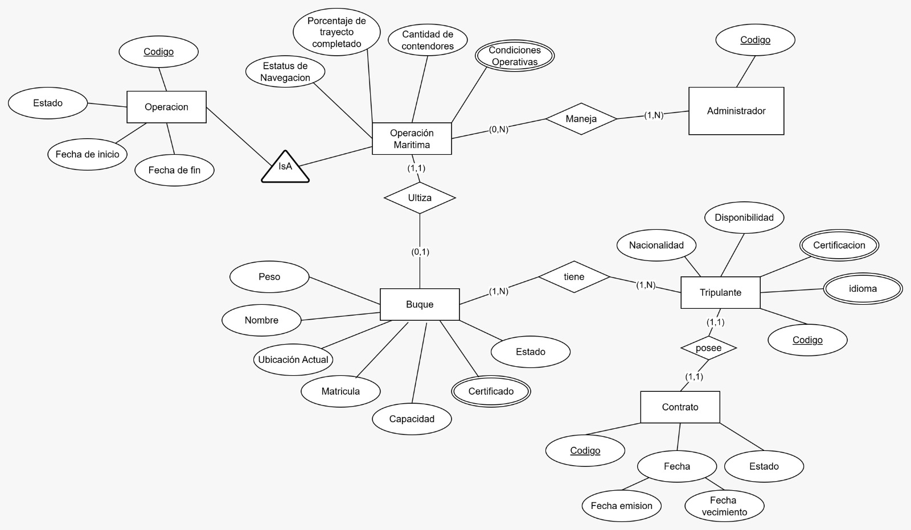

> [4. Diseño Conceptual](../4.md) › [4.2. Módulo 2](4.2.md)

# 4.2. Módulo de Gestión del Persona y Tripulación

### Diagrama Conceptual

### Diccionario de Datos

#### Tipo de Entidad

**1. Administrador**  
- **Descripción:** Persona encargada de gestionar las operaciones de embarque.  
- **Propósito:** Administrar y asignar la tripulación hacia un embarque. 
- **Reglas de negocio:**  
  - Cada operación de embarque debe estar asociada a un administrador. 

| **Atributo**   | **Descripción**                 | **Propósito**          | **Dominio** | **Obligatorio** | **Único** | **Multivaluado** | **Ejemplo**        |
|----------------|---------------------------------|------------------------|-------------|-----------------|-----------|------------------|-------------------|
| Codigo          | Identificador único        | Identificación    | Texto       | Sí              | Sí        | No               | ADM-001          |

**2. Operacion Maritima**

- **Descripción:** Clase hija de la entidad Operación, especializada únicamente en el traslado marítimo de una embarcación entre puertos.

- **Propósito:** Representar operaciones cuyo objetivo principal es el transporte marítimo de contenedores siguiendo una ruta definida.

- **Reglas de negocio:**
    - Hereda todas las reglas de la entidad Operación.
    - Se asocia siempre a una única embarcación.
    - Requiere una ruta marítima definida.
    - Debe registrar la cantidad de contenedores trasladados durante la operación.
      
| Atributo |	Descripción |	Propósito |	Dominio |	Obligatorio |	Único |	Multivaluado |	Ejemplo |
| -- | -- | -- | -- | -- | -- | -- | -- |
| Cantidad de contenedores | Número total de contenedores trasladados en la operación marítima | Control logístico y planificación | Entero positivo | Sí |	No | No | 350 |
| Condiciones operativas |	Factores que afectan la operación marítima | Contexto operativo y seguridad |	Enumeración |	No |	No |	Sí | Oleaje fuerte |
| Porcentaje del trayecto completado |	Progreso de la operación marítima en relación a la ruta asignada |	Monitoreo y control de avance de la operación |	Número decimal entre 0 y 100 (%) |	Sí |	No |	No |	72.5 |
| EstatusNavegacion | Estado de navegación | Seguimiento | Texto | Sí | No | No | Navegando |

**3. Buque**  
- **Descripción:** Embarcación de transporte marítimo que transporta contenedores y tripulación.  
- **Propósito:** Registrar la información de las embarcaciones utilizadas en operaciones marítimas.  
- **Reglas de negocio:**  
  - La matrícula debe ser única.
  - Un buque puede ser utilizado en múltiples operaciones.
  - Debe controlarse su capacidad y estado.

| **Atributo** |	**Descripción** |	**Propósito** |	**Dominio** |	**Obligatorio** |	**Único** |	**Multivaluado** |	**Ejemplo** |
| -- | -- | -- | -- | -- | -- | -- | -- |
| Matricula |	Identificador único |	Identificación |	Texto |	Sí |	Sí |	No |	EMB-001-PA |
| Nombre |	Nombre de la embarcación |	Identificación |	Texto |	Sí |	No |	No |	MSC Isabella |
| Capacidad |	Capacidad de carga en TEU |	Control |	Número |	Sí |	No |	No |	25000.00 |
| Estado | Disponibilidad actual | Control |	Enumeración |	Sí |	No |	No |	Operativo |
| Certificaciones |	Certificados y permisos |	Legal |	Texto |	No | No |	Sí | Solas, ISM |
| Peso | Peso bruto del buque (toneladas de desplazamiento) | Referencia técnica y capacidad estructural | Número (decimal, toneladas) | Sí | No | No | 220000.00 |
| Ubicación actual |	Posición geográfica del buque en tiempo real |	Seguimiento de operaciones y logística |	Coordenadas geográficas |	No |	No |	No |	8.9824 N, 79.5199 W |

**4. Tripulante**
- **Descripción:** Personas que forman parte del buque.  
- **Propósito:** Garantizar la operación marítima.  
- **Reglas de negocio:**  
  - Cada tripulante debe tener un código único.  
  - Un tripulante debe contar con al menos un contrato válido.  
  - Un tripulante puede tener múltiples certificaciones.  

| **Atributo**     | **Descripción**                 | **Propósito**   | **Dominio** | **Obligatorio** | **Único** | **Multivaluado** | **Ejemplo**     |
|------------------|---------------------------------|-----------------|-------------|-----------------|-----------|------------------|-----------------|
| Codigo           | Identificador del tripulante    | Identificación  | Texto       | Sí              | Sí        | No               | TRIP-001        |
| Nacionalidad     | País de origen                  | Referencia      | Texto       | Sí              | No        | No               | Peruana         |
| CertificacionID  | Documento obligatorio           | Capacitacion    | Texto       | Sí              | No        | Sí               | CERT-001        |
| NombreCurso      | Control de la certificacion     | Capacitación    | Texto       | Sí              | Sí        | No               | Manejo de carga |
| FechaEmision     | Control de la certificación     | Vigencia        | Fecha       | Sí              | No        | No               | 2024-05-10      |
| FechaVencimiento | Control de la certificación     | Vigencia        | Fecha       | Sí              | No        | No               | 2026-05-10      |
| Idioma           | Lenguajes                       | Capacidades     | Texto       | Sí              | No        | Sí               | Ingles          |
| Disponibilidad   | Turnos                          | Horarios        | Texto       | Sí              | No        | No               | Disponible      |

**5. Contrato**
- **Descripción:** Documento legal que regula la relación laboral de un tripulante.  
- **Propósito:** Formalizar la vinculación entre la empresa y el tripulante.  
- **Reglas de negocio:**  
  - Cada contrato debe estar asociado a un solo tripulante.  
  - Cada contrato tiene una fecha de emisión y vencimiento.  

| **Atributo**     | **Descripción**            | **Propósito**   | **Dominio** | **Obligatorio** | **Único** | **Multivaluado** | **Ejemplo** |
|------------------|----------------------------|-----------------|-------------|-----------------|-----------|------------------|-------------|
| Codigo           | Identificador del contrato | Identificación  | Texto       | Sí              | Sí        | No               | CT-001      |
| Fecha            | Fecha de registro          | Control         | Fecha       | Sí              | No        | No               | 2025-09-21  |
| Estado           | Estado actual del contrato | Seguimiento     | Enumeración | Sí              | No        | No               | Vigente     |
| FechaEmision     | Fecha de inicio            | Control         | Fecha       | Sí              | No        | No               | 2025-01-01  |
| FechaVencimiento | Fecha de término           | Control         | Fecha       | Sí              | No        | No               | 2025-12-31  |

**6. Operacion**  
- **Descripción:** Registro general de cualquier actividad logística realizada en el sistema.  
- **Propósito:** Servir como entidad base para todas las operaciones especializadas del sistema.  
- **Reglas de negocio:**  
  - Cada operación debe tener un código único.
  - Toda operación debe tener una fecha de inicio y un estado.
  - Se especializa en: Operación Terrestre, Operación Marítima, Operación Portuaria, Operación Mantenimiento, Operación Monitoreo y Operación Embarque.

| **Atributo** | **Descripción**              | **Propósito**   | **Dominio** | **Obligatorio** | **Único** | **Multivaluado** | **Ejemplo**      |
|--------------|------------------------------|-----------------|-------------|-----------------|-----------|------------------|------------------|
| Codigo       | Identificador único          | Identificación  | Texto       | Sí              | Sí        | No               | OP-2025-001      |
| FechaInicio  | Fecha de inicio de la operación | Control temporal | Fecha    | Sí              | No        | No               | 2025-09-27       |
| FechaFin     | Fecha de finalización        | Control temporal| Fecha       | No              | No        | No               | 2025-09-30       |
| Estado       | Estado actual de la operación| Seguimiento     | Enumeración | Sí              | No        | No               | En curso         |

#### Tipos de Relación

**1. Relación: Administrador gestiona Operacion Maritima**  
- **Entidades participantes:** Administrador (1) — Operacion Maritima (N)  
- **Descripción:** Un administrador gestiona operaciones maritimas de tripulación.  
- **Propósito:** Asociar la responsabilidad de gestión de operaciones de embarque.  
- **Reglas de negocio relevantes:**  
  - Un administrador puede gestionar múltiples operaciones de embarque.
  - Cada operación de embarque es gestionada por un único administrador.
- **Cardinalidades:**  
  - Administrador (0,N)  
  - Operacion_Embarque (1,1)  
- **Justificación:** Un administrador tiene múltiples operaciones bajo su responsabilidad, pero cada operación tiene un responsable único.

**2. Relación: Operacion Maritima ultilizar Buque**  
- **Entidades participantes:** Operacion Maritima (1) — Buque (N)  
- **Descripción:** Una operación maritica puede utilizar tripulación a múltiples buques.  
- **Propósito:** Controlar la asignación de tripulación a buques.  
- **Reglas de negocio relevantes:**  
  - Una operación de embarque puede involucrar múltiples buques.
  - Un buque puede participar en múltiples operaciones de embarque.
  - **Esta relación N:M se implementa mediante una tabla auxiliar con el atributo FechaAsignacion.**
- **Cardinalidades:**  
  - Operacion_Embarque (1,N)  
  - Buque (1,N)  
- **Atributos de la relación:**  
  - FechaAsignacion
- **Justificación:** La asignación de tripulación puede involucrar múltiples buques en diferentes fechas.

**3. Relación: Buque tiene Tripulacion**  
- **Entidades participantes:** Buque (1) — Tripulacion (N)  
- **Descripción:** Un buque tiene asignada una tripulación.  
- **Propósito:** Registrar la tripulación que opera en cada buque.  
- **Reglas de negocio relevantes:**  
  - Un buque tiene múltiples miembros de tripulación.
  - Cada miembro de tripulación está asignado a un único buque en un momento dado.
- **Cardinalidades:**  
  - Buque (1,N)  
  - Tripulacion (1,1)  
- **Justificación:** Un buque requiere tripulación para operar, y cada tripulante está asignado a un buque específico.

**4. Relación: Tripulacion tiene Contrato**  
- **Entidades participantes:** Tripulacion (1) — Contrato (N)  
- **Descripción:** Un miembro de tripulación puede tener múltiples contratos a lo largo del tiempo.  
- **Propósito:** Formalizar la relación laboral con la empresa.  
- **Reglas de negocio relevantes:**  
  - Un tripulante puede tener varios contratos (renovaciones).
  - Cada contrato pertenece a un único tripulante.
- **Cardinalidades:**  
  - Tripulacion (0,N)  
  - Contrato (1,1)  
- **Justificación:** Un tripulante puede renovar contratos, pero cada contrato es específico de un tripulante.

**5. Relación: Operacion Maritima ES UNA INSTANCIA DE Operacion**  
- **Descripción:** Relación de especialización donde Operacion Maritima es un tipo específico de Operacion.  
- **Propósito:** Representar la jerarquía de operaciones especializadas en embarque de tripulación.  
- **Reglas de negocio relevantes:**  
  - No todas las operaciones son maritimas.
  - Una operación de embarque hereda todos los atributos de operación.
- **Cardinalidades:**  
  - Operacion (1,1)  
  - Operacion_Embarque (0,1)  
- **Justificación:** Herencia completa donde Operacion_Embarque es una especialización de Operacion.
---
[⬅️ Anterior](../4.1/4.1.md) | [🏠 Home](../../README.md) | [Siguiente ➡️](../4.3/4.3.md)