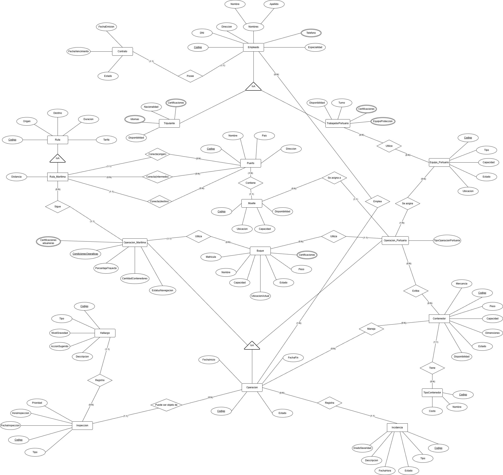

> [4. Diseño Conceptual](../4.md) › [4.3. Módulo 3](4.3.md)

# 4.3. Módulo de Gestión de Operaciones Marítimas

### Diagrama Conceptual

### Diccionario de Datos

#### Tipo de Entidad

**1. Operacion**  
- **Descripción:** Registro general de cualquier actividad logística realizada en el sistema.  
- **Propósito:** Servir como entidad base para todas las operaciones especializadas del sistema.  
- **Reglas de negocio:**  
  - Cada operación debe tener un código único.
  - Toda operación debe tener una fecha de inicio y un estado.
  - Se especializa en: Operación Terrestre, Operación Marítima, Operación Portuaria, Operación Mantenimiento, Operación Monitoreo y Operación Embarque.

| **Atributo** | **Descripción** | **Propósito** | **Dominio** | **Obligatorio** | **Único** | **Multivaluado** | **Ejemplo** |
|--------------|-----------------|---------------|-------------|-----------------|-----------|------------------|-------------|
| Codigo | Identificador único | Identificación | Texto | Sí | Sí | No | OP-2025-001 |
| FechaInicio | Fecha de inicio de la operación | Control temporal | Fecha | Sí | No | No | 2025-09-27 |
| FechaFin | Fecha de finalización | Control temporal | Fecha | No | No | No | 2025-09-30 |
| Estado | Estado actual de la operación | Seguimiento | Enumeración | Sí | No | No | En curso |

**2. Operacion_Maritima**  
- **Descripción:** Operación especializada en el traslado marítimo entre puertos.  
- **Propósito:** Representar operaciones de transporte marítimo de contenedores.  
- **Reglas de negocio:**  
  - Hereda todos los atributos de Operación.
  - Debe seguir una ruta marítima y utilizar un buque.

| **Atributo** | **Descripción** | **Propósito** | **Dominio** | **Obligatorio** | **Único** | **Multivaluado** | **Ejemplo** |
|--------------|-----------------|---------------|-------------|-----------------|-----------|------------------|-------------|
| CantidadContenedores | Número de contenedores trasladados | Control logístico | Número | Sí | No | No | 350 |
| CondicionesOperativas | Factores que afectan la operación | Contexto operativo | Enumeración | No | No | Sí | Oleaje fuerte |
| PorcentajeTrayecto | Progreso de la operación | Monitoreo | Decimal | Sí | No | No | 72.5 |
| EstatusNavegacion | Estado de navegación | Seguimiento | Texto | Sí | No | No | Navegando |

**3. Operacion_Portuaria**  
- **Descripción:** Operación especializada en actividades dentro del puerto.  
- **Propósito:** Representar operaciones de carga, descarga, estiba y almacenamiento.  
- **Reglas de negocio:**  
  - Hereda todos los atributos de Operación.
  - Se realiza en un muelle específico.

| **Atributo** | **Descripción** | **Propósito** | **Dominio** | **Obligatorio** | **Único** | **Multivaluado** | **Ejemplo** |
|--------------|-----------------|---------------|-------------|-----------------|-----------|------------------|-------------|
| TipoOperacionPortuaria | Clasificación de la actividad portuaria | Diferenciación | Enumeración | Sí | No | No | Descarga |

**4. Buque**  
- **Descripción:** Embarcación de transporte marítimo que transporta contenedores y tripulación.  
- **Propósito:** Registrar la información de las embarcaciones utilizadas en operaciones marítimas.  
- **Reglas de negocio:**  
  - La matrícula debe ser única.
  - Un buque puede ser utilizado en múltiples operaciones.
  - Debe controlarse su capacidad y estado.

| **Atributo** | **Descripción** | **Propósito** | **Dominio** | **Obligatorio** | **Único** | **Multivaluado** | **Ejemplo** |
|--------------|-----------------|---------------|-------------|-----------------|-----------|------------------|-------------|
| Matricula | Identificador oficial del buque | Identificación | Texto | Sí | Sí | No | IMO-9347438 |
| Nombre | Nombre de la embarcación | Identificación | Texto | Sí | No | No | Hapag Spirit |
| Capacidad | Capacidad de carga en TEU | Control | Número | Sí | No | No | 12000 |
| Estado | Estado operativo actual | Seguimiento | Enumeración | Sí | No | No | Disponible |
| Certificaciones | Certificaciones vigentes | Cumplimiento legal | Texto | No | No | Sí | ISO 9001, SOLAS |
| Peso | Peso máximo soportado en toneladas | Especificación técnica | Número | Sí | No | No | 150000 |
| UbicacionActual | Posición geográfica en tiempo real | Seguimiento | Coordenadas | No | No | No | 8.9824 N, 79.5199 W |

**5. Empleado**  
- **Descripción:** Personal que opera en el sistema.  
- **Propósito:** Depende del área. 
- **Reglas de negocio:**  
  - Cada empleado debe tener un código único.
  - El DNI debe ser único en el sistema.
  - Se especializa en: Agente de Reservas, Tripulante, Trabajador Portuario, Conductor, Técnico, Responsable Solicitud y Operador.

| **Atributo** | **Descripción** | **Propósito** | **Dominio** | **Obligatorio** | **Único** | **Multivaluado** | **Ejemplo** |
|--------------|-----------------|---------------|-------------|-----------------|-----------|------------------|-------------|
| Codigo | Identificador único | Identificación | Texto | Sí | Sí | No | EMP-001 |
| DNI | Documento nacional de identidad | Identificación legal | Texto(8) | Sí | Sí | No | 87654321 |
| Nombre | Nombre del empleado | Identificación | Texto | Sí | No | No | Juan |
| Apellido | Apellido del empleado | Identificación | Texto | Sí | No | No | Pérez |
| Telefono | Número de contacto | Comunicación | Texto | No | No | Sí | 987654321 |
| Direccion | Dirección de residencia | Ubicación | Texto | No | No | No | Av. Marina 123 |
| Especialidad | Especialidad que tiene el empleado | Clasificación | Texto | Sí | No | No | Capitán |
| AñosExperiencia | Años de experiencia laboral | Evaluación | Número | No | No | No | 5 |

**6. Tripulante**  
- **Descripción:** Empleado especializado que forma parte de la tripulación de un buque.  
- **Propósito:** Registrar al personal que opera en los buques.  
- **Reglas de negocio:**  
  - Hereda todos los atributos de Empleado.
  - Debe contar con certificaciones de navegación.

| **Atributo** | **Descripción** | **Propósito** | **Dominio** | **Obligatorio** | **Único** | **Multivaluado** | **Ejemplo** |
|--------------|-----------------|---------------|-------------|-----------------|-----------|------------------|-------------|
| Disponibilidad | Estado de asignación | Planificación | Enumeración | Sí | No | No | Disponible |
| Certificaciones | Certificados de navegación | Validación legal | Texto | Sí | No | Sí | STCW, ISM, SOLAS |
| Idiomas | Lenguas que domina | Comunicación | Texto | Sí | No | Sí | Español, Inglés |
| Nacionalidad | País de ciudadanía | Registro legal | Texto | Sí | No | No | Peruana |

**7. Trabajador_Portuario**  
- **Descripción:** Empleado especializado en labores portuarias.  
- **Propósito:** Registrar al personal que trabaja en operaciones de puerto.  
- **Reglas de negocio:**  
  - Hereda todos los atributos de Empleado.
  - Debe tener definido un turno de trabajo.

| **Atributo** | **Descripción** | **Propósito** | **Dominio** | **Obligatorio** | **Único** | **Multivaluado** | **Ejemplo** |
|--------------|-----------------|---------------|-------------|-----------------|-----------|------------------|-------------|
| Disponibilidad | Estado de asignación | Planificación | Enumeración | Sí | No | No | Disponible |
| Turno | Horario laboral asignado | Control operativo | Enumeración | Sí | No | No | Noche |
| Certificaciones | Certificaciones laborales | Validación técnica | Texto | Sí | No | Sí | Estibador certificado |
| EquipoProteccion | Elementos de seguridad personal | Seguridad laboral | Texto | Sí | No | Sí | Casco, Chaleco |

**8. Equipo_Portuario**  
- **Descripción:** Maquinaria y herramientas utilizadas en el puerto.  
- **Propósito:** Gestionar el equipo disponible para operaciones portuarias.  
- **Reglas de negocio:**  
  - Cada equipo tiene un tipo y capacidad específicos.
  - Puede ser usado en varias operaciones portuarias.

| **Atributo** | **Descripción** | **Propósito** | **Dominio** | **Obligatorio** | **Único** | **Multivaluado** | **Ejemplo** |
|--------------|-----------------|---------------|-------------|-----------------|-----------|------------------|-------------|
| Codigo | Identificador único | Identificación | Texto | Sí | Sí | No | EQ-001 |
| Tipo | Tipo de equipo | Clasificación | Enumeración | Sí | No | No | Grúa |
| Capacidad | Capacidad en toneladas | Control | Número | Sí | No | No | 150 |
| Estado | Disponibilidad actual | Control | Enumeración | Sí | No | No | Disponible |
| Ubicacion | Ubicación física | Logística | Texto | No | No | No | MUE-001 |

**9. Contenedor**  
- **Descripción:** Unidad estandarizada de transporte de mercancías.  
- **Propósito:** Gestionar los contenedores disponibles y su estado.  
- **Reglas de negocio:**  
  - Cada contenedor debe tener un código único.
  - Un contenedor puede ser asignado a múltiples operaciones a lo largo del tiempo.
  - Debe tener un tipo de contenedor asociado.

| **Atributo** | **Descripción** | **Propósito** | **Dominio** | **Obligatorio** | **Único** | **Multivaluado** | **Ejemplo** |
|--------------|-----------------|---------------|-------------|-----------------|-----------|------------------|-------------|
| Codigo | Identificador único | Identificación | Texto | Sí | Sí | No | CONT-123 |
| Peso | Peso del contenedor con mercancía | Control técnico | Número | Sí | No | No | 2500 |
| Capacidad | Capacidad máxima de carga | Control técnico | Número | Sí | No | No | 33500 |
| Dimensiones | Dimensiones físicas | Especificación | Texto | Sí | No | No | 20x8x8.5 |
| Estado | Estado del contenedor | Seguimiento | Enumeración | Sí | No | No | Disponible |
| Disponibilidad | Disponibilidad para asignar | Control | Enumeración | Sí | No | No | Sí |
| Mercancia | Tipo de mercancía contenida | Clasificación | Texto | No | No | Sí | Electrónicos |

**10. Tipo_Contenedor**  
- **Descripción:** Clasificación de los contenedores según sus características físicas y uso.  
- **Propósito:** Definir los distintos tipos de contenedores y su costo asociado.  
- **Reglas de negocio:**  
  - Cada tipo debe tener un código único.
  - Un tipo puede estar asociado a múltiples contenedores.

| **Atributo** | **Descripción** | **Propósito** | **Dominio** | **Obligatorio** | **Único** | **Multivaluado** | **Ejemplo** |
|--------------|-----------------|---------------|-------------|-----------------|-----------|------------------|-------------|
| Codigo | Identificador único | Identificación | Texto | Sí | Sí | No | T-001 |
| Nombre | Nombre del tipo | Clasificación | Texto | Sí | No | No | Refrigerado |
| Costo | Costo asociado al uso | Financiero | Decimal | Sí | No | No | 3500.50 |

**11. Ruta**  
- **Descripción:** Trayecto predefinido entre un punto de origen y un punto de destino.  
- **Propósito:** Planificar y dar seguimiento a los viajes y traslados.  
- **Reglas de negocio:**  
  - Cada ruta debe tener un código único.
  - Se especializa en: Ruta Marítima y Ruta Terrestre.

| **Atributo** | **Descripción** | **Propósito** | **Dominio** | **Obligatorio** | **Único** | **Multivaluado** | **Ejemplo** |
|--------------|-----------------|---------------|-------------|-----------------|-----------|------------------|-------------|
| Codigo | Identificador único | Identificación | Texto | Sí | Sí | No | RUT-001 |
| Origen | Lugar de origen | Logística | Texto | Sí | No | No | Callao |
| Destino | Lugar de destino | Logística | Texto | Sí | No | No | Hamburgo |
| Duracion | Duración estimada en días | Planificación | Número | Sí | No | No | 25 |
| Tarifa | Tarifa base de la ruta | Financiero | Decimal | Sí | No | No | 5000.00 |

**12. Ruta_Maritima**  
- **Descripción:** Ruta especializada en trayectos marítimos entre puertos.  
- **Propósito:** Registrar los recorridos marítimos planificados.  
- **Reglas de negocio:**  
  - Hereda todos los atributos de Ruta.
  - Debe conectar dos puertos (origen y destino).

| **Atributo** | **Descripción** | **Propósito** | **Dominio** | **Obligatorio** | **Único** | **Multivaluado** | **Ejemplo** |
|--------------|-----------------|---------------|-------------|-----------------|-----------|------------------|-------------|
| Distancia | Longitud del trayecto en millas náuticas | Cálculo logístico | Número | Sí | No | No | 10500 |

**13. Puerto**  
- **Descripción:** Instalación marítima donde se realizan operaciones de carga y descarga.  
- **Propósito:** Identificar y almacenar información de cada puerto.  
- **Reglas de negocio:**  
  - Cada puerto debe tener un código único.
  - Puede ser origen o destino de múltiples rutas marítimas.

| **Atributo** | **Descripción** | **Propósito** | **Dominio** | **Obligatorio** | **Único** | **Multivaluado** | **Ejemplo** |
|--------------|-----------------|---------------|-------------|-----------------|-----------|------------------|-------------|
| Codigo | Identificador único | Identificación | Texto | Sí | Sí | No | PRT-001 |
| Nombre | Nombre oficial del puerto | Reconocimiento | Texto | Sí | No | No | Puerto del Callao |
| Pais | País donde se ubica | Clasificación | Texto | Sí | No | No | Perú |
| Direccion | Dirección física del puerto | Logística | Texto | Sí | No | No | Av. Contralmirante Raygada |

**14. Incidencia**  
- **Descripción:** Evento negativo o problema registrado durante una operación.  
- **Propósito:** Dar trazabilidad y seguimiento a problemas de seguridad o no conformidad.  
- **Reglas de negocio:**  
  - Debe estar asociada a una operación.
  - Puede ser registrada por un usuario.

| **Atributo** | **Descripción** | **Propósito** | **Dominio** | **Obligatorio** | **Único** | **Multivaluado** | **Ejemplo** |
|--------------|-----------------|---------------|-------------|-----------------|-----------|------------------|-------------|
| Codigo | Identificador único | Identificación | Texto | Sí | Sí | No | INC-001 |
| Tipo | Tipo de incidencia | Clasificación | Enumeración | Sí | No | No | Seguridad |
| Descripcion | Descripción detallada del evento | Contexto | Texto | Sí | No | No | Derrame de líquido |
| GradoSeveridad | Nivel de gravedad del problema | Control | Enumeración | Sí | No | No | Alto |
| FechaHora | Momento exacto de ocurrencia | Registro temporal | Fecha | Sí | No | No | 2025-09-28 12:00:00 |
| Estado | Estado de la incidencia | Seguimiento | Número | Sí | No | No | Cerrada |

**15. Inspeccion**  
- **Descripción:** Proceso de revisión para verificar cumplimiento de normas.  
- **Propósito:** Registrar los resultados de inspecciones realizadas.  
- **Reglas de negocio:**  
  - Se aplica a una única operación.
  - Puede registrar múltiples hallazgos.

| **Atributo** | **Descripción** | **Propósito** | **Dominio** | **Obligatorio** | **Único** | **Multivaluado** | **Ejemplo** |
|--------------|-----------------|---------------|-------------|-----------------|-----------|------------------|-------------|
| Codigo | Identificador único | Identificación | Texto | Sí | Sí | No | INS-001 |
| Tipo | Tipo de inspección | Clasificación | Enumeración | Sí | No | No | Aduanera |
| FechaInspeccion | Fecha de la inspección | Control | Fecha | Sí | No | No | 2025-09-22 |
| HoraInspeccion | Hora de la inspección | Control | Hora | Sí | No | No | 10:00 |
| Prioridad | Nivel de urgencia | Control | Enumeración | Sí | No | No | Alta |

**16. Hallazgo**  
- **Descripción:** Problema o no conformidad encontrada en una inspección.  
- **Propósito:** Detallar irregularidades y acciones sugeridas.  
- **Reglas de negocio:**  
  - Cada hallazgo está asociado a una única inspección.

| **Atributo** | **Descripción** | **Propósito** | **Dominio** | **Obligatorio** | **Único** | **Multivaluado** | **Ejemplo** |
|--------------|-----------------|---------------|-------------|-----------------|-----------|------------------|-------------|
| Codigo | Identificador único | Identificación | Texto | Sí | Sí | No | HAL-001 |
| Tipo | Tipo de hallazgo | Clasificación | Enumeración | Sí | No | No | Falta de Permiso |
| NivelGravedad | Severidad del hallazgo | Control | Enumeración | Sí | No | No | Alto |
| Descripcion | Descripción detallada | Contexto | Texto | Sí | No | No | Mercancía no declarada |
| AccionSugerida | Acción recomendada | Proceso | Texto | No | No | No | Retener contenedor |

**17. Muelle**  
- **Descripción:** Estructura en el puerto para atraque de embarcaciones.  
- **Propósito:** Registrar y controlar las ubicaciones de operaciones portuarias.  
- **Reglas de negocio:**  
  - Cada muelle pertenece a un único puerto.
  - Tiene capacidad de carga específica.

| **Atributo** | **Descripción** | **Propósito** | **Dominio** | **Obligatorio** | **Único** | **Multivaluado** | **Ejemplo** |
|--------------|-----------------|---------------|-------------|-----------------|-----------|------------------|-------------|
| Codigo | Identificador único | Identificación | Texto | Sí | Sí | No | MUE-212 |
| Ubicacion | Dirección o nombre del área | Logística | Texto | Sí | No | No | Puerto Shangai |
| Capacidad | Capacidad de carga en TEU | Control | Número | Sí | No | No | 1000.00 |
| Disponibilidad | Estado de asignación | Planificación | Enumeración | Sí | No | No | Disponible |

**18. Contrato**  
- **Descripción:** Acuerdo formal entre las partes para la prestación de servicios logísticos.  
- **Propósito:** Gestionar los contratos comerciales y sus condiciones.  
- **Reglas de negocio:**  
  - Cada contrato debe tener un código único.
  - Un contrato debe tener una fecha de emisión y vencimiento.
  - El estado del contrato determina su validez operativa.

| **Atributo** | **Descripción** | **Propósito** | **Dominio** | **Obligatorio** | **Único** | **Multivaluado** | **Ejemplo** |
|--------------|-----------------|---------------|-------------|-----------------|-----------|------------------|-------------|
| FechaEmision | Fecha de creación del contrato | Registro temporal | Fecha | Sí | No | No | 2025-01-15 |
| FechaVencimiento | Fecha de finalización del contrato | Control temporal | Fecha | Sí | No | No | 2026-01-15 |
| Estado | Estado actual del contrato | Seguimiento | Enumeración | Sí | No | No | Vigente |

---

#### Tipos de Relación

**1. Relación: Operacion registra Incidencia**  
- **Entidades participantes:** Operacion (1) — Incidencia (N)  
- **Descripción:** Los problemas se registran en el contexto de una operación.  
- **Propósito:** Asociar incidencias con operaciones para trazabilidad.  
- **Reglas de negocio relevantes:**  
  - Una operación puede registrar múltiples incidencias.
  - Una incidencia está ligada a una operación.
- **Cardinalidades:**  
  - Operacion (0,N)  
  - Incidencia (1,1)  
- **Justificación:** Una incidencia no puede existir sin estar asociada a una operación.

**2. Relación: Operacion objeto_de Inspeccion**  
- **EntidadesInspeccion**  
- **Entidades participantes:** Operacion (1) — Inspeccion (N)  
- **Descripción:** Una operación puede ser inspeccionada en múltiples ocasiones.  
- **Propósito:** Vincular las inspecciones a la operación revisada.  
- **Reglas de negocio relevantes:**  
  - Una operación puede tener cero o más inspecciones.
  - Cada inspección se realiza sobre una única operación.
- **Cardinalidades:**  
  - Operacion (0,N)  
  - Inspeccion (1,1)  
- **Justificación:** Una operación puede ser inspeccionada varias veces.

**3. Relación: Inspeccion registra Hallazgo**  
- **Entidades participantes:** Inspeccion (1) — Hallazgo (N)  
- **Descripción:** Una inspección puede encontrar uno o más hallazgos.  
- **Propósito:** Detallar los resultados de la inspección.  
- **Reglas de negocio relevantes:**  
  - Una inspección puede tener múltiples hallazgos.
  - Cada hallazgo está asociado a una única inspección.
- **Cardinalidades:**  
  - Inspeccion (0,N)  
  - Hallazgo (1,1)  
- **Justificación:** Una inspección puede no encontrar problemas o encontrar varios.

**4. Relación: Operacion_Maritima sigue Ruta_Maritima**  
- **Entidades participantes:** Operacion_Maritima (N) — Ruta_Maritima (1)  
- **Descripción:** Una operación marítima sigue una ruta predefinida.  
- **Propósito:** Planificar y dar seguimiento a la trayectoria.  
- **Reglas de negocio relevantes:**  
  - Una operación marítima sigue una única ruta.
  - Una ruta puede ser utilizada por muchas operaciones.
- **Cardinalidades:**  
  - Operacion_Maritima (1,1)  
  - Ruta_Maritima (0,N)  
- **Justificación:** Una operación está ligada a una ruta específica.

**5. Relación: Operacion_Maritima utiliza Buque**  
- **Entidades participantes:** Operacion_Maritima (N) — Buque (1)  
- **Descripción:** Una operación marítima utiliza un buque para transporte.  
- **Propósito:** Registrar qué buque se asigna a cada operación.  
- **Reglas de negocio relevantes:**  
  - Una operación marítima utiliza un único buque.
  - Un buque puede ser utilizado en múltiples operaciones a lo largo del tiempo.
- **Cardinalidades:**  
  - Operacion_Maritima (1,1)  
  - Buque (0,N)  
- **Justificación:** Una operación requiere un buque, pero un buque puede ser utilizado en múltiples operaciones.

**6. Relación: Operacion emplea Empleado**  
- **Entidades participantes:** Operacion (1) — Empleado (N)  
- **Descripción:** Las operaciones requieren asignación de empleados.  
- **Propósito:** Rastrear al personal involucrado en cada operación.  
- **Reglas de negocio relevantes:**  
  - Una operación puede requerir múltiples empleados.
  - Un empleado puede participar en múltiples operaciones.
  - **Esta relación N:M se implementa mediante una tabla auxiliar.**
- **Cardinalidades:**  
  - Operacion (1,N)  
  - Empleado (0,N)  
- **Justificación:** Las operaciones requieren equipos de trabajo, y los empleados participan en varias operaciones.

**7. Relación: Operacion_Portuaria asigna Equipo_Portuario**  
- **Entidades participantes:** Operacion_Portuaria (1) — Equipo_Portuario (N)  
- **Descripción:** Las operaciones portuarias utilizan equipos para manipular carga.  
- **Propósito:** Registrar qué equipos se usan en cada operación.  
- **Reglas de negocio relevantes:**  
  - Una operación portuaria puede usar varios equipos.
  - Un equipo puede ser asignado a múltiples operaciones.
  - **Esta relación N:M se implementa mediante una tabla auxiliar.**
- **Cardinalidades:**  
  - Operacion_Portuaria (1,N)  
  - Equipo_Portuario (0,N)  
- **Justificación:** Las operaciones requieren múltiples equipos, y los equipos son reutilizables.

**8. Relación: Operacion maneja Contenedor**  
- **Entidades participantes:** Operacion (1) — Contenedor (N)  
- **Descripción:** Una operación implica la manipulación de contenedores.  
- **Propósito:** Vincular contenedores con operaciones.  
- **Reglas de negocio relevantes:**  
  - Una operación maneja múltiples contenedores.
  - Un contenedor puede ser manejado por múltiples operaciones.
  - **Esta relación N:M se implementa mediante una tabla auxiliar.**
- **Cardinalidades:**  
  - Operacion (0,N)  
  - Contenedor (0,N)  
- **Justificación:** Una operación manipula varios contenedores, y un contenedor pasa por múltiples operaciones.

**9. Relación: Trabajador_Portuario utiliza Equipo_Portuario**  
- **Entidades participantes:** Trabajador_Portuario (N) — Equipo_Portuario (N)  
- **Descripción:** Los trabajadores operan diferentes tipos de equipos portuarios.  
- **Propósito:** Registrar qué trabajadores están capacitados para operar equipos.  
- **Reglas de negocio relevantes:**  
  - Un trabajador puede estar capacitado para usar múltiples equipos.
  - Un equipo puede ser operado por múltiples trabajadores.
  - **Esta relación N:M se implementa mediante una tabla auxiliar.**
- **Cardinalidades:**  
  - Trabajador_Portuario (0,N)  
  - Equipo_Portuario (0,N)  
- **Justificación:** Los trabajadores tienen múltiples certificaciones, y los equipos requieren operadores capacitados.

**10. Relación: Ruta_Maritima conecta Puerto (origen)**  
- **Entidades participantes:** Ruta_Maritima (N) — Puerto (1)  
- **Descripción:** Una ruta marítima tiene un puerto de origen.  
- **Propósito:** Definir el punto de inicio de las rutas.  
- **Reglas de negocio relevantes:**  
  - Una ruta tiene exactamente un puerto de origen.
  - Un puerto puede ser origen de múltiples rutas.
- **Cardinalidades:**  
  - Ruta_Maritima (1,1)  
  - Puerto (origen) (0,N)  
- **Justificación:** Cada ruta debe tener un punto de partida definido.

**11. Relación: Ruta_Maritima conecta Puerto (destino)**  
- **Entidades participantes:** Ruta_Maritima (N) — Puerto (1)  
- **Descripción:** Una ruta marítima tiene un puerto de destino.  
- **Propósito:** Definir el punto final de las rutas.  
- **Reglas de negocio relevantes:**  
  - Una ruta tiene exactamente un puerto de destino.
  - Un puerto puede ser destino de múltiples rutas.
- **Cardinalidades:**  
  - Ruta_Maritima (1,1)  
  - Puerto (destino) (0,N)  
- **Justificación:** Cada ruta debe tener un punto de llegada definido.

**12. Relación: Ruta_Maritima conecta Puerto (intermedio)**
- **Entidades participantes:** Ruta_Maritima (N) — Puerto (M)
- **Descripción:** Una ruta marítima puede incluir puertos intermedios o escalas durante su trayecto entre origen y destino.
- **Propósito:** Registrar las paradas intermedias que realiza una embarcación en su recorrido, permitiendo operaciones de carga/descarga parcial.
- **Reglas de negocio relevantes:**
  - Una ruta puede tener cero, uno o múltiples puertos intermedios.
  - Un puerto puede ser escala intermedia de múltiples rutas.
  - Los puertos intermedios deben estar ordenados secuencialmente según el recorrido.
  - Un puerto intermedio no puede ser simultáneamente el puerto de origen o destino de esa misma ruta.
- **Cardinalidades:**
  - Ruta_Maritima (0,N)
  - Puerto (intermedio) (0,N)
- **Justificación:** Las rutas marítimas frecuentemente incluyen escalas técnicas o comerciales en puertos intermedios para optimizar operaciones logísticas, reabastecer o realizar operaciones parciales de carga/descarga.

**13. Relación: Puerto contiene Muelle**  
- **Entidades participantes:** Puerto (1) — Muelle (N)  
- **Descripción:** Un puerto está compuesto por múltiples muelles.  
- **Propósito:** Organizar la estructura física del puerto.  
- **Reglas de negocio relevantes:**  
  - Un puerto debe tener al menos un muelle.
  - Cada muelle pertenece a un único puerto.
- **Cardinalidades:**  
  - Puerto (1,N)  
  - Muelle (1,1)  
- **Justificación:** Un puerto necesita muelles para ser funcional, y cada muelle está en un solo puerto.

**14. Relación: Operacion_Portuaria utiliza Buque**
- **Entidades participantes:** Operacion_Portuaria (N) — Buque (1)
- **Descripción:** Una operación portuaria utiliza un buque para realizar actividades como carga, descarga o mantenimiento en el puerto.
- **Propósito:** Registrar qué buque está involucrado en cada operación portuaria.
- **Reglas de negocio relevantes:**
  - Una operación portuaria involucra un único buque.
  - Un buque puede participar en múltiples operaciones portuarias a lo largo del tiempo.
- **Cardinalidades:**  
  - Operacion_Portuaria (1,1)
  - Buque (0,N)
- **Justificación:** Cada operación portuaria requiere un buque específico, pero un mismo buque puede ser atendido en distintas operaciones portuarias.

**15. Relación: Operacion_Portuaria asigna_a Muelle**  
- **Entidades participantes:** Operacion_Portuaria (N) — Muelle (1)  
- **Descripción:** Las operaciones portuarias se realizan en un muelle específico.  
- **Propósito:** Controlar el uso del espacio portuario.  
- **Reglas de negocio relevantes:**  
  - Una operación portuaria se asigna a un único muelle.
  - Un muelle puede tener múltiples operaciones asignadas en diferentes momentos.
- **Cardinalidades:**  
  - Operacion_Portuaria (1,1)  
  - Muelle (0,N)  
- **Justificación:** Una operación requiere un espacio físico específico para ejecutarse.

**16. Relación: Operacion_Portuaria estiba Contenedor**  
- **Entidades participantes:** Operacion_Portuaria (N) — Contenedor (N)  
- **Descripción:** Las operaciones de estiba manipulan contenedores.  
- **Propósito:** Registrar el movimiento de contenedores en estiba.  
- **Reglas de negocio relevantes:**  
  - Una operación de estiba maneja múltiples contenedores.
  - Un contenedor puede ser objeto de múltiples operaciones de estiba.
- **Cardinalidades:**  
  - Operacion_Portuaria (0,N)  
  - Contenedor (0,N)  
- **Justificación:** Las operaciones de estiba involucran múltiples contenedores.

**17. Relación: Contenedor tiene Tipo_Contenedor**  
- **Entidades participantes:** Contenedor (N) — Tipo_Contenedor (1)  
- **Descripción:** Un contenedor es de un tipo específico.  
- **Propósito:** Clasificar los contenedores según su tipo.  
- **Reglas de negocio relevantes:**  
  - Un contenedor tiene un único tipo.
  - Un tipo puede aplicarse a múltiples contenedores.
- **Cardinalidades:**  
  - Contenedor (1,1)  
  - Tipo_Contenedor (0,N)  
- **Justificación:** Cada contenedor debe estar clasificado según un tipo específico.

**18. Relación: Operacion_Maritima ES UNA INSTANCIA DE Operacion**  
- **Descripción:** Relación de especialización donde Operacion_Maritima es un tipo específico de Operacion.  
- **Propósito:** Representar la jerarquía de operaciones especializadas en transporte marítimo.  
- **Reglas de negocio relevantes:**  
  - No todas las operaciones son marítimas.
  - Una operación marítima hereda todos los atributos de operación.
- **Cardinalidades:**  
  - Operacion (1,1)  
  - Operacion_Maritima (0,1)  
- **Justificación:** Herencia completa donde Operacion_Maritima es una especialización de Operacion.

**19. Relación: Operacion_Portuaria ES UNA INSTANCIA DE Operacion**  
- **Descripción:** Relación de especialización donde Operacion_Portuaria es un tipo específico de Operacion.  
- **Propósito:** Representar la jerarquía de operaciones especializadas en actividades portuarias.  
- **Reglas de negocio relevantes:**  
  - No todas las operaciones son portuarias.
  - Una operación portuaria hereda todos los atributos de operación.
- **Cardinalidades:**  
  - Operacion (1,1)  
  - Operacion_Portuaria (0,1)  
- **Justificación:** Herencia completa donde Operacion_Portuaria es una especialización de Operacion.

**20. Relación: Tripulante ES UNA INSTANCIA DE Empleado**  
- **Descripción:** Relación de especialización donde Tripulante es un tipo específico de Empleado.  
- **Propósito:** Representar la jerarquía de empleados especializados en operaciones marítimas.  
- **Reglas de negocio relevantes:**  
  - No todos los empleados son tripulantes.
  - Un tripulante hereda todos los atributos de empleado.
- **Cardinalidades:**  
  - Empleado (1,1)  
  - Tripulante (0,1)  
- **Justificación:** Herencia completa donde Tripulante es una especialización de Empleado.

**21. Relación: Trabajador_Portuario ES UNA INSTANCIA DE Empleado**  
- **Descripción:** Relación de especialización donde Trabajador_Portuario es un tipo específico de Empleado.  
- **Propósito:** Representar la jerarquía de empleados especializados en operaciones portuarias.  
- **Reglas de negocio relevantes:**  
  - No todos los empleados son trabajadores portuarios.
  - Un trabajador portuario hereda todos los atributos de empleado.
- **Cardinalidades:**  
  - Empleado (1,1)  
  - Trabajador_Portuario (0,1)  
- **Justificación:** Herencia completa donde Trabajador_Portuario es una especialización de Empleado.

**22. Relación: Ruta_Maritima ES UNA INSTANCIA DE Ruta**  
- **Descripción:** Relación de especialización donde Ruta_Maritima es un tipo específico de Ruta.  
- **Propósito:** Representar la jerarquía de rutas especializadas en trayectos marítimos.  
- **Reglas de negocio relevantes:**  
  - No todas las rutas son marítimas.
  - Una ruta marítima hereda todos los atributos de ruta.
- **Cardinalidades:**  
  - Ruta (1,1)  
  - Ruta_Maritima (0,1)  
- **Justificación:** Herencia completa donde Ruta_Maritima es una especialización de Ruta.

**23. Relación: Empleado posee Contrato**  
- **Entidades participantes:** Empleado (1) — Contrato (1)  
- **Descripción:** Un empleado posee un contrato laboral.  
- **Propósito:** Formalizar la relación laboral entre el empleado y la empresa.  
- **Reglas de negocio relevantes:**  
  - Un empleado posee un único contrato.
  - Un contrato pertenece a un único empleado.
- **Cardinalidades:**  
  - Empleado (1,1)  
  - Contrato (1,1)  
- **Justificación:** Cada empleado debe tener un contrato que regule su relación laboral con la empresa.

---

[⬅️ Anterior](../4.2/4.2.md) | [🏠 Home](../../README.md) | [Siguiente ➡️](../4.4/4.4.md)