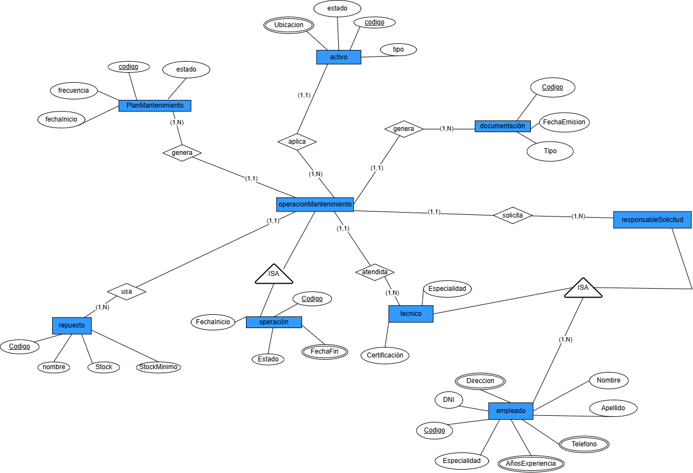

> [4. Diseño Conceptual](../4.md) › [4.4.1. Módulo 4.1](4.4.1.md)

# 4.4.1. Módulo de Gestión de Mantenimiento Logístico

### Diagrama Conceptual

### Diccionario de Datos

#### Tipo de Entidad

**1. Operacion**  
- **Descripción:** Registro general de cualquier actividad logística realizada en el sistema.  
- **Propósito:** Servir como entidad base para todas las operaciones especializadas del sistema.  
- **Reglas de negocio:**  
  - Cada operación debe tener un código único.
  - Toda operación debe tener una fecha de inicio y un estado.
  - Se especializa en: Operación Terrestre, Operación Marítima, Operación Portuaria, Operación Mantenimiento, Operación Monitoreo y Operación Embarque.

| **Atributo** | **Descripción** | **Propósito** | **Dominio** | **Obligatorio** | **Único** | **Multivaluado** | **Ejemplo** |
|--------------|-----------------|---------------|-------------|-----------------|-----------|------------------|-------------|
| Codigo | Identificador único | Identificación | Texto | Sí | Sí | No | OP-2025-001 |
| FechaInicio | Fecha de inicio de la operación | Control temporal | Fecha | Sí | No | No | 2025-09-27 |
| FechaFin | Fecha de finalización | Control temporal | Fecha | No | No | No | 2025-09-30 |
| Estado | Estado actual de la operación | Seguimiento | Enumeración | Sí | No | No | En curso |

**2. Operacion_Mantenimiento**  
- **Descripción:** Operación especializada en el mantenimiento de activos.  
- **Propósito:** Ejecutar tareas de mantenimiento planificadas.  
- **Reglas de negocio:**  
  - Hereda todos los atributos de Operación.
  - Debe estar asociada a un plan de mantenimiento.

*No posee atributos adicionales propios.*

**3. Plan_Mantenimiento**  
- **Descripción:** Documento que define periodicidad del mantenimiento.  
- **Propósito:** Asegurar continuidad y control sobre los activos.  
- **Reglas de negocio:**  
  - Todo plan debe estar vinculado a un activo.

| **Atributo** | **Descripción** | **Propósito** | **Dominio** | **Obligatorio** | **Único** | **Multivaluado** | **Ejemplo** |
|--------------|-----------------|---------------|-------------|-----------------|-----------|------------------|-------------|
| Codigo | Identificador único | Identificación | Texto | Sí | Sí | No | PM-2025 |
| Estado | Estado del plan | Control | Enumeración | Sí | No | No | Activo |
| Frecuencia | Periodicidad del plan | Seguimiento | Texto | Sí | No | No | Trimestral |
| FechaInicio | Inicio del plan | Control | Fecha | Sí | No | No | 2025-01-01 |

**4. Activo**  
- **Descripción:** Bien o recurso sujeto a mantenimiento.  
- **Propósito:** Mantener control y trazabilidad de activos.  
- **Reglas de negocio:**  
  - Cada activo debe tener un código único.

| **Atributo** | **Descripción** | **Propósito** | **Dominio** | **Obligatorio** | **Único** | **Multivaluado** | **Ejemplo** |
|--------------|-----------------|---------------|-------------|-----------------|-----------|------------------|-------------|
| Codigo | Identificador único | Identificación | Texto | Sí | Sí | No | ACT-001 |
| Tipo | Clasificación del activo | Clasificación | Texto | Sí | No | No | Vehículo |
| Estado | Estado del activo | Seguimiento | Enumeración | Sí | No | No | Operativo |
| Ubicacion | Localización | Identificación | Texto | No | No | No | Almacén 3 |

**5. Documentacion**  
- **Descripción:** Documentos legales y administrativos generados en las operaciones.  
- **Propósito:** Cumplir requisitos normativos y de control.  
- **Reglas de negocio:**  
  - Cada documento debe tener un código único.
  - Puede estar asociado a diferentes tipos de operaciones.

| **Atributo** | **Descripción** | **Propósito** | **Dominio** | **Obligatorio** | **Único** | **Multivaluado** | **Ejemplo** |
|--------------|-----------------|---------------|-------------|-----------------|-----------|------------------|-------------|
| Codigo | Identificador único | Identificación | Texto | Sí | Sí | No | DOC-001 |
| Tipo | Tipo de documento | Clasificación | Enumeración | Sí | No | No | Guía de remisión |
| FechaEmision | Fecha de emisión | Control temporal | Fecha | Sí | No | No | 2025-09-27 |

**6. Empleado**  
- **Descripción:** Persona que trabaja en la empresa de logística.  
- **Propósito:** Gestionar el personal y sus roles en las operaciones del sistema.  
- **Reglas de negocio:**  
  - Cada empleado debe tener un código único.
  - El DNI debe ser único en el sistema.
  - Se especializa en: Agente de Reservas, Tripulante, Trabajador Portuario, Conductor, Técnico, Responsable Solicitud y Operador.

| **Atributo** | **Descripción** | **Propósito** | **Dominio** | **Obligatorio** | **Único** | **Multivaluado** | **Ejemplo** |
|--------------|-----------------|---------------|-------------|-----------------|-----------|------------------|-------------|
| Codigo | Identificador único | Identificación | Texto | Sí | Sí | No | EMP-001 |
| DNI | Documento nacional de identidad | Identificación legal | Texto(8) | Sí | Sí | No | 87654321 |
| Nombre | Nombre del empleado | Identificación | Texto | Sí | No | No | Juan |
| Apellido | Apellido del empleado | Identificación | Texto | Sí | No | No | Pérez |
| Telefono | Número de contacto | Comunicación | Texto | No | No | Sí | 987654321 |
| Direccion | Dirección de residencia | Ubicación | Texto | No | No | No | Av. Marina 123 |
| Especialidad | Especialidad en la empresa | Clasificación | Texto | Sí | No | No | Supervisor |
| AñosExperiencia | Años de experiencia laboral | Evaluación | Número | No | No | No | 5 |

**7. Tecnico**  
- **Descripción:** Empleado especializado en tareas de mantenimiento técnico.  
- **Propósito:** Ejecutar operaciones de mantenimiento de activos.  
- **Reglas de negocio:**  
  - Hereda todos los atributos de Empleado.
  - Debe tener al menos una certificación técnica.

| **Atributo** | **Descripción** | **Propósito** | **Dominio** | **Obligatorio** | **Único** | **Multivaluado** | **Ejemplo** |
|--------------|-----------------|---------------|-------------|-----------------|-----------|------------------|-------------|
| Especialidad | Área técnica de especialización | Clasificación | Texto | Sí | No | No | Mecánica |
| Certificacion | Certificación técnica obtenida | Control | Texto | Sí | No | No | ISO-9001 |

**8. Responsable_Solicitud**  
- **Descripción:** Empleado que solicita la ejecución de operaciones de mantenimiento.  
- **Propósito:** Formalizar el inicio de operaciones de mantenimiento.  
- **Reglas de negocio:**  
  - Hereda todos los atributos de Empleado.
  - Puede solicitar múltiples operaciones de mantenimiento.

*No posee atributos adicionales propios.*

**9. Repuesto**  
- **Descripción:** Piezas necesarias para realizar mantenimiento.  
- **Propósito:** Gestionar el inventario de repuestos.  
- **Reglas de negocio:**  
  - El stock no debe ser menor al stock mínimo.

| **Atributo** | **Descripción** | **Propósito** | **Dominio** | **Obligatorio** | **Único** | **Multivaluado** | **Ejemplo** |
|--------------|-----------------|---------------|-------------|-----------------|-----------|------------------|-------------|
| Codigo | Identificador único | Identificación | Texto | Sí | Sí | No | REP-001 |
| Nombre | Nombre del repuesto | Identificación | Texto | Sí | No | No | Filtro aceite |
| Stock | Cantidad disponible | Control | Número | Sí | No | No | 50 |
| StockMinimo | Cantidad mínima | Control | Número | Sí | No | No | 10 |

---

#### Tipos de Relación

**1. Relación: Operacion_Mantenimiento genera Documentacion**  
- **Entidades participantes:** Operacion_Mantenimiento (1) — Documentacion (N)  
- **Descripción:** Cada operación puede generar múltiples documentos.  
- **Propósito:** Registrar la documentación técnica y administrativa del mantenimiento.  
- **Reglas de negocio relevantes:**  
  - Una operación de mantenimiento genera uno o más documentos.
  - Cada documento pertenece a una operación específica.
- **Cardinalidades:**  
  - Operacion_Mantenimiento (1,1)  
  - Documentacion (1,N)  
- **Justificación:** Las operaciones de mantenimiento requieren documentación técnica detallada.

**2. Relación: Plan_Mantenimiento aplica_a Activo**  
- **Entidades participantes:** Plan_Mantenimiento (N) — Activo (1)  
- **Descripción:** Cada plan pertenece a un activo específico.  
- **Propósito:** Asegurar que cada activo tiene un plan de mantenimiento.  
- **Reglas de negocio relevantes:**  
  - Un plan de mantenimiento se aplica a un único activo.
  - Un activo puede tener múltiples planes de mantenimiento a lo largo del tiempo.
- **Cardinalidades:**  
  - Plan_Mantenimiento (1,N)  
  - Activo (1,1)  
- **Justificación:** Los planes son específicos para cada activo, pero un activo puede tener planes sucesivos.

**3. Relación: Responsable_Solicitud solicita Operacion_Mantenimiento**  
- **Entidades participantes:** Responsable_Solicitud (1) — Operacion_Mantenimiento (N)  
- **Descripción:** Un responsable puede solicitar múltiples operaciones.  
- **Propósito:** Formalizar quién solicita el mantenimiento.  
- **Reglas de negocio relevantes:**  
  - Un responsable puede solicitar múltiples operaciones de mantenimiento.
  - Cada operación es solicitada por un único responsable.
- **Cardinalidades:**  
  - Responsable_Solicitud (1,N)  
  - Operacion_Mantenimiento (1,1)  
- **Justificación:** Se requiere trazabilidad de quién solicita cada operación de mantenimiento.

**4. Relación: Operacion_Mantenimiento atendida_por Tecnico**  
- **Entidades participantes:** Operacion_Mantenimiento (N) — Tecnico (1)  
- **Descripción:** Una operación puede requerir varios técnicos.  
- **Propósito:** Asignar técnicos especializados a operaciones de mantenimiento.  
- **Reglas de negocio relevantes:**  
  - Una operación de mantenimiento es atendida por múltiples técnicos.
  - Un técnico puede atender una operación a la vez.
- **Cardinalidades:**  
  - Operacion_Mantenimiento (1,N)  
  - Tecnico (1,1)  
- **Justificación:** Las operaciones de mantenimiento pueden requerir varios técnicos especializados.

**5. Relación: Operacion_Mantenimiento usa Repuesto**  
- **Entidades participantes:** Operacion_Mantenimiento (1) — Repuesto (N)  
- **Descripción:** Una operación puede requerir varios repuestos.  
- **Propósito:** Controlar el uso de repuestos en mantenimiento.  
- **Reglas de negocio relevantes:**  
  - Una operación puede usar múltiples repuestos.
  - Un repuesto puede ser usado en múltiples operaciones.
  - **Esta relación N:M se implementa mediante una tabla auxiliar.**
- **Cardinalidades:**  
  - Operacion_Mantenimiento (1,N)  
  - Repuesto (1,N)  
- **Justificación:** Las operaciones requieren diferentes repuestos, y los repuestos son utilizados en múltiples operaciones.

**6. Relación: Operacion_Mantenimiento ES UNA INSTANCIA DE Operacion**  
- **Descripción:** Relación de especialización donde Operacion_Mantenimiento es un tipo específico de Operacion.  
- **Propósito:** Representar la jerarquía de operaciones especializadas en mantenimiento de activos.  
- **Reglas de negocio relevantes:**  
  - No todas las operaciones son de mantenimiento.
  - Una operación de mantenimiento hereda todos los atributos de operación.
- **Cardinalidades:**  
  - Operacion (1,1)  
  - Operacion_Mantenimiento (0,1)  
- **Justificación:** Herencia completa donde Operacion_Mantenimiento es una especialización de Operacion.

**7. Relación: Tecnico ES UNA INSTANCIA DE Empleado**  
- **Descripción:** Relación de especialización donde Tecnico es un tipo específico de Empleado.  
- **Propósito:** Representar la jerarquía de empleados especializados en mantenimiento técnico.  
- **Reglas de negocio relevantes:**  
  - No todos los empleados son técnicos.
  - Un técnico hereda todos los atributos de empleado.
- **Cardinalidades:**  
  - Empleado (1,1)  
  - Tecnico (0,1)  
- **Justificación:** Herencia completa donde Tecnico es una especialización de Empleado.

**8. Relación: Responsable_Solicitud ES UNA INSTANCIA DE Empleado**  
- **Descripción:** Relación de especialización donde Responsable_Solicitud es un tipo específico de Empleado.  
- **Propósito:** Representar la jerarquía de empleados que solicitan operaciones de mantenimiento.  
- **Reglas de negocio relevantes:**  
  - No todos los empleados son responsables de solicitud.
  - Un responsable de solicitud hereda todos los atributos de empleado.
- **Cardinalidades:**  
  - Empleado (1,1)  
  - Responsable_Solicitud (0,1)  
- **Justificación:** Herencia completa donde Responsable_Solicitud es una especialización de Empleado.

---

[⬅️ Anterior](../../4.4/4.4.md) | [🏠 Home](../../README.md) | [Siguiente ➡️](../../4.5/4.5.md)