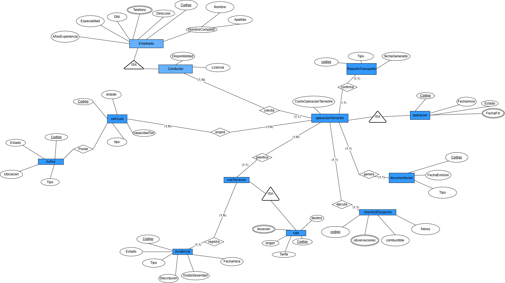

> [4. Diseño Conceptual](../4.md) › [4.4. Módulo 4](4.4.md)

# 4.4. Módulo de Gestión de Operaciones Terrestres

### Diagrama Conceptual

### Diccionario de Datos

#### Tipo de Entidad

**1. Operacion**  
- **Descripción:** Registro general de cualquier actividad logística realizada en el sistema.  
- **Propósito:** Servir como entidad base para todas las operaciones especializadas del sistema.  
- **Reglas de negocio:**  
  - Cada operación debe tener un código único.
  - Toda operación debe tener una fecha de inicio y un estado.
  - Se especializa en: Operación Terrestre, Operación Marítima, Operación Portuaria, Operación Mantenimiento, Operación Monitoreo y Operación Embarque.

| **Atributo** | **Descripción** | **Propósito** | **Dominio** | **Obligatorio** | **Único** | **Multivaluado** | **Ejemplo** |
|--------------|-----------------|---------------|-------------|-----------------|-----------|------------------|-------------|
| Codigo | Identificador único | Identificación | Texto | Sí | Sí | No | OP-2025-001 |
| FechaInicio | Fecha de inicio de la operación | Control temporal | Fecha | Sí | No | No | 2025-09-27 |
| FechaFin | Fecha de finalización | Control temporal | Fecha | No | No | No | 2025-09-30 |
| Estado | Estado actual de la operación | Seguimiento | Enumeración | Sí | No | No | En curso |

**2. Operacion_Terrestre**  
- **Descripción:** Operación logística especializada en transporte terrestre.  
- **Propósito:** Gestionar operaciones de transporte por carretera.  
- **Reglas de negocio:**  
  - Hereda todos los atributos de Operación.
  - Requiere vehículo, ruta terrestre y conductor asignados.

| **Atributo** | **Descripción** | **Propósito** | **Dominio** | **Obligatorio** | **Único** | **Multivaluado** | **Ejemplo** |
|--------------|-----------------|---------------|-------------|-----------------|-----------|------------------|-------------|
| Codigo | Identificador único (heredado) | Identificación | Texto | Sí | Sí | No | OP-2025-001 |
| FechaInicio | Fecha de inicio (heredado) | Control temporal | Fecha | Sí | No | No | 2025-09-27 |
| FechaFin | Fecha de fin (heredado) | Control temporal | Fecha | No | No | No | 2025-09-30 |
| Estado | Estado actual (heredado) | Seguimiento | Enumeración | Sí | No | No | En curso |
| CostoOperacionTerrestre | Costo del transporte terrestre | Financiero | Decimal | Sí | No | No | 1200.50 |

**3. Reporte_Transporte**  
- **Descripción:** Documento de control de operación terrestre.  
- **Propósito:** Confirmar y registrar ejecución e incidencias.  
- **Reglas de negocio:**  
  - Debe estar vinculado a una operación terrestre.

| **Atributo** | **Descripción** | **Propósito** | **Dominio** | **Obligatorio** | **Único** | **Multivaluado** | **Ejemplo** |
|--------------|-----------------|---------------|-------------|-----------------|-----------|------------------|-------------|
| Codigo | Identificador único | Identificación | Texto | Sí | Sí | No | REP-001 |
| Tipo | Tipo de reporte | Clasificación | Enumeración | Sí | No | No | Control salida |
| FechaGenerado | Fecha de creación | Control | Fecha | Sí | No | No | 2025-09-28 |

**5. Empleado**  
- **Descripción:** Personal que opera en el sistema.  
- **Propósito:** Depende del área.  
- **Reglas de negocio:**  
  - Cada empleado debe tener un código único.
  - El DNI debe ser único en el sistema.
  - Se especializa en: Agente de Reservas, Tripulante, Trabajador Portuario, Conductor, Técnico, Responsable Solicitud y Operador.

| **Atributo**    | **Descripción**            | **Propósito**     | **Dominio** | **Obligatorio** | **Único** | **Multivaluado** | **Ejemplo**      |
|-----------------|----------------------------|-------------------|-------------|-----------------|-----------|------------------|------------------|
| Codigo          | Identificador único        | Identificación    | Texto       | Sí              | Sí        | No               | EMP-001          |
| DNI             | Documento nacional de identidad | Identificación legal | Texto(8) | Sí         | Sí        | No               | 87654321         |
| Nombre          | Nombre del empleado        | Identificación    | Texto       | Sí              | No        | No               | Juan             |
| Apellido        | Apellido del empleado      | Identificación    | Texto       | Sí              | No        | No               | Pérez            |
| Telefono        | Número de contacto         | Comunicación      | Texto       | No              | No        | Sí               | 987654321        |
| Direccion       | Dirección de residencia    | Ubicación         | Texto       | No              | No        | No               | Av. Marina 123   |
| Especialidad    | Especialidad en la empresa | Clasificación     | Texto       | Sí              | No        | No               | Supervisor       |
| AñosExperiencia | Años de experiencia laboral| Evaluación        | Número      | No              | No        | No               | 5                |

**5. Conductor**  
- **Descripción:** Empleado especializado en la conducción de vehículos terrestres.  
- **Propósito:** Asegurar el transporte terrestre de mercancías.  
- **Reglas de negocio:**  
  - Hereda todos los atributos de Empleado.
  - Debe tener licencia vigente.

| **Atributo** | **Descripción** | **Propósito** | **Dominio** | **Obligatorio** | **Único** | **Multivaluado** | **Ejemplo** |
|--------------|-----------------|---------------|-------------|-----------------|-----------|------------------|-------------|
| Licencia | Número de licencia de conducir | Identificación legal | Texto | Sí | Sí | No | B-123456 |
| Disponibilidad | Estado de disponibilidad | Control | Enumeración | Sí | No | No | Disponible |

**6. Vehiculo**  
- **Descripción:** Medio de transporte utilizado en operaciones terrestres.  
- **Propósito:** Permitir traslado de carga por carretera.  
- **Reglas de negocio:**  
  - Cada vehículo debe tener código único.

| **Atributo** | **Descripción** | **Propósito** | **Dominio** | **Obligatorio** | **Único** | **Multivaluado** | **Ejemplo** |
|--------------|-----------------|---------------|-------------|-----------------|-----------|------------------|-------------|
| Codigo | Identificador único | Identificación | Texto | Sí | Sí | No | VH-001 |
| Tipo | Tipo de vehículo | Clasificación | Texto | Sí | No | No | Camión |
| Estado | Estado actual | Control | Enumeración | Sí | No | No | Disponible |
| CapacidadTon | Capacidad en toneladas | Control | Número | Sí | No | No | 25 |

**7. Ruta**  
- **Descripción:** Trayecto predefinido entre un punto de origen y un punto de destino.  
- **Propósito:** Planificar y dar seguimiento a los viajes y traslados.  
- **Reglas de negocio:**  
  - Cada ruta debe tener un código único.
  - Se especializa en: Ruta Marítima y Ruta Terrestre.

| **Atributo** | **Descripción** | **Propósito** | **Dominio** | **Obligatorio** | **Único** | **Multivaluado** | **Ejemplo** |
|--------------|-----------------|---------------|-------------|-----------------|-----------|------------------|-------------|
| Codigo | Identificador único | Identificación | Texto | Sí | Sí | No | RUT-001 |
| Origen | Lugar de origen | Logística | Texto | Sí | No | No | Callao |
| Destino | Lugar de destino | Logística | Texto | Sí | No | No | Hamburgo |
| Duracion | Duración estimada en días | Planificación | Número | Sí | No | No | 25 |
| Tarifa | Tarifa base de la ruta | Financiero | Decimal | Sí | No | No | 5000.00 |

**8. Ruta_Terrestre**  
- **Descripción:** Ruta especializada en trayectos terrestres por carretera.  
- **Propósito:** Detallar características del trayecto carretero.  
- **Reglas de negocio:**  
  - Hereda todos los atributos de Ruta.
  - Puede registrar incidencias durante el trayecto.

*No posee atributos adicionales propios.*

**9. Incidencia**  
- **Descripción:** Evento negativo o problema registrado durante una operación.  
- **Propósito:** Dar trazabilidad y seguimiento a problemas de seguridad o no conformidad.  
- **Reglas de negocio:**  
  - Debe estar asociada a una operación.
  - Puede ser registrada por un empleado o usuario.

| **Atributo** | **Descripción** | **Propósito** | **Dominio** | **Obligatorio** | **Único** | **Multivaluado** | **Ejemplo** |
|--------------|-----------------|---------------|-------------|-----------------|-----------|------------------|-------------|
| Codigo | Identificador único | Identificación | Texto | Sí | Sí | No | INC-001 |
| Tipo | Tipo de incidencia | Clasificación | Enumeración | Sí | No | No | Seguridad |
| Descripcion | Descripción detallada del evento | Contexto | Texto | Sí | No | No | Derrame de líquido |
| GradoSeveridad | Nivel de gravedad del problema | Control | Enumeración | Sí | No | No | Alto |
| Estado | Estado de la incidencia | Seguimiento | Enumeración | Sí | No | No | Reportada |
| FechaHora | Momento exacto de ocurrencia | Registro temporal | FechaHora | Sí | No | No | 2025-09-28 14:35 |

**10. Documentacion**  
- **Descripción:** Documentos legales y administrativos generados en las operaciones.  
- **Propósito:** Cumplir requisitos normativos y de control.  
- **Reglas de negocio:**  
  - Cada documento debe tener un código único.
  - Puede estar asociado a diferentes tipos de operaciones.

| **Atributo** | **Descripción** | **Propósito** | **Dominio** | **Obligatorio** | **Único** | **Multivaluado** | **Ejemplo** |
|--------------|-----------------|---------------|-------------|-----------------|-----------|------------------|-------------|
| Codigo | Identificador único | Identificación | Texto | Sí | Sí | No | DOC-001 |
| Tipo | Tipo de documento | Clasificación | Enumeración | Sí | No | No | Guía de remisión |
| FechaEmision | Fecha de emisión | Control temporal | Fecha | Sí | No | No | 2025-09-27 |

**11. Checklist_Despacho**  
- **Descripción:** Lista de verificación previa a salida de operación.  
- **Propósito:** Garantizar seguridad y preparación.  
- **Reglas de negocio:**  
  - Debe ser aprobado antes de iniciar operación terrestre.

| **Atributo** | **Descripción** | **Propósito** | **Dominio** | **Obligatorio** | **Único** | **Multivaluado** | **Ejemplo** |
|--------------|-----------------|---------------|-------------|-----------------|-----------|------------------|-------------|
| Codigo | Identificador único | Identificación | Texto | Sí | Sí | No | CHK-001 |
| Observaciones | Notas adicionales | Seguimiento | Texto | No | No | No | Neumáticos OK |
| Combustible | Nivel de tanque | Control | Texto | Sí | No | No | Completo |
| Frenos | Estado de frenos | Control | Enumeración | Sí | No | No | Aprobado |

**12. Activo**  
- **Descripción:** Bien o recurso sujeto a mantenimiento.  
- **Propósito:** Mantener control y trazabilidad de activos.  
- **Reglas de negocio:**  
  - Cada activo debe tener un código único.

| **Atributo** | **Descripción** | **Propósito** | **Dominio** | **Obligatorio** | **Único** | **Multivaluado** | **Ejemplo** |
|--------------|-----------------|---------------|-------------|-----------------|-----------|------------------|-------------|
| Codigo | Identificador único | Identificación | Texto | Sí | Sí | No | ACT-001 |
| Tipo | Clasificación del activo | Clasificación | Texto | Sí | No | No | Vehículo |
| Estado | Estado del activo | Seguimiento | Enumeración | Sí | No | No | Operativo |
| Ubicacion | Localización | Identificación | Texto | No | No | No | Almacén 3 |

**13. Contenedor**  
- **Descripción:** Unidad estandarizada de transporte de mercancías.  
- **Propósito:** Gestionar los contenedores disponibles y su estado.  
- **Reglas de negocio:**  
  - Cada contenedor debe tener un código único.
  - Un contenedor puede ser asignado a múltiples operaciones a lo largo del tiempo.
  - Debe tener un tipo de contenedor asociado.

| **Atributo** | **Descripción** | **Propósito** | **Dominio** | **Obligatorio** | **Único** | **Multivaluado** | **Ejemplo** |
|--------------|-----------------|---------------|-------------|-----------------|-----------|------------------|-------------|
| Codigo | Identificador único | Identificación | Texto | Sí | Sí | No | CONT-123 |
| Peso | Peso del contenedor con mercancía | Control técnico | Número | Sí | No | No | 2500 |
| Capacidad | Capacidad máxima de carga | Control técnico | Número | Sí | No | No | 33500 |
| Dimensiones | Dimensiones físicas | Especificación | Texto | Sí | No | No | 20x8x8.5 |
| Estado | Estado del contenedor | Seguimiento | Enumeración | Sí | No | No | Disponible |
| Disponibilidad | Disponibilidad para asignar | Control | Enumeración | Sí | No | No | Sí |
| Mercancia | Tipo de mercancía contenida | Clasificación | Texto | No | No | Sí | Electrónicos |

---

#### Tipos de Relación

**1. Relación: Operacion_Terrestre confirma Reporte_Transporte**  
- **Entidades participantes:** Operacion_Terrestre (N) — Reporte_Transporte (1)  
- **Descripción:** Cada operación terrestre genera un reporte confirmado.  
- **Propósito:** Documentar la ejecución de la operación.  
- **Reglas de negocio relevantes:**  
  - Una operación terrestre genera un único reporte.
  - Un reporte pertenece a una única operación.
- **Cardinalidades:**  
  - Operacion_Terrestre (1,1)  
  - Reporte_Transporte (1,1)  
- **Justificación:** Relación uno a uno para documentar cada operación.

**2. Relación: Operacion_Terrestre genera Documentacion**  
- **Entidades participantes:** Operacion_Terrestre (1) — Documentacion (N)  
- **Descripción:** Una operación terrestre debe generar su documentación.  
- **Propósito:** Cumplir requisitos legales y administrativos.  
- **Reglas de negocio relevantes:**  
  - Una operación terrestre genera uno o más documentos.
  - Cada documento pertenece a una operación específica.
- **Cardinalidades:**  
  - Operacion_Terrestre (1,1)  
  - Documentacion (1,N)  
- **Justificación:** Una operación requiere documentación oficial.

**3. Relación: Operacion_Terrestre ejecuta Checklist_Despacho**  
- **Entidades participantes:** Operacion_Terrestre (N) — Checklist_Despacho (1)  
- **Descripción:** Cada operación terrestre valida un checklist.  
- **Propósito:** Garantizar seguridad antes de iniciar operación.  
- **Reglas de negocio relevantes:**  
  - Una operación terrestre ejecuta un único checklist.
  - Un checklist pertenece a una única operación.
- **Cardinalidades:**  
  - Operacion_Terrestre (1,1)  
  - Checklist_Despacho (1,1)  
- **Justificación:** Relación uno a uno para verificación previa.

**4. Relación: Operacion_Terrestre solicita Conductor**  
- **Entidades participantes:** Operacion_Terrestre (N) — Conductor (1)  
- **Descripción:** Cada operación requiere al menos un conductor.  
- **Propósito:** Asignar conductores a operaciones terrestres.  
- **Reglas de negocio relevantes:**  
  - Una operación terrestre solicita un único conductor.
  - Un conductor puede atender múltiples operaciones a lo largo del tiempo.
- **Cardinalidades:**  
  - Operacion_Terrestre (1,1)  
  - Conductor (1,N)  
- **Justificación:** Una operación terrestre requiere un conductor específico.

**5. Relación: Operacion_Terrestre asigna Vehiculo**  
- **Entidades participantes:** Operacion_Terrestre (N) — Vehiculo (1)  
- **Descripción:** Un vehículo se asigna a la operación.  
- **Propósito:** Gestionar el uso de vehículos en operaciones terrestres.  
- **Reglas de negocio relevantes:**  
  - Una operación terrestre asigna un único vehículo.
  - Un vehículo puede ser asignado a múltiples operaciones a lo largo del tiempo.
- **Cardinalidades:**  
  - Operacion_Terrestre (1,1)  
  - Vehiculo (1,N)  
- **Justificación:** Una operación requiere un vehículo específico para su ejecución.

**6. Relación: Operacion_Terrestre planifica Ruta_Terrestre**  
- **Entidades participantes:** Operacion_Terrestre (N) — Ruta_Terrestre (1)  
- **Descripción:** Toda operación terrestre debe planificar una ruta.  
- **Propósito:** Definir el trayecto que seguirá la operación terrestre.  
- **Reglas de negocio relevantes:**  
  - Una operación terrestre planifica una única ruta.
  - Una ruta terrestre puede ser utilizada por múltiples operaciones.
- **Cardinalidades:**  
  - Operacion_Terrestre (1,1)  
  - Ruta_Terrestre (0,N)  
- **Justificación:** Una operación debe seguir una ruta específica, pero una ruta puede ser reutilizada.

**7. Relación: Ruta_Terrestre registra Incidencia**  
- **Entidades participantes:** Ruta_Terrestre (N) — Incidencia (1)  
- **Descripción:** Una ruta terrestre puede registrar incidencias en el trayecto.  
- **Propósito:** Documentar problemas ocurridos durante el recorrido.  
- **Reglas de negocio relevantes:**  
  - Una ruta puede tener múltiples incidencias a lo largo del tiempo.
  - Cada incidencia está asociada a una ruta específica.
- **Cardinalidades:**  
  - Ruta_Terrestre (1,N)  
  - Incidencia (1,1)  
- **Justificación:** Las incidencias se registran en el contexto de la ruta donde ocurrieron.

**8. Relación: Operacion_Terrestre ES UNA INSTANCIA DE Operacion**  
- **Descripción:** Relación de especialización donde Operacion_Terrestre es un tipo específico de Operacion.  
- **Propósito:** Representar la jerarquía de operaciones especializadas en transporte terrestre.  
- **Reglas de negocio relevantes:**  
  - No todas las operaciones son terrestres.
  - Una operación terrestre hereda todos los atributos de operación.
- **Cardinalidades:**  
  - Operacion (1,1)  
  - Operacion_Terrestre (0,1)  
- **Justificación:** Herencia completa donde Operacion_Terrestre es una especialización de Operacion.

**9. Relación: Conductor ES UNA INSTANCIA DE Empleado**  
- **Descripción:** Relación de especialización donde Conductor es un tipo específico de Empleado.  
- **Propósito:** Representar la jerarquía de empleados especializados en conducción de vehículos.  
- **Reglas de negocio relevantes:**  
  - No todos los empleados son conductores.
  - Un conductor hereda todos los atributos de empleado.
- **Cardinalidades:**  
  - Empleado (1,1)  
  - Conductor (0,1)  
- **Justificación:** Herencia completa donde Conductor es una especialización de Empleado.

**10. Relación: Ruta_Terrestre ES UNA INSTANCIA DE Ruta**  
- **Descripción:** Relación de especialización donde Ruta_Terrestre es un tipo específico de Ruta.  
- **Propósito:** Representar la jerarquía de rutas especializadas en trayectos terrestres.  
- **Reglas de negocio relevantes:**  
  - No todas las rutas son terrestres.
  - Una ruta terrestre hereda todos los atributos de ruta.
- **Cardinalidades:**  
  - Ruta (1,1)  
  - Ruta_Terrestre (0,1)  
- **Justificación:** Herencia completa donde Ruta_Terrestre es una especialización de Ruta.

---

[⬅️ Anterior](../4.3/4.3.md) | [🏠 Home](../../README.md) | [Siguiente ➡️](../4.4/4.4.1/4.4.1.md)