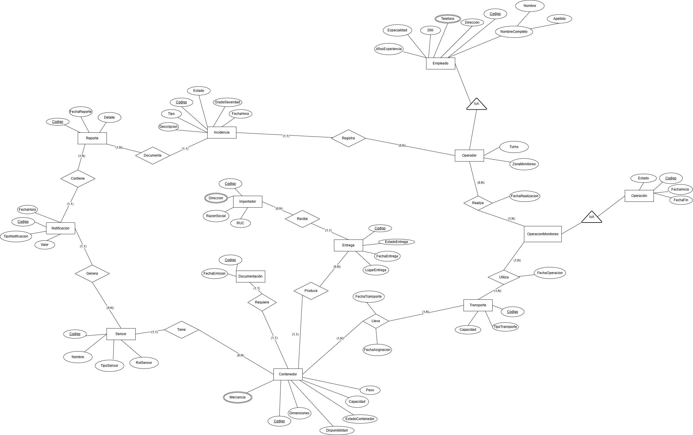

> [4. Diseño Conceptual](../4.md) › [4.5. Módulo 5](4.5.md)

# 4.5. Módulo de Monitoreo y Entrega

### Diagrama Conceptual

### Diccionario de Datos

#### Tipo de Entidad

**1. Empleado**  
- **Descripción:** Persona que trabaja en la empresa de logística.  
- **Propósito:** Gestionar el personal y sus roles en las operaciones del sistema.  
- **Reglas de negocio:**  
  - Cada empleado debe tener un código único.
  - El DNI debe ser único en el sistema.
  - Se especializa en: Agente de Reservas, Tripulante, Trabajador Portuario, Conductor, Técnico, Responsable Solicitud y Operador.

| **Atributo** | **Descripción** | **Propósito** | **Dominio** | **Obligatorio** | **Único** | **Multivaluado** | **Ejemplo** |
|--------------|-----------------|---------------|-------------|-----------------|-----------|------------------|-------------|
| Codigo | Identificador único | Identificación | Texto | Sí | Sí | No | EMP-001 |
| DNI | Documento nacional de identidad | Identificación legal | Texto(8) | Sí | Sí | No | 87654321 |
| Nombre | Nombre del empleado | Identificación | Texto | Sí | No | No | Juan |
| Apellido | Apellido del empleado | Identificación | Texto | Sí | No | No | Pérez |
| Telefono | Número de contacto | Comunicación | Texto | No | No | Sí | 987654321 |
| Direccion | Dirección de residencia | Ubicación | Texto | No | No | No | Av. Marina 123 |
| Especialidad | Especilidad en la empresa | Clasificación | Texto | Sí | No | No | Ingeniero |

**2. Operador**  
- **Descripción:** Empleado especializado en operaciones de monitoreo.  
- **Propósito:** Realizar y supervisar operaciones de monitoreo de contenedores.  
- **Reglas de negocio:**  
  - Hereda todos los atributos de Empleado.
  - Realiza operaciones de monitoreo y puede registrar incidencias.

| **Atributo** | **Descripción** | **Propósito** | **Dominio** | **Obligatorio** | **Único** | **Multivaluado** | **Ejemplo** |
|--------------|-----------------|---------------|-------------|-----------------|-----------|------------------|-------------|
| Turno | Turno de trabajo asignado | Organización | Enumeración | Sí | No | No | Mañana |
| ZonaMonitoreo | Área de responsabilidad | Operaciones | Texto | Sí | No | No | Zona Norte |

**3. Operacion**  
- **Descripción:** Registro general de cualquier actividad logística realizada en el sistema.  
- **Propósito:** Servir como entidad base para todas las operaciones especializadas del sistema.  
- **Reglas de negocio:**  
  - Cada operación debe tener un código único.
  - Toda operación debe tener una fecha de inicio y un estado.
  - Se especializa en: Operación Terrestre, Operación Marítima, Operación Portuaria, Operación Mantenimiento, Operación Monitoreo y Operación Embarque.

| **Atributo** | **Descripción** | **Propósito** | **Dominio** | **Obligatorio** | **Único** | **Multivaluado** | **Ejemplo** |
|--------------|-----------------|---------------|-------------|-----------------|-----------|------------------|-------------|
| Codigo | Identificador único | Identificación | Texto | Sí | Sí | No | OP-2025-001 |
| FechaInicio | Fecha de inicio de la operación | Control temporal | Fecha | Sí | No | No | 2025-09-27 |
| FechaFin | Fecha de finalización | Control temporal | Fecha | No | No | No | 2025-09-30 |
| Estado | Estado actual de la operación | Seguimiento | Enumeración | Sí | No | No | En curso |

**4. Operacion_Monitoreo**  
- **Descripción:** Operación específica de monitoreo de contenedores en tiempo real.  
- **Propósito:** Gestionar el seguimiento y control de contenedores durante el transporte.  
- **Reglas de negocio:**  
  - Hereda todos los atributos de Operación.
  - Utiliza transportes para el monitoreo.

*No posee atributos adicionales propios.*

**5. Transporte**  
- **Descripción:** Medio físico utilizado para transporte de contenedores.  
- **Propósito:** Facilitar movimiento de contenedores durante monitoreo.  
- **Reglas de negocio:**  
  - Puede ser utilizado en múltiples operaciones de monitoreo.

| **Atributo** | **Descripción** | **Propósito** | **Dominio** | **Obligatorio** | **Único** | **Multivaluado** | **Ejemplo** |
|--------------|-----------------|---------------|-------------|-----------------|-----------|------------------|-------------|
| Codigo | Identificador único | Identificación | Texto | Sí | Sí | No | T-001 |
| TipoTransporte | Tipo de transporte | Clasificación | Enumeración | Sí | No | No | Terrestre |
| Capacidad | Capacidad máxima | Control | Número | Sí | No | No | 25000 |

**6. Contenedor**  
- **Descripción:** Unidad estandarizada de transporte de mercancías.  
- **Propósito:** Gestionar los contenedores disponibles y su estado.  
- **Reglas de negocio:**  
  - Cada contenedor debe tener un código único.
  - Un contenedor puede ser asignado a múltiples operaciones a lo largo del tiempo.
  - Debe tener un tipo de contenedor asociado.

| **Atributo** | **Descripción** | **Propósito** | **Dominio** | **Obligatorio** | **Único** | **Multivaluado** | **Ejemplo** |
|--------------|-----------------|---------------|-------------|-----------------|-----------|------------------|-------------|
| Codigo | Identificador único | Identificación | Texto | Sí | Sí | No | CONT-123 |
| Peso | Peso del contenedor con mercancía | Control técnico | Número | Sí | No | No | 2500 |
| Capacidad | Capacidad máxima de carga | Control técnico | Número | Sí | No | No | 33500 |
| Dimensiones | Dimensiones físicas | Especificación | Texto | Sí | No | No | 20x8x8.5 |
| Estado | Estado del contenedor | Seguimiento | Enumeración | Sí | No | No | Disponible |
| Disponibilidad | Disponibilidad para asignar | Control | Enumeración | Sí | No | No | Sí |
| Mercancia | Tipo de mercancía contenida | Clasificación | Texto | No | No | Sí | Electrónicos |

**7. Documentacion**  
- **Descripción:** Documentos legales y administrativos generados en las operaciones.  
- **Propósito:** Cumplir requisitos normativos y de control.  
- **Reglas de negocio:**  
  - Cada documento debe tener un código único.
  - Puede estar asociado a diferentes tipos de operaciones.

| **Atributo** | **Descripción** | **Propósito** | **Dominio** | **Obligatorio** | **Único** | **Multivaluado** | **Ejemplo** |
|--------------|-----------------|---------------|-------------|-----------------|-----------|------------------|-------------|
| Codigo | Identificador único | Identificación | Texto | Sí | Sí | No | DOC-001 |
| Tipo | Tipo de documento | Clasificación | Enumeración | Sí | No | No | Guía de remisión |
| FechaEmision | Fecha de emisión | Control temporal | Fecha | Sí | No | No | 2025-09-27 |

**8. Importador**  
- **Descripción:** Cliente que recibe entregas de contenedores.  
- **Propósito:** Gestionar destinatarios finales de mercancías.  
- **Reglas de negocio:**  
  - Puede recibir múltiples entregas.

| **Atributo** | **Descripción** | **Propósito** | **Dominio** | **Obligatorio** | **Único** | **Multivaluado** | **Ejemplo** |
|--------------|-----------------|---------------|-------------|-----------------|-----------|------------------|-------------|
| Codigo | Identificador único | Identificación | Texto | Sí | Sí | No | IMP-001 |
| RUC | Registro único del contribuyente | Identificación fiscal | Texto(11) | Sí | Sí | No | 20123456789 |
| RazonSocial | Nombre legal | Identificación | Texto | Sí | No | No | Importadora SAC |
| Direccion | Dirección del importador | Contacto | Texto | Sí | No | Sí | Av. Principal 123 |

**9. Entrega**  
- **Descripción:** Proceso de entrega de contenedores al importador.  
- **Propósito:** Formalizar finalización del transporte.  
- **Reglas de negocio:**  
  - Cada entrega es producida por un contenedor.
  - Es recibida por un importador.

| **Atributo** | **Descripción** | **Propósito** | **Dominio** | **Obligatorio** | **Único** | **Multivaluado** | **Ejemplo** |
|--------------|-----------------|---------------|-------------|-----------------|-----------|------------------|-------------|
| Codigo | Identificador único | Identificación | Texto | Sí | Sí | No | ENT-001 |
| EstadoEntrega | Estado de la entrega | Seguimiento | Enumeración | Sí | No | No | Completada |
| FechaEntrega | Fecha de entrega | Control temporal | Fecha | Sí | No | No | 2025-09-20 |
| LugarEntrega | Lugar de entrega | Logística | Texto | Sí | No | No | Almacén Central |

**10. Sensor**  
- **Descripción:** Dispositivo IoT para monitoreo de contenedores.  
- **Propósito:** Recopilar datos en tiempo real del contenedor.  
- **Reglas de negocio:**  
  - Genera notificaciones automáticas.

| **Atributo** | **Descripción** | **Propósito** | **Dominio** | **Obligatorio** | **Único** | **Multivaluado** | **Ejemplo** |
|--------------|-----------------|---------------|-------------|-----------------|-----------|------------------|-------------|
| Codigo | Identificador único | Identificación | Texto | Sí | Sí | No | SENS-001 |
| Nombre | Nombre del sensor | Identificación | Texto | Sí | No | No | Sensor Temperatura |
| TipoSensor | Tipo de sensor | Clasificación | Enumeración | Sí | No | No | Temperatura |
| RolSensor | Función del sensor | Especificación | Texto | Sí | No | No | Monitoreo |

**11. Notificacion**  
- **Descripción:** Alerta generada por sensores del contenedor.  
- **Propósito:** Notificar eventos importantes durante monitoreo.  
- **Reglas de negocio:**  
  - Es generada por sensores.
  - Es contenida en reportes.

| **Atributo** | **Descripción** | **Propósito** | **Dominio** | **Obligatorio** | **Único** | **Multivaluado** | **Ejemplo** |
|--------------|-----------------|---------------|-------------|-----------------|-----------|------------------|-------------|
| Codigo | Identificador único | Identificación | Texto | Sí | Sí | No | NOT-001 |
| TipoNotificacion | Tipo de notificación | Clasificación | Enumeración | Sí | No | No | Alerta |
| FechaHora | Fecha y hora de generación | Control temporal | FechaHora | Sí | No | No | 2025-09-19 14:30 |
| Valor | Valor medido | Datos | Número | Sí | No | No | 25.5 |

**12. Reporte**  
- **Descripción:** Documento que consolida información del monitoreo.  
- **Propósito:** Generar informes de operaciones de monitoreo.  
- **Reglas de negocio:**  
  - Contiene múltiples notificaciones.
  - Documenta incidencias.

| **Atributo** | **Descripción** | **Propósito** | **Dominio** | **Obligatorio** | **Único** | **Multivaluado** | **Ejemplo** |
|--------------|-----------------|---------------|-------------|-----------------|-----------|------------------|-------------|
| Codigo | Identificador único | Identificación | Texto | Sí | Sí | No | REP-001 |
| FechaReporte | Fecha del reporte | Control temporal | Fecha | Sí | No | No | 2025-09-19 |
| Detalle | Detalle del reporte | Contenido | Texto | Sí | No | No | Resumen diario |

**13. Incidencia**  
- **Descripción:** Evento negativo o problema registrado durante una operación.  
- **Propósito:** Dar trazabilidad y seguimiento a problemas de seguridad o no conformidad.  
- **Reglas de negocio:**  
  - Debe estar asociada a una operación.
  - Puede ser registrada por un empleado o usuario.

| **Atributo** | **Descripción** | **Propósito** | **Dominio** | **Obligatorio** | **Único** | **Multivaluado** | **Ejemplo** |
|--------------|-----------------|---------------|-------------|-----------------|-----------|------------------|-------------|
| Codigo | Identificador único | Identificación | Texto | Sí | Sí | No | INC-001 |
| Tipo | Tipo de incidencia | Clasificación | Enumeración | Sí | No | No | Seguridad |
| Descripcion | Descripción detallada del evento | Contexto | Texto | Sí | No | No | Derrame de líquido |
| GradoSeveridad | Nivel de gravedad del problema | Control | Enumeración | Sí | No | No | Alto |
| Estado | Estado de la incidencia | Seguimiento | Enumeración | Sí | No | No | Reportada |
| FechaHora | Momento exacto de ocurrencia | Registro temporal | FechaHora | Sí | No | No | 2025-09-28 14:35 |

---

#### Tipos de Relación

**1. Relación: Operador realiza Operacion_Monitoreo**  
- **Entidades participantes:** Operador (1) — Operacion_Monitoreo (N)  
- **Descripción:** Los operadores realizan operaciones de monitoreo.  
- **Propósito:** Registrar la participación de operadores en operaciones.  
- **Reglas de negocio relevantes:**  
  - Un operador puede realizar múltiples operaciones de monitoreo.
  - Una operación puede ser realizada por múltiples operadores.
  - **Esta relación N:M se implementa mediante una tabla auxiliar con el atributo FechaRealizacion.**
- **Cardinalidades:**  
  - Operador (0,N)  
  - Operacion_Monitoreo (1,N)  
- **Atributos de la relación:**  
  - FechaRealizacion
- **Justificación:** Las operaciones de monitoreo requieren múltiples operadores en diferentes momentos.

**2. Relación: Operador registra Incidencia**  
- **Entidades participantes:** Operador (1) — Incidencia (N)  
- **Descripción:** Un operador puede registrar múltiples incidencias durante el monitoreo.  
- **Propósito:** Asignar responsabilidad en el registro de problemas.  
- **Reglas de negocio relevantes:**  
  - Un operador puede registrar múltiples incidencias.
  - Cada incidencia debe ser registrada por un operador.
- **Cardinalidades:**  
  - Operador (0,N)  
  - Incidencia (1,1)  
- **Justificación:** Trazabilidad completa de quién registra cada incidencia.

**3. Relación: Operacion_Monitoreo utiliza Transporte**  
- **Entidades participantes:** Operacion_Monitoreo (1) — Transporte (N)  
- **Descripción:** Las operaciones de monitoreo utilizan transportes específicos.  
- **Propósito:** Gestionar la asignación de transportes a operaciones.  
- **Reglas de negocio relevantes:**  
  - Una operación puede utilizar múltiples transportes.
  - Un transporte puede ser utilizado en múltiples operaciones.
  - **Esta relación N:M se implementa mediante una tabla auxiliar con el atributo FechaOperacion.**
- **Cardinalidades:**  
  - Operacion_Monitoreo (1,N)  
  - Transporte (1,N)  
- **Atributos de la relación:**  
  - FechaOperacion
- **Justificación:** Relación N:M con atributos temporales para control logístico.

**4. Relación: Transporte lleva Contenedor**  
- **Entidades participantes:** Transporte (1) — Contenedor (N)  
- **Descripción:** Los transportes llevan contenedores en fechas específicas.  
- **Propósito:** Controlar el movimiento de contenedores entre transportes.  
- **Reglas de negocio relevantes:**  
  - Un transporte puede llevar múltiples contenedores.
  - Un contenedor puede ser llevado por múltiples transportes.
  - **Esta relación N:M se implementa mediante una tabla auxiliar con los atributos FechaTransporte y FechaAsignacion.**
- **Cardinalidades:**  
  - Transporte (1,N)  
  - Contenedor (1,N)  
- **Atributos de la relación:**  
  - FechaTransporte
  - FechaAsignacion
- **Justificación:** Relación N:M compleja con múltiples atributos temporales.

**5. Relación: Contenedor requiere Documentacion**  
- **Entidades participantes:** Contenedor (N) — Documentacion (1)  
- **Descripción:** Cada contenedor requiere una documentación única.  
- **Propósito:** Garantizar la legalidad de cada contenedor.  
- **Reglas de negocio relevantes:**  
  - Cada contenedor requiere una documentación específica.
  - Cada documentación pertenece a un único contenedor.
- **Cardinalidades:**  
  - Contenedor (1,1)  
  - Documentacion (1,1)  
- **Justificación:** Relación uno a uno obligatoria para cumplimiento legal.

**6. Relación: Contenedor produce Entrega**  
- **Entidades participantes:** Contenedor (1) — Entrega (N)  
- **Descripción:** Un contenedor puede producir múltiples entregas.  
- **Propósito:** Gestionar el historial de entregas por contenedor.  
- **Reglas de negocio relevantes:**  
  - Un contenedor puede producir cero o más entregas.
  - Cada entrega es producida por un único contenedor.
- **Cardinalidades:**  
  - Contenedor (1,1)  
  - Entrega (0,N)  
- **Justificación:** Un contenedor puede ser reutilizado en múltiples entregas a lo largo del tiempo.

**7. Relación: Importador recibe Entrega**  
- **Entidades participantes:** Importador (1) — Entrega (N)  
- **Descripción:** Los importadores reciben entregas de contenedores.  
- **Propósito:** Asignar entregas a los importadores correspondientes.  
- **Reglas de negocio relevantes:**  
  - Un importador puede recibir múltiples entregas.
  - Cada entrega es recibida por un único importador.
- **Cardinalidades:**  
  - Importador (0,N)  
  - Entrega (1,1)  
- **Justificación:** Un importador puede recibir múltiples entregas, pero cada entrega tiene un destinatario único.

**8. Relación: Contenedor tiene Sensor**  
- **Entidades participantes:** Contenedor (1) — Sensor (N)  
- **Descripción:** Los contenedores tienen sensores para monitoreo.  
- **Propósito:** Gestionar los dispositivos de monitoreo por contenedor.  
- **Reglas de negocio relevantes:**  
  - Un contenedor puede tener cero o más sensores.
  - Cada sensor pertenece a un único contenedor.
- **Cardinalidades:**  
  - Contenedor (0,N) 
  - Sensor (1,1)  
- **Justificación:** Monitoreo individualizado por contenedor mediante dispositivos IoT.

**9. Relación: Sensor genera Notificacion**  
- **Entidades participantes:** Sensor (1) — Notificacion (N)  
- **Descripción:** Los sensores generan notificaciones automáticas.  
- **Propósito:** Automatizar las alertas del sistema.  
- **Reglas de negocio relevantes:**  
  - Un sensor puede generar múltiples notificaciones.
  - Cada notificación es generada por un único sensor.
- **Cardinalidades:**  
  - Sensor (0,N)  
  - Notificacion (1,1)  
- **Justificación:** Trazabilidad de las notificaciones a sus sensores de origen.

**10. Relación: Reporte contiene Notificacion**  
- **Entidades participantes:** Reporte (1) — Notificacion (N)  
- **Descripción:** Los reportes contienen múltiples notificaciones.  
- **Propósito:** Consolidar notificaciones en reportes organizados.  
- **Reglas de negocio relevantes:**  
  - Un reporte puede contener múltiples notificaciones.
  - Cada notificación está contenida en un único reporte.
- **Cardinalidades:**  
  - Reporte (1,N)  
  - Notificacion (1,1)  
- **Justificación:** Organización jerárquica de la información de monitoreo.

**11. Relación: Reporte documenta Incidencia**  
- **Entidades participantes:** Reporte (1) — Incidencia (N)  
- **Descripción:** Los reportes documentan las incidencias registradas.  
- **Propósito:** Incluir incidencias en los reportes oficiales.  
- **Reglas de negocio relevantes:**  
  - Un reporte puede documentar múltiples incidencias.
  - Cada incidencia es documentada en un único reporte.
- **Cardinalidades:**  
  - Reporte (1,N)  
  - Incidencia (1,1)  
- **Justificación:** Integración de incidencias en la documentación formal del sistema.

**12. Relación: Operacion_Monitoreo ES UNA INSTANCIA DE Operacion**  
- **Descripción:** Relación de especialización donde Operacion_Monitoreo es un tipo específico de Operacion.  
- **Propósito:** Representar la jerarquía de operaciones especializadas en monitoreo de contenedores.  
- **Reglas de negocio relevantes:**  
  - No todas las operaciones son de monitoreo.
  - Una operación de monitoreo hereda todos los atributos de operación.
- **Cardinalidades:**  
  - Operacion (1,1)  
  - Operacion_Monitoreo (0,1)  
- **Justificación:** Herencia completa donde Operacion_Monitoreo es una especialización de Operacion.

**13. Relación: Operador ES UNA INSTANCIA DE Empleado**  
- **Descripción:** Relación de especialización donde Operador es un tipo específico de Empleado.  
- **Propósito:** Representar la jerarquía de empleados especializados en monitoreo.  
- **Reglas de negocio relevantes:**  
  - No todos los empleados son operadores.
  - Un operador hereda todos los atributos de empleado.
- **Cardinalidades:**  
  - Empleado (1,1)  
  - Operador (0,1)  
- **Justificación:** Herencia completa donde Operador es una especialización de Empleado.

---

[⬅️ Anterior](../4.4/4.4.1/4.4.1.md) | [🏠 Home](../../README.md) | [Siguiente ➡️](../4.6/4.6.md)