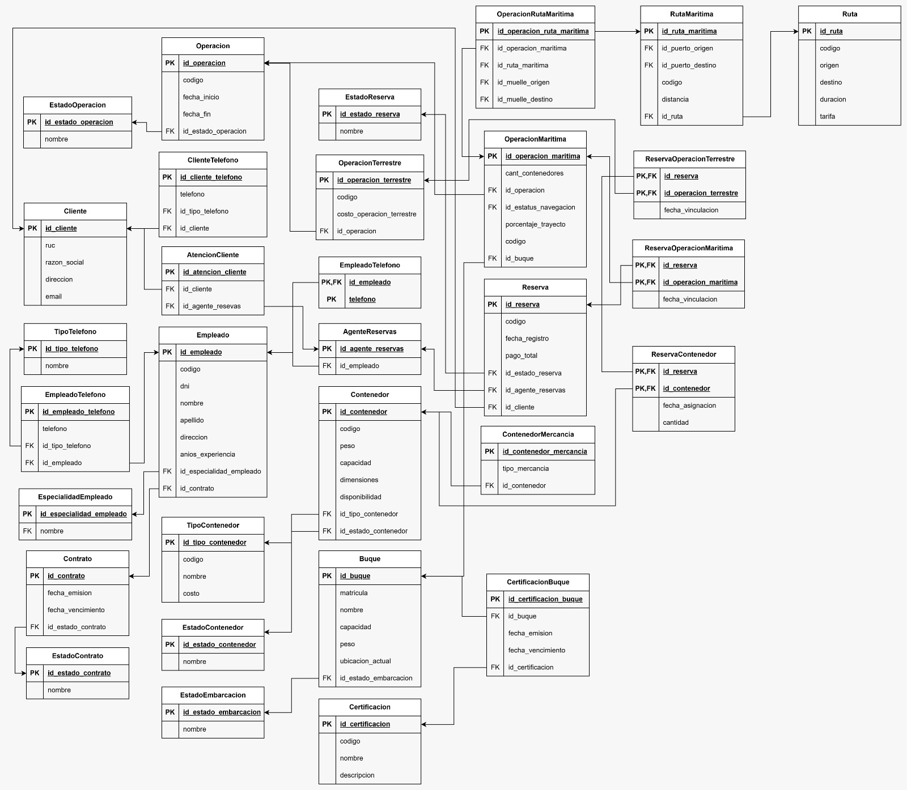

> [5. Diseño Lógico](../5.md) › [5.1. Módulo 1](5.1.md)

# 5.1. Módulo de Gestión de Reservas

### Diagrama Relacional

### Diccionario de Datos

#### Tabla: Cliente
- **Descripción:** Registra la información de los clientes que realizan reservas.  
- **Propósito:** Identificar y almacenar los datos principales de cada cliente.  
- **Reglas de Negocio:**  
  - Cada cliente debe tener un identificador único (RUC).
  - El RUC debe seguir el formato de 11 dígitos.

| **Columna** | **Descripción** | **Propósito** | **Tipo** | **NN** | **UK** | **FK** | **Ejemplo** |
|-------------|-----------------|---------------|----------|--------|--------|--------|-------------|
| id_cliente | Identificador único | PK UUID | CHAR(36) | Sí | Sí | No | 650e8400-e29b-41d4-a716-446655440018 |
| ruc | RUC del cliente | Registro en la SUNAT | CHAR(11) | Sí | Sí | No | 20481234567 |
| razon_social | Razón social del cliente | Identificación | VARCHAR(150) | Sí | No | No | Exportadora SAC |
| direccion | Domicilio fiscal | Ubicación | VARCHAR(200) | Sí | No | No | Av. Colonial 456 |
| email | Correo electrónico | Contacto | VARCHAR(100) | No | No | No | cliente@empresa.com |

**Índices:**
- PRIMARY KEY (id_cliente)
- UNIQUE INDEX uk_ruc (ruc)

---

#### Tabla: ClienteTelefono
- **Descripción:** Números de teléfono asociados a clientes.  
- **Propósito:** Permitir que un cliente tenga múltiples números de contacto.  
- **Reglas de Negocio:**  
  - Un cliente puede tener cero o más teléfonos.
  - Un número de teléfono no puede repetirse para el mismo cliente.

| **Columna** | **Descripción** | **Propósito** | **Tipo** | **NN** | **UK** | **FK** | **Ejemplo** |
|-------------|-----------------|---------------|----------|--------|--------|--------|-------------|
| id_cliente_telefono | Identificador único | PK UUID | CHAR(36) | Sí | Sí | No | 850e8400-e29b-41d4-a716-446655440020 |
| id_cliente | Referencia al cliente | Relación | CHAR(36) | Sí | No | Sí | 550e8400-e29b-41d4-a716-446655440017 |
| telefono | Número de teléfono | Contacto | VARCHAR(20) | Sí | No | No | 987654321 |
| id_tipo_telefono | Tipo de teléfono | Clasificación | CHAR(36) | No | No | Sí | 950e8400-e29b-41d4-a716-446655440021 |

**Índices:**
- PRIMARY KEY (id_cliente_telefono)
- FOREIGN KEY (id_cliente) REFERENCES Cliente(id_cliente)
- FOREIGN KEY (id_tipo_telefono) REFERENCES TipoTelefono(id_tipo_telefono)

---

#### Tabla: Empleado
- **Descripción:** Persona que trabaja en la empresa de logística.  
- **Propósito:** Gestionar el personal y sus roles en las operaciones del sistema.  
- **Reglas de Negocio:**  
  - Cada empleado debe tener un código único.
  - El DNI debe ser único en el sistema.
  - Cada empleado debe tener un contrato asociado.

| **Columna** | **Descripción** | **Propósito** | **Tipo** | **NN** | **UK** | **FK** | **Ejemplo** |
|-------------|-----------------|---------------|----------|--------|--------|--------|-------------|
| id_empleado | Identificador único del empleado | PK UUID | CHAR(36) | Sí | Sí | No | a50e8400-e29b-41d4-a716-446655440021 |
| codigo | Código del empleado | Identificación | VARCHAR(20) | Sí | Sí | No | EMP-001 |
| dni | Documento de identidad | Identificación legal | CHAR(8) | Sí | Sí | No | 87654321 |
| nombre | Nombre del empleado | Identificación | VARCHAR(100) | Sí | No | No | Juan |
| apellido | Apellido del empleado | Identificación | VARCHAR(100) | Sí | No | No | Pérez |
| direccion | Dirección de residencia | Ubicación | VARCHAR(200) | No | No | No | Av. Marina 123 |
| id_especialidad | Especialidad del empleado | Clasificación | CHAR(36) | Sí | No | Sí | b50e8400-e29b-41d4-a716-446655440022 |
| anios_experiencia | Años de experiencia laboral | Evaluación | INT | No | No | No | 5 |
| id_contrato | Contrato laboral del empleado | Relación laboral | CHAR(36) | Sí | Sí | Sí | c50e8400-e29b-41d4-a716-446655440023 |

**Índices:**
- PRIMARY KEY (id_empleado)
- UNIQUE KEY uk_codigo (codigo)
- UNIQUE KEY uk_dni (dni)
- UNIQUE KEY uk_contrato (id_contrato)
- FOREIGN KEY (id_especialidad) REFERENCES Especialidad(id_especialidad)
- FOREIGN KEY (id_contrato) REFERENCES Contrato(id_contrato)

---

#### Tabla: Contrato
- **Descripción:** Acuerdo formal entre las partes para la prestación de servicios logísticos.  
- **Propósito:** Gestionar los contratos comerciales y sus condiciones.  
- **Reglas de Negocio:**  
  - Cada contrato debe tener un código único.
  - Un contrato debe tener una fecha de emisión y vencimiento.
  - El estado del contrato determina su validez operativa.

| **Columna** | **Descripción** | **Propósito** | **Tipo** | **NN** | **UK** | **FK** | **Ejemplo** |
|-------------|-----------------|---------------|----------|--------|--------|--------|-------------|
| id_contrato | Identificador único del contrato | PK UUID | CHAR(36) | Sí | Sí | No | 150e8400-e29b-41d4-a716-446655440044 |
| fecha_emision | Fecha de creación del contrato | Registro temporal | DATE | Sí | No | No | 2025-01-15 |
| fecha_vencimiento | Fecha de finalización del contrato | Control temporal | DATE | Sí | No | No | 2026-01-15 |
| id_estado_contrato | Estado actual del contrato | Seguimiento | CHAR(36) | Sí | No | Sí | 250e8400-e29b-41d4-a716-446655440045 |

**Índices:**
- PRIMARY KEY (id_contrato)
- FOREIGN KEY (id_estado_contrato) REFERENCES EstadoContrato(id_estado_contrato)

---

#### Tabla: EstadoContrato
- **Descripción:** Catálogo de estados posibles para contratos.  
- **Propósito:** Normalizar el estado de los contratos.

| **Columna** | **Descripción** | **Propósito** | **Tipo** | **NN** | **UK** | **FK** | **Ejemplo** |
|-------------|-----------------|---------------|----------|--------|--------|--------|-------------|
| id_estado_contrato | Identificador único | PK UUID | CHAR(36) | Sí | Sí | No | 550e8400-e29b-41d4-a716-446655440017 |
| nombre | Nombre del estado | Clasificación | VARCHAR(50) | Sí | No | No | Vigente |

**Índices:**
- PRIMARY KEY (id_estado_contrato)

---

#### Tabla: EspecialidadEmpleado
- **Descripción:** Catálogo de roles operativos para empleados.  
- **Propósito:** Clasificar empleados según su función.

| **Columna** | **Descripción** | **Propósito** | **Tipo** | **NN** | **UK** | **FK** | **Ejemplo** |
|-------------|-----------------|---------------|----------|--------|--------|--------|-------------|
| id_especialidad_empleado | Identificador único | PK UUID | CHAR(36) | Sí | Sí | No | 650e8400-e29b-41d4-a716-446655440018 |
| nombre | Nombre del rol | Clasificación | VARCHAR(50) | Sí | No | No | Supervisor |

**Índices:**
- PRIMARY KEY (id_especialidad_empleado)

---

#### Tabla: EmpleadoTelefono
- **Descripción:** Números de teléfono asociados a empleados.  
- **Propósito:** Permitir que un empleado tenga múltiples números de contacto.  
- **Reglas de Negocio:**  
  - Un empleado puede tener cero o más teléfonos.

| **Columna** | **Descripción** | **Propósito** | **Tipo** | **NN** | **UK** | **FK** | **Ejemplo** |
|-------------|-----------------|---------------|----------|--------|--------|--------|-------------|
| id_empleado_telefono | Identificador único | PK UUID | CHAR(36) | Sí | Sí | No | 850e8400-e29b-41d4-a716-446655440020 |
| id_empleado | Referencia al empleado | Relación | CHAR(36) | Sí | No | Sí | 550e8400-e29b-41d4-a716-446655440017 |
| telefono | Número de teléfono | Contacto | VARCHAR(20) | Sí | No | No | 987654321 |
| id_tipo_telefono | Tipo de teléfono | Clasificación | CHAR(36) | No | No | Sí | 950e8400-e29b-41d4-a716-446655440021 |

**Índices:**
- PRIMARY KEY (id_empleado_telefono)
- UNIQUE KEY uk_empleado_telefono (id_empleado, telefono)
- FOREIGN KEY (id_empleado) REFERENCES Empleado(id_empleado)
- FOREIGN KEY (id_tipo_telefono) REFERENCES TipoTelefono(id_tipo_telefono)

---

#### Tabla: TipoTelefono
- **Descripción:** Catálogo de estados posibles para lineas moviles de telefono.
- **Propósito:** Normalizar el estado de los tipos de linea de telefono.

| **Columna** | **Descripción** | **Propósito** | **Tipo** | **NN** | **UK** | **FK** | **Ejemplo** |
|-------------|-----------------|---------------|----------|--------|--------|--------|-------------|
| id_tipo_telefono | Identificador único | PK UUID | CHAR(36) | Sí | Sí | No | 550e8400-e29b-41d4-a716-446655440017 |
| nombre | Nombre del estado | Clasificación | VARCHAR(50) | Sí | No | No | Fijo |

**Índices:**
- PRIMARY KEY (id_tipo_telefono)

---

#### Tabla: AtencionCliente
- **Descripción:** Atención al cliente.
- **Propósito:** Permitir la comunicación entre cliente y Agente de Reserva.

| **Columna** | **Descripción** | **Propósito** | **Tipo** | **NN** | **UK** | **FK** | **Ejemplo** |
|-------------|-----------------|---------------|----------|--------|--------|--------|-------------|
| id_atencion_cliente | Identificador único | PK UUID | CHAR(36) | Sí | Sí | No | 550e8400-e29b-41d4-a716-446655440017 |
| id_cliente | Identificador único | PK UUID | CHAR(36) | Sí | Sí | No | 650e8400-e29b-41d4-a716-446655440018 |

**Índices:**
- PRIMARY KEY (id_atencion_cliente)
- FOREIGN KEY (id_cliente) REFERENCES Cliente(id_cliente)
- FOREIGN KEY (id_agente_reservas) REFERENCES AgenteReservas(id_agente_reservas)

---
#### Tabla: AgenteReservas
- **Descripción:** Empleados especializados en gestionar reservas.
- **Propósito:** Identificar agentes responsables de cada reserva.
- **Reglas de Negocio:**
  - Un agente debe estar registrado como empleado.
  - Hereda todos los atributos de Empleado.

| **Columna** | **Descripción** | **Propósito** | **Tipo** | **NN** | **UK** | **FK** | **Ejemplo** |
|-------------|-----------------|---------------|----------|--------|--------|--------|-------------|
| id_agente_reservas | Identificador único | PK UUID | CHAR(36) | Sí | Sí | No | 550e8400-e29b-41d4-a716-446655440017 |
| id_empleado | Identificador único del empleado | PK UUID | CHAR(36) | Sí | Sí | No | a50e8400-e29b-41d4-a716-446655440021 |

**Índices:**
- PRIMARY KEY (id_agente_reservas)
- UNIQUE KEY uk_empleado (id_empleado)
- FOREIGN KEY (id_empleado) REFERENCES Empleado(id_empleado)

---

#### Tabla: Contenedor
- **Descripción:** Unidad estandarizada de transporte de mercancías.  
- **Propósito:** Gestionar los contenedores disponibles y su estado.  
- **Reglas de Negocio:**  
  - Cada contenedor debe tener un código único.
  - Debe tener un tipo de contenedor asociado.

| **Columna** | **Descripción** | **Propósito** | **Tipo** | **NN** | **UK** | **FK** | **Ejemplo** |
|-------------|-----------------|---------------|----------|--------|--------|--------|-------------|
| id_contenedor | Identificador único contenedor | PK UUID | CHAR(36) | Sí | Sí | No | e50e8400-e29b-41d4-a716-446655440026 |
| codigo | Código del contenedor | Identificación | VARCHAR(20) | Sí | Sí | No | CONT-123 |
| peso | Peso actual en kg | Control | DECIMAL(10,2) | Sí | No | No | 2500.00 |
| capacidad | Capacidad máxima | Control | DECIMAL(10,2) | Sí | No | No | 33500.00 |
| dimensiones | Dimensiones físicas | Especificación | VARCHAR(50) | Sí | No | No | 20x8x8.5 |
| id_estado_contenedor | Estado del contenedor | Seguimiento | CHAR(36) | Sí | No | Sí | f50e8400-e29b-41d4-a716-446655440027 |
| id_tipo_contenedor | Tipo de contenedor | Clasificación | CHAR(36) | Sí | No | Sí | g50e8400-e29b-41d4-a716-446655440028 |

**Índices:**
- PRIMARY KEY (id_contenedor)
- UNIQUE KEY uk_codigo (codigo)
- FOREIGN KEY (id_estado_contenedor) REFERENCES EstadoContenedor(id_estado_contenedor)
- FOREIGN KEY (id_tipo_contenedor) REFERENCES TipoContenedor(id_tipo_contenedor)

---

#### Tabla: EstadoContenedor
- **Descripción:** Catálogo de estados de contenedores.  
- **Propósito:** Normalizar el estado de los contenedores.

| **Columna** | **Descripción** | **Propósito** | **Tipo** | **NN** | **UK** | **FK** | **Ejemplo** |
|-------------|-----------------|---------------|----------|--------|--------|--------|-------------|
| id_estado_contenedor | Identificador único | PK UUID | CHAR(36) | Sí | Sí | No | f50e8400-e29b-41d4-a716-446655440027 |
| nombre | Nombre del estado | Clasificación | VARCHAR(50) | Sí | No | No | Disponible |

**Índices:**
- PRIMARY KEY (id_estado_contenedor)

---

#### Tabla: ContenedorMercancia
- **Descripción:** Tipos de mercancía contenida en cada contenedor.  
- **Propósito:** Registrar qué mercancías puede o está transportando un contenedor.  
- **Reglas de Negocio:**  
  - Un contenedor puede transportar múltiples tipos de mercancía.

| **Columna** | **Descripción** | **Propósito** | **Tipo** | **NN** | **UK** | **FK** | **Ejemplo** |
|-------------|-----------------|---------------|----------|--------|--------|--------|-------------|
| id_contenedor_mercancia | Identificador único | PK UUID | CHAR(36) | Sí | Sí | No | 350e8400-e29b-41d4-a716-446655440046 |
| id_contenedor | Referencia al contenedor | Relación | CHAR(36) | Sí | No | Sí | e50e8400-e29b-41d4-a716-446655440009 |
| tipo_mercancia | Tipo de mercancía | Clasificación | VARCHAR(100) | Sí | No | No | Electrónicos |

**Índices:**
- PRIMARY KEY (id_contenedor_mercancia)
- UNIQUE KEY uk_contenedor_mercancia (id_contenedor, tipo_mercancia)
- FOREIGN KEY (id_contenedor) REFERENCES Contenedor(id_contenedor)

---

#### Tabla: TipoContenedor
- **Descripción:** Catálogo de tipos de contenedores disponibles.  
- **Propósito:** Clasificar contenedores según características.

| **Columna** | **Descripción** | **Propósito** | **Tipo** | **NN** | **UK** | **FK** | **Ejemplo** |
|-------------|-----------------|---------------|----------|--------|--------|--------|-------------|
| id_tipo_contenedor | Identificador único | PK UUID | CHAR(36) | Sí | Sí | No | 550e8400-e29b-41d4-a716-446655440007 |
| codigo | Código del tipo | Identificación | VARCHAR(20) | Sí | Sí | No | T-001 |
| nombre | Nombre del tipo | Clasificación | VARCHAR(50) | Sí | No | No | Refrigerado |
| costo | Costo asociado | Financiero | DECIMAL(10,2) | Sí | No | No | 3500.50 |

**Índices:**
- PRIMARY KEY (id_tipo_contenedor)
- UNIQUE KEY uk_codigo (codigo)

---

#### Tabla: Buque
- **Descripción:** Embarcación de transporte marítimo que transporta contenedores y tripulación.  
- **Propósito:** Registrar la información de las embarcaciones utilizadas en operaciones marítimas.  
- **Reglas de Negocio:**  
  - La matrícula debe ser única.
  - Un buque puede ser utilizado en múltiples operaciones.

| **Columna** | **Descripción** | **Propósito** | **Tipo** | **NN** | **UK** | **FK** | **Ejemplo** |
|-------------|-----------------|---------------|----------|--------|--------|--------|-------------|
| id_buque | Identificador único | PK UUID | CHAR(36) | Sí | Sí | No | c50e8400-e29b-41d4-a716-446655440007 |
| matricula | Matrícula del buque | Identificación | VARCHAR(20) | Sí | Sí | No | IMO-9347438 |
| nombre | Nombre del buque | Identificación | VARCHAR(100) | Sí | No | No | Hapag Spirit |
| capacidad | Capacidad de carga en TEU | Control | INT | Sí | No | No | 12000 |
| id_estado_embarcacion | Estado operativo | Seguimiento | CHAR(36) | Sí | No | Sí | d50e8400-e29b-41d4-a716-446655440008 |
| peso | Peso máximo en toneladas | Especificación | DECIMAL(15,2) | Sí | No | No | 150000.00 |
| ubicacion_actual | Posición GPS actual | Monitoreo | VARCHAR(100) | No | No | No | 8.9824 N, 79.5199 W |

**Índices:**
- PRIMARY KEY (id_buque)
- UNIQUE KEY uk_matricula (matricula)
- FOREIGN KEY (id_estado_embarcacion) REFERENCES EstadoEmbarcacion(id_estado_embarcacion)
---

#### Tabla: EstadoEmbarcacion
- **Descripción:** Catálogo de estados operativos de embarcaciones.  
- **Propósito:** Normalizar el estado de los buques.

| **Columna** | **Descripción** | **Propósito** | **Tipo** | **NN** | **UK** | **FK** | **Ejemplo** |
|-------------|-----------------|---------------|----------|--------|--------|--------|-------------|
| id_estado_embarcacion | Identificador único | PK artificial | INT | Sí | Sí | No | 1 |
| nombre | Nombre del estado | Clasificación | VARCHAR(50) | Sí | No | No | Disponible |

**Índices:**
- PRIMARY KEY (id_estado_embarcacion)

---

#### Tabla: Certificacion
- **Descripción:** Certificaciones técnicas y profesionales.  
- **Propósito:** Control de validez de certificaciones requeridas para personal y activos.  
- **Reglas de Negocio:**  
  - Cada certificación debe tener un identificador único.
  - Aplica a empleados y buques.

| **Columna** | **Descripción** | **Propósito** | **Tipo** | **NN** | **UK** | **FK** | **Ejemplo** |
|-------------|-----------------|---------------|----------|--------|--------|--------|-------------|
| id_certificacion | Identificador único | PK UUID | CHAR(36) | Sí | Sí | No | 050e8400-e29b-41d4-a716-446655440027 |
| nombre | Nombre de la certificación | Identificación | VARCHAR(100) | Sí | No | No | STCW Basic Safety |
| descripcion | Descripción detallada | Especificación | TEXT | No | No | No | Certificación básica de seguridad marítima |
| duracion_anios | Duración de validez en años | Control | INT | No | No | No | 5 |

**Índices:**
- PRIMARY KEY (id_certificacion)

---

#### Tabla: CertificacionBuque
- **Descripción:** Certificaciones asignadas a buques.  
- **Propósito:** Controlar validez de certificaciones de cada buque.  
- **Reglas de Negocio:**  
  - Un buque puede tener múltiples certificaciones.

| **Columna** | **Descripción** | **Propósito** | **Tipo** | **NN** | **UK** | **FK** | **Ejemplo** |
|-------------|-----------------|---------------|----------|--------|--------|--------|-------------|
| id_certificacion_buque | Identificador único | PK UUID | CHAR(36) | Sí | Sí | No | 950e8400-e29b-41d4-a716-446655440036 |
| id_buque | Referencia a buque | Relación | VARCHAR(20) | Sí | No | Sí | IMO-9347438 |
| id_certificacion | Referencia a certificación | Relación | CHAR(36) | Sí | No | Sí | 050e8400-e29b-41d4-a716-446655440027 |
| fecha_emision | Fecha de emisión | Control | DATE | Sí | No | No | 2024-01-15 |
| fecha_vencimiento | Fecha de vencimiento | Control | DATE | Sí | No | No | 2029-01-15 |

**Índices:**
- PRIMARY KEY (id_certificacion_buque)
- UNIQUE KEY uk_buque_cert (id_buque, id_certificacion)
- FOREIGN KEY (id_buque) REFERENCES Buque(id_buque)
- FOREIGN KEY (id_certificacion) REFERENCES Certificacion(id_certificacion)

---

#### Tabla: Ruta
- **Descripción:** Trayecto predefinido entre un punto de origen y un punto de destino.  
- **Propósito:** Planificar y dar seguimiento a los viajes y traslados.  
- **Reglas de Negocio:**  
  - Cada ruta debe tener un código único.
  - Se especializa en: Ruta Marítima y Ruta Terrestre.

| **Columna** | **Descripción** | **Propósito** | **Tipo** | **NN** | **UK** | **FK** | **Ejemplo** |
|-------------|-----------------|---------------|----------|--------|--------|--------|-------------|
| id_ruta | Identificador único | PK UUID | CHAR(36) | Sí | Sí | No | 250e8400-e29b-41d4-a716-446655440029 |
| codigo | Código de ruta | Identificación | VARCHAR(20) | Sí | Sí | No | RUT-001 |
| origen | Lugar de origen | Logística | VARCHAR(100) | Sí | No | No | Callao |
| destino | Lugar de destino | Logística | VARCHAR(100) | Sí | No | No | Hamburgo |
| duracion | Duración en días | Planificación | INT | Sí | No | No | 25 |
| tarifa | Tarifa base | Financiero | DECIMAL(10,2) | Sí | No | No | 5000.00 |

**Índices:**
- PRIMARY KEY (id_ruta)
- UNIQUE KEY uk_codigo (codigo)

---

#### Tabla: Operacion
- **Descripción:** Registro general de cualquier actividad logística realizada en el sistema.  
- **Propósito:** Servir como entidad base para todas las operaciones especializadas del sistema.  
- **Reglas de Negocio:**  
  - Cada operación debe tener un código único.
  - Toda operación debe tener una fecha de inicio y un estado.
  - Se especializa en: Operación Terrestre, Operación Marítima, Operación Portuaria, Operación Mantenimiento, Operación Monitoreo y Operación Embarque.

| **Columna** | **Descripción** | **Propósito** | **Tipo** | **NN** | **UK** | **FK** | **Ejemplo** |
|-------------|-----------------|---------------|----------|--------|--------|--------|-------------|
| id_operacion | Identificador único | PK UUID | CHAR(36) | Sí | Sí | No | 550e8400-e29b-41d4-a716-446655440005 |
| codigo | Código de operación | Identificación | VARCHAR(20) | Sí | Sí | No | OP-2025-001 |
| fecha_inicio | Fecha de inicio | Control temporal | DATETIME | Sí | No | No | 2025-09-27 14:30:00 |
| fecha_fin | Fecha de finalización | Control temporal | DATETIME | No | No | No | 2025-09-30 18:00:00 |
| id_estado_operacion | Estado actual | Seguimiento | CHAR(36) | Sí | No | Sí | 550e8400-e29b-41d4-a716-446655440009 |

**Índices:**
- PRIMARY KEY (id_operacion)
- UNIQUE KEY uk_codigo (codigo)
- FOREIGN KEY (id_estado_operacion) REFERENCES EstadoOperacion(id_estado_operacion)

---

#### Tabla: EstadoOperacion
- **Descripción:** Catálogo de estados posibles para operaciones.  
- **Propósito:** Normalizar el estado de las operaciones.

| **Columna** | **Descripción** | **Propósito** | **Tipo** | **NN** | **UK** | **FK** | **Ejemplo** |
|-------------|-----------------|---------------|----------|--------|--------|--------|-------------|
| id_estado_operacion | Identificador único | PK UUID | CHAR(36) | Sí | Sí | No | 550e8400-e29b-41d4-a716-446655440000 |
| nombre | Nombre del estado | Clasificación | VARCHAR(50) | Sí | No | No | En curso |

**Índices:**
- PRIMARY KEY (id_estado_operacion)

---

#### Tabla: OperacionTerrestre
- **Descripción:** Operación logística especializada en transporte terrestre.  
- **Propósito:** Gestionar operaciones de transporte por carretera.  
- **Reglas de Negocio:**  
  - Hereda todos los atributos de Operación.  
  - Requiere vehículo, ruta terrestre y conductor asignados.  

| **Columna** | **Descripción** | **Propósito** | **Tipo** | **NN** | **UK** | **FK** | **Ejemplo** |
|-------------|-----------------|---------------|----------|--------|--------|--------|-------------|
| id_operacion_terrestre | Identificador único | PK UUID | CHAR(36) | Sí | Sí | No | b7e2c8b4-3d61-4e99-9d0f-1a2b3c4d5e6f |
| id_operacion | Referencia a operación | Herencia | CHAR(36) | Sí | Sí | Sí | 8a1f2c3d-4b5e-678f-9012-3a4b5c6d7e8f |
| codigo | Código de operación terrestre | Identificación | VARCHAR(20) | Sí | Sí | No | OT-2025-001 |
| costo_operacion_terrestre | Costo del transporte | Financiero | DECIMAL(10,2) | Sí | No | No | 1200.50 |

**Índices:**  
- PRIMARY KEY (id_operacion_terrestre)  
- UNIQUE KEY uk_operacion (id_operacion)  
- UNIQUE KEY uk_codigo (codigo)  
- FOREIGN KEY (id_operacion) REFERENCES Operacion(id_operacion)

---

#### Tabla: Reserva
- **Descripción:** Registro principal de reservas realizadas por los clientes.  
- **Propósito:** Controlar las reservas de espacios y transporte.  
- **Reglas de Negocio:**  
  - Una reserva debe estar asociada a un cliente.  
  - Puede asignarse a múltiples contenedores mediante tabla intermedia.  

| **Columna** | **Descripción** | **Propósito** | **Tipo** | **NN** | **UK** | **FK** | **Ejemplo** |
|-------------|-----------------|---------------|----------|--------|--------|--------|-------------|
| id_reserva | Identificador único de reserva | PK UUID | CHAR(36) | Sí | Sí | No | f2c3b8a4-4d61-4e99-9d0f-2a3b4c5d6e7f |
| codigo | Código de reserva | Identificación | VARCHAR(20) | Sí | Sí | No | RES-001 |
| fecha_registro | Fecha de registro de la reserva | Control temporal | DATE | Sí | No | No | 2024-09-20 |
| id_estado_reserva | Estado de la reserva | Seguimiento | CHAR(36) | Sí | No | Sí | b8f4a9c1-2e53-44b6-8f90-1c2d3e4f5a6b |
| pago_total | Monto total del servicio | Financiero | DECIMAL(10,2) | No | No | No | 5000.00 |
| ruc_cliente | Cliente que reserva | Relación | CHAR(11) | Sí | No | Sí | 20481234567 |
| id_agente_reservas | Agente que registra | Relación | CHAR(36) | Sí | No | Sí | c1d2e3f4-5a6b-7c8d-9e0f-1a2b3c4d5e6f |
| matricula_buque | Buque asignado | Relación | VARCHAR(20) | Sí | No | Sí | IMO-9347438 |
| id_ruta | Ruta escogida | Relación | CHAR(36) | Sí | No | Sí | d4e5f6a7-b8c9-4d3e-9f0a-2b3c4d5e6f7a |

**Índices:**  
- PRIMARY KEY (id_reserva)  
- UNIQUE KEY uk_codigo (codigo)  
- FOREIGN KEY (id_estado_reserva) REFERENCES EstadoReserva(id_estado_reserva)  
- FOREIGN KEY (ruc_cliente) REFERENCES Cliente(ruc)  
- FOREIGN KEY (id_agente_reservas) REFERENCES AgenteReservas(id_agente_reservas)  
- FOREIGN KEY (matricula_buque) REFERENCES Buque(matricula)  
- FOREIGN KEY (id_ruta) REFERENCES Ruta(id_ruta)  

---

#### Tabla: EstadoReserva
- **Descripción:** Catálogo de estados posibles para reservas.  
- **Propósito:** Normalizar el estado de las reservas.

| **Columna** | **Descripción** | **Propósito** | **Tipo** | **NN** | **UK** | **FK** | **Ejemplo** |
|-------------|-----------------|---------------|----------|--------|--------|--------|-------------|
| id_estado_reserva | Identificador único | PK UUID | CHAR(36) | Sí | Sí | No | 650e8400-e29b-41d4-a716-446655440018 |
| nombre | Nombre del estado | Clasificación | VARCHAR(50) | Sí | No | No | Confirmada |

**Índices:**
- PRIMARY KEY (id_estado_reserva)

---

#### Tabla: ReservaContenedor
- **Descripción:** Relación entre reservas y contenedores asignados.  
- **Propósito:** Permitir que una reserva tenga múltiples contenedores y que un contenedor se reutilice.  
- **Reglas de Negocio:**  
  - Una reserva puede asignar múltiples contenedores.
  - Un contenedor puede ser asignado a múltiples reservas a lo largo del tiempo.

| **Columna** | **Descripción** | **Propósito** | **Tipo** | **NN** | **UK** | **FK** | **Ejemplo** |
|-------------|-----------------|---------------|----------|--------|--------|--------|-------------|
| id_reserva | Referencia a reserva | Relación | CHAR(36) | Sí | No | Sí | f2c3b8a4-4d61-4e99-9d0f-2a3b4c5d6e7f |
| id_contenedor | Referencia a contenedor | Relación | CHAR(36) | Sí | No | Sí | e50e8400-e29b-41d4-a716-446655440026 |
| fecha_asignacion | Fecha de asignación | Control temporal | DATE | Sí | No | No | 2025-01-15 |
| cantidad | Cantidad de contenedores | Control | INT | Sí | No | No | 1 |

**Índices:**
- PRIMARY KEY (id_reserva, id_contenedor)
- FOREIGN KEY (id_reserva) REFERENCES Reserva(id_reserva)
- FOREIGN KEY (id_contenedor) REFERENCES Contenedor(id_contenedor)

---

#### Tabla: ReservaOperacionMaritima
- **Descripción:** Vinculación entre reservas y operaciones marítimas ejecutadas.  
- **Propósito:** Asociar cada reserva con las operaciones de transporte marítimo que la materializan.  
- **Reglas de Negocio:**  
  - Una reserva puede generar múltiples operaciones marítimas.
  - Una operación marítima puede cumplir múltiples reservas (carga consolidada).

| **Columna** | **Descripción** | **Propósito** | **Tipo** | **NN** | **UK** | **FK** | **Ejemplo** |
|-------------|-----------------|---------------|----------|--------|--------|--------|-------------|
| id_reserva | Referencia a reserva | Relación | CHAR(36) | Sí | No | Sí | f2c3b8a4-4d61-4e99-9d0f-2a3b4c5d6e7f |
| id_operacion_maritima | Referencia a operación marítima | Relación | CHAR(36) | Sí | No | Sí | 8a1f2c3d-4b5e-678f-9012-3a4b5c6d7e8f |
| fecha_vinculacion | Fecha de vinculación | Control | DATE | Sí | No | No | 2025-01-10 |

**Índices:**
- PRIMARY KEY (id_reserva, id_operacion_maritima)
- FOREIGN KEY (id_reserva) REFERENCES Reserva(id_reserva)
- FOREIGN KEY (id_operacion_maritima) REFERENCES OperacionMaritima(id_operacion_maritima)
---

#### Tabla: ReservaOperacionTerrestre
- **Descripción:** Vinculación entre reservas y operaciones terrestres ejecutadas.  
- **Propósito:** Asociar cada reserva con operaciones de recogida o entrega terrestre.  
- **Reglas de Negocio:**  
  - Una reserva puede requerir múltiples operaciones terrestres (recogida + entrega).
  - Una operación terrestre puede servir a múltiples reservas (ruta consolidada).

| **Columna** | **Descripción** | **Propósito** | **Tipo** | **NN** | **UK** | **FK** | **Ejemplo** |
|-------------|-----------------|---------------|----------|--------|--------|--------|-------------|
| id_reserva | Referencia a reserva | Relación | CHAR(36) | Sí | No | Sí | f2c3b8a4-4d61-4e99-9d0f-2a3b4c5d6e7f |
| id_operacion_terrestre | Referencia a operación terrestre | Relación | CHAR(36) | Sí | No | Sí | b7e2c8b4-3d61-4e99-9d0f-1a2b3c4d5e6f |
| fecha_vinculacion | Fecha de vinculación | Control | DATE | Sí | No | No | 2025-01-08 |

**Índices:**
- PRIMARY KEY (id_reserva, id_operacion_terrestre)
- FOREIGN KEY (id_reserva) REFERENCES Reserva(id_reserva)
- FOREIGN KEY (id_operacion_terrestre) REFERENCES OperacionTerrestre(id_operacion_terrestre)

---

[🏠 Home](../../README.md) | [Siguiente ➡️](../5.2/5.2.md)