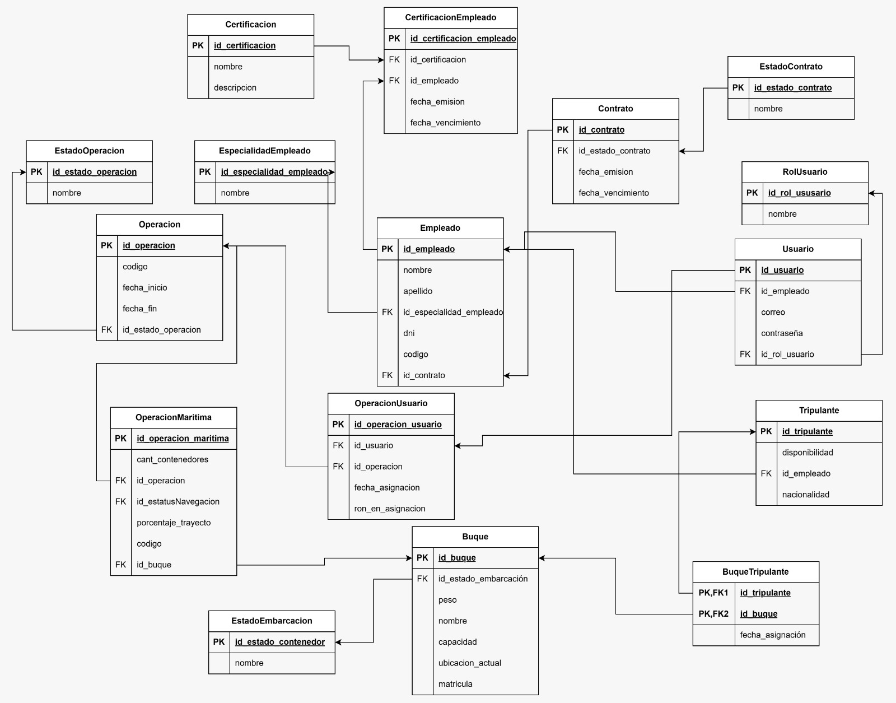

> [5. Diseño Lógico](../5.md) › [5.2. Módulo 1](5.2.md)

# 5.2. Módulo de Gestión del Personal y Tripulación 

### Diagrama Relacional

### Diccionario de datos

#### Tabla: Empleado
- **Descripción:** Persona que trabaja en la empresa de logística.  
- **Propósito:** Gestionar el personal y sus roles en las operaciones del sistema.  
- **Reglas de Negocio:**  
  - Cada empleado debe tener un código único.
  - El DNI debe ser único en el sistema.
  - Cada empleado debe tener un contrato asociado.

| **Columna** | **Descripción** | **Propósito** | **Tipo** | **NN** | **UK** | **FK** | **Ejemplo** |
|-------------|-----------------|---------------|----------|--------|--------|--------|-------------|
| id_empleado | Identificador único del empleado | PK UUID | CHAR(36) | Sí | Sí | No | a50e8400-e29b-41d4-a716-446655440021 |
| codigo | Código del empleado | Identificación | VARCHAR(20) | Sí | Sí | No | EMP-001 |
| dni | Documento de identidad | Identificación legal | CHAR(8) | Sí | Sí | No | 87654321 |
| nombre | Nombre del empleado | Identificación | VARCHAR(100) | Sí | No | No | Juan |
| apellido | Apellido del empleado | Identificación | VARCHAR(100) | Sí | No | No | Pérez |
| direccion | Dirección de residencia | Ubicación | VARCHAR(200) | No | No | No | Av. Marina 123 |
| id_especialidad_empleado | Especialidad del empleado | Clasificación | CHAR(36) | Sí | No | Sí | b50e8400-e29b-41d4-a716-446655440022 |
| id_contrato | Contrato laboral del empleado | Relación laboral | CHAR(36) | Sí | Sí | Sí | c50e8400-e29b-41d4-a716-446655440023 |

**Índices:**
- PRIMARY KEY (id_empleado)
- UNIQUE KEY uk_codigo (codigo)
- UNIQUE KEY uk_dni (dni)
- UNIQUE KEY uk_contrato (id_contrato)
- FOREIGN KEY (id_especialidad_empleado) REFERENCES Especialidad(id_especialidad_empleado)
- FOREIGN KEY (id_contrato) REFERENCES Contrato(id_contrato)

#### Tabla: EspecialidadEmpleado
- **Descripción:** Catálogo de roles operativos para empleados.  
- **Propósito:** Clasificar empleados según su función.

| **Columna** | **Descripción** | **Propósito** | **Tipo** | **NN** | **UK** | **FK** | **Ejemplo** |
|-------------|-----------------|---------------|----------|--------|--------|--------|-------------|
| id_especialidad_empleado | Identificador único | PK UUID | CHAR(36) | Sí | Sí | No | 550e8400-e29b-41d4-a716-446655440006 |
| nombre | Nombre del rol | Clasificación | VARCHAR(50) | Sí | No | No | Supervisor |

**Índices:**
- PRIMARY KEY (id_especialidad_empleado)

**Valores típicos:**
- Supervisor
- Operario
- Administrativo
- Técnico
- Gerente

#### Tabla: Usuario
- **Descripción:** Individuo con acceso al sistema y rol específico.  
- **Propósito:** Autenticar usuarios y asignarles roles para tareas específicas.  
- **Reglas de Negocio:**  
  - Cada usuario debe estar asociado a un empleado.
  - El correo electrónico debe ser único.

| **Columna** | **Descripción** | **Propósito** | **Tipo** | **NN** | **UK** | **FK** | **Ejemplo** |
|-------------|-----------------|---------------|----------|--------|--------|--------|-------------|
| id_usuario | Identificador único | PK UUID | CHAR(36) | Sí | Sí | No | 750e8400-e29b-41d4-a716-446655440018 |
| correo_electronico | Email de acceso | Autenticación | VARCHAR(100) | Sí | Sí | No | juan.perez@empresa.com |
| contrasena | Contraseña cifrada | Seguridad | VARCHAR(255) | Sí | No | No | $2y$10$... |
| id_rol_usuario | Rol asignado | Control de permisos | CHAR(36) | Sí | No | Sí | 850e8400-e29b-41d4-a716-446655440019 |
| id_empleado | Identificador | FK artificial | CHAR(36) | Sí | No | Sí | 950e8400-e29b-41d4-a716-446655440020 |

**Índices:**
- PRIMARY KEY (id_usuario)
- UNIQUE KEY uk_correo (correo_electronico)
- FOREIGN KEY (id_rol_usuario) REFERENCES RolUsuario(id_rol_usuario)
- FOREIGN KEY (id_empleado) REFERENCES Empleado(id_empleado)

----

#### Tabla: RolUsuario
- **Descripción:** Catálogo de roles para usuarios del sistema.  
- **Propósito:** Definir permisos y responsabilidades.

| **Columna** | **Descripción** | **Propósito** | **Tipo** | **NN** | **UK** | **FK** | **Ejemplo** |
|-------------|-----------------|---------------|----------|--------|--------|--------|-------------|
| id_rol_usuario | Identificador único | PK UUID | CHAR(36) | Sí | Sí | No | 550e8400-e29b-41d4-a716-446655440005 |
| nombre | Nombre del rol | Clasificación | VARCHAR(50) | Sí | No | No | Administrador |

**Índices:**
- PRIMARY KEY (id_rol_usuario)

**Valores típicos:**
- Administrador
- Inspector
- Coordinador
- Operador
- Consultor

----

#### Tabla: Operacion
- **Descripción:** Registro general de cualquier actividad logística realizada en el sistema.  
- **Propósito:** Servir como entidad base para todas las operaciones especializadas del sistema.  
- **Reglas de Negocio:**  
  - Cada operación debe tener un código único.
  - Toda operación debe tener una fecha de inicio y un estado.
  - Se especializa en: Operación Terrestre, Operación Marítima, Operación Portuaria, Operación Mantenimiento, Operación Monitoreo y Operación Embarque.

| **Columna** | **Descripción** | **Propósito** | **Tipo** | **NN** | **UK** | **FK** | **Ejemplo** |
|-------------|-----------------|---------------|----------|--------|--------|--------|-------------|
| id_operacion | Identificador único | PK UUID | CHAR(36) | Sí | Sí | No | 550e8400-e29b-41d4-a716-446655440005 |
| codigo | Código de operación | Identificación | VARCHAR(20) | Sí | Sí | No | OP-2025-001 |
| fecha_inicio | Fecha de inicio | Control temporal | DATETIME | Sí | No | No | 2025-09-27 14:30:00 |
| fecha_fin | Fecha de finalización | Control temporal | DATETIME | No | No | No | 2025-09-30 18:00:00 |
| id_estado_operacion | Estado actual | Seguimiento | CHAR(36) | Sí | No | Sí | 550e8400-e29b-41d4-a716-446655440009 |

**Índices:**
- PRIMARY KEY (id_operacion)
- UNIQUE KEY uk_codigo (codigo)
- FOREIGN KEY (id_estado_operacion) REFERENCES EstadoOperacion(id_estado_operacion)

---

#### Tabla: OperacionMaritima
- **Descripción:** Operación especializada en el traslado marítimo entre puertos.  
- **Propósito:** Representar operaciones de transporte marítimo de contenedores.  
- **Reglas de Negocio:**  
  - Hereda todos los atributos de Operación.
  - Debe seguir una ruta marítima y utilizar un buque.

| **Columna** | **Descripción** | **Propósito** | **Tipo** | **NN** | **UK** | **FK** | **Ejemplo** |
|-------------|-----------------|---------------|----------|--------|--------|--------|-------------|
| id_operacion_maritima | Identificador único | PK UUID | CHAR(36) | Sí | Sí | No | 650e8400-e29b-41d4-a716-446655440001 |
| id_operacion | Referencia a operación | Herencia | CHAR(36) | Sí | Sí | Sí | 550e8400-e29b-41d4-a716-446655440005 |
| codigo | Código de operación marítima | Identificación | VARCHAR(20) | Sí | Sí | No | OPM-2025-001 |
| cantidad_contenedores | Número de contenedores | Control logístico | INT | Sí | No | No | 350 |
| id_estatus_navegacion | Estado de navegación | Seguimiento | CHAR(36) | Sí | No | Sí | 750e8400-e29b-41d4-a716-446655440002 |
| porcentaje_trayecto | Progreso de la operación | Monitoreo | DECIMAL(5,2) | Sí | No | No | 72.5 |
| id_buque | Referencia a buque | Relación | CHAR(36) | Sí | No | Sí | c60e8400-e29b-41d4-a716-446655440050 |

**Índices:**
- PRIMARY KEY (id_operacion_maritima)
- FOREIGN KEY (id_operacion) REFERENCES Operacion(id_operacion)
- FOREIGN KEY (id_buque) REFERENCES Buque(id_buque)

#### Tabla: UsuarioOperacion
- **Descripción:** Gestión de operaciones por usuarios del sistema.  
- **Propósito:** Controlar qué usuarios gestionan cada operación.  
- **Reglas de Negocio:**  
  - Un usuario puede gestionar múltiples operaciones.

| **Columna** | **Descripción** | **Propósito** | **Tipo** | **NN** | **UK** | **FK** | **Ejemplo** |
|-------------|-----------------|---------------|----------|--------|--------|--------|-------------|
| id_usuario_operacion | Identificador único | PK UUID | CHAR(36) | Sí | Sí | No | d50e8400-e29b-41d4-a716-446655440056 |
| id_usuario | Referencia a usuario | Relación | CHAR(36) | Sí | No | Sí | 750e8400-e29b-41d4-a716-446655440018 |
| id_operacion | Referencia a operación | Relación | CHAR(36) | Sí | No | Sí | 550e8400-e29b-41d4-a716-446655440005 |
| fecha_asignacion | Fecha de asignación | Control | DATE | Sí | No | No | 2025-01-05 |
| rol_en_operacion | Rol del usuario | Especificación | VARCHAR(50) | No | No | No | Coordinador |

**Índices:**
- PRIMARY KEY (id_usuario_operacion)
- UNIQUE KEY uk_usuario_operacion (id_usuario, id_operacion)
- FOREIGN KEY (id_usuario) REFERENCES Usuario(id_usuario)
- FOREIGN KEY (id_operacion) REFERENCES Operacion(id_operacion)

#### Tabla: EstadoOperacion
- **Descripción:** Catálogo de estados posibles para operaciones.  
- **Propósito:** Normalizar el estado de las operaciones.

| **Columna** | **Descripción** | **Propósito** | **Tipo** | **NN** | **UK** | **FK** | **Ejemplo** |
|-------------|-----------------|---------------|----------|--------|--------|--------|-------------|
| id_estado_operacion | Identificador único | PK UUID | CHAR(36) | Sí | Sí | No | 550e8400-e29b-41d4-a716-446655440000 |
| nombre | Nombre del estado | Clasificación | VARCHAR(50) | Sí | No | No | En curso |

**Índices:**
- PRIMARY KEY (id_estado_operacion)

**Valores típicos:**
- En curso
- Completada
- Cancelada
- Pendiente

#### Tabla: EstadoEmbarcacion
- **Descripción:** Catálogo de estados operativos de embarcaciones.  
- **Propósito:** Normalizar el estado de los buques.

| **Columna** | **Descripción** | **Propósito** | **Tipo** | **NN** | **UK** | **FK** | **Ejemplo** |
|-------------|-----------------|---------------|----------|--------|--------|--------|-------------|
| id_estado_embarcacion | Identificador único | PK UUID | CHAR(36) | Sí | Sí | No | 550e8400-e29b-41d4-a716-446655440001 |
| nombre | Nombre del estado | Clasificación | VARCHAR(50) | Sí | No | No | Disponible |

**Índices:**
- PRIMARY KEY (id_estado_embarcacion)

**Valores típicos:**
- Disponible
- En operación
- Mantenimiento
- Fuera de servicio

---

#### Tabla: Buque
- **Descripción:** Embarcación de transporte marítimo que transporta contenedores y tripulación.  
- **Propósito:** Registrar la información de las embarcaciones utilizadas en operaciones marítimas.  
- **Reglas de Negocio:**  
  - La matrícula debe ser única.
  - Un buque puede ser utilizado en múltiples operaciones.

| **Columna** | **Descripción** | **Propósito** | **Tipo** | **NN** | **UK** | **FK** | **Ejemplo** |
|-------------|-----------------|---------------|----------|--------|--------|--------|-------------|
| id_buque | Identificador único | PK UUID | CHAR(36) | Sí | Sí | No | c50e8400-e29b-41d4-a716-446655440007 |
| matricula | Matrícula del buque | Identificación | VARCHAR(20) | Sí | Sí | No | IMO-9347438 |
| nombre | Nombre del buque | Identificación | VARCHAR(100) | Sí | No | No | Hapag Spirit |
| capacidad | Capacidad de carga en TEU | Control | INT | Sí | No | No | 12000 |
| id_estado_embarcacion | Estado operativo | Seguimiento | CHAR(36) | Sí | No | Sí | d50e8400-e29b-41d4-a716-446655440008 |
| peso | Peso máximo en toneladas | Especificación | DECIMAL(15,2) | Sí | No | No | 150000.00 |
| ubicacion_actual | Posición GPS actual | Monitoreo | VARCHAR(100) | No | No | No | 8.9824 N, 79.5199 W |

**Índices:**
- PRIMARY KEY (id_buque)
- UNIQUE KEY uk_matricula (matricula)
- FOREIGN KEY (id_estado_embarcacion) REFERENCES EstadoEmbarcacion(id_estado_embarcacion)

---

#### Tabla: Contrato
- **Descripción:** Acuerdo formal entre las partes para la prestación de servicios logísticos.  
- **Propósito:** Gestionar los contratos comerciales y sus condiciones.  
- **Reglas de Negocio:**  
  - Cada contrato debe tener un código único.
  - Un contrato debe tener una fecha de emisión y vencimiento.
  - El estado del contrato determina su validez operativa.

| **Columna** | **Descripción** | **Propósito** | **Tipo** | **NN** | **UK** | **FK** | **Ejemplo** |
|-------------|-----------------|---------------|----------|--------|--------|--------|-------------|
| id_contrato | Identificador único del contrato | PK UUID | CHAR(36) | Sí | Sí | No | 150e8400-e29b-41d4-a716-446655440044 |
| fecha_emision | Fecha de creación del contrato | Registro temporal | DATE | Sí | No | No | 2025-01-15 |
| fecha_vencimiento | Fecha de finalización del contrato | Control temporal | DATE | Sí | No | No | 2026-01-15 |
| id_estado_contrato | Estado actual del contrato | Seguimiento | CHAR(36) | Sí | No | Sí | 250e8400-e29b-41d4-a716-446655440045 |

**Índices:**
- PRIMARY KEY (id_contrato)
- FOREIGN KEY (id_estado_contrato) REFERENCES EstadoContrato(id_estado_contrato)

---

#### Tabla: Certificacion
- **Descripción:** Certificaciones técnicas y profesionales.  
- **Propósito:** Control de validez de certificaciones requeridas para personal y activos.  
- **Reglas de Negocio:**  
  - Cada certificación debe tener un identificador único.
  - Aplica a empleados y buques.

| **Columna** | **Descripción** | **Propósito** | **Tipo** | **NN** | **UK** | **FK** | **Ejemplo** |
|-------------|-----------------|---------------|----------|--------|--------|--------|-------------|
| id_certificacion | Identificador único | PK UUID | CHAR(36) | Sí | Sí | No | 050e8400-e29b-41d4-a716-446655440027 |
| nombre | Nombre de la certificación | Identificación | VARCHAR(100) | Sí | No | No | STCW Basic Safety |
| descripcion | Descripción detallada | Especificación | TEXT | No | No | No | Certificación básica de seguridad marítima |

**Índices:**
- PRIMARY KEY (id_certificacion)

 
---

#### Tabla: Tripulante
- **Descripción:** Empleado especializado que forma parte de la tripulación de un buque.  
- **Propósito:** Registrar al personal que opera en los buques.  
- **Reglas de Negocio:**  
  - Hereda todos los atributos de Empleado.
  - Debe contar con certificaciones de navegación.

| **Columna** | **Descripción** | **Propósito** | **Tipo** | **NN** | **UK** | **FK** | **Ejemplo** |
|-------------|-----------------|---------------|----------|--------|--------|--------|-------------|
| id_tripulante | Identificador único | PK UUID | CHAR(36) | Sí | Sí | No | d50e8400-e29b-41d4-a716-446655440024 |
| id_empleado | Referencia a empleado | Herencia | CHAR(36) | Sí | Sí | Sí | a50e8400-e29b-41d4-a716-446655440021 |
| disponibilidad | Estado de asignación | Planificación | BOOLEAN | Sí | No | No | TRUE |
| nacionalidad | País de ciudadanía | Registro legal | VARCHAR(50) | Sí | No | No | Peruana |

**Índices:**
- PRIMARY KEY (id_tripulante)
- UNIQUE KEY uk_empleado (id_empleado)
- FOREIGN KEY (id_empleado) REFERENCES Empleado(id_empleado)

----

#### Tabla: CertificacionEmpleado
- **Descripción:** Certificaciones obtenidas por empleados.  
- **Propósito:** Controlar validez de certificaciones del personal.  
- **Reglas de Negocio:**  
  - Un empleado puede tener múltiples certificaciones.

| **Columna** | **Descripción** | **Propósito** | **Tipo** | **NN** | **UK** | **FK** | **Ejemplo** |
|-------------|-----------------|---------------|----------|--------|--------|--------|-------------|
| id_certificacion_empleado | Identificador único | PK UUID | CHAR(36) | Sí | Sí | No | 850e8400-e29b-41d4-a716-446655440035 |
| id_empleado | Referencia a empleado | Relación | CHAR(36) | Sí | No | Sí | a50e8400-e29b-41d4-a716-446655440021 |
| id_certificacion | Referencia a certificación | Relación | CHAR(36) | Sí | No | Sí | 050e8400-e29b-41d4-a716-446655440027 |
| fecha_emision | Fecha de obtención | Control | DATE | Sí | No | No | 2023-06-10 |
| fecha_vencimiento | Fecha de vencimiento | Control | DATE | Sí | No | No | 2028-06-10 |

**Índices:**
- PRIMARY KEY (id_certificacion_empleado)
- UNIQUE KEY uk_empleado_cert (id_empleado, id_certificacion)
- FOREIGN KEY (id_empleado) REFERENCES Empleado(id_empleado)
- FOREIGN KEY (id_certificacion) REFERENCES Certificacion(id_certificacion)

----

## Tabla: BuqueTripulante
- **Descripción:** Relación entre buques y tripulación.  
- **Propósito:** Representar qué tripulantes pertenecen a qué buques.  
- **Reglas de Negocio:**  
  - Un buque debe tener al menos un tripulante asignado.  
  - Un tripulante puede estar asignado a varios buques en distintos periodos.  

| **Columna**  | **Descripción**           | **Propósito** | **Tipo** | **NN** | **PK** | **FK** | **Ejemplo** |
|--------------|---------------------------|---------------|----------|--------|--------|--------|-------------|
| id_buque      | Referencia a un buque     | Relación      | INT      | Sí     | Sí     | Sí     | 5           |
| id_tripulante    | Referencia a un tripulante| Relación      | INT      | Sí     | Sí     | Sí     | 500         |
| fecha_asignacion | Referecia a una fecha | Documentar | DATE | Sí | No | No | 16-11-2024 |
| hora_asignacion  | Referecia a una hora | Documentar | TIME | Sí | No | No | 16-11-2024 |

**Índices:**
- PRIMARY KEY (id_buque) REFERENCES Buque(id_buque)
- FOREIGN KEY (id_tripulante) REFERENCES Tripulante(id_tripulante)

---

[🏠 Home](../5.1/5.1.md) | [Siguiente ➡️](../5.3/5.3.md)