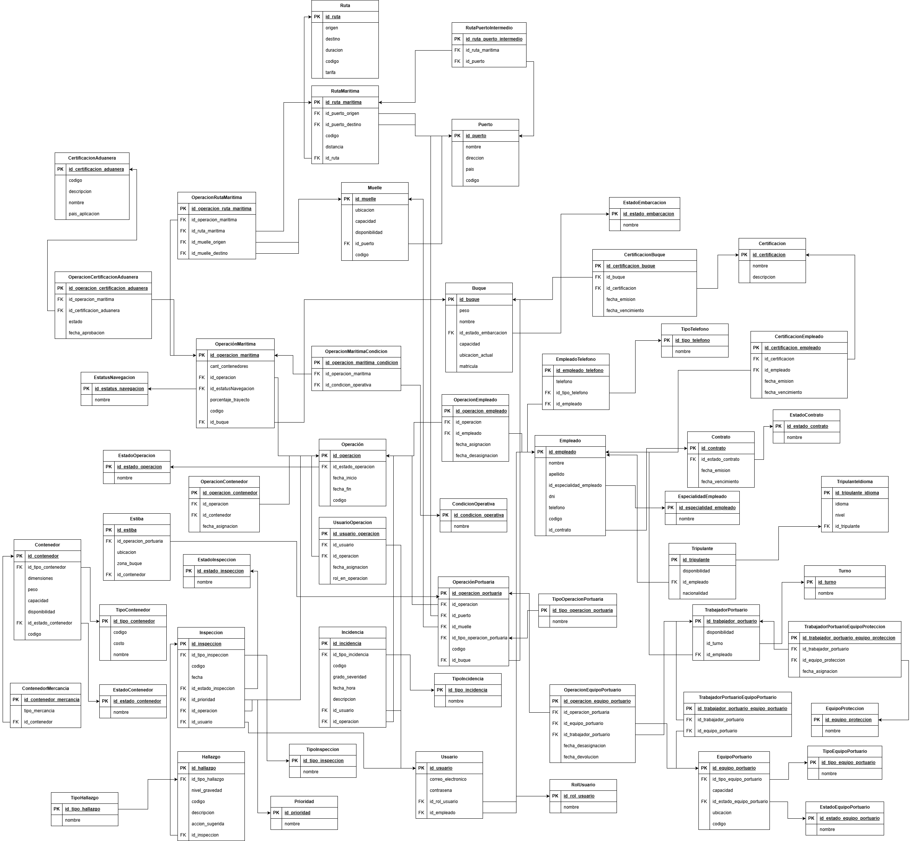

> [5. Diseño Lógico](../5.md) › [5.3. Módulo 3](5.3.md)

# 5.3. Módulo de Gestión de Operaciones Marítimas

### Diagrama Relacional

### Diccionario de Datos

### Tablas Principales

#### Tabla: Operacion
- **Descripción:** Registro general de cualquier actividad logística realizada en el sistema.  
- **Propósito:** Servir como entidad base para todas las operaciones especializadas del sistema.  
- **Reglas de Negocio:**  
  - Cada operación debe tener un código único.
  - Toda operación debe tener una fecha de inicio y un estado.
  - Se especializa en: Operación Terrestre, Operación Marítima, Operación Portuaria, Operación Mantenimiento, Operación Monitoreo y Operación Embarque.

| **Columna** | **Descripción** | **Propósito** | **Tipo** | **NN** | **UK** | **FK** | **Ejemplo** |
|-------------|-----------------|---------------|----------|--------|--------|--------|-------------|
| id_operacion | Identificador único | PK UUID | CHAR(36) | Sí | Sí | No | 550e8400-e29b-41d4-a716-446655440005 |
| codigo | Código de operación | Identificación | VARCHAR(20) | Sí | Sí | No | OP-2025-001 |
| fecha_inicio | Fecha de inicio | Control temporal | DATETIME | Sí | No | No | 2025-09-27 14:30:00 |
| fecha_fin | Fecha de finalización | Control temporal | DATETIME | No | No | No | 2025-09-30 18:00:00 |
| id_estado_operacion | Estado actual | Seguimiento | CHAR(36) | Sí | No | Sí | 550e8400-e29b-41d4-a716-446655440009 |

**Índices:**
- PRIMARY KEY (id_operacion)
- UNIQUE KEY uk_codigo (codigo)
- FOREIGN KEY (id_estado_operacion) REFERENCES EstadoOperacion(id_estado_operacion)

---

#### Tabla: OperacionMaritima
- **Descripción:** Operación especializada en el traslado marítimo entre puertos.  
- **Propósito:** Representar operaciones de transporte marítimo de contenedores.  
- **Reglas de Negocio:**  
  - Hereda todos los atributos de Operación.
  - Debe seguir una ruta marítima y utilizar un buque.

| **Columna** | **Descripción** | **Propósito** | **Tipo** | **NN** | **UK** | **FK** | **Ejemplo** |
|-------------|-----------------|---------------|----------|--------|--------|--------|-------------|
| id_operacion_maritima | Identificador único | PK UUID | CHAR(36) | Sí | Sí | No | 650e8400-e29b-41d4-a716-446655440001 |
| id_operacion | Referencia a operación | Herencia | CHAR(36) | Sí | Sí | Sí | 550e8400-e29b-41d4-a716-446655440005 |
| codigo | Código de operación marítima | Identificación | VARCHAR(20) | Sí | Sí | No | OPM-2025-001 |
| cantidad_contenedores | Número de contenedores | Control logístico | INT | Sí | No | No | 350 |
| id_estatus_navegacion | Estado de navegación | Seguimiento | CHAR(36) | Sí | No | Sí | 750e8400-e29b-41d4-a716-446655440002 |
| porcentaje_trayecto | Progreso de la operación | Monitoreo | DECIMAL(5,2) | Sí | No | No | 72.5 |
| id_buque | Referencia a buque | Relación | CHAR(36) | Sí | No | Sí | c60e8400-e29b-41d4-a716-446655440050 |

**Índices:**
- PRIMARY KEY (id_operacion_maritima)
- UNIQUE KEY uk_operacion (id_operacion)
- UNIQUE KEY uk_codigo (codigo)
- FOREIGN KEY (id_operacion) REFERENCES Operacion(id_operacion)
- FOREIGN KEY (id_estatus_navegacion) REFERENCES EstatusNavegacion(id_estatus_navegacion)
- FOREIGN KEY (id_buque) REFERENCES Buque(id_buque)

---

#### Tabla: OperacionPortuaria
- **Descripción:** Operación especializada en actividades dentro del puerto.  
- **Propósito:** Representar operaciones de carga, descarga, estiba y almacenamiento.  
- **Reglas de Negocio:**  
  - Hereda todos los atributos de Operación.
  - Se realiza en un muelle específico.

| **Columna** | **Descripción** | **Propósito** | **Tipo** | **NN** | **UK** | **FK** | **Ejemplo** |
|-------------|-----------------|---------------|----------|--------|--------|--------|-------------|
| id_operacion_portuaria | Identificador único | PK UUID | CHAR(36) | Sí | Sí | No | 850e8400-e29b-41d4-a716-446655440003 |
| id_operacion | Referencia a operación | Herencia | CHAR(36) | Sí | Sí | Sí | 550e8400-e29b-41d4-a716-446655440005 |
| codigo | Código de operación portuaria | Identificación | VARCHAR(20) | Sí | Sí | No | OPP-2025-001 |
| id_puerto | Puerto asignado | Ubicación | CHAR(36) | Sí | No | Sí | 950e8400-e29b-41d4-a716-446655440004 |
| id_muelle | Muelle específico | Infraestructura | CHAR(36) | Sí | No | Sí | a50e8400-e29b-41d4-a716-446655440005 |
| id_tipo_operacion_portuaria | Tipo de operación | Clasificación | CHAR(36) | Sí | No | Sí | b50e8400-e29b-41d4-a716-446655440006 |
| id_buque | Referencia a buque | Relación | CHAR(36) | Sí | No | Sí | c60e8400-e29b-41d4-a716-446655440050 |

**Índices:**
- PRIMARY KEY (id_operacion_portuaria)
- UNIQUE KEY uk_operacion (id_operacion)
- UNIQUE KEY uk_codigo (codigo)
- FOREIGN KEY (id_operacion) REFERENCES Operacion(id_operacion)
- FOREIGN KEY (id_puerto) REFERENCES Puerto(id_puerto)
- FOREIGN KEY (id_muelle) REFERENCES Muelle(id_muelle)
- FOREIGN KEY (id_tipo_operacion_portuaria) REFERENCES TipoOperacionPortuaria(id_tipo_operacion_portuaria)
- FOREIGN KEY (matricula) REFERENCES Buque(matricula)

---

#### Tabla: Buque
- **Descripción:** Embarcación de transporte marítimo que transporta contenedores y tripulación.  
- **Propósito:** Registrar la información de las embarcaciones utilizadas en operaciones marítimas.  
- **Reglas de Negocio:**  
  - La matrícula debe ser única.
  - Un buque puede ser utilizado en múltiples operaciones.

| **Columna** | **Descripción** | **Propósito** | **Tipo** | **NN** | **UK** | **FK** | **Ejemplo** |
|-------------|-----------------|---------------|----------|--------|--------|--------|-------------|
| id_buque | Identificador único | PK UUID | CHAR(36) | Sí | Sí | No | c50e8400-e29b-41d4-a716-446655440007 |
| matricula | Matrícula del buque | Identificación | VARCHAR(20) | Sí | Sí | No | IMO-9347438 |
| nombre | Nombre del buque | Identificación | VARCHAR(100) | Sí | No | No | Hapag Spirit |
| capacidad | Capacidad de carga en TEU | Control | INT | Sí | No | No | 12000 |
| id_estado_embarcacion | Estado operativo | Seguimiento | CHAR(36) | Sí | No | Sí | d50e8400-e29b-41d4-a716-446655440008 |
| peso | Peso máximo en toneladas | Especificación | DECIMAL(15,2) | Sí | No | No | 150000.00 |
| ubicacion_actual | Posición GPS actual | Monitoreo | VARCHAR(100) | No | No | No | 8.9824 N, 79.5199 W |

**Índices:**
- PRIMARY KEY (id_buque)
- UNIQUE KEY uk_matricula (matricula)
- FOREIGN KEY (id_estado_embarcacion) REFERENCES EstadoEmbarcacion(id_estado_embarcacion)

---

#### Tabla: Contenedor
- **Descripción:** Unidad estandarizada de transporte de mercancías.  
- **Propósito:** Gestionar los contenedores disponibles y su estado.  
- **Reglas de Negocio:**  
  - Cada contenedor debe tener un código único.
  - Debe tener un tipo de contenedor asociado.

| **Columna** | **Descripción** | **Propósito** | **Tipo** | **NN** | **UK** | **FK** | **Ejemplo** |
|-------------|-----------------|---------------|----------|--------|--------|--------|-------------|
| id_contenedor | Identificador único contenedor | PK UUID | CHAR(36) | Sí | Sí | No | e50e8400-e29b-41d4-a716-446655440009 |
| codigo | Código del contenedor | Identificación | VARCHAR(20) | Sí | Sí | No | CONT-123 |
| peso | Peso del contenedor con mercancía | Control técnico | DECIMAL(10,2) | Sí | No | No | 2500.00 |
| capacidad | Capacidad máxima de carga | Control técnico | DECIMAL(10,2) | Sí | No | No | 33500.00 |
| dimensiones | Dimensiones físicas | Especificación | VARCHAR(50) | Sí | No | No | 20x8x8.5 |
| id_estado_contenedor | Estado del contenedor | Seguimiento | CHAR(36) | Sí | No | Sí | f50e8400-e29b-41d4-a716-446655440010 |
| id_tipo_contenedor | Tipo de contenedor | Clasificación | CHAR(36) | Sí | No | Sí | 050e8400-e29b-41d4-a716-446655440011 |

**Índices:**
- PRIMARY KEY (id_contenedor)
- UNIQUE KEY uk_codigo (codigo)
- FOREIGN KEY (id_estado_contenedor) REFERENCES EstadoContenedor(id_estado_contenedor)
- FOREIGN KEY (id_tipo_contenedor) REFERENCES TipoContenedor(id_tipo_contenedor)

---

#### Tabla: EquipoPortuario
- **Descripción:** Maquinaria y herramientas utilizadas en el puerto.  
- **Propósito:** Gestionar el equipo disponible para operaciones portuarias.  
- **Reglas de Negocio:**  
  - Cada equipo tiene un tipo y capacidad específicos.
  - Puede ser usado en varias operaciones portuarias.

| **Columna** | **Descripción** | **Propósito** | **Tipo** | **NN** | **UK** | **FK** | **Ejemplo** |
|-------------|-----------------|---------------|----------|--------|--------|--------|-------------|
| id_equipo_portuario | Identificador único | PK UUID | CHAR(36) | Sí | Sí | No | 150e8400-e29b-41d4-a716-446655440012 |
| codigo | Código del equipo | Identificación | VARCHAR(20) | Sí | Sí | No | EQ-001 |
| capacidad | Capacidad en toneladas | Control | DECIMAL(10,2) | Sí | No | No | 150.00 |
| id_tipo_equipo_portuario | Tipo de equipo | Clasificación | CHAR(36) | Sí | No | Sí | 250e8400-e29b-41d4-a716-446655440013 |
| id_estado_equipo_portuario | Estado del equipo | Control | CHAR(36) | Sí | No | Sí | 350e8400-e29b-41d4-a716-446655440014 |
| ubicacion | Ubicación física | Logística | VARCHAR(100) | No | No | No | MUE-001 |

**Índices:**
- PRIMARY KEY (id_equipo_portuario)
- UNIQUE KEY uk_codigo (codigo)
- FOREIGN KEY (id_tipo_equipo_portuario) REFERENCES TipoEquipoPortuario(id_tipo_equipo_portuario)
- FOREIGN KEY (id_estado_equipo_portuario) REFERENCES EstadoEquipoPortuario(id_estado_equipo_portuario)

---

#### Tabla: Muelle
- **Descripción:** Estructura en el puerto para atraque de embarcaciones.  
- **Propósito:** Registrar y controlar las ubicaciones de operaciones portuarias.  
- **Reglas de Negocio:**  
  - Cada muelle pertenece a un único puerto.
  - Tiene capacidad de carga específica.

| **Columna** | **Descripción** | **Propósito** | **Tipo** | **NN** | **UK** | **FK** | **Ejemplo** |
|-------------|-----------------|---------------|----------|--------|--------|--------|-------------|
| id_muelle | Identificador único | PK UUID | CHAR(36) | Sí | Sí | No | 450e8400-e29b-41d4-a716-446655440015 |
| codigo | Código del muelle | Identificación | VARCHAR(20) | Sí | Sí | No | MUE-212 |
| ubicacion | Dirección o nombre del área | Logística | VARCHAR(100) | Sí | No | No | Terminal Norte |
| capacidad | Capacidad en TEU | Control | INT | Sí | No | No | 1000 |
| disponibilidad | Estado de asignación | Planificación | BOOLEAN | Sí | No | No | TRUE |
| id_puerto | Puerto al que pertenece | Relación | CHAR(36) | Sí | No | Sí | 550e8400-e29b-41d4-a716-446655440016 |

**Índices:**
- PRIMARY KEY (id_muelle)
- UNIQUE KEY uk_codigo (codigo)
- FOREIGN KEY (id_puerto) REFERENCES Puerto(id_puerto)

---

#### Tabla: Puerto
- **Descripción:** Instalación marítima donde se realizan operaciones de carga y descarga.  
- **Propósito:** Identificar y almacenar información de cada puerto.  
- **Reglas de Negocio:**  
  - Cada puerto debe tener un código único.
  - Puede ser origen o destino de múltiples rutas marítimas.

| **Columna** | **Descripción** | **Propósito** | **Tipo** | **NN** | **UK** | **FK** | **Ejemplo** |
|-------------|-----------------|---------------|----------|--------|--------|--------|-------------|
| id_puerto | Identificador único | PK UUID | CHAR(36) | Sí | Sí | No | 650e8400-e29b-41d4-a716-446655440017 |
| codigo | Código del puerto | Identificación | VARCHAR(20) | Sí | Sí | No | PRT-001 |
| nombre | Nombre oficial | Reconocimiento | VARCHAR(100) | Sí | No | No | Puerto del Callao |
| pais | País donde se ubica | Clasificación | VARCHAR(50) | Sí | No | No | Perú |
| direccion | Dirección física | Logística | TEXT | Sí | No | No | Av. Contralmirante Raygada |

**Índices:**
- PRIMARY KEY (id_puerto)
- UNIQUE KEY uk_codigo (codigo)

---

#### Tabla: Usuario
- **Descripción:** Individuo con acceso al sistema y rol específico.  
- **Propósito:** Autenticar usuarios y asignarles roles para tareas específicas.  
- **Reglas de Negocio:**  
  - Cada usuario debe estar asociado a un empleado.
  - El correo electrónico debe ser único.

| **Columna** | **Descripción** | **Propósito** | **Tipo** | **NN** | **UK** | **FK** | **Ejemplo** |
|-------------|-----------------|---------------|----------|--------|--------|--------|-------------|
| id_usuario | Identificador único | PK UUID | CHAR(36) | Sí | Sí | No | 750e8400-e29b-41d4-a716-446655440018 |
| correo_electronico | Email de acceso | Autenticación | VARCHAR(100) | Sí | Sí | No | juan.perez@empresa.com |
| contrasena | Contraseña cifrada | Seguridad | VARCHAR(255) | Sí | No | No | $2y$10$... |
| id_rol_usuario | Rol asignado | Control de permisos | CHAR(36) | Sí | No | Sí | 850e8400-e29b-41d4-a716-446655440019 |
| id_empleado | Identificador | FK artificial | CHAR(36) | Sí | No | Sí | 950e8400-e29b-41d4-a716-446655440020 |

**Índices:**
- PRIMARY KEY (id_usuario)
- UNIQUE KEY uk_correo (correo_electronico)
- FOREIGN KEY (id_rol_usuario) REFERENCES RolUsuario(id_rol_usuario)
- FOREIGN KEY (id_empleado) REFERENCES Empleado(id_empleado)

---

#### Tabla: Empleado
- **Descripción:** Persona que trabaja en la empresa de logística.  
- **Propósito:** Gestionar el personal y sus roles en las operaciones del sistema.  
- **Reglas de Negocio:**  
  - Cada empleado debe tener un código único.
  - El DNI debe ser único en el sistema.
  - Cada empleado debe tener un contrato asociado.

| **Columna** | **Descripción** | **Propósito** | **Tipo** | **NN** | **UK** | **FK** | **Ejemplo** |
|-------------|-----------------|---------------|----------|--------|--------|--------|-------------|
| id_empleado | Identificador único del empleado | PK UUID | CHAR(36) | Sí | Sí | No | a50e8400-e29b-41d4-a716-446655440021 |
| codigo | Código del empleado | Identificación | VARCHAR(20) | Sí | Sí | No | EMP-001 |
| dni | Documento de identidad | Identificación legal | CHAR(8) | Sí | Sí | No | 87654321 |
| nombre | Nombre del empleado | Identificación | VARCHAR(100) | Sí | No | No | Juan |
| apellido | Apellido del empleado | Identificación | VARCHAR(100) | Sí | No | No | Pérez |
| direccion | Dirección de residencia | Ubicación | VARCHAR(200) | No | No | No | Av. Marina 123 |
| id_especialidad_empleado | Especialidad del empleado | Clasificación | CHAR(36) | Sí | No | Sí | b50e8400-e29b-41d4-a716-446655440022 |
| id_contrato | Contrato laboral del empleado | Relación laboral | CHAR(36) | Sí | Sí | Sí | c50e8400-e29b-41d4-a716-446655440023 |

**Índices:**
- PRIMARY KEY (id_empleado)
- UNIQUE KEY uk_codigo (codigo)
- UNIQUE KEY uk_dni (dni)
- UNIQUE KEY uk_contrato (id_contrato)
- FOREIGN KEY (id_especialidad_empleado) REFERENCES Especialidad(id_especialidad_empleado)
- FOREIGN KEY (id_contrato) REFERENCES Contrato(id_contrato)

---

#### Tabla: Tripulante
- **Descripción:** Empleado especializado que forma parte de la tripulación de un buque.  
- **Propósito:** Registrar al personal que opera en los buques.  
- **Reglas de Negocio:**  
  - Hereda todos los atributos de Empleado.
  - Debe contar con certificaciones de navegación.

| **Columna** | **Descripción** | **Propósito** | **Tipo** | **NN** | **UK** | **FK** | **Ejemplo** |
|-------------|-----------------|---------------|----------|--------|--------|--------|-------------|
| id_tripulante | Identificador único | PK UUID | CHAR(36) | Sí | Sí | No | d50e8400-e29b-41d4-a716-446655440024 |
| id_empleado | Referencia a empleado | Herencia | CHAR(36) | Sí | Sí | Sí | a50e8400-e29b-41d4-a716-446655440021 |
| disponibilidad | Estado de asignación | Planificación | BOOLEAN | Sí | No | No | TRUE |
| nacionalidad | País de ciudadanía | Registro legal | VARCHAR(50) | Sí | No | No | Peruana |

**Índices:**
- PRIMARY KEY (id_tripulante)
- UNIQUE KEY uk_empleado (id_empleado)
- FOREIGN KEY (id_empleado) REFERENCES Empleado(id_empleado)

---

#### Tabla: TrabajadorPortuario
- **Descripción:** Empleado especializado en labores portuarias.  
- **Propósito:** Registrar al personal que trabaja en operaciones de puerto.  
- **Reglas de Negocio:**  
  - Hereda todos los atributos de Empleado.
  - Debe tener definido un turno de trabajo.

| **Columna** | **Descripción** | **Propósito** | **Tipo** | **NN** | **UK** | **FK** | **Ejemplo** |
|-------------|-----------------|---------------|----------|--------|--------|--------|-------------|
| id_trabajador_portuario | Identificador único | PK UUID | CHAR(36) | Sí | Sí | No | e50e8400-e29b-41d4-a716-446655440025 |
| id_empleado | Referencia a empleado | Herencia | CHAR(36) | Sí | Sí | Sí | a50e8400-e29b-41d4-a716-446655440021 |
| disponibilidad | Estado de asignación | Planificación | BOOLEAN | Sí | No | No | TRUE |
| id_turno | Turno asignado | Organización laboral | CHAR(36) | Sí | No | Sí | f50e8400-e29b-41d4-a716-446655440026 |

**Índices:**
- PRIMARY KEY (id_trabajador_portuario)
- UNIQUE KEY uk_empleado (id_empleado)
- FOREIGN KEY (id_empleado) REFERENCES Empleado(id_empleado)
- FOREIGN KEY (id_turno) REFERENCES Turno(id_turno)

---

#### Tabla: Certificacion
- **Descripción:** Certificaciones técnicas y profesionales.  
- **Propósito:** Control de validez de certificaciones requeridas para personal y activos.  
- **Reglas de Negocio:**  
  - Cada certificación debe tener un identificador único.
  - Aplica a empleados y buques.

| **Columna** | **Descripción** | **Propósito** | **Tipo** | **NN** | **UK** | **FK** | **Ejemplo** |
|-------------|-----------------|---------------|----------|--------|--------|--------|-------------|
| id_certificacion | Identificador único | PK UUID | CHAR(36) | Sí | Sí | No | 050e8400-e29b-41d4-a716-446655440027 |
| nombre | Nombre de la certificación | Identificación | VARCHAR(100) | Sí | No | No | STCW Basic Safety |
| descripcion | Descripción detallada | Especificación | TEXT | No | No | No | Certificación básica de seguridad marítima |

**Índices:**
- PRIMARY KEY (id_certificacion)

---

#### Tabla: CertificacionAduanera

- **Descripción:** Certificaciones específicas para operaciones aduaneras.
- **Propósito:** Control de documentación aduanera requerida para operaciones internacionales.
- **Reglas de Negocio:**
  - Cada certificación aduanera debe tener un código único.
  - Aplica solo a operaciones marítimas.
  - La fecha de expiración debe ser posterior a la fecha de emisión.

| **Columna** | **Descripción** | **Propósito** | **Tipo** | **NN** | **UK** | **FK** | **Ejemplo** |
|-------------|-----------------|---------------|----------|--------|--------|--------|-------------|
| id_certificacion_aduanera | Identificador único | PK UUID | CHAR(36) | Sí | Sí | No | 150e8400-e29b-41d4-a716-446655440028 |
| codigo | Código de certificación | Identificación | VARCHAR(20) | Sí | Sí | No | CERT-ADU-001 |
| nombre | Nombre de certificación | Identificación | VARCHAR(100) | Sí | No | No | Operador Económico Autorizado |
| descripcion | Descripción detallada | Especificación | TEXT | No | No | No | Certificación para facilidades aduaneras |
| pais_aplicacion | País donde aplica | Contexto legal | VARCHAR(50) | No | No | No | Perú |
| fecha_emision | Fecha de emisión | Control temporal | TIMESTAMP WITH TIME ZONE | Sí | No | No | 2024-01-15 08:30:00-05:00 |
| fecha_expiracion | Fecha de expiración | Control de vigencia | TIMESTAMP WITH TIME ZONE | No | No | No | 2027-01-15 23:59:59-05:00 |

**Índices:**
- PRIMARY KEY (id_certificacion_aduanera)
- UNIQUE KEY uk_codigo (codigo)

---

#### Tabla: Ruta
- **Descripción:** Trayecto predefinido entre un punto de origen y un punto de destino.  
- **Propósito:** Planificar y dar seguimiento a los viajes y traslados.  
- **Reglas de Negocio:**  
  - Cada ruta debe tener un código único.
  - Se especializa en: Ruta Marítima y Ruta Terrestre.

| **Columna** | **Descripción** | **Propósito** | **Tipo** | **NN** | **UK** | **FK** | **Ejemplo** |
|-------------|-----------------|---------------|----------|--------|--------|--------|-------------|
| id_ruta | Identificador único | PK UUID | CHAR(36) | Sí | Sí | No | 250e8400-e29b-41d4-a716-446655440029 |
| codigo | Código de ruta | Identificación | VARCHAR(20) | Sí | Sí | No | RUT-001 |
| origen | Lugar de origen | Logística | VARCHAR(100) | Sí | No | No | Callao |
| destino | Lugar de destino | Logística | VARCHAR(100) | Sí | No | No | Hamburgo |
| duracion | Duración en días | Planificación | INT | Sí | No | No | 25 |
| tarifa | Tarifa base | Financiero | DECIMAL(10,2) | Sí | No | No | 5000.00 |

**Índices:**
- PRIMARY KEY (id_ruta)
- UNIQUE KEY uk_codigo (codigo)

---

#### Tabla: RutaMaritima
- **Descripción:** Ruta especializada en trayectos marítimos entre puertos.  
- **Propósito:** Registrar los recorridos marítimos planificados.  
- **Reglas de Negocio:**  
  - Hereda todos los atributos de Ruta.
  - Debe conectar dos puertos (origen y destino).

| **Columna** | **Descripción** | **Propósito** | **Tipo** | **NN** | **UK** | **FK** | **Ejemplo** |
|-------------|-----------------|---------------|----------|--------|--------|--------|-------------|
| id_ruta_maritima | Identificador único | PK UUID | CHAR(36) | Sí | Sí | No | 350e8400-e29b-41d4-a716-446655440030 |
| id_ruta | Referencia a ruta | Herencia | CHAR(36) | Sí | Sí | Sí | 250e8400-e29b-41d4-a716-446655440029 |
| codigo | Código de ruta marítima | Identificación | VARCHAR(20) | Sí | Sí | No | RM-CALLAO-VALPO |
| id_puerto_origen | Puerto de origen | Punto partida | CHAR(36) | Sí | No | Sí | 650e8400-e29b-41d4-a716-446655440017 |
| id_puerto_destino | Puerto de destino | Punto llegada | CHAR(36) | Sí | No | Sí | 450e8400-e29b-41d4-a716-446655440031 |
| distancia | Distancia en millas náuticas | Cálculo logístico | INT | Sí | No | No | 10500 |

**Índices:**
- PRIMARY KEY (id_ruta_maritima)
- UNIQUE KEY uk_ruta (id_ruta)
- UNIQUE KEY uk_codigo (codigo)
- FOREIGN KEY (id_ruta) REFERENCES Ruta(id_ruta)
- FOREIGN KEY (id_puerto_origen) REFERENCES Puerto(id_puerto)
- FOREIGN KEY (id_puerto_destino) REFERENCES Puerto(id_puerto)

---

#### Tabla: Inspeccion
- **Descripción:** Proceso de revisión para verificar cumplimiento de normas.  
- **Propósito:** Registrar los resultados de inspecciones realizadas.  
- **Reglas de Negocio:**  
  - Se aplica a una única operación.
  - Puede registrar múltiples hallazgos.

| **Columna** | **Descripción** | **Propósito** | **Tipo** | **NN** | **UK** | **FK** | **Ejemplo** |
|-------------|-----------------|---------------|----------|--------|--------|--------|-------------|
| id_inspeccion | Identificador único | PK UUID | CHAR(36) | Sí | Sí | No | 550e8400-e29b-41d4-a716-446655440032 |
| codigo | Código de inspección | Identificación | VARCHAR(20) | Sí | Sí | No | INS-001 |
| id_tipo_inspeccion | Tipo de inspección | Clasificación | CHAR(36) | Sí | No | Sí | 650e8400-e29b-41d4-a716-446655440033 |
| id_estado_inspeccion | Estado de inspección | Clasificación | CHAR(36) | Sí | No | Sí | 650e8400-e29b-41d4-a716-446655440033 |
| fecha | Fecha de inspección | Control | TIMESTAMP | Sí | No | No | 2023-11-03T15:28:05.250Z |
| id_prioridad | Nivel de urgencia | Control | CHAR(36) | Sí | No | Sí | 750e8400-e29b-41d4-a716-446655440034 |
| id_operacion | Operación inspeccionada | Relación | CHAR(36) | Sí | No | Sí | 550e8400-e29b-41d4-a716-446655440005 |
| id_usuario | Inspector asignado | Relación | CHAR(36) | Sí | No | Sí | 750e8400-e29b-41d4-a716-446655440018 |

**Índices:**
- PRIMARY KEY (id_inspeccion)
- UNIQUE KEY uk_codigo (codigo)
- FOREIGN KEY (id_tipo_inspeccion) REFERENCES TipoInspeccion(id_tipo_inspeccion)
- FOREIGN KEY (id_estado_inspeccion) REFERENCES EstadoInspeccion(id_estado_inspeccion)
- FOREIGN KEY (id_prioridad) REFERENCES Prioridad(id_prioridad)
- FOREIGN KEY (id_operacion) REFERENCES Operacion(id_operacion)
- FOREIGN KEY (id_usuario) REFERENCES Usuario(id_usuario)

---

#### Tabla: CertificacionEmpleado
- **Descripción:** Certificaciones obtenidas por empleados.  
- **Propósito:** Controlar validez de certificaciones del personal.  
- **Reglas de Negocio:**  
  - Un empleado puede tener múltiples certificaciones.

| **Columna** | **Descripción** | **Propósito** | **Tipo** | **NN** | **UK** | **FK** | **Ejemplo** |
|-------------|-----------------|---------------|----------|--------|--------|--------|-------------|
| id_certificacion_empleado | Identificador único | PK UUID | CHAR(36) | Sí | Sí | No | 850e8400-e29b-41d4-a716-446655440035 |
| id_empleado | Referencia a empleado | Relación | CHAR(36) | Sí | No | Sí | a50e8400-e29b-41d4-a716-446655440021 |
| id_certificacion | Referencia a certificación | Relación | CHAR(36) | Sí | No | Sí | 050e8400-e29b-41d4-a716-446655440027 |
| fecha_emision | Fecha de obtención | Control | DATE | Sí | No | No | 2023-06-10 |
| fecha_vencimiento | Fecha de vencimiento | Control | DATE | Sí | No | No | 2028-06-10 |

**Índices:**
- PRIMARY KEY (id_certificacion_empleado)
- UNIQUE KEY uk_empleado_cert (id_empleado, id_certificacion)
- FOREIGN KEY (id_empleado) REFERENCES Empleado(id_empleado)
- FOREIGN KEY (id_certificacion) REFERENCES Certificacion(id_certificacion)

---

#### Tabla: CertificacionBuque
- **Descripción:** Certificaciones asignadas a buques.  
- **Propósito:** Controlar validez de certificaciones de cada buque.  
- **Reglas de Negocio:**  
  - Un buque puede tener múltiples certificaciones.

| **Columna** | **Descripción** | **Propósito** | **Tipo** | **NN** | **UK** | **FK** | **Ejemplo** |
|-------------|-----------------|---------------|----------|--------|--------|--------|-------------|
| id_certificacion_buque | Identificador único | PK UUID | CHAR(36) | Sí | Sí | No | 950e8400-e29b-41d4-a716-446655440036 |
| id_buque | Buque rastreado | Relación | CHAR(36) | Sí | No | Sí | c60e8400-e29b-41d4-a716-446655440050 |
| id_certificacion | Referencia a certificación | Relación | CHAR(36) | Sí | No | Sí | 050e8400-e29b-41d4-a716-446655440027 |
| fecha_emision | Fecha de emisión | Control | DATE | Sí | No | No | 2024-01-15 |
| fecha_vencimiento | Fecha de vencimiento | Control | DATE | Sí | No | No | 2029-01-15 |

**Índices:**
- PRIMARY KEY (id_certificacion_buque)
- UNIQUE KEY uk_buque_cert (id_buque, id_certificacion)
- FOREIGN KEY (id_buque) REFERENCES Buque(id_buque)
- FOREIGN KEY (id_certificacion) REFERENCES Certificacion(id_certificacion)

---

#### Tabla: Hallazgo
- **Descripción:** Problema o no conformidad encontrada en una inspección.  
- **Propósito:** Detallar irregularidades y acciones sugeridas.  
- **Reglas de Negocio:**  
  - Cada hallazgo está asociado a una única inspección.

| **Columna** | **Descripción** | **Propósito** | **Tipo** | **NN** | **UK** | **FK** | **Ejemplo** |
|-------------|-----------------|---------------|----------|--------|--------|--------|-------------|
| id_hallazgo | Identificador único | PK UUID | CHAR(36) | Sí | Sí | No | a50e8400-e29b-41d4-a716-446655440037 |
| codigo | Código de hallazgo | Identificación | VARCHAR(20) | Sí | Sí | No | HAL-001 |
| id_tipo_hallazgo | Tipo de hallazgo | Clasificación | CHAR(36) | Sí | No | Sí | b50e8400-e29b-41d4-a716-446655440038 |
| nivel_gravedad | Severidad del hallazgo | Control | INT | Sí | No | No | 3 |
| descripcion | Descripción detallada | Contexto | TEXT | Sí | No | No | Mercancía no declarada |
| accion_sugerida | Acción recomendada | Proceso | TEXT | No | No | No | Retener contenedor |
| id_inspeccion | Inspección asociada | Relación | CHAR(36) | Sí | No | Sí | 550e8400-e29b-41d4-a716-446655440032 |

**Índices:**
- PRIMARY KEY (id_hallazgo)
- UNIQUE KEY uk_codigo (codigo)
- FOREIGN KEY (id_tipo_hallazgo) REFERENCES TipoHallazgo(id_tipo_hallazgo)
- FOREIGN KEY (id_inspeccion) REFERENCES Inspeccion(id_inspeccion)

---

#### Tabla: Incidencia
- **Descripción:** Evento negativo o problema registrado durante una operación.  
- **Propósito:** Dar trazabilidad y seguimiento a problemas de seguridad o no conformidad.  
- **Reglas de Negocio:**  
  - Debe estar asociada a una operación.
  - Puede ser registrada por un empleado o usuario.

| **Columna** | **Descripción** | **Propósito** | **Tipo** | **NN** | **UK** | **FK** | **Ejemplo** |
|-------------|-----------------|---------------|----------|--------|--------|--------|-------------|
| id_incidencia | Identificador único | PK UUID | CHAR(36) | Sí | Sí | No | c50e8400-e29b-41d4-a716-446655440039 |
| codigo | Código de incidencia | Identificación | VARCHAR(20) | Sí | Sí | No | INC-001 |
| id_tipo_incidencia | Tipo de incidencia | Clasificación | CHAR(36) | Sí | No | Sí | d50e8400-e29b-41d4-a716-446655440040 |
| descripcion | Descripción detallada | Contexto | TEXT | Sí | No | No | Derrame de líquido |
| grado_severidad | Nivel de gravedad (1-5) | Control | INT | Sí | No | No | 4 |
| fecha_hora | Momento de ocurrencia | Registro temporal | DATETIME | Sí | No | No | 2025-09-28 14:35:00 |
| id_operacion | Operación afectada | Relación | CHAR(36) | Sí | No | Sí | 550e8400-e29b-41d4-a716-446655440005 |
| id_usuario | Usuario que registra | Responsabilidad | CHAR(36) | Sí | No | Sí | 750e8400-e29b-41d4-a716-446655440018 |

**Índices:**
- PRIMARY KEY (id_incidencia)
- UNIQUE KEY uk_codigo (codigo)
- FOREIGN KEY (id_tipo_incidencia) REFERENCES TipoIncidencia(id_tipo_incidencia)
- FOREIGN KEY (id_operacion) REFERENCES Operacion(id_operacion)
- FOREIGN KEY (id_usuario) REFERENCES Usuario(id_usuario)

---

#### Tabla: OperacionRutaMaritima
- **Descripción:** Operación especializada en transporte marítimo entre puertos.  
- **Propósito:** Representar operaciones de navegación con rutas, origen y destino definidos.  
- **Reglas de Negocio:**  
  - Hereda todos los atributos de Operación.
  - Se realiza siguiendo una ruta marítima establecida.
  - Tiene un muelle de origen y uno de destino.

| **Columna** | **Descripción** | **Propósito** | **Tipo** | **NN** | **UK** | **FK** | **Ejemplo** |
|-------------|-----------------|---------------|----------|--------|--------|--------|-------------|
| id_operacion_ruta_maritima | Identificador único | PK UUID | CHAR(36) | Sí | Sí | No | e50e8400-e29b-41d4-a716-446655440041 |
| id_operacion_maritima | Referencia a operación marítima | Herencia | CHAR(36) | Sí | Sí | Sí | 650e8400-e29b-41d4-a716-446655440001 |
| id_ruta_maritima | Ruta asignada | Trayectoria | CHAR(36) | Sí | No | Sí | 350e8400-e29b-41d4-a716-446655440030 |
| id_muelle_origen | Muelle de partida | Punto inicial | CHAR(36) | Sí | No | Sí | 450e8400-e29b-41d4-a716-446655440015 |
| id_muelle_destino | Muelle de llegada | Punto final | CHAR(36) | Sí | No | Sí | f50e8400-e29b-41d4-a716-446655440042 |

**Índices:**
- PRIMARY KEY (id_operacion_ruta_maritima)
- UNIQUE KEY uk_operacion_maritima (id_operacion_maritima)
- FOREIGN KEY (id_operacion_maritima) REFERENCES OperacionMaritima(id_operacion_maritima)
- FOREIGN KEY (id_ruta_maritima) REFERENCES RutaMaritima(id_ruta_maritima)
- FOREIGN KEY (id_muelle_origen) REFERENCES Muelle(id_muelle)
- FOREIGN KEY (id_muelle_destino) REFERENCES Muelle(id_muelle)

---

#### Tabla: Estiba
- **Descripción:** Registro de la ubicación física de contenedores dentro de una embarcación durante operaciones portuarias.  
- **Propósito:** Controlar y documentar la posición exacta de cada contenedor en el buque para optimizar la carga y descarga.  
- **Reglas de Negocio:**  
  - Cada estiba está asociada a una operación portuaria específica.
  - Define la ubicación tridimensional del contenedor en el buque.
  - La zona de buque identifica el área de almacenamiento.

| **Columna** | **Descripción** | **Propósito** | **Tipo** | **NN** | **UK** | **FK** | **Ejemplo** |
|-------------|-----------------|---------------|----------|--------|--------|--------|-------------|
| id_estiba | Identificador único de la estiba | PK UUID | CHAR(36) | Sí | Sí | No | 050e8400-e29b-41d4-a716-446655440043 |
| id_operacion_portuaria | Referencia a la operación portuaria | Vinculación operativa | CHAR(36) | Sí | No | Sí | 850e8400-e29b-41d4-a716-446655440003 |
| ubicacion | Coordenadas de posición del contenedor | Localización física | VARCHAR(50) | Sí | No | No | B-12-04 |
| zona_buque | Área del buque donde se ubica | Sección de almacenamiento | VARCHAR(30) | Sí | No | No | Proa |
| id_contenedor | Referencia al contenedor estibado | Identificación de carga | CHAR(36) | Sí | No | Sí | e50e8400-e29b-41d4-a716-446655440009 |

**Índices:**
- PRIMARY KEY (id_estiba)
- FOREIGN KEY (id_operacion_portuaria) REFERENCES OperacionPortuaria(id_operacion_portuaria)
- FOREIGN KEY (id_contenedor) REFERENCES Contenedor(id_contenedor)
- INDEX idx_operacion_portuaria (id_operacion_portuaria)
- INDEX idx_contenedor (id_contenedor)

---

#### Tabla: Contrato
- **Descripción:** Acuerdo formal entre las partes para la prestación de servicios logísticos.  
- **Propósito:** Gestionar los contratos comerciales y sus condiciones.  
- **Reglas de Negocio:**  
  - Cada contrato debe tener un código único.
  - Un contrato debe tener una fecha de emisión y vencimiento.
  - El estado del contrato determina su validez operativa.

| **Columna** | **Descripción** | **Propósito** | **Tipo** | **NN** | **UK** | **FK** | **Ejemplo** |
|-------------|-----------------|---------------|----------|--------|--------|--------|-------------|
| id_contrato | Identificador único del contrato | PK UUID | CHAR(36) | Sí | Sí | No | 150e8400-e29b-41d4-a716-446655440044 |
| fecha_emision | Fecha de creación del contrato | Registro temporal | DATE | Sí | No | No | 2025-01-15 |
| fecha_vencimiento | Fecha de finalización del contrato | Control temporal | DATE | Sí | No | No | 2026-01-15 |
| id_estado_contrato | Estado actual del contrato | Seguimiento | CHAR(36) | Sí | No | Sí | 250e8400-e29b-41d4-a716-446655440045 |

**Índices:**
- PRIMARY KEY (id_contrato)
- FOREIGN KEY (id_estado_contrato) REFERENCES EstadoContrato(id_estado_contrato)

---

### Tablas Asociativas

#### Tabla: ContenedorMercancia
- **Descripción:** Tipos de mercancía contenida en cada contenedor.  
- **Propósito:** Registrar qué mercancías puede o está transportando un contenedor.  
- **Reglas de Negocio:**  
  - Un contenedor puede transportar múltiples tipos de mercancía.

| **Columna** | **Descripción** | **Propósito** | **Tipo** | **NN** | **UK** | **FK** | **Ejemplo** |
|-------------|-----------------|---------------|----------|--------|--------|--------|-------------|
| id_contenedor_mercancia | Identificador único | PK UUID | CHAR(36) | Sí | Sí | No | 350e8400-e29b-41d4-a716-446655440046 |
| id_contenedor | Referencia al contenedor | Relación | CHAR(36) | Sí | No | Sí | e50e8400-e29b-41d4-a716-446655440009 |
| tipo_mercancia | Tipo de mercancía | Clasificación | VARCHAR(100) | Sí | No | No | Electrónicos |

**Índices:**
- PRIMARY KEY (id_contenedor_mercancia)
- UNIQUE KEY uk_contenedor_mercancia (id_contenedor, tipo_mercancia)
- FOREIGN KEY (id_contenedor) REFERENCES Contenedor(id_contenedor)

---

#### Tabla: EmpleadoTelefono
- **Descripción:** Números de teléfono asociados a empleados.  
- **Propósito:** Permitir que un empleado tenga múltiples números de contacto.  
- **Reglas de Negocio:**  
  - Un empleado puede tener cero o más teléfonos.

| **Columna** | **Descripción** | **Propósito** | **Tipo** | **NN** | **UK** | **FK** | **Ejemplo** |
|-------------|-----------------|---------------|----------|--------|--------|--------|-------------|
| id_empleado_telefono | Identificador único | PK UUID | CHAR(36) | Sí | Sí | No | 450e8400-e29b-41d4-a716-446655440047 |
| id_empleado | Referencia al empleado | Relación | CHAR(36) | Sí | No | Sí | a50e8400-e29b-41d4-a716-446655440021 |
| telefono | Número de teléfono | Contacto | VARCHAR(20) | Sí | No | No | 987654321 |
| id_tipo_telefono | Relación | CHAR(36) | Sí | No | Sí | e50e8400-e29b-41d4-a716-446655440009 |

**Índices:**
- PRIMARY KEY (id_empleado_telefono)
- UNIQUE KEY uk_empleado_telefono (id_empleado, telefono)
- FOREIGN KEY (id_empleado) REFERENCES Empleado(id_empleado)
- FOREIGN KEY (id_tipo_telefono) REFERENCES TipoTelefono(id_tipo_telefono)

---

#### Tabla: TrabajadorPortuarioEquipoProteccion
- **Descripción:** Equipos de protección asignados a trabajadores portuarios.  
- **Propósito:** Controlar qué equipos de seguridad tiene cada trabajador.  
- **Reglas de Negocio:**  
  - Un trabajador puede tener múltiples equipos de protección.

| **Columna** | **Descripción** | **Propósito** | **Tipo** | **NN** | **UK** | **FK** | **Ejemplo** |
|-------------|-----------------|---------------|----------|--------|--------|--------|-------------|
| id_trabajador_portuario_equipo_proteccion | Identificador único | PK UUID | CHAR(36) | Sí | Sí | No | 550e8400-e29b-41d4-a716-446655440048 |
| id_trabajador_portuario | Referencia a trabajador | Relación | CHAR(36) | Sí | No | Sí | e50e8400-e29b-41d4-a716-446655440025 |
| id_equipo_proteccion | Referencia a equipo | Relación | CHAR(36) | Sí | No | Sí | 650e8400-e29b-41d4-a716-446655440049 |
| fecha_asignacion | Fecha de entrega | Control | DATE | Sí | No | No | 2025-01-15 |

**Índices:**
- PRIMARY KEY (id_trabajador_portuario_equipo_proteccion)
- UNIQUE KEY uk_trabajador_equipo (id_trabajador_portuario, id_equipo_proteccion)
- FOREIGN KEY (id_trabajador_portuario) REFERENCES TrabajadorPortuario(id_trabajador_portuario)
- FOREIGN KEY (id_equipo_proteccion) REFERENCES EquipoProteccion(id_equipo_proteccion)

---

#### Tabla: RutaPuertoIntermedio
- **Descripción:** Tabla asociativa que registra los puertos intermedios o escalas de una ruta marítima.  
- **Propósito:** Documentar las paradas intermedias entre el puerto de origen y destino de una ruta, permitiendo operaciones parciales.  
- **Reglas de Negocio:**  
  - Una ruta marítima puede tener múltiples puertos intermedios.
  - Un puerto puede ser escala intermedia de múltiples rutas.
  - La combinación de ruta y puerto intermedio debe ser única.

| **Columna** | **Descripción** | **Propósito** | **Tipo** | **NN** | **UK** | **FK** | **Ejemplo** |
|-------------|-----------------|---------------|----------|--------|--------|--------|-------------|
| id_ruta_puerto_intermedio | Identificador único | PK UUID | CHAR(36) | Sí | Sí | No | 750e8400-e29b-41d4-a716-446655440050 |
| id_ruta_maritima | Referencia a la ruta marítima | Identificación de ruta | CHAR(36) | Sí | No | Sí | 350e8400-e29b-41d4-a716-446655440030 |
| id_puerto | Referencia al puerto intermedio | Identificación de escala | CHAR(36) | Sí | No | Sí | 650e8400-e29b-41d4-a716-446655440017 |

**Índices:**
- PRIMARY KEY (id_ruta_puerto_intermedio)
- UNIQUE KEY uk_ruta_puerto (id_ruta_maritima, id_puerto)
- FOREIGN KEY (id_ruta_maritima) REFERENCES RutaMaritima(id_ruta_maritima)
- FOREIGN KEY (id_puerto) REFERENCES Puerto(id_puerto)
- INDEX idx_ruta_maritima (id_ruta_maritima)
- INDEX idx_puerto (id_puerto)

---

#### Tabla: OperacionCertificacionAduanera
- **Descripción:** Certificaciones aduaneras requeridas por operaciones marítimas.  
- **Propósito:** Controlar cumplimiento aduanero de operaciones internacionales.  
- **Reglas de Negocio:**  
  - Una operación marítima puede requerir múltiples certificaciones.

| **Columna** | **Descripción** | **Propósito** | **Tipo** | **NN** | **UK** | **FK** | **Ejemplo** |
|-------------|-----------------|---------------|----------|--------|--------|--------|-------------|
| id_operacion_certificacion_aduanera | Identificador único | PK UUID | CHAR(36) | Sí | Sí | No | 850e8400-e29b-41d4-a716-446655440051 |
| id_operacion_maritima | Referencia a operación | Relación | CHAR(36) | Sí | No | Sí | 650e8400-e29b-41d4-a716-446655440001 |
| id_certificacion_aduanera | Referencia a certificación | Relación | CHAR(36) | Sí | No | Sí | 150e8400-e29b-41d4-a716-446655440028 |
| estado | Estado de aprobación | Seguimiento | VARCHAR(20) | Sí | No | No | APROBADO |
| fecha_aprobacion | Fecha de aprobación | Control | DATE | No | No | No | 2025-01-20 |

**Índices:**
- PRIMARY KEY (id_operacion_certificacion_aduanera)
- UNIQUE KEY uk_operacion_certificacion (id_operacion_maritima, id_certificacion_aduanera)
- FOREIGN KEY (id_operacion_maritima) REFERENCES OperacionMaritima(id_operacion_maritima)
- FOREIGN KEY (id_certificacion_aduanera) REFERENCES CertificacionAduanera(id_certificacion_aduanera)

---

#### Tabla: TripulanteIdioma
- **Descripción:** Idiomas que domina el tripulante.  
- **Propósito:** Garantizar comunicación efectiva en operaciones internacionales.  
- **Reglas de Negocio:**  
  - Un tripulante puede dominar múltiples idiomas.

| **Columna** | **Descripción** | **Propósito** | **Tipo** | **NN** | **UK** | **FK** | **Ejemplo** |
|-------------|-----------------|---------------|----------|--------|--------|--------|-------------|
| id_tripulante_idioma | Identificador único | PK UUID | CHAR(36) | Sí | Sí | No | 950e8400-e29b-41d4-a716-446655440052 |
| id_tripulante | Referencia a tripulante | Relación | CHAR(36) | Sí | No | Sí | d50e8400-e29b-41d4-a716-446655440024 |
| idioma | Idioma que domina | Comunicación | VARCHAR(50) | Sí | No | No | Inglés |
| nivel | Nivel de dominio | Evaluación | VARCHAR(20) | No | No | No | Avanzado |

**Índices:**
- PRIMARY KEY (id_tripulante_idioma)
- UNIQUE KEY uk_tripulante_idioma (id_tripulante, idioma)
- FOREIGN KEY (id_tripulante) REFERENCES Tripulante(id_tripulante)

---

#### Tabla: OperacionMaritimaCondicion
- **Descripción:** Condiciones operativas que afectan operaciones marítimas.  
- **Propósito:** Registrar factores ambientales o situacionales durante el viaje.  
- **Reglas de Negocio:**  
  - Una operación marítima puede tener múltiples condiciones.

| **Columna** | **Descripción** | **Propósito** | **Tipo** | **NN** | **UK** | **FK** | **Ejemplo** |
|-------------|-----------------|---------------|----------|--------|--------|--------|-------------|
| id_operacion_maritima_condicion | Identificador único | PK UUID | CHAR(36) | Sí | Sí | No | a50e8400-e29b-41d4-a716-446655440053 |
| id_operacion_maritima | Referencia a operación | Relación | CHAR(36) | Sí | No | Sí | 650e8400-e29b-41d4-a716-446655440001 |
| id_condicion_operativa | Referencia a condición | Relación | CHAR(36) | Sí | No | Sí | b50e8400-e29b-41d4-a716-446655440054 |

**Índices:**
- PRIMARY KEY (id_operacion_maritima_condicion)
- UNIQUE KEY uk_operacion_condicion (id_operacion_maritima, id_condicion_operativa)
- FOREIGN KEY (id_operacion_maritima) REFERENCES OperacionMaritima(id_operacion_maritima)
- FOREIGN KEY (id_condicion_operativa) REFERENCES CondicionOperativa(id_condicion_operativa)

---

#### Tabla: OperacionEmpleado
- **Descripción:** Asignación de empleados a operaciones.  
- **Propósito:** Controlar qué personal participa en cada operación.  
- **Reglas de Negocio:**  
  - Una operación puede requerir múltiples empleados.

| **Columna** | **Descripción** | **Propósito** | **Tipo** | **NN** | **UK** | **FK** | **Ejemplo** |
|-------------|-----------------|---------------|----------|--------|--------|--------|-------------|
| id_operacion_empleado | Identificador único | PK UUID | CHAR(36) | Sí | Sí | No | c50e8400-e29b-41d4-a716-446655440055 |
| id_operacion | Referencia a operación | Relación | CHAR(36) | Sí | No | Sí | 550e8400-e29b-41d4-a716-446655440005 |
| id_empleado | Referencia a empleado | Relación | CHAR(36) | Sí | No | Sí | a50e8400-e29b-41d4-a716-446655440021 |
| fecha_asignacion | Fecha de asignación | Control | DATE | Sí | No | No | 2025-01-10 |
| fecha_desasignacion | Fecha de desasignación | Control | DATE | No | No | No | 2025-01-15 |

**Índices:**
- PRIMARY KEY (id_operacion_empleado)
- UNIQUE KEY uk_operacion_empleado_fecha (id_operacion, id_empleado, fecha_asignacion)
- FOREIGN KEY (id_operacion) REFERENCES Operacion(id_operacion)
- FOREIGN KEY (id_empleado) REFERENCES Empleado(id_empleado)

---

#### Tabla: UsuarioOperacion
- **Descripción:** Gestión de operaciones por usuarios del sistema.  
- **Propósito:** Controlar qué usuarios gestionan cada operación.  
- **Reglas de Negocio:**  
  - Un usuario puede gestionar múltiples operaciones.

| **Columna** | **Descripción** | **Propósito** | **Tipo** | **NN** | **UK** | **FK** | **Ejemplo** |
|-------------|-----------------|---------------|----------|--------|--------|--------|-------------|
| id_usuario_operacion | Identificador único | PK UUID | CHAR(36) | Sí | Sí | No | d50e8400-e29b-41d4-a716-446655440056 |
| id_usuario | Referencia a usuario | Relación | CHAR(36) | Sí | No | Sí | 750e8400-e29b-41d4-a716-446655440018 |
| id_operacion | Referencia a operación | Relación | CHAR(36) | Sí | No | Sí | 550e8400-e29b-41d4-a716-446655440005 |
| fecha_asignacion | Fecha de asignación | Control | DATE | Sí | No | No | 2025-01-05 |
| rol_en_operacion | Rol del usuario | Especificación | VARCHAR(50) | No | No | No | Coordinador |

**Índices:**
- PRIMARY KEY (id_usuario_operacion)
- UNIQUE KEY uk_usuario_operacion (id_usuario, id_operacion)
- FOREIGN KEY (id_usuario) REFERENCES Usuario(id_usuario)
- FOREIGN KEY (id_operacion) REFERENCES Operacion(id_operacion)

---

#### Tabla: OperacionContenedor
- **Descripción:** Asignación de contenedores a operaciones.  
- **Propósito:** Controlar qué contenedores participan en cada operación.  
- **Reglas de Negocio:**  
  - Una operación puede manejar múltiples contenedores.

| **Columna** | **Descripción** | **Propósito** | **Tipo** | **NN** | **UK** | **FK** | **Ejemplo** |
|-------------|-----------------|---------------|----------|--------|--------|--------|-------------|
| id_operacion_contenedor | Identificador único | PK UUID | CHAR(36) | Sí | Sí | No | e50e8400-e29b-41d4-a716-446655440057 |
| id_operacion | Referencia a operación | Relación | CHAR(36) | Sí | No | Sí | 550e8400-e29b-41d4-a716-446655440005 |
| id_contenedor | Referencia a contenedor | Relación | CHAR(36) | Sí | No | Sí | e50e8400-e29b-41d4-a716-446655440009 |
| fecha_asignacion | Fecha de asignación | Control | DATE | Sí | No | No | 2025-01-12 |

**Índices:**
- PRIMARY KEY (id_operacion_contenedor)
- UNIQUE KEY uk_operacion_contenedor_fecha (id_operacion, id_contenedor, fecha_asignacion)
- FOREIGN KEY (id_operacion) REFERENCES Operacion(id_operacion)
- FOREIGN KEY (id_contenedor) REFERENCES Contenedor(id_contenedor)

---

#### Tabla: OperacionEquipoPortuario
- **Descripción:** Asignación de equipos portuarios a operaciones portuarias.  
- **Propósito:** Controlar qué equipos se usan en cada operación.  
- **Reglas de Negocio:**  
  - Una operación portuaria puede usar varios equipos.

| **Columna** | **Descripción** | **Propósito** | **Tipo** | **NN** | **UK** | **FK** | **Ejemplo** |
|-------------|-----------------|---------------|----------|--------|--------|--------|-------------|
| id_operacion_equipo_portuario | Identificador único | PK UUID | CHAR(36) | Sí | Sí | No | f50e8400-e29b-41d4-a716-446655440058 |
| id_operacion_portuaria | Referencia a operación | Relación | CHAR(36) | Sí | No | Sí | 850e8400-e29b-41d4-a716-446655440003 |
| id_equipo_portuario | Referencia a equipo | Relación | CHAR(36) | Sí | No | Sí | 150e8400-e29b-41d4-a716-446655440012 |
| id_trabajador_portuario | Operador del equipo | Relación | CHAR(36) | Sí | No | Sí | e50e8400-e29b-41d4-a716-446655440025 |
| fecha_asignacion | Fecha de asignación | Control | DATETIME | Sí | No | No | 2025-01-10 08:00:00 |
| fecha_devolucion | Fecha de devolución | Control | DATETIME | No | No | No | 2025-01-10 16:00:00 |

**Índices:**
- PRIMARY KEY (id_operacion_equipo_portuario)
- UNIQUE KEY uk_operacion_equipo_fecha (id_operacion_portuaria, id_equipo_portuario, fecha_asignacion)
- FOREIGN KEY (id_operacion_portuaria) REFERENCES OperacionPortuaria(id_operacion_portuaria)
- FOREIGN KEY (id_equipo_portuario) REFERENCES EquipoPortuario(id_equipo_portuario)
- FOREIGN KEY (id_trabajador_portuario) REFERENCES TrabajadorPortuario(id_trabajador_portuario)

---

#### Tabla: TrabajadorPortuarioEquipoPortuario
- **Descripción:** Capacitación de trabajadores para operar equipos portuarios.  
- **Propósito:** Controlar qué trabajadores están certificados para usar cada equipo.  
- **Reglas de Negocio:**  
  - Un trabajador puede estar capacitado para usar múltiples equipos.

| **Columna** | **Descripción** | **Propósito** | **Tipo** | **NN** | **UK** | **FK** | **Ejemplo** |
|-------------|-----------------|---------------|----------|--------|--------|--------|-------------|
| id_trabajador_portuario_equipo_portuario | Identificador único | PK UUID | CHAR(36) | Sí | Sí | No | 050e8400-e29b-41d4-a716-446655440059 |
| id_trabajador_portuario | Referencia a trabajador | Relación | CHAR(36) | Sí | No | Sí | e50e8400-e29b-41d4-a716-446655440025 |
| id_equipo_portuario | Referencia a equipo | Relación | CHAR(36) | Sí | No | Sí | 150e8400-e29b-41d4-a716-446655440012 |

**Índices:**
- PRIMARY KEY (id_trabajador_portuario_equipo_portuario)
- UNIQUE KEY uk_trabajador_equipo_port (id_trabajador_portuario, id_equipo_portuario)
- FOREIGN KEY (id_trabajador_portuario) REFERENCES TrabajadorPortuario(id_trabajador_portuario)
- FOREIGN KEY (id_equipo_portuario) REFERENCES EquipoPortuario(id_equipo_portuario)

---

### Tablas de Dominio (Lookup Tables)

#### Tabla: EstadoOperacion
- **Descripción:** Catálogo de estados posibles para operaciones.  
- **Propósito:** Normalizar el estado de las operaciones.

| **Columna** | **Descripción** | **Propósito** | **Tipo** | **NN** | **UK** | **FK** | **Ejemplo** |
|-------------|-----------------|---------------|----------|--------|--------|--------|-------------|
| id_estado_operacion | Identificador único | PK UUID | CHAR(36) | Sí | Sí | No | 550e8400-e29b-41d4-a716-446655440000 |
| nombre | Nombre del estado | Clasificación | VARCHAR(50) | Sí | No | No | En curso |

**Índices:**
- PRIMARY KEY (id_estado_operacion)

**Valores típicos:**
- En Planificación
- Completada
- Cancelada
- En Progreso
- En Espera

---

#### Tabla: EstadoEmbarcacion
- **Descripción:** Catálogo de estados operativos de embarcaciones.  
- **Propósito:** Normalizar el estado de los buques.

| **Columna** | **Descripción** | **Propósito** | **Tipo** | **NN** | **UK** | **FK** | **Ejemplo** |
|-------------|-----------------|---------------|----------|--------|--------|--------|-------------|
| id_estado_embarcacion | Identificador único | PK UUID | CHAR(36) | Sí | Sí | No | 550e8400-e29b-41d4-a716-446655440001 |
| nombre | Nombre del estado | Clasificación | VARCHAR(50) | Sí | No | No | Disponible |

**Índices:**
- PRIMARY KEY (id_estado_embarcacion)

**Valores típicos:**
- Disponible
- En operación
- En mantenimiento
- Fuera de servicio

---

#### Tabla: EstadoContenedor
- **Descripción:** Catálogo de estados de contenedores.  
- **Propósito:** Normalizar el estado de los contenedores.

| **Columna** | **Descripción** | **Propósito** | **Tipo** | **NN** | **UK** | **FK** | **Ejemplo** |
|-------------|-----------------|---------------|----------|--------|--------|--------|-------------|
| id_estado_contenedor | Identificador único | PK UUID | CHAR(36) | Sí | Sí | No | 550e8400-e29b-41d4-a716-446655440002 |
| nombre | Nombre del estado | Clasificación | VARCHAR(50) | Sí | No | No | Disponible |

**Índices:**
- PRIMARY KEY (id_estado_contenedor)

**Valores típicos:**
- Disponible
- En tránsito
- Entregado
- En mantenimiento

---

#### Tabla: EstadoEquipoPortuario
- **Descripción:** Catálogo de estados operativos de equipos portuarios.  
- **Propósito:** Normalizar el estado de los equipos.

| **Columna** | **Descripción** | **Propósito** | **Tipo** | **NN** | **UK** | **FK** | **Ejemplo** |
|-------------|-----------------|---------------|----------|--------|--------|--------|-------------|
| id_estado_equipo_portuario | Identificador único | PK UUID | CHAR(36) | Sí | Sí | No | 550e8400-e29b-41d4-a716-446655440003 |
| nombre | Nombre del estado | Clasificación | VARCHAR(50) | Sí | No | No | Disponible |

**Índices:**
- PRIMARY KEY (id_estado_equipo_portuario)

**Valores típicos:**
- Disponible
- En uso
- En mantenimiento
- Averiado

---

#### Tabla: EstatusNavegacion
- **Descripción:** Catálogo de estados de navegación.  
- **Propósito:** Normalizar el estatus de navegación de operaciones marítimas.

| **Columna** | **Descripción** | **Propósito** | **Tipo** | **NN** | **UK** | **FK** | **Ejemplo** |
|-------------|-----------------|---------------|----------|--------|--------|--------|-------------|
| id_estatus_navegacion | Identificador único | PK UUID | CHAR(36) | Sí | Sí | No | 550e8400-e29b-41d4-a716-446655440004 |
| nombre | Nombre del estatus | Clasificación | VARCHAR(50) | Sí | No | No | En puerto |

**Índices:**
- PRIMARY KEY (id_estatus_navegacion)

**Valores típicos:**
- En puerto
- Navegando
- Llegando
- Atracado

---

#### Tabla: RolUsuario
- **Descripción:** Catálogo de roles para usuarios del sistema.  
- **Propósito:** Definir permisos y responsabilidades.

| **Columna** | **Descripción** | **Propósito** | **Tipo** | **NN** | **UK** | **FK** | **Ejemplo** |
|-------------|-----------------|---------------|----------|--------|--------|--------|-------------|
| id_rol_usuario | Identificador único | PK UUID | CHAR(36) | Sí | Sí | No | 550e8400-e29b-41d4-a716-446655440005 |
| nombre | Nombre del rol | Clasificación | VARCHAR(50) | Sí | No | No | Administrador |

**Índices:**
- PRIMARY KEY (id_rol_usuario)

**Valores típicos:**
- Administrador
- Inspector
- Coordinador
- Operador
- Consultor

---

#### Tabla: EspecialidadEmpleado
- **Descripción:** Catálogo de roles operativos para empleados.  
- **Propósito:** Clasificar empleados según su función.

| **Columna** | **Descripción** | **Propósito** | **Tipo** | **NN** | **UK** | **FK** | **Ejemplo** |
|-------------|-----------------|---------------|----------|--------|--------|--------|-------------|
| id_especialidad_empleado | Identificador único | PK UUID | CHAR(36) | Sí | Sí | No | 550e8400-e29b-41d4-a716-446655440006 |
| nombre | Nombre del rol | Clasificación | VARCHAR(50) | Sí | No | No | Supervisor |

**Índices:**
- PRIMARY KEY (id_especialidad_empleado)

**Valores típicos:**
- Supervisor
- Operario
- Administrativo
- Técnico
- Gerente

---

#### Tabla: TipoContenedor
- **Descripción:** Catálogo de tipos de contenedores disponibles.  
- **Propósito:** Clasificar contenedores según características.

| **Columna** | **Descripción** | **Propósito** | **Tipo** | **NN** | **UK** | **FK** | **Ejemplo** |
|-------------|-----------------|---------------|----------|--------|--------|--------|-------------|
| id_tipo_contenedor | Identificador único | PK UUID | CHAR(36) | Sí | Sí | No | 550e8400-e29b-41d4-a716-446655440007 |
| codigo | Código del tipo | Identificación | VARCHAR(20) | Sí | Sí | No | T-001 |
| nombre | Nombre del tipo | Clasificación | VARCHAR(50) | Sí | No | No | Refrigerado |
| costo | Costo asociado | Financiero | DECIMAL(10,2) | Sí | No | No | 3500.50 |

**Índices:**
- PRIMARY KEY (id_tipo_contenedor)
- UNIQUE KEY uk_codigo (codigo)

---

#### Tabla: TipoEquipoPortuario
- **Descripción:** Catálogo de tipos de equipos portuarios.  
- **Propósito:** Clasificar equipos según su función.

| **Columna** | **Descripción** | **Propósito** | **Tipo** | **NN** | **UK** | **FK** | **Ejemplo** |
|-------------|-----------------|---------------|----------|--------|--------|--------|-------------|
| id_tipo_equipo_portuario | Identificador único | PK UUID | CHAR(36) | Sí | Sí | No | 550e8400-e29b-41d4-a716-446655440008 |
| nombre | Nombre del tipo | Clasificación | VARCHAR(50) | Sí | No | No | Grúa pórtico |

**Índices:**
- PRIMARY KEY (id_tipo_equipo_portuario)

**Valores típicos:**
- Grúa pórtico
- Reach stacker
- Montacargas
- Tractor terminal
- Grúa móvil
- Spreader

---

#### Tabla: TipoInspeccion
- **Descripción:** Catálogo de tipos de inspecciones realizables.  
- **Propósito:** Clasificar inspecciones según su naturaleza.

| **Columna** | **Descripción** | **Propósito** | **Tipo** | **NN** | **UK** | **FK** | **Ejemplo** |
|-------------|-----------------|---------------|----------|--------|--------|--------|-------------|
| id_tipo_inspeccion | Identificador único | PK UUID | CHAR(36) | Sí | Sí | No | 550e8400-e29b-41d4-a716-446655440009 |
| nombre | Nombre del tipo | Clasificación | VARCHAR(50) | Sí | No | No | Aduanera |

**Índices:**
- PRIMARY KEY (id_tipo_inspeccion)

**Valores típicos:**
- Aduanera
- Sanitaria
- Seguridad
- Calidad

---

#### Tabla: TipoIncidencia
- **Descripción:** Catálogo de tipos de incidencias reportables.  
- **Propósito:** Clasificar incidencias según su categoría.

| **Columna** | **Descripción** | **Propósito** | **Tipo** | **NN** | **UK** | **FK** | **Ejemplo** |
|-------------|-----------------|---------------|----------|--------|--------|--------|-------------|
| id_tipo_incidencia | Identificador único | PK UUID | CHAR(36) | Sí | Sí | No | 550e8400-e29b-41d4-a716-446655440010 |
| nombre | Nombre del tipo | Clasificación | VARCHAR(50) | Sí | No | No | Seguridad |

**Índices:**
- PRIMARY KEY (id_tipo_incidencia)

**Valores típicos:**
- Seguridad
- Operacional
- Ambiental
- Administrativa

---

#### Tabla: TipoHallazgo
- **Descripción:** Catálogo de tipos de hallazgos en inspecciones.  
- **Propósito:** Clasificar hallazgos según su naturaleza.

| **Columna** | **Descripción** | **Propósito** | **Tipo** | **NN** | **UK** | **FK** | **Ejemplo** |
|-------------|-----------------|---------------|----------|--------|--------|--------|-------------|
| id_tipo_hallazgo | Identificador único | PK UUID | CHAR(36) | Sí | Sí | No | 550e8400-e29b-41d4-a716-446655440011 |
| nombre | Nombre del tipo | Clasificación | VARCHAR(50) | Sí | No | No | Falta de permiso |

**Índices:**
- PRIMARY KEY (id_tipo_hallazgo)

**Valores típicos:**
- Incumplimiento Normativo
- Documentación incompleta
- Daño Estructural
- Contaminación

---

#### Tabla: TipoOperacionPortuaria
- **Descripción:** Catálogo de tipos de operaciones portuarias.  
- **Propósito:** Clasificar operaciones según su actividad.

| **Columna** | **Descripción** | **Propósito** | **Tipo** | **NN** | **UK** | **FK** | **Ejemplo** |
|-------------|-----------------|---------------|----------|--------|--------|--------|-------------|
| id_tipo_operacion_portuaria | Identificador único | PK UUID | CHAR(36) | Sí | Sí | No | 550e8400-e29b-41d4-a716-446655440012 |
| nombre | Nombre del tipo | Clasificación | VARCHAR(50) | Sí | No | No | Carga |

**Índices:**
- PRIMARY KEY (id_tipo_operacion_portuaria)

**Valores típicos:**
- Carga
- Descarga
- Estiba

---

#### Tabla: Turno
- **Descripción:** Catálogo de turnos de trabajo para personal portuario.  
- **Propósito:** Organizar horarios laborales.

| **Columna** | **Descripción** | **Propósito** | **Tipo** | **NN** | **UK** | **FK** | **Ejemplo** |
|-------------|-----------------|---------------|----------|--------|--------|--------|-------------|
| id_turno | Identificador único | PK UUID | CHAR(36) | Sí | Sí | No | 550e8400-e29b-41d4-a716-446655440013 |
| nombre | Nombre del turno | Clasificación | VARCHAR(50) | Sí | No | No | Mañana |

**Índices:**
- PRIMARY KEY (id_turno)

**Valores típicos:**
- Mañana
- Tarde
- Noche
- Rotativo

---

#### Tabla: EquipoProteccion
- **Descripción:** Catálogo de equipos de protección personal.  
- **Propósito:** Controlar equipamiento de seguridad.

| **Columna** | **Descripción** | **Propósito** | **Tipo** | **NN** | **UK** | **FK** | **Ejemplo** |
|-------------|-----------------|---------------|----------|--------|--------|--------|-------------|
| id_equipo_proteccion | Identificador único | PK UUID | CHAR(36) | Sí | Sí | No | 550e8400-e29b-41d4-a716-446655440014 |
| nombre | Nombre del equipo | Clasificación | VARCHAR(50) | Sí | No | No | Casco |

**Índices:**
- PRIMARY KEY (id_equipo_proteccion)

**Valores típicos:**
- Casco de Seguridad
- Chaleco Reflectante
- Botas de Seguridad
- Guantes de Trabajo
- Protección Auditiva
- Gafas de Seguridad
- Arnés de Seguridad

---

#### Tabla: CondicionOperativa
- **Descripción:** Catálogo de condiciones operativas aplicables.  
- **Propósito:** Registrar factores que afectan operaciones.

| **Columna** | **Descripción** | **Propósito** | **Tipo** | **NN** | **UK** | **FK** | **Ejemplo** |
|-------------|-----------------|---------------|----------|--------|--------|--------|-------------|
| id_condicion_operativa | Identificador único | PK UUID | CHAR(36) | Sí | Sí | No | 550e8400-e29b-41d4-a716-446655440015 |
| nombre | Nombre de la condición | Clasificación | VARCHAR(50) | Sí | No | No | Oleaje fuerte |

**Índices:**
- PRIMARY KEY (id_condicion_operativa)

**Valores típicos:**
- Oleaje fuerte
- Viento intenso
- Niebla Densa
- Lluvia Intensa
- Condiciones Óptimas

---

#### Tabla: Prioridad
- **Descripción:** Catálogo de niveles de prioridad.  
- **Propósito:** Clasificar urgencia de inspecciones y solicitudes.

| **Columna** | **Descripción** | **Propósito** | **Tipo** | **NN** | **UK** | **FK** | **Ejemplo** |
|-------------|-----------------|---------------|----------|--------|--------|--------|-------------|
| id_prioridad | Identificador único | PK UUID | CHAR(36) | Sí | Sí | No | 550e8400-e29b-41d4-a716-446655440016 |
| nombre | Nombre de la prioridad | Clasificación | VARCHAR(50) | Sí | No | No | Baja |

**Índices:**
- PRIMARY KEY (id_prioridad)

**Valores típicos:**
- Baja
- Media
- Alta
- Crítica

---

#### Tabla: EstadoContrato
- **Descripción:** Catálogo de estados posibles para contratos.  
- **Propósito:** Normalizar el estado de los contratos.

| **Columna** | **Descripción** | **Propósito** | **Tipo** | **NN** | **UK** | **FK** | **Ejemplo** |
|-------------|-----------------|---------------|----------|--------|--------|--------|-------------|
| id_estado_contrato | Identificador único | PK UUID | CHAR(36) | Sí | Sí | No | 550e8400-e29b-41d4-a716-446655440017 |
| nombre | Nombre del estado | Clasificación | VARCHAR(50) | Sí | No | No | Vigente |

**Índices:**
- PRIMARY KEY (id_estado_contrato)

**Valores típicos:**
- Vigente
- Suspendido
- Vencido

---

#### Tabla: TipoTelefono
- **Descripción:** Catálogo de tipos de teléfono.  
- **Propósito:** Normalizar la clasificación de números telefónicos.

| **Columna** | **Descripción** | **Propósito** | **Tipo** | **NN** | **UK** | **FK** | **Ejemplo** |
|-------------|-----------------|---------------|----------|--------|--------|--------|-------------|
| id_tipo_telefono | Identificador único | PK UUID | CHAR(36) | Sí | Sí | No | 550e8400-e29b-41d4-a716-446655440018 |
| nombre | Nombre del tipo | Clasificación | VARCHAR(50) | Sí | No | No | Móvil |

**Índices:**
- PRIMARY KEY (id_tipo_telefono)

**Valores típicos:**
- Móvil
- Fijo

---

#### Tabla: EstadoInspeccion
- **Descripción:** Catálogo de estado de inspección.  
- **Propósito:** Normalizar la clasificación de números telefónicos.

| **Columna** | **Descripción** | **Propósito** | **Tipo** | **NN** | **UK** | **FK** | **Ejemplo** |
|-------------|-----------------|---------------|----------|--------|--------|--------|-------------|
| id_estado_inspeccion | Identificador único | PK UUID | CHAR(36) | Sí | Sí | No | 550e8400-e29b-41d4-a716-446655440018 |
| nombre | Nombre del tipo | Clasificación | VARCHAR(50) | Sí | No | No | Móvil |

**Índices:**
- PRIMARY KEY (id_estado_inspeccion)

**Valores típicos:**
- Programada
- En proceso
- Completada
- Suspendida
- Cancelada

---

[⬅️ Anterior](../5.2/5.2.md) | [🏠 Home](../../README.md) | [Siguiente ➡️](../5.4/5.4.md)