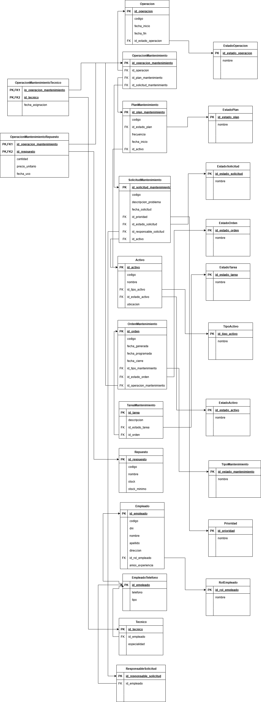

> [5. Diseño Lógico](../5.md) › [5.4.1. Módulo 4.1](5.4.1.md)

# 5.4.1. Módulo de Gestión de Mantenimiento Logístico

### Diagrama Relacional

### Diccionario de Datos

#### Tabla: Operacion
- **Descripción:** Registro general de cualquier actividad logística realizada en el sistema.  
- **Propósito:** Servir como entidad base para todas las operaciones especializadas del sistema.  
- **Reglas de Negocio:**  
  - Cada operación debe tener un código único.
  - Toda operación debe tener una fecha de inicio y un estado.

| **Columna** | **Descripción** | **Propósito** | **Tipo** | **NN** | **UK** | **FK** | **Ejemplo** |
|-------------|-----------------|---------------|----------|--------|--------|--------|-------------|
| id_operacion | Identificador único | PK UUID | CHAR(36) | Sí | Sí | No | 550e8400-e29b-41d4-a716-446655440005 |
| codigo | Código de operación | Identificación | VARCHAR(20) | Sí | Sí | No | OP-2025-001 |
| fecha_inicio | Fecha de inicio | Control temporal | DATETIME | Sí | No | No | 2025-09-27 14:30:00 |
| fecha_fin | Fecha de finalización | Control temporal | DATETIME | No | No | No | 2025-09-30 18:00:00 |
| id_estado_operacion | Estado actual | Seguimiento | CHAR(36) | Sí | No | Sí | 550e8400-e29b-41d4-a716-446655440009 |

**Índices:**
- PRIMARY KEY (id_operacion)
- UNIQUE KEY uk_codigo (codigo)
- FOREIGN KEY (id_estado_operacion) REFERENCES EstadoOperacion(id_estado_operacion)

---

#### Tabla: OperacionMantenimiento
- **Descripción:** Operación especializada en el mantenimiento de activos.  
- **Propósito:** Ejecutar tareas de mantenimiento planificadas o correctivas.  
- **Reglas de Negocio:**  
  - Hereda todos los atributos de Operación.
  - Puede estar asociada a un plan de mantenimiento o a una solicitud.

| **Columna** | **Descripción** | **Propósito** | **Tipo** | **NN** | **UK** | **FK** | **Ejemplo** |
|-------------|-----------------|---------------|----------|--------|--------|--------|-------------|
| id_operacion_mantenimiento | Identificador único | PK UUID | CHAR(36) | Sí | Sí | No | c60e8400-e29b-41d4-a716-446655440050 |
| id_operacion | Referencia a operación | Herencia | CHAR(36) | Sí | Sí | Sí | 550e8400-e29b-41d4-a716-446655440005 |
| id_plan_mantenimiento | Plan asociado | Relación | CHAR(36) | No | No | Sí | d60e8400-e29b-41d4-a716-446655440051 |
| id_solicitud_mantenimiento | Solicitud asociada | Relación | CHAR(36) | No | No | Sí | e60e8400-e29b-41d4-a716-446655440052 |

**Índices:**
- PRIMARY KEY (id_operacion_mantenimiento)
- UNIQUE KEY uk_operacion (id_operacion)
- FOREIGN KEY (id_operacion) REFERENCES Operacion(id_operacion)
- FOREIGN KEY (id_plan_mantenimiento) REFERENCES PlanMantenimiento(id_plan_mantenimiento)
- FOREIGN KEY (id_solicitud_mantenimiento) REFERENCES SolicitudMantenimiento(id_solicitud_mantenimiento)

---

#### Tabla: PlanMantenimiento
- **Descripción:** Documento que define periodicidad del mantenimiento.  
- **Propósito:** Asegurar continuidad y control sobre los activos.  
- **Reglas de Negocio:**  
  - Todo plan debe estar vinculado a un activo.
  - Define la frecuencia de mantenimiento.

| **Columna** | **Descripción** | **Propósito** | **Tipo** | **NN** | **UK** | **FK** | **Ejemplo** |
|-------------|-----------------|---------------|----------|--------|--------|--------|-------------|
| id_plan_mantenimiento | Identificador único | PK UUID | CHAR(36) | Sí | Sí | No | d60e8400-e29b-41d4-a716-446655440051 |
| codigo | Código del plan | Identificación | VARCHAR(20) | Sí | Sí | No | PM-2025 |
| id_estado_plan | Estado del plan | Control | CHAR(36) | Sí | No | Sí | f60e8400-e29b-41d4-a716-446655440053 |
| frecuencia | Periodicidad del plan | Seguimiento | VARCHAR(50) | Sí | No | No | Trimestral |
| fecha_inicio | Inicio del plan | Control | DATE | Sí | No | No | 2025-01-01 |
| id_activo | Activo asociado | Relación | CHAR(36) | Sí | No | Sí | z50e8400-e29b-41d4-a716-446655440047 |

**Índices:**
- PRIMARY KEY (id_plan_mantenimiento)
- UNIQUE KEY uk_codigo (codigo)
- FOREIGN KEY (id_estado_plan) REFERENCES EstadoPlan(id_estado_plan)
- FOREIGN KEY (id_activo) REFERENCES Activo(id_activo)

---

#### Tabla: SolicitudMantenimiento
- **Descripción:** Documento que solicita ejecución de mantenimiento correctivo.  
- **Propósito:** Formalizar peticiones de mantenimiento no planificado.  
- **Reglas de Negocio:**  
  - Debe ser creada por un ResponsableSolicitud.
  - Origina una OperacionMantenimiento.

| **Columna** | **Descripción** | **Propósito** | **Tipo** | **NN** | **UK** | **FK** | **Ejemplo** |
|-------------|-----------------|---------------|----------|--------|--------|--------|-------------|
| id_solicitud_mantenimiento | Identificador único | PK UUID | CHAR(36) | Sí | Sí | No | e60e8400-e29b-41d4-a716-446655440052 |
| codigo | Código de solicitud | Identificación | VARCHAR(20) | Sí | Sí | No | SOL-001 |
| descripcion_problema | Descripción del problema | Contexto | TEXT | Sí | No | No | Falla en motor |
| fecha_solicitud | Fecha de solicitud | Control | DATE | Sí | No | No | 2025-01-18 |
| id_prioridad | Nivel de urgencia | Control | CHAR(36) | Sí | No | Sí | g60e8400-e29b-41d4-a716-446655440054 |
| id_estado_solicitud | Estado de la solicitud | Seguimiento | CHAR(36) | Sí | No | Sí | h60e8400-e29b-41d4-a716-446655440055 |
| id_responsable_solicitud | Solicitante | Relación | CHAR(36) | Sí | No | Sí | i60e8400-e29b-41d4-a716-446655440056 |
| id_activo | Activo afectado | Relación | CHAR(36) | Sí | No | Sí | z50e8400-e29b-41d4-a716-446655440047 |

**Índices:**
- PRIMARY KEY (id_solicitud_mantenimiento)
- UNIQUE KEY uk_codigo (codigo)
- FOREIGN KEY (id_prioridad) REFERENCES Prioridad(id_prioridad)
- FOREIGN KEY (id_estado_solicitud) REFERENCES EstadoSolicitud(id_estado_solicitud)
- FOREIGN KEY (id_responsable_solicitud) REFERENCES ResponsableSolicitud(id_responsable_solicitud)
- FOREIGN KEY (id_activo) REFERENCES Activo(id_activo)

---

#### Tabla: Activo
- **Descripción:** Bien o recurso sujeto a mantenimiento.  
- **Propósito:** Mantener control y trazabilidad de activos físicos de la empresa.  
- **Reglas de Negocio:**  
  - Cada activo debe tener un código único.
  - Se especializa en: EquipoPortuario y Vehículo.

| **Columna** | **Descripción** | **Propósito** | **Tipo** | **NN** | **UK** | **FK** | **Ejemplo** |
|-------------|-----------------|---------------|----------|--------|--------|--------|-------------|
| id_activo | Identificador único | PK UUID | CHAR(36) | Sí | Sí | No | z50e8400-e29b-41d4-a716-446655440047 |
| codigo | Código del activo | Identificación | VARCHAR(20) | Sí | Sí | No | ACT-001 |
| nombre | Nombre del activo | Identificación | VARCHAR(100) | Sí | No | No | Montacargas Toyota |
| id_tipo_activo | Tipo de activo | Clasificación | CHAR(36) | Sí | No | Sí | j60e8400-e29b-41d4-a716-446655440057 |
| id_estado_activo | Estado del activo | Seguimiento | CHAR(36) | Sí | No | Sí | k60e8400-e29b-41d4-a716-446655440058 |
| ubicacion | Ubicación física | Localización | VARCHAR(100) | No | No | No | Almacén 3 |

**Índices:**
- PRIMARY KEY (id_activo)
- UNIQUE KEY uk_codigo (codigo)
- FOREIGN KEY (id_tipo_activo) REFERENCES TipoActivo(id_tipo_activo)
- FOREIGN KEY (id_estado_activo) REFERENCES EstadoActivo(id_estado_activo)

---

#### Tabla: OrdenMantenimiento
- **Descripción:** Documento de trabajo específico para ejecutar mantenimiento.  
- **Propósito:** Detallar tareas, repuestos y técnicos asignados.  
- **Reglas de Negocio:**  
  - Documenta una OperacionMantenimiento.
  - Tiene estado y fechas de ejecución.

| **Columna** | **Descripción** | **Propósito** | **Tipo** | **NN** | **UK** | **FK** | **Ejemplo** |
|-------------|-----------------|---------------|----------|--------|--------|--------|-------------|
| id_orden | Identificador único | PK UUID | CHAR(36) | Sí | Sí | No | l60e8400-e29b-41d4-a716-446655440059 |
| codigo | Código de orden | Identificación | VARCHAR(20) | Sí | Sí | No | ORD-001 |
| fecha_generada | Fecha de creación | Control | DATE | Sí | No | No | 2025-01-20 |
| fecha_programada | Fecha planificada | Planificación | DATE | No | No | No | 2025-01-25 |
| fecha_cierre | Fecha de cierre | Control | DATE | No | No | No | 2025-01-26 |
| id_tipo_mantenimiento | Tipo de mantenimiento | Clasificación | CHAR(36) | Sí | No | Sí | m60e8400-e29b-41d4-a716-446655440060 |
| id_estado_orden | Estado de la orden | Seguimiento | CHAR(36) | Sí | No | Sí | n60e8400-e29b-41d4-a716-446655440061 |
| id_operacion_mantenimiento | Operación asociada | Relación | CHAR(36) | Sí | No | Sí | c60e8400-e29b-41d4-a716-446655440050 |

**Índices:**
- PRIMARY KEY (id_orden)
- UNIQUE KEY uk_codigo (codigo)
- FOREIGN KEY (id_tipo_mantenimiento) REFERENCES TipoMantenimiento(id_tipo_mantenimiento)
- FOREIGN KEY (id_estado_orden) REFERENCES EstadoOrden(id_estado_orden)
- FOREIGN KEY (id_operacion_mantenimiento) REFERENCES OperacionMantenimiento(id_operacion_mantenimiento)

---

#### Tabla: TareaMantenimiento
- **Descripción:** Tarea específica dentro de una orden de mantenimiento.  
- **Propósito:** Desglosar el trabajo en actividades concretas.  
- **Reglas de Negocio:**  
  - Pertenece a una orden de mantenimiento.
  - Tiene descripción y estado propio.

| **Columna** | **Descripción** | **Propósito** | **Tipo** | **NN** | **UK** | **FK** | **Ejemplo** |
|-------------|-----------------|---------------|----------|--------|--------|--------|-------------|
| id_tarea | Identificador único | PK UUID | CHAR(36) | Sí | Sí | No | o60e8400-e29b-41d4-a716-446655440062 |
| descripcion | Descripción de la tarea | Especificación | TEXT | Sí | No | No | Cambiar filtro de aceite |
| id_estado_tarea | Estado de la tarea | Seguimiento | CHAR(36) | Sí | No | Sí | p60e8400-e29b-41d4-a716-446655440063 |
| id_orden | Orden asociada | Relación | CHAR(36) | Sí | No | Sí | l60e8400-e29b-41d4-a716-446655440059 |

**Índices:**
- PRIMARY KEY (id_tarea)
- FOREIGN KEY (id_estado_tarea) REFERENCES EstadoTarea(id_estado_tarea)
- FOREIGN KEY (id_orden) REFERENCES OrdenMantenimiento(id_orden)

---

#### Tabla: Repuesto
- **Descripción:** Piezas necesarias para realizar mantenimiento.  
- **Propósito:** Gestionar el inventario de repuestos.  
- **Reglas de Negocio:**  
  - El stock no debe ser menor al stock mínimo.

| **Columna** | **Descripción** | **Propósito** | **Tipo** | **NN** | **UK** | **FK** | **Ejemplo** |
|-------------|-----------------|---------------|----------|--------|--------|--------|-------------|
| id_repuesto | Identificador único | PK UUID | CHAR(36) | Sí | Sí | No | q60e8400-e29b-41d4-a716-446655440064 |
| codigo | Código del repuesto | Identificación | VARCHAR(20) | Sí | Sí | No | REP-001 |
| nombre | Nombre del repuesto | Identificación | VARCHAR(100) | Sí | No | No | Filtro aceite |
| stock | Cantidad disponible | Control | INT | Sí | No | No | 50 |
| stock_minimo | Cantidad mínima | Control | INT | Sí | No | No | 10 |

**Índices:**
- PRIMARY KEY (id_repuesto)
- UNIQUE KEY uk_codigo (codigo)

---

#### Tabla: Empleado
- **Descripción:** Persona que trabaja en la empresa de logística.  
- **Propósito:** Gestionar el personal y sus roles en las operaciones del sistema.  
- **Reglas de Negocio:**  
  - Cada empleado debe tener un código único.
  - El DNI debe ser único en el sistema.

| **Columna** | **Descripción** | **Propósito** | **Tipo** | **NN** | **UK** | **FK** | **Ejemplo** |
|-------------|-----------------|---------------|----------|--------|--------|--------|-------------|
| id_empleado | Identificador único del empleado | PK UUID | CHAR(36) | Sí | Sí | No | a50e8400-e29b-41d4-a716-446655440021 |
| codigo | Código del empleado | Identificación | VARCHAR(20) | Sí | Sí | No | EMP-001 |
| dni | Documento de identidad | Identificación legal | CHAR(8) | Sí | Sí | No | 87654321 |
| nombre | Nombre del empleado | Identificación | VARCHAR(100) | Sí | No | No | Juan |
| apellido | Apellido del empleado | Identificación | VARCHAR(100) | Sí | No | No | Pérez |
| direccion | Dirección de residencia | Ubicación | VARCHAR(200) | No | No | No | Av. Marina 123 |
| id_especialidad_empleado | Especialidad del empleado | Clasificación | CHAR(36) | Sí | No | Sí | b50e8400-e29b-41d4-a716-446655440022 |
| anios_experiencia | Años de experiencia laboral | Evaluación | INT | No | No | No | 5 |
| id_contrato | Contrato laboral del empleado | Relación laboral | CHAR(36) | Sí | Sí | Sí | c50e8400-e29b-41d4-a716-446655440023 |

**Índices:**
- PRIMARY KEY (id_empleado)
- UNIQUE KEY uk_codigo (codigo)
- UNIQUE KEY uk_dni (dni)
- UNIQUE KEY uk_contrato (id_contrato)
- FOREIGN KEY (id_especialidad_empleado) REFERENCES EspecialidadEmpleado(id_especialidad_empleado)
- FOREIGN KEY (id_contrato) REFERENCES Contrato(id_contrato)

---

#### Tabla: EmpleadoTelefono
- **Descripción:** Números de teléfono asociados a empleados.  
- **Propósito:** Permitir que un empleado tenga múltiples números de contacto.  
- **Reglas de Negocio:**  
  - Un empleado puede tener cero o más teléfonos.

| **Columna** | **Descripción** | **Propósito** | **Tipo** | **NN** | **UK** | **FK** | **Ejemplo** |
|-------------|-----------------|---------------|----------|--------|--------|--------|-------------|
| id_empleado_telefono | Identificador único | PK UUID | CHAR(36) | Sí | Sí | No | 850e8400-e29b-41d4-a716-446655440020 |
| id_empleado | Referencia al empleado | Relación | CHAR(36) | Sí | No | Sí | a50e8400-e29b-41d4-a716-446655440021 |
| telefono | Número de teléfono | Contacto | VARCHAR(20) | Sí | No | No | 987654321 |
| id_tipo_telefono | Tipo de teléfono | Clasificación | CHAR(36) | No | No | Sí | 950e8400-e29b-41d4-a716-446655440021 |

**Índices:**
- PRIMARY KEY (id_empleado_telefono)
- UNIQUE KEY uk_empleado_telefono (id_empleado, telefono)
- FOREIGN KEY (id_empleado) REFERENCES Empleado(id_empleado)
- FOREIGN KEY (id_tipo_telefono) REFERENCES TipoTelefono(id_tipo_telefono)

---

#### Tabla: Tecnico
- **Descripción:** Empleado especializado en tareas de mantenimiento técnico.  
- **Propósito:** Ejecutar operaciones de mantenimiento de activos.  
- **Reglas de Negocio:**  
  - Hereda todos los atributos de Empleado.
  - Debe tener al menos una certificación técnica.

| **Columna** | **Descripción** | **Propósito** | **Tipo** | **NN** | **UK** | **FK** | **Ejemplo** |
|-------------|-----------------|---------------|----------|--------|--------|--------|-------------|
| id_tecnico | Identificador único | PK UUID | CHAR(36) | Sí | Sí | No | r60e8400-e29b-41d4-a716-446655440065 |
| id_empleado | Referencia a empleado | Herencia | CHAR(36) | Sí | Sí | Sí | a50e8400-e29b-41d4-a716-446655440021 |
| especialidad | Área técnica | Clasificación | VARCHAR(100) | Sí | No | No | Mecánica |

**Índices:**
- PRIMARY KEY (id_tecnico)
- UNIQUE KEY uk_empleado (id_empleado)
- FOREIGN KEY (id_empleado) REFERENCES Empleado(id_empleado)

---

#### Tabla: ResponsableSolicitud
- **Descripción:** Empleado que solicita la ejecución de operaciones de mantenimiento.  
- **Propósito:** Formalizar el inicio de operaciones de mantenimiento.  
- **Reglas de Negocio:**  
  - Hereda todos los atributos de Empleado.
  - Puede solicitar múltiples operaciones de mantenimiento.

| **Columna** | **Descripción** | **Propósito** | **Tipo** | **NN** | **UK** | **FK** | **Ejemplo** |
|-------------|-----------------|---------------|----------|--------|--------|--------|-------------|
| id_responsable_solicitud | Identificador único | PK UUID | CHAR(36) | Sí | Sí | No | i60e8400-e29b-41d4-a716-446655440056 |
| id_empleado | Referencia a empleado | Herencia | CHAR(36) | Sí | Sí | Sí | a50e8400-e29b-41d4-a716-446655440021 |

**Índices:**
- PRIMARY KEY (id_responsable_solicitud)
- UNIQUE KEY uk_empleado (id_empleado)
- FOREIGN KEY (id_empleado) REFERENCES Empleado(id_empleado)

---

### Tablas Asociativas

#### Tabla: OperacionMantenimientoTecnico
- **Descripción:** Asignación de técnicos a operaciones de mantenimiento.  
- **Propósito:** Controlar qué técnicos ejecutan cada mantenimiento.  
- **Reglas de Negocio:**  
  - Una operación puede requerir múltiples técnicos.

| **Columna** | **Descripción** | **Propósito** | **Tipo** | **NN** | **UK** | **FK** | **Ejemplo** |
|-------------|-----------------|---------------|----------|--------|--------|--------|-------------|
| id_operacion_mantenimiento | Referencia a operación | Relación | CHAR(36) | Sí | No | Sí | c60e8400-e29b-41d4-a716-446655440050 |
| id_tecnico | Referencia a técnico | Relación | CHAR(36) | Sí | No | Sí | r60e8400-e29b-41d4-a716-446655440065 |
| fecha_asignacion | Fecha de asignación | Control | DATE | Sí | No | No | 2025-01-22 |

**Índices:**
- PRIMARY KEY (id_operacion_mantenimiento, id_tecnico)
- FOREIGN KEY (id_operacion_mantenimiento) REFERENCES OperacionMantenimiento(id_operacion_mantenimiento)
- FOREIGN KEY (id_tecnico) REFERENCES Tecnico(id_tecnico)

---

#### Tabla: OperacionMantenimientoRepuesto
- **Descripción:** Repuestos utilizados en operaciones de mantenimiento.  
- **Propósito:** Controlar consumo de repuestos y costos.  
- **Reglas de Negocio:**  
  - Una operación puede usar múltiples repuestos.
  - Registra precio al momento de uso (histórico).

| **Columna** | **Descripción** | **Propósito** | **Tipo** | **NN** | **UK** | **FK** | **Ejemplo** |
|-------------|-----------------|---------------|----------|--------|--------|--------|-------------|
| id_operacion_mantenimiento | Referencia a operación | Relación | CHAR(36) | Sí | No | Sí | c60e8400-e29b-41d4-a716-446655440050 |
| id_repuesto | Referencia a repuesto | Relación | CHAR(36) | Sí | No | Sí | q60e8400-e29b-41d4-a716-446655440064 |
| cantidad | Cantidad utilizada | Control | INT | Sí | No | No | 2 |
| precio_unitario | Precio al momento de uso | Financiero | DECIMAL(10,2) | Sí | No | No | 45.50 |
| fecha_uso | Fecha de uso | Control | DATE | Sí | No | No | 2025-01-25 |

**Índices:**
- PRIMARY KEY (id_operacion_mantenimiento, id_repuesto, fecha_uso)
- FOREIGN KEY (id_operacion_mantenimiento) REFERENCES OperacionMantenimiento(id_operacion_mantenimiento)
- FOREIGN KEY (id_repuesto) REFERENCES Repuesto(id_repuesto)

---

### Tablas de Dominio (Lookup Tables)

#### Tabla: EstadoOperacion
- **Descripción:** Catálogo de estados posibles para operaciones.  
- **Propósito:** Normalizar el estado de las operaciones.

| **Columna** | **Descripción** | **Propósito** | **Tipo** | **NN** | **UK** | **FK** | **Ejemplo** |
|-------------|-----------------|---------------|----------|--------|--------|--------|-------------|
| id_estado_operacion | Identificador único | PK UUID | CHAR(36) | Sí | Sí | No | 550e8400-e29b-41d4-a716-446655440009 |
| nombre | Nombre del estado | Clasificación | VARCHAR(50) | Sí | No | No | En curso |

**Índices:**
- PRIMARY KEY (id_estado_operacion)

**Valores típicos:**
- En curso
- Completada
- Cancelada
- Pendiente

---

#### Tabla: EstadoPlan
- **Descripción:** Catálogo de estados posibles para planes de mantenimiento.  
- **Propósito:** Normalizar el estado de los planes.

| **Columna** | **Descripción** | **Propósito** | **Tipo** | **NN** | **UK** | **FK** | **Ejemplo** |
|-------------|-----------------|---------------|----------|--------|--------|--------|-------------|
| id_estado_plan | Identificador único | PK UUID | CHAR(36) | Sí | Sí | No | f60e8400-e29b-41d4-a716-446655440053 |
| nombre | Nombre del estado | Clasificación | VARCHAR(50) | Sí | No | No | Activo |

**Índices:**
- PRIMARY KEY (id_estado_plan)

**Valores típicos:**
- Activo
- Suspendido
- Completado
- Cancelado

---

#### Tabla: EstadoSolicitud
- **Descripción:** Catálogo de estados de solicitudes de mantenimiento.  
- **Propósito:** Normalizar el estado de las solicitudes.

| **Columna** | **Descripción** | **Propósito** | **Tipo** | **NN** | **UK** | **FK** | **Ejemplo** |
|-------------|-----------------|---------------|----------|--------|--------|--------|-------------|
| id_estado_solicitud | Identificador único | PK UUID | CHAR(36) | Sí | Sí | No | h60e8400-e29b-41d4-a716-446655440055 |
| nombre | Nombre del estado | Clasificación | VARCHAR(50) | Sí | No | No | Pendiente |

**Índices:**
- PRIMARY KEY (id_estado_solicitud)

**Valores típicos:**
- Pendiente
- Aprobada
- Rechazada
- En ejecución

---

#### Tabla: EstadoOrden
- **Descripción:** Catálogo de estados de órdenes de mantenimiento.  
- **Propósito:** Normalizar el estado de las órdenes.

| **Columna** | **Descripción** | **Propósito** | **Tipo** | **NN** | **UK** | **FK** | **Ejemplo** |
|-------------|-----------------|---------------|----------|--------|--------|--------|-------------|
| id_estado_orden | Identificador único | PK UUID | CHAR(36) | Sí | Sí | No | n60e8400-e29b-41d4-a716-446655440061 |
| nombre | Nombre del estado | Clasificación | VARCHAR(50) | Sí | No | No | Abierta |

**Índices:**
- PRIMARY KEY (id_estado_orden)

**Valores típicos:**
- Abierta
- En ejecución
- Completada
- Cancelada

---

#### Tabla: EstadoTarea
- **Descripción:** Catálogo de estados de tareas de mantenimiento.  
- **Propósito:** Normalizar el estado de las tareas.

| **Columna** | **Descripción** | **Propósito** | **Tipo** | **NN** | **UK** | **FK** | **Ejemplo** |
|-------------|-----------------|---------------|----------|--------|--------|--------|-------------|
| id_estado_tarea | Identificador único | PK UUID | CHAR(36) | Sí | Sí | No | p60e8400-e29b-41d4-a716-446655440063 |
| nombre | Nombre del estado | Clasificación | VARCHAR(50) | Sí | No | No | Pendiente |

**Índices:**
- PRIMARY KEY (id_estado_tarea)

**Valores típicos:**
- Pendiente
- En progreso
- Completada
- Cancelada

---

#### Tabla: TipoActivo
- **Descripción:** Catálogo de tipos de activos.  
- **Propósito:** Clasificar activos según su naturaleza.

| **Columna** | **Descripción** | **Propósito** | **Tipo** | **NN** | **UK** | **FK** | **Ejemplo** |
|-------------|-----------------|---------------|----------|--------|--------|--------|-------------|
| id_tipo_activo | Identificador único | PK UUID | CHAR(36) | Sí | Sí | No | j60e8400-e29b-41d4-a716-446655440057 |
| nombre | Nombre del tipo | Clasificación | VARCHAR(50) | Sí | No | No | Equipo portuario |

**Índices:**
- PRIMARY KEY (id_tipo_activo)

**Valores típicos:**
- Equipo portuario
- Vehículo
- Infraestructura
- Herramienta

---

#### Tabla: EstadoActivo
- **Descripción:** Catálogo de estados operativos de activos.  
- **Propósito:** Normalizar el estado de los activos.

| **Columna** | **Descripción** | **Propósito** | **Tipo** | **NN** | **UK** | **FK** | **Ejemplo** |
|-------------|-----------------|---------------|----------|--------|--------|--------|-------------|
| id_estado_activo | Identificador único | PK UUID | CHAR(36) | Sí | Sí | No | k60e8400-e29b-41d4-a716-446655440058 |
| nombre | Nombre del estado | Clasificación | VARCHAR(50) | Sí | No | No | Operativo |

**Índices:**
- PRIMARY KEY (id_estado_activo)

**Valores típicos:**
- Operativo
- En mantenimiento
- Fuera de servicio
- Dado de baja

---

#### Tabla: TipoMantenimiento
- **Descripción:** Catálogo de tipos de mantenimiento.  
- **Propósito:** Clasificar mantenimientos según su naturaleza.

| **Columna** | **Descripción** | **Propósito** | **Tipo** | **NN** | **UK** | **FK** | **Ejemplo** |
|-------------|-----------------|---------------|----------|--------|--------|--------|-------------|
| id_tipo_mantenimiento | Identificador único | PK UUID | CHAR(36) | Sí | Sí | No | m60e8400-e29b-41d4-a716-446655440060 |
| nombre | Nombre del tipo | Clasificación | VARCHAR(50) | Sí | No | No | Preventivo |

**Índices:**
- PRIMARY KEY (id_tipo_mantenimiento)

**Valores típicos:**
- Preventivo
- Correctivo
- Predictivo
- Emergencia

---

#### Tabla: Prioridad
- **Descripción:** Catálogo de niveles de prioridad.  
- **Propósito:** Clasificar urgencia de solicitudes.

| **Columna** | **Descripción** | **Propósito** | **Tipo** | **NN** | **UK** | **FK** | **Ejemplo** |
|-------------|-----------------|---------------|----------|--------|--------|--------|-------------|
| id_prioridad | Identificador único | PK UUID | CHAR(36) | Sí | Sí | No | g60e8400-e29b-41d4-a716-446655440054 |
| nombre | Nombre de la prioridad | Clasificación | VARCHAR(50) | Sí | No | No | Baja |

**Índices:**
- PRIMARY KEY (id_prioridad)

**Valores típicos:**
- Baja
- Media
- Alta
- Crítica

---

#### Tabla: EspecialidadEmpleado
- **Descripción:** Catálogo de roles operativos para empleados.
- **Propósito:** Clasificar empleados según su función.

| **Columna** | **Descripción** | **Propósito** | **Tipo** | **NN** | **UK** | **FK** | **Ejemplo** |
|-------------|-----------------|---------------|----------|--------|--------|--------|-------------|
| id_especialidad_empleado | Identificador único | PK UUID | CHAR(36) | Sí | Sí | No | b50e8400-e29b-41d4-a716-446655440022 |
| nombre | Nombre del rol | Clasificación | VARCHAR(50) | Sí | No | No | Supervisor |

**Índices:**
- PRIMARY KEY (id_especialidad_empleado)

**Valores típicos:**
- Supervisor
- Operario
- Administrativo
- Técnico
- Gerente

---

#### Tabla: Contrato
- **Descripción:** Acuerdo formal entre las partes para la prestación de servicios logísticos.
- **Propósito:** Gestionar los contratos comerciales y sus condiciones.
- **Reglas de Negocio:**
  - Cada contrato debe tener un código único.
  - Un contrato debe tener una fecha de emisión y vencimiento.
  - El estado del contrato determina su validez operativa.

| **Columna** | **Descripción** | **Propósito** | **Tipo** | **NN** | **UK** | **FK** | **Ejemplo** |
|-------------|-----------------|---------------|----------|--------|--------|--------|-------------|
| id_contrato | Identificador único del contrato | PK UUID | CHAR(36) | Sí | Sí | No | c50e8400-e29b-41d4-a716-446655440023 |
| fecha_emision | Fecha de creación del contrato | Registro temporal | DATE | Sí | No | No | 2025-01-15 |
| fecha_vencimiento | Fecha de finalización del contrato | Control temporal | DATE | Sí | No | No | 2026-01-15 |
| id_estado_contrato | Estado actual del contrato | Seguimiento | CHAR(36) | Sí | No | Sí | 250e8400-e29b-41d4-a716-446655440045 |

**Índices:**
- PRIMARY KEY (id_contrato)
- FOREIGN KEY (id_estado_contrato) REFERENCES EstadoContrato(id_estado_contrato)

---

#### Tabla: EstadoContrato
- **Descripción:** Catálogo de estados posibles para contratos.
- **Propósito:** Normalizar el estado de los contratos.

| **Columna** | **Descripción** | **Propósito** | **Tipo** | **NN** | **UK** | **FK** | **Ejemplo** |
|-------------|-----------------|---------------|----------|--------|--------|--------|-------------|
| id_estado_contrato | Identificador único | PK UUID | CHAR(36) | Sí | Sí | No | 250e8400-e29b-41d4-a716-446655440045 |
| nombre | Nombre del estado | Clasificación | VARCHAR(50) | Sí | No | No | Vigente |

**Índices:**
- PRIMARY KEY (id_estado_contrato)

**Valores típicos:**
- Vigente
- Vencido
- Cancelado

---

#### Tabla: TipoTelefono
- **Descripción:** Catálogo de estados posibles para lineas moviles de telefono.
- **Propósito:** Normalizar el estado de los tipos de linea de telefono.

| **Columna** | **Descripción** | **Propósito** | **Tipo** | **NN** | **UK** | **FK** | **Ejemplo** |
|-------------|-----------------|---------------|----------|--------|--------|--------|-------------|
| id_tipo_telefono | Identificador único | PK UUID | CHAR(36) | Sí | Sí | No | 950e8400-e29b-41d4-a716-446655440021 |
| nombre | Nombre del estado | Clasificación | VARCHAR(50) | Sí | No | No | Fijo |

**Índices:**
- PRIMARY KEY (id_tipo_telefono)

**Valores típicos:**
- Fijo
- Móvil
- Corporativo

---

[⬅️ Anterior](../../5.4/5.4.md) | [🏠 Home](../../../README.md) | [Siguiente ➡️](../../5.5/5.5.md)