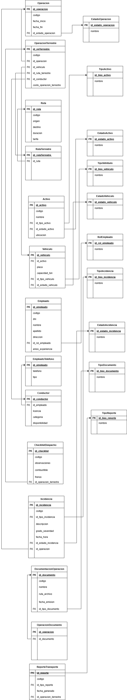

> [5. Diseño Lógico](../5.md) › [5.4. Módulo 4](5.4.md)

# 5.4. Módulo de Gestión de Operaciones Terrestres

### Diagrama Relacional

### Diccionario de Datos

#### Tabla: Operacion
- **Descripción:** Registro general de cualquier actividad logística realizada en el sistema.  
- **Propósito:** Servir como entidad base para todas las operaciones especializadas del sistema.  
- **Reglas de Negocio:**  
  - Cada operación debe tener un código único.
  - Toda operación debe tener una fecha de inicio y un estado.
  - Se especializa en: Operación Terrestre, Operación Marítima, Operación Portuaria, Operación Mantenimiento, Operación Monitoreo y Operación Embarque.

| **Columna** | **Descripción** | **Propósito** | **Tipo** | **NN** | **UK** | **FK** | **Ejemplo** |
|-------------|-----------------|---------------|----------|--------|--------|--------|-------------|
| id_operacion | Identificador único | PK UUID | CHAR(36) | Sí | Sí | No | 550e8400-e29b-41d4-a716-446655440005 |
| codigo | Código de operación | Identificación | VARCHAR(20) | Sí | Sí | No | OP-2025-001 |
| fecha_inicio | Fecha de inicio | Control temporal | DATETIME | Sí | No | No | 2025-09-27 14:30:00 |
| fecha_fin | Fecha de finalización | Control temporal | DATETIME | No | No | No | 2025-09-30 18:00:00 |
| id_estado_operacion | Estado actual | Seguimiento | CHAR(36) | Sí | No | Sí | 550e8400-e29b-41d4-a716-446655440009 |

**Índices:**
- PRIMARY KEY (id_operacion)
- UNIQUE KEY uk_codigo (codigo)
- FOREIGN KEY (id_estado_operacion) REFERENCES EstadoOperacion(id_estado_operacion)

---

#### Tabla: OperacionTerrestre
- **Descripción:** Operación logística especializada en transporte terrestre.  
- **Propósito:** Gestionar operaciones de transporte por carretera.  
- **Reglas de Negocio:**  
  - Hereda todos los atributos de Operación.
  - Requiere vehículo, ruta terrestre y conductor asignados.

| **Columna** | **Descripción** | **Propósito** | **Tipo** | **NN** | **UK** | **FK** | **Ejemplo** |
|-------------|-----------------|---------------|----------|--------|--------|--------|-------------|
| id_operacion_terrestre | Identificador único | PK UUID | CHAR(36) | Sí | Sí | No | b7e2c8b4-3d61-4e99-9d0f-1a2b3c4d5e6f |
| id_operacion | Referencia a operación | Herencia | CHAR(36) | Sí | Sí | Sí | 550e8400-e29b-41d4-a716-446655440005 |
| codigo | Código de operación terrestre | Identificación | VARCHAR(20) | Sí | Sí | No | OT-2025-001 |
| id_vehiculo | Vehículo asignado | Relación | CHAR(36) | Sí | No | Sí | y50e8400-e29b-41d4-a716-446655440046 |
| id_ruta_terrestre | Ruta terrestre | Relación | CHAR(36) | Sí | No | Sí | 350e8400-e29b-41d4-a716-446655440030 |
| id_conductor | Conductor asignado | Relación | CHAR(36) | Sí | No | Sí | d50e8400-e29b-41d4-a716-446655440024 |
| costo_operacion_terrestre | Costo del transporte | Financiero | DECIMAL(10,2) | Sí | No | No | 1200.50 |

**Índices:**
- PRIMARY KEY (id_operacion_terrestre)
- UNIQUE KEY uk_operacion (id_operacion)
- UNIQUE KEY uk_codigo (codigo)
- FOREIGN KEY (id_operacion) REFERENCES Operacion(id_operacion)
- FOREIGN KEY (id_vehiculo) REFERENCES Vehiculo(id_vehiculo)
- FOREIGN KEY (id_ruta_terrestre) REFERENCES RutaTerrestre(id_ruta_terrestre)
- FOREIGN KEY (id_conductor) REFERENCES Conductor(id_conductor)

---

#### Tabla: Ruta
- **Descripción:** Trayecto predefinido entre un punto de origen y un punto de destino.  
- **Propósito:** Planificar y dar seguimiento a los viajes y traslados.  
- **Reglas de Negocio:**  
  - Cada ruta debe tener un código único.
  - Se especializa en: Ruta Marítima y Ruta Terrestre.

| **Columna** | **Descripción** | **Propósito** | **Tipo** | **NN** | **UK** | **FK** | **Ejemplo** |
|-------------|-----------------|---------------|----------|--------|--------|--------|-------------|
| id_ruta | Identificador único | PK UUID | CHAR(36) | Sí | Sí | No | 250e8400-e29b-41d4-a716-446655440029 |
| codigo | Código de ruta | Identificación | VARCHAR(20) | Sí | Sí | No | RUT-001 |
| origen | Lugar de origen | Logística | VARCHAR(100) | Sí | No | No | Callao |
| destino | Lugar de destino | Logística | VARCHAR(100) | Sí | No | No | Hamburgo |
| duracion | Duración en días | Planificación | INT | Sí | No | No | 25 |
| tarifa | Tarifa base | Financiero | DECIMAL(10,2) | Sí | No | No | 5000.00 |

**Índices:**
- PRIMARY KEY (id_ruta)
- UNIQUE KEY uk_codigo (codigo)

---

#### Tabla: RutaTerrestre
- **Descripción:** Ruta especializada en trayectos terrestres por carretera.  
- **Propósito:** Detallar características del trayecto carretero.  
- **Reglas de Negocio:**  
  - Hereda todos los atributos de Ruta.
  - Puede registrar incidencias durante el trayecto.

| **Columna** | **Descripción** | **Propósito** | **Tipo** | **NN** | **UK** | **FK** | **Ejemplo** |
|-------------|-----------------|---------------|----------|--------|--------|--------|-------------|
| id_ruta_terrestre | Identificador único | PK UUID | CHAR(36) | Sí | Sí | No | 350e8400-e29b-41d4-a716-446655440030 |
| id_ruta | Referencia a ruta | Herencia | CHAR(36) | Sí | Sí | Sí | 250e8400-e29b-41d4-a716-446655440029 |

**Índices:**
- PRIMARY KEY (id_ruta_terrestre)
- UNIQUE KEY uk_ruta (id_ruta)
- FOREIGN KEY (id_ruta) REFERENCES Ruta(id_ruta)

---

#### Tabla: Activo
- **Descripción:** Bien o recurso sujeto a mantenimiento.  
- **Propósito:** Mantener control y trazabilidad de activos físicos de la empresa.  
- **Reglas de Negocio:**  
  - Cada activo debe tener un código único.
  - Se especializa en: EquipoPortuario y Vehículo.

| **Columna** | **Descripción** | **Propósito** | **Tipo** | **NN** | **UK** | **FK** | **Ejemplo** |
|-------------|-----------------|---------------|----------|--------|--------|--------|-------------|
| id_activo | Identificador único | PK UUID | CHAR(36) | Sí | Sí | No | z50e8400-e29b-41d4-a716-446655440047 |
| codigo | Código del activo | Identificación | VARCHAR(20) | Sí | Sí | No | ACT-001 |
| nombre | Nombre del activo | Identificación | VARCHAR(100) | Sí | No | No | Montacargas Toyota |
| id_tipo_activo | Tipo de activo | Clasificación | CHAR(36) | Sí | No | Sí | j60e8400-e29b-41d4-a716-446655440057 |
| id_estado_activo | Estado del activo | Seguimiento | CHAR(36) | Sí | No | Sí | k60e8400-e29b-41d4-a716-446655440058 |
| ubicacion | Ubicación física | Localización | VARCHAR(100) | No | No | No | Almacén 3 |

**Índices:**
- PRIMARY KEY (id_activo)
- UNIQUE KEY uk_codigo (codigo)
- FOREIGN KEY (id_tipo_activo) REFERENCES TipoActivo(id_tipo_activo)
- FOREIGN KEY (id_estado_activo) REFERENCES EstadoActivo(id_estado_activo)

---

#### Tabla: Vehiculo
- **Descripción:** Medio de transporte utilizado en operaciones terrestres.  
- **Propósito:** Permitir traslado de carga por carretera.  
- **Reglas de Negocio:**  
  - Hereda de Activo (código, nombre, estado, ubicación).
  - Cada vehículo debe tener placa única.

| **Columna** | **Descripción** | **Propósito** | **Tipo** | **NN** | **UK** | **FK** | **Ejemplo** |
|-------------|-----------------|---------------|----------|--------|--------|--------|-------------|
| id_vehiculo | Identificador único | PK UUID | CHAR(36) | Sí | Sí | No | y50e8400-e29b-41d4-a716-446655440046 |
| id_activo | Referencia a activo | Herencia | CHAR(36) | Sí | Sí | Sí | z50e8400-e29b-41d4-a716-446655440047 |
| placa | Placa del vehículo | Identificación legal | VARCHAR(20) | Sí | Sí | No | ABC-123 |
| capacidad_ton | Capacidad en toneladas | Control | DECIMAL(10,2) | Sí | No | No | 25.00 |
| id_tipo_vehiculo | Tipo de vehículo | Clasificación | CHAR(36) | Sí | No | Sí | a60e8400-e29b-41d4-a716-446655440048 |
| id_estado_vehiculo | Estado operativo | Seguimiento | CHAR(36) | Sí | No | Sí | b60e8400-e29b-41d4-a716-446655440049 |

**Índices:**
- PRIMARY KEY (id_vehiculo)
- UNIQUE KEY uk_activo (id_activo)
- UNIQUE KEY uk_placa (placa)
- FOREIGN KEY (id_activo) REFERENCES Activo(id_activo)
- FOREIGN KEY (id_tipo_vehiculo) REFERENCES TipoVehiculo(id_tipo_vehiculo)
- FOREIGN KEY (id_estado_vehiculo) REFERENCES EstadoVehiculo(id_estado_vehiculo)

---

#### Tabla: Empleado
- **Descripción:** Persona que trabaja en la empresa de logística.  
- **Propósito:** Gestionar el personal y sus roles en las operaciones del sistema.  
- **Reglas de Negocio:**  
  - Cada empleado debe tener un código único.
  - El DNI debe ser único en el sistema.

| **Columna** | **Descripción** | **Propósito** | **Tipo** | **NN** | **UK** | **FK** | **Ejemplo** |
|-------------|-----------------|---------------|----------|--------|--------|--------|-------------|
| id_empleado | Identificador único del empleado | PK UUID | CHAR(36) | Sí | Sí | No | a50e8400-e29b-41d4-a716-446655440021 |
| codigo | Código del empleado | Identificación | VARCHAR(20) | Sí | Sí | No | EMP-001 |
| dni | Documento de identidad | Identificación legal | CHAR(8) | Sí | Sí | No | 87654321 |
| nombre | Nombre del empleado | Identificación | VARCHAR(100) | Sí | No | No | Juan |
| apellido | Apellido del empleado | Identificación | VARCHAR(100) | Sí | No | No | Pérez |
| direccion | Dirección de residencia | Ubicación | VARCHAR(200) | No | No | No | Av. Marina 123 |
| id_especialidad_empleado | Especialidad del empleado | Clasificación | CHAR(36) | Sí | No | Sí | b50e8400-e29b-41d4-a716-446655440022 |
| anios_experiencia | Años de experiencia laboral | Evaluación | INT | No | No | No | 5 |
| id_contrato | Contrato laboral del empleado | Relación laboral | CHAR(36) | Sí | Sí | Sí | c50e8400-e29b-41d4-a716-446655440023 |

**Índices:**
- PRIMARY KEY (id_empleado)
- UNIQUE KEY uk_codigo (codigo)
- UNIQUE KEY uk_dni (dni)
- UNIQUE KEY uk_contrato (id_contrato)
- FOREIGN KEY (id_especialidad_empleado) REFERENCES EspecialidadEmpleado(id_especialidad_empleado)
- FOREIGN KEY (id_contrato) REFERENCES Contrato(id_contrato)

---

#### Tabla: EmpleadoTelefono
- **Descripción:** Números de teléfono asociados a empleados.  
- **Propósito:** Permitir que un empleado tenga múltiples números de contacto.  
- **Reglas de Negocio:**  
  - Un empleado puede tener cero o más teléfonos.

| **Columna** | **Descripción** | **Propósito** | **Tipo** | **NN** | **UK** | **FK** | **Ejemplo** |
|-------------|-----------------|---------------|----------|--------|--------|--------|-------------|
| id_empleado_telefono | Identificador único | PK UUID | CHAR(36) | Sí | Sí | No | 850e8400-e29b-41d4-a716-446655440020 |
| id_empleado | Referencia al empleado | Relación | CHAR(36) | Sí | No | Sí | a50e8400-e29b-41d4-a716-446655440021 |
| telefono | Número de teléfono | Contacto | VARCHAR(20) | Sí | No | No | 987654321 |
| id_tipo_telefono | Tipo de teléfono | Clasificación | CHAR(36) | No | No | Sí | 950e8400-e29b-41d4-a716-446655440021 |

**Índices:**
- PRIMARY KEY (id_empleado_telefono)
- UNIQUE KEY uk_empleado_telefono (id_empleado, telefono)
- FOREIGN KEY (id_empleado) REFERENCES Empleado(id_empleado)
- FOREIGN KEY (id_tipo_telefono) REFERENCES TipoTelefono(id_tipo_telefono)

---

#### Tabla: Conductor
- **Descripción:** Empleado especializado en la conducción de vehículos terrestres.  
- **Propósito:** Asegurar el transporte terrestre de mercancías.  
- **Reglas de Negocio:**  
  - Hereda todos los atributos de Empleado.
  - Debe tener licencia vigente.

| **Columna** | **Descripción** | **Propósito** | **Tipo** | **NN** | **UK** | **FK** | **Ejemplo** |
|-------------|-----------------|---------------|----------|--------|--------|--------|-------------|
| id_conductor | Identificador único | PK UUID | CHAR(36) | Sí | Sí | No | d50e8400-e29b-41d4-a716-446655440024 |
| id_empleado | Referencia a empleado | Herencia | CHAR(36) | Sí | Sí | Sí | a50e8400-e29b-41d4-a716-446655440021 |
| licencia | Número de licencia | Identificación legal | VARCHAR(20) | Sí | Sí | No | B-123456 |
| categoria | Categoría de licencia | Clasificación | VARCHAR(20) | Sí | No | No | A-IIb |
| disponibilidad | Estado de disponibilidad | Control | BOOLEAN | Sí | No | No | TRUE |

**Índices:**
- PRIMARY KEY (id_conductor)
- UNIQUE KEY uk_empleado (id_empleado)
- UNIQUE KEY uk_licencia (licencia)
- FOREIGN KEY (id_empleado) REFERENCES Empleado(id_empleado)

---

#### Tabla: ChecklistDespacho
- **Descripción:** Lista de verificación previa a salida de operación terrestre.  
- **Propósito:** Garantizar seguridad y preparación antes de iniciar el viaje.  
- **Reglas de Negocio:**  
  - Debe ser aprobado antes de iniciar operación terrestre.
  - Relación 1:1 con OperacionTerrestre.

| **Columna** | **Descripción** | **Propósito** | **Tipo** | **NN** | **UK** | **FK** | **Ejemplo** |
|-------------|-----------------|---------------|----------|--------|--------|--------|-------------|
| id_checklist | Identificador único | PK UUID | CHAR(36) | Sí | Sí | No | e50e8400-e29b-41d4-a716-446655440025 |
| codigo | Código del checklist | Identificación | VARCHAR(20) | Sí | Sí | No | CHK-001 |
| observaciones | Notas adicionales | Seguimiento | TEXT | No | No | No | Neumáticos OK |
| combustible | Nivel de tanque | Control | VARCHAR(50) | Sí | No | No | Completo |
| frenos | Estado de frenos | Control | VARCHAR(50) | Sí | No | No | Aprobado |
| id_operacion_terrestre | Operación asociada | Relación 1:1 | CHAR(36) | Sí | Sí | Sí | b7e2c8b4-3d61-4e99-9d0f-1a2b3c4d5e6f |

**Índices:**
- PRIMARY KEY (id_checklist)
- UNIQUE KEY uk_codigo (codigo)
- UNIQUE KEY uk_operacion (id_operacion_terrestre)
- FOREIGN KEY (id_operacion_terrestre) REFERENCES OperacionTerrestre(id_operacion_terrestre)

---

#### Tabla: Incidencia
- **Descripción:** Evento negativo o problema registrado durante una operación.
- **Propósito:** Dar trazabilidad y seguimiento a problemas de seguridad o no conformidad.
- **Reglas de Negocio:**
  - Debe estar asociada a una operación.
  - Puede ser registrada por un empleado o usuario.

| **Columna** | **Descripción** | **Propósito** | **Tipo** | **NN** | **UK** | **FK** | **Ejemplo** |
|-------------|-----------------|---------------|----------|--------|--------|--------|-------------|
| id_incidencia | Identificador único | PK UUID | CHAR(36) | Sí | Sí | No | p50e8400-e29b-41d4-a716-446655440037 |
| codigo | Código de incidencia | Identificación | VARCHAR(20) | Sí | Sí | No | INC-001 |
| id_tipo_incidencia | Tipo de incidencia | Clasificación | CHAR(36) | Sí | No | Sí | q50e8400-e29b-41d4-a716-446655440038 |
| descripcion | Descripción detallada | Contexto | TEXT | Sí | No | No | Derrame de líquido |
| grado_severidad | Nivel de gravedad (1-5) | Control | INT | Sí | No | No | 4 |
| fecha_hora | Momento de ocurrencia | Registro temporal | DATETIME | Sí | No | No | 2025-09-28 14:35:00 |
| id_estado_incidencia | Estado de la incidencia | Seguimiento | CHAR(36) | Sí | No | Sí | r50e8400-e29b-41d4-a716-446655440039 |
| id_operacion | Operación afectada | Relación | CHAR(36) | Sí | No | Sí | 550e8400-e29b-41d4-a716-446655440005 |
| id_usuario | Usuario que registra | Responsabilidad | CHAR(36) | Sí | No | Sí | s50e8400-e29b-41d4-a716-446655440040 |
**Índices:**
- PRIMARY KEY (id_incidencia)
- UNIQUE KEY uk_codigo (codigo)
- FOREIGN KEY (id_tipo_incidencia) REFERENCES TipoIncidencia(id_tipo_incidencia)
- FOREIGN KEY (id_operacion) REFERENCES Operacion(id_operacion)
- FOREIGN KEY (id_usuario) REFERENCES Usuario(id_usuario)
- FOREIGN KEY (id_estado_incidencia) REFERENCES EstadoIncidencia(id_estado_incidencia)

#### Tabla: EstadoIncidencia
- **Descripción:** Catálogo de estados de incidencia.
- **Propósito:** Normalizar el estado de incidencia.

| **Columna** | **Descripción** | **Propósito** | **Tipo** | **NN** | **UK** | **FK** | **Ejemplo** |
|-------------|-----------------|---------------|----------|--------|--------|--------|-------------|
| id_estado_incidencia | Identificador único | PK UUID | CHAR(36) | Sí | Sí | No | r50e8400-e29b-41d4-a716-446655440039 |
| nombre | Nombre del estado | Clasificación | VARCHAR(50) | Sí | No | No | Reportada |
**Índices:**
- PRIMARY KEY (id_estado_incidencia)
**Valores típicos:**
- Reportada
- Cerrada
- En investigación
- Resuelta
---

#### Tabla: DocumentacionOperacion
- **Descripción:** Documentos legales y administrativos generados en las operaciones terrestres y de mantenimiento.  
- **Propósito:** Cumplir requisitos normativos y de control.  
- **Reglas de Negocio:**  
  - Cada documen  to debe tener un código único.
  - Puede estar asociado a diferentes tipos de operaciones mediante tabla auxiliar.

| **Columna** | **Descripción** | **Propósito** | **Tipo** | **NN** | **UK** | **FK** | **Ejemplo** |
|-------------|-----------------|---------------|----------|--------|--------|--------|-------------|
| id_documento | Identificador único | PK UUID | CHAR(36) | Sí | Sí | No | h50e8400-e29b-41d4-a716-446655440029 |
| codigo | Código del documento | Identificación | VARCHAR(20) | Sí | Sí | No | DOC-001 |
| nombre | Nombre del documento | Identificación | VARCHAR(150) | Sí | No | No | Guía de remisión |
| ruta_archivo | Ruta del archivo | Almacenamiento | VARCHAR(255) | Sí | No | No | /docs/guias/guia1.pdf |
| fecha_emision | Fecha de emisión | Control temporal | DATE | Sí | No | No | 2025-09-27 |
| id_tipo_documento | Tipo de documento | Clasificación | CHAR(36) | Sí | No | Sí | i50e8400-e29b-41d4-a716-446655440030 |

**Índices:**
- PRIMARY KEY (id_documento)
- UNIQUE KEY uk_codigo (codigo)
- FOREIGN KEY (id_tipo_documento) REFERENCES TipoDocumento(id_tipo_documento)

---

#### Tabla: OperacionDocumento
- **Descripción:** Relación entre operaciones terrestres/mantenimiento y sus documentos.  
- **Propósito:** Vincular documentación generada con operaciones.  
- **Reglas de Negocio:**  
  - Una operación puede generar múltiples documentos.

| **Columna** | **Descripción** | **Propósito** | **Tipo** | **NN** | **UK** | **FK** | **Ejemplo** |
|-------------|-----------------|---------------|----------|--------|--------|--------|-------------|
| id_operacion | Referencia a operación | Relación | CHAR(36) | Sí | No | Sí | 550e8400-e29b-41d4-a716-446655440005 |
| id_documento | Referencia a documento | Relación | CHAR(36) | Sí | No | Sí | h50e8400-e29b-41d4-a716-446655440029 |

**Índices:**
- PRIMARY KEY (id_operacion, id_documento)
- FOREIGN KEY (id_operacion) REFERENCES Operacion(id_operacion)
- FOREIGN KEY (id_documento) REFERENCES DocumentacionOperacion(id_documento)

---

#### Tabla: ReporteTransporte
- **Descripción:** Documento de control de operación terrestre.  
- **Propósito:** Confirmar y registrar ejecución e incidencias.  
- **Reglas de Negocio:**  
  - Debe estar vinculado a una operación terrestre.
  - Relación 1:1 con OperacionTerrestre.

| **Columna** | **Descripción** | **Propósito** | **Tipo** | **NN** | **UK** | **FK** | **Ejemplo** |
|-------------|-----------------|---------------|----------|--------|--------|--------|-------------|
| id_reporte | Identificador único | PK UUID | CHAR(36) | Sí | Sí | No | f50e8400-e29b-41d4-a716-446655440026 |
| codigo | Código del reporte | Identificación | VARCHAR(20) | Sí | Sí | No | REP-001 |
| id_tipo_reporte | Tipo de reporte | Clasificación | CHAR(36) | Sí | No | Sí | g50e8400-e29b-41d4-a716-446655440027 |
| fecha_generado | Fecha de creación | Control | DATE | Sí | No | No | 2025-09-28 |
| id_operacion_terrestre | Operación asociada | Relación 1:1 | CHAR(36) | Sí | Sí | Sí | b7e2c8b4-3d61-4e99-9d0f-1a2b3c4d5e6f |

**Índices:**
- PRIMARY KEY (id_reporte)
- UNIQUE KEY uk_codigo (codigo)
- UNIQUE KEY uk_operacion (id_operacion_terrestre)
- FOREIGN KEY (id_tipo_reporte) REFERENCES TipoReporte(id_tipo_reporte)
- FOREIGN KEY (id_operacion_terrestre) REFERENCES OperacionTerrestre(id_operacion_terrestre)

---

### Tablas de Dominio (Lookup Tables)

#### Tabla: EstadoOperacion
- **Descripción:** Catálogo de estados posibles para operaciones.
- **Propósito:** Normalizar el estado de las operaciones.

| **Columna** | **Descripción** | **Propósito** | **Tipo** | **NN** | **UK** | **FK** | **Ejemplo** |
|-------------|-----------------|---------------|----------|--------|--------|--------|-------------|
| id_estado_operacion | Identificador único | PK UUID | CHAR(36) | Sí | Sí | No | 550e8400-e29b-41d4-a716-446655440009 |
| nombre | Nombre del estado | Clasificación | VARCHAR(50) | Sí | No | No | En curso |

**Índices:**
- PRIMARY KEY (id_estado_operacion)

**Valores típicos:**
- En curso
- Completada
- Cancelada
- Pendiente

---

#### Tabla: TipoActivo
- **Descripción:** Catálogo de tipos de activos.
- **Propósito:** Clasificar activos según su naturaleza.

| **Columna** | **Descripción** | **Propósito** | **Tipo** | **NN** | **UK** | **FK** | **Ejemplo** |
|-------------|-----------------|---------------|----------|--------|--------|--------|-------------|
| id_tipo_activo | Identificador único | PK UUID | CHAR(36) | Sí | Sí | No | j60e8400-e29b-41d4-a716-446655440057 |
| nombre | Nombre del tipo | Clasificación | VARCHAR(50) | Sí | No | No | Equipo portuario |

**Índices:**
- PRIMARY KEY (id_tipo_activo)

**Valores típicos:**
- Equipo portuario
- Vehículo
- Infraestructura
- Herramienta

---

#### Tabla: EstadoActivo
- **Descripción:** Catálogo de estados operativos de activos.
- **Propósito:** Normalizar el estado de los activos.

| **Columna** | **Descripción** | **Propósito** | **Tipo** | **NN** | **UK** | **FK** | **Ejemplo** |
|-------------|-----------------|---------------|----------|--------|--------|--------|-------------|
| id_estado_activo | Identificador único | PK UUID | CHAR(36) | Sí | Sí | No | k60e8400-e29b-41d4-a716-446655440058 |
| nombre | Nombre del estado | Clasificación | VARCHAR(50) | Sí | No | No | Operativo |

**Índices:**
- PRIMARY KEY (id_estado_activo)

**Valores típicos:**
- Operativo
- En mantenimiento
- Fuera de servicio
- Dado de baja

---

#### Tabla: TipoVehiculo
- **Descripción:** Catálogo de tipos de vehículos.
- **Propósito:** Clasificar vehículos según su función.

| **Columna** | **Descripción** | **Propósito** | **Tipo** | **NN** | **UK** | **FK** | **Ejemplo** |
|-------------|-----------------|---------------|----------|--------|--------|--------|-------------|
| id_tipo_vehiculo | Identificador único | PK UUID | CHAR(36) | Sí | Sí | No | a60e8400-e29b-41d4-a716-446655440048 |
| nombre | Nombre del tipo | Clasificación | VARCHAR(50) | Sí | No | No | Camión rígido |

**Índices:**
- PRIMARY KEY (id_tipo_vehiculo)

**Valores típicos:**
- Camión rígido
- Tracto camión
- Furgón
- Camión cisterna

---

#### Tabla: EstadoVehiculo
- **Descripción:** Catálogo de estados operativos de vehículos.
- **Propósito:** Normalizar el estado de los vehículos.

| **Columna** | **Descripción** | **Propósito** | **Tipo** | **NN** | **UK** | **FK** | **Ejemplo** |
|-------------|-----------------|---------------|----------|--------|--------|--------|-------------|
| id_estado_vehiculo | Identificador único | PK UUID | CHAR(36) | Sí | Sí | No | b60e8400-e29b-41d4-a716-446655440049 |
| nombre | Nombre del estado | Clasificación | VARCHAR(50) | Sí | No | No | Disponible |

**Índices:**
- PRIMARY KEY (id_estado_vehiculo)

**Valores típicos:**
- Disponible
- En ruta
- Mantenimiento
- Fuera de servicio

---

#### Tabla: EspecialidadEmpleado
- **Descripción:** Catálogo de roles operativos para empleados.
- **Propósito:** Clasificar empleados según su función.

| **Columna** | **Descripción** | **Propósito** | **Tipo** | **NN** | **UK** | **FK** | **Ejemplo** |
|-------------|-----------------|---------------|----------|--------|--------|--------|-------------|
| id_especialidad_empleado | Identificador único | PK UUID | CHAR(36) | Sí | Sí | No | b50e8400-e29b-41d4-a716-446655440022 |
| nombre | Nombre del rol | Clasificación | VARCHAR(50) | Sí | No | No | Supervisor |

**Índices:**
- PRIMARY KEY (id_especialidad_empleado)

**Valores típicos:**
- Supervisor
- Operario
- Administrativo
- Técnico
- Gerente

---

#### Tabla: TipoIncidencia
- **Descripción:** Catálogo de tipos de incidencias reportables.
- **Propósito:** Clasificar incidencias según su categoría.

| **Columna** | **Descripción** | **Propósito** | **Tipo** | **NN** | **UK** | **FK** | **Ejemplo** |
|-------------|-----------------|---------------|----------|--------|--------|--------|-------------|
| id_tipo_incidencia | Identificador único | PK UUID | CHAR(36) | Sí | Sí | No | q50e8400-e29b-41d4-a716-446655440038 |
| nombre | Nombre del tipo | Clasificación | VARCHAR(50) | Sí | No | No | Seguridad |

**Índices:**
- PRIMARY KEY (id_tipo_incidencia)

**Valores típicos:**
- Seguridad
- Operacional
- Ambiental
- Administrativa

---

#### Tabla: EstadoIncidencia
- **Descripción:** Catálogo de estados de resolución de incidencias.  
- **Propósito:** Normalizar el estado de las incidencias.

| **Columna** | **Descripción** | **Propósito** | **Tipo** | **NN** | **UK** | **FK** | **Ejemplo** |
|-------------|-----------------|---------------|----------|--------|--------|--------|-------------|
| id_estado_incidencia | Identificador único | PK artificial | INT | Sí | Sí | No | 1 |
| nombre | Nombre del estado | Clasificación | VARCHAR(50) | Sí | No | No | Reportada |

**Índices:**
- PRIMARY KEY (id_estado_incidencia)

**Valores típicos:**
- Reportada
- En investigación
- Resuelta
- Cerrada

---

#### Tabla: Contrato
- **Descripción:** Acuerdo formal entre las partes para la prestación de servicios logísticos.
- **Propósito:** Gestionar los contratos comerciales y sus condiciones.
- **Reglas de Negocio:**
  - Cada contrato debe tener un código único.
  - Un contrato debe tener una fecha de emisión y vencimiento.
  - El estado del contrato determina su validez operativa.

| **Columna** | **Descripción** | **Propósito** | **Tipo** | **NN** | **UK** | **FK** | **Ejemplo** |
|-------------|-----------------|---------------|----------|--------|--------|--------|-------------|
| id_contrato | Identificador único del contrato | PK UUID | CHAR(36) | Sí | Sí | No | c50e8400-e29b-41d4-a716-446655440023 |
| fecha_emision | Fecha de creación del contrato | Registro temporal | DATE | Sí | No | No | 2025-01-15 |
| fecha_vencimiento | Fecha de finalización del contrato | Control temporal | DATE | Sí | No | No | 2026-01-15 |
| id_estado_contrato | Estado actual del contrato | Seguimiento | CHAR(36) | Sí | No | Sí | 250e8400-e29b-41d4-a716-446655440045 |

**Índices:**
- PRIMARY KEY (id_contrato)
- FOREIGN KEY (id_estado_contrato) REFERENCES EstadoContrato(id_estado_contrato)

---

#### Tabla: EstadoContrato
- **Descripción:** Catálogo de estados posibles para contratos.
- **Propósito:** Normalizar el estado de los contratos.

| **Columna** | **Descripción** | **Propósito** | **Tipo** | **NN** | **UK** | **FK** | **Ejemplo** |
|-------------|-----------------|---------------|----------|--------|--------|--------|-------------|
| id_estado_contrato | Identificador único | PK UUID | CHAR(36) | Sí | Sí | No | 250e8400-e29b-41d4-a716-446655440045 |
| nombre | Nombre del estado | Clasificación | VARCHAR(50) | Sí | No | No | Vigente |

**Índices:**
- PRIMARY KEY (id_estado_contrato)

**Valores típicos:**
- Vigente
- Vencido
- Cancelado

---

#### Tabla: TipoTelefono
- **Descripción:** Catálogo de estados posibles para lineas moviles de telefono.
- **Propósito:** Normalizar el estado de los tipos de linea de telefono.

| **Columna** | **Descripción** | **Propósito** | **Tipo** | **NN** | **UK** | **FK** | **Ejemplo** |
|-------------|-----------------|---------------|----------|--------|--------|--------|-------------|
| id_tipo_telefono | Identificador único | PK UUID | CHAR(36) | Sí | Sí | No | 950e8400-e29b-41d4-a716-446655440021 |
| nombre | Nombre del estado | Clasificación | VARCHAR(50) | Sí | No | No | Fijo |

**Índices:**
- PRIMARY KEY (id_tipo_telefono)

**Valores típicos:**
- Fijo
- Móvil
- Corporativo

---

#### Tabla: TipoDocumento
- **Descripción:** Catálogo de tipos de documentos.
- **Propósito:** Clasificar documentación según su naturaleza.

| **Columna** | **Descripción** | **Propósito** | **Tipo** | **NN** | **UK** | **FK** | **Ejemplo** |
|-------------|-----------------|---------------|----------|--------|--------|--------|-------------|
| id_tipo_documento | Identificador único | PK UUID | CHAR(36) | Sí | Sí | No | i50e8400-e29b-41d4-a716-446655440030 |
| nombre | Nombre del tipo | Clasificación | VARCHAR(50) | Sí | No | No | Guía de remisión |

**Índices:**
- PRIMARY KEY (id_tipo_documento)

**Valores típicos:**
- Guía de remisión
- Factura
- Orden de compra
- Certificado

---

#### Tabla: TipoReporte
- **Descripción:** Catálogo de tipos de reportes de transporte.
- **Propósito:** Clasificar reportes según su contenido.

| **Columna** | **Descripción** | **Propósito** | **Tipo** | **NN** | **UK** | **FK** | **Ejemplo** |
|-------------|-----------------|---------------|----------|--------|--------|--------|-------------|
| id_tipo_reporte | Identificador único | PK UUID | CHAR(36) | Sí | Sí | No | g50e8400-e29b-41d4-a716-446655440027 |
| nombre | Nombre del tipo | Clasificación | VARCHAR(50) | Sí | No | No | Control salida |

**Índices:**
- PRIMARY KEY (id_tipo_reporte)

**Valores típicos:**
- Control salida
- Control llegada
- Incidencia
- Seguimiento

---

[⬅️ Anterior](../5.3/5.3.md) | [🏠 Home](../../README.md) | [Siguiente ➡️](../5.4/5.4.1/5.4.1.md)