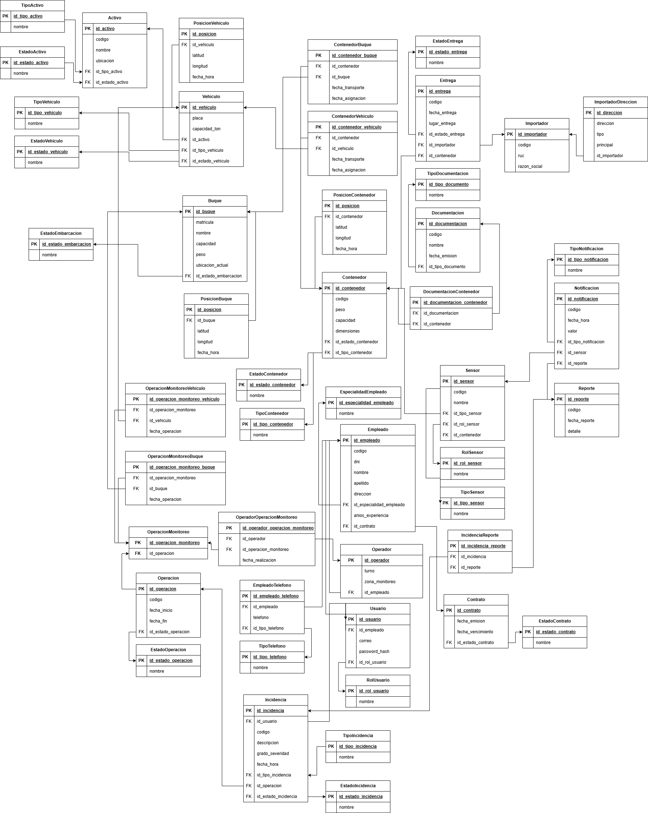

# 5.5. Módulo de Monitoreo de Entrega

### Diagrama Relacional

### Diccionario de Datos

#### Tabla: Empleado
- **Descripción:** Persona que trabaja en la empresa de logística.  
- **Propósito:** Gestionar el personal y sus roles en las operaciones del sistema.  
- **Reglas de Negocio:**  
  - Cada empleado debe tener un código único.
  - El DNI debe ser único en el sistema.
  - Se especializa en: Agente de Reservas, Tripulante, Trabajador Portuario, Conductor, Técnico, Responsable Solicitud y Operador.
  - Cada empleado debe tener un contrato asociado.

| **Columna** | **Descripción** | **Propósito** | **Tipo** | **NN** | **UK** | **FK** | **Ejemplo** |
|-------------|-----------------|---------------|----------|--------|--------|--------|-------------|
| id_empleado | Identificador único | PK UUID | CHAR(36) | Sí | Sí | No | 550e8400-e29b-41d4-a716-446655440017 |
| codigo | Código del empleado | Identificación | VARCHAR(20) | Sí | Sí | No | EMP-001 |
| dni | Documento de identidad | Identificación legal | CHAR(8) | Sí | Sí | No | 87654321 |
| nombre | Nombre del empleado | Identificación | VARCHAR(100) | Sí | No | No | Juan |
| apellido | Apellido del empleado | Identificación | VARCHAR(100) | Sí | No | No | Pérez |
| direccion | Dirección de residencia | Ubicación | VARCHAR(200) | No | No | No | Av. Marina 123 |
| id_especialidad_empleado | Especialidad del empleado | Clasificación | CHAR(36) | Sí | No | Sí | 650e8400-e29b-41d4-a716-446655440018 |
| id_contrato | Contrato laboral del empleado | Relación laboral | CHAR(36) | Sí | Sí | Sí | 750e8400-e29b-41d4-a716-446655440019 |

**Índices:**
- PRIMARY KEY (id_empleado)
- UNIQUE KEY uk_codigo (codigo)
- UNIQUE KEY uk_dni (dni)
- FOREIGN KEY (id_especialidad_empleado) REFERENCES EspecialidadEmpleado(id_especialidad_empleado)
- FOREIGN KEY (id_contrato) REFERENCES Contrato(id_contrato)

---

#### Tabla: EmpleadoTelefono
- **Descripción:** Números de teléfono asociados a empleados.  
- **Propósito:** Permitir que un empleado tenga múltiples números de contacto.  
- **Reglas de Negocio:**  
  - Un empleado puede tener cero o más teléfonos.

| **Columna** | **Descripción** | **Propósito** | **Tipo** | **NN** | **UK** | **FK** | **Ejemplo** |
|-------------|-----------------|---------------|----------|--------|--------|--------|-------------|
| id_empleado_telefono | Identificador único | PK UUID | CHAR(36) | Sí | Sí | No | 850e8400-e29b-41d4-a716-446655440020 |
| id_empleado | Referencia al empleado | Relación | CHAR(36) | Sí | No | Sí | 550e8400-e29b-41d4-a716-446655440017 |
| telefono | Número de teléfono | Contacto | VARCHAR(20) | Sí | No | No | 987654321 |
| id_tipo_telefono | Tipo de teléfono | Clasificación | CHAR(36) | No | No | Sí | 950e8400-e29b-41d4-a716-446655440021 |

**Índices:**
- PRIMARY KEY (id_empleado_telefono)
- UNIQUE KEY uk_empleado_telefono (id_empleado, telefono)
- FOREIGN KEY (id_empleado) REFERENCES Empleado(id_empleado)
- FOREIGN KEY (id_tipo_telefono) REFERENCES TipoTelefono(id_tipo_telefono)

---

#### Tabla: Operador
- **Descripción:** Empleado especializado en operaciones de monitoreo.  
- **Propósito:** Realizar y supervisar operaciones de monitoreo de contenedores.  
- **Reglas de Negocio:**  
  - Hereda todos los atributos de Empleado.
  - Realiza operaciones de monitoreo y puede registrar incidencias.

| **Columna** | **Descripción** | **Propósito** | **Tipo** | **NN** | **UK** | **FK** | **Ejemplo** |
|-------------|-----------------|---------------|----------|--------|--------|--------|-------------|
| id_operador | Identificador único | PK UUID | CHAR(36) | Sí | Sí | No | a50e8400-e29b-41d4-a716-446655440022 |
| id_empleado | Referencia a empleado | Herencia | CHAR(36) | Sí | Sí | Sí | 550e8400-e29b-41d4-a716-446655440017 |
| turno | Turno de trabajo | Organización | VARCHAR(20) | Sí | No | No | Mañana |
| zona_monitoreo | Área de responsabilidad | Operaciones | VARCHAR(100) | Sí | No | No | Zona Norte |

**Índices:**
- PRIMARY KEY (id_operador)
- UNIQUE KEY uk_empleado (id_empleado)
- FOREIGN KEY (id_empleado) REFERENCES Empleado(id_empleado)

---

#### Tabla: Operacion
- **Descripción:** Registro general de cualquier actividad logística realizada en el sistema.  
- **Propósito:** Servir como entidad base para todas las operaciones especializadas del sistema.  
- **Reglas de Negocio:**  
  - Cada operación debe tener un código único.
  - Toda operación debe tener una fecha de inicio y un estado.

| **Columna** | **Descripción** | **Propósito** | **Tipo** | **NN** | **UK** | **FK** | **Ejemplo** |
|-------------|-----------------|---------------|----------|--------|--------|--------|-------------|
| id_operacion | Identificador único | PK UUID | CHAR(36) | Sí | Sí | No | b50e8400-e29b-41d4-a716-446655440023 |
| codigo | Código de operación | Identificación | VARCHAR(20) | Sí | Sí | No | OP-2025-001 |
| fecha_inicio | Fecha de inicio | Control temporal | DATETIME | Sí | No | No | 2025-09-27 14:30:00 |
| fecha_fin | Fecha de finalización | Control temporal | DATETIME | No | No | No | 2025-09-30 18:00:00 |
| id_estado_operacion | Estado actual | Seguimiento | CHAR(36) | Sí | No | Sí | c50e8400-e29b-41d4-a716-446655440024 |

**Índices:**
- PRIMARY KEY (id_operacion)
- UNIQUE KEY uk_codigo (codigo)
- FOREIGN KEY (id_estado_operacion) REFERENCES EstadoOperacion(id_estado_operacion)

---

#### Tabla: OperacionMonitoreo
- **Descripción:** Operación específica de monitoreo de contenedores en tiempo real.  
- **Propósito:** Gestionar el seguimiento y control de contenedores durante el transporte.  
- **Reglas de Negocio:**  
  - Hereda todos los atributos de Operación.
  - Utiliza transportes (vehículos o buques) para el monitoreo.

| **Columna** | **Descripción** | **Propósito** | **Tipo** | **NN** | **UK** | **FK** | **Ejemplo** |
|-------------|-----------------|---------------|----------|--------|--------|--------|-------------|
| id_operacion_monitoreo | Identificador único | PK UUID | CHAR(36) | Sí | Sí | No | d50e8400-e29b-41d4-a716-446655440025 |
| id_operacion | Referencia a operación | Herencia | CHAR(36) | Sí | Sí | Sí | b50e8400-e29b-41d4-a716-446655440023 |

**Índices:**
- PRIMARY KEY (id_operacion_monitoreo)
- UNIQUE KEY uk_operacion (id_operacion)
- FOREIGN KEY (id_operacion) REFERENCES Operacion(id_operacion)

---

#### Tabla: Contenedor
- **Descripción:** Unidad estandarizada de transporte de mercancías.  
- **Propósito:** Gestionar los contenedores disponibles y su estado.  
- **Reglas de Negocio:**  
  - Cada contenedor debe tener un código único.
  - Debe tener un tipo de contenedor asociado.

| **Columna** | **Descripción** | **Propósito** | **Tipo** | **NN** | **UK** | **FK** | **Ejemplo** |
|-------------|-----------------|---------------|----------|--------|--------|--------|-------------|
| id_contenedor | Identificador único contenedor | PK UUID | CHAR(36) | Sí | Sí | No | e50e8400-e29b-41d4-a716-446655440026 |
| codigo | Código del contenedor | Identificación | VARCHAR(20) | Sí | Sí | No | CONT-123 |
| peso | Peso actual en kg | Control | DECIMAL(10,2) | Sí | No | No | 2500.00 |
| capacidad | Capacidad máxima | Control | DECIMAL(10,2) | Sí | No | No | 33500.00 |
| dimensiones | Dimensiones físicas | Especificación | VARCHAR(50) | Sí | No | No | 20x8x8.5 |
| id_estado_contenedor | Estado del contenedor | Seguimiento | CHAR(36) | Sí | No | Sí | f50e8400-e29b-41d4-a716-446655440027 |
| id_tipo_contenedor | Tipo de contenedor | Clasificación | CHAR(36) | Sí | No | Sí | g50e8400-e29b-41d4-a716-446655440028 |

**Índices:**
- PRIMARY KEY (id_contenedor)
- UNIQUE KEY uk_codigo (codigo)
- FOREIGN KEY (id_estado_contenedor) REFERENCES EstadoContenedor(id_estado_contenedor)
- FOREIGN KEY (id_tipo_contenedor) REFERENCES TipoContenedor(id_tipo_contenedor)

---

#### Tabla: Documentacion
- **Descripción:** Registro general de documentos del sistema logístico.  
- **Propósito:** Servir como entidad base para toda la documentación del sistema.  
- **Reglas de Negocio:**  
  - Cada documento debe tener un código único.
  - Todo documento debe tener tipo, fecha de emisión y archivo asociado.
  - Se especializa en: DocumentacionOperacion y DocumentacionContenedor.

| **Columna** | **Descripción** | **Propósito** | **Tipo** | **NN** | **UK** | **FK** | **Ejemplo** |
|-------------|-----------------|---------------|----------|--------|--------|--------|-------------|
| id_documentacion | Identificador único | PK UUID | CHAR(36) | Sí | Sí | No | h50e8400-e29b-41d4-a716-446655440029 |
| codigo | Código del documento | Identificación | VARCHAR(20) | Sí | Sí | No | DOC-001 |
| nombre | Nombre del documento | Identificación | VARCHAR(150) | Sí | No | No | Guía de remisión |
| fecha_emision | Fecha de emisión | Control temporal | DATE | Sí | No | No | 2025-09-27 |
| id_tipo_documento | Tipo de documento | Clasificación | CHAR(36) | Sí | No | Sí | i50e8400-e29b-41d4-a716-446655440030 |

**Índices:**
- PRIMARY KEY (id_documentacion)
- UNIQUE KEY uk_codigo (codigo)
- FOREIGN KEY (id_tipo_documento) REFERENCES TipoDocumento(id_tipo_documento)

---

#### Tabla: Sensor
- **Descripción:** Dispositivo IoT para monitoreo de contenedores.  
- **Propósito:** Recopilar datos en tiempo real del contenedor.  
- **Reglas de Negocio:**  
  - Genera notificaciones automáticas.
  - Cada sensor pertenece a un único contenedor.

| **Columna** | **Descripción** | **Propósito** | **Tipo** | **NN** | **UK** | **FK** | **Ejemplo** |
|-------------|-----------------|---------------|----------|--------|--------|--------|-------------|
| id_sensor | Identificador único | PK UUID | CHAR(36) | Sí | Sí | No | j50e8400-e29b-41d4-a716-446655440031 |
| codigo | Código del sensor | Identificación | VARCHAR(20) | Sí | Sí | No | SENS-001 |
| nombre | Nombre del sensor | Identificación | VARCHAR(50) | Sí | No | No | Sensor Temperatura |
| id_tipo_sensor | Tipo de sensor | Clasificación | CHAR(36) | Sí | No | Sí | k50e8400-e29b-41d4-a716-446655440032 |
| id_rol_sensor | Rol del sensor | Especificación | CHAR(36) | Sí | No | Sí | l50e8400-e29b-41d4-a716-446655440033 |
| id_contenedor | Contenedor asociado | Relación | CHAR(36) | Sí | No | Sí | e50e8400-e29b-41d4-a716-446655440026 |

**Índices:**
- PRIMARY KEY (id_sensor)
- UNIQUE KEY uk_codigo (codigo)
- FOREIGN KEY (id_tipo_sensor) REFERENCES TipoSensor(id_tipo_sensor)
- FOREIGN KEY (id_rol_sensor) REFERENCES RolSensor(id_rol_sensor)
- FOREIGN KEY (id_contenedor) REFERENCES Contenedor(id_contenedor)

---

#### Tabla: Reporte
- **Descripción:** Documento que consolida información del monitoreo.  
- **Propósito:** Generar informes de operaciones de monitoreo.  
- **Reglas de Negocio:**  
  - Contiene múltiples notificaciones.
  - Documenta incidencias.

| **Columna** | **Descripción** | **Propósito** | **Tipo** | **NN** | **UK** | **FK** | **Ejemplo** |
|-------------|-----------------|---------------|----------|--------|--------|--------|-------------|
| id_reporte | Identificador único | PK UUID | CHAR(36) | Sí | Sí | No | m50e8400-e29b-41d4-a716-446655440034 |
| codigo | Código del reporte | Identificación | VARCHAR(20) | Sí | Sí | No | REP-MON-001 |
| fecha_reporte | Fecha del reporte | Control temporal | DATE | Sí | No | No | 2025-09-19 |
| detalle | Detalle del reporte | Contenido | TEXT | Sí | No | No | Resumen diario |

**Índices:**
- PRIMARY KEY (id_reporte)
- UNIQUE KEY uk_codigo (codigo)

---

#### Tabla: Notificacion
- **Descripción:** Alerta generada por sensores del contenedor.  
- **Propósito:** Notificar eventos importantes durante monitoreo.  
- **Reglas de Negocio:**  
  - Es generada por sensores.
  - Es contenida en reportes.

| **Columna** | **Descripción** | **Propósito** | **Tipo** | **NN** | **UK** | **FK** | **Ejemplo** |
|-------------|-----------------|---------------|----------|--------|--------|--------|-------------|
| id_notificacion | Identificador único | PK UUID | CHAR(36) | Sí | Sí | No | n50e8400-e29b-41d4-a716-446655440035 |
| codigo | Código de notificación | Identificación | VARCHAR(20) | Sí | Sí | No | NOT-001 |
| id_tipo_notificacion | Tipo de notificación | Clasificación | CHAR(36) | Sí | No | Sí | o50e8400-e29b-41d4-a716-446655440036 |
| fecha_hora | Fecha y hora de generación | Control temporal | DATETIME | Sí | No | No | 2025-09-19 14:30:00 |
| valor | Valor medido | Datos | DECIMAL(10,2) | Sí | No | No | 25.5 |
| id_sensor | Sensor generador | Relación | CHAR(36) | Sí | No | Sí | j50e8400-e29b-41d4-a716-446655440031 |
| id_reporte | Reporte contenedor | Relación | CHAR(36) | Sí | No | Sí | m50e8400-e29b-41d4-a716-446655440034 |

**Índices:**
- PRIMARY KEY (id_notificacion)
- UNIQUE KEY uk_codigo (codigo)
- FOREIGN KEY (id_tipo_notificacion) REFERENCES TipoNotificacion(id_tipo_notificacion)
- FOREIGN KEY (id_sensor) REFERENCES Sensor(id_sensor)
- FOREIGN KEY (id_reporte) REFERENCES Reporte(id_reporte)

---

#### Tabla: Incidencia
- **Descripción:** Evento negativo o problema registrado durante una operación.  
- **Propósito:** Dar trazabilidad y seguimiento a problemas de seguridad o no conformidad.  
- **Reglas de Negocio:**  
  - Debe estar asociada a una operación.
  - Puede ser registrada por un empleado o usuario.

| **Columna** | **Descripción** | **Propósito** | **Tipo** | **NN** | **UK** | **FK** | **Ejemplo** |
|-------------|-----------------|---------------|----------|--------|--------|--------|-------------|
| id_incidencia | Identificador único | PK UUID | CHAR(36) | Sí | Sí | No | p50e8400-e29b-41d4-a716-446655440037 |
| codigo | Código de incidencia | Identificación | VARCHAR(20) | Sí | Sí | No | INC-001 |
| id_tipo_incidencia | Tipo de incidencia | Clasificación | CHAR(36) | Sí | No | Sí | q50e8400-e29b-41d4-a716-446655440038 |
| descripcion | Descripción detallada | Contexto | TEXT | Sí | No | No | Derrame de líquido |
| grado_severidad | Nivel de gravedad (1-5) | Control | INT | Sí | No | No | 4 |
| fecha_hora | Momento de ocurrencia | Registro temporal | DATETIME | Sí | No | No | 2025-09-28 14:35:00 |
| id_estado_incidencia | Estado de la incidencia | Seguimiento | CHAR(36) | Sí | No | Sí | r50e8400-e29b-41d4-a716-446655440039 |
| id_operacion | Operación afectada | Relación | CHAR(36) | Sí | No | Sí | b50e8400-e29b-41d4-a716-446655440023 |
| id_usuario | Usuario que registra | Responsabilidad | CHAR(36) | Sí | No | Sí | s50e8400-e29b-41d4-a716-446655440040 |

**Índices:**
- PRIMARY KEY (id_incidencia)
- UNIQUE KEY uk_codigo (codigo)
- FOREIGN KEY (id_tipo_incidencia) REFERENCES TipoIncidencia(id_tipo_incidencia)
- FOREIGN KEY (id_operacion) REFERENCES Operacion(id_operacion)
- FOREIGN KEY (id_usuario) REFERENCES Usuario(id_usuario)
- FOREIGN KEY (id_estado_incidencia) REFERENCES EstadoIncidencia(id_estado_incidencia)

---

#### Tabla: IncidenciaReporte
- **Descripción:** Relación entre incidencias y reportes de monitoreo.  
- **Propósito:** Vincular incidencias con los reportes donde se documentan.  
- **Reglas de Negocio:**  
  - Una incidencia puede estar en múltiples reportes.

| **Columna** | **Descripción** | **Propósito** | **Tipo** | **NN** | **UK** | **FK** | **Ejemplo** |
|-------------|-----------------|---------------|----------|--------|--------|--------|-------------|
| id_incidencia_reporte | Identificador único | PK UUID | CHAR(36) | Sí | Sí | No | t50e8400-e29b-41d4-a716-446655440041 |
| id_incidencia | Referencia a incidencia | Relación | CHAR(36) | Sí | No | Sí | p50e8400-e29b-41d4-a716-446655440037 |
| id_reporte | Referencia a reporte | Relación | CHAR(36) | Sí | No | Sí | m50e8400-e29b-41d4-a716-446655440034 |

**Índices:**
- PRIMARY KEY (id_incidencia_reporte)
- UNIQUE KEY uk_incidencia_reporte (id_incidencia, id_reporte)
- FOREIGN KEY (id_incidencia) REFERENCES Incidencia(id_incidencia)
- FOREIGN KEY (id_reporte) REFERENCES Reporte(id_reporte)

---

#### Tabla: Importador
- **Descripción:** Cliente que recibe entregas de contenedores.  
- **Propósito:** Gestionar destinatarios finales de mercancías.  
- **Reglas de Negocio:**  
  - Puede recibir múltiples entregas.
  - El RUC debe ser único.

| **Columna** | **Descripción** | **Propósito** | **Tipo** | **NN** | **UK** | **FK** | **Ejemplo** |
|-------------|-----------------|---------------|----------|--------|--------|--------|-------------|
| id_importador | Identificador único | PK UUID | CHAR(36) | Sí | Sí | No | u50e8400-e29b-41d4-a716-446655440042 |
| codigo | Código del importador | Identificación | VARCHAR(20) | Sí | Sí | No | IMP-001 |
| ruc | RUC del importador | Identificación fiscal | CHAR(11) | Sí | Sí | No | 20123456789 |
| razon_social | Nombre legal | Identificación | VARCHAR(150) | Sí | No | No | Importadora SAC |

**Índices:**
- PRIMARY KEY (id_importador)
- UNIQUE KEY uk_codigo (codigo)
- UNIQUE KEY uk_ruc (ruc)

---

#### Tabla: ImportadorDireccion
- **Descripción:** Direcciones asociadas a importadores.  
- **Propósito:** Permitir que un importador tenga múltiples direcciones.  
- **Reglas de Negocio:**  
  - Un importador debe tener al menos una dirección.

| **Columna** | **Descripción** | **Propósito** | **Tipo** | **NN** | **UK** | **FK** | **Ejemplo** |
|-------------|-----------------|---------------|----------|--------|--------|--------|-------------|
| id_direccion | Identificador único | PK UUID | CHAR(36) | Sí | Sí | No | v50e8400-e29b-41d4-a716-446655440043 |
| id_importador | Referencia a importador | Relación | CHAR(36) | Sí | No | Sí | u50e8400-e29b-41d4-a716-446655440042 |
| direccion | Dirección física | Localización | VARCHAR(200) | Sí | No | No | Av. Grau 120 |
| tipo | Tipo de dirección | Clasificación | VARCHAR(50) | No | No | No | Fiscal |
| principal | Dirección principal | Control | BOOLEAN | Sí | No | No | TRUE |

**Índices:**
- PRIMARY KEY (id_direccion)
- FOREIGN KEY (id_importador) REFERENCES Importador(id_importador)

---

#### Tabla: Entrega
- **Descripción:** Proceso de entrega de contenedores al importador.  
- **Propósito:** Formalizar finalización del transporte.  
- **Reglas de Negocio:**  
  - Cada entrega es producida por un contenedor.
  - Es recibida por un importador.

| **Columna** | **Descripción** | **Propósito** | **Tipo** | **NN** | **UK** | **FK** | **Ejemplo** |
|-------------|-----------------|---------------|----------|--------|--------|--------|-------------|
| id_entrega | Identificador único | PK UUID | CHAR(36) | Sí | Sí | No | w50e8400-e29b-41d4-a716-446655440044 |
| codigo | Código de entrega | Identificación | VARCHAR(20) | Sí | Sí | No | ENT-001 |
| id_estado_entrega | Estado de la entrega | Seguimiento | CHAR(36) | Sí | No | Sí | x50e8400-e29b-41d4-a716-446655440045 |
| fecha_entrega | Fecha de entrega | Control temporal | DATE | Sí | No | No | 2025-09-20 |
| lugar_entrega | Lugar de entrega | Logística | VARCHAR(100) | Sí | No | No | Almacén Central |
| id_contenedor | Contenedor entregado | Relación | CHAR(36) | Sí | No | Sí | e50e8400-e29b-41d4-a716-446655440026 |
| id_importador | Importador receptor | Relación | CHAR(36) | Sí | No | Sí | u50e8400-e29b-41d4-a716-446655440042 |

**Índices:**
- PRIMARY KEY (id_entrega)
- UNIQUE KEY uk_codigo (codigo)
- FOREIGN KEY (id_estado_entrega) REFERENCES EstadoEntrega(id_estado_entrega)
- FOREIGN KEY (id_contenedor) REFERENCES Contenedor(id_contenedor)
- FOREIGN KEY (id_importador) REFERENCES Importador(id_importador)

---

#### Tabla: Vehiculo
- **Descripción:** Medio de transporte utilizado en operaciones terrestres.  
- **Propósito:** Permitir traslado de carga por carretera.  
- **Reglas de Negocio:**  
  - Hereda de Activo.
  - Cada vehículo debe tener placa única.

| **Columna** | **Descripción** | **Propósito** | **Tipo** | **NN** | **UK** | **FK** | **Ejemplo** |
|-------------|-----------------|---------------|----------|--------|--------|--------|-------------|
| id_vehiculo | Identificador único | PK UUID | CHAR(36) | Sí | Sí | No | y50e8400-e29b-41d4-a716-446655440046 |
| id_activo | Referencia a activo | Herencia | CHAR(36) | Sí | Sí | Sí | z50e8400-e29b-41d4-a716-446655440047 |
| placa | Placa del vehículo | Identificación legal | VARCHAR(20) | Sí | Sí | No | ABC-123 |
| capacidad_ton | Capacidad en toneladas | Control | DECIMAL(10,2) | Sí | No | No | 25.00 |
| id_tipo_vehiculo | Tipo de vehículo | Clasificación | CHAR(36) | Sí | No | Sí | a60e8400-e29b-41d4-a716-446655440048 |
| id_estado_vehiculo | Estado operativo | Seguimiento | CHAR(36) | Sí | No | Sí | b60e8400-e29b-41d4-a716-446655440049 |

**Índices:**
- PRIMARY KEY (id_vehiculo)
- UNIQUE KEY uk_activo (id_activo)
- UNIQUE KEY uk_placa (placa)
- FOREIGN KEY (id_activo) REFERENCES Activo(id_activo)
- FOREIGN KEY (id_tipo_vehiculo) REFERENCES TipoVehiculo(id_tipo_vehiculo)
- FOREIGN KEY (id_estado_vehiculo) REFERENCES EstadoVehiculo(id_estado_vehiculo)

---

#### Tabla: Buque
- **Descripción:** Embarcación de transporte marítimo que transporta contenedores y tripulación.  
- **Propósito:** Registrar la información de las embarcaciones utilizadas en operaciones marítimas.  
- **Reglas de Negocio:**  
  - La matrícula debe ser única.
  - Un buque puede ser utilizado en múltiples operaciones.

| **Columna** | **Descripción** | **Propósito** | **Tipo** | **NN** | **UK** | **FK** | **Ejemplo** |
|-------------|-----------------|---------------|----------|--------|--------|--------|-------------|
| id_buque | Identificador único | PK UUID | CHAR(36) | Sí | Sí | No | c60e8400-e29b-41d4-a716-446655440050 |
| matricula | Matrícula del buque | PK natural | VARCHAR(20) | Sí | Sí | No | IMO-9347438 |
| nombre | Nombre del buque | Identificación | VARCHAR(100) | Sí | No | No | Hapag Spirit |
| capacidad | Capacidad en TEU | Control | INT | Sí | No | No | 12000 |
| id_estado_embarcacion | Estado operativo | Seguimiento | CHAR(36) | Sí | No | Sí | d60e8400-e29b-41d4-a716-446655440051 |
| peso | Peso máximo en toneladas | Especificación | DECIMAL(15,2) | Sí | No | No | 150000.00 |
| ubicacion_actual | Posición GPS actual | Monitoreo | VARCHAR(100) | No | No | No | 8.9824 N, 79.5199 W |

**Índices:**
- PRIMARY KEY (id_buque)
- UNIQUE KEY uk_matricula (matricula)
- FOREIGN KEY (id_estado_embarcacion) REFERENCES EstadoEmbarcacion(id_estado_embarcacion)

---

#### Tabla: PosicionContenedor
- **Descripción:** Historial de posiciones GPS del contenedor.  
- **Propósito:** Tracking en tiempo real de contenedores.  
- **Reglas de Negocio:**  
  - Registra posiciones periódicamente.
  - Permite rastreo completo del recorrido.

| **Columna** | **Descripción** | **Propósito** | **Tipo** | **NN** | **UK** | **FK** | **Ejemplo** |
|-------------|-----------------|---------------|----------|--------|--------|--------|-------------|
| id_posicion | Identificador único | PK UUID | CHAR(36) | Sí | Sí | No | e60e8400-e29b-41d4-a716-446655440052 |
| id_contenedor | Contenedor rastreado | Relación | CHAR(36) | Sí | No | Sí | e50e8400-e29b-41d4-a716-446655440026 |
| latitud | Latitud GPS | Geolocalización | DECIMAL(9,6) | Sí | No | No | -12.046374 |
| longitud | Longitud GPS | Geolocalización | DECIMAL(9,6) | Sí | No | No | -77.042793 |
| fecha_hora | Timestamp de la posición | Control temporal | DATETIME | Sí | No | No | 2025-09-19 10:30:00 |

**Índices:**
- PRIMARY KEY (id_posicion)
- INDEX idx_contenedor_fecha (id_contenedor, fecha_hora)
- FOREIGN KEY (id_contenedor) REFERENCES Contenedor(id_contenedor)

---

#### Tabla: PosicionVehiculo
- **Descripción:** Historial de posiciones GPS del vehículo.  
- **Propósito:** Tracking en tiempo real de vehículos terrestres.  
- **Reglas de Negocio:**  
  - Registra posiciones periódicamente.

| **Columna** | **Descripción** | **Propósito** | **Tipo** | **NN** | **UK** | **FK** | **Ejemplo** |
|-------------|-----------------|---------------|----------|--------|--------|--------|-------------|
| id_posicion | Identificador único | PK UUID | CHAR(36) | Sí | Sí | No | f60e8400-e29b-41d4-a716-446655440053 |
| id_vehiculo | Vehículo rastreado | Relación | CHAR(36) | Sí | No | Sí | y50e8400-e29b-41d4-a716-446655440046 |
| latitud | Latitud GPS | Geolocalización | DECIMAL(9,6) | Sí | No | No | -12.046374 |
| longitud | Longitud GPS | Geolocalización | DECIMAL(9,6) | Sí | No | No | -77.042793 |
| fecha_hora | Timestamp de la posición | Control temporal | DATETIME | Sí | No | No | 2025-09-19 10:30:00 |

**Índices:**
- PRIMARY KEY (id_posicion)
- INDEX idx_vehiculo_fecha (id_vehiculo, fecha_hora)
- FOREIGN KEY (id_vehiculo) REFERENCES Vehiculo(id_vehiculo)

---

#### Tabla: PosicionBuque
- **Descripción:** Historial de posiciones GPS del buque.  
- **Propósito:** Tracking en tiempo real de buques.  
- **Reglas de Negocio:**  
  - Registra posiciones periódicamente.
  - Complementa el campo ubicacion_actual de Buque.

| **Columna** | **Descripción** | **Propósito** | **Tipo** | **NN** | **UK** | **FK** | **Ejemplo** |
|-------------|-----------------|---------------|----------|--------|--------|--------|-------------|
| id_posicion | Identificador único | PK UUID | CHAR(36) | Sí | Sí | No | g60e8400-e29b-41d4-a716-446655440054 |
| id_buque | Buque rastreado | Relación | CHAR(36) | Sí | No | Sí | c60e8400-e29b-41d4-a716-446655440050 |
| latitud | Latitud GPS | Geolocalización | DECIMAL(9,6) | Sí | No | No | -12.046374 |
| longitud | Longitud GPS | Geolocalización | DECIMAL(9,6) | Sí | No | No | -77.042793 |
| fecha_hora | Timestamp de la posición | Control temporal | DATETIME | Sí | No | No | 2025-09-19 10:30:00 |

**Índices:**
- PRIMARY KEY (id_posicion)
- INDEX idx_buque_fecha (id_buque, fecha_hora)
- FOREIGN KEY (id_buque) REFERENCES Buque(id_buque)

---

#### Tabla: Usuario
- **Descripción:** Individuo con acceso al sistema y rol específico.  
- **Propósito:** Autenticar usuarios y asignarles roles para tareas específicas.  
- **Reglas de Negocio:**  
  - Cada usuario debe estar asociado a un empleado.
  - El correo electrónico debe ser único.

| **Columna** | **Descripción** | **Propósito** | **Tipo** | **NN** | **UK** | **FK** | **Ejemplo** |
|-------------|-----------------|---------------|----------|--------|--------|--------|-------------|
| id_usuario | Identificador único | PK UUID | CHAR(36) | Sí | Sí | No | s50e8400-e29b-41d4-a716-446655440040 |
| id_empleado | Empleado asociado | Relación 1:1 | CHAR(36) | Sí | Sí | Sí | 550e8400-e29b-41d4-a716-446655440017 |
| correo_electronico | Email de acceso | Autenticación | VARCHAR(100) | Sí | Sí | No | juan.perez@empresa.com |
| contrasena | Contraseña cifrada | Seguridad | VARCHAR(255) | Sí | No | No | $2y$10$... |
| id_rol_usuario | Rol asignado | Control de permisos | CHAR(36) | Sí | No | Sí | h60e8400-e29b-41d4-a716-446655440055 |

**Índices:**
- PRIMARY KEY (id_usuario)
- UNIQUE KEY uk_empleado (id_empleado)
- UNIQUE KEY uk_correo (correo)
- FOREIGN KEY (id_empleado) REFERENCES Empleado(id_empleado)
- FOREIGN KEY (id_rol_usuario) REFERENCES RolUsuario(id_rol_usuario)

---

#### Tabla: Contrato
- **Descripción:** Acuerdo formal entre las partes para la prestación de servicios logísticos.  
- **Propósito:** Gestionar los contratos comerciales y sus condiciones.  
- **Reglas de Negocio:**  
  - Cada contrato debe tener un código único.
  - Un contrato debe tener una fecha de emisión y vencimiento.
  - El estado del contrato determina su validez operativa.

| **Columna** | **Descripción** | **Propósito** | **Tipo** | **NN** | **UK** | **FK** | **Ejemplo** |
|-------------|-----------------|---------------|----------|--------|--------|--------|-------------|
| id_contrato | Identificador único del contrato | PK UUID | CHAR(36) | Sí | Sí | No | 750e8400-e29b-41d4-a716-446655440019 |
| fecha_emision | Fecha de creación del contrato | Registro temporal | DATE | Sí | No | No | 2025-01-15 |
| fecha_vencimiento | Fecha de finalización del contrato | Control temporal | DATE | Sí | No | No | 2026-01-15 |
| id_estado_contrato | Estado actual del contrato | Seguimiento | CHAR(36) | Sí | No | Sí | i60e8400-e29b-41d4-a716-446655440056 |

**Índices:**
- PRIMARY KEY (id_contrato)
- FOREIGN KEY (id_estado_contrato) REFERENCES EstadoContrato(id_estado_contrato)

---

#### Tabla: Activo
- **Descripción:** Bien o recurso sujeto a mantenimiento.  
- **Propósito:** Mantener control y trazabilidad de activos físicos de la empresa.  
- **Reglas de Negocio:**  
  - Cada activo debe tener un código único.
  - Se especializa en: EquipoPortuario y Vehículo.

| **Columna** | **Descripción** | **Propósito** | **Tipo** | **NN** | **UK** | **FK** | **Ejemplo** |
|-------------|-----------------|---------------|----------|--------|--------|--------|-------------|
| id_activo | Identificador único | PK UUID | CHAR(36) | Sí | Sí | No | z50e8400-e29b-41d4-a716-446655440047 |
| codigo | Código del activo | Identificación | VARCHAR(20) | Sí | Sí | No | ACT-001 |
| nombre | Nombre del activo | Identificación | VARCHAR(100) | Sí | No | No | Montacargas Toyota |
| id_tipo_activo | Tipo de activo | Clasificación | CHAR(36) | Sí | No | Sí | j60e8400-e29b-41d4-a716-446655440057 |
| id_estado_activo | Estado del activo | Seguimiento | CHAR(36) | Sí | No | Sí | k60e8400-e29b-41d4-a716-446655440058 |
| ubicacion | Ubicación física | Localización | VARCHAR(100) | No | No | No | Almacén 3 |

**Índices:**
- PRIMARY KEY (id_activo)
- UNIQUE KEY uk_codigo (codigo)
- FOREIGN KEY (id_tipo_activo) REFERENCES TipoActivo(id_tipo_activo)
- FOREIGN KEY (id_estado_activo) REFERENCES EstadoActivo(id_estado_activo)

---

### Tablas Asociativas

#### Tabla: DocumentacionContenedor
- **Descripción:** Documentación especializada para contenedores.  
- **Propósito:** Vincular documentos legales específicos con contenedores.  
- **Reglas de Negocio:**  
  - Hereda todos los atributos de Documentacion.
  - Relación 1:1 obligatoria con Contenedor.

| **Columna** | **Descripción** | **Propósito** | **Tipo** | **NN** | **UK** | **FK** | **Ejemplo** |
|-------------|-----------------|---------------|----------|--------|--------|--------|-------------|
| id_documentacion_contenedor | Identificador único | PK UUID | CHAR(36) | Sí | Sí | No | l60e8400-e29b-41d4-a716-446655440059 |
| id_documentacion | Referencia a documentación | Herencia | CHAR(36) | Sí | Sí | Sí | h50e8400-e29b-41d4-a716-446655440029 |
| id_contenedor | Contenedor asociado | Relación 1:1 | CHAR(36) | Sí | Sí | Sí | e50e8400-e29b-41d4-a716-446655440026 |

**Índices:**
- PRIMARY KEY (id_documentacion_contenedor)
- UNIQUE KEY uk_documentacion (id_documentacion)
- UNIQUE KEY uk_contenedor (id_contenedor)
- FOREIGN KEY (id_documentacion) REFERENCES Documentacion(id_documentacion)
- FOREIGN KEY (id_contenedor) REFERENCES Contenedor(id_contenedor)

---

#### Tabla: OperacionMonitoreoVehiculo
- **Descripción:** Uso de vehículos en operaciones de monitoreo.  
- **Propósito:** Registrar qué vehículos se monitorean.  
- **Reglas de Negocio:**  
  - Una operación de monitoreo puede usar múltiples vehículos.

| **Columna** | **Descripción** | **Propósito** | **Tipo** | **NN** | **UK** | **FK** | **Ejemplo** |
|-------------|-----------------|---------------|----------|--------|--------|--------|-------------|
| id_operacion_monitoreo_vehiculo | Identificador único | PK UUID | CHAR(36) | Sí | Sí | No | m60e8400-e29b-41d4-a716-446655440060 |
| id_operacion_monitoreo | Referencia a operación | Relación | CHAR(36) | Sí | No | Sí | d50e8400-e29b-41d4-a716-446655440025 |
| id_vehiculo | Referencia a vehículo | Relación | CHAR(36) | Sí | No | Sí | y50e8400-e29b-41d4-a716-446655440046 |
| fecha_operacion | Fecha de operación | Control | DATE | Sí | No | No | 2025-01-15 |

**Índices:**
- PRIMARY KEY (id_operacion_monitoreo_vehiculo)
- UNIQUE KEY uk_operacion_vehiculo_fecha (id_operacion_monitoreo, id_vehiculo, fecha_operacion)
- FOREIGN KEY (id_operacion_monitoreo) REFERENCES OperacionMonitoreo(id_operacion_monitoreo)
- FOREIGN KEY (id_vehiculo) REFERENCES Vehiculo(id_vehiculo)

---

#### Tabla: OperacionMonitoreoBuque
- **Descripción:** Uso de buques en operaciones de monitoreo.  
- **Propósito:** Registrar qué buques se monitorean.  
- **Reglas de Negocio:**  
  - Una operación de monitoreo puede usar múltiples buques.

| **Columna** | **Descripción** | **Propósito** | **Tipo** | **NN** | **UK** | **FK** | **Ejemplo** |
|-------------|-----------------|---------------|----------|--------|--------|--------|-------------|
| id_operacion_monitoreo_buque | Identificador único | PK UUID | CHAR(36) | Sí | Sí | No | n60e8400-e29b-41d4-a716-446655440061 |
| id_operacion_monitoreo | Referencia a operación | Relación | CHAR(36) | Sí | No | Sí | d50e8400-e29b-41d4-a716-446655440025 |
| id_buque | Referencia a buque | Relación | CHAR(36) | Sí | No | Sí | c60e8400-e29b-41d4-a716-446655440050 |
| fecha_operacion | Fecha de operación | Control | DATE | Sí | No | No | 2025-01-15 |

**Índices:**
- PRIMARY KEY (id_operacion_monitoreo_buque)
- UNIQUE KEY uk_operacion_buque_fecha (id_operacion_monitoreo, id_buque, fecha_operacion)
- FOREIGN KEY (id_operacion_monitoreo) REFERENCES OperacionMonitoreo(id_operacion_monitoreo)
- FOREIGN KEY (id_buque) REFERENCES Buque(id_buque)

---

#### Tabla: ContenedorVehiculo
- **Descripción:** Transporte de contenedores en vehículos.  
- **Propósito:** Registrar movimiento de contenedores en transporte terrestre.  
- **Reglas de Negocio:**  
  - Un vehículo puede llevar múltiples contenedores.

| **Columna** | **Descripción** | **Propósito** | **Tipo** | **NN** | **UK** | **FK** | **Ejemplo** |
|-------------|-----------------|---------------|----------|--------|--------|--------|-------------|
| id_contenedor_vehiculo | Identificador único | PK UUID | CHAR(36) | Sí | Sí | No | o60e8400-e29b-41d4-a716-446655440062 |
| id_contenedor | Referencia a contenedor | Relación | CHAR(36) | Sí | No | Sí | e50e8400-e29b-41d4-a716-446655440026 |
| id_vehiculo | Referencia a vehículo | Relación | CHAR(36) | Sí | No | Sí | y50e8400-e29b-41d4-a716-446655440046 |
| fecha_transporte | Fecha de transporte | Control | DATE | Sí | No | No | 2025-01-16 |
| fecha_asignacion | Fecha de asignación | Control | DATE | Sí | No | No | 2025-01-15 |

**Índices:**
- PRIMARY KEY (id_contenedor_vehiculo)
- UNIQUE KEY uk_contenedor_vehiculo_asignacion (id_contenedor, id_vehiculo, fecha_asignacion)
- FOREIGN KEY (id_contenedor) REFERENCES Contenedor(id_contenedor)
- FOREIGN KEY (id_vehiculo) REFERENCES Vehiculo(id_vehiculo)

---

#### Tabla: ContenedorBuque
- **Descripción:** Transporte de contenedores en buques.  
- **Propósito:** Registrar movimiento de contenedores en transporte marítimo.  
- **Reglas de Negocio:**  
  - Un buque puede llevar múltiples contenedores.

| **Columna** | **Descripción** | **Propósito** | **Tipo** | **NN** | **UK** | **FK** | **Ejemplo** |
|-------------|-----------------|---------------|----------|--------|--------|--------|-------------|
| id_contenedor_buque | Identificador único | PK UUID | CHAR(36) | Sí | Sí | No | p60e8400-e29b-41d4-a716-446655440063 |
| id_contenedor | Referencia a contenedor | Relación | CHAR(36) | Sí | No | Sí | e50e8400-e29b-41d4-a716-446655440026 |
| id_buque | Referencia a buque | Relación | CHAR(36) | Sí | No | Sí | c60e8400-e29b-41d4-a716-446655440050 |
| fecha_transporte | Fecha de transporte | Control | DATE | Sí | No | No | 2025-01-20 |
| fecha_asignacion | Fecha de asignación | Control | DATE | Sí | No | No | 2025-01-18 |

**Índices:**
- PRIMARY KEY (id_contenedor_buque)
- UNIQUE KEY uk_contenedor_buque_asignacion (id_contenedor, id_buque, fecha_asignacion)
- FOREIGN KEY (id_contenedor) REFERENCES Contenedor(id_contenedor)
- FOREIGN KEY (id_buque) REFERENCES Buque(id_buque)

---

#### Tabla: OperadorOperacionMonitoreo
- **Descripción:** Asignación de operadores a operaciones de monitoreo.  
- **Propósito:** Controlar qué operadores realizan cada monitoreo.  
- **Reglas de Negocio:**  
  - Una operación puede ser realizada por múltiples operadores.

| **Columna** | **Descripción** | **Propósito** | **Tipo** | **NN** | **UK** | **FK** | **Ejemplo** |
|-------------|-----------------|---------------|----------|--------|--------|--------|-------------|
| id_operador_operacion_monitoreo | Identificador único | PK UUID | CHAR(36) | Sí | Sí | No | q60e8400-e29b-41d4-a716-446655440064 |
| id_operador | Referencia a operador | Relación | CHAR(36) | Sí | No | Sí | a50e8400-e29b-41d4-a716-446655440022 |
| id_operacion_monitoreo | Referencia a operación | Relación | CHAR(36) | Sí | No | Sí | d50e8400-e29b-41d4-a716-446655440025 |
| fecha_realizacion | Fecha de realización | Control | DATE | Sí | No | No | 2025-01-15 |

**Índices:**
- PRIMARY KEY (id_operador_operacion_monitoreo)
- UNIQUE KEY uk_operador_operacion_fecha (id_operador, id_operacion_monitoreo, fecha_realizacion)
- FOREIGN KEY (id_operador) REFERENCES Operador(id_operador)
- FOREIGN KEY (id_operacion_monitoreo) REFERENCES OperacionMonitoreo(id_operacion_monitoreo)

---

### Tablas de Dominio (Lookup Tables)

#### Tabla: EstadoOperacion
- **Descripción:** Catálogo de estados posibles para operaciones.  
- **Propósito:** Normalizar el estado de las operaciones.

| **Columna** | **Descripción** | **Propósito** | **Tipo** | **NN** | **UK** | **FK** | **Ejemplo** |
|-------------|-----------------|---------------|----------|--------|--------|--------|-------------|
| id_estado_operacion | Identificador único | PK UUID | CHAR(36) | Sí | Sí | No | c50e8400-e29b-41d4-a716-446655440024 |
| nombre | Nombre del estado | Clasificación | VARCHAR(50) | Sí | No | No | En curso |

**Índices:**
- PRIMARY KEY (id_estado_operacion)

**Valores típicos:**
- En curso
- Completada
- Cancelada
- Pendiente

---

#### Tabla: EspecialidadEmpleado
- **Descripción:** Catálogo de roles operativos para empleados.  
- **Propósito:** Clasificar empleados según su función.

| **Columna** | **Descripción** | **Propósito** | **Tipo** | **NN** | **UK** | **FK** | **Ejemplo** |
|-------------|-----------------|---------------|----------|--------|--------|--------|-------------|
| id_especialidad_empleado | Identificador único | PK UUID | CHAR(36) | Sí | Sí | No | 650e8400-e29b-41d4-a716-446655440018 |
| nombre | Nombre del rol | Clasificación | VARCHAR(50) | Sí | No | No | Supervisor |

**Índices:**
- PRIMARY KEY (id_especialidad_empleado)

**Valores típicos:**
- Ingeniero
- Técnico
- Administrativo
- Gerente

---

#### Tabla: EstadoContenedor
- **Descripción:** Catálogo de estados de contenedores.  
- **Propósito:** Normalizar el estado de los contenedores.

| **Columna** | **Descripción** | **Propósito** | **Tipo** | **NN** | **UK** | **FK** | **Ejemplo** |
|-------------|-----------------|---------------|----------|--------|--------|--------|-------------|
| id_estado_contenedor | Identificador único | PK UUID | CHAR(36) | Sí | Sí | No | f50e8400-e29b-41d4-a716-446655440027 |
| nombre | Nombre del estado | Clasificación | VARCHAR(50) | Sí | No | No | Disponible |

**Índices:**
- PRIMARY KEY (id_estado_contenedor)

**Valores típicos:**
- Disponible
- En tránsito
- Entregado
- En mantenimiento

---

#### Tabla: TipoContenedor
- **Descripción:** Catálogo de tipos de contenedores disponibles.  
- **Propósito:** Clasificar contenedores según características.

| **Columna** | **Descripción** | **Propósito** | **Tipo** | **NN** | **UK** | **FK** | **Ejemplo** |
|-------------|-----------------|---------------|----------|--------|--------|--------|-------------|
| id_tipo_contenedor | Identificador único | PK UUID | CHAR(36) | Sí | Sí | No | g50e8400-e29b-41d4-a716-446655440028 |
| codigo | Código del tipo | Identificación | VARCHAR(20) | Sí | Sí | No | T-001 |
| nombre | Nombre del tipo | Clasificación | VARCHAR(50) | Sí | No | No | Refrigerado |
| costo | Costo asociado | Financiero | DECIMAL(10,2) | Sí | No | No | 3500.50 |

**Índices:**
- PRIMARY KEY (id_tipo_contenedor)
- UNIQUE KEY uk_codigo (codigo)

---

#### Tabla: TipoDocumento
- **Descripción:** Catálogo de tipos de documentación para contenedores.  
- **Propósito:** Clasificar documentos según su naturaleza.

| **Columna** | **Descripción** | **Propósito** | **Tipo** | **NN** | **UK** | **FK** | **Ejemplo** |
|-------------|-----------------|---------------|----------|--------|--------|--------|-------------|
| id_tipo_documento | Identificador único | PK UUID | CHAR(36) | Sí | Sí | No | i50e8400-e29b-41d4-a716-446655440030 |
| nombre | Nombre del tipo | Clasificación | VARCHAR(50) | Sí | No | No | Bill of Lading |

**Índices:**
- PRIMARY KEY (id_tipo_documento)

**Valores típicos:**
- Bill of Lading
- Manifiesto
- Certificado sanitario
- DUA

---

#### Tabla: EstadoEntrega
- **Descripción:** Catálogo de estados de entregas.  
- **Propósito:** Normalizar el estado de las entregas.

| **Columna** | **Descripción** | **Propósito** | **Tipo** | **NN** | **UK** | **FK** | **Ejemplo** |
|-------------|-----------------|---------------|----------|--------|--------|--------|-------------|
| id_estado_entrega | Identificador único | PK UUID | CHAR(36) | Sí | Sí | No | x50e8400-e29b-41d4-a716-446655440045 |
| nombre | Nombre del estado | Clasificación | VARCHAR(50) | Sí | No | No | Programada |

**Índices:**
- PRIMARY KEY (id_estado_entrega)

**Valores típicos:**
- Programada
- En tránsito
- Completada
- Fallida

---

#### Tabla: TipoSensor
- **Descripción:** Catálogo de tipos de sensores IoT.  
- **Propósito:** Clasificar sensores según su función.

| **Columna** | **Descripción** | **Propósito** | **Tipo** | **NN** | **UK** | **FK** | **Ejemplo** |
|-------------|-----------------|---------------|----------|--------|--------|--------|-------------|
| id_tipo_sensor | Identificador único | PK UUID | CHAR(36) | Sí | Sí | No | k50e8400-e29b-41d4-a716-446655440032 |
| nombre | Nombre del tipo | Clasificación | VARCHAR(50) | Sí | No | No | Temperatura |

**Índices:**
- PRIMARY KEY (id_tipo_sensor)

**Valores típicos:**
- Temperatura
- Humedad
- Vibración
- GPS
- Apertura

---

#### Tabla: RolSensor
- **Descripción:** Catálogo de roles de sensores.  
- **Propósito:** Definir la función del sensor.

| **Columna** | **Descripción** | **Propósito** | **Tipo** | **NN** | **UK** | **FK** | **Ejemplo** |
|-------------|-----------------|---------------|----------|--------|--------|--------|-------------|
| id_rol_sensor | Identificador único | PK UUID | CHAR(36) | Sí | Sí | No | l50e8400-e29b-41d4-a716-446655440033 |
| nombre | Nombre del rol | Clasificación | VARCHAR(50) | Sí | No | No | Monitoreo |

**Índices:**
- PRIMARY KEY (id_rol_sensor)

**Valores típicos:**
- Monitoreo
- Control
- Alerta
- Registro

---

#### Tabla: TipoNotificacion
- **Descripción:** Catálogo de tipos de notificaciones.  
- **Propósito:** Clasificar alertas según su naturaleza.

| **Columna** | **Descripción** | **Propósito** | **Tipo** | **NN** | **UK** | **FK** | **Ejemplo** |
|-------------|-----------------|---------------|----------|--------|--------|--------|-------------|
| id_tipo_notificacion | Identificador único | PK UUID | CHAR(36) | Sí | Sí | No | o50e8400-e29b-41d4-a716-446655440036 |
| nombre | Nombre del tipo | Clasificación | VARCHAR(50) | Sí | No | No | Alerta |

**Índices:**
- PRIMARY KEY (id_tipo_notificacion)

**Valores típicos:**
- Alerta
- Advertencia
- Información
- Crítica

---

#### Tabla: TipoIncidencia
- **Descripción:** Catálogo de tipos de incidencias reportables.  
- **Propósito:** Clasificar incidencias según su categoría.

| **Columna** | **Descripción** | **Propósito** | **Tipo** | **NN** | **UK** | **FK** | **Ejemplo** |
|-------------|-----------------|---------------|----------|--------|--------|--------|-------------|
| id_tipo_incidencia | Identificador único | PK UUID | CHAR(36) | Sí | Sí | No | q50e8400-e29b-41d4-a716-446655440038 |
| nombre | Nombre del tipo | Clasificación | VARCHAR(50) | Sí | No | No | Seguridad |

**Índices:**
- PRIMARY KEY (id_tipo_incidencia)

**Valores típicos:**
- Seguridad
- Operacional
- Ambiental
- Administrativa

---

#### Tabla: EstadoEmbarcacion
- **Descripción:** Catálogo de estados operativos de embarcaciones.  
- **Propósito:** Normalizar el estado de los buques.

| **Columna** | **Descripción** | **Propósito** | **Tipo** | **NN** | **UK** | **FK** | **Ejemplo** |
|-------------|-----------------|---------------|----------|--------|--------|--------|-------------|
| id_estado_embarcacion | Identificador único | PK UUID | CHAR(36) | Sí | Sí | No | d60e8400-e29b-41d4-a716-446655440051 |
| nombre | Nombre del estado | Clasificación | VARCHAR(50) | Sí | No | No | Disponible |

**Índices:**
- PRIMARY KEY (id_estado_embarcacion)

**Valores típicos:**
- Disponible
- En operación
- Mantenimiento
- Fuera de servicio

---

#### Tabla: TipoVehiculo
- **Descripción:** Catálogo de tipos de vehículos.  
- **Propósito:** Clasificar vehículos según su función.

| **Columna** | **Descripción** | **Propósito** | **Tipo** | **NN** | **UK** | **FK** | **Ejemplo** |
|-------------|-----------------|---------------|----------|--------|--------|--------|-------------|
| id_tipo_vehiculo | Identificador único | PK UUID | CHAR(36) | Sí | Sí | No | a60e8400-e29b-41d4-a716-446655440048 |
| nombre | Nombre del tipo | Clasificación | VARCHAR(50) | Sí | No | No | Camión rígido |

**Índices:**
- PRIMARY KEY (id_tipo_vehiculo)

**Valores típicos:**
- Camión rígido
- Tracto camión
- Furgón
- Camión cisterna

---

#### Tabla: EstadoVehiculo
- **Descripción:** Catálogo de estados operativos de vehículos.  
- **Propósito:** Normalizar el estado de los vehículos.

| **Columna** | **Descripción** | **Propósito** | **Tipo** | **NN** | **UK** | **FK** | **Ejemplo** |
|-------------|-----------------|---------------|----------|--------|--------|--------|-------------|
| id_estado_vehiculo | Identificador único | PK UUID | CHAR(36) | Sí | Sí | No | b60e8400-e29b-41d4-a716-446655440049 |
| nombre | Nombre del estado | Clasificación | VARCHAR(50) | Sí | No | No | Disponible |

**Índices:**
- PRIMARY KEY (id_estado_vehiculo)

**Valores típicos:**
- Disponible
- En ruta
- Mantenimiento
- Fuera de servicio

---

#### Tabla: EstadoIncidencia
- **Descripción:** Catálogo de estados de incidencia.  
- **Propósito:** Normalizar el estado de incidencia.

| **Columna** | **Descripción** | **Propósito** | **Tipo** | **NN** | **UK** | **FK** | **Ejemplo** |
|-------------|-----------------|---------------|----------|--------|--------|--------|-------------|
| id_estado_incidencia | Identificador único | PK UUID | CHAR(36) | Sí | Sí | No | r50e8400-e29b-41d4-a716-446655440039 |
| nombre | Nombre del estado | Clasificación | VARCHAR(50) | Sí | No | No | Reportada |

**Índices:**
- PRIMARY KEY (id_estado_incidencia)

**Valores típicos:**
- Reportada
- Cerrada
- En investigación
- Resuelta

---

#### Tabla: RolUsuario
- **Descripción:** Catálogo de roles para usuarios del sistema.  
- **Propósito:** Definir permisos y responsabilidades.

| **Columna** | **Descripción** | **Propósito** | **Tipo** | **NN** | **UK** | **FK** | **Ejemplo** |
|-------------|-----------------|---------------|----------|--------|--------|--------|-------------|
| id_rol_usuario | Identificador único | PK UUID | CHAR(36) | Sí | Sí | No | h60e8400-e29b-41d4-a716-446655440055 |
| nombre | Nombre del rol | Clasificación | VARCHAR(50) | Sí | No | No | Administrador |

**Índices:**
- PRIMARY KEY (id_rol_usuario)

**Valores típicos:**
- Administrador
- Inspector
- Coordinador
- Operador
- Consultor

---

#### Tabla: EstadoContrato
- **Descripción:** Catálogo de estados posibles para contratos.  
- **Propósito:** Normalizar el estado de los contratos.

| **Columna** | **Descripción** | **Propósito** | **Tipo** | **NN** | **UK** | **FK** | **Ejemplo** |
|-------------|-----------------|---------------|----------|--------|--------|--------|-------------|
| id_estado_contrato | Identificador único | PK UUID | CHAR(36) | Sí | Sí | No | i60e8400-e29b-41d4-a716-446655440056 |
| nombre | Nombre del estado | Clasificación | VARCHAR(50) | Sí | No | No | Vigente |

**Índices:**
- PRIMARY KEY (id_estado_contrato)

**Valores típicos:**
- Activo
- Vigente
- Suspendido
- Cancelado

---

#### Tabla: TipoTelefono
- **Descripción:** Catálogo de estados posibles para lineas moviles de telefono.  
- **Propósito:** Normalizar el estado de los tipos de linea de telefono.

| **Columna** | **Descripción** | **Propósito** | **Tipo** | **NN** | **UK** | **FK** | **Ejemplo** |
|-------------|-----------------|---------------|----------|--------|--------|--------|-------------|
| id_tipo_telefono | Identificador único | PK UUID | CHAR(36) | Sí | Sí | No | 950e8400-e29b-41d4-a716-446655440021 |
| nombre | Nombre del tipo | Clasificación | VARCHAR(50) | Sí | No | No | Fijo |

**Índices:**
- PRIMARY KEY (id_tipo_telefono)

**Valores típicos:**
- Móvil
- Fijo
- Satelital
- VoIP

---

#### Tabla: TipoActivo
- **Descripción:** Catálogo de tipos de activos.  
- **Propósito:** Clasificar activos según su naturaleza.

| **Columna** | **Descripción** | **Propósito** | **Tipo** | **NN** | **UK** | **FK** | **Ejemplo** |
|-------------|-----------------|---------------|----------|--------|--------|--------|-------------|
| id_tipo_activo | Identificador único | PK UUID | CHAR(36) | Sí | Sí | No | j60e8400-e29b-41d4-a716-446655440057 |
| nombre | Nombre del tipo | Clasificación | VARCHAR(50) | Sí | No | No | Equipo Portuario |

**Índices:**
- PRIMARY KEY (id_tipo_activo)

**Valores típicos:**
- Equipo Portuario
- Vehículo Terrestre
- Embarcación
- Maquinaria

---

#### Tabla: EstadoActivo
- **Descripción:** Catálogo de estados de activos.  
- **Propósito:** Normalizar el estado operativo de los activos.

| **Columna** | **Descripción** | **Propósito** | **Tipo** | **NN** | **UK** | **FK** | **Ejemplo** |
|-------------|-----------------|---------------|----------|--------|--------|--------|-------------|
| id_estado_activo | Identificador único | PK UUID | CHAR(36) | Sí | Sí | No | k60e8400-e29b-41d4-a716-446655440058 |
| nombre | Nombre del estado | Clasificación | VARCHAR(50) | Sí | No | No | Operativo |

**Índices:**
- PRIMARY KEY (id_estado_activo)

**Valores típicos:**
- Operativo
- En mantenimiento
- Fuera de servicio
- En reparación

---

[⬅️ Anterior](../5.4/5.4.1/5.4.1.md) | [🏠 Home](../../README.md) | [Siguiente ➡️](../5.6/5.6.md)