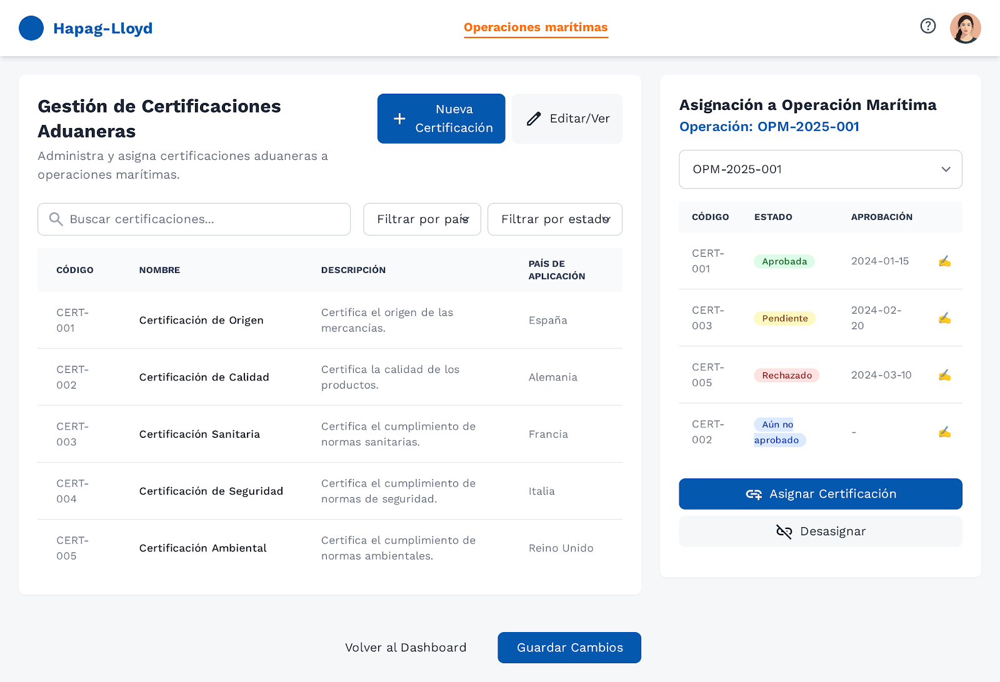

> [9. Preparación para Implementación](../../9.md) › [9.1. Sentencias SQL por módulo / prototipo](../9.1.md) › [9.1.3. Módulo 3 / Integrante 3](9.1.3.md)

# 9.1.3. Módulo 3 / Integrante 3

---

|Código Requerimiento |RF01|
|---|---|
|Código Interfaz| P01 |
|Imagen Interfaz|  |

---

**Eventos:**

#### **Carga inicial del Dashboard:**

Al cargar la pantalla, se obtienen las métricas y el listado de operaciones portuarias.

```sql
-- Query 1.1: Obtener conteo de operaciones por estado
SELECT 
    eo.nombre AS estado,
    COUNT(op.id_operacion_portuaria) AS cantidad
FROM gestion_maritima.OperacionPortuaria op
JOIN gestion_maritima.Operacion o ON op.id_operacion = o.id_operacion
JOIN gestion_maritima.EstadoOperacion eo ON o.id_estado_operacion = eo.id_estado_operacion
WHERE eo.nombre IN ('En Planificación', 'En Progreso', 'Completada')
GROUP BY eo.nombre
ORDER BY 
    CASE eo.nombre
        WHEN 'En Planificación' THEN 1
        WHEN 'En Progreso' THEN 2
        WHEN 'Completada' THEN 3
    END;

-- Query 1.2: Obtener listado de operaciones portuarias con paginación
SELECT 
    o.codigo AS codigo_operacion,
    p.nombre AS puerto,
    m.codigo AS muelle,
    top.nombre AS tipo_operacion,
    b.matricula AS matricula_buque,
    o.fecha_inicio,
    o.fecha_fin,
    eo.nombre AS estado
FROM gestion_maritima.OperacionPortuaria op
JOIN gestion_maritima.Operacion o ON op.id_operacion = o.id_operacion
JOIN gestion_maritima.Puerto p ON op.id_puerto = p.id_puerto
JOIN gestion_maritima.Muelle m ON op.id_muelle = m.id_muelle
JOIN gestion_maritima.TipoOperacionPortuaria top ON op.id_tipo_operacion_portuaria = top.id_tipo_operacion_portuaria
JOIN gestion_maritima.Buque b ON op.id_buque = b.id_buque
JOIN gestion_maritima.EstadoOperacion eo ON o.id_estado_operacion = eo.id_estado_operacion
ORDER BY o.fecha_inicio DESC
LIMIT 10 OFFSET 0; -- Paginación: 10 registros por página

-- Query 1.3: Obtener total de operaciones para paginación
SELECT COUNT(*) AS total_operaciones
FROM gestion_maritima.OperacionPortuaria op
JOIN gestion_maritima.Operacion o ON op.id_operacion = o.id_operacion;
```

---

#### **Búsqueda y filtrado:**

Cuando el usuario realiza una búsqueda o aplica filtros.

```sql
-- Query 1.4: Buscar operaciones portuarias por código, puerto o matrícula
-- Ejemplo: buscar "OPP" en cualquier campo
SELECT 
    o.codigo AS codigo_operacion,
    p.nombre AS puerto,
    m.codigo AS muelle,
    top.nombre AS tipo_operacion,
    b.matricula AS matricula_buque,
    o.fecha_inicio,
    o.fecha_fin,
    eo.nombre AS estado
FROM gestion_maritima.OperacionPortuaria op
JOIN gestion_maritima.Operacion o ON op.id_operacion = o.id_operacion
JOIN gestion_maritima.Puerto p ON op.id_puerto = p.id_puerto
JOIN gestion_maritima.Muelle m ON op.id_muelle = m.id_muelle
JOIN gestion_maritima.TipoOperacionPortuaria top ON op.id_tipo_operacion_portuaria = top.id_tipo_operacion_portuaria
JOIN gestion_maritima.Buque b ON op.id_buque = b.id_buque
JOIN gestion_maritima.EstadoOperacion eo ON o.id_estado_operacion = eo.id_estado_operacion
WHERE 
    (o.codigo ILIKE '%OPP%' 
     OR p.nombre ILIKE '%Callao%'
     OR b.matricula ILIKE '%PE%')
ORDER BY o.fecha_inicio DESC
LIMIT 10 OFFSET 0;

-- Query 1.5: Filtrar por tipo de operación específico
-- Ejemplo: solo operaciones de "Descarga"
SELECT 
    o.codigo AS codigo_operacion,
    p.nombre AS puerto,
    m.codigo AS muelle,
    top.nombre AS tipo_operacion,
    b.matricula AS matricula_buque,
    o.fecha_inicio,
    o.fecha_fin,
    eo.nombre AS estado
FROM gestion_maritima.OperacionPortuaria op
JOIN gestion_maritima.Operacion o ON op.id_operacion = o.id_operacion
JOIN gestion_maritima.Puerto p ON op.id_puerto = p.id_puerto
JOIN gestion_maritima.Muelle m ON op.id_muelle = m.id_muelle
JOIN gestion_maritima.TipoOperacionPortuaria top ON op.id_tipo_operacion_portuaria = top.id_tipo_operacion_portuaria
JOIN gestion_maritima.Buque b ON op.id_buque = b.id_buque
JOIN gestion_maritima.EstadoOperacion eo ON o.id_estado_operacion = eo.id_estado_operacion
WHERE top.nombre = 'Descarga'
ORDER BY o.fecha_inicio DESC
LIMIT 10 OFFSET 0;

-- Query 1.6: Búsqueda combinada (texto + filtro de tipo)
-- Ejemplo: buscar "Callao" Y que sea tipo "Carga"
SELECT 
    o.codigo AS codigo_operacion,
    p.nombre AS puerto,
    m.codigo AS muelle,
    top.nombre AS tipo_operacion,
    b.matricula AS matricula_buque,
    o.fecha_inicio,
    o.fecha_fin,
    eo.nombre AS estado
FROM gestion_maritima.OperacionPortuaria op
JOIN gestion_maritima.Operacion o ON op.id_operacion = o.id_operacion
JOIN gestion_maritima.Puerto p ON op.id_puerto = p.id_puerto
JOIN gestion_maritima.Muelle m ON op.id_muelle = m.id_muelle
JOIN gestion_maritima.TipoOperacionPortuaria top ON op.id_tipo_operacion_portuaria = top.id_tipo_operacion_portuaria
JOIN gestion_maritima.Buque b ON op.id_buque = b.id_buque
JOIN gestion_maritima.EstadoOperacion eo ON o.id_estado_operacion = eo.id_estado_operacion
WHERE 
    (o.codigo ILIKE '%Valparaíso%' 
     OR p.nombre ILIKE '%Valparaíso%'
     OR b.matricula ILIKE '%Valparaíso%')
    AND top.nombre = 'Carga'
ORDER BY o.fecha_inicio DESC
LIMIT 10 OFFSET 0;
```

---

#### **Filtro por tipo de operación:**

Obtener los tipos de operación disponibles para el filtro dropdown.

```sql
-- Query 1.7: Obtener tipos de operación portuaria para el dropdown
SELECT 
    id_tipo_operacion_portuaria,
    nombre
FROM gestion_maritima.TipoOperacionPortuaria
ORDER BY nombre;
```

---

#### **Botón "Ver Detalles":**

Redirige a la pantalla de detalles de la operación seleccionada (pasando el `id_operacion` o `codigo`).

---

#### **Botón "+ Nueva Operación Portuaria":**

Redirige al formulario de creación de nueva operación portuaria (siguiente pantalla).


---

|Código Requerimiento |RF02|
|---|---|
|Código Interfaz| P02 |
|Imagen Interfaz|  |

---

**Eventos:**

#### **Carga inicial del formulario:**

Al cargar la pantalla, se obtienen los datos necesarios para los campos desplegables y se genera el código automático.

```sql
-- Query 2.1: Generar código automático de operación
SELECT 
    'OP-' || TO_CHAR(CURRENT_DATE, 'YYYY') || '-' || 
    LPAD((COUNT(*) + 1)::TEXT, 3, '0') AS codigo_operacion
FROM gestion_maritima.Operacion
WHERE EXTRACT(YEAR FROM fecha_inicio) = EXTRACT(YEAR FROM CURRENT_DATE);

-- Query 2.2: Obtener datos del usuario logueado
SELECT 
    u.id_usuario,
    e.nombre || ' ' || e.apellido AS nombre_completo,
    e.codigo AS codigo_empleado,
    u.correo_electronico
FROM gestion_maritima.Usuario u
JOIN gestion_maritima.Empleado e ON u.id_empleado = e.id_empleado
WHERE u.id_usuario = 'e5f6a7b8-c9d0-4e1f-2a3b-4c5d6e7f8a9b'; -- ID del usuario logueado (ejemplo)

-- Query 2.3: Obtener buques disponibles
SELECT 
    b.id_buque,
    b.nombre,
    b.matricula,
    b.capacidad AS capacidad_teu,
    b.peso,
    b.ubicacion_actual,
    ee.nombre AS estado
FROM gestion_maritima.Buque b
JOIN gestion_maritima.EstadoEmbarcacion ee ON b.id_estado_embarcacion = ee.id_estado_embarcacion
WHERE ee.nombre = 'Disponible'
ORDER BY b.nombre;

-- Query 2.4: Obtener puertos disponibles
SELECT 
    id_puerto,
    codigo,
    nombre,
    pais,
    direccion
FROM gestion_maritima.Puerto
ORDER BY nombre;

-- Query 2.5: Obtener muelles de un puerto específico
-- Ejemplo: muelles del Puerto del Callao
SELECT 
    m.id_muelle,
    m.codigo,
    m.ubicacion,
    m.capacidad,
    m.disponibilidad
FROM gestion_maritima.Muelle m
WHERE m.id_puerto = 'a1b2c3d4-e5f6-4a7b-8c9d-0e1f2a3b4c5d' -- Puerto del Callao
    AND m.disponibilidad = TRUE
ORDER BY m.codigo;

-- Query 2.6: Obtener tipos de operación portuaria
SELECT 
    id_tipo_operacion_portuaria,
    nombre
FROM gestion_maritima.TipoOperacionPortuaria
ORDER BY nombre;

-- Query 2.7: Obtener trabajadores portuarios asignados a una operación portuaria específica
SELECT DISTINCT
    tp.id_trabajador_portuario,
    e.codigo AS codigo_empleado,
    e.dni,
    e.nombre || ' ' || e.apellido AS nombre_completo,
    ee.nombre AS especialidad,
    t.nombre AS turno,
    oep.fecha_asignacion,
    oep.fecha_devolucion,
    e.nombre
FROM gestion_maritima.OperacionEquipoPortuario oep
JOIN gestion_maritima.TrabajadorPortuario tp ON oep.id_trabajador_portuario = tp.id_trabajador_portuario
JOIN gestion_maritima.Empleado e ON tp.id_empleado = e.id_empleado
JOIN gestion_maritima.EspecialidadEmpleado ee ON e.id_especialidad_empleado = ee.id_especialidad_empleado
JOIN gestion_maritima.Turno t ON tp.id_turno = t.id_turno
WHERE oep.id_operacion_portuaria = 'b0c1d2e3-f4a5-4b6c-7d8e-9f0a1b2c3d4e' -- Parámetro
ORDER BY oep.fecha_asignacion, e.nombre;

-- Query 2.8: Obtener equipos portuarios asignados a una operación portuaria específica
SELECT 
    ep.id_equipo_portuario,
    ep.codigo,
    tep.nombre AS tipo_equipo,
    ep.capacidad,
    eep.nombre AS estado,
    ep.ubicacion,
    e.nombre || ' ' || e.apellido AS trabajador_asignado,
    oep.fecha_asignacion,
    oep.fecha_devolucion
FROM gestion_maritima.OperacionEquipoPortuario oep
JOIN gestion_maritima.EquipoPortuario ep ON oep.id_equipo_portuario = ep.id_equipo_portuario
JOIN gestion_maritima.TipoEquipoPortuario tep ON ep.id_tipo_equipo_portuario = tep.id_tipo_equipo_portuario
JOIN gestion_maritima.EstadoEquipoPortuario eep ON ep.id_estado_equipo_portuario = eep.id_estado_equipo_portuario
JOIN gestion_maritima.TrabajadorPortuario tp ON oep.id_trabajador_portuario = tp.id_trabajador_portuario
JOIN gestion_maritima.Empleado e ON tp.id_empleado = e.id_empleado
WHERE oep.id_operacion_portuaria = 'b0c1d2e3-f4a5-4b6c-7d8e-9f0a1b2c3d4e' -- Parámetro
ORDER BY oep.fecha_asignacion, ep.codigo;

-- Query 2.9: Obtener contenedores en estiba de una operación portuaria específica
SELECT 
    c.id_contenedor,
    c.codigo,
    tc.nombre AS tipo_contenedor,
    tc.codigo AS codigo_tipo,
    c.peso,
    c.capacidad,
    c.dimensiones,
    ec.nombre AS estado,
    est.ubicacion,
    est.zona_buque
FROM gestion_maritima.Estiba est
JOIN gestion_maritima.Contenedor c ON est.id_contenedor = c.id_contenedor
JOIN gestion_maritima.TipoContenedor tc ON c.id_tipo_contenedor = tc.id_tipo_contenedor
JOIN gestion_maritima.EstadoContenedor ec ON c.id_estado_contenedor = ec.id_estado_contenedor
WHERE est.id_operacion_portuaria = 'b0c1d2e3-f4a5-4b6c-7d8e-9f0a1b2c3d4e' -- Parámetro
ORDER BY est.zona_buque, est.ubicacion;

-- Query 2.10: Obtener tipos de mercancía de contenedores en una operación portuaria específica
SELECT DISTINCT
    cm.tipo_mercancia,
    COUNT(DISTINCT c.id_contenedor) AS cantidad_contenedores
FROM gestion_maritima.Estiba est
JOIN gestion_maritima.Contenedor c ON est.id_contenedor = c.id_contenedor
JOIN gestion_maritima.ContenedorMercancia cm ON c.id_contenedor = cm.id_contenedor
WHERE est.id_operacion_portuaria = 'b0c1d2e3-f4a5-4b6c-7d8e-9f0a1b2c3d4e' -- Parámetro
GROUP BY cm.tipo_mercancia
ORDER BY cm.tipo_mercancia;

-- Query 2.11: Obtener detalle completo de contenedores con sus mercancías en una operación portuaria
SELECT 
    c.id_contenedor,
    c.codigo,
    tc.nombre AS tipo_contenedor,
    c.peso,
    c.capacidad,
    c.dimensiones,
    ec.nombre AS estado,
    est.ubicacion,
    est.zona_buque,
    STRING_AGG(cm.tipo_mercancia, ', ') AS tipos_mercancia
FROM gestion_maritima.Estiba est
JOIN gestion_maritima.Contenedor c ON est.id_contenedor = c.id_contenedor
JOIN gestion_maritima.TipoContenedor tc ON c.id_tipo_contenedor = tc.id_tipo_contenedor
JOIN gestion_maritima.EstadoContenedor ec ON c.id_estado_contenedor = ec.id_estado_contenedor
LEFT JOIN gestion_maritima.ContenedorMercancia cm ON c.id_contenedor = cm.id_contenedor
WHERE est.id_operacion_portuaria = 'b0c1d2e3-f4a5-4b6c-7d8e-9f0a1b2c3d4e' -- Parámetro
GROUP BY c.id_contenedor, c.codigo, tc.nombre, c.peso, c.capacidad, 
         c.dimensiones, ec.nombre, est.ubicacion, est.zona_buque
ORDER BY est.zona_buque, est.ubicacion;
```
---


#### **Botón "Iniciar Operación":**

Se crea la operación portuaria completa con todas sus relaciones.

```sql
-- Query 2.11: Crear nueva operación portuaria (INSERT completo)

-- Paso 1: Insertar en Operacion
INSERT INTO gestion_maritima.Operacion (
    id_operacion,
    codigo,
    fecha_inicio,
    fecha_fin,
    id_estado_operacion
)
VALUES (
    gen_random_uuid(),
    'OP-2024-521',
    '2024-05-21 03:00:00',
    '2024-05-21 11:00:00',
    (SELECT id_estado_operacion FROM gestion_maritima.EstadoOperacion WHERE nombre = 'En Planificación')
)
RETURNING id_operacion;
-- Supongamos que retorna: '11111111-2222-3333-4444-555555555555'

-- Paso 2: Insertar en OperacionPortuaria
INSERT INTO gestion_maritima.OperacionPortuaria (
    id_operacion_portuaria,
    id_operacion,
    codigo,
    id_puerto,
    id_muelle,
    id_tipo_operacion_portuaria,
    id_buque
)
VALUES (
    gen_random_uuid(),
    '11111111-2222-3333-4444-555555555555', -- ID del Paso 1
    'OPP-2024-521',
    'a1b2c3d4-e5f6-4a7b-8c9d-0e1f2a3b4c5d', -- Puerto del Callao (Algeciras en la imagen)
    'f6a7b8c9-d0e1-4f2a-3b4c-5d6e7f8a9b0c', -- Muelle seleccionado (Muelle 7B)
    (SELECT id_tipo_operacion_portuaria FROM gestion_maritima.TipoOperacionPortuaria WHERE nombre = 'Descarga'),
    'e1f2a3b4-c5d6-4e7f-8a9b-0c1d2e3f4a5b' -- Buque MMM Algeciras (matrícula 9863297)
)
RETURNING id_operacion_portuaria;
-- Supongamos que retorna: '22222222-3333-4444-5555-666666666666'

-- Paso 3: Asignar empleados a la operación
-- Asignar operador de grúa (Ana Gómez del ejemplo)
INSERT INTO gestion_maritima.OperacionEmpleado (
    id_operacion_empleado,
    id_operacion,
    id_empleado,
    fecha_asignacion,
    fecha_desasignacion
)
VALUES (
    gen_random_uuid(),
    '11111111-2222-3333-4444-555555555555', -- ID del Paso 1
    'd4e5f6a7-b8c9-4d0e-1f2a-3b4c5d6e7f8a', -- ID del empleado operador de grúa
    CURRENT_DATE,
    NULL
);

-- Paso 4: Asignar usuario como responsable de la operación
INSERT INTO gestion_maritima.UsuarioOperacion (
    id_usuario_operacion,
    id_usuario,
    id_operacion,
    fecha_asignacion,
    rol_en_operacion
)
VALUES (
    gen_random_uuid(),
    'e5f6a7b8-c9d0-4e1f-2a3b-4c5d6e7f8a9b', -- Usuario logueado (J. Perez)
    '11111111-2222-3333-4444-555555555555', -- ID del Paso 1
    CURRENT_DATE,
    'Supervisor de Operación'
);

-- Paso 5: Asignar equipos portuarios a la operación
-- Ejemplo: asignar 2 Grúas Pórtico, 3 Reach Stacker, 5 Tractocamiones
INSERT INTO gestion_maritima.OperacionEquipoPortuario (
    id_operacion_equipo_portuario,
    id_operacion_portuaria,
    id_equipo_portuario,
    id_trabajador_portuario,
    fecha_asignacion,
    fecha_devolucion
)
VALUES
    (gen_random_uuid(), '22222222-3333-4444-5555-666666666666', 
     'b6c7d8e9-f0a1-4b2c-3d4e-5f6a7b8c9d0e', -- Grúa Pórtico 1
     'c9d0e1f2-a3b4-4c5d-6e7f-8a9b0c1d2e3f', -- Trabajador portuario asignado
     '2024-05-21 03:00:00', NULL),
    (gen_random_uuid(), '22222222-3333-4444-5555-666666666666',
     'c7d8e9f0-a1b2-4c3d-4e5f-6a7b8c9d0e1f', -- Reach Stacker 1
     'c9d0e1f2-a3b4-4c5d-6e7f-8a9b0c1d2e3f',
     '2024-05-21 03:00:00', NULL);
-- Repetir para los demás equipos...

-- Paso 6: Asignar contenedores a la operación
INSERT INTO gestion_maritima.OperacionContenedor (
    id_operacion_contenedor,
    id_operacion,
    id_contenedor,
    fecha_asignacion
)
VALUES
    (gen_random_uuid(), '11111111-2222-3333-4444-555555555555',
     'd2e3f4a5-b6c7-4d8e-9f0a-1b2c3d4e5f6a', -- CONT-123
     CURRENT_DATE),
    (gen_random_uuid(), '11111111-2222-3333-4444-555555555555',
     'e3f4a5b6-c7d8-4e9f-0a1b-2c3d4e5f6a7b', -- CONT-456
     CURRENT_DATE),
    (gen_random_uuid(), '11111111-2222-3333-4444-555555555555',
     'f4a5b6c7-d8e9-4f0a-1b2c-3d4e5f6a7b8c', -- CONT-789
     CURRENT_DATE);

-- Paso 7: Actualizar estado de contenedores a "En Uso"
UPDATE gestion_maritima.Contenedor
SET id_estado_contenedor = (SELECT id_estado_contenedor FROM gestion_maritima.EstadoContenedor WHERE nombre = 'En Uso')
WHERE id_contenedor IN (
    'd2e3f4a5-b6c7-4d8e-9f0a-1b2c3d4e5f6a',
    'e3f4a5b6-c7d8-4e9f-0a1b-2c3d4e5f6a7b',
    'f4a5b6c7-d8e9-4f0a-1b2c-3d4e5f6a7b8c'
);

-- Paso 8: Actualizar disponibilidad del muelle
UPDATE gestion_maritima.Muelle
SET disponibilidad = FALSE
WHERE id_muelle = 'f6a7b8c9-d0e1-4f2a-3b4c-5d6e7f8a9b0c'; -- Muelle 7B
```

---

#### **Botón "Cancelar":**

Redirige a la pantalla anterior sin guardar cambios.

---

|Código Requerimiento |RF03|
|---|---|
|Código Interfaz| P03 |
|Imagen Interfaz|  |

---

**Eventos:**

#### **Carga inicial de la pantalla:**

Al cargar, se muestran todos los buques disponibles con paginación.

```sql
-- Query 3.1: Obtener listado de buques disponibles (con paginación)
SELECT 
    b.id_buque,
    b.matricula,
    b.nombre,
    b.capacidad,
    b.peso,
    b.ubicacion_actual,
    ee.nombre AS estado
FROM gestion_maritima.Buque b
JOIN gestion_maritima.EstadoEmbarcacion ee ON b.id_estado_embarcacion = ee.id_estado_embarcacion
WHERE ee.nombre IN ('Operativo', 'En operación')
ORDER BY b.nombre
LIMIT 10 OFFSET 0; -- Página 1: OFFSET 0, Página 2: OFFSET 10, etc.

-- Query 3.2: Obtener total de buques para paginación
SELECT COUNT(*) AS total_buques
FROM gestion_maritima.Buque b
JOIN gestion_maritima.EstadoEmbarcacion ee ON b.id_estado_embarcacion = ee.id_estado_embarcacion
WHERE ee.nombre IN ('Operativo', 'En operación');
```

---

#### **Búsqueda de embarcaciones:**

Filtrar buques por texto en nombre o matrícula.

```sql
-- Query 3.3: Buscar buques por nombre o matrícula
-- Ejemplo: buscar "Maersk Lima"
SELECT 
    b.id_buque,
    b.matricula,
    b.nombre,
    b.capacidad,
    b.peso,
    b.ubicacion_actual,
    ee.nombre AS estado
FROM gestion_maritima.Buque b
JOIN gestion_maritima.EstadoEmbarcacion ee ON b.id_estado_embarcacion = ee.id_estado_embarcacion
WHERE ee.nombre IN ('Operativo', 'En operación')
    AND (b.nombre ILIKE '%Maersk Lima%' 
         OR b.matricula ILIKE '%Maersk Lima%')
ORDER BY b.nombre
LIMIT 10 OFFSET 0;
```

```sql
-- Query 3.4: Buscar buques por rango de peso
-- Ejemplo: peso entre 5000 y 15000 toneladas
SELECT 
    b.id_buque,
    b.matricula,
    b.nombre,
    b.capacidad,
    b.peso,
    b.ubicacion_actual,
    ee.nombre AS estado
FROM gestion_maritima.Buque b
JOIN gestion_maritima.EstadoEmbarcacion ee ON b.id_estado_embarcacion = ee.id_estado_embarcacion
WHERE ee.nombre IN ('Disponible', 'En operación')
    AND b.peso BETWEEN 5000 AND 1500000 -- Parámetros: peso_minimo y peso_maximo
ORDER BY b.nombre
LIMIT 10 OFFSET 0;

-- Query 3.5: Buscar buques por rango de capacidad
-- Ejemplo: capacidad entre 100 y 500 TEU
SELECT 
    b.id_buque,
    b.matricula,
    b.nombre,
    b.capacidad,
    b.peso,
    b.ubicacion_actual,
    ee.nombre AS estado
FROM gestion_maritima.Buque b
JOIN gestion_maritima.EstadoEmbarcacion ee ON b.id_estado_embarcacion = ee.id_estado_embarcacion
WHERE ee.nombre IN ('Operativo', 'En operación')
    AND b.capacidad BETWEEN 1000 AND 50000 -- Parámetros: capacidad_minima y capacidad_maxima
ORDER BY b.nombre
LIMIT 10 OFFSET 0;

-- Query 3.6: Buscar buques combinando todos los filtros (nombre/matrícula, peso y capacidad)
-- Ejemplo completo con todos los filtros
SELECT 
    b.id_buque,
    b.matricula,
    b.nombre,
    b.capacidad,
    b.peso,
    b.ubicacion_actual,
    ee.nombre AS estado
FROM gestion_maritima.Buque b
JOIN gestion_maritima.EstadoEmbarcacion ee ON b.id_estado_embarcacion = ee.id_estado_embarcacion
WHERE ee.nombre IN ('Operativo', 'En operación')
    AND (b.nombre ILIKE '%ae%' OR b.matricula ILIKE '%texto_busqueda%')
    AND b.peso BETWEEN 5000 AND 150000 -- peso_minimo y peso_maximo
    AND b.capacidad BETWEEN 1000 AND 20000 -- capacidad_minima y capacidad_maxima
ORDER BY b.nombre
LIMIT 10 OFFSET 0;


-- Query 3.7: Contar total de buques con filtros aplicados (para paginación)
SELECT COUNT(*) AS total_buques
FROM gestion_maritima.Buque b
JOIN gestion_maritima.EstadoEmbarcacion ee ON b.id_estado_embarcacion = ee.id_estado_embarcacion
WHERE ee.nombre IN ('Operativo', 'En operación')
    AND (b.nombre ILIKE '%ae%' OR b.matricula ILIKE '%M%')
    AND b.peso BETWEEN 50000 AND 150000
    AND b.capacidad BETWEEN 100 AND 50000;
```


---

#### **Selección de buque:**

Cuando el usuario selecciona un buque (radio button) y presiona "Confirmar".

```sql
-- Query 3.8: Obtener detalles completos del buque seleccionado
SELECT 
    b.id_buque,
    b.matricula,
    b.nombre,
    b.capacidad,
    b.peso,
    b.ubicacion_actual,
    ee.nombre AS estado
FROM gestion_maritima.Buque b
JOIN gestion_maritima.EstadoEmbarcacion ee ON b.id_estado_embarcacion = ee.id_estado_embarcacion
WHERE b.id_buque = 'e1f2a3b4-c5d6-4e7f-8a9b-0c1d2e3f4a5b'; -- ID del buque seleccionado

-- Query 3.9: Verificar certificaciones vigentes del buque
SELECT 
    c.nombre AS certificacion,
    cb.fecha_emision,
    cb.fecha_vencimiento,
    CASE 
        WHEN cb.fecha_vencimiento < CURRENT_DATE THEN 'Vencida'
        WHEN cb.fecha_vencimiento < CURRENT_DATE + INTERVAL '30 days' THEN 'Por vencer'
        ELSE 'Vigente'
    END AS estado_certificacion
FROM gestion_maritima.CertificacionBuque cb
JOIN gestion_maritima.Certificacion c ON cb.id_certificacion = c.id_certificacion
WHERE cb.id_buque = 'e1f2a3b4-c5d6-4e7f-8a9b-0c1d2e3f4a5b' -- ID del buque seleccionado
ORDER BY cb.fecha_vencimiento;
```

---

#### **Botón "Deseleccionar":**

Limpia la selección actual del radio button.

---

#### **Botón "Volver":**

Regresa a la pantalla anterior (P02) sin confirmar la selección.

---

#### **Botón "Confirmar":**

Guarda el buque seleccionado y regresa a la pantalla P02 con los datos del buque.

```sql
-- Query 3.10: Al confirmar, retornar los datos del buque seleccionado
-- Este query se ejecuta al hacer click en "Confirmar"
SELECT 
    b.id_buque,
    b.matricula,
    b.nombre,
    b.capacidad,
    b.peso,
    b.ubicacion_actual
FROM gestion_maritima.Buque b
WHERE b.id_buque = 'e1f2a3b4-c5d6-4e7f-8a9b-0c1d2e3f4a5b'; -- ID seleccionado
```

---

|Código Requerimiento |RF04|
|---|---|
|Código Interfaz| P04 |
|Imagen Interfaz|  |

---


**Eventos:**

#### **Carga inicial de la pantalla:**

Al cargar, se muestran los equipos portuarios disponibles y su estado actual.

```sql
-- Query 4.1: Obtener equipos portuarios disponibles y en uso
SELECT 
    ep.id_equipo_portuario,
    ep.codigo,
    tep.nombre AS tipo_equipo,
    eep.nombre AS estado,
    ep.ubicacion,
    ep.capacidad
FROM gestion_maritima.EquipoPortuario ep
JOIN gestion_maritima.TipoEquipoPortuario tep ON ep.id_tipo_equipo_portuario = tep.id_tipo_equipo_portuario
JOIN gestion_maritima.EstadoEquipoPortuario eep ON ep.id_estado_equipo_portuario = eep.id_estado_equipo_portuario
WHERE eep.nombre IN ('Operativo', 'En Uso', 'En Mantenimiento', 'Disponible')
ORDER BY ep.codigo;

-- Query 4.2: Obtener equipos ya asignados a la operación actual
-- Ejemplo: operación OP-2024-002
SELECT 
    oep.id_operacion_equipo_portuario,
    ep.id_equipo_portuario,
    ep.codigo,
    tep.nombre AS tipo_equipo,
    eep.nombre AS estado,
    ep.ubicacion,
    ep.capacidad,
    e.nombre || ' ' || e.apellido AS trabajador_asignado,
    oep.fecha_asignacion,
    oep.fecha_devolucion
FROM gestion_maritima.OperacionEquipoPortuario oep
JOIN gestion_maritima.EquipoPortuario ep ON oep.id_equipo_portuario = ep.id_equipo_portuario
JOIN gestion_maritima.TipoEquipoPortuario tep ON ep.id_tipo_equipo_portuario = tep.id_tipo_equipo_portuario
JOIN gestion_maritima.EstadoEquipoPortuario eep ON ep.id_estado_equipo_portuario = eep.id_estado_equipo_portuario
JOIN gestion_maritima.TrabajadorPortuario tp ON oep.id_trabajador_portuario = tp.id_trabajador_portuario
JOIN gestion_maritima.Empleado e ON tp.id_empleado = e.id_empleado
JOIN gestion_maritima.OperacionPortuaria op ON oep.id_operacion_portuaria = op.id_operacion_portuaria
JOIN gestion_maritima.Operacion o ON op.id_operacion = o.id_operacion
WHERE o.codigo = 'OP-2024-002' -- Código de la operación actual
ORDER BY ep.codigo;
```

---

#### **Búsqueda de equipos:**

Filtrar equipos por código, tipo o ubicación.

```sql
-- Query 4.3: Buscar equipos por código, tipo o ubicación
-- Ejemplo: buscar "Grúa"
SELECT 
    ep.id_equipo_portuario,
    ep.codigo,
    tep.nombre AS tipo_equipo,
    eep.nombre AS estado,
    ep.ubicacion,
    ep.capacidad
FROM gestion_maritima.EquipoPortuario ep
JOIN gestion_maritima.TipoEquipoPortuario tep ON ep.id_tipo_equipo_portuario = tep.id_tipo_equipo_portuario
JOIN gestion_maritima.EstadoEquipoPortuario eep ON ep.id_estado_equipo_portuario = eep.id_estado_equipo_portuario
WHERE (ep.codigo ILIKE '%Grúa%' 
       OR tep.nombre ILIKE '%Grúa%'
       OR ep.ubicacion ILIKE '%Grúa%')
    AND eep.nombre IN ('Operativo', 'Disponible', 'En Uso', 'En Mantenimiento')
ORDER BY ep.codigo;
```

---

#### **Filtrar por estado:**

Obtener estados disponibles y filtrar equipos por estado específico.

```sql
-- Query 4.4: Obtener estados de equipos para filtro dropdown
SELECT 
    id_estado_equipo_portuario,
    nombre
FROM gestion_maritima.EstadoEquipoPortuario
ORDER BY nombre;

-- Query 4.5: Filtrar equipos por estado específico
-- Ejemplo: solo equipos "Disponible"
SELECT 
    ep.id_equipo_portuario,
    ep.codigo,
    tep.nombre AS tipo_equipo,
    eep.nombre AS estado,
    ep.ubicacion,
    ep.capacidad
FROM gestion_maritima.EquipoPortuario ep
JOIN gestion_maritima.TipoEquipoPortuario tep ON ep.id_tipo_equipo_portuario = tep.id_tipo_equipo_portuario
JOIN gestion_maritima.EstadoEquipoPortuario eep ON ep.id_estado_equipo_portuario = eep.id_estado_equipo_portuario
WHERE eep.nombre = 'Disponible'
ORDER BY ep.codigo;

```

---

#### **Filtros combinados:**

```sql
-- Query 4.6: Búsqueda y filtro por estado combinados
-- Ejemplo: buscar "Pórtico" Y estado "Disponible"
SELECT 
    ep.id_equipo_portuario,
    ep.codigo,
    tep.nombre AS tipo_equipo,
    eep.nombre AS estado,
    ep.ubicacion,
    ep.capacidad
FROM gestion_maritima.EquipoPortuario ep
JOIN gestion_maritima.TipoEquipoPortuario tep ON ep.id_tipo_equipo_portuario = tep.id_tipo_equipo_portuario
JOIN gestion_maritima.EstadoEquipoPortuario eep ON ep.id_estado_equipo_portuario = eep.id_estado_equipo_portuario
WHERE (ep.codigo ILIKE '%Pórtico%' 
       OR tep.nombre ILIKE '%Pórtico%'
       OR ep.ubicacion ILIKE '%Pórtico%')
    AND eep.nombre = 'Disponible'
ORDER BY ep.codigo;
```

---

#### **Botón "Confirmar Asignación":**

Asigna los equipos seleccionados a la operación portuaria.

```sql
-- Query 4.7: Asignar equipos seleccionados a la operación
-- Se ejecuta por cada equipo seleccionado (checkbox marcado)

-- Ejemplo: asignar equipo EQ-001 (Grúa Pórtico)
INSERT INTO gestion_maritima.OperacionEquipoPortuario (
    id_operacion_equipo_portuario,
    id_operacion_portuaria,
    id_equipo_portuario,
    id_trabajador_portuario,
    fecha_asignacion,
    fecha_devolucion
)
VALUES (
    gen_random_uuid(),
    'b0c1d2e3-f4a5-4b6c-7d8e-9f0a1b2c3d4e', -- ID de la operación portuaria OP-2024-007
    'b6c7d8e9-f0a1-4b2c-3d4e-5f6a7b8c9d0e', -- ID del equipo EQ-001
    'c9d0e1f2-a3b4-4c5d-6e7f-8a9b0c1d2e3f', -- ID del trabajador portuario asignado
    CURRENT_TIMESTAMP,
    NULL
);

-- Paso 2: Actualizar estado del equipo a "En Uso"
UPDATE gestion_maritima.EquipoPortuario
SET id_estado_equipo_portuario = (
    SELECT id_estado_equipo_portuario 
    FROM gestion_maritima.EstadoEquipoPortuario 
    WHERE nombre = 'En uso'
)
WHERE id_equipo_portuario = 'b6c7d8e9-f0a1-4b2c-3d4e-5f6a7b8c9d0e'; -- EQ-001

-- Repetir para cada equipo seleccionado...
```

---

#### **Botón "Desasignar" (eliminar equipos seleccionados):**

Desasigna equipos de la operación.

```sql
-- Query 4.8: Desasignar equipos seleccionados
-- Ejemplo: desasignar equipo EQ-003

-- Paso 1: Actualizar fecha de devolución
UPDATE gestion_maritima.OperacionEquipoPortuario
SET fecha_devolucion = CURRENT_TIMESTAMP
WHERE id_operacion_portuaria = 'b0c1d2e3-f4a5-4b6c-7d8e-9f0a1b2c3d4e' -- OP-2024-007
    AND id_equipo_portuario = 'd8e9f0a1-b2c3-4d4e-5f6a-7b8c9d0e1f2a' -- EQ-003
    AND fecha_devolucion IS NULL;

-- Paso 2: Actualizar estado del equipo a "Disponible"
UPDATE gestion_maritima.EquipoPortuario
SET id_estado_equipo_portuario = (
    SELECT id_estado_equipo_portuario 
    FROM gestion_maritima.EstadoEquipoPortuario 
    WHERE nombre = 'Disponible'
)
WHERE id_equipo_portuario = 'd8e9f0a1-b2c3-4d4e-5f6a-7b8c9d0e1f2a'; -- EQ-003
```

---

#### **Obtener resumen de equipos asignados por tipo:**

```sql
-- Query 4.9: Resumen de equipos asignados agrupados por tipo
SELECT 
    tep.nombre AS tipo_equipo,
    COUNT(*) AS cantidad_asignada
FROM gestion_maritima.OperacionEquipoPortuario oep
JOIN gestion_maritima.EquipoPortuario ep ON oep.id_equipo_portuario = ep.id_equipo_portuario
JOIN gestion_maritima.TipoEquipoPortuario tep ON ep.id_tipo_equipo_portuario = tep.id_tipo_equipo_portuario
JOIN gestion_maritima.OperacionPortuaria op ON oep.id_operacion_portuaria = op.id_operacion_portuaria
JOIN gestion_maritima.Operacion o ON op.id_operacion = o.id_operacion
WHERE o.codigo = 'OP-2024-007'
    AND oep.fecha_devolucion IS NULL
GROUP BY tep.nombre
ORDER BY tep.nombre;
```

---

#### **Botón "Volver a Editar Operación":**

Regresa a la pantalla P02 (Registro de Operación Portuaria).

---

|Código Requerimiento |RF05|
|---|---|
|Código Interfaz| P05 |
|Imagen Interfaz|  |

---

## **Eventos:**

#### **Carga inicial del Dashboard:**

Al cargar la pantalla, se obtiene el listado de operaciones marítimas con su información principal.

```sql
-- Query 5.1: Obtener listado de operaciones marítimas con paginación
SELECT 
    om.codigo AS codigo_operacion,
    om.cantidad_contenedores,
    en.nombre AS estatus_navegacion,
    om.porcentaje_trayecto,
    b.matricula AS matricula_buque,
    o.id_operacion,
    om.id_operacion_maritima
FROM gestion_maritima.OperacionMaritima om
JOIN gestion_maritima.Operacion o ON om.id_operacion = o.id_operacion
JOIN gestion_maritima.EstatusNavegacion en ON om.id_estatus_navegacion = en.id_estatus_navegacion
JOIN gestion_maritima.Buque b ON om.id_buque = b.id_buque
ORDER BY o.fecha_inicio DESC
LIMIT 10 OFFSET 0; -- Paginación: 10 registros por página

-- Query 5.2: Obtener total de operaciones marítimas para paginación
SELECT COUNT(*) AS total_operaciones
FROM gestion_maritima.OperacionMaritima om
JOIN gestion_maritima.Operacion o ON om.id_operacion = o.id_operacion;
```

---

#### **Búsqueda por código o buque:**

Cuando el usuario busca operaciones por código de operación o matrícula de buque.

```sql
-- Query 5.3: Buscar operaciones marítimas por código o matrícula de buque
-- Ejemplo: buscar "OPM" o "IMO"
SELECT 
    om.codigo AS codigo_operacion,
    om.cantidad_contenedores,
    en.nombre AS estatus_navegacion,
    om.porcentaje_trayecto,
    b.matricula AS matricula_buque,
    o.id_operacion,
    om.id_operacion_maritima
FROM gestion_maritima.OperacionMaritima om
JOIN gestion_maritima.Operacion o ON om.id_operacion = o.id_operacion
JOIN gestion_maritima.EstatusNavegacion en ON om.id_estatus_navegacion = en.id_estatus_navegacion
JOIN gestion_maritima.Buque b ON om.id_buque = b.id_buque
WHERE 
    om.codigo ILIKE '%OPM%' 
    OR b.matricula ILIKE '%IMO%'
ORDER BY o.fecha_inicio DESC
LIMIT 10 OFFSET 0;
```

---

#### **Filtro por estatus de navegación:**

Obtener los estatus de navegación disponibles para el filtro dropdown.

```sql
-- Query 5.4: Obtener estatus de navegación para el dropdown
SELECT 
    id_estatus_navegacion,
    nombre
FROM gestion_maritima.EstatusNavegacion
ORDER BY nombre;
```

---

#### **Filtrar por estatus de navegación específico:**

Cuando el usuario selecciona un estatus específico del dropdown.

```sql
-- Query 5.5: Filtrar operaciones marítimas por estatus de navegación
-- Ejemplo: solo operaciones "Navegando"
SELECT 
    om.codigo AS codigo_operacion,
    om.cantidad_contenedores,
    en.nombre AS estatus_navegacion,
    om.porcentaje_trayecto,
    b.matricula AS matricula_buque,
    o.id_operacion,
    om.id_operacion_maritima
FROM gestion_maritima.OperacionMaritima om
JOIN gestion_maritima.Operacion o ON om.id_operacion = o.id_operacion
JOIN gestion_maritima.EstatusNavegacion en ON om.id_estatus_navegacion = en.id_estatus_navegacion
JOIN gestion_maritima.Buque b ON om.id_buque = b.id_buque
WHERE en.nombre = 'Navegando'
ORDER BY o.fecha_inicio DESC
LIMIT 10 OFFSET 0;
```

---

#### **Búsqueda combinada (texto + filtro de estatus):**

Combinar búsqueda de texto con filtro de estatus de navegación.

```sql
-- Query 5.6: Búsqueda combinada por código/matrícula Y estatus
-- Ejemplo: buscar "OPM-2025" Y que esté "En Puerto"
SELECT 
    om.codigo AS codigo_operacion,
    om.cantidad_contenedores,
    en.nombre AS estatus_navegacion,
    om.porcentaje_trayecto,
    b.matricula AS matricula_buque,
    o.id_operacion,
    om.id_operacion_maritima
FROM gestion_maritima.OperacionMaritima om
JOIN gestion_maritima.Operacion o ON om.id_operacion = o.id_operacion
JOIN gestion_maritima.EstatusNavegacion en ON om.id_estatus_navegacion = en.id_estatus_navegacion
JOIN gestion_maritima.Buque b ON om.id_buque = b.id_buque
WHERE 
    (om.codigo ILIKE '%OPM-2024%' OR b.matricula ILIKE '%OPM-2024%')
    AND en.nombre = 'En Puerto'
ORDER BY o.fecha_inicio DESC
LIMIT 10 OFFSET 0;
```

---

#### **Filtros adicionales (si se implementan en el botón "Filtros"):**

Filtrar por rango de porcentaje de trayecto, cantidad de contenedores, etc.

```sql
-- Query 5.7: Filtrar por rango de porcentaje de trayecto
-- Ejemplo: operaciones con más del 75% completado
SELECT 
    om.codigo AS codigo_operacion,
    om.cantidad_contenedores,
    en.nombre AS estatus_navegacion,
    om.porcentaje_trayecto,
    b.matricula AS matricula_buque,
    o.id_operacion,
    om.id_operacion_maritima
FROM gestion_maritima.OperacionMaritima om
JOIN gestion_maritima.Operacion o ON om.id_operacion = o.id_operacion
JOIN gestion_maritima.EstatusNavegacion en ON om.id_estatus_navegacion = en.id_estatus_navegacion
JOIN gestion_maritima.Buque b ON om.id_buque = b.id_buque
WHERE om.porcentaje_trayecto >= 75.00
ORDER BY o.fecha_inicio DESC
LIMIT 10 OFFSET 0;

-- Query 5.8: Filtrar por cantidad mínima de contenedores
-- Ejemplo: operaciones con 300 o más contenedores
SELECT 
    om.codigo AS codigo_operacion,
    om.cantidad_contenedores,
    en.nombre AS estatus_navegacion,
    om.porcentaje_trayecto,
    b.matricula AS matricula_buque,
    o.id_operacion,
    om.id_operacion_maritima
FROM gestion_maritima.OperacionMaritima om
JOIN gestion_maritima.Operacion o ON om.id_operacion = o.id_operacion
JOIN gestion_maritima.EstatusNavegacion en ON om.id_estatus_navegacion = en.id_estatus_navegacion
JOIN gestion_maritima.Buque b ON om.id_buque = b.id_buque
WHERE om.cantidad_contenedores >= 300
ORDER BY o.fecha_inicio DESC
LIMIT 10 OFFSET 0;
```

---

#### **Botón "Actualizar Dashboard":**

Recarga los datos ejecutando nuevamente las queries principales (5.1 y 5.2).

---

#### **Botón "+ Nueva Operación Marítima":**

Redirige al formulario de creación de nueva operación marítima (siguiente pantalla).

---

#### **Botón "Ver detalles":**

Redirige a la pantalla de detalles de la operación marítima seleccionada (pasando el `id_operacion_maritima` o `codigo`).

---

|Código Requerimiento |RF06|
|---|---|
|Código Interfaz| P06 |
|Imagen Interfaz|  |

---

## **Eventos:**

#### **Carga inicial del formulario:**

Al cargar la pantalla de registro/edición, se obtienen los datos necesarios para poblar los campos y dropdowns.

```sql
-- Query 6.1: Obtener información de la embarcación asignada a una operación marítima
SELECT 
    b.id_buque,
    b.nombre,
    b.matricula AS numero_matricula_imo,
    b.capacidad AS capacidad_teus,
    b.peso,
    b.ubicacion_actual,
    ee.nombre AS estado
FROM gestion_maritima.OperacionMaritima om
JOIN gestion_maritima.Buque b ON om.id_buque = b.id_buque
JOIN gestion_maritima.EstadoEmbarcacion ee ON b.id_estado_embarcacion = ee.id_estado_embarcacion
WHERE om.id_operacion_maritima = 'f8a9b0c1-d2e3-4f4a-5b6c-7d8e9f0a1b2c'; -- Parámetro

-- Query 6.2: Obtener información de la ruta marítima seleccionada
-- Parámetro: id_ruta_maritima
SELECT 
    rm.id_ruta_maritima,
    rm.codigo,
    rm.distancia,
    po.codigo AS codigo_puerto_origen,
    po.nombre AS nombre_puerto_origen,
    pd.codigo AS codigo_puerto_destino,
    pd.nombre AS nombre_puerto_destino,
    r.duracion,
    r.tarifa
FROM gestion_maritima.RutaMaritima rm
JOIN gestion_maritima.Ruta r ON rm.id_ruta = r.id_ruta
JOIN gestion_maritima.Puerto po ON rm.id_puerto_origen = po.id_puerto
JOIN gestion_maritima.Puerto pd ON rm.id_puerto_destino = pd.id_puerto
WHERE rm.id_ruta_maritima = 'f8a9b0c1-d2e3-4f4a-5b6c-7d8e9f0a1b2c'; -- ID de la ruta seleccionada

-- Query 6.3: Obtener listado de estados de operación para el dropdown
SELECT 
    id_estado_operacion,
    nombre
FROM gestion_maritima.EstadoOperacion
ORDER BY nombre;

-- Query 6.4: Obtener listado de muelles disponibles del puerto de origen
-- Parámetro: id_puerto_origen
SELECT 
    m.id_muelle,
    m.codigo,
    m.ubicacion,
    m.capacidad,
    m.disponibilidad
FROM gestion_maritima.Muelle m
WHERE m.id_puerto = 'a1b2c3d4-e5f6-4a7b-8c9d-0e1f2a3b4c5d' -- ID del puerto origen
  AND m.disponibilidad = TRUE
ORDER BY m.codigo;

-- Query 6.5: Obtener listado de muelles disponibles del puerto de destino
-- Parámetro: id_puerto_destino
SELECT 
    m.id_muelle,
    m.codigo,
    m.ubicacion,
    m.capacidad,
    m.disponibilidad
FROM gestion_maritima.Muelle m
WHERE m.id_puerto = 'b2c3d4e5-f6a7-4b8c-9d0e-1f2a3b4c5d6e' -- ID del puerto destino
  AND m.disponibilidad = TRUE
ORDER BY m.codigo;
```

---

#### **Obtener tripulación asignada:**

Muestra los tripulantes asignados al buque o disponibles para asignación.

```sql

-- Query 6.6: Obtener tripulantes asignados a una operación específica (modo edición)
-- Parámetro: id_operacion
SELECT 
    t.id_tripulante,
    e.codigo AS codigo_empleado,
    e.nombre,
    e.apellido,
    ee.nombre AS especialidad,
    oe.fecha_asignacion,
    oe.fecha_desasignacion
FROM gestion_maritima.OperacionEmpleado oe
JOIN gestion_maritima.Empleado e ON oe.id_empleado = e.id_empleado
JOIN gestion_maritima.Tripulante t ON e.id_empleado = t.id_empleado
JOIN gestion_maritima.EspecialidadEmpleado ee ON e.id_especialidad_empleado = ee.id_especialidad_empleado
WHERE oe.id_operacion = 'd6e7f8a9-b0c1-4d2e-3f4a-5b6c7d8e9f0a' -- ID de la operación
  AND oe.fecha_desasignacion IS NULL
ORDER BY e.apellido, e.nombre;
```

---

#### **Obtener contenedores asignados:**

Muestra los contenedores asociados a la operación marítima.

```sql
-- Query 6.7: Obtener contenedores asignados a la operación
-- Parámetro: id_operacion
SELECT 
    c.id_contenedor,
    c.codigo,
    c.peso,
    c.capacidad,
    c.dimensiones,
    tc.codigo AS tipo_codigo,
    tc.nombre AS tipo_nombre,
    ec.nombre AS estado,
    cm.tipo_mercancia,
    oc.fecha_asignacion
FROM gestion_maritima.OperacionContenedor oc
JOIN gestion_maritima.Contenedor c ON oc.id_contenedor = c.id_contenedor
JOIN gestion_maritima.TipoContenedor tc ON c.id_tipo_contenedor = tc.id_tipo_contenedor
JOIN gestion_maritima.EstadoContenedor ec ON c.id_estado_contenedor = ec.id_estado_contenedor
LEFT JOIN gestion_maritima.ContenedorMercancia cm ON c.id_contenedor = cm.id_contenedor
WHERE oc.id_operacion = 'd6e7f8a9-b0c1-4d2e-3f4a-5b6c7d8e9f0a' -- ID de la operación
ORDER BY c.codigo;
```

#### **Obtener ruta asignada:**

```sql
-- Query 6.8: Obtener información de la ruta marítima asignada a una operación marítima
SELECT 
    rm.id_ruta_maritima,
    rm.codigo,
    rm.distancia,
    po.codigo AS codigo_puerto_origen,
    po.nombre AS nombre_puerto_origen,
    po.pais AS pais_origen,
    pd.codigo AS codigo_puerto_destino,
    pd.nombre AS nombre_puerto_destino,
    pd.pais AS pais_destino,
    r.duracion,
    r.tarifa
FROM gestion_maritima.OperacionRutaMaritima orm
JOIN gestion_maritima.OperacionMaritima om ON orm.id_operacion_maritima = om.id_operacion_maritima
JOIN gestion_maritima.RutaMaritima rm ON orm.id_ruta_maritima = rm.id_ruta_maritima
JOIN gestion_maritima.Ruta r ON rm.id_ruta = r.id_ruta
JOIN gestion_maritima.Puerto po ON rm.id_puerto_origen = po.id_puerto
JOIN gestion_maritima.Puerto pd ON rm.id_puerto_destino = pd.id_puerto
WHERE om.id_operacion_maritima = 'f8a9b0c1-d2e3-4f4a-5b6c-7d8e9f0a1b2c'; -- Parámetro


-- Query 6.9: Obtener puertos intermedios de la ruta marítima
SELECT 
    p.id_puerto,
    p.codigo,
    p.nombre,
    p.pais,
    p.direccion
FROM gestion_maritima.OperacionRutaMaritima orm
JOIN gestion_maritima.RutaPuertoIntermedio rpi ON orm.id_ruta_maritima = rpi.id_ruta_maritima
JOIN gestion_maritima.Puerto p ON rpi.id_puerto = p.id_puerto
JOIN gestion_maritima.OperacionMaritima om ON orm.id_operacion_maritima = om.id_operacion_maritima
WHERE om.id_operacion_maritima = 'a9b0c1d2-e3f4-4a5b-6c7d-8e9f0a1b2c3d' -- Parámetro
ORDER BY p.nombre;

```

---

#### **Botón "Iniciar Operación" (Guardar):**

Inserta o actualiza los datos de la operación marítima en la base de datos.

```sql
-- Query 6.10: Insertar nueva operación marítima (transacción completa)
BEGIN;

-- Paso 1: Insertar operación base
INSERT INTO gestion_maritima.Operacion (
    id_operacion,
    codigo,
    fecha_inicio,
    fecha_fin,
    id_estado_operacion
) VALUES (
    gen_random_uuid(),
    'OP-2025-001', -- Código generado automáticamente
    '2024-05-21 03:00:00',
    '2024-05-21 11:00:00',
    (SELECT id_estado_operacion FROM gestion_maritima.EstadoOperacion WHERE nombre = 'En Planificación' LIMIT 1)
) RETURNING id_operacion;

-- Paso 2: Insertar operación marítima
INSERT INTO gestion_maritima.OperacionMaritima (
    id_operacion_maritima,
    id_operacion,
    codigo,
    cantidad_contenedores,
    id_estatus_navegacion,
    porcentaje_trayecto,
    id_buque
) VALUES (
    gen_random_uuid(),
    '<id_operacion_del_paso_1>',
    'OPM-2025-001',
    3, -- Cantidad de contenedores en la tabla
    (SELECT id_estatus_navegacion FROM gestion_maritima.EstatusNavegacion WHERE nombre = 'En Puerto' LIMIT 1),
    0.00,
    'e1f2a3b4-c5d6-4e7f-8a9b-0c1d2e3f4a5b' -- ID del buque seleccionado
) RETURNING id_operacion_maritima;

-- Paso 3: Asociar ruta marítima
INSERT INTO gestion_maritima.OperacionRutaMaritima (
    id_operacion_ruta_maritima,
    id_operacion_maritima,
    id_ruta_maritima,
    id_muelle_origen,
    id_muelle_destino
) VALUES (
    gen_random_uuid(),
    '<id_operacion_maritima_del_paso_2>',
    'f8a9b0c1-d2e3-4f4a-5b6c-7d8e9f0a1b2c', -- ID de la ruta seleccionada
    'f6a7b8c9-d0e1-4f2a-3b4c-5d6e7f8a9b0c', -- ID del muelle origen
    'b8c9d0e1-f2a3-4b4c-5d6e-7f8a9b0c1d2e'  -- ID del muelle destino
);

-- Paso 4: Asignar contenedores
INSERT INTO gestion_maritima.OperacionContenedor (
    id_operacion_contenedor,
    id_operacion,
    id_contenedor,
    fecha_asignacion
) VALUES 
    (gen_random_uuid(), '<id_operacion_del_paso_1>', 'd2e3f4a5-b6c7-4d8e-9f0a-1b2c3d4e5f6a', CURRENT_DATE),
    (gen_random_uuid(), '<id_operacion_del_paso_1>', 'e3f4a5b6-c7d8-4e9f-0a1b-2c3d4e5f6a7b', CURRENT_DATE),
    (gen_random_uuid(), '<id_operacion_del_paso_1>', 'f4a5b6c7-d8e9-4f0a-1b2c-3d4e5f6a7b8c', CURRENT_DATE);

-- Paso 5: Asignar tripulación
INSERT INTO gestion_maritima.OperacionEmpleado (
    id_operacion_empleado,
    id_operacion,
    id_empleado,
    fecha_asignacion
) VALUES 
    (gen_random_uuid(), '<id_operacion_del_paso_1>', 'b2c3d4e5-f6a7-4b8c-9d0e-1f2a3b4c5d6e', CURRENT_DATE),
    (gen_random_uuid(), '<id_operacion_del_paso_1>', 'a7b8c9d0-e1f2-4a3b-4c5d-6e7f8a9b0c1d', CURRENT_DATE),
    (gen_random_uuid(), '<id_operacion_del_paso_1>', 'b8c9d0e1-f2a3-4b4c-5d6e-7f8a9b0c1d2e', CURRENT_DATE);

COMMIT;

-- Query 6.11: Actualizar operación marítima existente
-- Parámetro: id_operacion
UPDATE gestion_maritima.Operacion
SET 
    fecha_inicio = '2024-05-21 03:00:00',
    fecha_fin = '2024-05-21 11:00:00',
    id_estado_operacion = (SELECT id_estado_operacion FROM gestion_maritima.EstadoOperacion WHERE nombre = 'En Progreso' LIMIT 1)
WHERE id_operacion = 'c5d6e7f8-a9b0-4c1d-2e3f-4a5b6c7d8e9f';

UPDATE gestion_maritima.OperacionMaritima
SET 
    cantidad_contenedores = 3,
    porcentaje_trayecto = 45.00,
    id_estatus_navegacion = (SELECT id_estatus_navegacion FROM gestion_maritima.EstatusNavegacion WHERE nombre = 'Navegando' LIMIT 1)
WHERE id_operacion = 'c5d6e7f8-a9b0-4c1d-2e3f-4a5b6c7d8e9f';
```

---

#### **Botón "Cancelar":**

Descarta los cambios y regresa a la pantalla anterior (Dashboard de Operaciones Marítimas).

---

|Código Requerimiento |RF07|
|---|---|
|Código Interfaz| P07 |
|Imagen Interfaz|  |

---


## **Eventos:**

#### **Carga inicial de la pantalla:**

Al cargar la pantalla, se obtienen los puertos disponibles para los dropdowns de origen y destino.

```sql
-- Query 7.1: Obtener listado de puertos para dropdown de origen
SELECT 
    id_puerto,
    codigo,
    nombre,
    pais
FROM gestion_maritima.Puerto
ORDER BY nombre;

-- Query 7.2: Obtener listado de puertos para dropdown de destino
SELECT 
    id_puerto,
    codigo,
    nombre,
    pais
FROM gestion_maritima.Puerto
ORDER BY nombre;
```

---

#### **Botón "Buscar rutas":**

Busca rutas marítimas disponibles según los criterios seleccionados (puerto origen, puerto destino, rango de fechas).

```sql
-- Query 7.3: Buscar rutas marítimas por puertos de origen y destino
-- Parámetros: id_puerto_origen, id_puerto_destino
SELECT 
    rm.id_ruta_maritima,
    rm.codigo,
    rm.distancia,
    r.duracion,
    r.tarifa,
    po.codigo AS codigo_puerto_origen,
    po.nombre AS nombre_puerto_origen,
    po.pais AS pais_origen,
    pd.codigo AS codigo_puerto_destino,
    pd.nombre AS nombre_puerto_destino,
    pd.pais AS pais_destino
FROM gestion_maritima.RutaMaritima rm
JOIN gestion_maritima.Ruta r ON rm.id_ruta = r.id_ruta
JOIN gestion_maritima.Puerto po ON rm.id_puerto_origen = po.id_puerto
JOIN gestion_maritima.Puerto pd ON rm.id_puerto_destino = pd.id_puerto
WHERE rm.id_puerto_origen = 'a1b2c3d4-e5f6-4a7b-8c9d-0e1f2a3b4c5d' 
  AND rm.id_puerto_destino = 'b2c3d4e5-f6a7-4b8c-9d0e-1f2a3b4c5d6e' 
ORDER BY rm.codigo;

-- Query 7.4: Buscar rutas con filtro de rango de fechas (verificar disponibilidad)
-- Parámetros: id_puerto_origen, id_puerto_destino, fecha_inicio, fecha_fin
SELECT 
    rm.id_ruta_maritima,
    rm.codigo,
    rm.distancia,
    r.duracion,
    r.tarifa,
    po.codigo AS codigo_puerto_origen,
    po.nombre AS nombre_puerto_origen,
    pd.codigo AS codigo_puerto_destino,
    pd.nombre AS nombre_puerto_destino,
    -- Verificar si hay operaciones activas en esas fechas
    COUNT(orm.id_operacion_ruta_maritima) AS operaciones_activas
FROM gestion_maritima.RutaMaritima rm
JOIN gestion_maritima.Ruta r ON rm.id_ruta = r.id_ruta
JOIN gestion_maritima.Puerto po ON rm.id_puerto_origen = po.id_puerto
JOIN gestion_maritima.Puerto pd ON rm.id_puerto_destino = pd.id_puerto
LEFT JOIN gestion_maritima.OperacionRutaMaritima orm ON rm.id_ruta_maritima = orm.id_ruta_maritima
LEFT JOIN gestion_maritima.OperacionMaritima om ON orm.id_operacion_maritima = om.id_operacion_maritima
LEFT JOIN gestion_maritima.Operacion o ON om.id_operacion = o.id_operacion
WHERE rm.id_puerto_origen = 'a1b2c3d4-e5f6-4a7b-8c9d-0e1f2a3b4c5d'
  AND rm.id_puerto_destino = 'b2c3d4e5-f6a7-4b8c-9d0e-1f2a3b4c5d6e'
  AND (
    o.fecha_inicio IS NULL 
    OR NOT (o.fecha_inicio <= '2024-12-31' AND (o.fecha_fin IS NULL OR o.fecha_fin >= '2024-05-24'))
  )
GROUP BY rm.id_ruta_maritima, rm.codigo, rm.distancia, r.duracion, r.tarifa, 
         po.codigo, po.nombre, pd.codigo, pd.nombre
ORDER BY rm.codigo;
```

---

#### **Obtener información detallada de la ruta activa seleccionada:**

Cuando el usuario selecciona una ruta en el mapa, se muestra la información completa.

```sql
-- Query 7.5: Obtener detalles completos de la ruta seleccionada
-- Parámetro: id_ruta_maritima
SELECT 
    rm.id_ruta_maritima,
    rm.codigo,
    rm.distancia,
    r.duracion,
    r.tarifa,
    r.origen,
    r.destino,
    po.codigo AS codigo_puerto_origen,
    po.nombre AS nombre_puerto_origen,
    po.pais AS pais_origen,
    po.direccion AS direccion_origen,
    pd.codigo AS codigo_puerto_destino,
    pd.nombre AS nombre_puerto_destino,
    pd.pais AS pais_destino,
    pd.direccion AS direccion_destino
FROM gestion_maritima.RutaMaritima rm
JOIN gestion_maritima.Ruta r ON rm.id_ruta = r.id_ruta
JOIN gestion_maritima.Puerto po ON rm.id_puerto_origen = po.id_puerto
JOIN gestion_maritima.Puerto pd ON rm.id_puerto_destino = pd.id_puerto
WHERE rm.id_ruta_maritima = 'f8a9b0c1-d2e3-4f4a-5b6c-7d8e9f0a1b2c'; -- ID de la ruta seleccionada

-- Query 7.6: Calcular tiempo estimado de llegada
-- Basado en la duración de la ruta (en horas) y fecha de inicio proporcionada
SELECT 
    r.duracion AS horas_duracion,
    '2024-05-24 10:30:00'::TIMESTAMP + (r.duracion || ' hours')::INTERVAL AS fecha_llegada_estimada
FROM gestion_maritima.Ruta r
WHERE r.id_ruta = (
    SELECT id_ruta 
    FROM gestion_maritima.RutaMaritima 
    WHERE id_ruta_maritima = 'f8a9b0c1-d2e3-4f4a-5b6c-7d8e9f0a1b2c'
);
```

---

#### **Obtener estadísticas de disponibilidad de puertos:**

Para mostrar en el mapa los puertos según su categoría (principal, secundario, no disponible).

```sql
-- Query 7.7: Clasificar puertos por disponibilidad de muelles
SELECT 
    p.id_puerto,
    p.codigo,
    p.nombre,
    p.pais,
    COUNT(m.id_muelle) AS total_muelles,
    COUNT(CASE WHEN m.disponibilidad = TRUE THEN 1 END) AS muelles_disponibles,
    CASE 
        WHEN COUNT(CASE WHEN m.disponibilidad = TRUE THEN 1 END) >= 3 THEN 'Principal'
        WHEN COUNT(CASE WHEN m.disponibilidad = TRUE THEN 1 END) BETWEEN 1 AND 2 THEN 'Secundario'
        ELSE 'No disponible'
    END AS categoria_puerto
FROM gestion_maritima.Puerto p
LEFT JOIN gestion_maritima.Muelle m ON p.id_puerto = m.id_puerto
GROUP BY p.id_puerto, p.codigo, p.nombre, p.pais
ORDER BY p.nombre;

-- Query 7.8: Obtener muelles disponibles del puerto de origen
-- Parámetro: id_puerto_origen
SELECT 
    m.id_muelle,
    m.codigo,
    m.ubicacion,
    m.capacidad,
    m.disponibilidad
FROM gestion_maritima.Muelle m
WHERE m.id_puerto = 'a1b2c3d4-e5f6-4a7b-8c9d-0e1f2a3b4c5d' -- Puerto de origen seleccionado
  AND m.disponibilidad = TRUE
ORDER BY m.codigo;

-- Query 7.9: Obtener muelles disponibles del puerto de destino
-- Parámetro: id_puerto_destino
SELECT 
    m.id_muelle,
    m.codigo,
    m.ubicacion,
    m.capacidad,
    m.disponibilidad
FROM gestion_maritima.Muelle m
WHERE m.id_puerto = 'b2c3d4e5-f6a7-4b8c-9d0e-1f2a3b4c5d6e' -- Puerto de destino seleccionado
  AND m.disponibilidad = TRUE
ORDER BY m.codigo;
```

---

#### **Botón "Confirmar Ruta":**

Guarda la ruta seleccionada y retorna a la pantalla de registro de operación marítima con los datos de la ruta.

```sql
-- Query 7.10: Obtener datos completos de la ruta confirmada para retornar
-- Parámetro: id_ruta_maritima
SELECT 
    rm.id_ruta_maritima,
    rm.codigo,
    rm.distancia,
    r.id_ruta,
    r.duracion,
    r.tarifa,
    r.origen,
    r.destino,
    rm.id_puerto_origen,
    po.codigo AS codigo_puerto_origen,
    po.nombre AS nombre_puerto_origen,
    rm.id_puerto_destino,
    pd.codigo AS codigo_puerto_destino,
    pd.nombre AS nombre_puerto_destino
FROM gestion_maritima.RutaMaritima rm
JOIN gestion_maritima.Ruta r ON rm.id_ruta = r.id_ruta
JOIN gestion_maritima.Puerto po ON rm.id_puerto_origen = po.id_puerto
JOIN gestion_maritima.Puerto pd ON rm.id_puerto_destino = pd.id_puerto
WHERE rm.id_ruta_maritima = 'f8a9b0c1-d2e3-4f4a-5b6c-7d8e9f0a1b2c'; -- Ruta confirmada
```

---

#### **Botón "Limpiar mapa":**

Resetea la selección de ruta activa en el mapa y limpia los criterios de búsqueda.

---

#### **Botón "Cancelar":**

Cancela la selección y regresa a la pantalla anterior sin guardar cambios.

---

|Código Requerimiento |RF07|
|---|---|
|Código Interfaz| P08 |
|Imagen Interfaz|  |

---

## **Eventos:**

#### **Carga inicial de la pantalla:**

Al cargar la pantalla, se muestran las rutas disponibles entre los puertos seleccionados previamente (origen y destino).

```sql
-- Query 8.1: Obtener rutas disponibles entre puerto origen y destino
-- Parámetros: id_puerto_origen, id_puerto_destino
SELECT 
    rm.id_ruta_maritima,
    rm.codigo,
    rm.distancia,
    r.duracion,
    r.tarifa,
    po.codigo AS codigo_puerto_origen,
    po.nombre AS nombre_puerto_origen,
    pd.codigo AS codigo_puerto_destino,
    pd.nombre AS nombre_puerto_destino
FROM gestion_maritima.RutaMaritima rm
JOIN gestion_maritima.Ruta r ON rm.id_ruta = r.id_ruta
JOIN gestion_maritima.Puerto po ON rm.id_puerto_origen = po.id_puerto
JOIN gestion_maritima.Puerto pd ON rm.id_puerto_destino = pd.id_puerto
WHERE rm.id_puerto_origen = 'a1b2c3d4-e5f6-4a7b-8c9d-0e1f2a3b4c5d' -- Puerto del Callao
  AND rm.id_puerto_destino = 'b2c3d4e5-f6a7-4b8c-9d0e-1f2a3b4c5d6e' -- Puerto de Valparaíso
ORDER BY rm.codigo;
```

---

#### **Obtener puertos intermedios de cada ruta:**

Para mostrar en la columna "Puertos Intermedios" de la tabla.

```sql
-- Query 8.2: Obtener puertos intermedios para todas las rutas mostradas
-- Parámetro: lista de id_ruta_maritima
SELECT 
    rpi.id_ruta_maritima,
    STRING_AGG(p.nombre, ', ' ORDER BY p.nombre) AS puertos_intermedios
FROM gestion_maritima.RutaPuertoIntermedio rpi
JOIN gestion_maritima.Puerto p ON rpi.id_puerto = p.id_puerto
WHERE rpi.id_ruta_maritima IN (
    'f8a9b0c1-d2e3-4f4a-5b6c-7d8e9f0a1b2c',
    'a9b0c1d2-e3f4-4a5b-6c7d-8e9f0a1b2c3d',
    'b0c1d2e3-f4a5-4b6c-7d8e-9f0a1b2c3d4e'
    -- IDs de las rutas mostradas en la tabla
)
GROUP BY rpi.id_ruta_maritima;

-- Query 8.3: Obtener puertos intermedios de una ruta específica
-- Parámetro: id_ruta_maritima
SELECT 
    p.id_puerto,
    p.codigo,
    p.nombre,
    p.pais
FROM gestion_maritima.RutaPuertoIntermedio rpi
JOIN gestion_maritima.Puerto p ON rpi.id_puerto = p.id_puerto
WHERE rpi.id_ruta_maritima = 'f8a9b0c1-d2e3-4f4a-5b6c-7d8e9f0a1b2c' -- Ruta específica
ORDER BY p.nombre;
```

---

#### **Calcular duración en días:**

Convertir la duración de horas a días para mostrar en la columna "Duración".

```sql
-- Query 8.4: Calcular duración en días y horas para cada ruta
-- Parámetros: id_puerto_origen, id_puerto_destino
SELECT 
    rm.id_ruta_maritima,
    rm.codigo,
    rm.distancia,
    r.duracion AS duracion_horas,
    FLOOR(r.duracion / 24) AS dias,
    MOD(r.duracion, 24) AS horas_restantes,
    CASE 
        WHEN MOD(r.duracion, 24) = 0 THEN FLOOR(r.duracion / 24) || ' días'
        ELSE FLOOR(r.duracion / 24) || '.' || ROUND((MOD(r.duracion, 24)::DECIMAL / 24) * 10) || ' días'
    END AS duracion_formato,
    r.tarifa
FROM gestion_maritima.RutaMaritima rm
JOIN gestion_maritima.Ruta r ON rm.id_ruta = r.id_ruta
WHERE rm.id_puerto_origen = 'a1b2c3d4-e5f6-4a7b-8c9d-0e1f2a3b4c5d'
  AND rm.id_puerto_destino = 'b2c3d4e5-f6a7-4b8c-9d0e-1f2a3b4c5d6e'
ORDER BY rm.codigo;
```

---

#### **Selección de ruta (click en fila):**

Cuando el usuario selecciona una ruta, se resalta y se prepara para confirmación.

```sql
-- Query 8.5: Obtener detalles completos de la ruta seleccionada
-- Parámetro: id_ruta_maritima
SELECT 
    rm.id_ruta_maritima,
    rm.codigo,
    rm.distancia,
    r.id_ruta,
    r.duracion,
    r.tarifa,
    r.origen,
    r.destino,
    rm.id_puerto_origen,
    po.codigo AS codigo_puerto_origen,
    po.nombre AS nombre_puerto_origen,
    po.pais AS pais_origen,
    po.direccion AS direccion_origen,
    rm.id_puerto_destino,
    pd.codigo AS codigo_puerto_destino,
    pd.nombre AS nombre_puerto_destino,
    pd.pais AS pais_destino,
    pd.direccion AS direccion_destino
FROM gestion_maritima.RutaMaritima rm
JOIN gestion_maritima.Ruta r ON rm.id_ruta = r.id_ruta
JOIN gestion_maritima.Puerto po ON rm.id_puerto_origen = po.id_puerto
JOIN gestion_maritima.Puerto pd ON rm.id_puerto_destino = pd.id_puerto
WHERE rm.id_ruta_maritima = 'f8a9b0c1-d2e3-4f4a-5b6c-7d8e9f0a1b2c'; -- Ruta seleccionada

-- Query 8.6: Verificar disponibilidad de muelles en puerto origen
-- Parámetro: id_puerto_origen
SELECT 
    m.id_muelle,
    m.codigo,
    m.ubicacion,
    m.capacidad,
    m.disponibilidad
FROM gestion_maritima.Muelle m
WHERE m.id_puerto = 'a1b2c3d4-e5f6-4a7b-8c9d-0e1f2a3b4c5d' -- Puerto origen
  AND m.disponibilidad = TRUE
ORDER BY m.codigo;

-- Query 8.7: Verificar disponibilidad de muelles en puerto destino
-- Parámetro: id_puerto_destino
SELECT 
    m.id_muelle,
    m.codigo,
    m.ubicacion,
    m.capacidad,
    m.disponibilidad
FROM gestion_maritima.Muelle m
WHERE m.id_puerto = 'b2c3d4e5-f6a7-4b8c-9d0e-1f2a3b4c5d6e' -- Puerto destino
  AND m.disponibilidad = TRUE
ORDER BY m.codigo;
```

---

#### **Filtrar rutas por criterios adicionales:**

Opcionalmente, filtrar por distancia máxima, duración máxima o tarifa máxima.

```sql
-- Query 8.8: Filtrar rutas por distancia máxima
-- Parámetros: id_puerto_origen, id_puerto_destino, distancia_maxima
SELECT 
    rm.id_ruta_maritima,
    rm.codigo,
    rm.distancia,
    r.duracion,
    r.tarifa
FROM gestion_maritima.RutaMaritima rm
JOIN gestion_maritima.Ruta r ON rm.id_ruta = r.id_ruta
WHERE rm.id_puerto_origen = 'a1b2c3d4-e5f6-4a7b-8c9d-0e1f2a3b4c5d'
  AND rm.id_puerto_destino = 'b2c3d4e5-f6a7-4b8c-9d0e-1f2a3b4c5d6e'
  AND rm.distancia <= 3500.00 -- Distancia máxima en km
ORDER BY rm.distancia;

-- Query 8.9: Filtrar rutas por duración máxima
-- Parámetros: id_puerto_origen, id_puerto_destino, duracion_maxima_horas
SELECT 
    rm.id_ruta_maritima,
    rm.codigo,
    rm.distancia,
    r.duracion,
    r.tarifa
FROM gestion_maritima.RutaMaritima rm
JOIN gestion_maritima.Ruta r ON rm.id_ruta = r.id_ruta
WHERE rm.id_puerto_origen = 'a1b2c3d4-e5f6-4a7b-8c9d-0e1f2a3b4c5d'
  AND rm.id_puerto_destino = 'b2c3d4e5-f6a7-4b8c-9d0e-1f2a3b4c5d6e'
  AND r.duracion <= 144 -- Duración máxima en horas (6 días)
ORDER BY r.duracion;

-- Query 8.10: Filtrar rutas por tarifa máxima
-- Parámetros: id_puerto_origen, id_puerto_destino, tarifa_maxima
SELECT 
    rm.id_ruta_maritima,
    rm.codigo,
    rm.distancia,
    r.duracion,
    r.tarifa
FROM gestion_maritima.RutaMaritima rm
JOIN gestion_maritima.Ruta r ON rm.id_ruta = r.id_ruta
WHERE rm.id_puerto_origen = 'a1b2c3d4-e5f6-4a7b-8c9d-0e1f2a3b4c5d'
  AND rm.id_puerto_destino = 'b2c3d4e5-f6a7-4b8c-9d0e-1f2a3b4c5d6e'
  AND r.tarifa <= 5000.00 -- Tarifa máxima en USD
ORDER BY r.tarifa;
```

---

#### **Ordenar rutas por diferentes criterios:**

Permitir al usuario ordenar las rutas por distancia, duración o tarifa.

```sql
-- Query 8.11: Ordenar rutas por distancia (ascendente)
SELECT 
    rm.id_ruta_maritima,
    rm.codigo,
    rm.distancia,
    r.duracion,
    r.tarifa
FROM gestion_maritima.RutaMaritima rm
JOIN gestion_maritima.Ruta r ON rm.id_ruta = r.id_ruta
WHERE rm.id_puerto_origen = 'a1b2c3d4-e5f6-4a7b-8c9d-0e1f2a3b4c5d'
  AND rm.id_puerto_destino = 'b2c3d4e5-f6a7-4b8c-9d0e-1f2a3b4c5d6e'
ORDER BY rm.distancia ASC;

-- Query 8.12: Ordenar rutas por duración (ascendente)
SELECT 
    rm.id_ruta_maritima,
    rm.codigo,
    rm.distancia,
    r.duracion,
    r.tarifa
FROM gestion_maritima.RutaMaritima rm
JOIN gestion_maritima.Ruta r ON rm.id_ruta = r.id_ruta
WHERE rm.id_puerto_origen = 'a1b2c3d4-e5f6-4a7b-8c9d-0e1f2a3b4c5d'
  AND rm.id_puerto_destino = 'b2c3d4e5-f6a7-4b8c-9d0e-1f2a3b4c5d6e'
ORDER BY r.duracion ASC;

-- Query 8.13: Ordenar rutas por tarifa (ascendente - más económica primero)
SELECT 
    rm.id_ruta_maritima,
    rm.codigo,
    rm.distancia,
    r.duracion,
    r.tarifa
FROM gestion_maritima.RutaMaritima rm
JOIN gestion_maritima.Ruta r ON rm.id_ruta = r.id_ruta
WHERE rm.id_puerto_origen = 'a1b2c3d4-e5f6-4a7b-8c9d-0e1f2a3b4c5d'
  AND rm.id_puerto_destino = 'b2c3d4e5-f6a7-4b8c-9d0e-1f2a3b4c5d6e'
ORDER BY r.tarifa ASC;
```

---

#### **Obtener estadísticas de las rutas mostradas:**

Para mostrar información resumida o comparativa.

```sql
-- Query 8.14: Obtener estadísticas de las rutas disponibles
-- Parámetros: id_puerto_origen, id_puerto_destino
SELECT 
    COUNT(rm.id_ruta_maritima) AS total_rutas,
    MIN(rm.distancia) AS distancia_minima,
    MAX(rm.distancia) AS distancia_maxima,
    AVG(rm.distancia) AS distancia_promedio,
    MIN(r.duracion) AS duracion_minima,
    MAX(r.duracion) AS duracion_maxima,
    AVG(r.duracion) AS duracion_promedio,
    MIN(r.tarifa) AS tarifa_minima,
    MAX(r.tarifa) AS tarifa_maxima,
    AVG(r.tarifa) AS tarifa_promedio
FROM gestion_maritima.RutaMaritima rm
JOIN gestion_maritima.Ruta r ON rm.id_ruta = r.id_ruta
WHERE rm.id_puerto_origen = 'a1b2c3d4-e5f6-4a7b-8c9d-0e1f2a3b4c5d'
  AND rm.id_puerto_destino = 'b2c3d4e5-f6a7-4b8c-9d0e-1f2a3b4c5d6e';
```

---

#### **Verificar operaciones activas en las rutas:**

Para mostrar alertas si alguna ruta tiene operaciones en progreso.

```sql
-- Query 8.15: Verificar operaciones activas en cada ruta
-- Parámetros: id_puerto_origen, id_puerto_destino
SELECT 
    rm.id_ruta_maritima,
    rm.codigo,
    COUNT(DISTINCT om.id_operacion_maritima) AS operaciones_activas,
    STRING_AGG(DISTINCT eo.nombre, ', ') AS estados_operaciones
FROM gestion_maritima.RutaMaritima rm
LEFT JOIN gestion_maritima.OperacionRutaMaritima orm ON rm.id_ruta_maritima = orm.id_ruta_maritima
LEFT JOIN gestion_maritima.OperacionMaritima om ON orm.id_operacion_maritima = om.id_operacion_maritima
LEFT JOIN gestion_maritima.Operacion o ON om.id_operacion = o.id_operacion
LEFT JOIN gestion_maritima.EstadoOperacion eo ON o.id_estado_operacion = eo.id_estado_operacion
WHERE rm.id_puerto_origen = 'a1b2c3d4-e5f6-4a7b-8c9d-0e1f2a3b4c5d'
  AND rm.id_puerto_destino = 'b2c3d4e5-f6a7-4b8c-9d0e-1f2a3b4c5d6e'
  AND (o.fecha_fin IS NULL OR o.fecha_fin >= CURRENT_DATE)
GROUP BY rm.id_ruta_maritima, rm.codigo
ORDER BY rm.codigo;
```

---

#### **Botón "Volver a Selección de Puertos":**

Regresa a la pantalla anterior (Pantalla 7) para cambiar los puertos de origen y destino.

---

#### **Botón "Confirmar Ruta Seleccionada":**

Confirma la ruta elegida y regresa a la pantalla de registro de operación marítima (Pantalla 6) con los datos de la ruta.

```sql
-- Query 8.16: Obtener datos completos de la ruta confirmada para retornar
-- Parámetro: id_ruta_maritima
SELECT 
    rm.id_ruta_maritima,
    rm.codigo,
    rm.distancia,
    r.id_ruta,
    r.duracion,
    r.tarifa,
    r.origen,
    r.destino,
    rm.id_puerto_origen,
    po.codigo AS codigo_puerto_origen,
    po.nombre AS nombre_puerto_origen,
    po.pais AS pais_origen,
    rm.id_puerto_destino,
    pd.codigo AS codigo_puerto_destino,
    pd.nombre AS nombre_puerto_destino,
    pd.pais AS pais_destino
FROM gestion_maritima.RutaMaritima rm
JOIN gestion_maritima.Ruta r ON rm.id_ruta = r.id_ruta
JOIN gestion_maritima.Puerto po ON rm.id_puerto_origen = po.id_puerto
JOIN gestion_maritima.Puerto pd ON rm.id_puerto_destino = pd.id_puerto
WHERE rm.id_ruta_maritima = 'f8a9b0c1-d2e3-4f4a-5b6c-7d8e9f0a1b2c'; -- Ruta confirmada
```
---

|Código Requerimiento |RF08|
|---|---|
|Código Interfaz| P09 |
|Imagen Interfaz|  |

---

## **Eventos:**

#### **Carga inicial de la pantalla:**

Al cargar la pantalla, se obtiene el listado de rutas disponibles y los contenedores asociados a la ruta seleccionada (si aplica).

```sql
-- Query 9.1: Obtener listado de rutas para el dropdown
SELECT 
    rm.id_ruta_maritima,
    rm.codigo,
    po.nombre AS nombre_puerto_origen,
    po.pais AS pais_origen,
    pd.nombre AS nombre_puerto_destino,
    pd.pais AS pais_destino,
    CONCAT(po.pais, ' - ', pd.pais) AS ruta_display
FROM gestion_maritima.RutaMaritima rm
JOIN gestion_maritima.Puerto po ON rm.id_puerto_origen = po.id_puerto
JOIN gestion_maritima.Puerto pd ON rm.id_puerto_destino = pd.id_puerto
ORDER BY rm.codigo;

-- Query 9.2: Obtener contenedores disponibles con paginación
SELECT 
    c.id_contenedor,
    c.codigo,
    c.peso,
    c.capacidad,
    c.dimensiones,
    ec.nombre AS estado,
    tc.codigo AS tipo_codigo,
    tc.nombre AS tipo_nombre,
    cm.tipo_mercancia
FROM gestion_maritima.Contenedor c
JOIN gestion_maritima.EstadoContenedor ec ON c.id_estado_contenedor = ec.id_estado_contenedor
JOIN gestion_maritima.TipoContenedor tc ON c.id_tipo_contenedor = tc.id_tipo_contenedor
LEFT JOIN gestion_maritima.ContenedorMercancia cm ON c.id_contenedor = cm.id_contenedor
ORDER BY c.codigo
LIMIT 10 OFFSET 0; -- Paginación: 10 contenedores por página

-- Query 9.3: Obtener total de contenedores para paginación
SELECT COUNT(*) AS total_contenedores
FROM gestion_maritima.Contenedor;
```

---

#### **Filtrar contenedores por ruta seleccionada:**

Cuando el usuario selecciona una ruta específica en el dropdown.

```sql
-- Query 9.4: Obtener contenedores asignados a operaciones de una ruta específica
-- Parámetro: id_ruta_maritima
SELECT 
    c.id_contenedor,
    c.codigo,
    c.peso,
    c.capacidad,
    c.dimensiones,
    ec.nombre AS estado,
    tc.codigo AS tipo_codigo,
    tc.nombre AS tipo_nombre,
    cm.tipo_mercancia,
    o.codigo AS codigo_operacion
FROM gestion_maritima.Contenedor c
JOIN gestion_maritima.EstadoContenedor ec ON c.id_estado_contenedor = ec.id_estado_contenedor
JOIN gestion_maritima.TipoContenedor tc ON c.id_tipo_contenedor = tc.id_tipo_contenedor
LEFT JOIN gestion_maritima.ContenedorMercancia cm ON c.id_contenedor = cm.id_contenedor
LEFT JOIN gestion_maritima.OperacionContenedor oc ON c.id_contenedor = oc.id_contenedor
LEFT JOIN gestion_maritima.Operacion o ON oc.id_operacion = o.id_operacion
LEFT JOIN gestion_maritima.OperacionMaritima om ON o.id_operacion = om.id_operacion
LEFT JOIN gestion_maritima.OperacionRutaMaritima orm ON om.id_operacion_maritima = orm.id_operacion_maritima
WHERE orm.id_ruta_maritima = 'f8a9b0c1-d2e3-4f4a-5b6c-7d8e9f0a1b2c' -- Ruta seleccionada
ORDER BY c.codigo
LIMIT 10 OFFSET 0;
```

---

#### **Filtrar contenedores por estado:**

Mostrar solo contenedores en un estado específico.

```sql
-- Query 9.5: Filtrar contenedores por estado específico
-- Parámetro: nombre_estado
SELECT 
    c.id_contenedor,
    c.codigo,
    c.peso,
    c.capacidad,
    c.dimensiones,
    ec.nombre AS estado,
    tc.codigo AS tipo_codigo,
    tc.nombre AS tipo_nombre,
    cm.tipo_mercancia
FROM gestion_maritima.Contenedor c
JOIN gestion_maritima.EstadoContenedor ec ON c.id_estado_contenedor = ec.id_estado_contenedor
JOIN gestion_maritima.TipoContenedor tc ON c.id_tipo_contenedor = tc.id_tipo_contenedor
LEFT JOIN gestion_maritima.ContenedorMercancia cm ON c.id_contenedor = cm.id_contenedor
WHERE ec.nombre = 'En Tránsito' -- Estado específico: 'Disponible', 'En Uso', 'En Tránsito', etc.
ORDER BY c.codigo
LIMIT 10 OFFSET 0;

-- Query 9.6: Obtener listado de estados de contenedor para filtro
SELECT 
    id_estado_contenedor,
    nombre
FROM gestion_maritima.EstadoContenedor
ORDER BY nombre;
```

---

#### **Filtrar contenedores por tipo:**

Mostrar solo contenedores de un tipo específico.

```sql
-- Query 9.7: Filtrar contenedores por tipo
-- Parámetro: id_tipo_contenedor o codigo_tipo
SELECT 
    c.id_contenedor,
    c.codigo,
    c.peso,
    c.capacidad,
    c.dimensiones,
    ec.nombre AS estado,
    tc.codigo AS tipo_codigo,
    tc.nombre AS tipo_nombre,
    cm.tipo_mercancia
FROM gestion_maritima.Contenedor c
JOIN gestion_maritima.EstadoContenedor ec ON c.id_estado_contenedor = ec.id_estado_contenedor
JOIN gestion_maritima.TipoContenedor tc ON c.id_tipo_contenedor = tc.id_tipo_contenedor
LEFT JOIN gestion_maritima.ContenedorMercancia cm ON c.id_contenedor = cm.id_contenedor
WHERE tc.nombre = 'Contenedor High Cube 40 pies' -- O tc.codigo = '40HC'
ORDER BY c.codigo
LIMIT 10 OFFSET 0;

-- Query 9.8: Obtener listado de tipos de contenedor para filtro
SELECT 
    id_tipo_contenedor,
    codigo,
    nombre,
    costo
FROM gestion_maritima.TipoContenedor
ORDER BY nombre;
```

---

#### **Búsqueda de contenedores por código o mercancía:**

Buscar contenedores específicos por código o tipo de mercancía.

```sql
-- Query 9.9: Buscar contenedores por código
-- Parámetro: texto_busqueda
SELECT 
    c.id_contenedor,
    c.codigo,
    c.peso,
    c.capacidad,
    c.dimensiones,
    ec.nombre AS estado,
    tc.codigo AS tipo_codigo,
    tc.nombre AS tipo_nombre,
    cm.tipo_mercancia
FROM gestion_maritima.Contenedor c
JOIN gestion_maritima.EstadoContenedor ec ON c.id_estado_contenedor = ec.id_estado_contenedor
JOIN gestion_maritima.TipoContenedor tc ON c.id_tipo_contenedor = tc.id_tipo_contenedor
LEFT JOIN gestion_maritima.ContenedorMercancia cm ON c.id_contenedor = cm.id_contenedor
WHERE c.codigo ILIKE '%CON-930217%'
ORDER BY c.codigo
LIMIT 10 OFFSET 0;

-- Query 9.10: Buscar contenedores por tipo de mercancía
-- Parámetro: texto_busqueda
SELECT 
    c.id_contenedor,
    c.codigo,
    c.peso,
    c.capacidad,
    c.dimensiones,
    ec.nombre AS estado,
    tc.codigo AS tipo_codigo,
    tc.nombre AS tipo_nombre,
    cm.tipo_mercancia
FROM gestion_maritima.Contenedor c
JOIN gestion_maritima.EstadoContenedor ec ON c.id_estado_contenedor = ec.id_estado_contenedor
JOIN gestion_maritima.TipoContenedor tc ON c.id_tipo_contenedor = tc.id_tipo_contenedor
LEFT JOIN gestion_maritima.ContenedorMercancia cm ON c.id_contenedor = cm.id_contenedor
WHERE cm.tipo_mercancia ILIKE '%Electrónicos%' OR cm.tipo_mercancia ILIKE '%Muebles%'
ORDER BY c.codigo
LIMIT 10 OFFSET 0;
```

---

#### **Selección múltiple de contenedores (checkboxes):**

Permitir al usuario seleccionar uno o varios contenedores para asignar a una operación.

```sql
-- Query 9.11: Obtener detalles de contenedores seleccionados
-- Parámetros: lista de id_contenedor
SELECT 
    c.id_contenedor,
    c.codigo,
    c.peso,
    c.capacidad,
    c.dimensiones,
    ec.nombre AS estado,
    tc.codigo AS tipo_codigo,
    tc.nombre AS tipo_nombre,
    tc.costo AS costo_tipo,
    cm.tipo_mercancia
FROM gestion_maritima.Contenedor c
JOIN gestion_maritima.EstadoContenedor ec ON c.id_estado_contenedor = ec.id_estado_contenedor
JOIN gestion_maritima.TipoContenedor tc ON c.id_tipo_contenedor = tc.id_tipo_contenedor
LEFT JOIN gestion_maritima.ContenedorMercancia cm ON c.id_contenedor = cm.id_contenedor
WHERE c.id_contenedor IN (
    'd2e3f4a5-b6c7-4d8e-9f0a-1b2c3d4e5f6a',
    'e3f4a5b6-c7d8-4e9f-0a1b-2c3d4e5f6a7b',
    'f4a5b6c7-d8e9-4f0a-1b2c-3d4e5f6a7b8c'
)
ORDER BY c.codigo;

-- Query 9.12: Calcular totales de contenedores seleccionados
-- Parámetros: lista de id_contenedor
SELECT 
    COUNT(c.id_contenedor) AS total_contenedores,
    SUM(c.peso) AS peso_total,
    SUM(c.capacidad) AS capacidad_total,
    SUM(tc.costo) AS costo_total
FROM gestion_maritima.Contenedor c
JOIN gestion_maritima.TipoContenedor tc ON c.id_tipo_contenedor = tc.id_tipo_contenedor
WHERE c.id_contenedor IN (
    'd2e3f4a5-b6c7-4d8e-9f0a-1b2c3d4e5f6a',
    'e3f4a5b6-c7d8-4e9f-0a1b-2c3d4e5f6a7b',
    'f4a5b6c7-d8e9-4f0a-1b2c-3d4e5f6a7b8c'
);
```

---

#### **Filtros combinados:**

Combinar múltiples criterios de filtrado (ruta + estado + tipo).

```sql
-- Query 9.13: Filtrado combinado por ruta, estado y tipo
-- Parámetros: id_ruta_maritima, nombre_estado, tipo_codigo
SELECT 
    c.id_contenedor,
    c.codigo,
    c.peso,
    c.capacidad,
    c.dimensiones,
    ec.nombre AS estado,
    tc.codigo AS tipo_codigo,
    tc.nombre AS tipo_nombre,
    cm.tipo_mercancia
FROM gestion_maritima.Contenedor c
JOIN gestion_maritima.EstadoContenedor ec ON c.id_estado_contenedor = ec.id_estado_contenedor
JOIN gestion_maritima.TipoContenedor tc ON c.id_tipo_contenedor = tc.id_tipo_contenedor
LEFT JOIN gestion_maritima.ContenedorMercancia cm ON c.id_contenedor = cm.id_contenedor
WHERE ec.nombre = 'Disponible'
  AND tc.codigo LIKE '40%' -- Contenedores de 40 pies
ORDER BY c.codigo
LIMIT 10 OFFSET 0;
```

---

#### **Ordenar contenedores:**

Permitir ordenar por diferentes columnas.

```sql
-- Query 9.14: Ordenar contenedores por peso (ascendente)
SELECT 
    c.id_contenedor,
    c.codigo,
    c.peso,
    c.capacidad,
    c.dimensiones,
    ec.nombre AS estado,
    tc.nombre AS tipo_nombre,
    cm.tipo_mercancia
FROM gestion_maritima.Contenedor c
JOIN gestion_maritima.EstadoContenedor ec ON c.id_estado_contenedor = ec.id_estado_contenedor
JOIN gestion_maritima.TipoContenedor tc ON c.id_tipo_contenedor = tc.id_tipo_contenedor
LEFT JOIN gestion_maritima.ContenedorMercancia cm ON c.id_contenedor = cm.id_contenedor
ORDER BY c.peso ASC
LIMIT 10 OFFSET 0;

-- Query 9.15: Ordenar contenedores por capacidad (descendente)
SELECT 
    c.id_contenedor,
    c.codigo,
    c.peso,
    c.capacidad,
    c.dimensiones,
    ec.nombre AS estado,
    tc.nombre AS tipo_nombre,
    cm.tipo_mercancia
FROM gestion_maritima.Contenedor c
JOIN gestion_maritima.EstadoContenedor ec ON c.id_estado_contenedor = ec.id_estado_contenedor
JOIN gestion_maritima.TipoContenedor tc ON c.id_tipo_contenedor = tc.id_tipo_contenedor
LEFT JOIN gestion_maritima.ContenedorMercancia cm ON c.id_contenedor = cm.id_contenedor
ORDER BY c.capacidad DESC
LIMIT 10 OFFSET 0;
```

---

#### **Obtener estadísticas de contenedores:**

Mostrar resumen de contenedores por estado, tipo o mercancía.

```sql
-- Query 9.16: Resumen de contenedores por estado
SELECT 
    ec.nombre AS estado,
    COUNT(c.id_contenedor) AS cantidad,
    SUM(c.peso) AS peso_total,
    SUM(c.capacidad) AS capacidad_total
FROM gestion_maritima.Contenedor c
JOIN gestion_maritima.EstadoContenedor ec ON c.id_estado_contenedor = ec.id_estado_contenedor
GROUP BY ec.nombre
ORDER BY cantidad DESC;

-- Query 9.17: Resumen de contenedores por tipo
SELECT 
    tc.codigo,
    tc.nombre AS tipo,
    COUNT(c.id_contenedor) AS cantidad,
    tc.costo AS costo_unitario,
    COUNT(c.id_contenedor) * tc.costo AS costo_total
FROM gestion_maritima.Contenedor c
JOIN gestion_maritima.TipoContenedor tc ON c.id_tipo_contenedor = tc.id_tipo_contenedor
GROUP BY tc.codigo, tc.nombre, tc.costo
ORDER BY cantidad DESC;

-- Query 9.18: Resumen de contenedores por tipo de mercancía
SELECT 
    cm.tipo_mercancia,
    COUNT(DISTINCT c.id_contenedor) AS cantidad_contenedores,
    SUM(c.peso) AS peso_total,
    SUM(c.capacidad) AS capacidad_total
FROM gestion_maritima.ContenedorMercancia cm
JOIN gestion_maritima.Contenedor c ON cm.id_contenedor = c.id_contenedor
GROUP BY cm.tipo_mercancia
ORDER BY cantidad_contenedores DESC;
```

---

#### **Asignar contenedores a una operación:**

Cuando se confirma la selección de contenedores para asociarlos a una operación.

```sql
-- Query 9.19: Asignar contenedores seleccionados a una operación
-- Parámetros: id_operacion, lista de id_contenedor
BEGIN;

-- Insertar asignación de cada contenedor
INSERT INTO gestion_maritima.OperacionContenedor (
    id_operacion_contenedor,
    id_operacion,
    id_contenedor,
    fecha_asignacion
) VALUES 
    (gen_random_uuid(), 'c5d6e7f8-a9b0-4c1d-2e3f-4a5b6c7d8e9f', 'd2e3f4a5-b6c7-4d8e-9f0a-1b2c3d4e5f6a', CURRENT_DATE),
    (gen_random_uuid(), 'c5d6e7f8-a9b0-4c1d-2e3f-4a5b6c7d8e9f', 'e3f4a5b6-c7d8-4e9f-0a1b-2c3d4e5f6a7b', CURRENT_DATE),
    (gen_random_uuid(), 'c5d6e7f8-a9b0-4c1d-2e3f-4a5b6c7d8e9f', 'f4a5b6c7-d8e9-4f0a-1b2c-3d4e5f6a7b8c', CURRENT_DATE);

-- Actualizar estado de los contenedores a "En Uso"
UPDATE gestion_maritima.Contenedor
SET id_estado_contenedor = (SELECT id_estado_contenedor FROM gestion_maritima.EstadoContenedor WHERE nombre = 'En Uso' LIMIT 1)
WHERE id_contenedor IN (
    'd2e3f4a5-b6c7-4d8e-9f0a-1b2c3d4e5f6a',
    'e3f4a5b6-c7d8-4e9f-0a1b-2c3d4e5f6a7b',
    'f4a5b6c7-d8e9-4f0a-1b2c-3d4e5f6a7b8c'
);

-- Actualizar cantidad de contenedores en la operación marítima
UPDATE gestion_maritima.OperacionMaritima
SET cantidad_contenedores = (
    SELECT COUNT(*) 
    FROM gestion_maritima.OperacionContenedor 
    WHERE id_operacion = 'c5d6e7f8-a9b0-4c1d-2e3f-4a5b6c7d8e9f'
)
WHERE id_operacion = 'c5d6e7f8-a9b0-4c1d-2e3f-4a5b6c7d8e9f';

COMMIT;
```

---

#### **Verificar disponibilidad de contenedores:**

Antes de asignar, verificar que los contenedores estén disponibles.

```sql
-- Query 9.20: Verificar disponibilidad de contenedores seleccionados
-- Parámetros: lista de id_contenedor
SELECT 
    c.id_contenedor,
    c.codigo,
    ec.nombre AS estado,
    CASE 
        WHEN ec.nombre = 'Disponible' THEN TRUE
        ELSE FALSE
    END AS es_disponible,
    -- Verificar si tiene operaciones activas
    COUNT(oc.id_operacion_contenedor) AS operaciones_activas
FROM gestion_maritima.Contenedor c
JOIN gestion_maritima.EstadoContenedor ec ON c.id_estado_contenedor = ec.id_estado_contenedor
LEFT JOIN gestion_maritima.OperacionContenedor oc ON c.id_contenedor = oc.id_contenedor
LEFT JOIN gestion_maritima.Operacion o ON oc.id_operacion = o.id_operacion
WHERE c.id_contenedor IN (
    'd2e3f4a5-b6c7-4d8e-9f0a-1b2c3d4e5f6a',
    'e3f4a5b6-c7d8-4e9f-0a1b-2c3d4e5f6a7b',
    'f4a5b6c7-d8e9-4f0a-1b2c-3d4e5f6a7b8c'
)
AND (o.fecha_fin IS NULL OR o.fecha_fin >= CURRENT_DATE)
GROUP BY c.id_contenedor, c.codigo, ec.nombre;
```

---

#### **Paginación:**

Control de navegación entre páginas de resultados.

```sql
-- Query 9.21: Paginación - Página específica
-- Parámetros: numero_pagina (base 1), registros_por_pagina
SELECT 
    c.id_contenedor,
    c.codigo,
    c.peso,
    c.capacidad,
    c.dimensiones,
    ec.nombre AS estado,
    tc.nombre AS tipo_nombre,
    cm.tipo_mercancia
FROM gestion_maritima.Contenedor c
JOIN gestion_maritima.EstadoContenedor ec ON c.id_estado_contenedor = ec.id_estado_contenedor
JOIN gestion_maritima.TipoContenedor tc ON c.id_tipo_contenedor = tc.id_tipo_contenedor
LEFT JOIN gestion_maritima.ContenedorMercancia cm ON c.id_contenedor = cm.id_contenedor
ORDER BY c.codigo
LIMIT 10 OFFSET ((2 - 1) * 10); -- Página 2, 10 registros por página
```

---

|Código Requerimiento |RF09|
|---|---|
|Código Interfaz| P10 |
|Imagen Interfaz|  |

---

## **Pantalla 10: Estiba de Contenedores**

### **Eventos:**

#### **Carga inicial de la pantalla:**

Al cargar la pantalla, se obtiene la información de la operación portuaria y los contenedores disponibles para estibar.

```sql
-- Query 10.1: Obtener información de la operación portuaria
-- Parámetro: id_operacion_portuaria
SELECT 
    op.id_operacion_portuaria,
    op.codigo AS codigo_operacion_portuaria,
    o.codigo AS codigo_operacion,
    o.fecha_inicio,
    o.fecha_fin,
    eo.nombre AS estado_operacion,
    b.nombre AS nombre_buque,
    b.matricula AS matricula_buque,
    b.capacidad AS capacidad_buque,
    p.nombre AS nombre_puerto,
    p.codigo AS codigo_puerto,
    m.codigo AS codigo_muelle,
    m.ubicacion AS ubicacion_muelle,
    top.nombre AS tipo_operacion
FROM gestion_maritima.OperacionPortuaria op
JOIN gestion_maritima.Operacion o ON op.id_operacion = o.id_operacion
JOIN gestion_maritima.EstadoOperacion eo ON o.id_estado_operacion = eo.id_estado_operacion
JOIN gestion_maritima.Buque b ON op.id_buque = b.id_buque
JOIN gestion_maritima.Puerto p ON op.id_puerto = p.id_puerto
JOIN gestion_maritima.Muelle m ON op.id_muelle = m.id_muelle
JOIN gestion_maritima.TipoOperacionPortuaria top ON op.id_tipo_operacion_portuaria = top.id_tipo_operacion_portuaria
WHERE op.id_operacion_portuaria = 'b0c1d2e3-f4a5-4b6c-7d8e-9f0a1b2c3d4e';

-- Query 10.2: Obtener contenedores disponibles para estibar en esta operación
-- Parámetro: id_operacion
SELECT 
    c.id_contenedor,
    c.codigo,
    c.peso,
    c.capacidad,
    c.dimensiones,
    ec.nombre AS estado,
    tc.codigo AS tipo_codigo,
    tc.nombre AS tipo_nombre,
    cm.tipo_mercancia,
    -- Verificar si ya está estibado en esta operación
    CASE 
        WHEN e.id_estiba IS NOT NULL THEN TRUE
        ELSE FALSE
    END AS ya_estibado,
    e.ubicacion AS ubicacion_actual,
    e.zona_buque AS zona_actual
FROM gestion_maritima.Contenedor c
JOIN gestion_maritima.EstadoContenedor ec ON c.id_estado_contenedor = ec.id_estado_contenedor
JOIN gestion_maritima.TipoContenedor tc ON c.id_tipo_contenedor = tc.id_tipo_contenedor
LEFT JOIN gestion_maritima.ContenedorMercancia cm ON c.id_contenedor = cm.id_contenedor
JOIN gestion_maritima.OperacionContenedor oc ON c.id_contenedor = oc.id_contenedor
LEFT JOIN gestion_maritima.Estiba e ON c.id_contenedor = e.id_contenedor 
    AND e.id_operacion_portuaria = 'b0c1d2e3-f4a5-4b6c-7d8e-9f0a1b2c3d4e'
WHERE oc.id_operacion = 'c5d6e7f8-a9b0-4c1d-2e3f-4a5b6c7d8e9f'
ORDER BY c.codigo;
```

---

#### **Seleccionar contenedor del dropdown:**

Cuando el usuario selecciona un contenedor específico del dropdown.

```sql
-- Query 10.3: Obtener detalles completos del contenedor seleccionado
-- Parámetro: id_contenedor
SELECT 
    c.id_contenedor,
    c.codigo,
    c.peso,
    c.capacidad,
    c.dimensiones,
    ec.nombre AS estado,
    tc.codigo AS tipo_codigo,
    tc.nombre AS tipo_nombre,
    tc.costo,
    cm.tipo_mercancia
FROM gestion_maritima.Contenedor c
JOIN gestion_maritima.EstadoContenedor ec ON c.id_estado_contenedor = ec.id_estado_contenedor
JOIN gestion_maritima.TipoContenedor tc ON c.id_tipo_contenedor = tc.id_tipo_contenedor
LEFT JOIN gestion_maritima.ContenedorMercancia cm ON c.id_contenedor = cm.id_contenedor
WHERE c.id_contenedor = 'd2e3f4a5-b6c7-4d8e-9f0a-1b2c3d4e5f6a';
```

---

#### **Obtener estibas existentes para visualización:**

Mostrar los contenedores ya estibados en el buque para la operación actual.

```sql
-- Query 10.4: Obtener todas las estibas de la operación portuaria actual
-- Parámetro: id_operacion_portuaria
SELECT 
    e.id_estiba,
    e.ubicacion,
    e.zona_buque,
    c.id_contenedor,
    c.codigo AS codigo_contenedor,
    c.peso,
    c.capacidad,
    c.dimensiones,
    tc.codigo AS tipo_codigo,
    tc.nombre AS tipo_nombre,
    cm.tipo_mercancia,
    ec.nombre AS estado
FROM gestion_maritima.Estiba e
JOIN gestion_maritima.Contenedor c ON e.id_contenedor = c.id_contenedor
JOIN gestion_maritima.TipoContenedor tc ON c.id_tipo_contenedor = tc.id_tipo_contenedor
JOIN gestion_maritima.EstadoContenedor ec ON c.id_estado_contenedor = ec.id_estado_contenedor
LEFT JOIN gestion_maritima.ContenedorMercancia cm ON c.id_contenedor = cm.id_contenedor
WHERE e.id_operacion_portuaria = 'b0c1d2e3-f4a5-4b6c-7d8e-9f0a1b2c3d4e'
ORDER BY e.zona_buque, e.ubicacion;

-- Query 10.5: Resumen de estiba por zona del buque
-- Parámetro: id_operacion_portuaria
SELECT 
    e.zona_buque,
    COUNT(e.id_estiba) AS cantidad_contenedores,
    SUM(c.peso) AS peso_total_zona,
    SUM(c.capacidad) AS capacidad_total_zona,
    STRING_AGG(c.codigo, ', ' ORDER BY e.ubicacion) AS codigos_contenedores
FROM gestion_maritima.Estiba e
JOIN gestion_maritima.Contenedor c ON e.id_contenedor = c.id_contenedor
WHERE e.id_operacion_portuaria = 'b0c1d2e3-f4a5-4b6c-7d8e-9f0a1b2c3d4e'
GROUP BY e.zona_buque
ORDER BY e.zona_buque;
```

---

#### **Validar disponibilidad de ubicación:**

Verificar que la ubicación especificada esté disponible antes de estibar.

```sql
-- Query 10.6: Verificar si una ubicación está ocupada
-- Parámetros: id_operacion_portuaria, ubicacion, zona_buque
SELECT 
    e.id_estiba,
    e.ubicacion,
    e.zona_buque,
    c.codigo AS codigo_contenedor,
    CASE 
        WHEN e.id_estiba IS NOT NULL THEN FALSE
        ELSE TRUE
    END AS ubicacion_disponible
FROM gestion_maritima.Estiba e
JOIN gestion_maritima.Contenedor c ON e.id_contenedor = c.id_contenedor
WHERE e.id_operacion_portuaria = 'b0c1d2e3-f4a5-4b6c-7d8e-9f0a1b2c3d4e'
  AND e.ubicacion = 'B-05-02'
  AND e.zona_buque = 'Proa / Cubierta';
```

---

#### **Confirmar estiba de contenedor:**

Registrar la estiba del contenedor en la ubicación especificada.

```sql
-- Query 10.7: Insertar nueva estiba
-- Parámetros: id_operacion_portuaria, ubicacion, zona_buque, id_contenedor
BEGIN;

-- Verificar que el contenedor no esté ya estibado en esta operación
DO $$
BEGIN
    IF EXISTS (
        SELECT 1 
        FROM gestion_maritima.Estiba 
        WHERE id_operacion_portuaria = 'b0c1d2e3-f4a5-4b6c-7d8e-9f0a1b2c3d4e'
          AND id_contenedor = 'd2e3f4a5-b6c7-4d8e-9f0a-1b2c3d4e5f6a'
    ) THEN
        RAISE EXCEPTION 'El contenedor ya está estibado en esta operación';
    END IF;
    
    IF EXISTS (
        SELECT 1 
        FROM gestion_maritima.Estiba 
        WHERE id_operacion_portuaria = 'b0c1d2e3-f4a5-4b6c-7d8e-9f0a1b2c3d4e'
          AND ubicacion = 'B-05-02'
          AND zona_buque = 'Proa / Cubierta'
    ) THEN
        RAISE EXCEPTION 'La ubicación ya está ocupada';
    END IF;
END $$;

-- Insertar la estiba
INSERT INTO gestion_maritima.Estiba (
    id_estiba,
    id_operacion_portuaria,
    ubicacion,
    zona_buque,
    id_contenedor
) VALUES (
    gen_random_uuid(),
    'b0c1d2e3-f4a5-4b6c-7d8e-9f0a1b2c3d4e',
    'B-05-02',
    'Proa / Cubierta',
    'd2e3f4a5-b6c7-4d8e-9f0a-1b2c3d4e5f6a'
);

-- Actualizar estado del contenedor a "En Uso"
UPDATE gestion_maritima.Contenedor
SET id_estado_contenedor = (
    SELECT id_estado_contenedor 
    FROM gestion_maritima.EstadoContenedor 
    WHERE nombre = 'En Uso' 
    LIMIT 1
)
WHERE id_contenedor = 'd2e3f4a5-b6c7-4d8e-9f0a-1b2c3d4e5f6a';

COMMIT;
```

---

#### **Deshacer estiba (eliminar contenedor estibado):**

Remover un contenedor de su ubicación actual en el buque.

```sql
-- Query 10.8: Eliminar estiba de un contenedor
-- Parámetros: id_estiba o (id_operacion_portuaria + id_contenedor)
BEGIN;

-- Guardar información antes de eliminar
WITH estiba_info AS (
    SELECT e.id_contenedor, e.id_operacion_portuaria
    FROM gestion_maritima.Estiba e
    WHERE e.id_estiba = 'e9f0a1b2-c3d4-4e5f-6a7b-8c9d0e1f2a3b'
)
-- Eliminar la estiba
DELETE FROM gestion_maritima.Estiba
WHERE id_estiba = 'e9f0a1b2-c3d4-4e5f-6a7b-8c9d0e1f2a3b';

-- Actualizar estado del contenedor de vuelta a "Disponible" 
-- (solo si no tiene otras estibas activas)
UPDATE gestion_maritima.Contenedor c
SET id_estado_contenedor = (
    SELECT id_estado_contenedor 
    FROM gestion_maritima.EstadoContenedor 
    WHERE nombre = 'Disponible' 
    LIMIT 1
)
WHERE c.id_contenedor = (SELECT id_contenedor FROM estiba_info)
  AND NOT EXISTS (
      SELECT 1 
      FROM gestion_maritima.Estiba e2
      WHERE e2.id_contenedor = c.id_contenedor
  );

COMMIT;
```

---

#### **Modificar ubicación de estiba:**

Cambiar la ubicación de un contenedor ya estibado.

```sql
-- Query 10.9: Actualizar ubicación de estiba existente
-- Parámetros: id_estiba, nueva_ubicacion, nueva_zona_buque
BEGIN;

-- Verificar que la nueva ubicación esté disponible
DO $$
BEGIN
    IF EXISTS (
        SELECT 1 
        FROM gestion_maritima.Estiba 
        WHERE id_operacion_portuaria = (
            SELECT id_operacion_portuaria 
            FROM gestion_maritima.Estiba 
            WHERE id_estiba = 'e9f0a1b2-c3d4-4e5f-6a7b-8c9d0e1f2a3b'
        )
        AND ubicacion = 'B-06-03'
        AND zona_buque = 'Centro / Nivel 2'
        AND id_estiba != 'e9f0a1b2-c3d4-4e5f-6a7b-8c9d0e1f2a3b'
    ) THEN
        RAISE EXCEPTION 'La nueva ubicación ya está ocupada';
    END IF;
END $$;

-- Actualizar la estiba
UPDATE gestion_maritima.Estiba
SET 
    ubicacion = 'B-06-03',
    zona_buque = 'Centro / Nivel 2'
WHERE id_estiba = 'e9f0a1b2-c3d4-4e5f-6a7b-8c9d0e1f2a3b';

COMMIT;
```

---

#### **Obtener estadísticas de la estiba:**

Mostrar información resumida sobre la operación de estiba.

```sql
-- Query 10.10: Estadísticas generales de la estiba
-- Parámetro: id_operacion_portuaria
SELECT 
    COUNT(e.id_estiba) AS total_contenedores_estibados,
    SUM(c.peso) AS peso_total_estibado,
    SUM(c.capacidad) AS capacidad_total_estibada,
    b.capacidad AS capacidad_buque,
    ROUND((COUNT(e.id_estiba)::NUMERIC / b.capacidad) * 100, 2) AS porcentaje_ocupacion,
    COUNT(DISTINCT e.zona_buque) AS zonas_utilizadas
FROM gestion_maritima.Estiba e
JOIN gestion_maritima.Contenedor c ON e.id_contenedor = c.id_contenedor
JOIN gestion_maritima.OperacionPortuaria op ON e.id_operacion_portuaria = op.id_operacion_portuaria
JOIN gestion_maritima.Buque b ON op.id_buque = b.id_buque
WHERE e.id_operacion_portuaria = 'b0c1d2e3-f4a5-4b6c-7d8e-9f0a1b2c3d4e'
GROUP BY b.capacidad;

-- Query 10.11: Contenedores pendientes de estibar
-- Parámetro: id_operacion (de la operación portuaria)
SELECT 
    COUNT(*) AS contenedores_pendientes
FROM gestion_maritima.OperacionContenedor oc
JOIN gestion_maritima.Contenedor c ON oc.id_contenedor = c.id_contenedor
LEFT JOIN gestion_maritima.Estiba e ON c.id_contenedor = e.id_contenedor 
    AND e.id_operacion_portuaria = 'b0c1d2e3-f4a5-4b6c-7d8e-9f0a1b2c3d4e'
WHERE oc.id_operacion = 'c5d6e7f8-a9b0-4c1d-2e3f-4a5b6c7d8e9f'
  AND e.id_estiba IS NULL;
```

---

#### **Validar capacidad del buque:**

Verificar que el buque tenga capacidad suficiente antes de estibar.

```sql
-- Query 10.12: Verificar capacidad disponible del buque
-- Parámetro: id_operacion_portuaria
SELECT 
    b.capacidad AS capacidad_total,
    COUNT(e.id_estiba) AS contenedores_estibados,
    b.capacidad - COUNT(e.id_estiba) AS capacidad_disponible,
    CASE 
        WHEN (b.capacidad - COUNT(e.id_estiba)) > 0 THEN TRUE
        ELSE FALSE
    END AS puede_estibar_mas
FROM gestion_maritima.OperacionPortuaria op
JOIN gestion_maritima.Buque b ON op.id_buque = b.id_buque
LEFT JOIN gestion_maritima.Estiba e ON e.id_operacion_portuaria = op.id_operacion_portuaria
WHERE op.id_operacion_portuaria = 'b0c1d2e3-f4a5-4b6c-7d8e-9f0a1b2c3d4e'
GROUP BY b.capacidad;
```
---

|Código Requerimiento |RF10|
|---|---|
|Código Interfaz| P11 |
|Imagen Interfaz|  |

---

## **Pantalla 11: Gestión de Certificaciones Aduaneras**

### **Eventos:**

#### **Carga inicial de la pantalla:**

Al cargar la pantalla, se obtiene el listado de certificaciones aduaneras disponibles y las asignaciones existentes.

```sql
-- Query 11.1: Obtener listado de certificaciones aduaneras disponibles
SELECT 
    ca.id_certificacion_aduanera,
    ca.codigo,
    c.nombre,
    ca.descripcion,
    ca.pais_aplicacion,
    ca.fecha_emision,
    ca.fecha_expiracion,
    CASE 
        WHEN ca.fecha_expiracion < CURRENT_DATE THEN 'Expirada'
        WHEN ca.fecha_expiracion <= CURRENT_DATE + INTERVAL '30 days' THEN 'Por Expirar'
        ELSE 'Vigente'
    END AS estado_vigencia
FROM gestion_maritima.CertificacionAduanera ca
JOIN gestion_maritima.Certificacion c ON ca.id_certificacion_aduanera = c.id_certificacion
ORDER BY ca.codigo;

-- Query 12.2: Obtener operaciones marítimas disponibles para asignar certificaciones
SELECT 
    om.id_operacion_maritima,
    om.codigo AS codigo_operacion_maritima,
    o.codigo AS codigo_operacion,
    o.fecha_inicio,
    o.fecha_fin,
    eo.nombre AS estado_operacion,
    b.nombre AS nombre_buque,
    b.matricula AS matricula_buque,
    om.cantidad_contenedores,
    en.nombre AS estatus_navegacion
FROM gestion_maritima.OperacionMaritima om
JOIN gestion_maritima.Operacion o ON om.id_operacion = o.id_operacion
JOIN gestion_maritima.EstadoOperacion eo ON o.id_estado_operacion = eo.id_estado_operacion
JOIN gestion_maritima.Buque b ON om.id_buque = b.id_buque
JOIN gestion_maritima.EstatusNavegacion en ON om.id_estatus_navegacion = en.id_estatus_navegacion
WHERE eo.nombre IN ('En Planificación', 'En Progreso')
ORDER BY o.codigo DESC;
```

---

#### **Seleccionar operación marítima:**

Cuando el usuario selecciona una operación del dropdown.

```sql
-- Query 12.3: Obtener detalles de la operación marítima seleccionada
-- Parámetro: id_operacion_maritima
SELECT 
    om.id_operacion_maritima,
    om.codigo AS codigo_operacion_maritima,
    o.codigo AS codigo_operacion,
    o.fecha_inicio,
    o.fecha_fin,
    eo.nombre AS estado_operacion,
    b.nombre AS nombre_buque,
    b.matricula AS matricula_buque,
    om.cantidad_contenedores,
    om.porcentaje_trayecto,
    en.nombre AS estatus_navegacion,
    -- Información de ruta
    rm.codigo AS codigo_ruta,
    po.nombre AS puerto_origen,
    po.pais AS pais_origen,
    pd.nombre AS puerto_destino,
    pd.pais AS pais_destino
FROM gestion_maritima.OperacionMaritima om
JOIN gestion_maritima.Operacion o ON om.id_operacion = o.id_operacion
JOIN gestion_maritima.EstadoOperacion eo ON o.id_estado_operacion = eo.id_estado_operacion
JOIN gestion_maritima.Buque b ON om.id_buque = b.id_buque
JOIN gestion_maritima.EstatusNavegacion en ON om.id_estatus_navegacion = en.id_estatus_navegacion
LEFT JOIN gestion_maritima.OperacionRutaMaritima orm ON om.id_operacion_maritima = orm.id_operacion_maritima
LEFT JOIN gestion_maritima.RutaMaritima rm ON orm.id_ruta_maritima = rm.id_ruta_maritima
LEFT JOIN gestion_maritima.Puerto po ON rm.id_puerto_origen = po.id_puerto
LEFT JOIN gestion_maritima.Puerto pd ON rm.id_puerto_destino = pd.id_puerto
WHERE om.id_operacion_maritima = 'f8a9b0c1-d2e3-4f4a-5b6c-7d8e9f0a1b2c';

-- Query 11.4: Obtener certificaciones asignadas a la operación seleccionada
-- Parámetro: id_operacion_maritima
SELECT 
    oca.id_operacion_certificacion_aduanera,
    ca.id_certificacion_aduanera,
    ca.codigo,
    c.nombre,
    ca.descripcion,
    ca.pais_aplicacion,
    ca.fecha_emision,
    ca.fecha_expiracion,
    oca.estado,
    oca.fecha_aprobacion,
    CASE 
        WHEN ca.fecha_expiracion < CURRENT_DATE THEN 'Expirada'
        WHEN ca.fecha_expiracion <= CURRENT_DATE + INTERVAL '30 days' THEN 'Por Expirar'
        ELSE 'Vigente'
    END AS estado_vigencia
FROM gestion_maritima.OperacionCertificacionAduanera oca
JOIN gestion_maritima.CertificacionAduanera ca ON oca.id_certificacion_aduanera = ca.id_certificacion_aduanera
JOIN gestion_maritima.Certificacion c ON ca.id_certificacion_aduanera = c.id_certificacion
WHERE oca.id_operacion_maritima = 'f8a9b0c1-d2e3-4f4a-5b6c-7d8e9f0a1b2c'
ORDER BY oca.estado, ca.codigo;
```

---

#### **Búsqueda de certificaciones:**

Filtrar certificaciones por texto en nombre, código o descripción.

```sql
-- Query 11.5: Buscar certificaciones aduaneras
-- Parámetro: texto_busqueda
SELECT 
    ca.id_certificacion_aduanera,
    ca.codigo,
    c.nombre,
    ca.descripcion,
    ca.pais_aplicacion,
    ca.fecha_emision,
    ca.fecha_expiracion,
    CASE 
        WHEN ca.fecha_expiracion < CURRENT_DATE THEN 'Expirada'
        WHEN ca.fecha_expiracion <= CURRENT_DATE + INTERVAL '30 days' THEN 'Por Expirar'
        ELSE 'Vigente'
    END AS estado_vigencia
FROM gestion_maritima.CertificacionAduanera ca
JOIN gestion_maritima.Certificacion c ON ca.id_certificacion_aduanera = c.id_certificacion
WHERE ca.codigo ILIKE '%CERT%'
   OR c.nombre ILIKE '%CERT%'
   OR ca.descripcion ILIKE '%CERT%'
ORDER BY ca.codigo;
```

---

#### **Filtrar por país de aplicación:**

Mostrar solo certificaciones aplicables a un país específico.

```sql
-- Query 11.6: Filtrar certificaciones por país de aplicación
-- Parámetro: pais
SELECT 
    ca.id_certificacion_aduanera,
    ca.codigo,
    c.nombre,
    ca.descripcion,
    ca.pais_aplicacion,
    ca.fecha_emision,
    ca.fecha_expiracion,
    CASE 
        WHEN ca.fecha_expiracion < CURRENT_DATE THEN 'Expirada'
        WHEN ca.fecha_expiracion <= CURRENT_DATE + INTERVAL '30 days' THEN 'Por Expirar'
        ELSE 'Vigente'
    END AS estado_vigencia
FROM gestion_maritima.CertificacionAduanera ca
JOIN gestion_maritima.Certificacion c ON ca.id_certificacion_aduanera = c.id_certificacion
WHERE ca.pais_aplicacion ILIKE '%España%'
ORDER BY ca.codigo;

-- Query 11.7: Obtener lista de países únicos para filtro
SELECT DISTINCT 
    ca.pais_aplicacion
FROM gestion_maritima.CertificacionAduanera ca
ORDER BY ca.pais_aplicacion;
```

---

#### **Filtrar por estado de certificación en operación:**

Mostrar certificaciones asignadas según su estado.

```sql
-- Query 11.8: Filtrar certificaciones asignadas por estado
-- Parámetros: id_operacion_maritima, estado
SELECT 
    oca.id_operacion_certificacion_aduanera,
    ca.id_certificacion_aduanera,
    ca.codigo,
    c.nombre,
    oca.estado,
    oca.fecha_aprobacion,
    ca.pais_aplicacion
FROM gestion_maritima.OperacionCertificacionAduanera oca
JOIN gestion_maritima.CertificacionAduanera ca ON oca.id_certificacion_aduanera = ca.id_certificacion_aduanera
JOIN gestion_maritima.Certificacion c ON ca.id_certificacion_aduanera = c.id_certificacion
WHERE oca.id_operacion_maritima = 'f8a9b0c1-d2e3-4f4a-5b6c-7d8e9f0a1b2c'
  AND oca.estado = 'APROBADO' -- 'PENDIENTE', 'APROBADO', 'RECHAZADO'
ORDER BY ca.codigo;

-- Query 11.9: Contar certificaciones por estado para la operación
-- Parámetro: id_operacion_maritima
SELECT 
    oca.estado,
    COUNT(*) AS cantidad
FROM gestion_maritima.OperacionCertificacionAduanera oca
WHERE oca.id_operacion_maritima = 'f8a9b0c1-d2e3-4f4a-5b6c-7d8e9f0a1b2c'
GROUP BY oca.estado
ORDER BY oca.estado;
```

---

#### **Asignar certificación a operación:**

Asociar una certificación aduanera a la operación marítima seleccionada.

```sql
-- Query 11.10: Asignar certificación a operación marítima
-- Parámetros: id_operacion_maritima, id_certificacion_aduanera, estado_inicial
BEGIN;

-- Verificar que la certificación no esté ya asignada
DO $$
BEGIN
    IF EXISTS (
        SELECT 1 
        FROM gestion_maritima.OperacionCertificacionAduanera
        WHERE id_operacion_maritima = 'f8a9b0c1-d2e3-4f4a-5b6c-7d8e9f0a1b2c'
          AND id_certificacion_aduanera = 'd0e1f2a3-b4c5-4d6e-7f8a-9b0c1d2e3f4a'
    ) THEN
        RAISE EXCEPTION 'La certificación ya está asignada a esta operación';
    END IF;
END $$;

-- Verificar que la certificación esté vigente
DO $$
BEGIN
    IF EXISTS (
        SELECT 1 
        FROM gestion_maritima.CertificacionAduanera
        WHERE id_certificacion_aduanera = 'd0e1f2a3-b4c5-4d6e-7f8a-9b0c1d2e3f4a'
          AND fecha_expiracion < CURRENT_DATE
    ) THEN
        RAISE EXCEPTION 'La certificación está expirada';
    END IF;
END $$;

-- Insertar asignación
INSERT INTO gestion_maritima.OperacionCertificacionAduanera (
    id_operacion_certificacion_aduanera,
    id_operacion_maritima,
    id_certificacion_aduanera,
    estado,
    fecha_aprobacion
) VALUES (
    gen_random_uuid(),
    'f8a9b0c1-d2e3-4f4a-5b6c-7d8e9f0a1b2c',
    'd0e1f2a3-b4c5-4d6e-7f8a-9b0c1d2e3f4a',
    'PENDIENTE',
    NULL
);

COMMIT;
```

---

#### **Desasignar certificación de operación:**

Eliminar la asociación entre certificación y operación.

```sql
-- Query 11.11: Desasignar certificación de operación
-- Parámetro: id_operacion_certificacion_aduanera
BEGIN;

-- Verificar que no esté en estado APROBADO
DO $$
BEGIN
    IF EXISTS (
        SELECT 1 
        FROM gestion_maritima.OperacionCertificacionAduanera
        WHERE id_operacion_certificacion_aduanera = 'd6e7f8a9-b0c1-4d2e-3f4a-5b6c7d8e9f0a'
          AND estado = 'APROBADO'
    ) THEN
        RAISE EXCEPTION 'No se puede desasignar una certificación aprobada';
    END IF;
END $$;

-- Eliminar asignación
DELETE FROM gestion_maritima.OperacionCertificacionAduanera
WHERE id_operacion_certificacion_aduanera = 'd6e7f8a9-b0c1-4d2e-3f4a-5b6c7d8e9f0a';

COMMIT;
```

---

#### **Actualizar estado de certificación:**

Cambiar el estado de una certificación asignada (PENDIENTE → APROBADO/RECHAZADO).

```sql
-- Query 11.12: Actualizar estado de certificación a APROBADO
-- Parámetros: id_operacion_certificacion_aduanera, nuevo_estado, fecha_aprobacion
UPDATE gestion_maritima.OperacionCertificacionAduanera
SET 
    estado = 'APROBADO',
    fecha_aprobacion = CURRENT_DATE
WHERE id_operacion_certificacion_aduanera = 'd6e7f8a9-b0c1-4d2e-3f4a-5b6c7d8e9f0a';

-- Query 11.13: Actualizar estado de certificación a RECHAZADO
-- Parámetro: id_operacion_certificacion_aduanera
UPDATE gestion_maritima.OperacionCertificacionAduanera
SET 
    estado = 'RECHAZADO',
    fecha_aprobacion = NULL
WHERE id_operacion_certificacion_aduanera = 'd6e7f8a9-b0c1-4d2e-3f4a-5b6c7d8e9f0a';

-- Query 11.14: Cambiar de APROBADO a PENDIENTE (reapertura)
-- Parámetro: id_operacion_certificacion_aduanera
UPDATE gestion_maritima.OperacionCertificacionAduanera
SET 
    estado = 'PENDIENTE',
    fecha_aprobacion = NULL
WHERE id_operacion_certificacion_aduanera = 'd6e7f8a9-b0c1-4d2e-3f4a-5b6c7d8e9f0a';
```

---

#### **Crear nueva certificación aduanera:**

Registrar una nueva certificación en el sistema.

```sql
-- Query 11.15: Crear nueva certificación aduanera
-- Parámetros: codigo, nombre, descripcion, pais_aplicacion, fecha_emision, fecha_expiracion
BEGIN;

-- Generar ID para la certificación base
WITH nueva_certificacion AS (
    INSERT INTO gestion_maritima.Certificacion (
        id_certificacion,
        nombre,
        descripcion
    ) VALUES (
        gen_random_uuid(),
        'Certificación de Origen',
        'Certifica el origen de las mercancías.'
    )
    RETURNING id_certificacion
)
-- Insertar certificación aduanera
INSERT INTO gestion_maritima.CertificacionAduanera (
    id_certificacion_aduanera,
    codigo,
    nombre,
    descripcion,
    pais_aplicacion,
    fecha_emision,
    fecha_expiracion
)
SELECT 
    id_certificacion,
    'CERT-006',
    'Certificación de Origen',
    'Certifica el origen de las mercancías.',
    'España',
    '2024-01-15 08:30:00-05:00',
    '2027-01-15 23:59:59-05:00'
FROM nueva_certificacion;

COMMIT;
```

---

#### **Editar certificación aduanera existente:**

Actualizar información de una certificación.

```sql
-- Query 11.16: Actualizar información de certificación aduanera
-- Parámetros: id_certificacion_aduanera, campos a actualizar
BEGIN;

-- Actualizar tabla Certificacion
UPDATE gestion_maritima.Certificacion
SET 
    nombre = 'Certificación de Origen Actualizada',
    descripcion = 'Descripción actualizada de la certificación.'
WHERE id_certificacion = 'd0e1f2a3-b4c5-4d6e-7f8a-9b0c1d2e3f4a';

-- Actualizar tabla CertificacionAduanera
UPDATE gestion_maritima.CertificacionAduanera
SET 
    codigo = 'CERT-001-UPD',
    nombre = 'Certificación de Origen Actualizada',
    descripcion = 'Descripción actualizada de la certificación.',
    pais_aplicacion = 'España y Portugal',
    fecha_expiracion = '2028-01-15 23:59:59-05:00'
WHERE id_certificacion_aduanera = 'd0e1f2a3-b4c5-4d6e-7f8a-9b0c1d2e3f4a';

COMMIT;
```

---

#### **Obtener detalle completo de certificación:**

Ver toda la información de una certificación específica.

```sql
-- Query 11.17: Obtener detalle completo de certificación aduanera
-- Parámetro: id_certificacion_aduanera
SELECT 
    ca.id_certificacion_aduanera,
    ca.codigo,
    c.nombre,
    ca.descripcion,
    ca.pais_aplicacion,
    ca.fecha_emision,
    ca.fecha_expiracion,
    CASE 
        WHEN ca.fecha_expiracion < CURRENT_DATE THEN 'Expirada'
        WHEN ca.fecha_expiracion <= CURRENT_DATE + INTERVAL '30 days' THEN 'Por Expirar'
        ELSE 'Vigente'
    END AS estado_vigencia,
    -- Días restantes hasta expiración
    EXTRACT(DAY FROM (ca.fecha_expiracion - CURRENT_TIMESTAMP)) AS dias_restantes,
    -- Contar operaciones que usan esta certificación
    COUNT(DISTINCT oca.id_operacion_maritima) AS operaciones_asignadas
FROM gestion_maritima.CertificacionAduanera ca
JOIN gestion_maritima.Certificacion c ON ca.id_certificacion_aduanera = c.id_certificacion
LEFT JOIN gestion_maritima.OperacionCertificacionAduanera oca ON ca.id_certificacion_aduanera = oca.id_certificacion_aduanera
WHERE ca.id_certificacion_aduanera = 'd0e1f2a3-b4c5-4d6e-7f8a-9b0c1d2e3f4a'
GROUP BY ca.id_certificacion_aduanera, ca.codigo, c.nombre, ca.descripcion, 
         ca.pais_aplicacion, ca.fecha_emision, ca.fecha_expiracion;

-- Query 11.18: Obtener operaciones que usan esta certificación
-- Parámetro: id_certificacion_aduanera
SELECT 
    om.codigo AS codigo_operacion_maritima,
    o.codigo AS codigo_operacion,
    oca.estado AS estado_certificacion,
    oca.fecha_aprobacion,
    eo.nombre AS estado_operacion,
    b.nombre AS nombre_buque,
    o.fecha_inicio,
    o.fecha_fin
FROM gestion_maritima.OperacionCertificacionAduanera oca
JOIN gestion_maritima.OperacionMaritima om ON oca.id_operacion_maritima = om.id_operacion_maritima
JOIN gestion_maritima.Operacion o ON om.id_operacion = o.id_operacion
JOIN gestion_maritima.EstadoOperacion eo ON o.id_estado_operacion = eo.id_estado_operacion
JOIN gestion_maritima.Buque b ON om.id_buque = b.id_buque
WHERE oca.id_certificacion_aduanera = 'd0e1f2a3-b4c5-4d6e-7f8a-9b0c1d2e3f4a'
ORDER BY o.fecha_inicio DESC;
```

---

#### **Certificaciones próximas a expirar:**

Alertas de certificaciones que vencen pronto.

```sql
-- Query 11.19: Obtener certificaciones próximas a expirar (30 días)
SELECT 
    ca.id_certificacion_aduanera,
    ca.codigo,
    c.nombre,
    ca.pais_aplicacion,
    ca.fecha_expiracion,
    EXTRACT(DAY FROM (ca.fecha_expiracion - CURRENT_TIMESTAMP)) AS dias_restantes,
    -- Operaciones afectadas
    COUNT(DISTINCT oca.id_operacion_maritima) AS operaciones_afectadas
FROM gestion_maritima.CertificacionAduanera ca
JOIN gestion_maritima.Certificacion c ON ca.id_certificacion_aduanera = c.id_certificacion
LEFT JOIN gestion_maritima.OperacionCertificacionAduanera oca ON ca.id_certificacion_aduanera = oca.id_certificacion_aduanera
WHERE ca.fecha_expiracion BETWEEN CURRENT_DATE AND CURRENT_DATE + INTERVAL '30 days'
GROUP BY ca.id_certificacion_aduanera, ca.codigo, c.nombre, ca.pais_aplicacion, ca.fecha_expiracion
ORDER BY ca.fecha_expiracion ASC;

-- Query 11.20: Obtener certificaciones expiradas
SELECT 
    ca.id_certificacion_aduanera,
    ca.codigo,
    c.nombre,
    ca.pais_aplicacion,
    ca.fecha_expiracion,
    EXTRACT(DAY FROM (CURRENT_TIMESTAMP - ca.fecha_expiracion)) AS dias_expirados,
    COUNT(DISTINCT oca.id_operacion_maritima) FILTER (WHERE oca.estado != 'RECHAZADO') AS operaciones_afectadas
FROM gestion_maritima.CertificacionAduanera ca
JOIN gestion_maritima.Certificacion c ON ca.id_certificacion_aduanera = c.id_certificacion
LEFT JOIN gestion_maritima.OperacionCertificacionAduanera oca ON ca.id_certificacion_aduanera = oca.id_certificacion_aduanera
WHERE ca.fecha_expiracion < CURRENT_DATE
GROUP BY ca.id_certificacion_aduanera, ca.codigo, c.nombre, ca.pais_aplicacion, ca.fecha_expiracion
ORDER BY ca.fecha_expiracion DESC;
```

---

#### **Estadísticas de certificaciones:**

Resúmenes y métricas.

```sql
-- Query 11.21: Resumen general de certificaciones
SELECT 
    COUNT(*) AS total_certificaciones,
    COUNT(*) FILTER (WHERE fecha_expiracion > CURRENT_DATE) AS vigentes,
    COUNT(*) FILTER (WHERE fecha_expiracion <= CURRENT_DATE) AS expiradas,
    COUNT(*) FILTER (WHERE fecha_expiracion BETWEEN CURRENT_DATE AND CURRENT_DATE + INTERVAL '30 days') AS por_expirar,
    COUNT(DISTINCT pais_aplicacion) AS paises_cubiertos
FROM gestion_maritima.CertificacionAduanera;

-- Query 11.22: Certificaciones por país
SELECT 
    ca.pais_aplicacion,
    COUNT(*) AS total,
    COUNT(*) FILTER (WHERE ca.fecha_expiracion > CURRENT_DATE) AS vigentes,
    COUNT(*) FILTER (WHERE ca.fecha_expiracion <= CURRENT_DATE) AS expiradas
FROM gestion_maritima.CertificacionAduanera ca
GROUP BY ca.pais_aplicacion
ORDER BY total DESC;

-- Query 11.23: Estado de certificaciones en operaciones activas
SELECT 
    oca.estado,
    COUNT(*) AS cantidad,
    COUNT(DISTINCT oca.id_operacion_maritima) AS operaciones_afectadas
FROM gestion_maritima.OperacionCertificacionAduanera oca
JOIN gestion_maritima.OperacionMaritima om ON oca.id_operacion_maritima = om.id_operacion_maritima
JOIN gestion_maritima.Operacion o ON om.id_operacion = o.id_operacion
WHERE o.fecha_fin IS NULL OR o.fecha_fin >= CURRENT_DATE
GROUP BY oca.estado
ORDER BY cantidad DESC;
```

---

#### **Guardar cambios masivos:**

Confirmar múltiples asignaciones o cambios de estado.

```sql
-- Query 11.24: Actualizar múltiples certificaciones en lote
-- Parámetros: lista de id_operacion_certificacion_aduanera, nuevo_estado
BEGIN;

UPDATE gestion_maritima.OperacionCertificacionAduanera
SET 
    estado = 'APROBADO',
    fecha_aprobacion = CURRENT_DATE
WHERE id_operacion_certificacion_aduanera IN (
    'd6e7f8a9-b0c1-4d2e-3f4a-5b6c7d8e9f0a',
    'e7f8a9b0-c1d2-4e3f-4a5b-6c7d8e9f0a1b'
);

COMMIT;
```

---

|Código Requerimiento |RF11|
|---|---|
|Código Interfaz| P12 |
|Imagen Interfaz|  |

---

## **Pantalla 12: Seleccionar Operación para Incidencia**

### **Eventos:**

#### **Carga inicial de la pantalla:**

Al cargar la pantalla, se obtiene el listado de operaciones disponibles para registrar incidencias.

```sql
-- Query 12.1: Obtener listado de operaciones con paginación
SELECT 
    o.id_operacion,
    o.codigo,
    o.fecha_inicio,
    o.fecha_fin,
    eo.nombre AS estado_operacion,
    -- Información del buque (si es operación marítima)
    b.nombre AS nombre_buque,
    b.matricula AS matricula_buque,
    -- Tipo de operación
    CASE 
        WHEN om.id_operacion_maritima IS NOT NULL THEN 'Operación Marítima'
        WHEN op.id_operacion_portuaria IS NOT NULL THEN 'Operación Portuaria'
        ELSE 'Operación General'
    END AS tipo_operacion,
    -- Información adicional
    om.cantidad_contenedores,
    en.nombre AS estatus_navegacion,
    -- Puerto (para operaciones portuarias)
    p.nombre AS nombre_puerto,
    top.nombre AS tipo_operacion_portuaria,
    -- Contar incidencias existentes
    COUNT(i.id_incidencia) AS cantidad_incidencias
FROM gestion_maritima.Operacion o
JOIN gestion_maritima.EstadoOperacion eo ON o.id_estado_operacion = eo.id_estado_operacion
LEFT JOIN gestion_maritima.OperacionMaritima om ON o.id_operacion = om.id_operacion
LEFT JOIN gestion_maritima.EstatusNavegacion en ON om.id_estatus_navegacion = en.id_estatus_navegacion
LEFT JOIN gestion_maritima.Buque b ON om.id_buque = b.id_buque
LEFT JOIN gestion_maritima.OperacionPortuaria op ON o.id_operacion = op.id_operacion
LEFT JOIN gestion_maritima.Puerto p ON op.id_puerto = p.id_puerto
LEFT JOIN gestion_maritima.TipoOperacionPortuaria top ON op.id_tipo_operacion_portuaria = top.id_tipo_operacion_portuaria
LEFT JOIN gestion_maritima.Incidencia i ON o.id_operacion = i.id_operacion
GROUP BY o.id_operacion, o.codigo, o.fecha_inicio, o.fecha_fin, eo.nombre,
         b.nombre, b.matricula, om.id_operacion_maritima, op.id_operacion_portuaria,
         om.cantidad_contenedores, en.nombre, p.nombre, top.nombre
ORDER BY o.fecha_inicio DESC
LIMIT 4 OFFSET 0;

-- Query 12.2: Obtener total de operaciones para paginación
SELECT COUNT(*) AS total_operaciones
FROM gestion_maritima.Operacion;
```

---

#### **Búsqueda de operaciones:**

Filtrar operaciones por código o nombre de buque.

```sql
-- Query 12.3: Buscar operaciones por código
-- Parámetro: texto_busqueda
SELECT 
    o.id_operacion,
    o.codigo,
    o.fecha_inicio,
    o.fecha_fin,
    eo.nombre AS estado_operacion,
    b.nombre AS nombre_buque,
    CASE 
        WHEN om.id_operacion_maritima IS NOT NULL THEN 'Operación Marítima'
        WHEN op.id_operacion_portuaria IS NOT NULL THEN 'Operación Portuaria'
        ELSE 'Operación General'
    END AS tipo_operacion,
    COUNT(i.id_incidencia) AS cantidad_incidencias
FROM gestion_maritima.Operacion o
JOIN gestion_maritima.EstadoOperacion eo ON o.id_estado_operacion = eo.id_estado_operacion
LEFT JOIN gestion_maritima.OperacionMaritima om ON o.id_operacion = om.id_operacion
LEFT JOIN gestion_maritima.Buque b ON om.id_buque = b.id_buque
LEFT JOIN gestion_maritima.OperacionPortuaria op ON o.id_operacion = op.id_operacion
LEFT JOIN gestion_maritima.Incidencia i ON o.id_operacion = i.id_operacion
WHERE o.codigo ILIKE '%OP-2024-002%'
GROUP BY o.id_operacion, o.codigo, o.fecha_inicio, o.fecha_fin, eo.nombre,
         b.nombre, om.id_operacion_maritima, op.id_operacion_portuaria
ORDER BY o.fecha_inicio DESC
LIMIT 4 OFFSET 0;

-- Query 12.4: Buscar operaciones por nombre de buque
-- Parámetro: texto_busqueda
SELECT 
    o.id_operacion,
    o.codigo,
    o.fecha_inicio,
    o.fecha_fin,
    eo.nombre AS estado_operacion,
    b.nombre AS nombre_buque,
    b.matricula AS matricula_buque,
    CASE 
        WHEN om.id_operacion_maritima IS NOT NULL THEN 'Operación Marítima'
        WHEN op.id_operacion_portuaria IS NOT NULL THEN 'Operación Portuaria'
        ELSE 'Operación General'
    END AS tipo_operacion
FROM gestion_maritima.Operacion o
JOIN gestion_maritima.EstadoOperacion eo ON o.id_estado_operacion = eo.id_estado_operacion
LEFT JOIN gestion_maritima.OperacionMaritima om ON o.id_operacion = om.id_operacion
LEFT JOIN gestion_maritima.Buque b ON om.id_buque = b.id_buque
LEFT JOIN gestion_maritima.OperacionPortuaria op ON o.id_operacion = op.id_operacion
WHERE b.nombre ILIKE '%Evergreen%' 
   OR b.matricula ILIKE '%Evergreen%'
ORDER BY o.fecha_inicio DESC
LIMIT 4 OFFSET 0;
```

---

#### **Filtrar por tipo de operación:**

Mostrar solo operaciones marítimas o portuarias.

```sql
-- Query 12.5: Filtrar solo operaciones marítimas
SELECT 
    o.id_operacion,
    o.codigo,
    om.codigo AS codigo_operacion_maritima,
    o.fecha_inicio,
    o.fecha_fin,
    eo.nombre AS estado_operacion,
    b.nombre AS nombre_buque,
    b.matricula AS matricula_buque,
    om.cantidad_contenedores,
    en.nombre AS estatus_navegacion,
    'Operación Marítima' AS tipo_operacion
FROM gestion_maritima.Operacion o
JOIN gestion_maritima.EstadoOperacion eo ON o.id_estado_operacion = eo.id_estado_operacion
JOIN gestion_maritima.OperacionMaritima om ON o.id_operacion = om.id_operacion
JOIN gestion_maritima.Buque b ON om.id_buque = b.id_buque
JOIN gestion_maritima.EstatusNavegacion en ON om.id_estatus_navegacion = en.id_estatus_navegacion
ORDER BY o.fecha_inicio DESC
LIMIT 4 OFFSET 0;

-- Query 12.6: Filtrar solo operaciones portuarias
SELECT 
    o.id_operacion,
    o.codigo,
    op.codigo AS codigo_operacion_portuaria,
    o.fecha_inicio,
    o.fecha_fin,
    eo.nombre AS estado_operacion,
    b.nombre AS nombre_buque,
    p.nombre AS nombre_puerto,
    p.codigo AS codigo_puerto,
    m.codigo AS codigo_muelle,
    top.nombre AS tipo_operacion_portuaria,
    'Operación Portuaria' AS tipo_operacion
FROM gestion_maritima.Operacion o
JOIN gestion_maritima.EstadoOperacion eo ON o.id_estado_operacion = eo.id_estado_operacion
JOIN gestion_maritima.OperacionPortuaria op ON o.id_operacion = op.id_operacion
JOIN gestion_maritima.Buque b ON op.id_buque = b.id_buque
JOIN gestion_maritima.Puerto p ON op.id_puerto = p.id_puerto
JOIN gestion_maritima.Muelle m ON op.id_muelle = m.id_muelle
JOIN gestion_maritima.TipoOperacionPortuaria top ON op.id_tipo_operacion_portuaria = top.id_tipo_operacion_portuaria
ORDER BY o.fecha_inicio DESC
LIMIT 4 OFFSET 0;
```

---

#### **Filtrar por estado de operación:**

Mostrar operaciones según su estado.

```sql
-- Query 12.7: Filtrar operaciones por estado
-- Parámetro: nombre_estado
SELECT 
    o.id_operacion,
    o.codigo,
    o.fecha_inicio,
    o.fecha_fin,
    eo.nombre AS estado_operacion,
    b.nombre AS nombre_buque,
    CASE 
        WHEN om.id_operacion_maritima IS NOT NULL THEN 'Operación Marítima'
        WHEN op.id_operacion_portuaria IS NOT NULL THEN 'Operación Portuaria'
        ELSE 'Operación General'
    END AS tipo_operacion
FROM gestion_maritima.Operacion o
JOIN gestion_maritima.EstadoOperacion eo ON o.id_estado_operacion = eo.id_estado_operacion
LEFT JOIN gestion_maritima.OperacionMaritima om ON o.id_operacion = om.id_operacion
LEFT JOIN gestion_maritima.Buque b ON om.id_buque = b.id_buque
LEFT JOIN gestion_maritima.OperacionPortuaria op ON o.id_operacion = op.id_operacion
WHERE eo.nombre = 'En curso' -- 'En Planificación', 'En Progreso', 'Completada', 'Cancelada'
ORDER BY o.fecha_inicio DESC
LIMIT 4 OFFSET 0;

-- Query 12.8: Obtener lista de estados para filtro
SELECT 
    id_estado_operacion,
    nombre
FROM gestion_maritima.EstadoOperacion
ORDER BY nombre;
```

---

#### **Filtrar operaciones activas (sin fecha fin):**

Mostrar solo operaciones en curso.

```sql
-- Query 12.9: Obtener solo operaciones activas
SELECT 
    o.id_operacion,
    o.codigo,
    o.fecha_inicio,
    o.fecha_fin,
    eo.nombre AS estado_operacion,
    b.nombre AS nombre_buque,
    CASE 
        WHEN om.id_operacion_maritima IS NOT NULL THEN 'Operación Marítima'
        WHEN op.id_operacion_portuaria IS NOT NULL THEN 'Operación Portuaria'
        ELSE 'Operación General'
    END AS tipo_operacion,
    -- Días transcurridos desde inicio
    EXTRACT(DAY FROM (CURRENT_TIMESTAMP - o.fecha_inicio)) AS dias_en_curso
FROM gestion_maritima.Operacion o
JOIN gestion_maritima.EstadoOperacion eo ON o.id_estado_operacion = eo.id_estado_operacion
LEFT JOIN gestion_maritima.OperacionMaritima om ON o.id_operacion = om.id_operacion
LEFT JOIN gestion_maritima.Buque b ON om.id_buque = b.id_buque
LEFT JOIN gestion_maritima.OperacionPortuaria op ON o.id_operacion = op.id_operacion
WHERE o.fecha_fin IS NULL
  AND eo.nombre IN ('En Progreso', 'En curso')
ORDER BY o.fecha_inicio DESC
LIMIT 4 OFFSET 0;
```

---

#### **Obtener detalle de operación seleccionada:**

Mostrar información completa de la operación seleccionada para contexto de la incidencia.

```sql
-- Query 12.10: Obtener detalle completo de operación seleccionada
-- Parámetro: id_operacion
SELECT 
    o.id_operacion,
    o.codigo,
    o.fecha_inicio,
    o.fecha_fin,
    eo.nombre AS estado_operacion,
    -- Detalles de operación marítima
    om.id_operacion_maritima,
    om.codigo AS codigo_operacion_maritima,
    om.cantidad_contenedores,
    om.porcentaje_trayecto,
    en.nombre AS estatus_navegacion,
    -- Detalles de operación portuaria
    op.id_operacion_portuaria,
    op.codigo AS codigo_operacion_portuaria,
    top.nombre AS tipo_operacion_portuaria,
    -- Información del buque
    b.id_buque,
    b.nombre AS nombre_buque,
    b.matricula AS matricula_buque,
    b.capacidad AS capacidad_buque,
    b.peso AS peso_buque,
    b.ubicacion_actual,
    eb.nombre AS estado_buque,
    -- Información de puerto (para operaciones portuarias)
    p.nombre AS nombre_puerto,
    p.codigo AS codigo_puerto,
    p.pais AS pais_puerto,
    m.codigo AS codigo_muelle,
    m.ubicacion AS ubicacion_muelle,
    -- Información de ruta (para operaciones marítimas)
    r.codigo AS codigo_ruta,
    r.origen AS origen_ruta,
    r.destino AS destino_ruta,
    r.duracion AS duracion_ruta,
    rm.distancia AS distancia_ruta,
    po.nombre AS puerto_origen,
    pd.nombre AS puerto_destino,
    -- Incidencias registradas
    COUNT(DISTINCT i.id_incidencia) AS total_incidencias,
    -- Inspecciones realizadas
    COUNT(DISTINCT ins.id_inspeccion) AS total_inspecciones
FROM gestion_maritima.Operacion o
JOIN gestion_maritima.EstadoOperacion eo ON o.id_estado_operacion = eo.id_estado_operacion
LEFT JOIN gestion_maritima.OperacionMaritima om ON o.id_operacion = om.id_operacion
LEFT JOIN gestion_maritima.EstatusNavegacion en ON om.id_estatus_navegacion = en.id_estatus_navegacion
LEFT JOIN gestion_maritima.Buque b ON om.id_buque = b.id_buque OR (op.id_buque = b.id_buque)
LEFT JOIN gestion_maritima.EstadoEmbarcacion eb ON b.id_estado_embarcacion = eb.id_estado_embarcacion
LEFT JOIN gestion_maritima.OperacionPortuaria op ON o.id_operacion = op.id_operacion
LEFT JOIN gestion_maritima.Puerto p ON op.id_puerto = p.id_puerto
LEFT JOIN gestion_maritima.Muelle m ON op.id_muelle = m.id_muelle
LEFT JOIN gestion_maritima.TipoOperacionPortuaria top ON op.id_tipo_operacion_portuaria = top.id_tipo_operacion_portuaria
LEFT JOIN gestion_maritima.OperacionRutaMaritima orm ON om.id_operacion_maritima = orm.id_operacion_maritima
LEFT JOIN gestion_maritima.RutaMaritima rm ON orm.id_ruta_maritima = rm.id_ruta_maritima
LEFT JOIN gestion_maritima.Ruta r ON rm.id_ruta = r.id_ruta
LEFT JOIN gestion_maritima.Puerto po ON rm.id_puerto_origen = po.id_puerto
LEFT JOIN gestion_maritima.Puerto pd ON rm.id_puerto_destino = pd.id_puerto
LEFT JOIN gestion_maritima.Incidencia i ON o.id_operacion = i.id_operacion
LEFT JOIN gestion_maritima.Inspeccion ins ON o.id_operacion = ins.id_operacion
WHERE o.id_operacion = 'd6e7f8a9-b0c1-4d2e-3f4a-5b6c7d8e9f0a'
GROUP BY o.id_operacion, o.codigo, o.fecha_inicio, o.fecha_fin, eo.nombre,
         om.id_operacion_maritima, om.codigo, om.cantidad_contenedores, om.porcentaje_trayecto,
         en.nombre, op.id_operacion_portuaria, op.codigo, top.nombre,
         b.id_buque, b.nombre, b.matricula, b.capacidad, b.peso, b.ubicacion_actual, eb.nombre,
         p.nombre, p.codigo, p.pais, m.codigo, m.ubicacion,
         r.codigo, r.origen, r.destino, r.duracion, rm.distancia, po.nombre, pd.nombre;
```

---

#### **Filtrar por rango de fechas:**

Mostrar operaciones en un período específico.

```sql
-- Query 12.11: Filtrar operaciones por rango de fechas
-- Parámetros: fecha_inicio_desde, fecha_inicio_hasta
SELECT 
    o.id_operacion,
    o.codigo,
    o.fecha_inicio,
    o.fecha_fin,
    eo.nombre AS estado_operacion,
    b.nombre AS nombre_buque,
    CASE 
        WHEN om.id_operacion_maritima IS NOT NULL THEN 'Operación Marítima'
        WHEN op.id_operacion_portuaria IS NOT NULL THEN 'Operación Portuaria'
        ELSE 'Operación General'
    END AS tipo_operacion
FROM gestion_maritima.Operacion o
JOIN gestion_maritima.EstadoOperacion eo ON o.id_estado_operacion = eo.id_estado_operacion
LEFT JOIN gestion_maritima.OperacionMaritima om ON o.id_operacion = om.id_operacion
LEFT JOIN gestion_maritima.Buque b ON om.id_buque = b.id_buque
LEFT JOIN gestion_maritima.OperacionPortuaria op ON o.id_operacion = op.id_operacion
WHERE o.fecha_inicio BETWEEN '2024-01-01'::DATE AND '2024-12-31'::DATE
ORDER BY o.fecha_inicio DESC
LIMIT 4 OFFSET 0;
```

---

#### **Filtrar por buque específico:**

Mostrar operaciones de un buque en particular.

```sql
-- Query 12.12: Filtrar operaciones por buque
-- Parámetro: id_buque
SELECT 
    o.id_operacion,
    o.codigo,
    o.fecha_inicio,
    o.fecha_fin,
    eo.nombre AS estado_operacion,
    b.nombre AS nombre_buque,
    b.matricula AS matricula_buque,
    CASE 
        WHEN om.id_operacion_maritima IS NOT NULL THEN 'Operación Marítima'
        WHEN op.id_operacion_portuaria IS NOT NULL THEN 'Operación Portuaria'
        ELSE 'Operación General'
    END AS tipo_operacion,
    COUNT(i.id_incidencia) AS cantidad_incidencias
FROM gestion_maritima.Operacion o
JOIN gestion_maritima.EstadoOperacion eo ON o.id_estado_operacion = eo.id_estado_operacion
LEFT JOIN gestion_maritima.OperacionMaritima om ON o.id_operacion = om.id_operacion
LEFT JOIN gestion_maritima.OperacionPortuaria op ON o.id_operacion = op.id_operacion
JOIN gestion_maritima.Buque b ON (om.id_buque = b.id_buque OR op.id_buque = b.id_buque)
LEFT JOIN gestion_maritima.Incidencia i ON o.id_operacion = i.id_operacion
WHERE b.id_buque = 'e1f2a3b4-c5d6-4e7f-8a9b-0c1d2e3f4a5b'
GROUP BY o.id_operacion, o.codigo, o.fecha_inicio, o.fecha_fin, eo.nombre,
         b.nombre, b.matricula, om.id_operacion_maritima, op.id_operacion_portuaria
ORDER BY o.fecha_inicio DESC
LIMIT 4 OFFSET 0;

-- Query 12.13: Obtener lista de buques para filtro
SELECT 
    id_buque,
    matricula,
    nombre
FROM gestion_maritima.Buque
ORDER BY nombre;
```


---

#### **Validar operación antes de registrar incidencia:**

Verificar que la operación está en estado válido para registrar incidencias.

```sql
-- Query 12.14: Validar que la operación puede recibir incidencias
-- Parámetro: id_operacion
SELECT 
    o.id_operacion,
    o.codigo,
    eo.nombre AS estado_operacion,
    CASE 
        WHEN eo.nombre IN ('En Progreso', 'En curso', 'En Planificación') THEN TRUE
        ELSE FALSE
    END AS puede_registrar_incidencia,
    CASE 
        WHEN o.fecha_fin IS NOT NULL AND o.fecha_fin < CURRENT_DATE THEN 'Operación finalizada'
        WHEN eo.nombre = 'Cancelada' THEN 'Operación cancelada'
        WHEN eo.nombre IN ('En Progreso', 'En curso', 'En Planificación') THEN 'OK'
        ELSE 'Estado no válido'
    END AS mensaje_validacion
FROM gestion_maritima.Operacion o
JOIN gestion_maritima.EstadoOperacion eo ON o.id_estado_operacion = eo.id_estado_operacion
WHERE o.id_operacion = 'd6e7f8a9-b0c1-4d2e-3f4a-5b6c7d8e9f0a';
```

---

#### **Paginación:**

Control de navegación entre páginas.

```sql
-- Query 12.15: Paginación de resultados
-- Parámetros: numero_pagina, registros_por_pagina
SELECT 
    o.id_operacion,
    o.codigo,
    o.fecha_inicio,
    o.fecha_fin,
    eo.nombre AS estado_operacion,
    b.nombre AS nombre_buque,
    CASE 
        WHEN om.id_operacion_maritima IS NOT NULL THEN 'Operación Marítima'
        WHEN op.id_operacion_portuaria IS NOT NULL THEN 'Operación Portuaria'
        ELSE 'Operación General'
    END AS tipo_operacion
FROM gestion_maritima.Operacion o
JOIN gestion_maritima.EstadoOperacion eo ON o.id_estado_operacion = eo.id_estado_operacion
LEFT JOIN gestion_maritima.OperacionMaritima om ON o.id_operacion = om.id_operacion
LEFT JOIN gestion_maritima.Buque b ON om.id_buque = b.id_buque
LEFT JOIN gestion_maritima.OperacionPortuaria op ON o.id_operacion = op.id_operacion
ORDER BY o.fecha_inicio DESC
LIMIT 4 OFFSET ((1 - 1) * 4); -- Página 1, 4 registros por página

-- Query 12.16: Información de paginación
SELECT 
    COUNT(*) AS total_registros,
    CEIL(COUNT(*) / 4.0) AS total_paginas,
    1 AS pagina_actual,
    4 AS registros_por_pagina
FROM gestion_maritima.Operacion;
```

---

|Código Requerimiento |RF12|
|---|---|
|Código Interfaz| P13 |
|Imagen Interfaz|  |

---

### **Eventos:**

#### **Carga inicial de la pantalla:**

Al cargar la pantalla, se obtiene la información de la operación seleccionada y los catálogos necesarios.

```sql
-- Query 13.1: Obtener información de la operación para contexto
-- Parámetro: id_operacion
SELECT 
    o.id_operacion,
    o.codigo,
    o.fecha_inicio,
    o.fecha_fin,
    eo.nombre AS estado_operacion,
    -- Información del buque
    b.nombre AS nombre_buque,
    b.matricula AS matricula_buque,
    -- Tipo de operación
    CASE 
        WHEN om.id_operacion_maritima IS NOT NULL THEN 'Operación Marítima'
        WHEN op.id_operacion_portuaria IS NOT NULL THEN 'Operación Portuaria'
        ELSE 'Operación General'
    END AS tipo_operacion,
    -- Información adicional de operación marítima
    om.cantidad_contenedores,
    en.nombre AS estatus_navegacion,
    -- Información de operación portuaria
    p.nombre AS nombre_puerto,
    top.nombre AS tipo_operacion_portuaria
FROM gestion_maritima.Operacion o
JOIN gestion_maritima.EstadoOperacion eo ON o.id_estado_operacion = eo.id_estado_operacion
LEFT JOIN gestion_maritima.OperacionMaritima om ON o.id_operacion = om.id_operacion
LEFT JOIN gestion_maritima.EstatusNavegacion en ON om.id_estatus_navegacion = en.id_estatus_navegacion
LEFT JOIN gestion_maritima.Buque b ON om.id_buque = b.id_buque OR (SELECT id_buque FROM gestion_maritima.OperacionPortuaria WHERE id_operacion = o.id_operacion LIMIT 1) = b.id_buque
LEFT JOIN gestion_maritima.OperacionPortuaria op ON o.id_operacion = op.id_operacion
LEFT JOIN gestion_maritima.Puerto p ON op.id_puerto = p.id_puerto
LEFT JOIN gestion_maritima.TipoOperacionPortuaria top ON op.id_tipo_operacion_portuaria = top.id_tipo_operacion_portuaria
WHERE o.id_operacion = 'd6e7f8a9-b0c1-4d2e-3f4a-5b6c7d8e9f0a';

-- Query 13.2: Obtener tipos de incidencia para el dropdown
SELECT 
    id_tipo_incidencia,
    nombre
FROM gestion_maritima.TipoIncidencia
ORDER BY nombre;

-- Query 13.3: Obtener información del usuario actual
-- Parámetro: id_usuario
SELECT 
    u.id_usuario,
    u.correo_electronico,
    e.nombre,
    e.apellido,
    e.codigo AS codigo_empleado,
    ru.nombre AS rol_usuario,
    es.nombre AS especialidad
FROM gestion_maritima.Usuario u
JOIN gestion_maritima.Empleado e ON u.id_empleado = e.id_empleado
JOIN gestion_maritima.RolUsuario ru ON u.id_rol_usuario = ru.id_rol_usuario
JOIN gestion_maritima.EspecialidadEmpleado es ON e.id_especialidad_empleado = es.id_especialidad_empleado
WHERE u.id_usuario = 'e5f6a7b8-c9d0-4e1f-2a3b-4c5d6e7f8a9b';
```

---

#### **Validar datos del formulario:**

Validaciones antes de registrar la incidencia.

```sql
-- Query 13.4: Validar que la descripción no esté vacía (validación en backend)
-- Parámetro: descripcion
SELECT 
    CASE 
        WHEN LENGTH(TRIM('Descripción de prueba')) > 0 THEN TRUE
        ELSE FALSE
    END AS descripcion_valida;

-- Query 13.5: Validar que el grado de severidad esté en rango válido
-- Parámetro: grado_severidad
SELECT 
    CASE 
        WHEN 2 BETWEEN 1 AND 5 THEN TRUE
        ELSE FALSE
    END AS severidad_valida;

-- Query 13.6: Verificar que el tipo de incidencia existe
-- Parámetro: id_tipo_incidencia
SELECT 
    id_tipo_incidencia,
    nombre
FROM gestion_maritima.TipoIncidencia
WHERE id_tipo_incidencia = 'a5b6c7d8-e9f0-4a1b-2c3d-4e5f6a7b8c9d';
```

---

#### **Generar código automático para la incidencia:**

Crear código único para la nueva incidencia.

```sql
-- Query 13.7: Generar código de incidencia automático
-- Formato: INC-YYYY-NNN
WITH ultimo_codigo AS (
    SELECT 
        codigo,
        ROW_NUMBER() OVER (ORDER BY fecha_hora DESC) AS rn
    FROM gestion_maritima.Incidencia
    WHERE codigo LIKE 'INC-' || TO_CHAR(CURRENT_DATE, 'YYYY') || '-%'
)
SELECT 
    COALESCE(
        'INC-' || TO_CHAR(CURRENT_DATE, 'YYYY') || '-' || 
        LPAD((
            CAST(
                SUBSTRING(
                    (SELECT codigo FROM ultimo_codigo WHERE rn = 1), 
                    LENGTH('INC-' || TO_CHAR(CURRENT_DATE, 'YYYY') || '-') + 1
                ) AS INTEGER
            ) + 1
        )::TEXT, 3, '0'),
        'INC-' || TO_CHAR(CURRENT_DATE, 'YYYY') || '-001'
    ) AS nuevo_codigo;
```

---

#### **Registrar nueva incidencia:**

Insertar la incidencia en la base de datos.

```sql
-- Query 13.8: Registrar nueva incidencia
-- Parámetros: descripcion, grado_severidad, id_tipo_incidencia, id_operacion, id_usuario
BEGIN;

INSERT INTO gestion_maritima.Incidencia (
    id_incidencia,
    codigo,
    id_tipo_incidencia,
    descripcion,
    grado_severidad,
    fecha_hora,
    id_operacion,
    id_usuario
) VALUES (
    gen_random_uuid(),
    'INC-2024-003', -- Generado por Query 13.7
    (SELECT id_tipo_incidencia FROM gestion_maritima.TipoIncidencia WHERE nombre = 'Daño a Equipamiento' LIMIT 1),
    'Se registró daño en el equipo de carga durante la operación de descarga. El montacargas presentó falla en el sistema hidráulico.',
    2, -- Grado de severidad (1=Baja, 2=Media, 3=Alta, 4=Crítica, 5=Urgente)
    CURRENT_TIMESTAMP,
    'd6e7f8a9-b0c1-4d2e-3f4a-5b6c7d8e9f0a', -- id_operacion
    'e5f6a7b8-c9d0-4e1f-2a3b-4c5d6e7f8a9b'  -- id_usuario
)
RETURNING id_incidencia, codigo, fecha_hora;

COMMIT;
```

---

#### **Verificar permisos del usuario:**

Validar que el usuario tiene permisos para registrar incidencias.

```sql
-- Query 13.9: Verificar permisos del usuario para registrar incidencias
-- Parámetro: id_usuario
SELECT 
    u.id_usuario,
    ru.nombre AS rol_usuario,
    CASE 
        WHEN ru.nombre IN ('Administrador', 'Supervisor', 'Operador', 'Inspector') THEN TRUE
        ELSE FALSE
    END AS puede_registrar_incidencias
FROM gestion_maritima.Usuario u
JOIN gestion_maritima.RolUsuario ru ON u.id_rol_usuario = ru.id_rol_usuario
WHERE u.id_usuario = 'e5f6a7b8-c9d0-4e1f-2a3b-4c5d6e7f8a9b';

-- Query 13.10: Verificar si el usuario está asignado a la operación
-- Parámetros: id_usuario, id_operacion
SELECT 
    uo.id_usuario_operacion,
    uo.rol_en_operacion,
    uo.fecha_asignacion,
    TRUE AS esta_asignado
FROM gestion_maritima.UsuarioOperacion uo
WHERE uo.id_usuario = 'e5f6a7b8-c9d0-4e1f-2a3b-4c5d6e7f8a9b'
  AND uo.id_operacion = 'd6e7f8a9-b0c1-4d2e-3f4a-5b6c7d8e9f0a'
UNION ALL
SELECT 
    NULL,
    NULL,
    NULL,
    FALSE
WHERE NOT EXISTS (
    SELECT 1 
    FROM gestion_maritima.UsuarioOperacion 
    WHERE id_usuario = 'e5f6a7b8-c9d0-4e1f-2a3b-4c5d6e7f8a9b'
      AND id_operacion = 'd6e7f8a9-b0c1-4d2e-3f4a-5b6c7d8e9f0a'
)
LIMIT 1;
```

---

#### **Validar longitud de descripción:**

Verificar que la descripción cumple con los requisitos mínimos.

```sql
-- Query 13.11: Validar longitud de descripción
-- Parámetro: descripcion
SELECT 
    LENGTH(TRIM('Se registró daño en el equipo...')) AS longitud_descripcion,
    CASE 
        WHEN LENGTH(TRIM('Se registró daño en el equipo...')) >= 10 THEN TRUE
        ELSE FALSE
    END AS descripcion_valida,
    CASE 
        WHEN LENGTH(TRIM('Se registró daño en el equipo...')) < 10 THEN 
            'La descripción debe tener al menos 10 caracteres'
        WHEN LENGTH(TRIM('Se registró daño en el equipo...')) > 1000 THEN 
            'La descripción no puede exceder 1000 caracteres'
        ELSE 'OK'
    END AS mensaje_validacion;
```

---

|Código Requerimiento |RF13, R14, R16|
|---|---|
|Código Interfaz| P14 |
|Imagen Interfaz|  |

---

### **Eventos:**

#### **Carga inicial de la pantalla:**

Al cargar la pantalla, se obtiene el listado de operaciones que tienen incidencias asociadas.

```sql
-- Query 14.1: Obtener listado de operaciones con incidencias (con paginación)
SELECT 
    o.codigo AS codigo_operacion,
    CASE 
        WHEN om.id_operacion_maritima IS NOT NULL THEN 'Marítima'
        WHEN op.id_operacion_portuaria IS NOT NULL THEN 
            CASE 
                WHEN top.nombre = 'Carga' THEN 'Carga'
                WHEN top.nombre = 'Descarga' THEN 'Descarga'
                WHEN top.nombre = 'Transbordo' THEN 'Transbordo'
                WHEN top.nombre = 'Almacenamiento' THEN 'Almacenamiento'
                WHEN top.nombre = 'Consolidación' THEN 'Consolidación'
                ELSE top.nombre
            END
        ELSE 'N/A'
    END AS tipo_operacion,
    b.nombre AS nombre_buque,
    ti.nombre AS tipo_incidencia,
    CASE 
        WHEN inc.grado_severidad = 1 THEN 'Baja'
        WHEN inc.grado_severidad = 2 THEN 'Media'
        WHEN inc.grado_severidad = 3 THEN 'Media'
        WHEN inc.grado_severidad = 4 THEN 'Alta'
        WHEN inc.grado_severidad = 5 THEN 'Crítica'
        ELSE 'N/A'
    END AS gravedad,
    inc.grado_severidad,
    DATE(inc.fecha_hora) AS fecha_incidencia,
    CASE 
        WHEN EXISTS (
            SELECT 1 FROM gestion_maritima.Inspeccion insp 
            WHERE insp.id_operacion = o.id_operacion 
            AND insp.id_estado_inspeccion IN (
                SELECT id_estado_inspeccion 
                FROM gestion_maritima.EstadoInspeccion 
                WHERE nombre IN ('Completada', 'Aprobada')
            )
        ) THEN TRUE
        ELSE FALSE
    END AS amerita_investigacion,
    inc.id_incidencia,
    o.id_operacion
FROM gestion_maritima.Incidencia inc
JOIN gestion_maritima.Operacion o ON inc.id_operacion = o.id_operacion
JOIN gestion_maritima.TipoIncidencia ti ON inc.id_tipo_incidencia = ti.id_tipo_incidencia
LEFT JOIN gestion_maritima.OperacionMaritima om ON o.id_operacion = om.id_operacion
LEFT JOIN gestion_maritima.OperacionPortuaria op ON o.id_operacion = op.id_operacion
LEFT JOIN gestion_maritima.TipoOperacionPortuaria top ON op.id_tipo_operacion_portuaria = top.id_tipo_operacion_portuaria
LEFT JOIN gestion_maritima.Buque b ON 
    COALESCE(om.id_buque, op.id_buque) = b.id_buque
ORDER BY inc.fecha_hora DESC
LIMIT 4 OFFSET 0; -- Paginación: 4 registros por página (ajustable)

-- Query 14.2: Obtener total de operaciones con incidencias para paginación
SELECT COUNT(DISTINCT inc.id_incidencia) AS total_incidencias
FROM gestion_maritima.Incidencia inc
JOIN gestion_maritima.Operacion o ON inc.id_operacion = o.id_operacion;
```

---

#### **Búsqueda:**

Cuando el usuario busca por código de operación o nombre del buque.

```sql
-- Query 14.3: Buscar operaciones con incidencias por código de operación o nombre de buque
-- Parámetro: :search_text (ejemplo: "OP-56789" o "MSC")
SELECT 
    o.codigo AS codigo_operacion,
    CASE 
        WHEN om.id_operacion_maritima IS NOT NULL THEN 'Marítima'
        WHEN op.id_operacion_portuaria IS NOT NULL THEN 
            CASE 
                WHEN top.nombre = 'Carga' THEN 'Carga'
                WHEN top.nombre = 'Descarga' THEN 'Descarga'
                WHEN top.nombre = 'Transbordo' THEN 'Transbordo'
                WHEN top.nombre = 'Almacenamiento' THEN 'Almacenamiento'
                WHEN top.nombre = 'Consolidación' THEN 'Consolidación'
                ELSE top.nombre
            END
        ELSE 'N/A'
    END AS tipo_operacion,
    b.nombre AS nombre_buque,
    ti.nombre AS tipo_incidencia,
    CASE 
        WHEN inc.grado_severidad = 1 THEN 'Baja'
        WHEN inc.grado_severidad = 2 THEN 'Media'
        WHEN inc.grado_severidad = 3 THEN 'Media'
        WHEN inc.grado_severidad = 4 THEN 'Alta'
        WHEN inc.grado_severidad = 5 THEN 'Crítica'
        ELSE 'N/A'
    END AS gravedad,
    inc.grado_severidad,
    DATE(inc.fecha_hora) AS fecha_incidencia,
    CASE 
        WHEN EXISTS (
            SELECT 1 FROM gestion_maritima.Inspeccion insp 
            WHERE insp.id_operacion = o.id_operacion 
            AND insp.id_estado_inspeccion IN (
                SELECT id_estado_inspeccion 
                FROM gestion_maritima.EstadoInspeccion 
                WHERE nombre IN ('Completada', 'Aprobada')
            )
        ) THEN TRUE
        ELSE FALSE
    END AS amerita_investigacion,
    inc.id_incidencia,
    o.id_operacion
FROM gestion_maritima.Incidencia inc
JOIN gestion_maritima.Operacion o ON inc.id_operacion = o.id_operacion
JOIN gestion_maritima.TipoIncidencia ti ON inc.id_tipo_incidencia = ti.id_tipo_incidencia
LEFT JOIN gestion_maritima.OperacionMaritima om ON o.id_operacion = om.id_operacion
LEFT JOIN gestion_maritima.OperacionPortuaria op ON o.id_operacion = op.id_operacion
LEFT JOIN gestion_maritima.TipoOperacionPortuaria top ON op.id_tipo_operacion_portuaria = top.id_tipo_operacion_portuaria
LEFT JOIN gestion_maritima.Buque b ON 
    COALESCE(om.id_buque, op.id_buque) = b.id_buque
WHERE 
    o.codigo ILIKE '%' || :search_text || '%'
    OR b.nombre ILIKE '%' || :search_text || '%'
ORDER BY inc.fecha_hora DESC
LIMIT 4 OFFSET 0;
```

---

#### **Filtros avanzados:**

Aplicar filtros por tipo de operación, gravedad, fecha, etc.

```sql
-- Query 14.4: Filtrar operaciones con incidencias por gravedad
-- Parámetro: :gravedad ('Baja', 'Media', 'Alta', 'Crítica')
SELECT 
    o.codigo AS codigo_operacion,
    CASE 
        WHEN om.id_operacion_maritima IS NOT NULL THEN 'Marítima'
        WHEN op.id_operacion_portuaria IS NOT NULL THEN top.nombre
        ELSE 'N/A'
    END AS tipo_operacion,
    b.nombre AS nombre_buque,
    ti.nombre AS tipo_incidencia,
    CASE 
        WHEN inc.grado_severidad = 1 THEN 'Baja'
        WHEN inc.grado_severidad = 2 THEN 'Media'
        WHEN inc.grado_severidad = 3 THEN 'Media'
        WHEN inc.grado_severidad = 4 THEN 'Alta'
        WHEN inc.grado_severidad = 5 THEN 'Crítica'
    END AS gravedad,
    inc.grado_severidad,
    DATE(inc.fecha_hora) AS fecha_incidencia,
    CASE 
        WHEN EXISTS (
            SELECT 1 FROM gestion_maritima.Inspeccion insp 
            WHERE insp.id_operacion = o.id_operacion 
            AND insp.id_estado_inspeccion IN (
                SELECT id_estado_inspeccion 
                FROM gestion_maritima.EstadoInspeccion 
                WHERE nombre IN ('Completada', 'Aprobada')
            )
        ) THEN TRUE
        ELSE FALSE
    END AS amerita_investigacion,
    inc.id_incidencia,
    o.id_operacion
FROM gestion_maritima.Incidencia inc
JOIN gestion_maritima.Operacion o ON inc.id_operacion = o.id_operacion
JOIN gestion_maritima.TipoIncidencia ti ON inc.id_tipo_incidencia = ti.id_tipo_incidencia
LEFT JOIN gestion_maritima.OperacionMaritima om ON o.id_operacion = om.id_operacion
LEFT JOIN gestion_maritima.OperacionPortuaria op ON o.id_operacion = op.id_operacion
LEFT JOIN gestion_maritima.TipoOperacionPortuaria top ON op.id_tipo_operacion_portuaria = top.id_tipo_operacion_portuaria
LEFT JOIN gestion_maritima.Buque b ON 
    COALESCE(om.id_buque, op.id_buque) = b.id_buque
WHERE 
    CASE 
        WHEN :gravedad = 'Baja' THEN inc.grado_severidad = 1
        WHEN :gravedad = 'Media' THEN inc.grado_severidad IN (2, 3)
        WHEN :gravedad = 'Alta' THEN inc.grado_severidad = 4
        WHEN :gravedad = 'Crítica' THEN inc.grado_severidad = 5
        ELSE TRUE
    END
ORDER BY inc.fecha_hora DESC
LIMIT 4 OFFSET 0;

-- Query 14.5: Filtrar por tipo de operación
-- Parámetro: :tipo_operacion ('Carga', 'Descarga', 'Marítima', etc.)
SELECT 
    o.codigo AS codigo_operacion,
    CASE 
        WHEN om.id_operacion_maritima IS NOT NULL THEN 'Marítima'
        WHEN op.id_operacion_portuaria IS NOT NULL THEN top.nombre
        ELSE 'N/A'
    END AS tipo_operacion,
    b.nombre AS nombre_buque,
    ti.nombre AS tipo_incidencia,
    CASE 
        WHEN inc.grado_severidad = 1 THEN 'Baja'
        WHEN inc.grado_severidad = 2 THEN 'Media'
        WHEN inc.grado_severidad = 3 THEN 'Media'
        WHEN inc.grado_severidad = 4 THEN 'Alta'
        WHEN inc.grado_severidad = 5 THEN 'Crítica'
    END AS gravedad,
    inc.grado_severidad,
    DATE(inc.fecha_hora) AS fecha_incidencia,
    CASE 
        WHEN EXISTS (
            SELECT 1 FROM gestion_maritima.Inspeccion insp 
            WHERE insp.id_operacion = o.id_operacion 
            AND insp.id_estado_inspeccion IN (
                SELECT id_estado_inspeccion 
                FROM gestion_maritima.EstadoInspeccion 
                WHERE nombre IN ('Completada', 'Aprobada')
            )
        ) THEN TRUE
        ELSE FALSE
    END AS amerita_investigacion,
    inc.id_incidencia,
    o.id_operacion
FROM gestion_maritima.Incidencia inc
JOIN gestion_maritima.Operacion o ON inc.id_operacion = o.id_operacion
JOIN gestion_maritima.TipoIncidencia ti ON inc.id_tipo_incidencia = ti.id_tipo_incidencia
LEFT JOIN gestion_maritima.OperacionMaritima om ON o.id_operacion = om.id_operacion
LEFT JOIN gestion_maritima.OperacionPortuaria op ON o.id_operacion = op.id_operacion
LEFT JOIN gestion_maritima.TipoOperacionPortuaria top ON op.id_tipo_operacion_portuaria = top.id_tipo_operacion_portuaria
LEFT JOIN gestion_maritima.Buque b ON 
    COALESCE(om.id_buque, op.id_buque) = b.id_buque
WHERE 
    CASE 
        WHEN :tipo_operacion = 'Marítima' THEN om.id_operacion_maritima IS NOT NULL
        ELSE top.nombre = :tipo_operacion
    END
ORDER BY inc.fecha_hora DESC
LIMIT 4 OFFSET 0;

-- Query 14.6: Filtrar por rango de fechas
-- Parámetros: :fecha_inicio, :fecha_fin
SELECT 
    o.codigo AS codigo_operacion,
    CASE 
        WHEN om.id_operacion_maritima IS NOT NULL THEN 'Marítima'
        WHEN op.id_operacion_portuaria IS NOT NULL THEN top.nombre
        ELSE 'N/A'
    END AS tipo_operacion,
    b.nombre AS nombre_buque,
    ti.nombre AS tipo_incidencia,
    CASE 
        WHEN inc.grado_severidad = 1 THEN 'Baja'
        WHEN inc.grado_severidad = 2 THEN 'Media'
        WHEN inc.grado_severidad = 3 THEN 'Media'
        WHEN inc.grado_severidad = 4 THEN 'Alta'
        WHEN inc.grado_severidad = 5 THEN 'Crítica'
    END AS gravedad,
    inc.grado_severidad,
    DATE(inc.fecha_hora) AS fecha_incidencia,
    CASE 
        WHEN EXISTS (
            SELECT 1 FROM gestion_maritima.Inspeccion insp 
            WHERE insp.id_operacion = o.id_operacion 
            AND insp.id_estado_inspeccion IN (
                SELECT id_estado_inspeccion 
                FROM gestion_maritima.EstadoInspeccion 
                WHERE nombre IN ('Completada', 'Aprobada')
            )
        ) THEN TRUE
        ELSE FALSE
    END AS amerita_investigacion,
    inc.id_incidencia,
    o.id_operacion
FROM gestion_maritima.Incidencia inc
JOIN gestion_maritima.Operacion o ON inc.id_operacion = o.id_operacion
JOIN gestion_maritima.TipoIncidencia ti ON inc.id_tipo_incidencia = ti.id_tipo_incidencia
LEFT JOIN gestion_maritima.OperacionMaritima om ON o.id_operacion = om.id_operacion
LEFT JOIN gestion_maritima.OperacionPortuaria op ON o.id_operacion = op.id_operacion
LEFT JOIN gestion_maritima.TipoOperacionPortuaria top ON op.id_tipo_operacion_portuaria = top.id_tipo_operacion_portuaria
LEFT JOIN gestion_maritima.Buque b ON 
    COALESCE(om.id_buque, op.id_buque) = b.id_buque
WHERE 
    DATE(inc.fecha_hora) BETWEEN :fecha_inicio AND :fecha_fin
ORDER BY inc.fecha_hora DESC
LIMIT 4 OFFSET 0;

-- Query 14.7: Filtrar solo operaciones que ameritan investigación
SELECT 
    o.codigo AS codigo_operacion,
    CASE 
        WHEN om.id_operacion_maritima IS NOT NULL THEN 'Marítima'
        WHEN op.id_operacion_portuaria IS NOT NULL THEN top.nombre
        ELSE 'N/A'
    END AS tipo_operacion,
    b.nombre AS nombre_buque,
    ti.nombre AS tipo_incidencia,
    CASE 
        WHEN inc.grado_severidad = 1 THEN 'Baja'
        WHEN inc.grado_severidad = 2 THEN 'Media'
        WHEN inc.grado_severidad = 3 THEN 'Media'
        WHEN inc.grado_severidad = 4 THEN 'Alta'
        WHEN inc.grado_severidad = 5 THEN 'Crítica'
    END AS gravedad,
    inc.grado_severidad,
    DATE(inc.fecha_hora) AS fecha_incidencia,
    TRUE AS amerita_investigacion,
    inc.id_incidencia,
    o.id_operacion
FROM gestion_maritima.Incidencia inc
JOIN gestion_maritima.Operacion o ON inc.id_operacion = o.id_operacion
JOIN gestion_maritima.TipoIncidencia ti ON inc.id_tipo_incidencia = ti.id_tipo_incidencia
LEFT JOIN gestion_maritima.OperacionMaritima om ON o.id_operacion = om.id_operacion
LEFT JOIN gestion_maritima.OperacionPortuaria op ON o.id_operacion = op.id_operacion
LEFT JOIN gestion_maritima.TipoOperacionPortuaria top ON op.id_tipo_operacion_portuaria = top.id_tipo_operacion_portuaria
LEFT JOIN gestion_maritima.Buque b ON 
    COALESCE(om.id_buque, op.id_buque) = b.id_buque
WHERE EXISTS (
    SELECT 1 FROM gestion_maritima.Inspeccion insp 
    WHERE insp.id_operacion = o.id_operacion 
    AND insp.id_estado_inspeccion IN (
        SELECT id_estado_inspeccion 
        FROM gestion_maritima.EstadoInspeccion 
        WHERE nombre IN ('Completada', 'Aprobada')
    )
)
ORDER BY inc.fecha_hora DESC
LIMIT 4 OFFSET 0;
```

---

#### **Datos para los filtros (dropdowns):**

```sql
-- Query 14.8: Obtener tipos de operación disponibles para el filtro
SELECT DISTINCT
    CASE 
        WHEN om.id_operacion_maritima IS NOT NULL THEN 'Marítima'
        WHEN op.id_operacion_portuaria IS NOT NULL THEN top.nombre
    END AS tipo_operacion
FROM gestion_maritima.Incidencia inc
JOIN gestion_maritima.Operacion o ON inc.id_operacion = o.id_operacion
LEFT JOIN gestion_maritima.OperacionMaritima om ON o.id_operacion = om.id_operacion
LEFT JOIN gestion_maritima.OperacionPortuaria op ON o.id_operacion = op.id_operacion
LEFT JOIN gestion_maritima.TipoOperacionPortuaria top ON op.id_tipo_operacion_portuaria = top.id_tipo_operacion_portuaria
WHERE tipo_operacion IS NOT NULL
ORDER BY tipo_operacion;

-- Query 14.9: Obtener tipos de incidencia para el filtro
SELECT 
    id_tipo_incidencia,
    nombre
FROM gestion_maritima.TipoIncidencia
ORDER BY nombre;

-- Query 14.10: Obtener opciones de gravedad
SELECT UNNEST(ARRAY['Baja', 'Media', 'Alta', 'Crítica']) AS gravedad;
```

---

### **Sección: Registrar Nueva Inspección**

#### **Cargar datos para los formularios:**

```sql
-- Query 14.11: Obtener tipos de inspección para el dropdown
SELECT 
    id_tipo_inspeccion,
    nombre
FROM gestion_maritima.TipoInspeccion
ORDER BY nombre;

-- Query 14.12: Obtener prioridades para el dropdown
SELECT 
    id_prioridad,
    nombre
FROM gestion_maritima.Prioridad
ORDER BY 
    CASE nombre
        WHEN 'Crítica' THEN 1
        WHEN 'Urgente' THEN 2
        WHEN 'Alta' THEN 3
        WHEN 'Media' THEN 4
        WHEN 'Baja' THEN 5
    END;
```

---

#### **Botón "Ver Detalles de Incidencia":**

Redirige a una pantalla de detalles de la incidencia específica (pasando `id_incidencia`).

```sql
-- Query 14.13: Obtener detalles completos de una incidencia específica
-- Parámetro: :id_incidencia
SELECT 
    inc.codigo AS codigo_incidencia,
    o.codigo AS codigo_operacion,
    ti.nombre AS tipo_incidencia,
    inc.descripcion,
    inc.grado_severidad,
    CASE 
        WHEN inc.grado_severidad = 1 THEN 'Baja'
        WHEN inc.grado_severidad = 2 THEN 'Media'
        WHEN inc.grado_severidad = 3 THEN 'Media'
        WHEN inc.grado_severidad = 4 THEN 'Alta'
        WHEN inc.grado_severidad = 5 THEN 'Crítica'
    END AS gravedad,
    inc.fecha_hora,
    u.correo_electronico AS usuario_reporto,
    e.nombre || ' ' || e.apellido AS nombre_usuario,
    b.nombre AS nombre_buque,
    b.matricula AS matricula_buque,
    CASE 
        WHEN om.id_operacion_maritima IS NOT NULL THEN 'Operación Marítima'
        WHEN op.id_operacion_portuaria IS NOT NULL THEN 'Operación Portuaria - ' || top.nombre
    END AS tipo_operacion,
    eo.nombre AS estado_operacion
FROM gestion_maritima.Incidencia inc
JOIN gestion_maritima.Operacion o ON inc.id_operacion = o.id_operacion
JOIN gestion_maritima.TipoIncidencia ti ON inc.id_tipo_incidencia = ti.id_tipo_incidencia
JOIN gestion_maritima.Usuario u ON inc.id_usuario = u.id_usuario
JOIN gestion_maritima.Empleado e ON u.id_empleado = e.id_empleado
JOIN gestion_maritima.EstadoOperacion eo ON o.id_estado_operacion = eo.id_estado_operacion
LEFT JOIN gestion_maritima.OperacionMaritima om ON o.id_operacion = om.id_operacion
LEFT JOIN gestion_maritima.OperacionPortuaria op ON o.id_operacion = op.id_operacion
LEFT JOIN gestion_maritima.TipoOperacionPortuaria top ON op.id_tipo_operacion_portuaria = top.id_tipo_operacion_portuaria
LEFT JOIN gestion_maritima.Buque b ON COALESCE(om.id_buque, op.id_buque) = b.id_buque
WHERE inc.id_incidencia = :id_incidencia;
```

---

#### **Botón "Marcar para Investigación":**

Actualiza el estado de la incidencia para indicar que requiere investigación (podría crear una inspección automáticamente).

```sql
-- Query 14.14: Crear nueva inspección asociada a una incidencia/operación
-- Parámetros: :id_operacion, :id_tipo_inspeccion, :id_prioridad, :id_usuario, :codigo_inspeccion
INSERT INTO gestion_maritima.Inspeccion (
    id_inspeccion,
    codigo,
    fecha,
    id_tipo_inspeccion,
    id_estado_inspeccion,
    id_prioridad,
    id_operacion,
    id_usuario
)
VALUES (
    gen_random_uuid(),
    :codigo_inspeccion, -- Ej: 'INSP-2024-' || nextval('seq_inspeccion')
    CURRENT_TIMESTAMP,
    :id_tipo_inspeccion,
    (SELECT id_estado_inspeccion FROM gestion_maritima.EstadoInspeccion WHERE nombre = 'Programada' LIMIT 1),
    :id_prioridad,
    :id_operacion,
    :id_usuario
)
RETURNING id_inspeccion, codigo, fecha;
```

---

#### **Botón "Volver al Dashboard":**

Redirige al dashboard principal del sistema.

---

|Código Requerimiento |RF14, RF15|
|---|---|
|Código Interfaz| P15 |
|Imagen Interfaz|  |

---

### **Eventos:**

#### **Carga inicial de la pantalla:**

Al cargar la pantalla, se obtiene el listado de inspecciones realizadas.

```sql
-- Query 15.1: Obtener listado de inspecciones realizadas (con paginación)
SELECT 
    ti.nombre AS tipo_inspeccion,
    DATE(i.fecha) AS fecha,
    TO_CHAR(i.fecha, 'HH24:MI') AS hora,
    p.nombre AS prioridad,
    o.codigo AS codigo_operacion,
    i.codigo AS codigo_inspeccion,
    ei.nombre AS estado_inspeccion,
    i.id_inspeccion,
    i.id_operacion
FROM gestion_maritima.Inspeccion i
JOIN gestion_maritima.TipoInspeccion ti ON i.id_tipo_inspeccion = ti.id_tipo_inspeccion
JOIN gestion_maritima.Prioridad p ON i.id_prioridad = p.id_prioridad
JOIN gestion_maritima.Operacion o ON i.id_operacion = o.id_operacion
JOIN gestion_maritima.EstadoInspeccion ei ON i.id_estado_inspeccion = ei.id_estado_inspeccion
WHERE ei.nombre IN ('Completada', 'Aprobada', 'Rechazada')
ORDER BY i.fecha DESC
LIMIT 4 OFFSET 0; -- Paginación: 4 registros por página (ajustable)

-- Query 15.2: Obtener total de inspecciones realizadas para paginación
SELECT COUNT(*) AS total_inspecciones
FROM gestion_maritima.Inspeccion i
JOIN gestion_maritima.EstadoInspeccion ei ON i.id_estado_inspeccion = ei.id_estado_inspeccion
WHERE ei.nombre IN ('Completada', 'Aprobada', 'Rechazada');
```

---

#### **Búsqueda:**

Cuando el usuario busca por código de inspección o código de operación.

```sql
-- Query 15.3: Buscar inspecciones por código de inspección o código de operación
-- Parámetro: :search_text (ejemplo: "INSP-001" o "OP-56789")
SELECT 
    ti.nombre AS tipo_inspeccion,
    DATE(i.fecha) AS fecha,
    TO_CHAR(i.fecha, 'HH24:MI') AS hora,
    p.nombre AS prioridad,
    o.codigo AS codigo_operacion,
    i.codigo AS codigo_inspeccion,
    ei.nombre AS estado_inspeccion,
    i.id_inspeccion,
    i.id_operacion
FROM gestion_maritima.Inspeccion i
JOIN gestion_maritima.TipoInspeccion ti ON i.id_tipo_inspeccion = ti.id_tipo_inspeccion
JOIN gestion_maritima.Prioridad p ON i.id_prioridad = p.id_prioridad
JOIN gestion_maritima.Operacion o ON i.id_operacion = o.id_operacion
JOIN gestion_maritima.EstadoInspeccion ei ON i.id_estado_inspeccion = ei.id_estado_inspeccion
WHERE 
    ei.nombre IN ('Completada', 'Aprobada', 'Rechazada')
    AND (
        i.codigo ILIKE '%' || :search_text || '%'
        OR o.codigo ILIKE '%' || :search_text || '%'
    )
ORDER BY i.fecha DESC
LIMIT 4 OFFSET 0;
```

---

#### **Filtros avanzados:**

Aplicar filtros por tipo de inspección, prioridad, fecha, estado, etc.

```sql
-- Query 15.4: Filtrar inspecciones por tipo de inspección
-- Parámetro: :id_tipo_inspeccion
SELECT 
    ti.nombre AS tipo_inspeccion,
    DATE(i.fecha) AS fecha,
    TO_CHAR(i.fecha, 'HH24:MI') AS hora,
    p.nombre AS prioridad,
    o.codigo AS codigo_operacion,
    i.codigo AS codigo_inspeccion,
    ei.nombre AS estado_inspeccion,
    i.id_inspeccion,
    i.id_operacion
FROM gestion_maritima.Inspeccion i
JOIN gestion_maritima.TipoInspeccion ti ON i.id_tipo_inspeccion = ti.id_tipo_inspeccion
JOIN gestion_maritima.Prioridad p ON i.id_prioridad = p.id_prioridad
JOIN gestion_maritima.Operacion o ON i.id_operacion = o.id_operacion
JOIN gestion_maritima.EstadoInspeccion ei ON i.id_estado_inspeccion = ei.id_estado_inspeccion
WHERE 
    ei.nombre IN ('Completada', 'Aprobada', 'Rechazada')
    AND i.id_tipo_inspeccion = :id_tipo_inspeccion
ORDER BY i.fecha DESC
LIMIT 4 OFFSET 0;

-- Query 15.5: Filtrar inspecciones por prioridad
-- Parámetro: :id_prioridad
SELECT 
    ti.nombre AS tipo_inspeccion,
    DATE(i.fecha) AS fecha,
    TO_CHAR(i.fecha, 'HH24:MI') AS hora,
    p.nombre AS prioridad,
    o.codigo AS codigo_operacion,
    i.codigo AS codigo_inspeccion,
    ei.nombre AS estado_inspeccion,
    i.id_inspeccion,
    i.id_operacion
FROM gestion_maritima.Inspeccion i
JOIN gestion_maritima.TipoInspeccion ti ON i.id_tipo_inspeccion = ti.id_tipo_inspeccion
JOIN gestion_maritima.Prioridad p ON i.id_prioridad = p.id_prioridad
JOIN gestion_maritima.Operacion o ON i.id_operacion = o.id_operacion
JOIN gestion_maritima.EstadoInspeccion ei ON i.id_estado_inspeccion = ei.id_estado_inspeccion
WHERE 
    ei.nombre IN ('Completada', 'Aprobada', 'Rechazada')
    AND i.id_prioridad = :id_prioridad
ORDER BY i.fecha DESC
LIMIT 4 OFFSET 0;

-- Query 15.6: Filtrar inspecciones por estado
-- Parámetro: :id_estado_inspeccion
SELECT 
    ti.nombre AS tipo_inspeccion,
    DATE(i.fecha) AS fecha,
    TO_CHAR(i.fecha, 'HH24:MI') AS hora,
    p.nombre AS prioridad,
    o.codigo AS codigo_operacion,
    i.codigo AS codigo_inspeccion,
    ei.nombre AS estado_inspeccion,
    i.id_inspeccion,
    i.id_operacion
FROM gestion_maritima.Inspeccion i
JOIN gestion_maritima.TipoInspeccion ti ON i.id_tipo_inspeccion = ti.id_tipo_inspeccion
JOIN gestion_maritima.Prioridad p ON i.id_prioridad = p.id_prioridad
JOIN gestion_maritima.Operacion o ON i.id_operacion = o.id_operacion
JOIN gestion_maritima.EstadoInspeccion ei ON i.id_estado_inspeccion = ei.id_estado_inspeccion
WHERE 
    ei.nombre IN ('Completada', 'Aprobada', 'Rechazada')
    AND i.id_estado_inspeccion = :id_estado_inspeccion
ORDER BY i.fecha DESC
LIMIT 4 OFFSET 0;

-- Query 15.7: Filtrar inspecciones por rango de fechas
-- Parámetros: :fecha_inicio, :fecha_fin
SELECT 
    ti.nombre AS tipo_inspeccion,
    DATE(i.fecha) AS fecha,
    TO_CHAR(i.fecha, 'HH24:MI') AS hora,
    p.nombre AS prioridad,
    o.codigo AS codigo_operacion,
    i.codigo AS codigo_inspeccion,
    ei.nombre AS estado_inspeccion,
    i.id_inspeccion,
    i.id_operacion
FROM gestion_maritima.Inspeccion i
JOIN gestion_maritima.TipoInspeccion ti ON i.id_tipo_inspeccion = ti.id_tipo_inspeccion
JOIN gestion_maritima.Prioridad p ON i.id_prioridad = p.id_prioridad
JOIN gestion_maritima.Operacion o ON i.id_operacion = o.id_operacion
JOIN gestion_maritima.EstadoInspeccion ei ON i.id_estado_inspeccion = ei.id_estado_inspeccion
WHERE 
    ei.nombre IN ('Completada', 'Aprobada', 'Rechazada')
    AND DATE(i.fecha) BETWEEN :fecha_inicio AND :fecha_fin
ORDER BY i.fecha DESC
LIMIT 4 OFFSET 0;

-- Query 15.8: Filtrar con múltiples criterios combinados
-- Parámetros: :search_text, :id_tipo_inspeccion, :id_prioridad, :id_estado_inspeccion, :fecha_inicio, :fecha_fin
SELECT 
    ti.nombre AS tipo_inspeccion,
    DATE(i.fecha) AS fecha,
    TO_CHAR(i.fecha, 'HH24:MI') AS hora,
    p.nombre AS prioridad,
    o.codigo AS codigo_operacion,
    i.codigo AS codigo_inspeccion,
    ei.nombre AS estado_inspeccion,
    i.id_inspeccion,
    i.id_operacion
FROM gestion_maritima.Inspeccion i
JOIN gestion_maritima.TipoInspeccion ti ON i.id_tipo_inspeccion = ti.id_tipo_inspeccion
JOIN gestion_maritima.Prioridad p ON i.id_prioridad = p.id_prioridad
JOIN gestion_maritima.Operacion o ON i.id_operacion = o.id_operacion
JOIN gestion_maritima.EstadoInspeccion ei ON i.id_estado_inspeccion = ei.id_estado_inspeccion
WHERE 
    ei.nombre IN ('Completada', 'Aprobada', 'Rechazada')
    AND (:search_text IS NULL OR i.codigo ILIKE '%' || :search_text || '%' OR o.codigo ILIKE '%' || :search_text || '%')
    AND (:id_tipo_inspeccion IS NULL OR i.id_tipo_inspeccion = :id_tipo_inspeccion)
    AND (:id_prioridad IS NULL OR i.id_prioridad = :id_prioridad)
    AND (:id_estado_inspeccion IS NULL OR i.id_estado_inspeccion = :id_estado_inspeccion)
    AND (:fecha_inicio IS NULL OR DATE(i.fecha) >= :fecha_inicio)
    AND (:fecha_fin IS NULL OR DATE(i.fecha) <= :fecha_fin)
ORDER BY i.fecha DESC
LIMIT 4 OFFSET 0;
```

---

#### **Datos para los filtros (dropdowns):**

```sql
-- Query 15.9: Obtener tipos de inspección para el filtro
SELECT 
    id_tipo_inspeccion,
    nombre
FROM gestion_maritima.TipoInspeccion
ORDER BY nombre;

-- Query 15.10: Obtener prioridades para el filtro
SELECT 
    id_prioridad,
    nombre
FROM gestion_maritima.Prioridad
ORDER BY 
    CASE nombre
        WHEN 'Crítica' THEN 1
        WHEN 'Urgente' THEN 2
        WHEN 'Alta' THEN 3
        WHEN 'Media' THEN 4
        WHEN 'Baja' THEN 5
    END;

-- Query 15.11: Obtener estados de inspección para el filtro (solo estados finales)
SELECT 
    id_estado_inspeccion,
    nombre
FROM gestion_maritima.EstadoInspeccion
WHERE nombre IN ('Completada', 'Aprobada', 'Rechazada')
ORDER BY nombre;
```

---

### **Sección: Registrar Hallazgo para la Inspección INSP-002**

#### **Obtener información de la inspección seleccionada:**

```sql
-- Query 15.12: Obtener detalles de la inspección seleccionada para el formulario de hallazgo
-- Parámetro: :id_inspeccion
SELECT 
    i.codigo AS codigo_inspeccion,
    i.fecha,
    ti.nombre AS tipo_inspeccion,
    p.nombre AS prioridad,
    o.codigo AS codigo_operacion,
    ei.nombre AS estado_inspeccion,
    u.correo_electronico AS inspector,
    e.nombre || ' ' || e.apellido AS nombre_inspector
FROM gestion_maritima.Inspeccion i
JOIN gestion_maritima.TipoInspeccion ti ON i.id_tipo_inspeccion = ti.id_tipo_inspeccion
JOIN gestion_maritima.Prioridad p ON i.id_prioridad = p.id_prioridad
JOIN gestion_maritima.Operacion o ON i.id_operacion = o.id_operacion
JOIN gestion_maritima.EstadoInspeccion ei ON i.id_estado_inspeccion = ei.id_estado_inspeccion
JOIN gestion_maritima.Usuario u ON i.id_usuario = u.id_usuario
JOIN gestion_maritima.Empleado e ON u.id_empleado = e.id_empleado
WHERE i.id_inspeccion = :id_inspeccion;
```

---

#### **Cargar datos para el formulario de hallazgo:**

```sql
-- Query 15.13: Obtener tipos de hallazgo para el dropdown
SELECT 
    id_tipo_hallazgo,
    nombre
FROM gestion_maritima.TipoHallazgo
ORDER BY nombre;

-- Query 15.14: Obtener niveles de gravedad disponibles (1-5)
SELECT UNNEST(ARRAY[1, 2, 3, 4, 5]) AS nivel_gravedad;
```

---

#### **Registrar nuevo hallazgo:**

```sql
-- Query 15.15: Insertar nuevo hallazgo para una inspección
-- Parámetros: :codigo_hallazgo, :id_tipo_hallazgo, :nivel_gravedad, :descripcion, :accion_sugerida, :id_inspeccion
INSERT INTO gestion_maritima.Hallazgo (
    id_hallazgo,
    codigo,
    id_tipo_hallazgo,
    nivel_gravedad,
    descripcion,
    accion_sugerida,
    id_inspeccion
)
VALUES (
    gen_random_uuid(),
    :codigo_hallazgo, -- Ej: 'HALL-' || TO_CHAR(CURRENT_DATE, 'YYYY-MM-DD') || '-' || nextval('seq_hallazgo')
    :id_tipo_hallazgo,
    :nivel_gravedad,
    :descripcion,
    :accion_sugerida,
    :id_inspeccion
)
RETURNING id_hallazgo, codigo;

-- Query 15.16: Verificar si la inspección ya tiene hallazgos registrados
-- Parámetro: :id_inspeccion
SELECT COUNT(*) AS total_hallazgos
FROM gestion_maritima.Hallazgo
WHERE id_inspeccion = :id_inspeccion;
```

---

#### **Obtener hallazgos existentes de una inspección:**

```sql
-- Query 15.17: Listar todos los hallazgos de una inspección específica
-- Parámetro: :id_inspeccion
SELECT 
    h.codigo AS codigo_hallazgo,
    th.nombre AS tipo_hallazgo,
    h.nivel_gravedad,
    CASE 
        WHEN h.nivel_gravedad = 1 THEN 'Muy Baja'
        WHEN h.nivel_gravedad = 2 THEN 'Baja'
        WHEN h.nivel_gravedad = 3 THEN 'Media'
        WHEN h.nivel_gravedad = 4 THEN 'Alta'
        WHEN h.nivel_gravedad = 5 THEN 'Crítica'
    END AS gravedad_descripcion,
    h.descripcion,
    h.accion_sugerida,
    h.id_hallazgo
FROM gestion_maritima.Hallazgo h
JOIN gestion_maritima.TipoHallazgo th ON h.id_tipo_hallazgo = th.id_tipo_hallazgo
WHERE h.id_inspeccion = :id_inspeccion
ORDER BY h.nivel_gravedad DESC, h.codigo;
```

---

#### **Actualizar estado de inspección tras registrar hallazgos:**

```sql
-- Query 15.18: Actualizar el estado de la inspección después de registrar hallazgos
-- Parámetro: :id_inspeccion, :id_estado_inspeccion
-- Nota: Puede cambiar a 'Completada' después de registrar todos los hallazgos
UPDATE gestion_maritima.Inspeccion
SET id_estado_inspeccion = :id_estado_inspeccion
WHERE id_inspeccion = :id_inspeccion
RETURNING id_inspeccion, codigo;

-- Query 15.19: Marcar inspección como completada automáticamente
-- Parámetro: :id_inspeccion
UPDATE gestion_maritima.Inspeccion
SET id_estado_inspeccion = (
    SELECT id_estado_inspeccion 
    FROM gestion_maritima.EstadoInspeccion 
    WHERE nombre = 'Completada' 
    LIMIT 1
)
WHERE id_inspeccion = :id_inspeccion
RETURNING id_inspeccion, codigo;
```

---

#### **Generar código automático para hallazgo:**

```sql
-- Query 15.20: Generar código secuencial para nuevo hallazgo
-- Retorna el siguiente código disponible basado en los hallazgos existentes
SELECT 
    'HALL-' || LPAD((COUNT(*) + 1)::TEXT, 3, '0') AS nuevo_codigo_hallazgo
FROM gestion_maritima.Hallazgo
WHERE codigo LIKE 'HALL-%';

-- Query 15.21: Generar código de hallazgo con fecha actual
SELECT 
    'HALL-' || TO_CHAR(CURRENT_DATE, 'YYYY') || '-' || 
    LPAD((COUNT(*) + 1)::TEXT, 4, '0') AS nuevo_codigo_hallazgo
FROM gestion_maritima.Hallazgo
WHERE EXTRACT(YEAR FROM 
    (SELECT fecha FROM gestion_maritima.Inspeccion WHERE id_inspeccion = :id_inspeccion)
) = EXTRACT(YEAR FROM CURRENT_DATE);
```

---

#### **Validaciones antes de registrar hallazgo:**

```sql
-- Query 15.22: Verificar que la inspección existe y está en estado válido para registrar hallazgos
-- Parámetro: :id_inspeccion
SELECT 
    i.id_inspeccion,
    i.codigo,
    ei.nombre AS estado_inspeccion,
    CASE 
        WHEN ei.nombre IN ('En Proceso', 'Programada') THEN TRUE
        ELSE FALSE
    END AS puede_registrar_hallazgos
FROM gestion_maritima.Inspeccion i
JOIN gestion_maritima.EstadoInspeccion ei ON i.id_estado_inspeccion = ei.id_estado_inspeccion
WHERE i.id_inspeccion = :id_inspeccion;
```

---

#### **Botón "Cancelar":**

Cierra el formulario de registro de hallazgo sin guardar cambios.

---

#### **Selección de inspección (radio button):**

Al seleccionar una inspección específica mediante el radio button, se habilita el formulario de registro de hallazgo para esa inspección.

```sql
-- Query 15.23: Obtener datos completos de la inspección seleccionada
-- Parámetro: :id_inspeccion
SELECT 
    i.id_inspeccion,
    i.codigo AS codigo_inspeccion,
    i.fecha,
    ti.nombre AS tipo_inspeccion,
    p.nombre AS prioridad,
    ei.nombre AS estado_inspeccion,
    o.codigo AS codigo_operacion,
    o.fecha_inicio AS fecha_inicio_operacion,
    o.fecha_fin AS fecha_fin_operacion,
    u.correo_electronico AS inspector_email,
    e.nombre || ' ' || e.apellido AS inspector_nombre,
    (SELECT COUNT(*) FROM gestion_maritima.Hallazgo WHERE id_inspeccion = i.id_inspeccion) AS total_hallazgos
FROM gestion_maritima.Inspeccion i
JOIN gestion_maritima.TipoInspeccion ti ON i.id_tipo_inspeccion = ti.id_tipo_inspeccion
JOIN gestion_maritima.Prioridad p ON i.id_prioridad = p.id_prioridad
JOIN gestion_maritima.EstadoInspeccion ei ON i.id_estado_inspeccion = ei.id_estado_inspeccion
JOIN gestion_maritima.Operacion o ON i.id_operacion = o.id_operacion
JOIN gestion_maritima.Usuario u ON i.id_usuario = u.id_usuario
JOIN gestion_maritima.Empleado e ON u.id_empleado = e.id_empleado
WHERE i.id_inspeccion = :id_inspeccion;
```

---


[⬅️ Anterior](../9.1.2/9.1.2.md) | [🏠 Home](../../../README.md) | [Siguiente ➡️](../9.1.4/9.1.4.md)