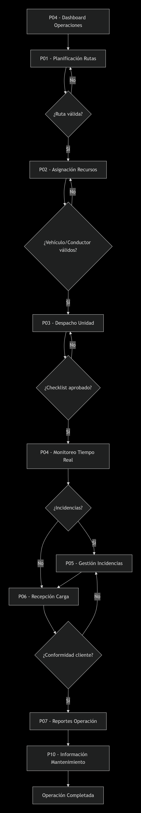
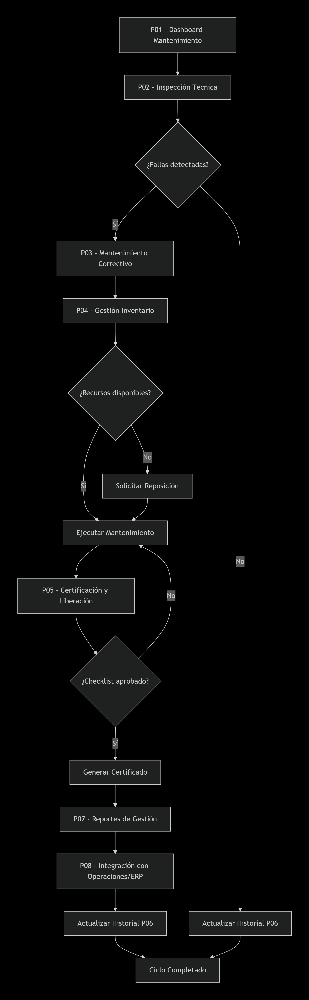

> [9. Preparación para Implementación](../../9.md) › [9.2. Alcance del Piloto (Funcionalidad primaria)](../9.2.md) › [9.2.4. Módulo 4 / Integrante 4](9.2.4.md)

# 9.2.4. Módulo 4 / Integrante 4


## Módulo de Gestión de Operaciones Terrestres

### Funcionalidad primaria del Módulo de Gestión de Operaciones Terrestres

#### Flujo elegido: Planificación y Ejecución Completa de Transporte Terrestre

**Descripción del flujo:** El flujo inicia en el *Dashboard de Operaciones Terrestres (P04)*, donde el supervisor visualiza el estado de los vehículos en tiempo real y crea una nueva operación de transporte. Se procede a la planificación de rutas (P01), donde se seleccionan y evalúan alternativas basadas en tiempos, costos y restricciones legales. Una vez confirmada la ruta óptima, se asigna vehículo y conductor (P02), validando el estado técnico del vehículo y las certificaciones del conductor. Si no cumplen los requisitos, se deben seleccionar alternativas. Con la asignación confirmada, se realiza el despacho de la unidad (P03) mediante checklist de seguridad. Durante el transporte, se monitorea en tiempo real (P04) y se gestionan posibles incidencias (P05). Al llegar a destino, se registra la recepción de carga (P06) con validación del cliente. Finalmente, se generan reportes de la operación (P07) y se comparte información con mantenimiento logístico (P10).

---

#### Justificación de la Elección

La elección del flujo de Planificación y Ejecución Completa de Transporte Terrestre como funcionalidad primaria se basa en las siguientes razones:

1. **Integración de Procesos Clave:** Este flujo integra todos los procesos críticos del transporte terrestre: planificación de rutas, asignación de recursos, control de seguridad, monitoreo en tiempo real y cierre operativo.

2. **Ciclo Operativo Completo:** Representa el ciclo completo de una operación terrestre, desde la planificación hasta la finalización y reporte, demostrando la capacidad del sistema para gestionar operaciones end-to-end.

3. **Validaciones en Tiempo Real:** Incluye validaciones críticas como estado de vehículos, certificaciones de conductores, checklist de seguridad y detección de incidencias.

4. **Integración con Múltiples Módulos:** Conecta con módulos de monitoreo, mantenimiento, documentación y reservas, demostrando la interoperabilidad del sistema.

5. **No CRUD:** Supera operaciones básicas CRUD al involucrar procesos complejos de planificación, ejecución y control con múltiples validaciones y flujos alternativos.

---

#### Mapeo de Requisitos Funcionales

| **Requerimiento** | **Implementado en el Flujo** |
|--|--|
| RF01 | Se planifican rutas considerando tiempos, costos y restricciones legales en P01 |
| RF02 | Se asignan vehículos y conductores validando estado técnico y certificaciones en P02 |
| RF03 | Se autoriza y registra despacho mediante checklist de seguridad en P03 |
| RF04 | Se realiza seguimiento en tiempo real con detección de desvíos en P04 |
| RF05 | Se gestionan incidencias durante el transporte en P05 |
| RF06 | Se registra recepción de carga con validación de conformidad en P06 |
| RF07 | Se generan reportes de transporte con métricas de operación en P07 |
| RF10 | Se comparte información de estado de vehículos con mantenimiento en P10 |

---

#### Interfaces de Usuario Incluidas

**Pantallas Principales Implementadas:**

- **P01 - Planificación de Rutas de Transporte (CU01)**
  - Consultar órdenes de transporte pendientes
  - Evaluar alternativas de rutas con tiempos y costos
  - Seleccionar ruta óptima considerando restricciones legales
  - Confirmar planificación y notificar a módulos relacionados

- **P02 - Asignación de Vehículos y Conductores (CU02)**
  - Listar vehículos disponibles con estado operativo
  - Validar mantenimiento vigente y certificaciones
  - Asignar conductor y vehículo compatibles
  - Generar orden de despacho vinculada

- **P03 - Autorización y Despacho de Unidades (CU03)**
  - Realizar checklist de seguridad completo
  - Validar cumplimiento de todos los puntos de seguridad
  - Autorizar despacho supervisor
  - Registrar fecha/hora de salida

- **P04 - Seguimiento en Tiempo Real (CU04)**
  - Visualizar ubicación actual de flota
  - Detectar desvíos y retrasos automáticamente
  - Monitorear múltiples vehículos simultáneamente
  - Recibir alertas por incumplimientos de ruta

- **P05 - Gestión de Incidencias (CU05)**
  - Reportar incidencias desde aplicación móvil
  - Evaluar gravedad y prioridad de incidentes
  - Notificar áreas correspondientes automáticamente
  - Generar planes de acción según tipo de incidencia

- **P06 - Registro de Recepción de Carga (CU06)**
  - Validar conformidad de carga con cliente
  - Registrar firma digital o confirmación física
  - Gestionar no conformidades y daños
  - Cerrar operación terrestre

- **P07 - Generación de Reportes (CU07)**
  - Configurar parámetros y períodos de reporte
  - Generar métricas de puntualidad y eficiencia
  - Exportar reportes en múltiples formatos
  - Analizar tendencias y desempeño de flota

- **P10 - Información a Mantenimiento Logístico (CU10)**
  - Detectar necesidades de mantenimiento automáticamente
  - Generar solicitudes de servicio preventivo y correctivo
  - Compartir historial de incidencias por vehículo
  - Sincronizar con sistema CMMS

---

#### Consultas Principales

## 1. **Dashboard de Operaciones Terrestres Activas**
```sql
SELECT 
    ot.codigo AS codigo_operacion,
    eo.nombre AS estado_operacion,
    v.placa AS vehiculo_asignado,
    c.nombre AS conductor_asignado,
    r.distancia_total,
    ot.fecha_inicio,
    ot.fecha_fin_estimada,
    ot.porcentaje_avance,
    ot.ubicacion_actual
FROM operaciones_terrestres.OperacionTerrestre ot
INNER JOIN operaciones_terrestres.EstadoOperacion eo ON ot.id_estado_operacion = eo.id_estado_operacion
INNER JOIN operaciones_terrestres.Vehiculo v ON ot.id_vehiculo = v.id_vehiculo
INNER JOIN operaciones_terrestres.Conductor c ON ot.id_conductor = c.id_conductor
INNER JOIN operaciones_terrestres.Ruta r ON ot.id_ruta = r.id_ruta
WHERE ot.fecha_fin IS NULL 
AND eo.nombre IN ('En Progreso', 'En Ruta', 'Despachado')
ORDER BY ot.fecha_inicio DESC;
```

## 2. **Planificación de Rutas con Alternativas**
```sql
SELECT 
    r.codigo AS codigo_ruta,
    po.nombre AS punto_origen,
    pd.nombre AS punto_destino,
    r.distancia_total,
    r.tiempo_estimado,
    r.costo_estimado,
    r.combustible_estimado,
    r.restricciones_legales,
    COUNT(ri.id_incidente) AS incidentes_recientes,
    AVG(hr.tiempo_real) AS tiempo_promedio_historico
FROM operaciones_terrestres.Ruta r
INNER JOIN operaciones_terrestres.PuntoLogistico po ON r.id_punto_origen = po.id_punto_logistico
INNER JOIN operaciones_terrestres.PuntoLogistico pd ON r.id_punto_destino = pd.id_punto_logistico
LEFT JOIN operaciones_terrestres.RutaIncidente ri ON r.id_ruta = ri.id_ruta 
    AND ri.fecha_incidente >= CURRENT_DATE - INTERVAL '30 days'
LEFT JOIN operaciones_terrestres.HistorialRuta hr ON r.id_ruta = hr.id_ruta
WHERE po.nombre = 'Nombre Puerto Origen'
AND pd.nombre = 'Nombre Cliente Destino'
AND r.activa = true
GROUP BY r.id_ruta, r.codigo, po.nombre, pd.nombre, r.distancia_total, 
         r.tiempo_estimado, r.costo_estimado, r.combustible_estimado, r.restricciones_legales
ORDER BY r.costo_estimado ASC, r.tiempo_estimado ASC;
```

## 3. **Vehículos Disponibles con Validación de Estado**
```sql
SELECT 
    v.placa,
    v.modelo,
    v.capacidad_carga,
    v.capacidad_volumen,
    ev.nombre AS estado_vehiculo,
    em.nombre AS estado_mantenimiento,
    m.fecha_ultimo_mantenimiento,
    m.proximo_mantenimiento_km,
    v.kilometraje_actual,
    COUNT(cv.id_certificacion) AS certificaciones_activas,
    EXISTS (
        SELECT 1 FROM operaciones_terrestres.IncidenteVehiculo iv
        WHERE iv.id_vehiculo = v.id_vehiculo 
        AND iv.fecha_resolucion IS NULL
    ) AS tiene_incidentes_pendientes
FROM operaciones_terrestres.Vehiculo v
INNER JOIN operaciones_terrestres.EstadoVehiculo ev ON v.id_estado_vehiculo = ev.id_estado_vehiculo
INNER JOIN operaciones_terrestres.EstadoMantenimiento em ON v.id_estado_mantenimiento = em.id_estado_mantenimiento
LEFT JOIN operaciones_terrestres.Mantenimiento m ON v.id_vehiculo = m.id_vehiculo 
    AND m.fecha_ultimo_mantenimiento = (
        SELECT MAX(fecha_mantenimiento) 
        FROM operaciones_terrestres.Mantenimiento 
        WHERE id_vehiculo = v.id_vehiculo
    )
LEFT JOIN operaciones_terrestres.CertificacionVehiculo cv ON v.id_vehiculo = cv.id_vehiculo 
    AND cv.fecha_vencimiento >= CURRENT_DATE
WHERE ev.nombre = 'Disponible'
AND em.nombre = 'Optimo'
AND v.capacidad_carga >= capacidad_requerida
AND v.capacidad_volumen >= volumen_requerido
AND v.kilometraje_actual < m.proximo_mantenimiento_km
GROUP BY v.id_vehiculo, v.placa, v.modelo, v.capacidad_carga, v.capacidad_volumen, 
         ev.nombre, em.nombre, m.fecha_ultimo_mantenimiento, m.proximo_mantenimiento_km, v.kilometraje_actual
ORDER BY v.capacidad_carga DESC;
```

## 4. **Conductores Disponibles con Validación de Certificaciones**
```sql
SELECT 
    c.codigo,
    c.nombre,
    c.apellido,
    c.licencia_conducir,
    c.tipo_licencia,
    c.fecha_vencimiento_licencia,
    ec.nombre AS estado_conductor,
    COUNT(cc.id_certificacion) AS certificaciones_activas,
    ARRAY_AGG(DISTINCT cc.tipo_certificacion) AS tipos_certificacion,
    EXISTS (
        SELECT 1 FROM operaciones_terrestres.OperacionTerrestre ot
        WHERE ot.id_conductor = c.id_conductor 
        AND ot.fecha_fin IS NULL
    ) AS tiene_operacion_activa
FROM operaciones_terrestres.Conductor c
INNER JOIN operaciones_terrestres.EstadoConductor ec ON c.id_estado_conductor = ec.id_estado_conductor
LEFT JOIN operaciones_terrestres.CertificacionConductor cc ON c.id_conductor = cc.id_conductor 
    AND cc.fecha_vencimiento >= CURRENT_DATE
WHERE ec.nombre = 'Disponible'
AND c.fecha_vencimiento_licencia >= CURRENT_DATE
AND c.tipo_licencia IN ('A-III', 'A-IV', 'B-II')  -- Tipos requeridos para transporte pesado
GROUP BY c.id_conductor, c.codigo, c.nombre, c.apellido, c.licencia_conducir, 
         c.tipo_licencia, c.fecha_vencimiento_licencia, ec.nombre
HAVING COUNT(cc.id_certificacion) >= 2  -- Mínimo de certificaciones requeridas
ORDER BY c.nombre, c.apellido;
```

## 5. **Checklist de Seguridad por Vehículo**
```sql
SELECT 
    cs.id_checklist_seguridad,
    cs.descripcion,
    cs.es_obligatorio,
    cs.orden,
    cst.nombre AS tipo_checklist,
    evs.fecha_verificacion,
    evs.estado_verificacion,
    evs.observaciones
FROM operaciones_terrestres.ChecklistSeguridad cs
INNER JOIN operaciones_terrestres.ChecklistSeguridadTipo cst ON cs.id_tipo_checklist = cst.id_tipo_checklist
LEFT JOIN operaciones_terrestres.EstadoVerificacionSeguridad evs ON cs.id_checklist_seguridad = evs.id_checklist_seguridad 
    AND evs.id_vehiculo = (SELECT id_vehiculo FROM operaciones_terrestres.Vehiculo WHERE placa = 'placa_vehiculo')
    AND evs.fecha_verificacion = CURRENT_DATE
WHERE cs.activo = true
ORDER BY cs.orden;
```

## 6. **Registro de Despacho de Unidad**
```sql
-- Insertar registro de despacho
INSERT INTO operaciones_terrestres.Despacho (
    id_despacho,
    id_operacion_terrestre,
    fecha_despacho,
    id_supervisor,
    checklist_completado,
    observaciones_despacho
) VALUES (
    gen_random_uuid(),
    (SELECT id_operacion_terrestre FROM operaciones_terrestres.OperacionTerrestre WHERE codigo = 'codigo_operacion'),
    CURRENT_TIMESTAMP,
    (SELECT id_empleado FROM operaciones_terrestres.Empleado WHERE codigo = 'codigo_supervisor'),
    true,
    'Checklist de seguridad completado satisfactoriamente'
);

-- Actualizar estado de la operación
UPDATE operaciones_terrestres.OperacionTerrestre 
SET id_estado_operacion = (
    SELECT id_estado_operacion FROM operaciones_terrestres.EstadoOperacion WHERE nombre = 'En Ruta'
)
WHERE codigo = 'codigo_operacion';

-- Registrar detalles del checklist
INSERT INTO operaciones_terrestres.DetalleChecklistDespacho (
    id_detalle_checklist,
    id_despacho,
    id_checklist_seguridad,
    estado_verificacion,
    observaciones
)
SELECT 
    gen_random_uuid(),
    (SELECT id_despacho FROM operaciones_terrestres.Despacho 
     WHERE id_operacion_terrestre = (SELECT id_operacion_terrestre FROM operaciones_terrestres.OperacionTerrestre WHERE codigo = 'codigo_operacion')),
    cs.id_checklist_seguridad,
    'Aprobado',
    'Verificado correctamente'
FROM operaciones_terrestres.ChecklistSeguridad cs
WHERE cs.activo = true;
```

## 7. **Seguimiento en Tiempo Real con Alertas**
```sql
SELECT 
    ot.codigo AS operacion,
    v.placa AS vehiculo,
    c.nombre AS conductor,
    ot.ubicacion_actual,
    ot.velocidad_actual,
    ot.ultima_actualizacion_gps,
    ot.porcentaje_avance,
    r.tiempo_estimado,
    EXTRACT(EPOCH FROM (CURRENT_TIMESTAMP - ot.ultima_actualizacion_gps)) AS segundos_sin_actualizacion,
    CASE 
        WHEN EXTRACT(EPOCH FROM (CURRENT_TIMESTAMP - ot.ultima_actualizacion_gps)) > 300 THEN 'ALERTA: Sin señal GPS'
        WHEN ot.porcentaje_avance < (EXTRACT(EPOCH FROM (CURRENT_TIMESTAMP - ot.fecha_inicio)) / EXTRACT(EPOCH FROM (r.tiempo_estimado * INTERVAL '1 hour'))) * 100 * 0.8 THEN 'ALERTA: Retraso significativo'
        WHEN NOT EXISTS (
            SELECT 1 FROM operaciones_terrestres.UbicacionRuta ur 
            WHERE ur.id_ruta = ot.id_ruta 
            AND ST_DWithin(ot.ubicacion_actual, ur.ubicacion, 1000)  -- 1km de tolerancia
        ) THEN 'ALERTA: Fuera de ruta'
        ELSE 'Dentro de parámetros'
    END AS estado_operacion
FROM operaciones_terrestres.OperacionTerrestre ot
INNER JOIN operaciones_terrestres.Vehiculo v ON ot.id_vehiculo = v.id_vehiculo
INNER JOIN operaciones_terrestres.Conductor c ON ot.id_conductor = c.id_conductor
INNER JOIN operaciones_terrestres.Ruta r ON ot.id_ruta = r.id_ruta
WHERE ot.fecha_fin IS NULL
AND ot.id_estado_operacion IN (
    SELECT id_estado_operacion FROM operaciones_terrestres.EstadoOperacion 
    WHERE nombre IN ('En Ruta', 'Despachado')
);
```

## 8. **Registro de Incidencia durante Transporte**
```sql
-- Insertar incidencia
INSERT INTO operaciones_terrestres.Incidente (
    id_incidente,
    id_operacion_terrestre,
    tipo_incidente,
    gravedad,
    descripcion,
    ubicacion_incidente,
    fecha_incidente,
    estado_incidente
) VALUES (
    gen_random_uuid(),
    (SELECT id_operacion_terrestre FROM operaciones_terrestres.OperacionTerrestre WHERE codigo = 'codigo_operacion'),
    'Accidente',
    'Alta',
    'Colisión lateral con vehículo particular',
    ST_GeomFromText('POINT(-77.0428 -12.0464)', 4326),
    CURRENT_TIMESTAMP,
    'Reportada'
);

-- Notificar áreas correspondientes
INSERT INTO operaciones_terrestres.NotificacionIncidencia (
    id_notificacion,
    id_incidente,
    area_destino,
    mensaje,
    fecha_envio,
    estado_notificacion
) VALUES 
(gen_random_uuid(), 'id_incidente', 'Mantenimiento', 'Se requiere evaluación de daños en vehículo', CURRENT_TIMESTAMP, 'Enviada'),
(gen_random_uuid(), 'id_incidente', 'Monitoreo', 'Operación interrumpida por accidente', CURRENT_TIMESTAMP, 'Enviada'),
(gen_random_uuid(), 'id_incidente', 'Cliente', 'Retraso en entrega por incidente en ruta', CURRENT_TIMESTAMP, 'Enviada');

-- Actualizar estado de la operación si es crítico
UPDATE operaciones_terrestres.OperacionTerrestre 
SET id_estado_operacion = (
    SELECT id_estado_operacion FROM operaciones_terrestres.EstadoOperacion WHERE nombre = 'En Incidencia'
)
WHERE id_operacion_terrestre = 'id_operacion_terrestre';
```

## 9. **Registro de Recepción y Cierre de Operación**
```sql
-- Registrar recepción
INSERT INTO operaciones_terrestres.RecepcionCarga (
    id_recepcion,
    id_operacion_terrestre,
    fecha_recepcion,
    id_cliente,
    conformidad_carga,
    observaciones_recepcion,
    firma_digital
) VALUES (
    gen_random_uuid(),
    (SELECT id_operacion_terrestre FROM operaciones_terrestres.OperacionTerrestre WHERE codigo = 'codigo_operacion'),
    CURRENT_TIMESTAMP,
    (SELECT id_cliente FROM operaciones_terrestres.Cliente WHERE codigo = 'codigo_cliente'),
    true,
    'Carga recibida en perfecto estado',
    'firma_digital_base64'
);

-- Cerrar operación terrestre
UPDATE operaciones_terrestres.OperacionTerrestre 
SET 
    fecha_fin = CURRENT_TIMESTAMP,
    id_estado_operacion = (SELECT id_estado_operacion FROM operaciones_terrestres.EstadoOperacion WHERE nombre = 'Completada'),
    porcentaje_avance = 100
WHERE codigo = 'codigo_operacion';

-- Actualizar métricas del vehículo
UPDATE operaciones_terrestres.Vehiculo 
SET 
    kilometraje_actual = kilometraje_actual + (
        SELECT distancia_total FROM operaciones_terrestres.Ruta 
        WHERE id_ruta = (SELECT id_ruta FROM operaciones_terrestres.OperacionTerrestre WHERE codigo = 'codigo_operacion')
    )
WHERE id_vehiculo = (SELECT id_vehiculo FROM operaciones_terrestres.OperacionTerrestre WHERE codigo = 'codigo_operacion');
```

## 10. **Generación de Reportes de Desempeño**
```sql
SELECT 
    ot.codigo AS operacion,
    v.placa AS vehiculo,
    c.nombre AS conductor,
    r.distancia_total,
    ot.fecha_inicio,
    ot.fecha_fin,
    EXTRACT(EPOCH FROM (ot.fecha_fin - ot.fecha_inicio)) / 3600 AS duracion_real_horas,
    r.tiempo_estimado AS duracion_estimada_horas,
    CASE 
        WHEN EXTRACT(EPOCH FROM (ot.fecha_fin - ot.fecha_inicio)) / 3600 <= r.tiempo_estimado THEN 'Puntual'
        ELSE 'Con retraso'
    END AS estado_puntualidad,
    COUNT(i.id_incidente) AS total_incidentes,
    r.costo_estimado,
    r.combustible_estimado,
    ot.observaciones_cierre
FROM operaciones_terrestres.OperacionTerrestre ot
INNER JOIN operaciones_terrestres.Vehiculo v ON ot.id_vehiculo = v.id_vehiculo
INNER JOIN operaciones_terrestres.Conductor c ON ot.id_conductor = c.id_conductor
INNER JOIN operaciones_terrestres.Ruta r ON ot.id_ruta = r.id_ruta
LEFT JOIN operaciones_terrestres.Incidente i ON ot.id_operacion_terrestre = i.id_operacion_terrestre
WHERE ot.fecha_fin BETWEEN 'fecha_inicio' AND 'fecha_fin'
AND ot.id_estado_operacion = (SELECT id_estado_operacion FROM operaciones_terrestres.EstadoOperacion WHERE nombre = 'Completada')
GROUP BY ot.id_operacion_terrestre, ot.codigo, v.placa, c.nombre, r.distancia_total, 
         ot.fecha_inicio, ot.fecha_fin, r.tiempo_estimado, r.costo_estimado, r.combustible_estimado, ot.observaciones_cierre
ORDER BY ot.fecha_fin DESC;
```

---

### Flujo Técnico de Implementación



**Leyenda del Flujo:**
- **P04**: Dashboard con estado de flota y creación de operaciones
- **P01**: Planificación de rutas con alternativas y validaciones
- **P02**: Asignación de vehículos y conductores con verificaciones
- **P03**: Despacho mediante checklist de seguridad
- **P04**: Monitoreo continuo con detección de anomalías
- **P05**: Gestión de incidencias en tiempo real
- **P06**: Registro de recepción y validación con cliente
- **P07**: Generación de reportes de desempeño
- **P10**: Compartición de datos con mantenimiento logístico

Este flujo demuestra la capacidad del sistema para gestionar operaciones terrestres completas, integrando todas las funcionalidades críticas del módulo y asegurando la trazabilidad end-to-end del transporte.


# 9.2.4. Módulo 4.1 / Integrante 4

## Módulo de Gestión de Mantenimiento Logístico


### Funcionalidad primaria del Módulo de Gestión de Mantenimiento Logístico

#### Flujo elegido: Ciclo Completo de Mantenimiento desde Inspección hasta Liberación

**Descripción del flujo:** El flujo inicia en el *Dashboard de Mantenimiento (P01)*, donde el jefe de mantenimiento visualiza los activos con mantenimientos próximos y planes preventivos. Al detectarse una necesidad de mantenimiento (preventivo o por reporte de falla), se procede a la inspección técnica (P02) donde el técnico realiza el checklist y registra hallazgos. Si se detectan fallas críticas, el sistema bloquea automáticamente el activo. Luego se gestiona el mantenimiento correctivo (P03), asignando técnicos y recursos del inventario (P04). Durante la ejecución, se consumen repuestos y se registran actividades. Al finalizar, se procede a la certificación y liberación (P05) con validación del supervisor. El sistema actualiza el historial del activo (P06) y genera reportes de gestión (P07). Todo el proceso se sincroniza con operaciones y ERP (P08) para actualizar disponibilidad de activos.

---

#### Justificación de la Elección

La elección del flujo de Ciclo Completo de Mantenimiento como funcionalidad primaria se basa en las siguientes razones:

1. **Gestión Integral de Activos:** Abarca todo el ciclo de vida del mantenimiento, desde la detección hasta la liberación, demostrando capacidad completa de gestión.

2. **Integración de Procesos Clave:** Combina mantenimiento preventivo y correctivo, gestión de inventario, y procesos de calidad/seguridad.

3. **Validaciones Automáticas:** Incluye bloqueo automático por fallas críticas, validación de stock, y verificaciones de seguridad pre-liberación.

4. **Interoperabilidad:** Demuestra integración con múltiples sistemas (CMMS, ERP, módulos de operaciones) y flujo bidireccional de información.

5. **Cumplimiento Normativo:** Incluye procesos de certificación y trazabilidad requeridos por normativas internacionales.

---

#### Mapeo de Requisitos Funcionales

| **Requerimiento** | **Implementado en el Flujo** |
|--|--|
| RF01 | Planificación de mantenimientos preventivos basada en calendario y estado de activos en P01 |
| RF02 | Registro completo de inspecciones con checklist y hallazgos en P02 |
| RF03 | Gestión de mantenimientos correctivos con asignación de recursos en P03 |
| RF04 | Administración de inventario con control de niveles y reposición en P04 |
| RF05 | Certificación y liberación con validación de seguridad en P05 |
| RF06 | Mantenimiento de historial completo por activo en P06 |
| RF07 | Generación de reportes de disponibilidad y costos en P07 |
| RF08 | Integración con operaciones y ERP para sincronización en P08 |

---

#### Interfaces de Usuario Incluidas

**Pantallas Principales Implementadas:**

- **P01 - Planificación de Mantenimiento Preventivo (CU01)**
  - Visualizar activos con mantenimientos próximos
  - Programar mantenimientos por frecuencia y disponibilidad
  - Asignar responsables y recursos
  - Gestionar calendario de mantenimiento

- **P02 - Registro de Inspecciones Técnicas (CU02)**
  - Ejecutar checklist de inspección por activo
  - Registrar hallazgos y fallas detectadas
  - Clasificar gravedad de incidencias
  - Bloquear activos automáticamente por fallas críticas

- **P03 - Gestión de Mantenimiento Correctivo (CU03)**
  - Generar órdenes de trabajo correctivas
  - Asignar técnicos especializados
  - Gestionar recursos y tiempos de reparación
  - Actualizar estado de avance en tiempo real

- **P04 - Administración de Inventario (CU04)**
  - Controlar niveles de stock de repuestos
  - Generar alertas por stock crítico
  - Gestionar movimientos de inventario
  - Sincronizar con ERP para reposición

- **P05 - Certificación y Liberación (CU05)**
  - Validar checklist de liberación
  - Generar certificados digitales
  - Actualizar estado operativo del activo
  - Registrar evidencia de conformidad

- **P06 - Historial de Mantenimiento (CU06)**
  - Consultar historial completo por activo
  - Visualizar intervenciones preventivas y correctivas
  - Analizar tendencias y costos históricos
  - Exportar reportes de auditoría

- **P07 - Reportes de Mantenimiento (CU07)**
  - Generar métricas de disponibilidad y MTBF
  - Analizar costos de mantenimiento
  - Evaluar cumplimiento de planes preventivos
  - Reportar indicadores de gestión

- **P08 - Integración con Operaciones (CU08)**
  - Sincronizar estado de activos entre módulos
  - Recibir reportes de fallas desde operaciones
  - Compartir disponibilidad para planificación
  - Integrar costos con ERP corporativo

---

#### Consultas Principales

## 1. **Dashboard de Mantenimiento con Alertas**
```sql
SELECT 
    a.codigo AS activo,
    a.nombre AS nombre_activo,
    ta.nombre AS tipo_activo,
    ea.nombre AS estado_activo,
    pm.frecuencia,
    pm.fecha_ultimo_mantenimiento,
    pm.proximo_mantenimiento,
    DATEDIFF(pm.proximo_mantenimiento, CURRENT_DATE) AS dias_restantes,
    COUNT(om.id_operacion_mantenimiento) AS mantenimientos_pendientes,
    CASE 
        WHEN DATEDIFF(pm.proximo_mantenimiento, CURRENT_DATE) <= 7 THEN 'ALERTA: Mantenimiento próximo'
        WHEN EXISTS (
            SELECT 1 FROM mantenimiento_logistico.OperacionMantenimiento om2
            JOIN mantenimiento_logistico.OrdenMantenimiento ord ON om2.id_operacion_mantenimiento = ord.id_operacion_mantenimiento
            WHERE ord.id_estado_orden = (
                SELECT id_estado_orden FROM mantenimiento_logistico.EstadoOrden WHERE nombre = 'En ejecución'
            ) AND om2.id_solicitud_mantenimiento IN (
                SELECT id_solicitud_mantenimiento FROM mantenimiento_logistico.SolicitudMantenimiento 
                WHERE id_activo = a.id_activo
            )
        ) THEN 'EN MANTENIMIENTO'
        ELSE 'OPERATIVO'
    END AS estado_operacional
FROM mantenimiento_logistico.Activo a
INNER JOIN mantenimiento_logistico.TipoActivo ta ON a.id_tipo_activo = ta.id_tipo_activo
INNER JOIN mantenimiento_logistico.EstadoActivo ea ON a.id_estado_activo = ea.id_estado_activo
LEFT JOIN mantenimiento_logistico.PlanMantenimiento pm ON a.id_activo = pm.id_activo
LEFT JOIN mantenimiento_logistico.OperacionMantenimiento om ON pm.id_plan_mantenimiento = om.id_plan_mantenimiento
    AND om.id_operacion IN (
        SELECT id_operacion FROM mantenimiento_logistico.Operacion 
        WHERE fecha_fin IS NULL
    )
WHERE pm.id_estado_plan = (
    SELECT id_estado_plan FROM mantenimiento_logistico.EstadoPlan WHERE nombre = 'Activo'
)
GROUP BY a.id_activo, a.codigo, a.nombre, ta.nombre, ea.nombre, pm.frecuencia, 
         pm.fecha_ultimo_mantenimiento, pm.proximo_mantenimiento
ORDER BY dias_restantes ASC, mantenimientos_pendientes DESC;
```

## 2. **Checklist de Inspección Técnica**
```sql
SELECT 
    ci.id_item_checklist,
    cc.nombre AS categoria,
    ci.descripcion AS item,
    ci.es_obligatorio,
    ev.estado_verificacion,
    ev.observaciones,
    ev.gravedad_hallazgo,
    ev.fecha_verificacion,
    e.nombre || ' ' || e.apellido AS inspector
FROM mantenimiento_logistico.ChecklistItem ci
INNER JOIN mantenimiento_logistico.CategoriaChecklist cc ON ci.id_categoria_checklist = cc.id_categoria_checklist
INNER JOIN mantenimiento_logistico.Checklist ch ON cc.id_checklist = ch.id_checklist
INNER JOIN mantenimiento_logistico.ChecklistTipoActivo cta ON ch.id_checklist = cta.id_checklist
INNER JOIN mantenimiento_logistico.Activo a ON cta.id_tipo_activo = a.id_tipo_activo
LEFT JOIN mantenimiento_logistico.EstadoVerificacion ev ON ci.id_item_checklist = ev.id_item_checklist 
    AND ev.id_activo = a.id_activo
    AND ev.fecha_verificacion = CURRENT_DATE
LEFT JOIN mantenimiento_logistico.Empleado e ON ev.id_inspector = e.id_empleado
WHERE a.codigo = 'codigo_activo'
AND ch.activo = true
ORDER BY cc.orden, ci.orden;
```

## 3. **Generación de Orden de Trabajo Correctiva**
```sql
-- Crear solicitud de mantenimiento correctivo
INSERT INTO mantenimiento_logistico.SolicitudMantenimiento (
    id_solicitud_mantenimiento, 
    codigo, 
    descripcion_problema, 
    fecha_solicitud, 
    id_prioridad, 
    id_estado_solicitud, 
    id_responsable_solicitud, 
    id_activo
) VALUES (
    gen_random_uuid(),
    'SOL-' || TO_CHAR(CURRENT_DATE, 'YYYY-MM-DD') || '-001',
    'Falla detectada en inspección: ' || descripcion_falla,
    CURRENT_DATE,
    (SELECT id_prioridad FROM mantenimiento_logistico.Prioridad 
     WHERE nombre = CASE 
        WHEN gravedad = 'Crítica' THEN 'Alta' 
        ELSE 'Media' 
     END),
    (SELECT id_estado_solicitud FROM mantenimiento_logistico.EstadoSolicitud WHERE nombre = 'Aprobada'),
    (SELECT id_responsable_solicitud FROM mantenimiento_logistico.ResponsableSolicitud 
     WHERE id_empleado = inspector_id),
    (SELECT id_activo FROM mantenimiento_logistico.Activo WHERE codigo = 'codigo_activo')
) RETURNING id_solicitud_mantenimiento;

-- Bloquear activo si es crítica
UPDATE mantenimiento_logistico.Activo 
SET id_estado_activo = (
    SELECT id_estado_activo FROM mantenimiento_logistico.EstadoActivo WHERE nombre = 'En mantenimiento'
)
WHERE codigo = 'codigo_activo'
AND gravedad = 'Crítica';
```

## 4. **Asignación de Técnicos y Recursos**
```sql
SELECT 
    t.id_tecnico,
    e.nombre || ' ' || e.apellido AS tecnico,
    t.especialidad,
    COUNT(omt.id_operacion_mantenimiento) AS asignaciones_activas,
    ARRAY_AGG(DISTINCT cc.tipo_certificacion) AS certificaciones,
    EXISTS (
        SELECT 1 FROM mantenimiento_logistico.OperacionMantenimientoTecnico omt2
        INNER JOIN mantenimiento_logistico.OperacionMantenimiento om2 ON omt2.id_operacion_mantenimiento = om2.id_operacion_mantenimiento
        INNER JOIN mantenimiento_logistico.Operacion o2 ON om2.id_operacion = o2.id_operacion
        WHERE omt2.id_tecnico = t.id_tecnico 
        AND o2.fecha_fin IS NULL
    ) AS tiene_operaciones_activas
FROM mantenimiento_logistico.Tecnico t
INNER JOIN mantenimiento_logistico.Empleado e ON t.id_empleado = e.id_empleado
LEFT JOIN mantenimiento_logistico.OperacionMantenimientoTecnico omt ON t.id_tecnico = omt.id_tecnico
    AND omt.fecha_asignacion >= CURRENT_DATE - INTERVAL '7 days'
LEFT JOIN mantenimiento_logistico.CertificacionConductor cc ON t.id_empleado = cc.id_conductor
    AND cc.fecha_vencimiento >= CURRENT_DATE
WHERE t.especialidad = 'especialidad_requerida'
GROUP BY t.id_tecnico, e.nombre, e.apellido, t.especialidad
HAVING COUNT(omt.id_operacion_mantenimiento) < 3  -- Máximo 3 asignaciones simultáneas
ORDER BY asignaciones_activas ASC;
```

## 5. **Gestión de Inventario con Alertas**
```sql
SELECT 
    r.codigo,
    r.nombre,
    r.stock,
    r.stock_minimo,
    CASE 
        WHEN r.stock = 0 THEN 'SIN STOCK'
        WHEN r.stock <= r.stock_minimo THEN 'STOCK CRÍTICO'
        WHEN r.stock <= r.stock_minimo * 1.5 THEN 'STOCK BAJO'
        ELSE 'STOCK SUFICIENTE'
    END AS estado_stock,
    COALESCE(SUM(omr.cantidad), 0) AS consumo_ultimo_mes,
    AVG(omr.precio_unitario) AS precio_promedio,
    COUNT(DISTINCT omr.id_operacion_mantenimiento) AS usos_ultimo_mes,
    (SELECT nombre FROM mantenimiento_logistico.Proveedor 
     WHERE id_proveedor = r.id_proveedor_principal) AS proveedor_principal
FROM mantenimiento_logistico.Repuesto r
LEFT JOIN mantenimiento_logistico.OperacionMantenimientoRepuesto omr ON r.id_repuesto = omr.id_repuesto
    AND omr.fecha_uso >= CURRENT_DATE - INTERVAL '30 days'
WHERE r.activo = true
GROUP BY r.id_repuesto, r.codigo, r.nombre, r.stock, r.stock_minimo, r.id_proveedor_principal
ORDER BY estado_stock, consumo_ultimo_mes DESC;
```

## 6. **Checklist de Liberación y Certificación**
```sql
SELECT 
    cl.id_item_liberacion,
    cl.descripcion,
    cl.es_obligatorio,
    evl.estado_verificacion,
    evl.observaciones,
    evl.fecha_verificacion,
    e.nombre || ' ' || e.apellido AS supervisor,
    CASE 
        WHEN evl.estado_verificacion = 'Aprobado' THEN '✅'
        WHEN evl.estado_verificacion = 'Rechazado' THEN '❌'
        ELSE '⏳'
    END AS icono_estado
FROM mantenimiento_logistico.ChecklistLiberacion cl
LEFT JOIN mantenimiento_logistico.EstadoVerificacionLiberacion evl ON cl.id_item_liberacion = evl.id_item_liberacion
    AND evl.id_operacion_mantenimiento = (
        SELECT id_operacion_mantenimiento FROM mantenimiento_logistico.OperacionMantenimiento 
        WHERE id_solicitud_mantenimiento = (
            SELECT id_solicitud_mantenimiento FROM mantenimiento_logistico.SolicitudMantenimiento 
            WHERE id_activo = (SELECT id_activo FROM mantenimiento_logistico.Activo WHERE codigo = 'codigo_activo')
            ORDER BY fecha_solicitud DESC LIMIT 1
        )
    )
LEFT JOIN mantenimiento_logistico.Empleado e ON evl.id_supervisor = e.id_empleado
WHERE cl.activo = true
ORDER BY cl.orden;
```

## 7. **Generación de Certificado Digital**
```sql
-- Actualizar estado del activo a operativo
UPDATE mantenimiento_logistico.Activo 
SET id_estado_activo = (
    SELECT id_estado_activo FROM mantenimiento_logistico.EstadoActivo WHERE nombre = 'Operativo'
)
WHERE codigo = 'codigo_activo';

-- Generar certificado digital
INSERT INTO mantenimiento_logistico.CertificadoMantenimiento (
    id_certificado,
    id_operacion_mantenimiento,
    codigo_certificado,
    fecha_emision,
    fecha_validez,
    id_supervisor,
    hash_seguridad,
    qr_code
) VALUES (
    gen_random_uuid(),
    (SELECT id_operacion_mantenimiento FROM mantenimiento_logistico.OperacionMantenimiento 
     WHERE id_solicitud_mantenimiento = (
        SELECT id_solicitud_mantenimiento FROM mantenimiento_logistico.SolicitudMantenimiento 
        WHERE id_activo = (SELECT id_activo FROM mantenimiento_logistico.Activo WHERE codigo = 'codigo_activo')
        ORDER BY fecha_solicitud DESC LIMIT 1
     )),
    'CERT-' || TO_CHAR(CURRENT_DATE, 'YYYYMMDD') || '-' || codigo_activo,
    CURRENT_DATE,
    CURRENT_DATE + INTERVAL '1 year',
    (SELECT id_empleado FROM mantenimiento_logistico.Empleado WHERE codigo = 'codigo_supervisor'),
    encode(sha256(('CERT-' || TO_CHAR(CURRENT_DATE, 'YYYYMMDD') || '-' || codigo_activo)::bytea), 'hex'),
    'qr_code_base64'
);

-- Cerrar orden de mantenimiento
UPDATE mantenimiento_logistico.OrdenMantenimiento 
SET 
    fecha_cierre = CURRENT_DATE,
    id_estado_orden = (SELECT id_estado_orden FROM mantenimiento_logistico.EstadoOrden WHERE nombre = 'Completada')
WHERE id_operacion_mantenimiento = (
    SELECT id_operacion_mantenimiento FROM mantenimiento_logistico.OperacionMantenimiento 
    WHERE id_solicitud_mantenimiento = (
        SELECT id_solicitud_mantenimiento FROM mantenimiento_logistico.SolicitudMantenimiento 
        WHERE id_activo = (SELECT id_activo FROM mantenimiento_logistico.Activo WHERE codigo = 'codigo_activo')
        ORDER BY fecha_solicitud DESC LIMIT 1
    )
);
```

## 8. **Historial Completo por Activo**
```sql
SELECT 
    a.codigo AS activo,
    a.nombre AS nombre_activo,
    sm.fecha_solicitud,
    tm.nombre AS tipo_mantenimiento,
    om.fecha_inicio,
    om.fecha_fin,
    eo.nombre AS estado_operacion,
    e.nombre || ' ' || e.apellido AS tecnico_asignado,
    t.especialidad,
    COUNT(DISTINCT omr.id_repuesto) AS repuestos_utilizados,
    SUM(omr.cantidad * omr.precio_unitario) AS costo_total,
    sm.descripcion_problema,
    GROUP_CONCAT(DISTINCT r.nombre) AS repuestos
FROM mantenimiento_logistico.Activo a
INNER JOIN mantenimiento_logistico.SolicitudMantenimiento sm ON a.id_activo = sm.id_activo
INNER JOIN mantenimiento_logistico.OperacionMantenimiento om ON sm.id_solicitud_mantenimiento = om.id_solicitud_mantenimiento
INNER JOIN mantenimiento_logistico.Operacion o ON om.id_operacion = o.id_operacion
INNER JOIN mantenimiento_logistico.EstadoOperacion eo ON o.id_estado_operacion = eo.id_estado_operacion
INNER JOIN mantenimiento_logistico.OrdenMantenimiento ord ON om.id_operacion_mantenimiento = ord.id_operacion_mantenimiento
INNER JOIN mantenimiento_logistico.TipoMantenimiento tm ON ord.id_tipo_mantenimiento = tm.id_tipo_mantenimiento
LEFT JOIN mantenimiento_logistico.OperacionMantenimientoTecnico omt ON om.id_operacion_mantenimiento = omt.id_operacion_mantenimiento
LEFT JOIN mantenimiento_logistico.Tecnico t ON omt.id_tecnico = t.id_tecnico
LEFT JOIN mantenimiento_logistico.Empleado e ON t.id_empleado = e.id_empleado
LEFT JOIN mantenimiento_logistico.OperacionMantenimientoRepuesto omr ON om.id_operacion_mantenimiento = omr.id_operacion_mantenimiento
LEFT JOIN mantenimiento_logistico.Repuesto r ON omr.id_repuesto = r.id_repuesto
WHERE a.codigo = 'codigo_activo'
GROUP BY a.id_activo, a.codigo, a.nombre, sm.fecha_solicitud, tm.nombre, om.fecha_inicio, 
         om.fecha_fin, eo.nombre, e.nombre, e.apellido, t.especialidad, sm.descripcion_problema
ORDER BY sm.fecha_solicitud DESC;
```

## 9. **Reportes de Indicadores de Gestión**
```sql
SELECT 
    -- Indicadores de disponibilidad
    COUNT(DISTINCT a.id_activo) AS total_activos,
    COUNT(DISTINCT CASE WHEN ea.nombre = 'Operativo' THEN a.id_activo END) AS activos_operativos,
    COUNT(DISTINCT CASE WHEN ea.nombre = 'En mantenimiento' THEN a.id_activo END) AS activos_en_mantenimiento,
    ROUND(
        COUNT(DISTINCT CASE WHEN ea.nombre = 'Operativo' THEN a.id_activo END) * 100.0 / 
        COUNT(DISTINCT a.id_activo), 2
    ) AS porcentaje_disponibilidad,
    
    -- Indicadores de mantenimiento preventivo
    COUNT(DISTINCT pm.id_plan_mantenimiento) AS planes_activos,
    COUNT(DISTINCT CASE WHEN pm.proximo_mantenimiento <= CURRENT_DATE THEN pm.id_plan_mantenimiento END) AS mantenimientos_vencidos,
    ROUND(
        COUNT(DISTINCT CASE WHEN pm.proximo_mantenimiento > CURRENT_DATE THEN pm.id_plan_mantenimiento END) * 100.0 / 
        COUNT(DISTINCT pm.id_plan_mantenimiento), 2
    ) AS porcentaje_cumplimiento_preventivo,
    
    -- Indicadores de costos
    COALESCE(SUM(omr.cantidad * omr.precio_unitario), 0) AS costo_mantenimiento_mes,
    COUNT(DISTINCT om.id_operacion_mantenimiento) AS intervenciones_mes,
    ROUND(
        COALESCE(SUM(omr.cantidad * omr.precio_unitario), 0) / 
        NULLIF(COUNT(DISTINCT om.id_operacion_mantenimiento), 0), 2
    ) AS costo_promedio_intervencion,
    
    -- Tiempos de respuesta
    AVG(EXTRACT(EPOCH FROM (om.fecha_inicio - sm.fecha_solicitud)) / 3600) AS tiempo_respuesta_promedio_horas,
    AVG(EXTRACT(EPOCH FROM (om.fecha_fin - om.fecha_inicio)) / 3600) AS duracion_promedio_mantenimiento_horas
    
FROM mantenimiento_logistico.Activo a
INNER JOIN mantenimiento_logistico.EstadoActivo ea ON a.id_estado_activo = ea.id_estado_activo
LEFT JOIN mantenimiento_logistico.PlanMantenimiento pm ON a.id_activo = pm.id_activo
    AND pm.id_estado_plan = (SELECT id_estado_plan FROM mantenimiento_logistico.EstadoPlan WHERE nombre = 'Activo')
LEFT JOIN mantenimiento_logistico.SolicitudMantenimiento sm ON a.id_activo = sm.id_activo
    AND sm.fecha_solicitud >= CURRENT_DATE - INTERVAL '30 days'
LEFT JOIN mantenimiento_logistico.OperacionMantenimiento om ON sm.id_solicitud_mantenimiento = om.id_solicitud_mantenimiento
LEFT JOIN mantenimiento_logistico.OperacionMantenimientoRepuesto omr ON om.id_operacion_mantenimiento = omr.id_operacion_mantenimiento
    AND omr.fecha_uso >= CURRENT_DATE - INTERVAL '30 days'
WHERE a.fecha_registro >= CURRENT_DATE - INTERVAL '1 year';
```

## 10. **Integración con Operaciones y ERP**
```sql
-- Sincronizar estado de activos con módulo de operaciones
INSERT INTO integracion.LogSincronizacion (
    id_log,
    modulo_origen,
    modulo_destino,
    tipo_operacion,
    datos,
    fecha_sincronizacion,
    estado
) VALUES (
    gen_random_uuid(),
    'MANTENIMIENTO',
    'OPERACIONES_TERRESTRES',
    'ACTUALIZACION_ESTADO_ACTIVO',
    json_build_object(
        'activo_codigo', a.codigo,
        'estado_anterior', ea_anterior.nombre,
        'estado_nuevo', ea_nuevo.nombre,
        'fecha_cambio', CURRENT_TIMESTAMP,
        'motivo', 'Mantenimiento completado - Certificado: ' || cm.codigo_certificado
    )::text,
    CURRENT_TIMESTAMP,
    'PENDIENTE'
)
FROM mantenimiento_logistico.Activo a
INNER JOIN mantenimiento_logistico.EstadoActivo ea_anterior ON a.id_estado_activo_anterior = ea_anterior.id_estado_activo
INNER JOIN mantenimiento_logistico.EstadoActivo ea_nuevo ON a.id_estado_activo = ea_nuevo.id_estado_activo
INNER JOIN mantenimiento_logistico.CertificadoMantenimiento cm ON a.id_activo = cm.id_activo
WHERE a.codigo = 'codigo_activo'
AND ea_nuevo.nombre = 'Operativo';

-- Sincronizar costos con ERP
INSERT INTO integracion.LogSincronizacion (
    id_log,
    modulo_origen,
    modulo_destino,
    tipo_operacion,
    datos,
    fecha_sincronizacion,
    estado
) VALUES (
    gen_random_uuid(),
    'MANTENIMIENTO',
    'ERP_CORPORATIVO',
    'REGISTRO_COSTO_MANTENIMIENTO',
    json_build_object(
        'orden_mantenimiento', ord.codigo,
        'activo', a.codigo,
        'fecha_intervencion', om.fecha_inicio,
        'costo_repuestos', COALESCE(SUM(omr.cantidad * omr.precio_unitario), 0),
        'costo_mano_obra', costo_mano_obra,
        'costo_total', COALESCE(SUM(omr.cantidad * omr.precio_unitario), 0) + costo_mano_obra,
        'centro_costo', 'MANTENIMIENTO_LOGISTICO'
    )::text,
    CURRENT_TIMESTAMP,
    'PENDIENTE'
)
FROM mantenimiento_logistico.OrdenMantenimiento ord
INNER JOIN mantenimiento_logistico.OperacionMantenimiento om ON ord.id_operacion_mantenimiento = om.id_operacion_mantenimiento
INNER JOIN mantenimiento_logistico.SolicitudMantenimiento sm ON om.id_solicitud_mantenimiento = sm.id_solicitud_mantenimiento
INNER JOIN mantenimiento_logistico.Activo a ON sm.id_activo = a.id_activo
LEFT JOIN mantenimiento_logistico.OperacionMantenimientoRepuesto omr ON om.id_operacion_mantenimiento = omr.id_operacion_mantenimiento
WHERE ord.codigo = 'codigo_orden'
GROUP BY ord.codigo, a.codigo, om.fecha_inicio, costo_mano_obra;
```

---

### Flujo Técnico de Implementación





**Leyenda del Flujo:**
- **P01**: Dashboard con planes preventivos y alertas
- **P02**: Inspección técnica con checklist y registro de fallas
- **P03**: Gestión de mantenimiento correctivo con asignación
- **P04**: Control de inventario y recursos
- **P05**: Certificación y liberación con validaciones
- **P06**: Historial completo y trazabilidad
- **P07**: Reportes de indicadores y costos
- **P08**: Integración con sistemas corporativos

Este flujo demuestra la capacidad del sistema para gestionar el ciclo completo de mantenimiento logístico, integrando procesos preventivos y correctivos, gestionando recursos, y asegurando la trazabilidad y cumplimiento normativo requerido en operaciones logísticas de clase mundial.


[⬅️ Anterior](../9.2.3/9.2.3.md) | [🏠 Home](../../../README.md) | [Siguiente ➡️](../9.2.5/9.2.5.md)